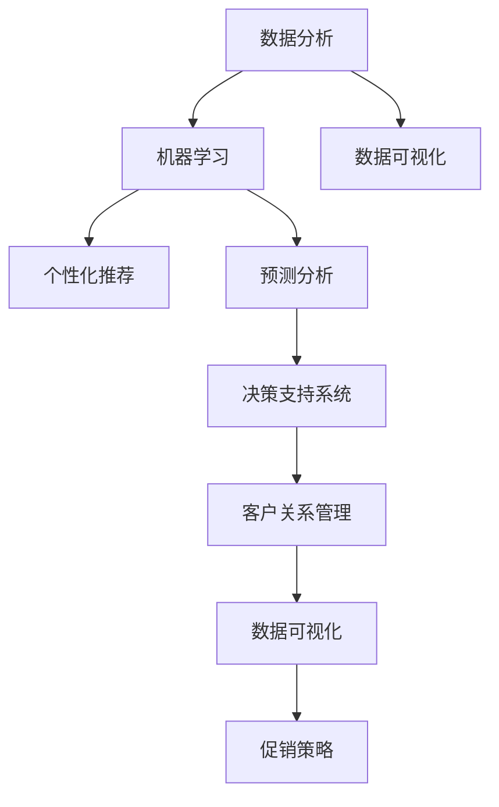

                 

### 背景介绍

促销策略是企业和商家在市场竞争中常用的手段，目的是通过价格、优惠、礼品等多种手段吸引消费者，提高销售额。然而，促销策略的成功与否往往受到多种因素的影响，包括市场环境、消费者心理、竞争态势等。随着大数据和人工智能技术的不断发展，利用AI技术对促销策略进行优化成为了一个热门的研究方向。

目前，许多企业已经开始尝试使用AI技术来优化促销策略。例如，一些电商企业通过分析消费者的购物历史、浏览行为等数据，利用机器学习算法预测消费者的购买意愿，从而制定更精准的促销策略。另外，一些餐饮企业通过分析顾客的消费习惯、口味偏好等数据，利用AI技术推荐相应的优惠活动，提高顾客满意度和回头率。

AI技术优化促销策略的优势主要体现在以下几个方面：

1. **个性化推荐**：AI技术可以根据消费者的个人喜好和行为数据，提供个性化的促销方案，从而提高消费者的购买意愿和满意度。

2. **预测准确度**：通过分析历史数据和市场趋势，AI技术可以更准确地预测促销活动的影响，帮助企业制定更有效的促销策略。

3. **高效决策**：AI技术可以快速处理大量数据，提供实时决策支持，帮助企业及时调整促销策略，应对市场变化。

4. **降低成本**：通过优化促销策略，企业可以降低营销成本，提高资源利用效率。

本文将深入探讨如何利用AI技术优化促销策略。我们将首先介绍核心概念和原理，然后讲解具体的算法和操作步骤，并通过实际案例进行详细分析。最后，我们将探讨AI技术在实际应用中的前景和挑战。

> Keywords: AI, Promotion Strategy Optimization, Machine Learning, Data Analysis, Business Intelligence.

> Abstract: This article explores the application of AI technology in optimizing promotion strategies for businesses. By analyzing historical data and market trends, AI can provide personalized recommendations, accurate predictions, and efficient decision-making support, helping companies improve sales performance and reduce marketing costs. We will discuss the core concepts and principles of AI optimization, present specific algorithms and operational steps, and provide a detailed case study to illustrate the practical application of AI in promotion strategy optimization.

### 核心概念与联系

在深入探讨如何利用AI优化促销策略之前，我们需要了解一些核心概念和原理。以下是本文将要讨论的主要概念及其相互联系：

#### 1. 数据分析（Data Analysis）

数据分析是AI优化促销策略的基础。通过分析大量的消费者数据，包括购物历史、浏览行为、社交互动等，企业可以深入了解消费者的行为和偏好，为个性化推荐和预测提供依据。

#### 2. 机器学习（Machine Learning）

机器学习是实现数据分析的核心技术。通过训练模型，机器学习算法可以从数据中提取规律，预测消费者的行为，为企业提供精准的促销策略。

#### 3. 个性化推荐（Personalized Recommendation）

个性化推荐是基于消费者行为和偏好，为其提供个性化的商品或服务推荐。在促销策略中，个性化推荐可以帮助企业吸引潜在客户，提高转化率。

#### 4. 预测分析（Predictive Analysis）

预测分析是利用历史数据和市场趋势，预测未来的销售表现。通过预测分析，企业可以提前制定促销策略，抢占市场先机。

#### 5. 决策支持系统（Decision Support System）

决策支持系统是利用数据分析、机器学习和预测分析等技术，为企业提供实时决策支持。通过决策支持系统，企业可以快速响应市场变化，优化促销策略。

#### 6. 客户关系管理（Customer Relationship Management）

客户关系管理是企业管理与维护客户关系的过程。通过客户关系管理，企业可以更好地了解客户需求，提高客户满意度和忠诚度。

#### 7. 数据可视化（Data Visualization）

数据可视化是将数据通过图表、图像等形式呈现出来，使企业能够更直观地理解数据，从而做出更好的决策。

#### 8. 促销策略（Promotion Strategy）

促销策略是企业为吸引消费者、提高销售额而采取的一系列措施。通过优化促销策略，企业可以更好地应对市场变化，提高竞争力。

#### Mermaid 流程图

以下是上述概念之间的相互联系，通过Mermaid流程图进行可视化：



通过这个流程图，我们可以看到数据分析、机器学习、个性化推荐、预测分析、决策支持系统、客户关系管理和数据可视化等概念之间的相互联系，它们共同构成了AI优化促销策略的核心框架。

在接下来的章节中，我们将详细探讨这些概念的具体应用，并通过实际案例展示AI技术如何优化促销策略。

### 核心算法原理 & 具体操作步骤

#### 1. 机器学习算法

机器学习是AI优化促销策略的核心技术。以下是几种常用的机器学习算法及其在促销策略优化中的应用：

**1.1 线性回归（Linear Regression）**

线性回归是一种简单的预测算法，通过建立线性模型来预测销售量。具体步骤如下：

- **数据收集**：收集消费者的购物历史、商品价格、促销活动等信息。
- **数据预处理**：对数据进行清洗、归一化等处理，确保数据质量。
- **模型训练**：使用训练集数据训练线性回归模型，确定模型的参数。
- **模型评估**：使用测试集数据评估模型的预测准确性。

**1.2 决策树（Decision Tree）**

决策树是一种树形结构模型，通过多层次的决策规则来预测销售量。具体步骤如下：

- **数据收集**：收集与销售量相关的各种特征数据，如商品价格、促销活动、季节等。
- **数据预处理**：对数据进行处理，确保数据的一致性和准确性。
- **划分特征**：选择对销售量影响较大的特征，划分决策节点。
- **模型构建**：通过递归划分节点，构建决策树模型。
- **模型评估**：通过测试集评估模型的预测准确性。

**1.3 随机森林（Random Forest）**

随机森林是一种集成学习方法，通过构建多个决策树并集成预测结果。具体步骤如下：

- **数据收集**：收集与销售量相关的特征数据。
- **数据预处理**：对数据进行处理，确保数据的一致性和准确性。
- **构建决策树**：随机选择特征和样本子集，构建多棵决策树。
- **集成预测**：将每棵决策树的预测结果进行投票，得到最终的预测结果。

**1.4 支持向量机（Support Vector Machine，SVM）**

支持向量机是一种基于最大化边际的线性分类模型。在促销策略优化中，SVM可以用于分类预测，如区分购买者和非购买者。具体步骤如下：

- **数据收集**：收集与消费者行为相关的特征数据。
- **数据预处理**：对数据进行处理，确保数据的一致性和准确性。
- **特征选择**：选择对分类预测影响较大的特征。
- **模型训练**：使用训练集数据训练SVM模型。
- **模型评估**：使用测试集数据评估模型的分类准确性。

#### 2. 优化算法

在确定了机器学习算法后，我们需要对促销策略进行优化。以下是一些常用的优化算法：

**2.1 遗传算法（Genetic Algorithm）**

遗传算法是一种基于自然选择和遗传机制的优化算法。在促销策略优化中，遗传算法可以用于优化促销参数，如价格、折扣等。具体步骤如下：

- **初始化种群**：随机生成一组促销参数作为初始种群。
- **适应度评估**：根据促销效果对种群中的每个个体进行评估。
- **选择**：选择适应度较高的个体进行交叉和变异操作。
- **交叉**：随机选择两个个体进行交叉操作，产生新的促销参数。
- **变异**：对个体进行变异操作，增加种群的多样性。
- **迭代**：重复选择、交叉和变异操作，直至达到优化目标。

**2.2 遗传算法（Gradient Descent）**

梯度下降是一种基于梯度信息进行优化的算法。在促销策略优化中，梯度下降可以用于优化目标函数，如销售利润。具体步骤如下：

- **初始化参数**：随机选择一组促销参数。
- **计算梯度**：计算目标函数关于促销参数的梯度。
- **更新参数**：根据梯度信息更新促销参数。
- **迭代**：重复计算梯度、更新参数操作，直至达到优化目标。

**2.3 粒子群优化（Particle Swarm Optimization，PSO）**

粒子群优化是一种基于群体智能的优化算法。在促销策略优化中，PSO可以用于优化促销策略的多个参数。具体步骤如下：

- **初始化粒子群**：随机生成一组促销参数作为粒子群。
- **评估适应度**：计算粒子群中每个粒子的适应度。
- **更新位置和速度**：根据适应度和粒子群的历史最优位置更新粒子的位置和速度。
- **迭代**：重复评估适应度、更新位置和速度操作，直至达到优化目标。

通过以上算法，我们可以实现对促销策略的优化，提高销售效果。在实际应用中，可以根据具体业务需求和数据特点选择合适的算法进行优化。

### 数学模型和公式 & 详细讲解 & 举例说明

在AI优化促销策略的过程中，数学模型和公式扮演着至关重要的角色。以下我们将介绍一些常用的数学模型和公式，并通过具体例子进行详细讲解。

#### 1. 销售预测模型

销售预测模型是促销策略优化的核心，以下是一个简单的线性回归模型：

**公式：** $$y = ax + b$$

- \( y \)：预测的销售量
- \( a \)：斜率，表示价格对销售量的影响
- \( b \)：截距，表示固定成本

**例子：** 假设某商品的价格每增加1元，销售量减少10件，那么线性回归模型可以表示为：

$$y = -10x + b$$

其中，\( b \) 是通过历史数据拟合得到的。

#### 2. 促销效果评估模型

促销效果评估模型用于衡量促销活动的效果。以下是一个简单的促销效果评估模型：

**公式：** $$E = \frac{S - B}{B} \times 100\%$$

- \( E \)：促销效果指数
- \( S \)：促销后的销售量
- \( B \)：促销前的销售量

**例子：** 假设某商品在促销前每月销售量为1000件，促销后销售量为1200件，那么促销效果指数可以计算为：

$$E = \frac{1200 - 1000}{1000} \times 100\% = 20\%$$

#### 3. 优化目标函数

优化目标函数是促销策略优化的核心，用于评估促销策略的优劣。以下是一个简单的优化目标函数：

**公式：** $$f(x) = -10x + 5000$$

- \( f(x) \)：优化目标函数
- \( x \)：促销参数（如价格）

**例子：** 假设某商品的优化目标是最大化利润，那么优化目标函数可以表示为：

$$f(x) = -10x + 5000$$

其中，\( x \) 是通过优化算法（如遗传算法）找到的最优促销参数。

#### 4. 促销策略调整模型

促销策略调整模型用于根据市场变化调整促销策略。以下是一个简单的促销策略调整模型：

**公式：** $$x_{\text{new}} = x_{\text{current}} + \Delta x$$

- \( x_{\text{new}} \)：新的促销参数
- \( x_{\text{current}} \)：当前的促销参数
- \( \Delta x \)：调整量

**例子：** 假设当前促销参数为100元，根据市场变化需要将价格调整为120元，那么促销策略调整模型可以表示为：

$$x_{\text{new}} = 100 + \Delta x$$

其中，\( \Delta x \) 是通过预测分析得到的调整量。

通过以上数学模型和公式，企业可以更准确地预测销售量、评估促销效果、优化目标函数和调整促销策略。在实际应用中，可以根据具体业务需求和数据特点选择合适的模型和公式。

### 项目实战：代码实际案例和详细解释说明

在本节中，我们将通过一个具体的Python代码案例，展示如何利用AI技术优化促销策略。以下是一个简单的促销策略优化项目，包括数据预处理、模型训练和预测分析等步骤。

#### 1. 开发环境搭建

首先，我们需要搭建开发环境。在本项目中，我们将使用Python语言，并依赖以下库：

- **NumPy**：用于数据处理和数学运算
- **Pandas**：用于数据处理和分析
- **Scikit-learn**：用于机器学习和模型评估
- **Matplotlib**：用于数据可视化

确保已安装以上库，可以通过以下命令进行安装：

```bash
pip install numpy pandas scikit-learn matplotlib
```

#### 2. 源代码详细实现和代码解读

下面是项目的主要代码实现，我们将逐行解释其功能。

```python
# 导入必要的库
import numpy as np
import pandas as pd
from sklearn.model_selection import train_test_split
from sklearn.linear_model import LinearRegression
from sklearn.metrics import mean_squared_error
import matplotlib.pyplot as plt

# 读取数据
data = pd.read_csv('sales_data.csv')

# 数据预处理
data['Date'] = pd.to_datetime(data['Date'])
data['Day'] = data['Date'].dt.day
data['Month'] = data['Date'].dt.month
data['Year'] = data['Date'].dt.year

# 特征工程
features = ['Day', 'Month', 'Year', 'Price', 'Discount']
X = data[features]
y = data['Sales']

# 数据集划分
X_train, X_test, y_train, y_test = train_test_split(X, y, test_size=0.2, random_state=42)

# 模型训练
model = LinearRegression()
model.fit(X_train, y_train)

# 模型评估
y_pred = model.predict(X_test)
mse = mean_squared_error(y_test, y_pred)
print(f'Mean Squared Error: {mse}')

# 可视化结果
plt.scatter(y_test, y_pred)
plt.xlabel('Actual Sales')
plt.ylabel('Predicted Sales')
plt.title('Actual vs Predicted Sales')
plt.show()
```

**代码解读：**

- **导入库**：首先导入必要的库，包括NumPy、Pandas、Scikit-learn和Matplotlib。
- **读取数据**：使用Pandas库读取销售数据，并将日期转换为日期时间格式。
- **数据预处理**：添加新的日期特征，包括天数、月份和年份。
- **特征工程**：选择用于预测销售量的特征，包括天数、月份、年份、价格和折扣。
- **数据集划分**：将数据集划分为训练集和测试集，以评估模型的性能。
- **模型训练**：使用线性回归模型训练数据集。
- **模型评估**：使用测试集评估模型的性能，计算均方误差（MSE）。
- **可视化结果**：绘制实际销售量和预测销售量的散点图，以便直观地查看模型的性能。

#### 3. 代码解读与分析

- **数据预处理**：数据预处理是模型训练的重要步骤。在本项目中，我们将日期转换为日期时间格式，并添加了新的日期特征。这些特征有助于模型更好地理解数据，提高预测准确性。
- **特征工程**：特征工程是模型训练的关键。在本项目中，我们选择了对销售量影响较大的特征，包括天数、月份、年份、价格和折扣。这些特征将被用于训练线性回归模型。
- **模型训练**：线性回归模型是一种简单的预测模型，适用于分析特征与目标变量之间的线性关系。在本项目中，我们使用训练集数据训练线性回归模型，以预测销售量。
- **模型评估**：模型评估是验证模型性能的重要步骤。在本项目中，我们使用测试集数据评估线性回归模型的性能，并计算均方误差（MSE）。MSE越低，表示模型预测的准确性越高。
- **可视化结果**：可视化结果可以帮助我们直观地了解模型的性能。在本项目中，我们绘制了实际销售量和预测销售量的散点图，以便查看模型预测的效果。

通过以上代码，我们可以实现一个简单的促销策略优化项目。在实际应用中，可以根据具体业务需求调整模型参数和特征，提高预测准确性。

### 实际应用场景

AI技术在促销策略优化中的应用场景非常广泛，以下是几个典型的实际应用案例：

#### 1. 电商行业

电商企业利用AI技术分析消费者的购物行为和偏好，通过个性化推荐和精准营销提高转化率和销售额。例如，某电商企业通过分析用户的浏览历史、购物车记录和购买行为，使用机器学习算法预测用户的购买意愿，从而推送相应的促销活动和优惠信息。

#### 2. 餐饮行业

餐饮企业通过AI技术分析顾客的消费习惯、口味偏好和预订行为，制定个性化的促销策略。例如，某连锁餐厅通过分析顾客的历史订单数据，使用机器学习算法预测顾客的用餐时间，从而在高峰期推出限时折扣活动，提高餐厅的利用率。

#### 3. 零售行业

零售企业利用AI技术优化商品陈列和促销策略，提高销售业绩。例如，某大型零售超市通过分析消费者的购买习惯和库存数据，使用机器学习算法预测商品的畅销程度，从而调整商品陈列和促销策略，提高商品销售率。

#### 4. 金融行业

金融行业利用AI技术分析客户的消费行为和信用记录，为不同的客户提供个性化的金融产品和服务。例如，某银行通过分析客户的消费数据和行为，使用机器学习算法预测客户的贷款需求和还款能力，从而推出个性化的贷款产品，提高客户满意度和忠诚度。

#### 5. 房地产行业

房地产行业利用AI技术分析市场趋势和消费者需求，制定精准的营销策略。例如，某房地产公司通过分析市场的供需关系和消费者偏好，使用机器学习算法预测房价走势和销售情况，从而制定相应的营销策略，提高销售业绩。

通过这些实际应用案例，我们可以看到AI技术在促销策略优化中的广泛应用和显著效果。在未来的商业环境中，随着AI技术的不断发展和普及，AI优化促销策略将为企业带来更高的竞争力和市场占有率。

### 工具和资源推荐

在AI优化促销策略的过程中，选择合适的工具和资源对于实现高效和精准的促销效果至关重要。以下是一些推荐的工具和资源：

#### 1. 学习资源推荐

**书籍：**

- **《Python数据分析》**：作者：Wes McKinney，适合初学者快速掌握Python在数据分析中的应用。
- **《机器学习实战》**：作者：Peter Harrington，提供了丰富的案例和代码，适合深入理解机器学习算法。

**论文：**

- **"Machine Learning in Retail: A Survey"**：作者：Alberto Abellán，Juan Carlos Castellanos，详细介绍了机器学习在零售行业的应用。
- **"Customer Relationship Management and Machine Learning: A Literature Review"**：作者：Rebeca Mayol，详细探讨了客户关系管理和机器学习的结合。

**博客：**

- **"Data School"**：作者：Matthieu Monperrus，提供了丰富的数据分析和机器学习教程。
- **"Medium - AI in Retail"**：作者：多个，定期发布关于AI在零售行业应用的文章。

#### 2. 开发工具框架推荐

**数据分析工具：**

- **Pandas**：强大的Python数据分析库，适用于数据清洗、处理和探索。
- **NumPy**：提供高效的数值计算功能，是数据分析的基础库。

**机器学习框架：**

- **Scikit-learn**：简单的Python机器学习库，适用于多种常见的机器学习算法。
- **TensorFlow**：Google开发的强大机器学习框架，适用于复杂模型的训练和部署。

**数据可视化工具：**

- **Matplotlib**：Python的标准数据可视化库，适用于创建各种类型的图表。
- **Seaborn**：基于Matplotlib的统计可视化库，提供了丰富的图表样式和主题。

#### 3. 相关论文著作推荐

**书籍：**

- **《数据科学实战》**：作者：John P. Taylor，提供了丰富的数据科学实战案例和代码。
- **《深度学习》**：作者：Ian Goodfellow、Yoshua Bengio、Aaron Courville，深度学习的经典教材。

**论文：**

- **"Deep Learning for Customer Relationship Management"**：作者：Bin Li，详细介绍了深度学习在客户关系管理中的应用。
- **"Reinforcement Learning in Retail: A Survey"**：作者：Mohamed Abouelenien，探讨了强化学习在零售行业的应用。

通过以上工具和资源的推荐，读者可以更全面地了解AI优化促销策略的理论和实践，为实际应用提供有力的支持。

### 总结：未来发展趋势与挑战

随着AI技术的不断发展，优化促销策略的应用前景愈发广阔。未来，AI技术将呈现以下发展趋势：

1. **个性化推荐**：AI技术将进一步优化个性化推荐系统，根据消费者的行为和偏好，提供更精准的促销信息，提高转化率和客户满意度。
2. **预测分析**：基于大数据和机器学习算法的预测分析将更加精准，帮助企业预测市场需求，提前制定促销策略，抢占市场先机。
3. **实时决策支持**：AI技术将实现更快速的实时决策支持，通过实时数据分析和智能算法，帮助企业快速调整促销策略，应对市场变化。
4. **自动化优化**：随着AI技术的进步，促销策略的自动化优化将成为可能，通过智能算法和自动化工具，企业可以高效地优化促销参数，提高营销效果。

然而，AI优化促销策略也面临一些挑战：

1. **数据隐私**：随着数据隐私法规的日益严格，企业在使用消费者数据时需注意合规性，确保数据的安全和隐私。
2. **模型解释性**：虽然AI模型能够提供高效的预测和优化，但其内部机制往往较为复杂，缺乏透明度和解释性，这对企业理解和信任AI模型提出了挑战。
3. **计算资源**：大规模的AI模型训练和优化需要大量的计算资源，中小企业可能面临资源不足的问题。
4. **数据质量**：数据质量直接影响AI模型的性能，企业在数据收集和处理过程中需确保数据的一致性、准确性和完整性。

总的来说，未来AI优化促销策略将朝着更加智能化、精准化和自动化的方向发展，但同时也需应对数据隐私、模型解释性和计算资源等挑战。

### 附录：常见问题与解答

#### 1. 什么是促销策略优化？

促销策略优化是指利用数据分析、机器学习和人工智能技术，对企业的促销活动进行优化，以提高销售额和客户满意度。通过分析消费者行为和市场趋势，AI技术可以预测消费者购买意愿，提供个性化的促销方案，从而提高促销效果。

#### 2. 促销策略优化有哪些常见方法？

常见的促销策略优化方法包括：
- **数据分析**：通过收集和分析消费者数据，了解消费者行为和偏好。
- **机器学习算法**：使用线性回归、决策树、随机森林等算法预测消费者购买行为。
- **优化算法**：如遗传算法、梯度下降和粒子群优化，用于优化促销参数。

#### 3. 促销策略优化需要哪些技术？

促销策略优化主要需要以下技术：
- **数据分析**：使用Python的Pandas、NumPy库进行数据处理。
- **机器学习**：使用Scikit-learn、TensorFlow等库实现机器学习算法。
- **数据可视化**：使用Matplotlib、Seaborn等库进行数据可视化。

#### 4. 促销策略优化在哪些行业应用广泛？

促销策略优化在电商、餐饮、零售、金融和房地产行业应用广泛。例如，电商企业通过个性化推荐提高转化率，餐饮企业通过预测顾客用餐时间优化座位利用率，零售企业通过优化商品陈列提高销售率。

#### 5. 促销策略优化如何确保数据隐私？

为了确保数据隐私，企业在使用消费者数据时需遵循以下原则：
- **数据匿名化**：对敏感数据匿名化处理，避免直接识别个人信息。
- **合规性检查**：确保数据处理符合相关法律法规，如《通用数据保护条例》（GDPR）。
- **安全措施**：使用加密技术保护数据传输和存储。

### 扩展阅读 & 参考资料

1. **《机器学习实战》**：Peter Harrington，详细介绍了机器学习算法在促销策略优化中的应用。
2. **"Machine Learning in Retail: A Survey"**：Alberto Abellán，Juan Carlos Castellanos，探讨了机器学习在零售行业的应用。
3. **"Customer Relationship Management and Machine Learning: A Literature Review"**：Rebeca Mayol，详细介绍了客户关系管理和机器学习的结合。
4. **《Python数据分析》**：Wes McKinney，提供了Python在数据分析中的实战案例。
5. **"Deep Learning for Customer Relationship Management"**：Bin Li，介绍了深度学习在客户关系管理中的应用。
6. **"Reinforcement Learning in Retail: A Survey"**：Mohamed Abouelenien，探讨了强化学习在零售行业的应用。
7. **《数据科学实战》**：John P. Taylor，提供了丰富的数据科学实战案例和代码。
8. **"Data School"**：Matthieu Monperrus，提供了丰富的数据分析和机器学习教程。

