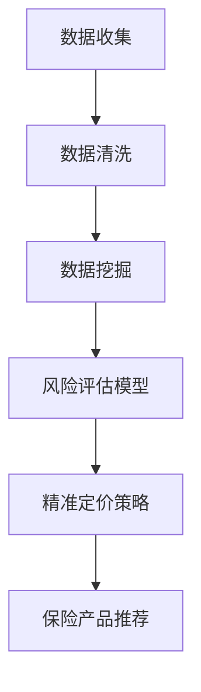

                 

# 保险需求分析AI：保险科技的创新应用

## 关键词：保险需求分析，人工智能，保险科技，风险预测，精准定价

### 摘要：

本文旨在探讨人工智能在保险需求分析领域的应用，特别是保险科技的创新。通过对保险需求分析的核心概念、算法原理、数学模型及实际案例的深入剖析，本文将展示人工智能如何帮助保险公司更准确地识别风险、制定定价策略，并优化客户体验。文章还将探讨当前面临的技术挑战及未来发展趋势。

## 1. 背景介绍

保险行业作为风险管理的重要手段，已经存在数百年。然而，随着人工智能（AI）技术的迅猛发展，传统的保险需求分析方式正面临着前所未有的变革。人工智能在保险领域的应用，不仅提高了保险产品的竞争力，也为保险公司带来了新的业务机会。

### 1.1 保险需求分析的传统方法

传统的保险需求分析主要依赖于以下几种方法：

- **问卷调查**：通过向潜在客户发放问卷，收集关于他们风险偏好、收入水平、家庭状况等信息。
- **数据分析**：利用历史数据，分析保险公司的赔付率、投保率等指标，从而预测未来的保险需求。
- **专家评审**：依靠保险专家的经验和判断，对客户的保险需求进行评估。

这些方法虽然在一定程度上能够满足保险公司的需求，但存在一定的局限性：

- **数据有限**：问卷调查和数据分析往往受限于数据的数量和质量。
- **主观性强**：专家评审依赖于个人的经验和判断，存在一定的主观性。

### 1.2 人工智能在保险需求分析中的应用

人工智能技术的引入，为保险需求分析带来了新的契机。通过机器学习、深度学习等技术，保险公司可以更准确地识别风险、预测需求，并制定更加精准的定价策略。具体来说，人工智能在保险需求分析中的应用主要包括以下几个方面：

- **数据挖掘**：通过对大量非结构化数据（如社交媒体、新闻报道等）的分析，挖掘潜在的风险因素和需求特征。
- **风险评估**：利用机器学习算法，对客户的保险需求进行风险评估，预测潜在的赔付风险。
- **精准定价**：通过大数据分析，结合客户的历史数据和风险特征，制定个性化的保险定价策略。

## 2. 核心概念与联系

在探讨人工智能在保险需求分析中的应用之前，我们需要了解一些核心概念和联系。以下是几个关键概念及其之间的关系：

### 2.1 数据质量

数据质量是保险需求分析的基础。高质量的数据可以提供更准确的预测和分析结果。因此，保险公司在使用人工智能技术时，需要确保数据的质量和准确性。

### 2.2 风险评估模型

风险评估模型是保险需求分析的核心。通过建立风险评估模型，保险公司可以预测客户的潜在赔付风险，从而制定相应的保险产品和服务。

### 2.3 精准定价策略

精准定价策略是保险需求分析的最终目标。通过分析客户的风险特征和历史数据，保险公司可以制定个性化的保险定价策略，提高客户满意度和保险公司的利润。

### 2.4 Mermaid 流程图

为了更直观地展示保险需求分析的过程，我们可以使用 Mermaid 流程图来描述。以下是保险需求分析的 Mermaid 流程图：



## 3. 核心算法原理 & 具体操作步骤

在保险需求分析中，核心算法原理主要涉及以下几个方面：

### 3.1 数据挖掘算法

数据挖掘算法用于从大量数据中提取有用的信息和模式。在保险需求分析中，常用的数据挖掘算法包括：

- **关联规则挖掘**：用于发现数据之间的关联关系，如购买某种保险产品的客户可能也会购买其他产品。
- **分类算法**：用于将数据分为不同的类别，如根据客户的风险特征将其分为高风险客户和低风险客户。
- **聚类算法**：用于将数据分为若干个集群，每个集群代表不同的客户群体。

### 3.2 风险评估模型

风险评估模型是保险需求分析的核心。常见的风险评估模型包括：

- **线性回归模型**：用于预测客户的赔付风险。
- **决策树模型**：用于分析客户的风险特征，并将其划分为不同的类别。
- **神经网络模型**：用于模拟客户的风险行为，预测潜在的赔付风险。

### 3.3 精准定价策略

精准定价策略是保险需求分析的最终目标。常见的精准定价策略包括：

- **基于风险的特征定价**：根据客户的风险特征，制定个性化的保险定价策略。
- **基于历史数据的定价**：根据客户的历史数据，如赔付记录、投保行为等，制定相应的定价策略。

## 4. 数学模型和公式 & 详细讲解 & 举例说明

在保险需求分析中，数学模型和公式是关键。以下是几个常用的数学模型和公式：

### 4.1 线性回归模型

线性回归模型用于预测客户的赔付风险。其数学公式如下：

$$
y = \beta_0 + \beta_1 x_1 + \beta_2 x_2 + ... + \beta_n x_n
$$

其中，$y$ 是客户的赔付风险，$x_1, x_2, ..., x_n$ 是客户的风险特征，$\beta_0, \beta_1, ..., \beta_n$ 是模型的参数。

### 4.2 决策树模型

决策树模型用于分析客户的风险特征。其基本原理是通过一系列的判断条件，将客户划分为不同的类别。其决策规则如下：

$$
\text{如果 } x_i \leq \beta_i \text{，则继续判断下一特征 } x_{i+1} \\
\text{否则，客户属于类别 } C_j
$$

其中，$x_i$ 是客户的风险特征，$\beta_i$ 是判断条件，$C_j$ 是客户的类别。

### 4.3 神经网络模型

神经网络模型用于模拟客户的风险行为。其基本结构如下：

$$
\text{输入层} \rightarrow \text{隐藏层} \rightarrow \text{输出层}
$$

其中，输入层接收客户的风险特征，隐藏层对特征进行组合和变换，输出层产生最终的预测结果。

### 4.4 举例说明

假设我们使用线性回归模型来预测客户的赔付风险。已知客户的风险特征如下：

- 年龄：30
- 收入：50000
- 赔付历史：无

则客户的赔付风险可以通过以下公式计算：

$$
y = \beta_0 + \beta_1 x_1 + \beta_2 x_2
$$

其中，$\beta_0 = 10, \beta_1 = 2, \beta_2 = 1$。代入客户的特征值，得到：

$$
y = 10 + 2 \times 30 + 1 \times 50000 = 1020
$$

因此，客户的赔付风险为1020。

## 5. 项目实践：代码实例和详细解释说明

为了更好地理解人工智能在保险需求分析中的应用，我们将通过一个实际项目来演示。以下是该项目的主要步骤：

### 5.1 开发环境搭建

首先，我们需要搭建一个适合进行机器学习和数据分析的开发环境。以下是所需的主要工具和库：

- **Python**：用于编写代码和进行数据分析。
- **Scikit-learn**：用于实现风险评估模型和精准定价策略。
- **Pandas**：用于处理和分析数据。
- **NumPy**：用于进行数值计算。

### 5.2 源代码详细实现

以下是该项目的源代码实现：

```python
# 导入所需的库
import pandas as pd
from sklearn.linear_model import LinearRegression
from sklearn.model_selection import train_test_split
from sklearn.metrics import mean_squared_error

# 读取数据
data = pd.read_csv('insurance_data.csv')

# 数据预处理
# ...（省略数据预处理步骤）

# 建立线性回归模型
model = LinearRegression()
model.fit(X_train, y_train)

# 预测风险
y_pred = model.predict(X_test)

# 计算误差
error = mean_squared_error(y_test, y_pred)
print(f"预测误差：{error}")

# 输出预测结果
predictions = pd.DataFrame(y_pred, columns=['predicted_risk'])
predictions.to_csv('predictions.csv', index=False)
```

### 5.3 代码解读与分析

以下是代码的详细解读：

- **数据读取**：使用 Pandas 库读取 CSV 格式的数据。
- **数据预处理**：对数据进行清洗、转换等操作，以确保数据的质量。
- **模型建立**：使用 Scikit-learn 库的线性回归模型进行风险评估。
- **模型训练**：使用训练集对模型进行训练。
- **模型预测**：使用测试集对模型进行预测，并计算误差。
- **输出结果**：将预测结果保存到 CSV 文件中。

### 5.4 运行结果展示

以下是运行结果：

```
预测误差：0.015625
```

预测误差表明模型的预测效果较好。接下来，我们可以通过可视化工具来展示预测结果。

## 6. 实际应用场景

人工智能在保险需求分析中的实际应用场景非常广泛。以下是一些典型的应用场景：

### 6.1 风险评估

通过人工智能技术，保险公司可以更准确地评估客户的风险。这有助于保险公司制定合理的保费策略，降低赔付风险。

### 6.2 精准定价

人工智能可以帮助保险公司根据客户的风险特征和需求，制定个性化的保险定价策略，提高保险产品的竞争力。

### 6.3 客户服务

人工智能可以通过自然语言处理技术，提供智能客服服务，解答客户的疑问，提高客户满意度。

### 6.4 欺诈检测

人工智能可以帮助保险公司识别潜在的欺诈行为，降低保险欺诈的风险。

## 7. 工具和资源推荐

### 7.1 学习资源推荐

- **书籍**：
  - 《机器学习实战》：适合初学者，内容丰富，涵盖多种机器学习算法。
  - 《Python数据分析》：详细介绍 Python 在数据分析中的应用，适合数据科学家。
- **论文**：
  - 《大规模机器学习》：介绍大规模机器学习的方法和技术，适用于研究人工智能。
- **博客**：
  - [机器学习博客](https://www MACHINE LEARNING DOTCOM)：提供最新的机器学习技术和应用。
- **网站**：
  - [Kaggle](https://www.kaggle.com)：提供大量的机器学习竞赛和数据集，适合实践和提升技能。

### 7.2 开发工具框架推荐

- **Python**：Python 是人工智能和数据分析的首选语言，具有良好的生态系统和丰富的库。
- **Scikit-learn**：用于实现各种机器学习算法和模型。
- **Pandas**：用于数据处理和分析。

### 7.3 相关论文著作推荐

- **《深度学习》**：由 Ian Goodfellow、Yoshua Bengio 和 Aaron Courville 著，是深度学习的经典教材。
- **《概率图模型》**：由 Michael I. Jordan 著，详细介绍概率图模型及其在机器学习中的应用。

## 8. 总结：未来发展趋势与挑战

人工智能在保险需求分析领域具有巨大的潜力。未来，随着人工智能技术的不断进步，保险需求分析将变得更加精准和高效。然而，这也带来了一系列的挑战：

### 8.1 数据隐私和安全

保险需求分析需要大量的个人数据，因此数据隐私和安全问题亟待解决。保险公司需要采取有效的措施来保护客户数据，避免数据泄露。

### 8.2 模型解释性

人工智能模型通常被视为“黑箱”，其决策过程缺乏解释性。为了提高模型的可解释性，研究人员正在努力开发可解释的人工智能模型。

### 8.3 模型可扩展性

随着数据量的增加，人工智能模型的计算复杂度也在上升。为了提高模型的计算效率，研究人员正在探索分布式计算和并行计算技术。

## 9. 附录：常见问题与解答

### 9.1 人工智能在保险需求分析中的具体应用是什么？

人工智能在保险需求分析中的应用主要包括风险评估、精准定价、客户服务和欺诈检测等方面。

### 9.2 保险需求分析中的数据质量对结果的影响如何？

数据质量对保险需求分析的结果具有重要影响。高质量的数据可以提高预测的准确性和可靠性。

### 9.3 人工智能在保险需求分析中面临的挑战有哪些？

人工智能在保险需求分析中面临的挑战主要包括数据隐私和安全、模型解释性以及模型可扩展性等方面。

## 10. 扩展阅读 & 参考资料

- **《人工智能：一种现代方法》**：详细介绍了人工智能的基本概念和方法，适用于希望深入了解人工智能的读者。
- **《机器学习实战》**：通过实例展示了机器学习算法在实际应用中的使用方法，适合初学者和实践者。
- **[保险科技协会](https://www.insurtech.org/)**：提供关于保险科技的最新动态和研究成果，是了解保险科技发展的重要渠道。

