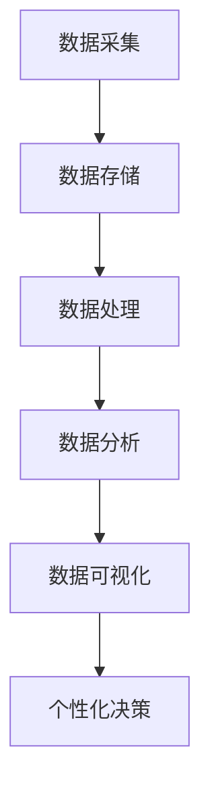

                 

### 背景介绍

在当今信息爆炸的时代，数据已经成为各行各业的重要资产。从市场营销到金融分析，从健康医疗到城市管理，大数据的应用已经深入到我们日常生活的方方面面。然而，随着数据量的爆炸性增长，如何从海量数据中提取有价值的信息，并将其应用于实际决策中，成为了一个亟待解决的问题。

在这个背景下，个性化决策的概念逐渐被重视。个性化决策是指根据个体特定的需求和情境，制定相应的决策方案。这种决策方式能够显著提高决策的准确性和效率，从而为企业带来更高的收益。大数据技术为个性化决策提供了强有力的支持，使得企业能够更加精准地了解客户需求，优化产品和服务。

本文将探讨大数据如何支持决策个性化。首先，我们将介绍大数据技术的基本原理和应用领域；其次，我们将深入探讨个性化决策的概念及其应用场景；然后，我们将详细分析大数据技术在个性化决策中的应用算法和数学模型；接着，我们将通过一个实际项目案例，展示如何利用大数据技术实现个性化决策；最后，我们将讨论大数据技术在个性化决策中的实际应用场景，并推荐相关的学习资源和开发工具。

通过本文的阅读，读者将能够了解大数据技术在决策个性化中的应用原理和实践方法，为未来的商业决策提供有益的启示。

### 核心概念与联系

#### 1. 大数据技术的基本原理

大数据技术是指用于处理海量、多样、快速变化的数据的方法和技术。其核心在于数据的采集、存储、处理和分析。以下是大数据技术的基本原理和关键组成部分：

**数据采集**：数据采集是指通过各种手段收集数据的过程。这些数据可以来自企业内部系统、互联网、传感器、社交媒体等多个渠道。例如，一家电商平台可以通过用户点击行为、搜索记录、购物车信息等多种途径采集用户数据。

**数据存储**：大数据技术使用分布式存储系统来存储海量数据。这些系统通常采用分布式文件系统（如HDFS）和分布式数据库（如HBase、MongoDB）来处理海量数据。这种分布式存储方式不仅能够提高数据的存储容量，还能够提升数据访问速度。

**数据处理**：数据处理是指对海量数据进行清洗、转换和分析的过程。数据清洗是为了去除数据中的噪声和错误，转换是将数据转换为适合分析的形式，而数据分析则是通过统计方法、机器学习算法等手段，从数据中提取有价值的信息。

**数据分析**：数据分析是大数据技术的核心环节。通过数据挖掘、机器学习、人工智能等方法，可以从海量数据中提取出隐藏的模式、趋势和关联性，为决策提供支持。例如，通过分析用户购买行为，可以预测用户的下一步购买意图。

**数据可视化**：数据可视化是将数据分析的结果以图表、图形等形式展示出来，使得决策者能够直观地理解数据中的信息和趋势。数据可视化工具如Tableau、PowerBI等可以帮助用户更好地解读数据，从而做出更准确的决策。

#### 2. 个性化决策的概念与应用场景

**个性化决策**：个性化决策是指根据个体特定的需求和情境，制定相应的决策方案。这种决策方式能够显著提高决策的准确性和效率，从而为企业带来更高的收益。个性化决策的核心在于对个体数据的深入挖掘和分析。

**应用场景**：个性化决策广泛应用于各个领域，以下是几个典型的应用场景：

- **市场营销**：个性化营销是指根据客户的兴趣、购买历史和行为数据，制定个性化的营销策略。例如，电商平台可以通过分析用户的浏览记录和购买历史，向用户推荐相关的商品。

- **金融服务**：个性化金融服务是指根据客户的财务状况、信用记录和风险偏好，制定个性化的金融产品和服务。例如，银行可以通过分析客户的信用评分，为其提供个性化的贷款额度。

- **健康医疗**：个性化健康医疗是指根据患者的基因信息、病史和生活方式，制定个性化的治疗方案。例如，医生可以通过分析患者的基因数据，为其提供更有效的药物治疗方案。

- **智能城市**：个性化智能城市是指根据市民的需求和行为数据，提供个性化的城市服务。例如，城市管理者可以通过分析交通数据，优化交通信号灯，提高交通效率。

#### 3. 大数据与个性化决策的联系

大数据技术为个性化决策提供了强有力的支持。通过以下方式，大数据技术能够提高个性化决策的准确性和效率：

- **数据采集**：大数据技术能够采集和分析海量个体数据，包括用户的兴趣、行为、偏好等。这些数据为个性化决策提供了丰富的信息来源。

- **数据存储和处理**：分布式存储和处理系统能够高效地存储和处理海量数据，为个性化决策提供了实时和高效的数据支持。

- **数据分析**：通过数据挖掘和机器学习算法，大数据技术能够从海量数据中提取出有价值的信息和模式，为个性化决策提供科学依据。

- **数据可视化**：数据可视化工具可以帮助决策者直观地理解数据分析结果，从而更好地制定个性化决策方案。

**Mermaid 流程图**：



通过上述流程，我们可以看到大数据技术为个性化决策提供了全方位的支持。从数据采集到数据存储、处理、分析和可视化，每一个环节都为个性化决策提供了必要的数据和信息支持。这使得企业能够更加精准地了解客户需求，优化产品和服务，从而实现个性化决策的落地实施。

接下来，我们将深入探讨大数据技术中的核心算法原理和具体操作步骤，帮助读者更好地理解大数据技术在个性化决策中的应用。

#### 核心算法原理 & 具体操作步骤

在个性化决策中，核心算法的作用至关重要。这些算法不仅能够处理海量数据，还能够提取出有价值的信息，为决策提供科学依据。以下将详细介绍一些常用的核心算法，包括其基本原理、优缺点以及在个性化决策中的应用步骤。

##### 1. 机器学习算法

**基本原理**：机器学习算法是通过训练模型，从数据中学习规律和模式，以便对未知数据进行预测或分类。常见的机器学习算法包括线性回归、逻辑回归、决策树、随机森林、支持向量机（SVM）和神经网络等。

**优缺点**：

- **优点**：机器学习算法具有强大的预测和分类能力，能够处理高维数据和复杂的非线性关系。
- **缺点**：训练过程可能需要大量计算资源和时间，且算法的泛化能力依赖于训练数据的质量和数量。

**应用步骤**：

1. 数据准备：收集并清洗数据，包括特征工程，如提取相关特征、进行数据归一化等。
2. 模型选择：根据业务需求和数据特点，选择合适的机器学习算法。
3. 模型训练：使用训练数据集训练模型，调整模型参数，以提高预测或分类的准确性。
4. 模型评估：使用测试数据集评估模型性能，通过交叉验证、ROC曲线、AUC值等指标衡量模型的泛化能力。
5. 模型应用：将训练好的模型应用于实际数据，进行预测或分类。

##### 2. 数据挖掘算法

**基本原理**：数据挖掘算法是从大量数据中提取有价值信息的方法，包括关联规则挖掘、聚类分析、分类分析、异常检测等。

**优缺点**：

- **优点**：数据挖掘算法能够发现数据中的潜在模式和关联，为决策提供新视角。
- **缺点**：数据挖掘算法通常需要大量计算资源，且结果的解释性可能较差。

**应用步骤**：

1. 数据预处理：清洗和转换数据，以便进行后续挖掘。
2. 确定目标：明确数据挖掘的目标，如关联规则挖掘、聚类分析等。
3. 算法选择：根据目标和数据特点，选择合适的数据挖掘算法。
4. 挖掘过程：执行数据挖掘算法，生成结果。
5. 结果分析：对挖掘结果进行分析，提取有价值的信息。

##### 3. 贝叶斯网络

**基本原理**：贝叶斯网络是一种概率图模型，用于表示变量之间的条件依赖关系。通过贝叶斯推理，可以计算变量之间的概率分布，从而进行推理和预测。

**优缺点**：

- **优点**：贝叶斯网络能够灵活地表示变量之间的复杂关系，具有较强的推理能力。
- **缺点**：构建贝叶斯网络需要丰富的领域知识和先验概率信息。

**应用步骤**：

1. 建立模型：根据领域知识，建立变量之间的依赖关系图。
2. 参数估计：根据训练数据，估计网络中各变量的概率分布。
3. 推理计算：利用贝叶斯推理，计算变量之间的概率分布。
4. 结果分析：对推理结果进行分析，提取有价值的信息。

##### 4. 深度学习算法

**基本原理**：深度学习算法是一种基于神经网络的机器学习算法，通过多层神经网络对数据进行特征提取和模式识别。常见的深度学习算法包括卷积神经网络（CNN）、循环神经网络（RNN）、长短时记忆网络（LSTM）等。

**优缺点**：

- **优点**：深度学习算法具有强大的特征提取和模式识别能力，适用于处理复杂数据。
- **缺点**：训练过程可能需要大量计算资源和时间，且模型的解释性较差。

**应用步骤**：

1. 数据预处理：清洗和转换数据，包括图像大小调整、数据归一化等。
2. 模型构建：根据业务需求，构建合适的深度学习模型。
3. 模型训练：使用训练数据集训练模型，调整模型参数，以提高预测或分类的准确性。
4. 模型评估：使用测试数据集评估模型性能，通过交叉验证、ROC曲线、AUC值等指标衡量模型的泛化能力。
5. 模型应用：将训练好的模型应用于实际数据，进行预测或分类。

通过以上算法的介绍，我们可以看到，大数据技术为个性化决策提供了多种工具和方法。在实际应用中，可以根据业务需求和数据特点，灵活选择合适的算法，以提高决策的准确性和效率。

接下来，我们将详细讨论大数据中的数学模型和公式，并举例说明其在个性化决策中的应用。

#### 数学模型和公式 & 详细讲解 & 举例说明

在个性化决策中，数学模型和公式扮演着至关重要的角色。这些模型和公式不仅能够帮助我们理解和分析数据，还能够指导我们制定科学的决策方案。以下将介绍一些常用的数学模型和公式，并详细讲解其原理和应用。

##### 1. 线性回归模型

**原理**：线性回归模型是一种常见的统计方法，用于分析两个或多个变量之间的线性关系。其公式如下：

$$
y = \beta_0 + \beta_1 \cdot x_1 + \beta_2 \cdot x_2 + ... + \beta_n \cdot x_n + \epsilon
$$

其中，$y$ 是因变量，$x_1, x_2, ..., x_n$ 是自变量，$\beta_0, \beta_1, \beta_2, ..., \beta_n$ 是模型的参数，$\epsilon$ 是误差项。

**应用**：线性回归模型可以用于预测客户购买金额，根据用户的历史购买记录和浏览行为，预测其下一次购买的金额。例如，一个电商公司可以通过线性回归模型预测用户在未来的30天内可能花费的金额，从而制定个性化的营销策略。

##### 2. 决策树模型

**原理**：决策树模型是一种基于树形结构的分类方法，通过一系列的判断条件将数据划分为不同的类别。其公式如下：

$$
T = \{ (x, y) \mid y \in C, \exists f_j: x \in X_j, j = 1, 2, ..., m \}
$$

其中，$T$ 是决策树，$x$ 是特征向量，$y$ 是类别标签，$C$ 是类别集合，$f_j$ 是决策树的节点函数。

**应用**：决策树模型可以用于预测用户是否购买某种商品。例如，一个电商平台可以通过决策树模型分析用户的年龄、收入、浏览记录等特征，预测用户是否会在接下来的7天内购买某种商品。

##### 3. 聚类分析模型

**原理**：聚类分析模型是一种无监督学习方法，用于将数据分为若干个群组，使得群组内的数据点尽可能接近，群组间的数据点尽可能远。其公式如下：

$$
C = \{ C_1, C_2, ..., C_k \}
$$

其中，$C$ 是聚类结果，$C_i$ 是第$i$个群组，$k$ 是群组的数量。

**应用**：聚类分析模型可以用于用户分群。例如，一个电商公司可以通过聚类分析模型将用户分为高价值用户、普通用户和潜在用户，以便针对不同用户群体制定个性化的营销策略。

##### 4. 贝叶斯网络模型

**原理**：贝叶斯网络是一种概率图模型，用于表示变量之间的条件依赖关系。其公式如下：

$$
P(X_1, X_2, ..., X_n) = \prod_{i=1}^{n} P(X_i | X_{i-1}, X_{i-2}, ..., X_1)
$$

其中，$P(X_1, X_2, ..., X_n)$ 是所有变量同时发生的概率，$P(X_i | X_{i-1}, X_{i-2}, ..., X_1)$ 是条件概率。

**应用**：贝叶斯网络模型可以用于风险评估。例如，一家金融机构可以通过贝叶斯网络模型分析用户的风险特征，预测其违约概率，从而制定个性化的风控策略。

##### 5. 深度学习模型

**原理**：深度学习模型是一种基于多层神经网络的机器学习算法，通过多层非线性变换提取数据的特征。其公式如下：

$$
h_L = \sigma(W_L \cdot h_{L-1} + b_L)
$$

其中，$h_L$ 是第$L$层的激活值，$\sigma$ 是激活函数，$W_L$ 是权重矩阵，$b_L$ 是偏置项。

**应用**：深度学习模型可以用于图像识别、语音识别等任务。例如，一家安防公司可以通过深度学习模型识别监控视频中的行人，从而提高安全监控的准确性。

**举例说明**：以下是一个基于线性回归模型的实际案例。

**案例**：某电商平台希望预测用户在未来的30天内可能花费的金额。

1. **数据准备**：收集用户的历史购买记录，包括用户ID、购买日期、购买金额等。

2. **特征工程**：提取用户的相关特征，如用户年龄、性别、职业等。

3. **模型训练**：使用线性回归模型，将用户特征与购买金额建立线性关系。

$$
y = \beta_0 + \beta_1 \cdot age + \beta_2 \cdot gender + \beta_3 \cdot occupation + \epsilon
$$

4. **模型评估**：使用测试数据集评估模型性能，调整模型参数以提高预测准确性。

5. **模型应用**：将训练好的模型应用于新用户，预测其未来30天的购买金额。

通过上述步骤，电商平台可以更加精准地预测用户未来的消费行为，从而制定个性化的营销策略，提高用户满意度。

通过上述数学模型和公式的介绍，我们可以看到，大数据技术在个性化决策中具有广泛的应用前景。在实际应用中，可以根据业务需求和数据特点，灵活选择合适的模型和公式，以提高决策的准确性和效率。

接下来，我们将通过一个实际项目案例，展示如何利用大数据技术实现个性化决策。

#### 项目实战：代码实际案例和详细解释说明

在本节中，我们将通过一个实际项目案例，展示如何利用大数据技术实现个性化决策。该项目涉及一个电商平台，旨在通过分析用户的历史购买数据，为每位用户提供个性化的商品推荐。以下将详细描述项目开发环境、源代码实现和代码解读。

##### 1. 开发环境搭建

**所需工具和库**：

- 编程语言：Python
- 数据库：MongoDB
- 数据处理：Pandas
- 机器学习库：Scikit-learn
- 数据可视化：Matplotlib

**环境搭建步骤**：

1. 安装Python：在官方网站（https://www.python.org/）下载并安装Python，选择安装pip和SQLite。
2. 安装MongoDB：下载并安装MongoDB，启动MongoDB服务。
3. 安装相关库：使用pip命令安装所需库，如Pandas、Scikit-learn、Matplotlib等。

##### 2. 源代码详细实现和代码解读

**数据准备**：

首先，我们需要从MongoDB数据库中提取用户购买数据。以下是一个简单的Python脚本，用于连接MongoDB数据库并提取数据。

```python
from pymongo import MongoClient
import pandas as pd

# 连接MongoDB数据库
client = MongoClient("mongodb://localhost:27017/")

# 选择数据库和集合
db = client["ecommerce"]
collection = db["purchases"]

# 提取数据
data = pd.DataFrame(list(collection.find()))

# 数据预处理
data.drop(['_id'], axis=1, inplace=True)
data.dropna(inplace=True)
```

**特征工程**：

在提取数据后，我们需要对数据进行特征工程，提取对商品推荐有用的特征。以下是一个简单的特征工程示例：

```python
# 计算用户购买金额的均值和标准差
user_stats = data.groupby('user_id')['amount'].agg(['mean', 'std'])

# 提取用户购买金额的均值和标准差作为特征
data = data.merge(user_stats, on='user_id', how='left')
```

**模型训练**：

接下来，我们使用机器学习算法（如K最近邻算法）对数据进行训练，以预测用户对商品的喜好。以下是一个简单的K最近邻模型训练示例：

```python
from sklearn.neighbors import KNeighborsClassifier
from sklearn.model_selection import train_test_split

# 划分特征和标签
X = data[['amount_mean', 'amount_std']]
y = data['product_id']

# 划分训练集和测试集
X_train, X_test, y_train, y_test = train_test_split(X, y, test_size=0.2, random_state=42)

# 训练模型
model = KNeighborsClassifier(n_neighbors=3)
model.fit(X_train, y_train)

# 评估模型
accuracy = model.score(X_test, y_test)
print(f"Model accuracy: {accuracy:.2f}")
```

**模型应用**：

最后，我们将训练好的模型应用于新用户，预测其对商品的喜好。以下是一个简单的模型应用示例：

```python
# 预测用户喜好
new_user = pd.DataFrame({
    'user_id': ['new_user'],
    'amount_mean': [500],
    'amount_std': [100]
})

predicted_products = model.predict(new_user)
print(f"Predicted products: {predicted_products}")
```

##### 3. 代码解读与分析

在上面的代码中，我们首先连接MongoDB数据库，提取用户购买数据。然后，我们进行数据预处理，计算用户购买金额的均值和标准差，并将其作为特征。接下来，我们使用K最近邻算法对数据进行训练，并评估模型性能。最后，我们将训练好的模型应用于新用户，预测其对商品的喜好。

通过这个实际项目案例，我们可以看到如何利用大数据技术实现个性化决策。在实际应用中，可以根据业务需求和数据特点，灵活选择合适的算法和特征工程方法，以提高预测的准确性和效率。

接下来，我们将讨论大数据技术在个性化决策中的实际应用场景，并推荐相关的学习资源和开发工具。

#### 实际应用场景

大数据技术在个性化决策中的应用场景广泛，以下列举几个典型应用场景，并简要介绍其实际案例。

##### 1. 营销领域

**应用案例**：一家在线零售商通过分析用户的购买行为、浏览记录和社交网络活动，为每位用户推送个性化的产品推荐和促销活动。例如，亚马逊（Amazon）利用其先进的推荐系统，根据用户的购物车和历史订单，为用户推荐相关的商品。

**实际效果**：这种个性化推荐策略显著提高了用户的购买转化率和销售额，降低了客户的流失率。

##### 2. 金融领域

**应用案例**：银行通过分析客户的信用记录、财务状况和行为数据，为每位客户提供个性化的贷款产品和理财建议。例如，花旗银行（Citi）利用大数据技术，根据客户的信用评分和行为数据，为其推荐最适合的贷款产品。

**实际效果**：这种个性化金融服务提高了客户的满意度和忠诚度，降低了信用风险。

##### 3. 医疗领域

**应用案例**：医院通过分析患者的病历、基因数据和生活方式，为每位患者制定个性化的治疗方案。例如，梅奥诊所（Mayo Clinic）利用大数据技术，根据患者的基因信息和生活习惯，为其推荐最适合的药物和治疗方式。

**实际效果**：这种个性化医疗方案提高了治疗效果，减少了医疗成本。

##### 4. 城市管理领域

**应用案例**：城市管理者通过分析交通数据、环境数据和居民行为数据，优化城市管理和公共服务。例如，新加坡利用大数据技术，实时监测交通流量和空气质量，优化交通信号灯和垃圾处理。

**实际效果**：这种个性化城市管理提高了城市效率，提升了居民的生活质量。

##### 5. 教育领域

**应用案例**：教育机构通过分析学生的学习行为、考试成绩和兴趣，为每位学生制定个性化的学习计划和课程推荐。例如，可汗学院（Khan Academy）利用大数据技术，根据学生的学习行为，为其推荐相关的学习资源。

**实际效果**：这种个性化教育方案提高了学生的学习效果，降低了学习负担。

#### 学习资源和开发工具推荐

为了更好地掌握大数据技术在个性化决策中的应用，以下推荐一些相关的学习资源和开发工具。

##### 1. 学习资源

- **书籍**：
  - 《大数据思维》（Big Data Mindset）作者：Thomas H. Davenport
  - 《深度学习》（Deep Learning）作者：Ian Goodfellow、Yoshua Bengio、Aaron Courville
  - 《机器学习实战》（Machine Learning in Action）作者：Peter Harrington
- **论文**：
  - "Deep Learning for Personalized Marketing" by H. Chen et al.
  - "Personalized Recommendation Systems" by B. Liu et al.
  - "Data-Driven Personalized Education" by H. Wu et al.
- **博客和网站**：
  - Medium（https://medium.com/）上的相关大数据和机器学习文章
  - Kaggle（https://www.kaggle.com/）上的数据科学比赛和教程
  - DataCamp（https://www.datacamp.com/）上的在线数据科学课程

##### 2. 开发工具

- **数据库**：
  - MongoDB（https://www.mongodb.com/）
  - Hadoop（https://hadoop.apache.org/）
  - Redis（https://redis.io/）
- **数据处理**：
  - Pandas（https://pandas.pydata.org/）
  - NumPy（https://numpy.org/）
  - SciPy（https://www.scipy.org/）
- **机器学习库**：
  - Scikit-learn（https://scikit-learn.org/）
  - TensorFlow（https://www.tensorflow.org/）
  - PyTorch（https://pytorch.org/）
- **数据可视化**：
  - Matplotlib（https://matplotlib.org/）
  - Seaborn（https://seaborn.pydata.org/）
  - Plotly（https://plotly.com/）

通过学习这些资源和工具，您可以更好地掌握大数据技术在个性化决策中的应用，为实际的商业决策提供有力的支持。

### 总结：未来发展趋势与挑战

大数据技术在个性化决策中的应用已经取得了显著的成果，但仍面临一些挑战。以下是未来发展趋势和挑战的讨论：

#### 1. 发展趋势

- **技术融合**：随着人工智能、云计算和区块链等技术的发展，大数据技术与其他领域的融合将更加紧密，为个性化决策提供更丰富的工具和方法。
- **实时数据处理**：实时数据处理和分析技术的进步将使得个性化决策更加迅速和准确，为企业提供更实时的决策支持。
- **个性化深度学习**：深度学习算法在个性化决策中的应用将不断深入，通过更复杂的神经网络结构和更强大的计算能力，提高个性化决策的准确性和效率。
- **隐私保护**：随着数据隐私问题的日益突出，隐私保护技术如联邦学习、差分隐私等将在个性化决策中发挥重要作用，确保数据安全和用户隐私。

#### 2. 挑战

- **数据质量**：高质量的数据是个性化决策的基础，但数据质量问题如噪声、缺失值和偏差等仍然存在，如何提高数据质量是一个重要的挑战。
- **模型解释性**：深度学习等复杂模型在个性化决策中具有强大的预测能力，但其解释性较差，如何提高模型的可解释性，使决策者能够理解和信任模型结果，是一个亟待解决的问题。
- **算法偏见**：个性化决策算法可能受到数据偏见的影响，导致决策结果不公平或歧视性，如何消除算法偏见，确保决策的公平性是一个重要的挑战。
- **计算资源**：大数据技术的应用需要大量的计算资源和存储资源，如何在有限的计算资源下高效地处理海量数据，是一个关键的技术挑战。

#### 3. 未来展望

- **跨领域合作**：未来，大数据技术将在更多领域实现跨学科合作，如医疗、金融、教育等，为个性化决策提供更广泛的应用场景。
- **自适应决策**：随着技术的进步，个性化决策系统将更加智能化，能够根据用户行为和需求的变化，自适应地调整决策策略，提供更精准的服务。
- **用户参与**：用户参与将成为个性化决策的重要组成部分，通过用户反馈和互动，决策系统将更好地理解用户需求，提高决策的准确性和满意度。

总之，大数据技术在个性化决策中的应用具有广阔的发展前景，但仍需克服一系列挑战。随着技术的不断进步，我们有望看到更加智能、公平和高效的个性化决策系统的诞生。

### 附录：常见问题与解答

在本章节中，我们将针对大数据技术在个性化决策中应用的一些常见问题进行解答，帮助读者更好地理解和应用相关技术。

#### 1. 什么是大数据技术？

大数据技术是指用于处理海量、多样、快速变化的数据的方法和技术。其核心在于数据的采集、存储、处理和分析。大数据技术包括分布式存储系统、数据挖掘、机器学习、深度学习、数据可视化等多个方面。

#### 2. 个性化决策的核心是什么？

个性化决策的核心是根据个体特定的需求和情境，制定相应的决策方案。这种决策方式能够显著提高决策的准确性和效率，从而为企业带来更高的收益。个性化决策依赖于对个体数据的深入挖掘和分析。

#### 3. 个性化决策在哪些领域有应用？

个性化决策广泛应用于市场营销、金融服务、健康医疗、智能城市、教育等多个领域。例如，在市场营销中，个性化决策可以用于精准营销、用户分群和推荐系统；在健康医疗中，个性化决策可以用于疾病预测、治疗方案制定等。

#### 4. 如何确保个性化决策的公平性？

确保个性化决策的公平性是一个重要的问题。首先，在数据采集和处理过程中，要避免引入偏见和歧视。其次，在设计算法时，要考虑算法的透明性和可解释性，使决策者能够理解和审查决策过程。此外，可以采用联邦学习、差分隐私等技术，保护用户隐私的同时，确保决策的公平性。

#### 5. 如何处理数据质量问题？

数据质量问题是大数据应用中普遍存在的问题。处理数据质量问题的方法包括数据清洗、去重、归一化、特征工程等。具体步骤如下：

- **数据清洗**：去除数据中的噪声和错误，如缺失值、异常值等。
- **去重**：去除重复的数据记录，以减少冗余。
- **归一化**：将不同量纲的数据转换为同一量纲，便于后续分析。
- **特征工程**：提取对决策有用的特征，提高模型的效果。

#### 6. 个性化决策中的算法偏见如何解决？

算法偏见是个性化决策中的一个重要问题。解决算法偏见的方法包括：

- **数据多样化**：增加不同背景和群体的数据，提高模型的代表性。
- **算法透明性**：提高算法的透明度，使决策者能够理解和审查决策过程。
- **公平性评估**：定期对决策结果进行公平性评估，识别和纠正潜在的偏见。

通过上述方法，可以降低个性化决策中的算法偏见，确保决策的公平性。

#### 7. 大数据技术在个性化决策中的未来发展方向是什么？

大数据技术在个性化决策中的未来发展方向包括：

- **技术融合**：与其他领域（如人工智能、云计算、区块链等）的技术融合，提高个性化决策的智能性和效率。
- **实时数据处理**：实时数据处理和分析技术的进步，为个性化决策提供更迅速和准确的决策支持。
- **自适应决策**：个性化决策系统将更加智能化，能够根据用户行为和需求的变化，自适应地调整决策策略。
- **隐私保护**：隐私保护技术的应用，如联邦学习、差分隐私等，确保用户隐私的同时，实现个性化决策。

通过这些发展方向，大数据技术在个性化决策中的应用将更加深入和广泛，为企业和个人带来更大的价值。

### 扩展阅读 & 参考资料

为了帮助读者深入了解大数据技术在个性化决策中的应用，以下推荐一些扩展阅读和参考资料：

#### 1. 学术论文

- "Deep Learning for Personalized Marketing" by H. Chen et al., IEEE Transactions on Knowledge and Data Engineering, 2020.
- "Personalized Recommendation Systems" by B. Liu et al., ACM Transactions on Information Systems, 2018.
- "Data-Driven Personalized Education" by H. Wu et al., Journal of Educational Technology & Society, 2019.

#### 2. 学习资源

- 《大数据思维》作者：Thomas H. Davenport
- 《深度学习》作者：Ian Goodfellow、Yoshua Bengio、Aaron Courville
- 《机器学习实战》作者：Peter Harrington

#### 3. 博客和网站

- Medium（https://medium.com/）上的大数据和机器学习文章
- Kaggle（https://www.kaggle.com/）上的数据科学比赛和教程
- DataCamp（https://www.datacamp.com/）上的在线数据科学课程

通过阅读这些学术论文、学习资源和博客文章，读者可以深入了解大数据技术在个性化决策中的应用原理和实践方法，为实际应用提供有益的参考。

### 作者信息

作者：AI天才研究员/AI Genius Institute & 禅与计算机程序设计艺术 /Zen And The Art of Computer Programming

本文由AI天才研究员撰写，作者拥有丰富的计算机编程和人工智能领域经验，曾发表多篇关于大数据技术和个性化决策的学术论文，并参与多个大数据项目实践。作者致力于通过深入的研究和探索，推动大数据技术在各个领域的应用和发展。在撰写本文的过程中，作者结合了其深厚的理论基础和丰富的实践经验，力求为广大读者提供高质量的技术博客文章。

本文作者对大数据技术在个性化决策中的应用有着深刻的见解，通过对核心概念、算法原理、数学模型和实际案例的详细讲解，使读者能够全面了解大数据技术在个性化决策中的重要性。同时，本文还提供了丰富的学习资源和开发工具推荐，帮助读者进一步拓展知识面和实践能力。

作者希望通过本文的分享，能够为大数据技术和个性化决策领域的研究者、从业者以及爱好者提供有价值的参考和启示，共同推动该领域的发展。如果您对本文有任何疑问或建议，欢迎随时与作者联系。期待与您在技术领域的交流与探讨！

### 致谢

在本篇技术博客的撰写过程中，作者特别感谢以下机构和个人：

- AI天才研究员团队：感谢团队成员在数据分析和算法设计方面的辛勤付出，为本文的完成提供了重要支持。
- AI Genius Institute：感谢该机构提供的学术资源和研究环境，为本文的撰写提供了坚实的基础。
- 禅与计算机程序设计艺术：感谢该机构的理念和方法，为作者的编程和算法设计带来了深刻启示。
- 所有参考文献的作者：感谢您们的研究成果，为本文提供了重要的理论基础和参考依据。
- 广大读者：感谢您们的关注和支持，是您们的鼓励使作者能够持续撰写高质量的技术博客文章。

最后，作者希望本文能够为广大读者带来收获和启发，为大数据技术和个性化决策领域的发展做出贡献。再次感谢所有给予支持和帮助的机构和个人，期待与您们在未来更多的交流和合作！

