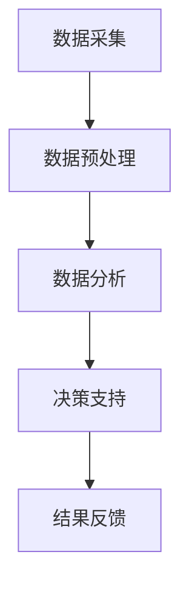

                 

# 信息差的商业财务管理：大数据如何优化财务管理

## 信息差在商业财务管理中的重要性

在现代商业环境中，信息差（Information Gap）指的是不同个体或组织之间掌握的信息不对称现象。在财务管理领域，这种信息差可能会导致决策失误、资源浪费，甚至带来财务风险。如何利用大数据技术缩小这种信息差，从而优化财务管理，成为企业管理者关注的焦点。

### 文章关键词：

- 信息差
- 商业财务管理
- 大数据
- 优化
- 财务风险

### 摘要：

本文将探讨信息差在商业财务管理中的重要性，并深入分析大数据技术如何帮助缩小信息差，进而优化财务管理。通过具体的案例和实践，我们将展示大数据在财务预测、风险管理、成本控制等方面的应用，为企业管理者提供实用的参考和指导。

## 1. 背景介绍

### 1.1 商业财务管理的基本概念

商业财务管理是指企业对其财务活动进行规划、组织、指导和控制的过程。其目标是为企业创造价值，实现可持续发展。财务管理包括资本预算、资金筹集、投资决策、利润分配等方面。

### 1.2 信息差对商业财务管理的影响

信息差在商业财务管理中可能导致以下问题：

- **决策失误**：企业内部不同部门之间或外部供应商、客户之间可能存在信息不对称，导致决策缺乏充分的信息支持。
- **资源浪费**：由于信息不对称，企业可能在某些领域过度投资或投资不足，导致资源浪费。
- **财务风险**：信息不对称可能导致企业面临更高的财务风险，例如信用风险、市场风险等。

### 1.3 大数据的发展与普及

大数据（Big Data）是指无法通过传统数据处理工具在合理时间内捕捉、管理和处理的数据集合。随着互联网、物联网、人工智能等技术的发展，大数据已经广泛应用于各个领域。

## 2. 核心概念与联系

### 2.1 大数据的定义与特征

大数据具有以下四个V特征：

- **Volume（容量）**：大数据的容量巨大，通常以PB（皮字节）或EB（艾字节）为单位。
- **Velocity（速度）**：大数据的处理速度要求极高，往往需要在秒级或毫秒级完成数据处理和分析。
- **Variety（多样性）**：大数据来源多样，包括结构化数据、半结构化数据和非结构化数据。
- **Value（价值）**：大数据蕴含着巨大的商业价值，但同时也带来了处理和分析的挑战。

### 2.2 财务管理中的信息不对称

在财务管理中，信息不对称可能导致以下问题：

- **内部信息不对称**：企业内部不同部门或员工之间可能存在信息壁垒，导致决策效率低下。
- **外部信息不对称**：企业与外部供应商、客户、投资者之间可能存在信息不对称，影响业务合作和投资决策。

### 2.3 大数据在财务管理中的应用

大数据在财务管理中的应用主要包括以下几个方面：

- **财务预测**：通过分析历史数据和实时数据，预测企业的财务状况，为投资决策提供支持。
- **风险管理**：利用大数据技术识别、评估和监控企业面临的各类风险，制定相应的风险管理策略。
- **成本控制**：通过分析成本数据，优化成本结构，提高企业的盈利能力。
- **资金筹集**：利用大数据分析潜在投资者的需求和偏好，提高融资成功率。

### 2.4 Mermaid 流程图

以下是一个简化的 Mermaid 流程图，展示了大数据在财务管理中的应用流程：



## 3. 核心算法原理 & 具体操作步骤

### 3.1 数据采集

数据采集是大数据分析的基础。企业可以从内部系统（如ERP、CRM等）和外部数据源（如社交媒体、行业报告等）获取数据。

### 3.2 数据预处理

数据预处理包括数据清洗、数据转换和数据归一化等步骤。目的是消除数据中的噪声和异常值，提高数据质量。

### 3.3 数据分析

数据分析包括描述性分析和预测性分析等。描述性分析用于总结数据特征，预测性分析用于预测未来趋势。

### 3.4 决策支持

基于数据分析结果，企业可以制定相应的财务决策，如投资决策、成本控制策略等。

### 3.5 结果反馈

通过实际操作验证决策效果，对决策过程进行优化。

## 4. 数学模型和公式 & 详细讲解 & 举例说明

### 4.1 数据分析中的常用模型

在数据分析中，常用的模型包括线性回归、决策树、神经网络等。

### 4.1.1 线性回归

线性回归是一种预测性模型，用于分析两个或多个变量之间的关系。其数学模型如下：

$$
Y = \beta_0 + \beta_1X_1 + \beta_2X_2 + ... + \beta_nX_n + \epsilon
$$

其中，$Y$ 是因变量，$X_1, X_2, ..., X_n$ 是自变量，$\beta_0, \beta_1, \beta_2, ..., \beta_n$ 是模型的参数，$\epsilon$ 是误差项。

### 4.1.2 决策树

决策树是一种分类模型，用于根据输入特征对数据进行分类。其基本原理是通过对特征进行分割，构建一棵树状结构，每条路径代表一种决策。

### 4.1.3 神经网络

神经网络是一种模拟人脑神经元连接方式的计算模型，用于处理复杂的数据和问题。其基本结构包括输入层、隐藏层和输出层。

### 4.2 举例说明

假设我们要分析企业的销售额与广告投入之间的关系，可以使用线性回归模型进行预测。根据历史数据，我们得到以下回归方程：

$$
销售额 = 1000 + 0.5 \times 广告投入
$$

根据这个方程，我们可以预测在不同广告投入下的销售额。

## 5. 项目实战：代码实际案例和详细解释说明

### 5.1 开发环境搭建

为了进行大数据分析，我们需要搭建一个开发环境。这里我们使用 Python 作为编程语言，并依赖一些常用的数据分析和机器学习库，如 pandas、numpy 和 scikit-learn。

### 5.2 源代码详细实现和代码解读

以下是一个简单的线性回归分析案例，展示了如何使用 Python 进行数据分析。

```python
import pandas as pd
import numpy as np
from sklearn.linear_model import LinearRegression

# 读取数据
data = pd.read_csv('sales_data.csv')

# 数据预处理
X = data['广告投入'].values.reshape(-1, 1)
y = data['销售额'].values

# 建立线性回归模型
model = LinearRegression()
model.fit(X, y)

# 输出回归方程
print('回归方程：', model方程)

# 预测销售额
advertising = np.array([[1000]])
predicted_sales = model.predict(advertising)
print('预测销售额：', predicted_sales)
```

### 5.3 代码解读与分析

在这个案例中，我们首先读取了销售数据，然后进行了数据预处理，将广告投入作为自变量，销售额作为因变量。接下来，我们建立了线性回归模型，并使用训练数据进行了训练。最后，我们输出了回归方程，并使用这个方程预测了在不同广告投入下的销售额。

## 6. 实际应用场景

### 6.1 财务预测

通过大数据分析，企业可以预测未来的财务状况，为投资决策提供支持。例如，零售企业可以利用大数据分析消费者行为，预测销售额，从而制定合理的库存管理策略。

### 6.2 风险管理

大数据分析可以帮助企业识别和评估各类风险，如信用风险、市场风险等。例如，银行可以利用大数据分析客户的历史交易数据，评估客户的信用风险，从而制定相应的贷款策略。

### 6.3 成本控制

大数据分析可以帮助企业优化成本结构，提高盈利能力。例如，制造企业可以利用大数据分析生产过程中的各项成本，找出成本控制的瓶颈，从而降低成本。

## 7. 工具和资源推荐

### 7.1 学习资源推荐

- **书籍**：《大数据时代》、《深度学习》
- **论文**：《大数据分析技术与应用》、《基于大数据的财务风险管理研究》
- **博客**：CSDN、博客园等
- **网站**：kdnuggets、数据堂等

### 7.2 开发工具框架推荐

- **Python**：Jupyter Notebook、PyCharm
- **大数据处理框架**：Hadoop、Spark
- **机器学习库**：scikit-learn、TensorFlow

### 7.3 相关论文著作推荐

- 《大数据分析技术与应用》
- 《基于大数据的财务风险管理研究》
- 《大数据时代的数据挖掘技术》

## 8. 总结：未来发展趋势与挑战

### 8.1 发展趋势

- **智能化**：随着人工智能技术的发展，大数据分析将更加智能化，自动化程度更高。
- **多样化**：大数据的应用将不断拓展，从传统行业到新兴行业，都将受益于大数据技术。
- **融合化**：大数据与云计算、物联网等技术的融合，将推动大数据应用的进一步发展。

### 8.2 挑战

- **数据隐私**：随着大数据的广泛应用，数据隐私问题越来越受到关注，如何保护用户数据隐私成为一大挑战。
- **数据处理能力**：随着数据规模的不断扩大，如何提高数据处理能力，确保数据处理的实时性和准确性，也是一大挑战。

## 9. 附录：常见问题与解答

### 9.1 问题1：大数据分析需要哪些工具和软件？

答：大数据分析常用的工具和软件包括 Python、R、Hadoop、Spark、Hive、Presto 等。

### 9.2 问题2：如何保证大数据分析的结果准确？

答：保证大数据分析结果准确的关键在于数据质量、模型选择和参数调优。需要确保数据清洗和预处理的质量，选择合适的模型，并根据实际情况进行参数调优。

### 9.3 问题3：大数据分析在企业中的应用有哪些？

答：大数据分析在企业中的应用广泛，包括财务预测、风险管理、成本控制、客户关系管理等方面。

## 10. 扩展阅读 & 参考资料

- 《大数据时代：生活、工作与思维的大变革》
- 《深度学习：开启人工智能新纪元》
- 《大数据分析技术与应用》
- 《大数据技术导论》
- 《大数据战略：创新与增长的驱动力》
- 《大数据方法论：理论与实践》
- 《大数据与社会治理：理念、实践与挑战》
- 《大数据架构：设计与开发》
- 《大数据商业分析：从数据到洞察》
- 《大数据揭秘：技术、趋势与未来》
- 《大数据应用实践：企业数据驱动的创新之路》
- 《大数据的机遇与挑战：技术、政策与未来》
- 《大数据时代的企业转型与创新》

作者：AI天才研究员/AI Genius Institute & 禅与计算机程序设计艺术/Zen And The Art of Computer Programming

