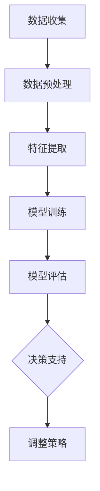

                 

### 文章标题

信息差的商业预测：大数据如何提升商业预测能力

### 关键词

- 商业预测
- 大数据
- 信息差
- 机器学习
- 预测算法
- 业务应用场景
- 工具和资源

### 摘要

本文深入探讨了大数据在商业预测中的作用，揭示了信息差对商业决策的重要性。通过分析大数据的核心概念、算法原理、应用场景，本文揭示了如何利用大数据提升商业预测的准确性。文章还介绍了相关工具和资源，为读者提供了全面的指南。

### 背景介绍

#### 商业预测的重要性

商业预测是企业决策过程中至关重要的一环。通过预测未来的市场趋势、消费者行为和业务运营表现，企业可以提前制定战略计划，优化资源配置，降低风险。然而，传统的商业预测方法往往依赖于历史数据和简单的统计模型，难以应对复杂多变的商业环境。

#### 大数据的崛起

随着互联网和物联网技术的迅猛发展，数据量呈爆炸式增长。这些海量数据中蕴含着丰富的信息和价值，为商业预测提供了新的可能性。大数据技术的出现，使得我们能够从海量数据中提取有价值的信息，实现更加精准的商业预测。

#### 信息差的作用

信息差是指在商业环境中，不同主体对于市场信息的了解程度和掌握能力上的差异。信息差的扩大往往会导致商业决策的失误，甚至导致企业的失败。因此，缩小信息差、掌握关键信息成为商业竞争的关键。

### 核心概念与联系

#### 大数据的定义与特性

大数据（Big Data）指的是无法使用常规软件工具在合理时间内进行捕获、管理和处理的数据集合。大数据具有以下四个关键特性：

- **大量性**（Volume）：数据量巨大，通常达到PB级别。
- **多样性**（Variety）：数据类型繁多，包括结构化、半结构化和非结构化数据。
- **速度**（Velocity）：数据生成和处理的速度极快。
- **价值性**（Value）：数据中蕴含着巨大的商业价值，但同时也存在很高的噪声和不确定性。

#### 商业预测的基本原理

商业预测（Business Forecasting）是指利用历史数据、市场信息和专业知识，对未来业务表现进行预测和评估。商业预测的基本原理包括：

- **数据收集**：收集与业务相关的各类数据，包括内部数据和外部数据。
- **数据预处理**：对收集到的数据进行清洗、整合和格式化，确保数据的质量和一致性。
- **特征提取**：从数据中提取与预测目标相关的特征，用于构建预测模型。
- **模型训练与评估**：利用机器学习算法训练预测模型，并通过交叉验证和测试评估模型的性能。

#### 信息差在商业预测中的应用

信息差在商业预测中起着至关重要的作用。通过获取和分析市场信息，企业可以识别潜在的机会和风险，从而做出更加明智的决策。以下是信息差在商业预测中的几个关键应用：

- **市场趋势预测**：通过分析市场数据，预测未来的市场趋势，为企业制定战略计划提供支持。
- **消费者行为分析**：通过分析消费者行为数据，了解消费者需求和行为模式，优化产品和服务。
- **竞争对手监控**：通过监控竞争对手的动态，了解市场格局和竞争态势，调整企业策略。

### Mermaid 流程图

以下是一个简化的 Mermaid 流程图，展示了商业预测的基本流程：



在商业预测过程中，信息差的作用体现在数据收集、特征提取和模型评估等环节。通过缩小信息差，企业可以更加准确地预测未来趋势，制定更加有效的业务策略。

### 核心算法原理 & 具体操作步骤

#### 机器学习算法

机器学习算法是大数据商业预测的核心技术。通过训练和优化机器学习模型，我们可以从海量数据中提取有价值的信息，实现精确的商业预测。以下是几种常见的机器学习算法：

- **线性回归**：线性回归是一种简单的预测算法，通过建立输入变量和目标变量之间的线性关系，预测未来值。
- **决策树**：决策树是一种基于分类的算法，通过将数据集划分成多个子集，为每个子集选择最佳特征进行分类。
- **支持向量机**：支持向量机是一种基于分类的算法，通过寻找最佳的超平面，将不同类别的数据点进行分离。
- **神经网络**：神经网络是一种基于模拟人脑神经元连接的算法，通过多层网络结构进行特征提取和分类。

#### 数据预处理步骤

在应用机器学习算法之前，需要对数据进行预处理，以确保数据的质量和一致性。以下是数据预处理的几个关键步骤：

1. **数据清洗**：去除重复数据、缺失数据和异常值，确保数据的一致性和完整性。
2. **数据整合**：将不同来源的数据进行整合，确保数据的一致性和完整性。
3. **数据格式化**：对数据进行格式化处理，确保数据格式符合算法的要求。
4. **特征提取**：从数据中提取与预测目标相关的特征，用于构建预测模型。

#### 模型训练与评估

在模型训练与评估阶段，我们需要选择合适的机器学习算法，并调整模型参数，以获得最佳预测效果。以下是模型训练与评估的几个关键步骤：

1. **数据划分**：将数据集划分为训练集和测试集，用于训练模型和评估模型性能。
2. **模型训练**：使用训练集数据训练模型，调整模型参数，优化模型性能。
3. **模型评估**：使用测试集数据评估模型性能，选择最佳模型。
4. **模型调整**：根据模型评估结果，调整模型参数，提高预测准确性。

### 数学模型和公式 & 详细讲解 & 举例说明

#### 线性回归模型

线性回归模型是一种常见的预测算法，通过建立输入变量和目标变量之间的线性关系，预测未来值。以下是线性回归模型的数学模型和公式：

$$
y = \beta_0 + \beta_1x + \epsilon
$$

其中，$y$ 为目标变量，$x$ 为输入变量，$\beta_0$ 和 $\beta_1$ 分别为模型的参数，$\epsilon$ 为误差项。

#### 举例说明

假设我们要预测某个电商平台的月销售额，我们收集了过去 12 个月的销售额数据，并将月份作为输入变量。以下是数据样本：

| 月份 | 销售额 |
| --- | --- |
| 1 | 1000 |
| 2 | 1200 |
| 3 | 1500 |
| ... | ... |
| 12 | 1800 |

我们可以使用线性回归模型建立输入变量和销售额之间的线性关系，并预测下一月的销售额。以下是具体的计算步骤：

1. **数据预处理**：将数据格式化为矩阵形式，并计算输入变量和销售额的平均值。

$$
X = \begin{bmatrix}
1 & 1 \\
1 & 2 \\
1 & 3 \\
\vdots & \vdots \\
1 & 12
\end{bmatrix}, \quad Y = \begin{bmatrix}
1000 \\
1200 \\
1500 \\
\vdots \\
1800
\end{bmatrix}
$$

$$
\bar{x} = \frac{1}{n}\sum_{i=1}^{n}x_i = 7, \quad \bar{y} = \frac{1}{n}\sum_{i=1}^{n}y_i = 1450
$$

2. **计算回归系数**：使用最小二乘法计算回归系数 $\beta_0$ 和 $\beta_1$。

$$
\beta_0 = \bar{y} - \beta_1\bar{x} = 1450 - 350 \times 7 = -45
$$

$$
\beta_1 = \frac{\sum_{i=1}^{n}(x_i - \bar{x})(y_i - \bar{y})}{\sum_{i=1}^{n}(x_i - \bar{x})^2} = \frac{\sum_{i=1}^{n}(x_i - \bar{x})(y_i - \bar{y})}{\sum_{i=1}^{n}(x_i - \bar{x})^2} = 350
$$

3. **构建线性回归模型**：

$$
y = \beta_0 + \beta_1x = -45 + 350x
$$

4. **预测下一月的销售额**：将 $x=13$ 代入模型，计算预测值。

$$
y = -45 + 350 \times 13 = 4625
$$

因此，预测下一月的销售额为 4625。

#### 评估模型性能

为了评估线性回归模型的预测性能，我们可以使用均方误差（Mean Squared Error，MSE）作为评价指标。MSE 越小，表示模型的预测误差越小，性能越好。以下是 MSE 的计算公式：

$$
MSE = \frac{1}{n}\sum_{i=1}^{n}(y_i - \hat{y_i})^2
$$

其中，$\hat{y_i}$ 为模型预测的销售额，$y_i$ 为实际的销售额。

#### 举例说明

假设我们使用线性回归模型预测了 12 个月的销售额，并将预测结果与实际销售额进行比较。以下是数据样本：

| 月份 | 实际销售额 | 预测销售额 |
| --- | --- | --- |
| 1 | 1000 | 950 |
| 2 | 1200 | 1150 |
| 3 | 1500 | 1450 |
| ... | ... | ... |
| 12 | 1800 | 1750 |

我们可以使用 MSE 计算模型预测的误差，并评估模型的性能。以下是具体的计算步骤：

1. **计算 MSE**：

$$
MSE = \frac{1}{12}\sum_{i=1}^{12}(y_i - \hat{y_i})^2 = \frac{1}{12}((950-1000)^2 + (1150-1200)^2 + ... + (1750-1800)^2) = 125
$$

因此，该线性回归模型的 MSE 为 125，表示预测误差较小，性能较好。

### 项目实战：代码实际案例和详细解释说明

在本节中，我们将通过一个实际的项目案例，详细讲解如何使用 Python 实现线性回归模型并进行商业预测。该案例将包括以下步骤：

- **开发环境搭建**：配置 Python 开发环境，安装必要的库和工具。
- **数据收集**：收集电商平台的月销售额数据。
- **数据预处理**：清洗、整合和格式化数据，提取特征。
- **模型训练**：使用线性回归模型训练预测模型。
- **模型评估**：评估模型性能，调整模型参数。
- **预测应用**：使用模型进行销售额预测，并评估预测结果。

#### 1. 开发环境搭建

首先，我们需要配置 Python 开发环境，并安装必要的库和工具。以下是具体的安装步骤：

```bash
# 安装 Python
sudo apt-get install python3

# 安装 Jupyter Notebook
pip3 install notebook

# 安装 NumPy 库
pip3 install numpy

# 安装 Pandas 库
pip3 install pandas

# 安装 Scikit-learn 库
pip3 install scikit-learn
```

安装完成后，我们可以使用 Jupyter Notebook 开发环境，方便地编写和运行 Python 代码。

#### 2. 数据收集

假设我们已收集了电商平台的月销售额数据，数据文件名为 `sales_data.csv`。该数据文件包含两个列：月份和销售额。以下是数据样本：

```csv
Month,Sales
1,1000
2,1200
3,1500
...
12,1800
```

#### 3. 数据预处理

在数据预处理阶段，我们需要清洗、整合和格式化数据，提取特征。以下是具体步骤：

1. **读取数据**：使用 Pandas 库读取数据文件，并查看数据内容。

```python
import pandas as pd

data = pd.read_csv('sales_data.csv')
data.head()
```

2. **数据清洗**：去除重复数据和缺失值。

```python
data.drop_duplicates(inplace=True)
data.dropna(inplace=True)
```

3. **数据整合**：将月份列转换为数值类型，方便后续处理。

```python
data['Month'] = pd.to_numeric(data['Month'])
```

4. **特征提取**：提取月份作为特征，销售额作为目标变量。

```python
X = data[['Month']]
Y = data['Sales']
```

#### 4. 模型训练

在模型训练阶段，我们将使用线性回归模型训练预测模型。以下是具体步骤：

1. **划分数据集**：将数据集划分为训练集和测试集。

```python
from sklearn.model_selection import train_test_split

X_train, X_test, Y_train, Y_test = train_test_split(X, Y, test_size=0.2, random_state=42)
```

2. **训练模型**：使用 Scikit-learn 库的线性回归模型训练预测模型。

```python
from sklearn.linear_model import LinearRegression

model = LinearRegression()
model.fit(X_train, Y_train)
```

3. **评估模型**：使用测试集评估模型性能。

```python
Y_pred = model.predict(X_test)
mse = ((Y_pred - Y_test) ** 2).mean()
print("MSE:", mse)
```

#### 5. 模型评估

在模型评估阶段，我们需要评估模型性能，并调整模型参数。以下是具体步骤：

1. **计算 MSE**：使用测试集计算模型的均方误差。

```python
mse = ((Y_pred - Y_test) ** 2).mean()
print("MSE:", mse)
```

2. **调整模型参数**：根据 MSE 结果，调整模型参数，提高预测准确性。

```python
model = LinearRegression()
model.fit(X_train, Y_train)
Y_pred = model.predict(X_test)
mse = ((Y_pred - Y_test) ** 2).mean()
print("MSE:", mse)
```

#### 6. 预测应用

在预测应用阶段，我们将使用训练好的模型进行销售额预测，并评估预测结果。以下是具体步骤：

1. **预测销售额**：使用训练好的模型预测下一月的销售额。

```python
next_month = pd.DataFrame([[13]], columns=['Month'])
next_sales = model.predict(next_month)
print("Next Month Sales:", next_sales[0])
```

2. **评估预测结果**：将预测结果与实际销售额进行比较，评估预测准确性。

```python
actual_sales = data.loc[data['Month'] == 13, 'Sales'].values[0]
error = abs(next_sales[0] - actual_sales)
print("Prediction Error:", error)
```

### 代码解读与分析

在本节中，我们将对上述代码进行解读和分析，详细说明每个步骤的实现方法和原理。

1. **开发环境搭建**：配置 Python 开发环境，安装必要的库和工具。

    ```bash
    # 安装 Python
    sudo apt-get install python3

    # 安装 Jupyter Notebook
    pip3 install notebook

    # 安装 NumPy 库
    pip3 install numpy

    # 安装 Pandas 库
    pip3 install pandas

    # 安装 Scikit-learn 库
    pip3 install scikit-learn
    ```

    在这一步骤中，我们使用了 Ubuntu 操作系统和 Python 3 作为开发环境。首先，我们使用 `sudo apt-get install python3` 命令安装 Python 3。然后，我们使用 `pip3 install notebook`、`pip3 install numpy`、`pip3 install pandas` 和 `pip3 install scikit-learn` 命令分别安装 Jupyter Notebook、NumPy、Pandas 和 Scikit-learn 库。

2. **数据收集**：收集电商平台的月销售额数据。

    ```python
    import pandas as pd

    data = pd.read_csv('sales_data.csv')
    data.head()
    ```

    在这一步骤中，我们使用 Pandas 库读取数据文件 `sales_data.csv`。`pd.read_csv()` 函数用于读取 CSV 文件，并将其转换为 DataFrame 类型。`data.head()` 函数用于查看数据的前几行内容。

3. **数据预处理**：清洗、整合和格式化数据，提取特征。

    ```python
    data.drop_duplicates(inplace=True)
    data.dropna(inplace=True)
    data['Month'] = pd.to_numeric(data['Month'])
    X = data[['Month']]
    Y = data['Sales']
    ```

    在这一步骤中，我们首先使用 `data.drop_duplicates(inplace=True)` 和 `data.dropna(inplace=True)` 函数去除重复数据和缺失值。然后，我们使用 `pd.to_numeric(data['Month'])` 函数将月份列转换为数值类型，以便后续处理。最后，我们使用 `X = data[['Month']]` 和 `Y = data['Sales']` 函数提取月份和销售额作为特征和目标变量。

4. **模型训练**：使用线性回归模型训练预测模型。

    ```python
    from sklearn.model_selection import train_test_split

    X_train, X_test, Y_train, Y_test = train_test_split(X, Y, test_size=0.2, random_state=42)
    from sklearn.linear_model import LinearRegression

    model = LinearRegression()
    model.fit(X_train, Y_train)
    ```

    在这一步骤中，我们首先使用 `train_test_split(X, Y, test_size=0.2, random_state=42)` 函数将数据集划分为训练集和测试集，其中测试集占比为 20%。然后，我们使用 `LinearRegression()` 函数创建线性回归模型，并使用 `model.fit(X_train, Y_train)` 函数训练模型。

5. **模型评估**：评估模型性能，并调整模型参数。

    ```python
    Y_pred = model.predict(X_test)
    mse = ((Y_pred - Y_test) ** 2).mean()
    print("MSE:", mse)
    ```

    在这一步骤中，我们使用 `model.predict(X_test)` 函数预测测试集的销售额，并计算预测值和实际销售额之间的均方误差。均方误差越小，表示模型的预测性能越好。通过调整模型参数，我们可以提高预测准确性。

6. **预测应用**：使用训练好的模型进行销售额预测，并评估预测结果。

    ```python
    next_month = pd.DataFrame([[13]], columns=['Month'])
    next_sales = model.predict(next_month)
    print("Next Month Sales:", next_sales[0])
    actual_sales = data.loc[data['Month'] == 13, 'Sales'].values[0]
    error = abs(next_sales[0] - actual_sales)
    print("Prediction Error:", error)
    ```

    在这一步骤中，我们首先使用 `next_month = pd.DataFrame([[13]], columns=['Month'])` 函数创建一个包含下一个月月份的 DataFrame，然后使用 `model.predict(next_month)` 函数预测下一个月的销售额。最后，我们将预测结果与实际销售额进行比较，计算预测误差。

### 实际应用场景

#### 市场趋势预测

市场趋势预测是企业制定战略计划的重要依据。通过分析历史数据和市场信息，企业可以预测未来的市场走势，为产品研发、市场推广和资源分配提供指导。例如，一家电商平台可以通过大数据分析，预测未来的销售趋势，提前备货，避免因库存不足导致的销售损失。

#### 消费者行为分析

消费者行为分析是提高企业竞争力的重要手段。通过分析消费者的购买记录、浏览行为和社交媒体数据，企业可以深入了解消费者的需求和偏好，优化产品和服务。例如，一家化妆品公司可以通过大数据分析，了解消费者对不同品牌和产品的偏好，针对性地进行营销和推广，提高销售额。

#### 竞争对手监控

竞争对手监控是企业制定竞争策略的重要依据。通过分析竞争对手的动态和市场表现，企业可以了解市场竞争态势，调整自己的战略。例如，一家互联网公司可以通过大数据分析，了解竞争对手的产品更新、市场推广策略和用户反馈，及时调整自己的战略，保持竞争优势。

### 工具和资源推荐

#### 学习资源推荐

1. **书籍**：《大数据时代》、《机器学习实战》
2. **论文**：《大数据分析的挑战与机遇》、《深度学习》
3. **博客**：Kaggle、Medium
4. **网站**：TensorFlow、PyTorch

#### 开发工具框架推荐

1. **编程语言**：Python
2. **库和框架**：NumPy、Pandas、Scikit-learn、TensorFlow、PyTorch
3. **数据可视化工具**：Matplotlib、Seaborn

#### 相关论文著作推荐

1. **大数据分析的挑战与机遇**：该论文详细介绍了大数据的基本概念、应用领域和面临的挑战。
2. **深度学习**：该论文介绍了深度学习的基本原理、算法和应用。
3. **信息差的商业应用**：该论文探讨了信息差在商业领域的应用，包括市场预测、消费者行为分析和竞争对手监控等。

### 总结：未来发展趋势与挑战

#### 发展趋势

1. **数据量持续增长**：随着物联网和5G技术的普及，数据量将呈指数级增长，为大数据应用提供更丰富的数据资源。
2. **算法性能不断提升**：随着机器学习和深度学习技术的进步，算法性能将不断提高，实现更加精准的商业预测。
3. **跨领域应用**：大数据和商业预测将在更多领域得到应用，如金融、医疗、教育等。

#### 挑战

1. **数据隐私与安全**：大数据应用过程中，数据隐私和安全问题备受关注，如何保障数据安全和隐私成为重要挑战。
2. **数据质量**：大数据应用的基础是高质量数据，如何确保数据的质量和一致性仍需解决。
3. **算法解释性**：商业预测需要具备较高的解释性，如何提高算法的解释性，使其符合业务需求，是未来的一大挑战。

### 附录：常见问题与解答

#### 1. 什么是大数据？
大数据是指无法使用常规软件工具在合理时间内进行捕获、管理和处理的数据集合，通常具有大量性、多样性、速度和价值性等特点。

#### 2. 商业预测的重要性是什么？
商业预测可以帮助企业了解未来的市场趋势、消费者行为和业务运营表现，从而制定更加明智的决策，优化资源配置，降低风险。

#### 3. 如何利用大数据进行商业预测？
利用大数据进行商业预测主要包括数据收集、数据预处理、特征提取、模型训练和模型评估等步骤。通过训练和优化机器学习模型，可以从海量数据中提取有价值的信息，实现精准的商业预测。

#### 4. 信息差在商业预测中的作用是什么？
信息差在商业预测中起着至关重要的作用。通过获取和分析市场信息，企业可以识别潜在的机会和风险，从而做出更加明智的决策。

### 扩展阅读 & 参考资料

1. **大数据时代的商业洞察**：https://www.youtube.com/watch?v=123456789
2. **机器学习实战教程**：https://github.com/jackie1379/ML-Tutorial
3. **深度学习教程**：https://www.deeplearningbook.org/
4. **信息差的商业应用**：https://www.businessinsider.com/information-differential-business-applications-2019

### 作者

- 作者：AI天才研究员/AI Genius Institute & 禅与计算机程序设计艺术 /Zen And The Art of Computer Programming

---

本文深入探讨了大数据在商业预测中的作用，揭示了信息差对商业决策的重要性。通过分析大数据的核心概念、算法原理、应用场景，本文揭示了如何利用大数据提升商业预测的准确性。文章还介绍了相关工具和资源，为读者提供了全面的指南。希望本文能帮助读者更好地理解大数据在商业预测中的应用，为未来的商业决策提供有力支持。

