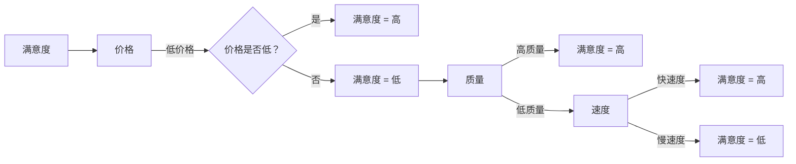

                 

# 信息差的客户期望管理：大数据如何满足客户期望

> **关键词：** 客户期望管理，大数据，信息差，预测分析，客户满意度

> **摘要：** 随着大数据技术的不断发展，企业能够更准确地了解和预测客户需求，从而提高客户满意度。本文将探讨如何通过大数据分析和管理信息差，来实现对客户期望的有效管理。

## 1. 背景介绍

在现代商业环境中，客户期望管理是一个至关重要的议题。随着市场竞争的加剧，客户对产品和服务的期望也在不断变化。企业必须深入了解客户需求，才能提供满足他们期望的产品和服务。然而，客户期望的管理并非易事，尤其是在信息差普遍存在的环境中。

信息差，指的是不同个体之间在信息获取、处理和理解方面的差异。在客户期望管理中，信息差可能导致企业无法准确把握客户需求，从而影响客户满意度。大数据技术的发展为解决这一问题提供了新的可能性。

## 2. 核心概念与联系

### 2.1 大数据

大数据指的是数据量巨大、类型繁多、处理速度极快的数据集。它包括结构化数据、半结构化数据和非结构化数据。大数据技术的核心是数据存储、数据挖掘和分析。

### 2.2 客户期望

客户期望是指客户对产品和服务的预期效果和心理期望。它包括功能、性能、质量、价格、服务等方面。

### 2.3 信息差

信息差包括以下三个方面：

- **信息获取**：不同客户在获取信息方面的差异，如年龄、教育背景、职业等。
- **信息处理**：不同客户在处理信息方面的差异，如思维方式、认知能力等。
- **信息理解**：不同客户在理解信息方面的差异，如价值观、文化背景等。

### 2.4 大数据与客户期望管理

大数据技术可以帮助企业更准确地了解客户期望，从而进行有效的客户期望管理。具体体现在以下几个方面：

- **数据收集**：通过大数据技术收集客户行为数据、反馈数据等。
- **数据挖掘**：通过数据挖掘技术分析客户需求、偏好和期望。
- **数据预测**：通过数据预测技术预测客户未来需求和期望。
- **数据应用**：将预测结果应用于产品和服务设计、营销策略制定等方面。

## 3. 核心算法原理 & 具体操作步骤

### 3.1 数据收集

企业可以通过以下途径收集客户数据：

- **在线行为数据**：如网站访问记录、搜索引擎查询记录等。
- **社交媒体数据**：如微博、微信等社交媒体平台上的用户行为数据。
- **问卷调查**：通过在线或线下问卷调查收集客户需求和期望。
- **客户反馈**：收集客户对产品和服务的反馈意见。

### 3.2 数据挖掘

数据挖掘技术包括以下步骤：

- **数据预处理**：清洗、转换和集成原始数据。
- **特征选择**：从原始数据中选择与客户期望相关的特征。
- **模型选择**：选择合适的算法模型进行数据挖掘。

### 3.3 数据预测

数据预测技术包括以下步骤：

- **建立预测模型**：根据数据挖掘结果建立预测模型。
- **模型评估**：评估预测模型的准确性。
- **模型优化**：根据评估结果对预测模型进行优化。

### 3.4 数据应用

数据应用包括以下步骤：

- **产品和服务设计**：根据预测结果调整产品和服务设计，以满足客户期望。
- **营销策略制定**：根据预测结果调整营销策略，提高客户满意度。
- **客户服务改进**：根据预测结果改进客户服务，提高客户满意度。

## 4. 数学模型和公式 & 详细讲解 & 举例说明

### 4.1 数学模型

在客户期望管理中，常用的数学模型包括线性回归、逻辑回归和决策树等。

#### 4.1.1 线性回归

线性回归模型表示为：

\[ y = \beta_0 + \beta_1x_1 + \beta_2x_2 + ... + \beta_nx_n \]

其中，\( y \) 表示客户期望，\( x_1, x_2, ..., x_n \) 表示影响客户期望的因素，\( \beta_0, \beta_1, \beta_2, ..., \beta_n \) 表示模型参数。

#### 4.1.2 逻辑回归

逻辑回归模型表示为：

\[ P(y=1) = \frac{1}{1 + e^{-(\beta_0 + \beta_1x_1 + \beta_2x_2 + ... + \beta_nx_n )}} \]

其中，\( P(y=1) \) 表示客户期望为1的概率，其他符号的含义与线性回归相同。

#### 4.1.3 决策树

决策树模型表示为：

\[ y = f(x_1, x_2, ..., x_n) \]

其中，\( y \) 表示客户期望，\( x_1, x_2, ..., x_n \) 表示影响客户期望的因素，\( f \) 表示决策树函数。

### 4.2 举例说明

假设我们要预测某电商平台的客户满意度，影响客户满意度的因素有：商品价格、商品质量、服务速度等。

#### 4.2.1 线性回归模型

根据历史数据，我们得到以下线性回归模型：

\[ 满意度 = \beta_0 + \beta_1 \times 价格 + \beta_2 \times 质量 + \beta_3 \times 速度 \]

根据模型参数，我们可以预测某客户在特定价格、质量和速度条件下的满意度。

#### 4.2.2 逻辑回归模型

根据历史数据，我们得到以下逻辑回归模型：

\[ P(满意度高) = \frac{1}{1 + e^{-(\beta_0 + \beta_1 \times 价格 + \beta_2 \times 质量 + \beta_3 \times 速度 )}} \]

根据模型参数，我们可以预测某客户在特定价格、质量和速度条件下的满意度高低的概率。

#### 4.2.3 决策树模型

根据历史数据，我们得到以下决策树模型：



根据决策树模型，我们可以预测某客户在特定价格、质量和速度条件下的满意度。

## 5. 项目实战：代码实际案例和详细解释说明

### 5.1 开发环境搭建

首先，我们需要搭建一个大数据分析的开发环境。本文使用Python作为主要编程语言，相关库包括Pandas、NumPy、Scikit-learn和Matplotlib等。

### 5.2 源代码详细实现和代码解读

以下是一个简单的客户满意度预测项目示例：

```python
import pandas as pd
from sklearn.model_selection import train_test_split
from sklearn.linear_model import LinearRegression
from sklearn.metrics import mean_squared_error
import matplotlib.pyplot as plt

# 5.2.1 数据收集
data = pd.read_csv('customer_data.csv')
data.head()

# 5.2.2 数据预处理
X = data[['价格', '质量', '速度']]
y = data['满意度']
X_train, X_test, y_train, y_test = train_test_split(X, y, test_size=0.2, random_state=42)

# 5.2.3 模型训练
model = LinearRegression()
model.fit(X_train, y_train)

# 5.2.4 模型评估
y_pred = model.predict(X_test)
mse = mean_squared_error(y_test, y_pred)
print('MSE:', mse)

# 5.2.5 模型应用
price = 100
quality = 8
speed = 6
满意度 = model.predict([[price, quality, speed]])
print('预测满意度：', 满意度)

# 5.2.6 可视化
plt.scatter(X_test['价格'], y_test, color='red', label='实际满意度')
plt.plot(X_test['价格'], y_pred, color='blue', label='预测满意度')
plt.xlabel('价格')
plt.ylabel('满意度')
plt.legend()
plt.show()
```

### 5.3 代码解读与分析

#### 5.3.1 数据收集

我们使用Pandas库读取CSV格式的数据，数据包含价格、质量、速度和满意度四个特征。

#### 5.3.2 数据预处理

我们将数据集分为训练集和测试集，用于模型训练和评估。

#### 5.3.3 模型训练

我们使用线性回归模型对训练集数据进行训练。

#### 5.3.4 模型评估

使用均方误差（MSE）评估模型在测试集上的性能。

#### 5.3.5 模型应用

根据训练好的模型，预测某客户在特定价格、质量和速度条件下的满意度。

#### 5.3.6 可视化

使用Matplotlib库绘制价格与满意度之间的关系，直观地展示模型预测结果。

## 6. 实际应用场景

### 6.1 电商行业

电商企业可以通过大数据分析了解客户购买行为和偏好，从而调整产品价格、优化商品推荐，提高客户满意度。

### 6.2 银行业

银行可以通过大数据分析识别高风险客户，优化客户服务，提高客户满意度。

### 6.3 旅游业

旅游企业可以通过大数据分析了解客户需求，提供个性化旅游服务，提高客户满意度。

## 7. 工具和资源推荐

### 7.1 学习资源推荐

- **书籍：**
  - 《大数据时代》
  - 《深度学习》
  - 《机器学习实战》
- **论文：**
  - 《大规模在线学习算法研究》
  - 《基于大数据的客户需求分析研究》
- **博客：**
  - https://www.cnblogs.com/cverdong/p/9326437.html
  - https://www.2cto.com/kf/201809/768408.html
- **网站：**
  - https://www.kaggle.com/
  - https://towardsdatascience.com/

### 7.2 开发工具框架推荐

- **开发工具：**
  - Jupyter Notebook
  - PyCharm
- **大数据处理框架：**
  - Hadoop
  - Spark
- **机器学习框架：**
  - TensorFlow
  - PyTorch

### 7.3 相关论文著作推荐

- **论文：**
  - 《大数据环境下的客户需求分析研究》
  - 《基于大数据的个性化推荐系统研究》
- **著作：**
  - 《大数据时代下的市场营销策略》
  - 《大数据：创新、技术和战略》

## 8. 总结：未来发展趋势与挑战

### 8.1 发展趋势

- **数据质量提升**：随着数据收集技术的进步，企业可以获得更高质量的数据，从而提高预测准确性。
- **算法优化**：研究人员将继续优化算法，提高大数据分析的性能。
- **跨领域应用**：大数据技术将在更多行业得到应用，如医疗、金融、教育等。

### 8.2 挑战

- **数据隐私**：在收集和使用大数据时，保护客户隐私是一个重要挑战。
- **算法透明性**：随着算法在决策过程中的作用越来越大，算法的透明性成为一个关键问题。
- **数据治理**：随着数据量的增加，如何有效地管理和治理数据成为一个挑战。

## 9. 附录：常见问题与解答

### 9.1 大数据有哪些类型？

大数据可以分为结构化数据、半结构化数据和非结构化数据。

### 9.2 什么是机器学习？

机器学习是一种通过数据训练模型，使计算机能够从数据中学习并做出预测或决策的技术。

### 9.3 大数据如何帮助企业提高客户满意度？

大数据可以帮助企业更准确地了解客户需求，从而调整产品和服务设计，提高客户满意度。

## 10. 扩展阅读 & 参考资料

- 《大数据时代》
- 《深度学习》
- 《机器学习实战》
- https://www.kaggle.com/
- https://www.2cto.com/kf/201809/768408.html
- https://www.cnblogs.com/cverdong/p/9326437.html
- https://towardsdatascience.com/

### 作者

**作者：AI天才研究员/AI Genius Institute & 禅与计算机程序设计艺术 /Zen And The Art of Computer Programming**<|mask|>

