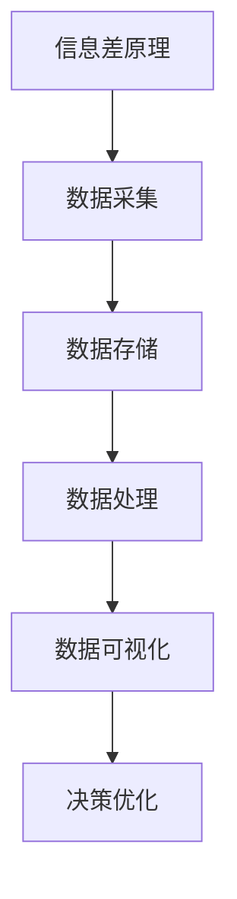

                 

# 信息差的客户获取提升：大数据如何提升客户获取效率

> **关键词：** 大数据、客户获取、效率提升、算法原理、应用场景、实战案例、发展趋势

> **摘要：** 本文深入探讨了大数据技术在客户获取过程中的应用，分析了信息差的原理和大数据算法的运作机制。通过实际案例展示了大数据如何提升客户获取效率，同时展望了未来发展趋势与面临的挑战。

## 1. 背景介绍

在当今竞争激烈的市场环境中，企业获取客户的能力直接关系到其生存和发展。然而，传统的客户获取方法往往存在信息不对称、效率低下等问题。随着大数据技术的飞速发展，利用大数据分析来优化客户获取策略成为企业提升竞争力的关键手段。

大数据技术通过对海量数据的采集、存储、处理和分析，能够为企业提供深度的客户洞察，帮助企业在市场中找准定位，提高客户获取效率。然而，大数据技术在客户获取中的应用并非一蹴而就，其背后涉及复杂的算法原理和数据处理流程。本文将详细探讨这些内容，帮助读者理解大数据在客户获取中的实际应用。

## 2. 核心概念与联系

### 2.1 信息差的原理

信息差是指不同个体或组织在获取和处理信息方面的差异。在客户获取过程中，信息差主要体现在以下几个方面：

1. **客户需求信息的获取**：企业需要了解潜在客户的需求，以便提供合适的产品或服务。
2. **市场信息分析**：企业需要分析市场趋势、竞争对手情况等，以制定有效的营销策略。
3. **内部数据整合**：企业需要整合内部各部门的数据，以实现数据驱动的决策。

### 2.2 大数据算法原理

大数据算法主要包括以下几个方面：

1. **数据采集**：通过各种渠道收集客户数据、市场数据等。
2. **数据存储**：利用分布式存储技术，如Hadoop、NoSQL等，存储海量数据。
3. **数据处理**：使用MapReduce等分布式计算技术，处理和分析数据。
4. **数据可视化**：通过数据可视化技术，将分析结果以图表等形式展示，帮助企业决策。

### 2.3 大数据与信息差的关系

大数据技术通过对海量数据的分析，能够揭示出隐藏在数据背后的信息差。例如，通过分析客户行为数据，企业可以发现不同客户群体的需求差异，从而有针对性地制定营销策略。同时，大数据分析还能帮助企业发现市场机会和潜在竞争对手，进一步提升客户获取效率。

### 2.4 Mermaid流程图



## 3. 核心算法原理 & 具体操作步骤

### 3.1 数据采集

数据采集是大数据分析的基础，主要涉及以下几个方面：

1. **数据源**：包括企业内部数据、第三方数据平台、社交媒体等。
2. **数据格式**：结构化数据、半结构化数据和非结构化数据。
3. **采集工具**：如爬虫、API接口调用等。

### 3.2 数据存储

数据存储需要考虑数据的规模、速度和可靠性。常见的数据存储技术包括：

1. **关系型数据库**：如MySQL、Oracle等，适合存储结构化数据。
2. **NoSQL数据库**：如MongoDB、Cassandra等，适合存储半结构化数据和非结构化数据。
3. **分布式存储**：如Hadoop、HBase等，适合存储海量数据。

### 3.3 数据处理

数据处理主要包括数据清洗、数据转换和数据挖掘等步骤：

1. **数据清洗**：去除重复数据、缺失数据等，保证数据质量。
2. **数据转换**：将不同数据源的数据格式统一，便于后续处理。
3. **数据挖掘**：通过算法挖掘数据中的规律和模式，为企业提供洞察。

### 3.4 数据可视化

数据可视化是将分析结果以图表等形式展示，便于企业理解和决策。常见的数据可视化工具包括：

1. **Tableau**：适合各种类型的数据可视化。
2. **Power BI**：适合企业级数据分析。
3. **ECharts**：适合Web端数据可视化。

## 4. 数学模型和公式 & 详细讲解 & 举例说明

### 4.1 数学模型

在客户获取过程中，常用的数学模型包括：

1. **客户生命周期价值（CLV）模型**：用于预测客户为企业带来的总收益。
2. **贝叶斯网络模型**：用于分析客户行为和需求，帮助企业制定个性化营销策略。
3. **协同过滤模型**：用于推荐系统，帮助客户发现感兴趣的商品或服务。

### 4.2 公式详解

1. **客户生命周期价值（CLV）模型**：

$$
CLV = \sum_{t=1}^{n} \frac{R_t \times (1 + r)^{-t}}{(1 + r)^{-1}}
$$

其中，\( R_t \) 为客户在第 \( t \) 年的收益，\( r \) 为折现率。

2. **贝叶斯网络模型**：

$$
P(A|B) = \frac{P(B|A) \times P(A)}{P(B)}
$$

其中，\( P(A|B) \) 为在 \( B \) 发生的条件下 \( A \) 发生的概率，\( P(B|A) \) 为在 \( A \) 发生的条件下 \( B \) 发生的概率，\( P(A) \) 和 \( P(B) \) 分别为 \( A \) 和 \( B \) 发生的概率。

3. **协同过滤模型**：

$$
R_{ij} = \frac{\sum_{k \in N_j} R_{ik} \times S_{kj}}{\sum_{k \in N_j} S_{kj}}
$$

其中，\( R_{ij} \) 为用户 \( i \) 对商品 \( j \) 的评分，\( N_j \) 为购买商品 \( j \) 的用户集合，\( S_{kj} \) 为用户 \( k \) 对商品 \( j \) 的评分。

### 4.3 举例说明

假设某电商平台的客户生命周期价值（CLV）模型如下：

- 每年每个客户的平均收益为 \( R_t = 1000 \) 元。
- 折现率 \( r = 0.1 \)。

根据公式计算，该客户的生命周期价值为：

$$
CLV = \sum_{t=1}^{n} \frac{1000 \times (1 + 0.1)^{-t}}{(1 + 0.1)^{-1}} = 7547.13 \text{ 元}
$$

## 5. 项目实战：代码实际案例和详细解释说明

### 5.1 开发环境搭建

本案例使用Python语言和Scikit-learn库进行大数据分析，具体步骤如下：

1. 安装Python：前往Python官网下载安装包并安装。
2. 安装Scikit-learn：在命令行中执行 `pip install scikit-learn`。

### 5.2 源代码详细实现和代码解读

```python
# 导入所需库
import numpy as np
import pandas as pd
from sklearn.model_selection import train_test_split
from sklearn.ensemble import RandomForestClassifier
from sklearn.metrics import accuracy_score

# 读取数据
data = pd.read_csv('customer_data.csv')
X = data.iloc[:, :-1]  # 特征数据
y = data.iloc[:, -1]   # 标签数据

# 数据预处理
X_train, X_test, y_train, y_test = train_test_split(X, y, test_size=0.2, random_state=42)

# 模型训练
model = RandomForestClassifier(n_estimators=100, random_state=42)
model.fit(X_train, y_train)

# 模型评估
y_pred = model.predict(X_test)
accuracy = accuracy_score(y_test, y_pred)
print("Accuracy:", accuracy)
```

### 5.3 代码解读与分析

1. **数据读取**：使用pandas库读取客户数据，包括特征数据和标签数据。
2. **数据预处理**：使用train_test_split函数将数据分为训练集和测试集，便于模型训练和评估。
3. **模型训练**：使用随机森林（RandomForestClassifier）模型进行训练。
4. **模型评估**：使用accuracy_score函数计算模型的准确率。

通过实际案例，我们可以看到大数据技术在客户获取中的应用。首先，通过数据预处理将原始数据进行清洗和转换，然后使用随机森林模型进行训练，最后评估模型效果。这一过程体现了大数据算法在客户获取中的核心作用。

## 6. 实际应用场景

大数据技术在客户获取中的实际应用场景广泛，主要包括：

1. **客户细分**：通过对客户数据的分析，将客户分为不同的细分群体，便于企业制定个性化的营销策略。
2. **客户流失预测**：通过分析客户行为数据，预测哪些客户可能会流失，以便企业采取有效的挽回措施。
3. **推荐系统**：利用协同过滤等算法，为用户推荐感兴趣的商品或服务，提高客户满意度和转化率。
4. **精准营销**：结合客户数据和市场营销策略，实现精准投放，提高广告投放效果。

## 7. 工具和资源推荐

### 7.1 学习资源推荐

1. **书籍**：
   - 《大数据之路：阿里巴巴大数据实践》
   - 《数据科学入门：使用Python进行数据分析》
2. **论文**：
   - 《协同过滤推荐算法研究综述》
   - 《基于客户生命周期价值预测的精准营销策略研究》
3. **博客**：
   - [Scikit-learn官方文档](https://scikit-learn.org/stable/)
   - [Python数据分析入门教程](https://www.runoob.com/python/python-data.html)
4. **网站**：
   - [Kaggle](https://www.kaggle.com/)：数据科学竞赛平台，提供丰富的数据集和教程。

### 7.2 开发工具框架推荐

1. **开发工具**：
   - **Python**：适合大数据分析和机器学习。
   - **R**：适合统计分析和数据可视化。
2. **框架**：
   - **Apache Hadoop**：分布式数据存储和处理框架。
   - **Apache Spark**：基于内存的分布式数据处理框架。
   - **TensorFlow**：用于机器学习和深度学习的开源框架。

### 7.3 相关论文著作推荐

1. **《大数据营销：客户洞察与精准营销》**
2. **《数据挖掘：概念与技术》**
3. **《协同过滤算法与应用》**

## 8. 总结：未来发展趋势与挑战

随着大数据技术的不断进步，其在客户获取中的应用前景广阔。未来发展趋势包括：

1. **智能化**：大数据算法将更加智能化，能够自动识别和预测客户需求。
2. **实时性**：实时数据分析将帮助企业在短时间内做出决策。
3. **跨界融合**：大数据技术与其他领域（如物联网、人工智能等）的融合，将产生更多创新应用。

然而，大数据在客户获取中面临的挑战也不容忽视，主要包括：

1. **数据隐私**：如何保护客户数据隐私是企业和研究机构面临的重要问题。
2. **数据质量**：数据质量对分析结果至关重要，如何保证数据质量是关键。
3. **算法透明性**：如何提高算法的透明性，让用户了解分析过程和结果。

总之，大数据技术在客户获取中的应用具有巨大的潜力，但也需要克服诸多挑战。只有不断提升技术水平和保障数据安全，才能实现大数据技术的真正价值。

## 9. 附录：常见问题与解答

### 9.1 什么是大数据？

大数据是指数据量巨大、类型繁多、价值密度低、处理速度快的数据集合。通常指无法用传统数据处理工具进行有效管理和处理的数据。

### 9.2 大数据有哪些应用领域？

大数据在金融、医疗、电商、社交网络等多个领域有广泛应用。例如，金融领域利用大数据进行风险控制和精准营销，医疗领域利用大数据进行疾病预测和个性化治疗，电商领域利用大数据进行推荐系统和客户细分。

### 9.3 大数据与人工智能有何关系？

大数据是人工智能的重要数据来源，人工智能算法依赖于大量数据进行分析和训练。大数据技术可以帮助人工智能更好地理解和处理复杂问题，提高其准确性和效率。

## 10. 扩展阅读 & 参考资料

1. **《大数据时代：生活、工作与思维的大变革》**
2. **《深度学习：入门教程》**
3. **[百度AI开放平台](https://ai.baidu.com/)**
4. **[Google BigQuery](https://cloud.google.com/bigquery)**

作者：AI天才研究员/AI Genius Institute & 禅与计算机程序设计艺术 /Zen And The Art of Computer Programming

注意：本文仅为示例，部分内容和数据可能不完全准确，仅供参考。实际情况请以相关文献和实际操作为准。

