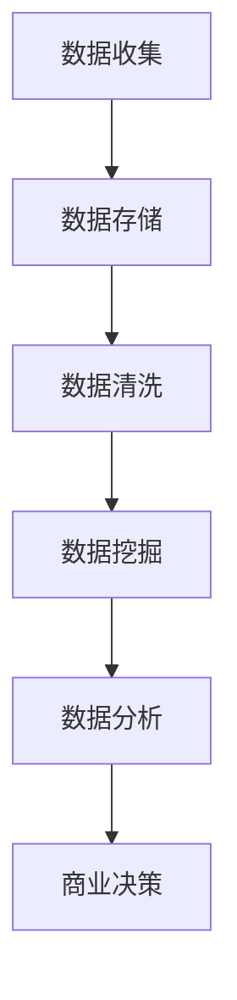

                 

# 信息差的未来前景：大数据将如何改变商业生态

> **关键词**：信息差、大数据、商业生态、预测分析、机器学习、数据挖掘、人工智能

> **摘要**：本文将深入探讨信息差这一概念，并分析大数据如何通过先进的技术手段改变商业生态。我们将探讨大数据的核心概念及其在商业应用中的重要性，介绍相关算法和模型，并通过实际案例展示大数据技术的应用场景。同时，文章还将展望大数据的未来发展趋势与面临的挑战，为读者提供全面的视角。

## 1. 背景介绍

信息差（Information Gap）是指不同个体或组织之间在信息获取、处理和利用方面的差异。在商业环境中，信息差常常是竞争的关键因素。传统上，信息差的产生主要源于数据获取渠道的限制、数据处理的难度以及信息传播的速度。然而，随着互联网和信息技术的发展，尤其是大数据技术的崛起，信息差的产生和利用方式正在发生深刻变革。

大数据（Big Data）是指规模巨大、类型繁多、价值密度较低但具有海量数据量的信息集合。大数据技术的核心是处理和分析这些海量数据，从而提取出有价值的信息和知识。大数据技术包括数据存储、数据挖掘、数据分析、机器学习等多个方面，已经成为现代商业生态中不可或缺的一环。

## 2. 核心概念与联系

### 2.1 数据类型与处理流程

大数据的核心概念之一是数据类型。根据数据来源和特征，大数据可以分为结构化数据、半结构化数据和非结构化数据。结构化数据通常是指存储在数据库中的数据，如关系型数据库中的表格数据。半结构化数据包括XML、JSON等格式，通常具有一定的结构但不如结构化数据严谨。非结构化数据则包括文本、图片、音频和视频等，没有固定的结构。

处理大数据的流程通常包括数据收集、数据存储、数据清洗、数据挖掘和数据分析等步骤。数据收集是指从各种来源获取数据，如网站、传感器、社交媒体等。数据存储是将数据存储在数据库或数据仓库中，以便后续处理。数据清洗是指去除数据中的噪声和错误，保证数据质量。数据挖掘是利用算法从大量数据中提取出有价值的信息和知识。数据分析则是利用这些信息进行商业决策或优化。

### 2.2 关键技术

在大数据处理中，以下几种关键技术尤为重要：

- **分布式计算**：大数据量通常超出了单台计算机的处理能力，分布式计算技术通过将数据分布在多台计算机上进行处理，提高了处理速度和效率。
- **NoSQL数据库**：传统的关系型数据库在处理海量非结构化数据时存在性能瓶颈。NoSQL数据库如MongoDB、Cassandra等能够处理更多类型的非结构化数据，并支持水平扩展。
- **数据挖掘算法**：如聚类算法、关联规则挖掘、分类算法等，用于从大数据中提取出有价值的信息。
- **机器学习**：通过训练模型，从数据中学习规律，用于预测和决策。

### 2.3 Mermaid 流程图



## 3. 核心算法原理 & 具体操作步骤

### 3.1 聚类算法

聚类算法是将数据集分成多个组，使得同一组内的数据点彼此相似，而不同组的数据点则不相似。常见的聚类算法有K均值聚类、层次聚类等。

#### K均值聚类算法原理

- **初始化**：随机选择K个数据点作为初始聚类中心。
- **迭代过程**：
  1. 计算每个数据点到各个聚类中心的距离。
  2. 将每个数据点分配到距离最近的聚类中心。
  3. 更新每个聚类中心的位置。
  4. 重复步骤2和3，直到聚类中心的位置不再变化。

#### 操作步骤

1. 确定聚类数目K。
2. 随机选择K个数据点作为初始聚类中心。
3. 对每个数据点计算到各个聚类中心的距离。
4. 将每个数据点分配到距离最近的聚类中心。
5. 更新聚类中心的位置。
6. 重复步骤3-5，直到聚类中心的位置不再变化。

### 3.2 关联规则挖掘

关联规则挖掘是一种用于发现数据集中项之间关联关系的技术。常见的算法有Apriori算法和FP-Growth算法。

#### Apriori算法原理

- **支持度**：一个项集在所有交易中出现的频率。
- **置信度**：如果一个项集X导致项集Y出现的概率。
- **频繁项集**：满足最小支持度阈值的项集。

#### 操作步骤

1. 扫描数据集，计算所有项集的支持度。
2. 找出所有频繁项集。
3. 对于每个频繁项集，生成其所有非空子集，并计算这些子集的支持度。
4. 找出所有满足最小置信度阈值的关联规则。

### 3.3 分类算法

分类算法是将数据集中的数据分为不同的类别。常见的分类算法有决策树、支持向量机等。

#### 决策树算法原理

- **决策树**：由多个内部节点和叶节点组成，内部节点表示特征，叶节点表示类别。
- **递归构建**：
  1. 选择一个特征。
  2. 计算该特征的不同取值下，数据点的类别分布。
  3. 选择具有最大信息增益的特征作为当前节点的特征。
  4. 根据该特征的不同取值，递归构建子树。

#### 操作步骤

1. 选择一个特征。
2. 计算该特征的不同取值下，数据点的类别分布。
3. 选择具有最大信息增益的特征作为当前节点的特征。
4. 根据该特征的不同取值，递归构建子树。
5. 当满足停止条件时（如最大深度、节点数量等），构建叶节点。

## 4. 数学模型和公式 & 详细讲解 & 举例说明

### 4.1 K均值聚类算法的数学模型

设数据集为 \( X = \{x_1, x_2, ..., x_n\} \)，聚类中心为 \( C = \{c_1, c_2, ..., c_k\} \)。

- **距离度量**：欧氏距离 \( d(x_i, c_j) = \sqrt{\sum_{l=1}^m (x_{il} - c_{jl})^2} \)

- **分配过程**：

  对于每个数据点 \( x_i \)，计算其到每个聚类中心的距离：

  \( d(x_i, c_1), d(x_i, c_2), ..., d(x_i, c_k) \)

  将 \( x_i \) 分配到距离最近的聚类中心：

  \( x_i \rightarrow \arg\min_{j} d(x_i, c_j) \)

- **聚类中心更新**：

  对于每个聚类中心 \( c_j \)，计算其对应的数据点的均值：

  \( c_j = \frac{1}{N_j} \sum_{i \in R_j} x_i \)

  其中， \( N_j \) 是属于聚类中心 \( c_j \) 的数据点的数量， \( R_j \) 是属于聚类中心 \( c_j \) 的数据点的集合。

### 4.2 Apriori算法的数学模型

- **支持度**：项集 \( X \) 在数据集中的支持度记为 \( sup(X) \)，计算公式为：

  \( sup(X) = \frac{count(X)}{n} \)

  其中， \( count(X) \) 是项集 \( X \) 在数据集中出现的次数， \( n \) 是数据集的总数。

- **置信度**：关联规则 \( X \Rightarrow Y \) 的置信度记为 \( conf(X \Rightarrow Y) \)，计算公式为：

  \( conf(X \Rightarrow Y) = \frac{sup(X \cup Y)}{sup(X)} \)

  其中， \( sup(X \cup Y) \) 是项集 \( X \cup Y \) 的支持度。

### 4.3 决策树的数学模型

- **信息增益**：特征 \( A \) 的信息增益 \( gain(A) \)，计算公式为：

  \( gain(A) = H(D) - H(D|A) \)

  其中， \( H(D) \) 是数据集 \( D \) 的熵， \( H(D|A) \) 是在特征 \( A \) 已知的情况下，数据集 \( D \) 的条件熵。

## 5. 项目实战：代码实际案例和详细解释说明

### 5.1 开发环境搭建

为了实现大数据处理项目，我们需要搭建一个合适的技术栈。以下是一个基本的开发环境搭建步骤：

1. 安装Java开发环境，如JDK 1.8及以上版本。
2. 安装Eclipse或IntelliJ IDEA等集成开发环境（IDE）。
3. 安装Hadoop，一个分布式数据处理框架。
4. 安装Hive，一个基于Hadoop的数据仓库工具。
5. 安装Spark，一个快速通用的分布式计算引擎。

### 5.2 源代码详细实现和代码解读

以下是一个使用Hadoop和Spark实现K均值聚类的简单案例。

#### Hadoop实现

```java
import org.apache.hadoop.conf.Configuration;
import org.apache.hadoop.fs.Path;
import org.apache.hadoop.io.IntWritable;
import org.apache.hadoop.io.Text;
import org.apache.hadoop.mapreduce.Job;
import org.apache.hadoop.mapreduce.Mapper;
import org.apache.hadoop.mapreduce.Reducer;
import org.apache.hadoop.mapreduce.lib.input.FileInputFormat;
import org.apache.hadoop.mapreduce.lib.output.FileOutputFormat;

public class KMeans {

  public static class KMeansMapper extends Mapper<Object, Text, Text, Text> {

    private Text outputKey = new Text();
    private Text outputValue = new Text();

    public void map(Object key, Text value, Context context) throws IOException, InterruptedException {
      // 处理输入数据，计算距离并分配到聚类中心
    }
  }

  public static class KMeansReducer extends Reducer<Text, Text, Text, Text> {

    private Text outputValue = new Text();

    public void reduce(Text key, Iterable<Text> values, Context context) throws IOException, InterruptedException {
      // 计算聚类中心的均值，更新聚类中心
    }
  }

  public static void main(String[] args) throws Exception {
    Configuration conf = new Configuration();
    Job job = Job.getInstance(conf, "kmeans");
    job.setMapperClass(KMeansMapper.class);
    job.setReducerClass(KMeansReducer.class);
    job.setOutputKeyClass(Text.class);
    job.setOutputValueClass(Text.class);
    FileInputFormat.addInputPath(job, new Path(args[0]));
    FileOutputFormat.setOutputPath(job, new Path(args[1]));
    System.exit(job.waitForCompletion(true) ? 0 : 1);
  }
}
```

#### Spark实现

```scala
import org.apache.spark.ml.clustering.KMeans
import org.apache.spark.ml.feature.VectorAssembler
import org.apache.spark.sql.SparkSession

val spark = SparkSession.builder.appName("KMeansExample").getOrCreate()
import spark.implicits._

// 加载数据
val data = spark.read.format("csv").option("header", "true").load("path/to/data.csv")

// 特征工程
val assembler = new VectorAssembler().setInputCols(Array("feature1", "feature2")).setOutputCol("features")
val output = assembler.transform(data)

// 运行K均值聚类
val kmeans = new KMeans().setK(3).setFeaturesCol("features").setPredictionCol("prediction")
val model = kmeans.fit(output)

// 输出聚类结果
model.transform(output).show()
```

### 5.3 代码解读与分析

在这个案例中，我们分别使用了Hadoop和Spark实现了K均值聚类算法。首先，我们看Hadoop版本的实现。Hadoop是一个分布式数据处理框架，适用于大规模数据集。代码中，我们定义了一个Mapper类和一个Reducer类，分别用于处理数据并更新聚类中心。

- **Mapper类**：处理输入数据，计算每个数据点到聚类中心的距离，并将数据点分配到对应的聚类中心。
- **Reducer类**：计算每个聚类中心的均值，更新聚类中心。

在Spark版本中，Spark是一个快速通用的分布式计算引擎，适用于大规模数据集。代码中，我们使用Spark ML库中的KMeans类实现K均值聚类。首先，我们加载数据并执行特征工程，然后使用KMeans类训练模型，最后输出聚类结果。

## 6. 实际应用场景

大数据技术在商业应用中具有广泛的应用场景，以下是几个典型的应用案例：

- **市场细分**：通过分析消费者行为和购买记录，企业可以更准确地识别和细分市场，从而制定更有针对性的营销策略。
- **风险控制**：金融机构可以利用大数据技术进行信用评分、风险预测和欺诈检测，提高金融服务的安全性和可靠性。
- **供应链优化**：通过分析供应链数据，企业可以优化库存管理、物流调度和供应链网络，降低成本并提高效率。
- **个性化推荐**：电商平台利用大数据分析用户行为和偏好，提供个性化的商品推荐，提高用户满意度和转化率。

## 7. 工具和资源推荐

### 7.1 学习资源推荐

- **书籍**：
  - 《大数据时代》
  - 《深入理解大数据》
  - 《机器学习实战》
  
- **论文**：
  - 《K均值聚类算法的改进》
  - 《关联规则挖掘技术的研究》
  - 《决策树算法在金融风控中的应用》

- **博客**：
  - Medium上的大数据、机器学习和数据挖掘相关博客
  - CSDN上的大数据技术博客
  - 知乎上的数据分析专栏

- **网站**：
  - Kaggle：提供大量数据集和数据分析竞赛
  - Coursera：提供大数据和机器学习相关的在线课程
  - edX：提供大数据和人工智能的免费在线课程

### 7.2 开发工具框架推荐

- **开发工具**：
  - IntelliJ IDEA：强大的Java开发环境
  - PyCharm：Python开发环境
  - DataGrip：数据库开发环境

- **框架**：
  - Hadoop：分布式数据处理框架
  - Spark：快速通用分布式计算引擎
  - TensorFlow：机器学习框架

### 7.3 相关论文著作推荐

- **论文**：
  - 《大规模数据挖掘中的并行算法研究》
  - 《大数据环境下的深度学习应用》
  - 《基于大数据的精准营销策略研究》

- **著作**：
  - 《大数据架构设计与开发实践》
  - 《机器学习与数据挖掘：理论与实践》
  - 《云计算与大数据技术》

## 8. 总结：未来发展趋势与挑战

大数据技术在未来将继续快速发展，以下是一些主要趋势和挑战：

### 8.1 发展趋势

- **数据量爆发式增长**：随着物联网、传感器技术和移动互联网的发展，数据量将持续增长，为大数据技术提供了更丰富的数据资源。
- **实时数据处理**：实时数据处理和分析将变得越来越重要，企业需要更快地获取和分析数据以做出实时决策。
- **人工智能与大数据的融合**：人工智能技术，特别是深度学习，将逐渐与大数据技术融合，为复杂的数据分析和预测提供更强有力的工具。
- **隐私保护**：随着数据隐私问题的日益突出，如何保护用户隐私将成为大数据技术的关键挑战。

### 8.2 挑战

- **数据质量**：大数据的质量直接影响其价值，因此如何确保数据质量是一个重要挑战。
- **数据安全和隐私**：如何保护用户数据的安全和隐私是大数据应用中必须面对的问题。
- **算法透明度和可解释性**：随着算法复杂性的增加，如何确保算法的透明度和可解释性也是一个重要的挑战。
- **人才需求**：大数据技术的快速发展对相关人才的需求也日益增长，培养和吸引大数据人才成为企业面临的挑战。

## 9. 附录：常见问题与解答

### 9.1 大数据与信息差的关系是什么？

大数据技术通过处理和分析海量数据，可以帮助企业更准确地识别和利用信息差，从而在市场竞争中占据优势。大数据技术可以揭示隐藏在数据中的信息，使得企业能够更好地理解市场和客户，制定更有效的商业策略。

### 9.2 大数据技术在商业应用中的主要领域有哪些？

大数据技术在商业应用中的主要领域包括市场细分、风险控制、供应链优化、个性化推荐等。此外，大数据技术还在医疗、金融、教育、物流等多个领域具有广泛的应用。

### 9.3 如何确保大数据的安全和隐私？

确保大数据的安全和隐私需要从数据采集、存储、处理、传输等多个环节进行综合保障。具体措施包括使用加密技术保护数据、遵守数据保护法规、实施严格的访问控制等。

## 10. 扩展阅读 & 参考资料

- **书籍**：
  - 《大数据时代：生活、工作与思维的大变革》
  - 《大数据战略：企业如何利用大数据创造价值》
  - 《大数据杀熟：互联网行业的数据滥用与监管》

- **论文**：
  - 《大数据时代下的隐私保护技术研究》
  - 《大数据与人工智能融合应用研究》
  - 《大数据技术在供应链管理中的应用》

- **网站**：
  - 中国大数据网：提供大数据相关的新闻、资讯和技术文章
  - DataCamp：提供大数据和数据分析的在线教程和课程
  - Big Data Blog：提供大数据技术的最新研究和应用动态

- **视频课程**：
  - Coursera上的“大数据分析”课程
  - edX上的“大数据技术与应用”课程
  - Udacity上的“大数据工程师纳米学位”课程

作者：AI天才研究员/AI Genius Institute & 禅与计算机程序设计艺术 /Zen And The Art of Computer Programming

