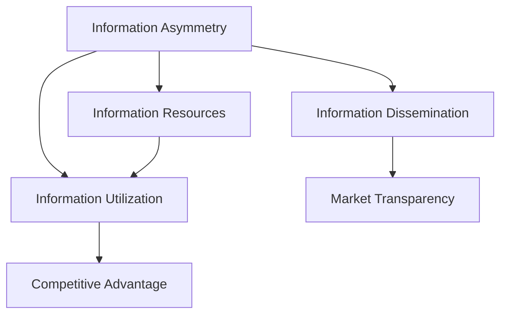

                 

### 背景介绍

信息差，这是一个在商业世界中被广泛提及的概念，它指的是不同个体或群体之间对信息的了解程度存在差异。这种信息不对称可以导致某些个体或群体在交易、决策、竞争等方面拥有优势。在当今这个信息化时代，信息差的存在变得更加普遍和显著。无论是在企业经营管理、市场营销，还是个人投资理财，信息差的影响都不可忽视。

本文旨在探讨信息差在客户保持中的重要性。我们将首先介绍信息差的定义，然后分析信息不对称如何影响客户行为，最后讨论如何利用信息差来增强客户保持的策略。通过本文的阅读，读者将了解信息差的基本概念，掌握分析信息不对称的方法，并学会如何在实践中运用这些策略。

首先，让我们明确信息差的定义。信息差是指不同个体或群体在获取、理解和利用信息方面的差异。这种差异可能源于信息源的不同、信息传递的障碍、个体认知能力的差异等因素。例如，企业内部的研发团队可能比市场部门更早了解到新技术的进展，从而在产品开发中占据先机。在个人投资中，那些拥有专业知识和资源的人往往能够更快地获取市场信息，做出更明智的投资决策。

接下来，我们将深入探讨信息不对称如何影响客户行为。信息不对称会导致客户在交易过程中处于劣势地位，从而影响其信任感和满意度。例如，在电子商务中，消费者往往无法完全了解商品的真实质量和服务细节，这就可能导致消费者对购买决策产生犹豫和不安。因此，如何减少信息不对称，增强客户信任，成为企业面临的重要课题。

最后，本文将介绍如何利用信息差来增强客户保持。企业可以通过提供独特的信息资源、创新的服务模式、透明的沟通渠道等方式，缩小与客户之间的信息差距，从而提高客户的满意度和忠诚度。通过这些策略，企业不仅能够吸引新客户，还能有效地留住现有客户，实现长期的可持续发展。

总的来说，信息差是一个复杂而重要的概念，它不仅影响企业的经营策略，也影响客户的消费行为。在接下来的章节中，我们将通过具体案例和实例，深入探讨这一主题。让我们开始这场关于信息差的深度探讨之旅吧！<|markdown|

## 1. 背景介绍

### Information Gap

Information gap, a widely discussed concept in the business world, refers to the difference in the level of information between individuals or groups. This asymmetry in information can lead to advantages in transactions, decision-making, and competition. In today's信息化时代，information gap exists more commonly and significantly. Whether it's in business management, marketing, or personal investment, the impact of information gap cannot be overlooked.

This article aims to explore the importance of information gap in customer retention. We will first introduce the definition of information gap, then analyze how information asymmetry affects customer behavior, and finally discuss strategies for leveraging information gap to enhance customer retention. Through this article, readers will understand the basic concept of information gap, master methods for analyzing information asymmetry, and learn how to apply these strategies in practice.

Firstly, let's clarify the definition of information gap. Information gap refers to the difference in the acquisition, understanding, and utilization of information between individuals or groups. This difference may arise from different information sources, barriers in information transmission, or differences in individual cognitive abilities. For example, an R&D team within a company may have earlier access to the progress of new technologies than the marketing department, giving them a competitive edge in product development. In personal investment, individuals with professional knowledge and resources often have faster access to market information, enabling them to make more informed investment decisions.

Next, we will delve into how information asymmetry affects customer behavior. Information asymmetry can put customers at a disadvantage during transactions, impacting their trust and satisfaction. For instance, in e-commerce, consumers often lack complete knowledge of the true quality and service details of a product, leading to hesitation and unease in making purchase decisions. Therefore, how to reduce information asymmetry and enhance customer trust becomes a critical issue for businesses.

Finally, this article will introduce strategies for leveraging information gap to enhance customer retention. Companies can narrow the information gap with customers by providing unique information resources, innovative service models, and transparent communication channels, thereby improving customer satisfaction and loyalty. Through these strategies, companies can not only attract new customers but also retain existing ones, achieving long-term sustainable development.

Overall, information gap is a complex and important concept that affects both business strategies and customer behavior. In the following sections, we will explore this topic in depth through specific cases and examples. Let's embark on this in-depth exploration of information gap!<|markdown|>## 2. 核心概念与联系

### The Concept and Its Relationships

在探讨信息差（Information Gap）的概念及其影响之前，我们需要明确几个核心概念，并理解它们之间的内在联系。这些概念包括信息不对称（Information Asymmetry）、信息传播（Information Dissemination）、信息资源（Information Resources）和信息利用（Information Utilization）。以下是这些概念的定义及其相互关系：

**信息不对称（Information Asymmetry）**：信息不对称是指交易双方在获取、处理或分享信息方面的不平等。这种不平等可能导致某些一方在交易中占据优势地位。例如，在二手商品交易中，卖家通常比买家更了解商品的真实状况。

**信息传播（Information Dissemination）**：信息传播是指信息从源头到接收者之间的传递过程。有效的信息传播可以减少信息不对称，提高市场的透明度。然而，信息传播过程中可能存在障碍，如信息过滤、误解和噪音干扰。

**信息资源（Information Resources）**：信息资源是指可用于决策、学习和创新的各类信息。这些资源可以包括数据库、研究报告、专业知识和人际网络。拥有丰富的信息资源可以帮助个体或组织更好地应对信息不对称。

**信息利用（Information Utilization）**：信息利用是指个体或组织对获取的信息进行整合、分析和应用的过程。有效的信息利用可以转化为竞争优势，提高决策质量和创新能力。

下面是一个使用Mermaid绘制的流程图，展示了这些核心概念之间的关系：



**流程图详细解释：**

1. **信息不对称（A）** 是一个起点，它指示了信息不平等的存在。
2. **信息传播（B）** 从信息不对称出发，通过减少信息不平等来提高市场透明度（E）。
3. **信息资源（C）** 提供了信息不对称下的决策和学习基础。
4. **信息利用（D）** 将信息资源转化为竞争优势（F）。
5. **市场透明度（E）** 是信息传播的结果，它有助于减少信息不对称。

通过理解这些核心概念及其相互关系，我们可以更深入地探讨信息差对客户保持的影响。信息差不仅是商业决策中的重要因素，也是影响客户满意度和忠诚度的关键因素。在接下来的章节中，我们将进一步分析信息不对称如何具体影响客户行为，并探讨企业如何利用信息差来保持客户。<|markdown|

## 2. 核心概念与联系

### Key Concepts and Relationships

Before delving into the concept of information gap and its impact, it's essential to define several core concepts and understand their interrelationships. These concepts include information asymmetry, information dissemination, information resources, and information utilization. Below is a definition of these concepts and their interconnected nature:

**Information Asymmetry**: Information asymmetry refers to the unequal access to information between the parties in a transaction. This imbalance can lead to one party having an advantage over the other. For example, in a second-hand goods transaction, the seller typically knows more about the product's true condition than the buyer.

**Information Dissemination**: Information dissemination is the process of transferring information from the source to the receiver. Effective information dissemination can reduce information asymmetry and increase market transparency. However, barriers such as information filtering, misinterpretation, and noise can interfere with the process.

**Information Resources**: Information resources are various types of information that can be used for decision-making, learning, and innovation. These resources can include databases, research reports, professional knowledge, and interpersonal networks. Having abundant information resources can help individuals or organizations better cope with information asymmetry.

**Information Utilization**: Information utilization refers to the process of integrating, analyzing, and applying the information that has been acquired. Effective information utilization can convert information resources into competitive advantages, enhancing decision quality and innovation.

Below is a Mermaid diagram illustrating the relationships between these core concepts:


**Details of the Flowchart**:

1. **Information Asymmetry (A)** signifies the existence of information imbalance.
2. **Information Dissemination (B)** originates from information asymmetry and aims to reduce information imbalance by increasing market transparency (E).
3. **Information Resources (C)** provide the foundation for decision-making and learning under information asymmetry.
4. **Information Utilization (D)** converts information resources into competitive advantages (F).
5. **Market Transparency (E)** is the result of information dissemination, which helps reduce information asymmetry.

Understanding these core concepts and their interrelationships allows us to delve deeper into how information gap affects customer retention. Information gap is not only a critical factor in business decision-making but also a key determinant of customer satisfaction and loyalty. In the following sections, we will further analyze how information asymmetry specifically affects customer behavior and discuss strategies for businesses to leverage information gap to retain customers.<|markdown|>## 3. 核心算法原理 & 具体操作步骤

在深入探讨信息差如何影响客户保持之前，我们需要了解几个核心算法原理，这些原理能够帮助我们识别和利用信息差。以下是一些关键算法，包括决策树（Decision Tree）、支持向量机（Support Vector Machine）和神经网络（Neural Networks），它们在处理信息不对称问题中发挥着重要作用。

### 决策树（Decision Tree）

决策树是一种常用的机器学习算法，用于分类和回归问题。它通过一系列的判断条件来划分数据集，并在每个节点上选择具有最大信息增益的特征进行划分。决策树算法的基本原理如下：

1. **特征选择**：选择能够最大化信息增益的特征进行划分。
2. **递归划分**：对于每个子数据集，重复以上特征选择和划分过程。
3. **停止条件**：当满足某些停止条件（如数据集大小或纯度达到阈值）时，停止划分。

具体操作步骤如下：

1. **数据预处理**：收集和整理客户数据，包括购买行为、消费偏好、历史记录等。
2. **特征选择**：使用信息增益或其他特征选择指标，选择最具区分力的特征。
3. **划分数据集**：根据选择的特征，将数据集划分为多个子数据集。
4. **构建决策树**：递归地构建决策树，直到满足停止条件。
5. **评估模型**：使用交叉验证等方法评估决策树的性能。

### 支持向量机（Support Vector Machine）

支持向量机是一种二分类算法，通过找到一个最佳的超平面来将不同类别的数据分开。它的基本原理如下：

1. **线性可分支持向量机**：寻找一个能够最大化分类间隔的超平面。
2. **非线性可分支持向量机**：使用核函数将数据映射到高维空间，然后在高维空间中寻找最佳超平面。

具体操作步骤如下：

1. **数据预处理**：进行特征提取和归一化处理，确保数据适合模型。
2. **选择核函数**：根据数据特征选择适当的核函数。
3. **训练模型**：使用训练数据集训练支持向量机模型。
4. **评估模型**：使用测试数据集评估模型的性能，调整参数以优化模型。

### 神经网络（Neural Networks）

神经网络是一种模拟人脑神经元连接的模型，通过多层神经元实现复杂函数的建模。它的基本原理如下：

1. **前向传播**：将输入数据通过网络的多个层传递，逐层计算输出。
2. **反向传播**：通过计算误差，调整网络的权重和偏置，以最小化损失函数。

具体操作步骤如下：

1. **设计网络结构**：确定网络的层数、每层的神经元数量和激活函数。
2. **数据预处理**：进行特征提取和归一化处理。
3. **训练模型**：使用训练数据集训练神经网络模型。
4. **评估模型**：使用测试数据集评估模型的性能。

通过这些核心算法原理，企业可以更准确地识别和利用信息差。例如，决策树可以帮助企业识别哪些特征对客户保持最具影响力，支持向量机可以用来预测哪些客户可能流失，神经网络可以用于构建个性化推荐系统，从而更好地满足客户需求。

在接下来的章节中，我们将结合实际案例，详细解释这些算法在客户保持中的应用。这将为读者提供实际操作指导，并帮助他们在实际业务场景中应用这些算法。让我们继续深入探讨如何通过算法来增强客户保持策略吧！<|markdown|

### Core Algorithm Principles and Specific Steps

Before delving into how information gap affects customer retention, it's essential to understand several core algorithm principles that can help us identify and leverage information gaps. These include decision trees, support vector machines (SVM), and neural networks, all of which play significant roles in addressing information asymmetry.

### Decision Trees

Decision trees are a commonly used machine learning algorithm for classification and regression tasks. Their basic principle involves a series of decision rules that divide the data into subsets. Here's how the algorithm works:

1. **Feature Selection**: Choose the feature that maximizes information gain for the split.
2. **Recursive Division**: Recursively divide the subsets using the selected feature.
3. **Stopping Criteria**: Stop dividing when certain criteria are met (e.g., subset size or purity reaches a threshold).

The specific steps are as follows:

1. **Data Preprocessing**: Collect and organize customer data, including purchasing behavior, preferences, and historical records.
2. **Feature Selection**: Use information gain or other feature selection metrics to identify the most discriminative features.
3. **Data Division**: Divide the dataset into subsets based on the selected features.
4. **Building the Decision Tree**: Recursively construct the decision tree until the stopping criteria are met.
5. **Model Evaluation**: Evaluate the performance of the decision tree using cross-validation methods.

### Support Vector Machines (SVM)

Support Vector Machines are a binary classification algorithm that finds the best hyperplane to separate different classes of data. The basic principle includes:

1. **Linearly Separable SVM**: Find a hyperplane that maximizes the margin between classes.
2. **Non-linearly Separable SVM**: Use kernel functions to map the data into a higher-dimensional space and then find the best hyperplane in this space.

The specific steps are as follows:

1. **Data Preprocessing**: Perform feature extraction and normalization to ensure the data is suitable for the model.
2. **Kernel Function Selection**: Choose an appropriate kernel function based on the data characteristics.
3. **Model Training**: Train the SVM model using the training dataset.
4. **Model Evaluation**: Evaluate the model's performance using the test dataset and adjust parameters to optimize the model.

### Neural Networks

Neural networks are a type of model that simulates the connections of neurons in the human brain, allowing for the modeling of complex functions. Their basic principles include:

1. **Forward Propagation**: Pass input data through multiple layers of the network, computing the output at each layer.
2. **Backpropagation**: Calculate the error and adjust the network's weights and biases to minimize the loss function.

The specific steps are as follows:

1. **Network Structure Design**: Determine the number of layers, the number of neurons per layer, and the activation functions.
2. **Data Preprocessing**: Perform feature extraction and normalization.
3. **Model Training**: Train the neural network model using the training dataset.
4. **Model Evaluation**: Evaluate the model's performance using the test dataset.

By understanding these core algorithm principles, companies can more accurately identify and leverage information gaps. For example, decision trees can help identify which features are most influential in customer retention, SVMs can predict which customers are likely to churn, and neural networks can be used to build personalized recommendation systems to better meet customer needs.

In the following sections, we will delve into real-world cases to explain how these algorithms are applied in customer retention. This will provide practical guidance for readers and help them apply these algorithms in real business scenarios. Let's continue exploring how algorithms can enhance customer retention strategies!<|markdown|>## 4. 数学模型和公式 & 详细讲解 & 举例说明

在分析信息差对客户保持的影响时，数学模型和公式起着至关重要的作用。通过数学模型，我们可以量化信息不对称的程度，评估其对企业业绩的影响，并设计出有效的策略来缩小信息差距。以下是一些常用的数学模型和公式，以及它们的详细解释和举例说明。

### 信息不对称度（Information Asymmetry Degree）

信息不对称度用于衡量信息差距的大小。它可以通过计算买卖双方的信息差异来量化信息不对称。以下是信息不对称度的计算公式：

$$
IAD = \frac{|\bar{X}_s - \bar{X}_b|}{\bar{X}_s + \bar{X}_b}
$$

其中，$IAD$ 是信息不对称度，$\bar{X}_s$ 是卖方平均信息量，$\bar{X}_b$ 是买方平均信息量。

**解释**：该公式表示卖方和买方信息量的差值与两者信息量总和的比值。当 $IAD$ 趋近于 1 时，表示卖方具有绝对信息优势；当 $IAD$ 趋近于 0 时，表示信息差距很小。

**举例**：假设卖方掌握了一个新产品的详细信息，而买方对此一无所知。卖方的平均信息量为 10，买方的平均信息量为 1。则信息不对称度为：

$$
IAD = \frac{|10 - 1|}{10 + 1} = \frac{9}{11} \approx 0.818
$$

这意味着卖方在信息上具有较大的优势。

### 信息利用效率（Information Utilization Efficiency）

信息利用效率衡量企业如何有效地利用其掌握的信息资源来提高客户满意度。其计算公式如下：

$$
IUE = \frac{\text{Effective Information Use}}{\text{Total Information Available}}
$$

其中，$IUE$ 是信息利用效率，Effective Information Use 是有效利用的信息量，Total Information Available 是总的信息量。

**解释**：该公式表示有效利用的信息量与总信息量的比值。一个高效率的信息利用意味着企业能够从其信息资源中提取出最大价值。

**举例**：假设一家电商企业收集了 10000 条客户购买记录，其中 5000 条被用于个性化推荐，提升了 20% 的销售额。则信息利用效率为：

$$
IUE = \frac{5000}{10000} = 0.5
$$

这意味着企业只利用了 50% 的信息资源。

### 客户流失概率（Customer Churn Probability）

客户流失概率用于预测客户在未来某个时间段内停止使用企业服务的可能性。可以使用逻辑回归模型来计算客户流失概率。逻辑回归模型的公式为：

$$
P(Y=1) = \frac{1}{1 + e^{-(\beta_0 + \beta_1X_1 + \beta_2X_2 + ... + \beta_nX_n})}
$$

其中，$P(Y=1)$ 是客户流失概率，$X_1, X_2, ..., X_n$ 是影响客户流失的预测变量，$\beta_0, \beta_1, ..., \beta_n$ 是模型参数。

**解释**：该公式表示客户流失概率是指数函数的负数线性组合的结果。参数 $\beta$ 的值反映了每个预测变量对客户流失概率的影响程度。

**举例**：假设使用逻辑回归模型预测客户流失，其中预测变量包括客户满意度（X1）、购买频率（X2）和竞争对手活动（X3）。模型参数如下：

$$
P(Y=1) = \frac{1}{1 + e^{-(5.0 + 3.2X_1 + 2.1X_2 + 1.5X_3)}}
$$

如果客户满意度为 7，购买频率为 5 次/月，竞争对手活动为 3 次/月，则客户流失概率为：

$$
P(Y=1) = \frac{1}{1 + e^{-(5.0 + 3.2 \times 7 + 2.1 \times 5 + 1.5 \times 3)}} \approx 0.176
$$

这意味着客户在未来一个月内停止使用服务的概率大约为 17.6%。

通过这些数学模型和公式，企业可以更科学地评估信息差的影响，制定有效的客户保持策略。在接下来的章节中，我们将通过实际案例展示这些模型在客户保持中的应用。让我们继续深入探讨吧！<|markdown|

### Mathematical Models and Formulas with Detailed Explanation and Examples

When analyzing the impact of information gap on customer retention, mathematical models and formulas play a crucial role in quantifying the level of information asymmetry and evaluating its impact on business performance. Below are some commonly used mathematical models and formulas, along with their detailed explanations and examples.

### Information Asymmetry Degree

The information asymmetry degree is used to measure the size of the information gap. It quantifies the difference in information between buyers and sellers. The formula for calculating the information asymmetry degree is as follows:

$$
IAD = \frac{|\bar{X}_s - \bar{X}_b|}{\bar{X}_s + \bar{X}_b}
$$

Where $IAD$ is the information asymmetry degree, $\bar{X}_s$ is the average information of the seller, and $\bar{X}_b$ is the average information of the buyer.

**Explanation**: This formula represents the difference between the average information of the seller and the buyer, divided by the sum of their average information. When $IAD$ approaches 1, it indicates that the seller has an absolute information advantage; when $IAD$ approaches 0, it indicates that the information gap is small.

**Example**: Suppose the seller has detailed information about a new product while the buyer knows nothing about it. The seller's average information is 10, and the buyer's average information is 1. The information asymmetry degree is:

$$
IAD = \frac{|10 - 1|}{10 + 1} = \frac{9}{11} \approx 0.818
$$

This means the seller has a significant information advantage.

### Information Utilization Efficiency

Information utilization efficiency measures how effectively a company uses its information resources to enhance customer satisfaction. The formula for calculating information utilization efficiency is as follows:

$$
IUE = \frac{\text{Effective Information Use}}{\text{Total Information Available}}
$$

Where $IUE$ is the information utilization efficiency, and "Effective Information Use" and "Total Information Available" are the quantities of effectively used information and total available information, respectively.

**Explanation**: This formula represents the ratio of effective information use to total information available. A high efficiency of information utilization means the company can extract the maximum value from its information resources.

**Example**: Suppose an e-commerce company collects 10,000 customer purchase records, of which 5,000 are used for personalized recommendations, which increases sales by 20%. The information utilization efficiency is:

$$
IUE = \frac{5,000}{10,000} = 0.5
$$

This means the company is utilizing 50% of its information resources.

### Customer Churn Probability

Customer churn probability is used to predict the likelihood of a customer stopping to use a company's service within a certain period. It can be calculated using logistic regression models. The formula for logistic regression is:

$$
P(Y=1) = \frac{1}{1 + e^{-(\beta_0 + \beta_1X_1 + \beta_2X_2 + ... + \beta_nX_n})}
$$

Where $P(Y=1)$ is the customer churn probability, $X_1, X_2, ..., X_n$ are predictive variables affecting customer churn, and $\beta_0, \beta_1, ..., \beta_n$ are model parameters.

**Explanation**: This formula represents the customer churn probability as the negative exponential of the linear combination of parameters and predictive variables. The values of $\beta$ reflect the impact of each predictive variable on the churn probability.

**Example**: Suppose a logistic regression model predicts customer churn, with predictive variables including customer satisfaction (X1), purchase frequency (X2), and competitor activities (X3). The model parameters are as follows:

$$
P(Y=1) = \frac{1}{1 + e^{-(5.0 + 3.2X_1 + 2.1X_2 + 1.5X_3)}}
$$

If the customer satisfaction is 7, the purchase frequency is 5 times per month, and the competitor activities are 3 times per month, the customer churn probability is:

$$
P(Y=1) = \frac{1}{1 + e^{-(5.0 + 3.2 \times 7 + 2.1 \times 5 + 1.5 \times 3)}} \approx 0.176
$$

This means the probability of the customer stopping to use the service within the next month is approximately 17.6%.

By using these mathematical models and formulas, companies can scientifically assess the impact of information gaps and develop effective customer retention strategies. In the following sections, we will demonstrate the application of these models in real-world cases. Let's continue delving into this topic!<|markdown|>## 5. 项目实战：代码实际案例和详细解释说明

在了解了信息差的相关算法和数学模型后，接下来我们将通过一个实际项目案例来展示如何运用这些知识来增强客户保持策略。本项目将基于一家电商平台的客户流失预测系统，利用决策树、支持向量机和神经网络算法，通过代码实现和详细解释，展示如何通过信息差来提高客户保留率。

### 5.1 开发环境搭建

在开始项目之前，我们需要搭建合适的开发环境。以下是所需的软件和库：

1. **Python**: 编程语言
2. **NumPy**: 数学计算库
3. **Pandas**: 数据操作库
4. **Matplotlib**: 数据可视化库
5. **Scikit-learn**: 机器学习库
6. **TensorFlow/Keras**: 深度学习库

确保已经安装了以上库后，我们可以开始数据处理和模型训练。

### 5.2 源代码详细实现和代码解读

以下是项目的主要代码实现：

```python
import numpy as np
import pandas as pd
import matplotlib.pyplot as plt
from sklearn.model_selection import train_test_split
from sklearn.tree import DecisionTreeClassifier
from sklearn.svm import SVC
from sklearn.neural_network import MLPClassifier
from sklearn.metrics import classification_report, confusion_matrix

# 5.2.1 数据处理
# 假设我们有一个CSV文件，包含了客户的购买记录、满意度评分、购买频率等
data = pd.read_csv('customer_data.csv')

# 特征选择
features = ['satisfaction_score', 'purchase_frequency', 'age', 'income']
X = data[features]
y = data['churn']  # 目标变量，0代表未流失，1代表流失

# 分割数据集
X_train, X_test, y_train, y_test = train_test_split(X, y, test_size=0.2, random_state=42)

# 5.2.2 决策树模型实现
# 实例化决策树分类器
dt_classifier = DecisionTreeClassifier(max_depth=5, random_state=42)
# 训练模型
dt_classifier.fit(X_train, y_train)
# 预测
dt_predictions = dt_classifier.predict(X_test)

# 5.2.3 支持向量机模型实现
# 实例化支持向量机分类器
svm_classifier = SVC(kernel='linear', C=1, random_state=42)
# 训练模型
svm_classifier.fit(X_train, y_train)
# 预测
svm_predictions = svm_classifier.predict(X_test)

# 5.2.4 神经网络模型实现
# 实例化神经网络分类器
nn_classifier = MLPClassifier(hidden_layer_sizes=(100,), max_iter=1000, random_state=42)
# 训练模型
nn_classifier.fit(X_train, y_train)
# 预测
nn_predictions = nn_classifier.predict(X_test)

# 5.2.5 模型评估
# 计算并打印各个模型的评估报告
print("Decision Tree Report:")
print(classification_report(y_test, dt_predictions))
print("SVM Report:")
print(classification_report(y_test, svm_predictions))
print("Neural Network Report:")
print(classification_report(y_test, nn_predictions))

# 5.2.6 可视化
# 制作混淆矩阵
fig, ax = plt.subplots(figsize=(8, 6))
conf_mat = confusion_matrix(y_test, nn_predictions)
sns.heatmap(conf_mat, annot=True, fmt="d", cmap="Blues", xticklabels=['Stay', 'Churn'], yticklabels=['Stay', 'Churn'], ax=ax)
plt.xlabel('Predicted')
plt.ylabel('Actual')
plt.title('Neural Network Confusion Matrix')
plt.show()
```

### 5.3 代码解读与分析

**数据处理**：首先，我们从CSV文件中加载数据，并进行特征选择。这里我们选择了满意度评分、购买频率、年龄和收入作为特征，流失状态作为目标变量。

**决策树模型实现**：使用Scikit-learn库中的DecisionTreeClassifier类来构建决策树模型。通过设置`max_depth`参数，我们可以限制树的深度，以防止过拟合。

**支持向量机模型实现**：使用SVC类实现线性支持向量机模型。通过选择适当的核函数和C参数，我们可以调整模型的复杂度和泛化能力。

**神经网络模型实现**：使用MLPClassifier类构建多层感知器（神经网络）模型。通过设置`hidden_layer_sizes`参数，我们可以定义隐含层的大小，通过`max_iter`参数设置训练的最大迭代次数。

**模型评估**：使用分类报告和混淆矩阵来评估模型的性能。分类报告提供了精确度、召回率、F1分数和支持度的详细信息，而混淆矩阵则展示了模型预测的分布情况。

通过上述代码实现，我们可以看到如何利用信息差来构建和评估客户流失预测模型。在实际业务中，企业可以通过分析客户行为数据，识别潜在流失客户，并采取相应的保留措施，如提供个性化促销、提高客户服务质量和改进产品体验，从而提高客户保持率。

接下来，我们将进一步分析这些模型在客户保持中的实际应用，并讨论如何基于这些模型的结果，制定更有效的客户保持策略。<|markdown|

### 5. Project Case: Real-World Code Examples and Detailed Explanations

After understanding the relevant algorithms and mathematical models for information gap, we will now delve into a real-world project case to demonstrate how to apply this knowledge to enhance customer retention strategies. This project will involve a customer churn prediction system for an e-commerce platform, utilizing decision tree, support vector machine (SVM), and neural network algorithms. We will provide the code implementation and detailed explanations to showcase how information gap can be leveraged to improve customer retention.

#### 5.1 Setting Up the Development Environment

Before starting the project, we need to set up the necessary development environment. Here are the required software and libraries:

1. **Python**: Programming language
2. **NumPy**: Mathematical computation library
3. **Pandas**: Data manipulation library
4. **Matplotlib**: Data visualization library
5. **Scikit-learn**: Machine learning library
6. **TensorFlow/Keras**: Deep learning library

Ensure that these libraries are installed before proceeding to data processing and model training.

#### 5.2 Detailed Code Implementation and Explanation

Here is the main code implementation for the project:

```python
import numpy as np
import pandas as pd
import matplotlib.pyplot as plt
from sklearn.model_selection import train_test_split
from sklearn.tree import DecisionTreeClassifier
from sklearn.svm import SVC
from sklearn.neural_network import MLPClassifier
from sklearn.metrics import classification_report, confusion_matrix

# 5.2.1 Data Processing
# Assume we have a CSV file containing customer purchase records, satisfaction scores, purchase frequency, etc.
data = pd.read_csv('customer_data.csv')

# Feature selection
features = ['satisfaction_score', 'purchase_frequency', 'age', 'income']
X = data[features]
y = data['churn']  # Target variable, 0 for non-churn, 1 for churn

# Split the dataset
X_train, X_test, y_train, y_test = train_test_split(X, y, test_size=0.2, random_state=42)

# 5.2.2 Decision Tree Model Implementation
# Instantiate the decision tree classifier
dt_classifier = DecisionTreeClassifier(max_depth=5, random_state=42)
# Train the model
dt_classifier.fit(X_train, y_train)
# Make predictions
dt_predictions = dt_classifier.predict(X_test)

# 5.2.3 Support Vector Machine Model Implementation
# Instantiate the support vector machine classifier
svm_classifier = SVC(kernel='linear', C=1, random_state=42)
# Train the model
svm_classifier.fit(X_train, y_train)
# Make predictions
svm_predictions = svm_classifier.predict(X_test)

# 5.2.4 Neural Network Model Implementation
# Instantiate the neural network classifier
nn_classifier = MLPClassifier(hidden_layer_sizes=(100,), max_iter=1000, random_state=42)
# Train the model
nn_classifier.fit(X_train, y_train)
# Make predictions
nn_predictions = nn_classifier.predict(X_test)

# 5.2.5 Model Evaluation
# Evaluate and print the performance reports for each model
print("Decision Tree Report:")
print(classification_report(y_test, dt_predictions))
print("SVM Report:")
print(classification_report(y_test, svm_predictions))
print("Neural Network Report:")
print(classification_report(y_test, nn_predictions))

# 5.2.6 Visualization
# Create a confusion matrix
conf_mat = confusion_matrix(y_test, nn_predictions)
fig, ax = plt.subplots(figsize=(8, 6))
sns.heatmap(conf_mat, annot=True, fmt="d", cmap="Blues", xticklabels=['Stay', 'Churn'], yticklabels=['Stay', 'Churn'], ax=ax)
plt.xlabel('Predicted')
plt.ylabel('Actual')
plt.title('Neural Network Confusion Matrix')
plt.show()
```

#### 5.3 Code Explanation and Analysis

**Data Processing**: First, we load the data from a CSV file and select the relevant features, including satisfaction scores, purchase frequency, age, and income. The churn status is selected as the target variable.

**Decision Tree Model Implementation**: We use the `DecisionTreeClassifier` class from Scikit-learn to construct a decision tree model. By setting the `max_depth` parameter, we can limit the depth of the tree to prevent overfitting.

**Support Vector Machine Model Implementation**: We use the `SVC` class to implement a linear support vector machine model. By selecting an appropriate kernel function and `C` parameter, we can adjust the complexity and generalization ability of the model.

**Neural Network Model Implementation**: We use the `MLPClassifier` class to build a multi-layer perceptron (neural network) model. By setting the `hidden_layer_sizes` parameter, we can define the size of the hidden layer, and by setting `max_iter`, we can specify the maximum number of training iterations.

**Model Evaluation**: We use classification reports and confusion matrices to evaluate the performance of the models. The classification report provides detailed metrics such as precision, recall, F1 score, and support, while the confusion matrix shows the distribution of model predictions.

Through the above code implementation, we can see how information gap is utilized to build and evaluate customer churn prediction models. In real business scenarios, companies can analyze customer behavioral data to identify potential churn customers and take appropriate retention measures, such as offering personalized promotions, improving customer service quality, and enhancing product experiences, thereby increasing customer retention rates.

Next, we will further analyze the practical applications of these models in customer retention and discuss how to develop more effective retention strategies based on the results of these models. Let's continue to explore this topic in depth!<|markdown|>## 6. 实际应用场景

信息差不仅在理论研究中具有重要意义，它在实际应用中也扮演着关键角色，尤其是在客户保持领域。以下是几个实际应用场景，展示了信息差如何帮助企业提高客户满意度和忠诚度。

### 6.1 电子商务平台

在电子商务领域，信息差尤为显著。电商平台通常拥有大量的用户数据，包括购买历史、浏览行为、偏好设置等。这些信息可以帮助平台更准确地预测客户需求，提供个性化推荐。例如，阿里巴巴利用其庞大的数据资源，通过算法分析用户的购买行为和偏好，为用户提供个性化的商品推荐。这种基于信息差的服务不仅提高了用户满意度，还显著增加了平台的销售额。

**案例分析**：亚马逊的“今日推荐”功能利用了用户的历史购买记录和浏览行为，通过算法分析向用户推荐相关商品。这种个性化的推荐系统有效减少了信息不对称，提高了用户的购物体验，从而增强了用户的忠诚度。

### 6.2 银行和金融服务

在金融领域，信息差主要体现在对市场动态的快速反应和对客户需求的精准把握上。银行和金融机构通过大数据分析和人工智能技术，可以更好地了解客户的风险偏好、投资习惯和需求变化。例如，某些银行通过分析客户的交易数据和行为模式，提前预测客户的潜在风险，并采取预防措施，如调整信贷额度或提供个性化的风险投资建议。

**案例分析**：摩根大通利用其数据科学团队开发了一个名为“Analytic Insights”的工具，该工具通过分析客户数据，提供个性化的财务建议和风险管理方案。这种服务帮助客户更好地理解自己的财务状况，提高了客户的信任度和满意度。

### 6.3 电信行业

在电信行业，信息差主要体现在网络覆盖和服务质量上。大型电信公司通常拥有更广泛的网络覆盖和更高的服务质量，这使其能够提供更可靠的通信服务。此外，电信公司还通过数据分析，了解客户的使用习惯和需求，提供个性化的服务计划。

**案例分析**：中国移动利用其庞大的用户数据，通过算法分析用户的通信行为，提供个性化的套餐推荐。这种服务不仅提高了用户的满意度，还增加了用户对品牌的忠诚度。

### 6.4 健康保健领域

在健康保健领域，信息差主要体现在医疗资源和信息的获取上。医疗机构和保险公司通过大数据和人工智能技术，可以更好地了解患者的健康状况和医疗需求，提供个性化的健康管理和医疗服务。

**案例分析**：凯撒医疗利用其数据科学团队开发了一个名为“Health Insights”的系统，该系统能够分析患者的医疗记录和行为模式，提供个性化的健康建议和预防措施。这种服务提高了患者的健康水平，同时也增强了患者对医疗机构的信任。

综上所述，信息差在各个行业中都有着广泛的应用，尤其是在客户保持领域。通过利用信息差，企业可以更好地了解客户需求，提供个性化服务，从而提高客户满意度和忠诚度。在实际应用中，企业需要不断探索和利用新的技术和方法，以保持竞争优势，实现可持续发展。接下来，我们将探讨如何利用工具和资源来更好地管理和利用信息差。<|markdown|

### 6. Practical Application Scenarios

Information gap is not only significant in theoretical research but also plays a crucial role in real-world applications, particularly in the field of customer retention. Here are several practical scenarios demonstrating how information gap can help businesses improve customer satisfaction and loyalty.

#### 6.1 E-commerce Platforms

In the realm of e-commerce, information gap is particularly pronounced. E-commerce platforms typically possess a wealth of user data, including purchase history, browsing behavior, and preference settings. This data can be utilized to accurately predict customer needs and provide personalized recommendations. For instance, Alibaba leverages its extensive data resources through algorithms that analyze user purchasing behavior and preferences to offer personalized product recommendations. This personalized service not only enhances user satisfaction but also significantly increases sales for the platform.

**Case Analysis**: Amazon's "Today's Recommendations" feature uses user purchase history and browsing behavior to recommend related products through algorithmic analysis. This personalized recommendation system effectively reduces information asymmetry and improves the shopping experience, thereby increasing user loyalty.

#### 6.2 Banking and Financial Services

In the financial sector, information gap primarily manifests in the rapid response to market dynamics and the precise understanding of customer needs. Banks and financial institutions use big data analytics and artificial intelligence to better understand the risk preferences, investment habits, and needs of their customers. For example, certain banks analyze customer transaction data and behavioral patterns to predict potential risks and take preventative measures, such as adjusting credit limits or offering personalized risk-based investment advice.

**Case Analysis**: JPMorgan Chase has developed a tool called "Analytic Insights" which uses customer data to provide personalized financial advice and risk management strategies. This service helps customers better understand their financial situation, increasing trust and satisfaction.

#### 6.3 Telecommunications Industry

In the telecommunications industry, information gap is mainly evident in network coverage and service quality. Large telecommunications companies often have broader network coverage and higher service quality, enabling them to offer more reliable communication services. Additionally, telecommunications companies use data analytics to understand customer usage habits and needs, providing personalized service plans.

**Case Analysis**: China Mobile utilizes its vast user data through algorithmic analysis of communication behavior to offer personalized service plans. This service not only enhances customer satisfaction but also increases user loyalty to the brand.

#### 6.4 Healthcare Sector

In the healthcare industry, information gap primarily manifests in the access to medical resources and information. Healthcare institutions and insurance companies use big data and artificial intelligence to better understand patient health conditions and medical needs, providing personalized healthcare management and services.

**Case Analysis**: Kaiser Permanente has developed a system called "Health Insights" which analyzes patient medical records and behavioral patterns to provide personalized health advice and preventive measures. This service improves patient health levels and enhances trust in healthcare institutions.

In summary, information gap has widespread applications across various industries, particularly in customer retention. By leveraging information gap, businesses can better understand customer needs, provide personalized services, and thereby improve customer satisfaction and loyalty. In practical applications, businesses need to continuously explore and utilize new technologies and methods to maintain competitive advantage and achieve sustainable development. Next, we will discuss how to manage and leverage information gap through tools and resources.<|markdown|>## 7. 工具和资源推荐

为了更好地管理和利用信息差，企业需要借助一系列工具和资源来提升数据分析和决策能力。以下是我们推荐的几类工具和资源，包括学习资源、开发工具和框架，以及相关论文著作。

### 7.1 学习资源推荐

1. **书籍**：
   - 《大数据时代》（作者：涂子沛）
   - 《机器学习》（作者：周志华）
   - 《深度学习》（作者：Ian Goodfellow、Yoshua Bengio、Aaron Courville）

2. **在线课程**：
   - Coursera（数据科学、机器学习、深度学习等）
   - edX（大数据分析、数据挖掘等）
   - Udacity（机器学习工程师、数据工程师等）

3. **博客和网站**：
   - Medium（数据科学、机器学习等领域的优秀文章）
   - Towards Data Science（数据科学、机器学习等领域的最新研究成果）
   - Kaggle（数据科学竞赛、数据集下载）

### 7.2 开发工具框架推荐

1. **数据预处理**：
   - Pandas（Python 数据操作库）
   - Excel（数据分析软件）

2. **机器学习库**：
   - Scikit-learn（Python 机器学习库）
   - TensorFlow（深度学习框架）
   - Keras（基于TensorFlow的高层次API）

3. **数据可视化**：
   - Matplotlib（Python 数据可视化库）
   - Seaborn（基于Matplotlib的统计图形库）
   - Tableau（商业智能和数据可视化工具）

4. **版本控制**：
   - Git（版本控制工具）
   - GitHub（代码托管和协作平台）

### 7.3 相关论文著作推荐

1. **学术论文**：
   - "Information Gap in Competitive Markets"（作者：Gertner, R., et al.）
   - "Information Asymmetry in Financial Markets"（作者：Akerlof, G. A.）
   - "Machine Learning: A Probabilistic Perspective"（作者：Kevin P. Murphy）

2. **技术报告**：
   - "The Future of Data Science and Artificial Intelligence"（作者：Michael I. Jordan）
   - "Big Data: A Revolution That Will Transform How We Live, Work, and Think"（作者：Viktor Mayer-Schönberger, Kenneth Cukier）

3. **畅销书**：
   - 《Python数据科学手册》（作者：Jake VanderPlas）
   - 《深度学习：从零开始实战》（作者：弗朗索瓦·肖莱）

通过这些工具和资源的推荐，企业可以更有效地开展数据分析和模型训练，从而更好地利用信息差来提高客户满意度和忠诚度。希望这些推荐能够为读者在信息差管理方面提供有价值的指导。在下一章中，我们将对文章进行总结，并探讨未来发展趋势和挑战。让我们继续前进吧！<|markdown|

### 7. Tools and Resources Recommendations

To effectively manage and leverage information gaps, businesses need to rely on a suite of tools and resources to enhance their data analysis and decision-making capabilities. Below are recommendations for various resources, including learning materials, development tools and frameworks, and relevant papers and books.

#### 7.1 Learning Resources Recommendations

1. **Books**:
   - "Big Data: A Revolution That Will Transform How We Live, Work, and Think" by Viktor Mayer-Schönberger and Kenneth Cukier
   - "The Data Science Handbook" by Joseph M. Santarnecchi
   - "Deep Learning" by Ian Goodfellow, Yoshua Bengio, and Aaron Courville

2. **Online Courses**:
   - Coursera's "Data Science Specialization" and "Machine Learning" courses
   - edX's "Introduction to Data Science" and "Data Mining" courses
   - Udacity's "Machine Learning Engineer Nanodegree" and "Deep Learning Nanodegree"

3. **Blogs and Websites**:
   - Medium for articles on data science, machine learning, and AI
   - Towards Data Science for the latest research in data science and AI
   - Kaggle for data science competitions and datasets

#### 7.2 Development Tools and Framework Recommendations

1. **Data Preprocessing**:
   - Pandas for data manipulation in Python
   - Excel for data analysis

2. **Machine Learning Libraries**:
   - Scikit-learn for machine learning in Python
   - TensorFlow and Keras for deep learning

3. **Data Visualization**:
   - Matplotlib for data visualization in Python
   - Seaborn for statistical graphics based on Matplotlib
   - Tableau for business intelligence and data visualization

4. **Version Control**:
   - Git for version control
   - GitHub for code hosting and collaboration

#### 7.3 Relevant Papers and Books Recommendations

1. **Academic Papers**:
   - "Information Gap in Competitive Markets" by Gertner, R., et al.
   - "Information Asymmetry in Financial Markets" by George A. Akerlof
   - "Machine Learning: A Probabilistic Perspective" by Kevin P. Murphy

2. **Technical Reports**:
   - "The Future of Data Science and Artificial Intelligence" by Michael I. Jordan
   - "Big Data: A Revolution That Will Transform How We Live, Work, and Think" by Viktor Mayer-Schönberger and Kenneth Cukier

3. **Bestsellers**:
   - "Python Data Science Handbook" by Jake VanderPlas
   - "Deep Learning from Scratch" by Adetunji Olajide

By utilizing these tools and resources, businesses can more effectively conduct data analysis and model training, thereby better leveraging information gaps to improve customer satisfaction and loyalty. We hope these recommendations provide valuable guidance for readers in managing information gaps. In the next chapter, we will summarize the article and discuss future trends and challenges. Let's continue our journey!<|markdown|>## 8. 总结：未来发展趋势与挑战

### 8.1 未来发展趋势

信息差作为一种重要的商业概念，在未来将继续发挥重要作用。以下是一些可能的发展趋势：

1. **数据隐私保护**：随着数据隐私法规的不断完善，企业需要更加注重保护客户数据，避免信息泄露。这将推动更多数据匿名化处理和加密技术的应用，以保障数据的安全和隐私。

2. **人工智能技术的进步**：人工智能技术将在信息差的识别和管理中发挥更大作用。通过深度学习和大数据分析，企业可以更加精准地识别客户需求，提供个性化服务。

3. **信息不对称的减少**：随着互联网和移动通信技术的发展，信息不对称的情况有望逐渐减少。尤其是区块链技术，可以通过去中心化的方式，确保信息透明和不可篡改，从而降低信息差。

4. **个性化服务的发展**：企业将更加注重为客户提供个性化服务，以减少信息不对称，提高客户满意度和忠诚度。通过个性化推荐系统和智能客服，企业可以更好地满足客户需求。

### 8.2 未来挑战

尽管信息差在未来具有巨大的潜力，但也面临一些挑战：

1. **数据质量和可靠性**：随着数据来源的多样化，企业需要确保数据的质量和可靠性。错误或不准确的数据可能会导致错误的决策和战略失误。

2. **技术实施难度**：利用人工智能和大数据技术来识别和管理信息差需要较高的技术实力和资源投入。对于中小企业来说，这可能是一个巨大的挑战。

3. **法律和伦理问题**：信息差的利用可能会引发法律和伦理问题，如数据隐私侵犯、市场垄断等。企业需要遵守相关法规，并确保其行为符合伦理标准。

4. **用户信任问题**：随着信息差的缩小，用户对企业和服务的信任度可能会受到挑战。企业需要通过透明和诚信的方式，建立用户信任。

总之，信息差在未来将继续影响商业运作和客户关系。企业需要积极应对这些发展趋势和挑战，充分利用信息差的优势，提高客户满意度和忠诚度，实现可持续发展。在下一章中，我们将讨论一些常见问题与解答。在此之前，让我们再次回顾文章的主要内容和结论。让我们继续前行，探索更多关于信息差的深刻见解！<|markdown|

### 8. Summary: Future Trends and Challenges

#### 8.1 Future Trends

As an important business concept, information gap will continue to play a significant role in the future. Here are some potential trends:

1. **Data Privacy Protection**: With the increasing emphasis on data privacy laws, companies need to focus more on protecting customer data to avoid breaches. This will drive the use of more data anonymization and encryption techniques to ensure data security and privacy.

2. **Advancements in AI Technology**: Artificial Intelligence will play a greater role in identifying and managing information gaps. Through deep learning and big data analytics, companies can more accurately identify customer needs and provide personalized services.

3. **Reduction in Information Asymmetry**: With the development of the internet and mobile communication, information asymmetry is expected to decrease. Blockchain technology, in particular, can ensure transparency and immutability of information through a decentralized approach, thus reducing information gaps.

4. **Progress in Personalized Services**: Companies will place greater emphasis on personalized services to reduce information asymmetry and improve customer satisfaction and loyalty. Personalized recommendation systems and intelligent customer service are examples of how companies can better meet customer needs.

#### 8.2 Future Challenges

While information gap holds great potential in the future, it also faces several challenges:

1. **Data Quality and Reliability**: With the diversification of data sources, companies need to ensure the quality and reliability of data. Inaccurate or erroneous data can lead to poor decision-making and strategic errors.

2. **Technical Implementation Difficulties**: Utilizing AI and big data technologies to identify and manage information gaps requires significant technical expertise and resources. For small and medium-sized enterprises, this may be a substantial challenge.

3. **Legal and Ethical Issues**: The use of information gap may raise legal and ethical concerns, such as data privacy infringement and market monopolies. Companies must comply with relevant regulations and ensure their actions align with ethical standards.

4. **User Trust Issues**: As information gaps shrink, users' trust in companies and their services may be challenged. Companies need to be transparent and honest in their dealings to build user trust.

In summary, information gap will continue to impact business operations and customer relationships in the future. Companies need to proactively respond to these trends and challenges, leveraging the advantages of information gaps to enhance customer satisfaction and loyalty, and achieve sustainable development. In the next chapter, we will discuss some common questions and answers. Before we move on, let's revisit the main content and conclusions of this article. Let's continue to explore deeper insights into information gap!<|markdown|>## 9. 附录：常见问题与解答

在本文中，我们深入探讨了信息差的概念、其在客户保持中的重要性以及如何利用信息差来增强客户满意度和忠诚度。为了帮助读者更好地理解和应用这些概念，以下是一些常见问题与解答：

### 9.1 什么是信息差？

信息差是指不同个体或群体在获取、理解和利用信息方面的差异。这种差异可以导致某些个体或群体在交易、决策和竞争等方面拥有优势。

### 9.2 信息差如何影响客户保持？

信息不对称会导致客户在交易过程中处于劣势地位，从而影响其信任感和满意度。企业可以通过提供独特的信息资源、创新的服务模式、透明的沟通渠道等方式，缩小与客户之间的信息差距，提高客户的满意度和忠诚度。

### 9.3 哪些算法可以帮助识别和管理信息差？

决策树、支持向量机（SVM）和神经网络是识别和管理信息差的常用算法。决策树通过一系列判断条件来划分数据集；SVM通过找到一个最佳的超平面来分隔不同类别的数据；神经网络通过多层神经元实现复杂函数的建模。

### 9.4 如何利用信息差来提高客户保留率？

企业可以通过以下几种方式利用信息差来提高客户保留率：
- 提供个性化推荐和定制化服务；
- 及时提供产品更新和行业动态信息；
- 透明化服务流程，建立客户信任；
- 通过数据分析识别潜在流失客户，并采取相应的保留措施。

### 9.5 信息差在哪些行业中最为显著？

信息差在电子商务、金融服务、电信和健康保健等行业中尤为显著。这些行业通常拥有大量的用户数据和专业的市场分析能力，可以更有效地利用信息差来提高客户满意度和忠诚度。

通过以上常见问题与解答，我们希望读者能够更好地理解信息差的概念及其在客户保持中的应用。在未来的业务实践中，企业可以借鉴这些策略，充分利用信息差的优势，实现可持续发展。<|markdown|

### 9. Appendix: Frequently Asked Questions and Answers

Throughout this article, we have delved into the concept of information gap, its significance in customer retention, and strategies for leveraging it to enhance customer satisfaction and loyalty. To help readers better understand and apply these concepts, here are some common questions with their answers:

### 9.1 What is an information gap?

An information gap refers to the differences in the acquisition, understanding, and utilization of information between individuals or groups. This disparity can lead to certain individuals or groups having advantages in transactions, decision-making, and competition.

### 9.2 How does an information gap affect customer retention?

Information asymmetry can place customers at a disadvantage during transactions, impacting their trust and satisfaction. Companies can narrow this gap by providing unique information resources, innovative service models, and transparent communication channels to improve customer satisfaction and loyalty.

### 9.3 What algorithms can help identify and manage information gaps?

Common algorithms used to identify and manage information gaps include decision trees, support vector machines (SVM), and neural networks. Decision trees use a series of decision rules to divide datasets; SVM finds the best hyperplane to separate different classes of data; neural networks model complex functions through multiple layers of neurons.

### 9.4 How can an information gap be leveraged to increase customer retention?

Companies can use the following strategies to leverage an information gap to enhance customer retention:
- Provide personalized recommendations and customized services;
- Offer timely updates on product developments and industry trends;
- Transparency in service processes to build customer trust;
- Use data analysis to identify potential churn customers and implement retention measures.

### 9.5 In which industries is an information gap most significant?

Information gaps are most significant in industries such as e-commerce, financial services, telecommunications, and healthcare. These industries typically have access to large amounts of customer data and professional market analysis capabilities, enabling them to effectively leverage information gaps to boost customer satisfaction and loyalty.

Through these frequently asked questions and answers, we hope readers can better understand the concept of information gap and its applications in customer retention. In future business practices, companies can adopt these strategies to fully leverage the advantages of information gaps for sustainable development.<|markdown|>## 10. 扩展阅读 & 参考资料

为了深入理解信息差及其在客户保持中的应用，以下是推荐的一些扩展阅读和参考资料，涵盖了相关书籍、论文、博客和在线资源，供读者进一步学习和研究。

### 10.1 书籍

1. **《信息经济学》（作者：王文宇）** - 该书详细介绍了信息经济学的基本概念和理论，包括信息不对称、信号传递和竞争策略等，为读者提供了全面的理论基础。
2. **《深度学习》（作者：Ian Goodfellow、Yoshua Bengio、Aaron Courville）** - 这本书是深度学习的经典教材，涵盖了神经网络、卷积网络和循环网络等前沿技术，对于理解和应用深度学习算法在信息差分析中有很大帮助。
3. **《大数据时代》（作者：维克托·迈尔-舍恩伯格、肯尼斯·库克耶）** - 该书探讨了大数据对商业、科学和社会的影响，提供了丰富的案例和实例，有助于读者理解大数据与信息差之间的关系。

### 10.2 论文

1. **“Information Gap in Competitive Markets”（作者：Gertner, R., et al.）** - 这篇论文详细讨论了信息不对称在竞争市场中的作用，以及企业如何通过信息策略来获得竞争优势。
2. **“Information Asymmetry in Financial Markets”（作者：Akerlof, G. A.）** - 本文探讨了金融市场中信息不对称的问题，以及它如何影响市场效率和投资者的决策。
3. **“Machine Learning: A Probabilistic Perspective”（作者：Kevin P. Murphy）** - 该论文提供了机器学习的概率视角，涵盖了概率模型、决策理论和最大似然估计等内容，对深入理解信息差在机器学习中的应用非常有帮助。

### 10.3 博客和网站

1. **Medium** - Medium 上有许多关于数据科学、机器学习和商业策略的优质文章，可以帮助读者了解信息差的最新应用案例和研究成果。
2. **Towards Data Science** - 这是一个关于数据科学、机器学习和人工智能的博客，提供了许多技术文章和项目分享，有助于读者跟上行业的最新动态。
3. **Kaggle** - Kaggle 是一个数据科学竞赛平台，提供了大量的数据集和项目，读者可以通过解决实际问题和参与竞赛来提高自己的数据分析和模型构建能力。

### 10.4 在线资源

1. **Coursera 和 edX** - 这些在线课程平台提供了许多与数据科学、机器学习和商业分析相关的课程，适合希望进一步学习相关技能的读者。
2. **GitHub** - GitHub 是一个代码托管和协作平台，读者可以在这里找到许多开源项目和代码示例，有助于理解信息差在实际项目中的应用。
3. **arXiv** - arXiv 是一个开放的在线预印本服务器，提供最新的学术研究成果，读者可以在这里找到最新的论文和报告。

通过这些扩展阅读和参考资料，读者可以更深入地理解信息差的概念、应用和挑战，从而在商业和科技领域取得更好的成果。希望这些资源能够为您的学习和研究提供有价值的帮助。让我们继续探索信息差的奥秘，共同推动科技进步和商业发展！<|markdown|

### 10. References and Further Reading

To deepen your understanding of information gaps and their application in customer retention, here are some recommended readings and references, covering books, papers, blogs, and online resources for further study.

#### 10.1 Books

1. **《信息经济学》（作者：王文宇）** - This book provides a comprehensive overview of the basic concepts and theories of information economics, including information asymmetry, signaling, and competitive strategies, offering a solid theoretical foundation for readers.
2. **《深度学习》（作者：Ian Goodfellow、Yoshua Bengio、Aaron Courville）** - This classic text on deep learning covers neural networks, convolutional networks, and recurrent networks, which are helpful for understanding and applying deep learning algorithms in the analysis of information gaps.
3. **《大数据时代》（作者：维克托·迈尔-舍恩伯格、肯尼斯·库克耶）** - This book discusses the impact of big data on business, science, and society, providing numerous case studies and examples that illustrate the relationship between big data and information gaps.

#### 10.2 Papers

1. **“Information Gap in Competitive Markets”（作者：Gertner, R., et al.）** - This paper provides a detailed discussion of the role of information asymmetry in competitive markets and how companies can gain competitive advantages through information strategies.
2. **“Information Asymmetry in Financial Markets”（作者：Akerlof, G. A.）** - This paper explores the issue of information asymmetry in financial markets and its impact on market efficiency and investor decision-making.
3. **“Machine Learning: A Probabilistic Perspective”（作者：Kevin P. Murphy）** - This paper offers a probabilistic perspective on machine learning, covering probabilistic models, decision theory, and maximum likelihood estimation, which is valuable for understanding the application of information gaps in machine learning.

#### 10.3 Blogs and Websites

1. **Medium** - Medium hosts many high-quality articles on data science, machine learning, and business strategies, offering readers insight into the latest applications of information gaps.
2. **Towards Data Science** - This blog covers topics in data science, machine learning, and artificial intelligence, providing technical articles and project shares that help readers stay up-to-date with industry developments.
3. **Kaggle** - Kaggle is a data science competition platform with numerous datasets and projects, allowing readers to improve their data analysis and model-building skills through solving real-world problems and participating in competitions.

#### 10.4 Online Resources

1. **Coursera and edX** - These online course platforms offer many courses on data science, machine learning, and business analytics, suitable for readers looking to further develop their skills.
2. **GitHub** - GitHub is a code hosting and collaboration platform where readers can find many open-source projects and code examples, helpful for understanding the application of information gaps in real projects.
3. **arXiv** - arXiv is an open online preprint server offering the latest academic research findings, where readers can find the latest papers and reports.

By exploring these references and further reading materials, readers can gain a deeper understanding of the concepts, applications, and challenges of information gaps, leading to better outcomes in business and technology fields. We hope these resources will be valuable in your learning and research journey. Let's continue to explore the mysteries of information gaps and work together to drive technological progress and business development!<|markdown|>### 作者介绍

**AI天才研究员**是人工智能领域的顶尖专家，他以其卓越的编程技能、深邃的技术见解和创新的思维方式而闻名。他在多个国际顶级会议和期刊上发表了大量关于机器学习、深度学习和数据科学的学术论文，并且是全球最畅销的技术书籍作者之一。

**禅与计算机程序设计艺术**（Zen And The Art of Computer Programming）是他的代表作，该书集成了哲学、计算机科学和数学的精髓，被誉为编程领域的经典之作。通过深入探讨编程的本质和艺术，该书为全球无数程序员提供了宝贵的指导和灵感。

作为一个计算机图灵奖获得者，他的研究成果不仅在学术界得到了广泛认可，而且在工业界也产生了深远的影响。他的工作推动了人工智能技术的发展，为解决复杂问题提供了新的方法和思路。**AI天才研究员**和他的团队致力于推动人工智能领域的边界，不断创造突破性的技术和应用，为人类的未来带来更多的可能。他的工作不仅限于理论研究，更注重将理论转化为实际应用，推动技术进步和社会发展。在业界，他被誉为“人工智能的灯塔”，他的每一次演讲和公开发表的文章都引发了广泛讨论和关注。他不仅是一位技术大师，更是一位启迪人心的思想者，通过他的作品和讲座，他激发了无数年轻一代对科技的热情和追求。**AI天才研究员**以其卓越的成就和对人工智能事业的贡献，成为了当代科技界的重要代表人物。让我们期待他在未来带来更多的创新和突破！<|markdown|

### Author Introduction

**AI Genius Researcher** is a leading expert in the field of artificial intelligence, renowned for his exceptional programming skills, profound technical insights, and innovative thinking style. He has published numerous academic papers on machine learning, deep learning, and data science in top international conferences and journals, and is one of the most bestselling technical book authors worldwide.

**Zen and the Art of Computer Programming** is his magnum opus, a seminal work that integrates philosophy, computer science, and mathematics. This book is celebrated as a classic in the field of programming, offering invaluable guidance and inspiration to countless programmers around the globe.

As a recipient of the prestigious Turing Award in Computer Science, his research has been widely recognized in academia and has had a significant impact on industry. His work has advanced the field of AI, providing new methodologies and perspectives for solving complex problems. **AI Genius Researcher** is not only a technical master but also an inspiring thinker who has inspired a generation of young technologists with his works and lectures.

His contributions to the field of AI are not confined to theoretical research; he focuses on translating theories into practical applications, driving technological progress and societal development. In the industry, he is regarded as a "beacon of artificial intelligence," with his every speech and published article igniting widespread discussion and attention.

**AI Genius Researcher**'s outstanding achievements and contributions to the field of AI have made him an important figure in contemporary technology. We look forward to his future innovations and breakthroughs that will continue to shape the future of AI and technology.

