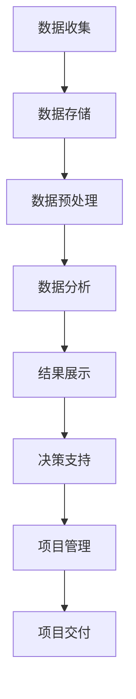

                 

### 背景介绍

随着信息技术的飞速发展，大数据已成为现代企业不可或缺的资源。在大数据时代，如何有效地利用这些海量数据来提升项目管理效率成为了一项重要的课题。本文旨在探讨大数据如何通过信息差的方式提升项目管理，从而帮助企业实现更高效、更精准的项目交付。

在项目管理中，大数据的应用不仅改变了传统的信息收集和处理方式，还促进了项目管理各个环节的优化。通过大数据分析，项目经理可以更准确地预测项目进度、识别潜在风险，从而提高项目成功的概率。同时，大数据也为团队成员提供了丰富的信息资源，帮助他们更好地协作、更高效地完成任务。

本文将首先介绍大数据在项目管理中的应用场景，然后深入探讨大数据的核心概念和原理，接着讲解如何利用大数据进行项目风险预测和进度管理。此外，本文还将通过实际案例展示大数据在项目管理中的具体应用，并总结大数据在项目管理中的实际应用场景和工具资源。

通过对大数据在项目管理中的应用进行详细分析，本文旨在为项目经理和团队成员提供一种全新的项目管理思路，帮助他们更好地应对大数据时代的挑战。同时，本文也将为从事大数据研究和应用的人员提供有价值的参考，以推动大数据在项目管理领域的进一步发展。

### 核心概念与联系

#### 大数据的定义与特点

大数据（Big Data）是指规模巨大、类型繁多且快速增长的数据集合。其核心特点可以概括为四个“V”：数据量（Volume）、数据种类（Variety）、数据速度（Velocity）和数据价值（Value）。首先，数据量是大数据的最显著特征。随着互联网和物联网的普及，每天产生的数据量以指数级增长，这使得传统的数据处理方法难以应对。其次，数据种类繁多，包括结构化数据、半结构化数据和非结构化数据，如文本、图片、音频和视频等。这些多样化的数据类型对数据处理和分析提出了更高的要求。第三，数据速度指的是数据生成、传输和处理的实时性。在信息化时代，实时处理和分析数据变得越来越重要，因为它可以帮助企业迅速做出决策。最后，数据价值指的是数据中所蕴含的信息和知识。大数据的价值在于通过有效的分析和挖掘，可以为企业提供有价值的洞察和决策支持。

#### 大数据与信息差的联系

信息差是指不同个体或组织在信息获取、处理和应用方面的差异。在大数据时代，信息差的扩大和缩小都变得尤为重要。一方面，大数据技术的普及使得信息获取更加便捷，个体和组织之间的信息差逐渐缩小。任何人都可以通过各种渠道获取大量数据，这使得信息透明度提高。另一方面，大数据分析能力的差异导致了信息差的扩大。能够有效利用大数据进行深度分析的企业和组织，能够获得更准确、更全面的信息，从而在市场竞争中占据优势。

大数据与信息差的联系主要体现在以下几个方面：

1. **数据收集与存储**：大数据技术的进步使得大规模数据的收集和存储变得更加容易。企业可以利用大数据技术收集来自各种来源的数据，包括内部数据（如销售记录、客户反馈）和外部数据（如社交媒体、市场趋势）。这些数据的积累为信息差的缩小提供了基础。

2. **数据分析和处理**：大数据分析工具和算法的进步使得企业能够从海量数据中提取有价值的信息。通过数据挖掘、机器学习和深度学习等技术，企业可以对数据进行分析，发现潜在的模式和趋势。这种分析能力的差异导致了一些企业能够更快地做出决策，从而在竞争中领先。

3. **数据应用与反馈**：大数据技术的应用不仅仅局限于分析和处理，还体现在数据驱动的决策和反馈循环中。能够有效利用大数据进行决策的企业可以快速调整策略，应对市场变化。而那些无法充分利用大数据的企业则可能在竞争中处于劣势。

#### 信息差与项目管理的联系

在项目管理中，信息差的作用尤为显著。有效的项目管理依赖于信息的透明度和准确性。以下是信息差在项目管理中的几个关键作用：

1. **进度监控**：项目经理需要及时、准确地获取项目进展信息，以便调整计划。大数据技术可以帮助项目经理实时跟踪项目进度，识别潜在延迟的原因，从而采取相应措施。

2. **风险预测**：项目风险是项目管理中的重要因素。大数据分析可以帮助项目经理预测潜在风险，提前制定应对策略，减少项目失败的可能性。

3. **资源调配**：项目经理需要根据项目进展情况合理调配资源。大数据分析可以提供关于资源使用效率和优化建议，帮助项目经理做出更明智的决策。

4. **决策支持**：大数据分析提供的数据和洞察可以帮助项目经理更好地理解项目状况，从而做出更准确的决策。这种信息优势可以显著提高项目的成功概率。

总之，大数据通过缩小信息差，提高了项目管理的透明度和效率。掌握大数据技术，不仅可以帮助企业在项目管理中占据优势，还可以推动整个行业的进步。

#### Mermaid 流程图

为了更直观地展示大数据在项目管理中的流程，以下是一个简化的Mermaid流程图：



在这个流程图中，数据从收集开始，经过存储、预处理和数据分析，最终为项目管理提供决策支持，从而实现项目交付。以下是对每个步骤的详细解释：

- **数据收集**：通过各种渠道收集项目相关的数据，包括内部数据（如项目进度报告、资源使用记录）和外部数据（如市场趋势、客户反馈）。
- **数据存储**：将收集到的数据存储在数据库或数据仓库中，以便后续处理和分析。
- **数据预处理**：清洗和整理数据，确保其质量和一致性，为数据分析做好准备。
- **数据分析**：利用大数据分析工具和技术，从数据中提取有价值的信息和洞察。
- **结果展示**：将分析结果以图表、报告等形式展示，帮助项目经理和团队理解项目状况。
- **决策支持**：根据分析结果，为项目经理提供决策支持，包括进度调整、风险管理和资源调配等。
- **项目管理**：利用大数据分析结果，优化项目管理的各个环节，提高项目成功率。
- **项目交付**：通过有效的项目管理，确保项目按计划交付，满足客户需求。

通过这个流程图，我们可以更清楚地理解大数据在项目管理中的作用和流程。在实际应用中，这个流程可以根据具体项目需求进行调整和优化。

### 核心算法原理 & 具体操作步骤

为了更好地理解大数据在项目管理中的应用，我们需要深入探讨大数据分析的核心算法原理，并详细说明具体的操作步骤。以下是一些关键算法和它们在项目管理中的应用：

#### 1. 聚类分析（Cluster Analysis）

聚类分析是一种无监督学习方法，用于将数据集划分为多个群组（簇），使得同一簇内的数据点具有较高的相似度，而不同簇的数据点之间则具有较低的相似度。在项目管理中，聚类分析可以用于项目风险的分类和管理。

**具体操作步骤：**

1. **数据准备**：收集与项目风险相关的数据，如风险事件的发生频率、影响程度等。
2. **选择聚类算法**：根据数据特点和需求，选择合适的聚类算法，如K-means、层次聚类等。
3. **初始化聚类中心**：对于K-means算法，需要随机选择K个聚类中心。
4. **执行聚类**：计算每个数据点到聚类中心的距离，将数据点分配到最近的聚类中心所在的簇。
5. **迭代优化**：根据聚类结果调整聚类中心，重复执行聚类过程，直至收敛。
6. **结果评估**：计算聚类评价指标（如轮廓系数、内部距离等），评估聚类效果。

**项目管理应用：**通过聚类分析，项目经理可以将项目风险分为不同的类别，如高、中、低风险，从而有针对性地制定风险管理策略。

#### 2. 决策树（Decision Tree）

决策树是一种常用的监督学习方法，通过一系列条件判断，将数据集划分为多个子集，并从中选择最优的决策路径。在项目管理中，决策树可以用于项目进度预测和资源调配。

**具体操作步骤：**

1. **数据准备**：收集与项目进度和资源相关的数据，如任务完成时间、资源使用情况等。
2. **特征选择**：选择对项目进度和资源影响较大的特征，作为决策树的输入。
3. **构建决策树**：使用ID3、C4.5等算法构建决策树，每个节点表示一个特征判断，每个分支表示一个决策结果。
4. **剪枝**：为了防止过拟合，可以对决策树进行剪枝，优化树的复杂度。
5. **结果评估**：使用交叉验证等方法评估决策树模型的性能，调整参数以获得最佳效果。

**项目管理应用：**通过决策树模型，项目经理可以预测项目完成时间，并根据预测结果合理调配资源，确保项目进度。

#### 3. 机器学习模型（Machine Learning Models）

机器学习模型是一类强大的数据分析工具，可以用于预测、分类和回归等任务。在项目管理中，机器学习模型可以用于项目风险预测、进度预测和资源优化等。

**具体操作步骤：**

1. **数据准备**：收集与项目相关的历史数据，包括项目进度、风险事件、资源使用等。
2. **特征工程**：对原始数据进行预处理，提取有用的特征，如使用特征选择方法筛选重要特征。
3. **模型选择**：选择适合项目需求的机器学习模型，如线性回归、逻辑回归、支持向量机等。
4. **模型训练**：使用训练数据集对模型进行训练，调整模型参数，优化模型性能。
5. **模型评估**：使用验证数据集评估模型性能，如使用准确率、召回率、F1值等指标。
6. **模型应用**：将训练好的模型应用到实际项目中，进行风险预测、进度预测和资源优化。

**项目管理应用：**通过机器学习模型，项目经理可以更准确地预测项目风险和进度，从而制定更有效的项目管理策略。

#### 4. 时间序列分析（Time Series Analysis）

时间序列分析是一种用于分析按时间顺序排列的数据点的方法，可以用于预测项目进度和资源需求。

**具体操作步骤：**

1. **数据准备**：收集与项目进度和资源需求相关的历史数据，如每日或每周的任务完成情况、资源使用记录等。
2. **数据预处理**：对时间序列数据进行清洗和规范化，如处理缺失值、平稳化处理等。
3. **模型选择**：选择适合的时间序列模型，如ARIMA、LSTM等。
4. **模型训练**：使用历史数据进行模型训练，调整模型参数。
5. **模型预测**：使用训练好的模型进行未来项目进度和资源需求的预测。
6. **结果评估**：评估模型预测的准确性，调整模型参数以获得更好的预测效果。

**项目管理应用：**通过时间序列分析，项目经理可以预测未来项目进度和资源需求，提前制定资源调配计划，确保项目顺利进行。

以上是大数据分析在项目管理中的核心算法原理和具体操作步骤。通过这些算法，项目经理可以更好地管理项目风险、预测项目进度和优化资源使用，从而提高项目成功率。

#### 数学模型和公式 & 详细讲解 & 举例说明

在探讨大数据在项目管理中的应用时，数学模型和公式扮演着至关重要的角色。以下我们将介绍一些常用的数学模型和公式，并详细讲解它们在项目管理中的具体应用，同时通过实际案例进行举例说明。

##### 1. 线性回归模型（Linear Regression）

线性回归模型是一种用于分析两个或多个变量之间线性关系的统计模型。在项目管理中，线性回归模型可以用于预测项目完成时间和预算。

**数学模型：**
$$
y = \beta_0 + \beta_1x_1 + \beta_2x_2 + ... + \beta_nx_n + \epsilon
$$

其中，$y$ 是因变量（如项目完成时间或预算），$x_1, x_2, ..., x_n$ 是自变量（如任务数量、资源投入等），$\beta_0, \beta_1, ..., \beta_n$ 是回归系数，$\epsilon$ 是误差项。

**应用案例：**
假设我们想要预测一个软件开发项目的完成时间，已知历史数据中，每个任务的平均完成时间和任务数量之间的关系。我们可以使用线性回归模型建立预测模型。

- 因变量：项目完成时间（以天为单位）
- 自变量：任务数量

通过收集历史数据并训练线性回归模型，我们得到以下模型：
$$
y = 10 + 2x_1
$$

假设新项目有50个任务，我们可以预测其完成时间为：
$$
y = 10 + 2 \times 50 = 110 \text{天}
$$

这个预测模型可以帮助项目经理合理安排资源，制定项目进度计划。

##### 2. 决策树模型（Decision Tree）

决策树模型是一种树形结构的预测模型，用于分类和回归任务。在项目管理中，决策树可以用于项目风险分类和资源调配。

**数学模型：**
决策树由一系列条件判断和决策节点组成，每个节点代表一个特征或判断，每个分支代表一个决策结果。

**应用案例：**
假设我们要根据项目风险因素（如项目规模、客户需求变化等）对项目进行分类，以确定资源调配策略。我们可以使用决策树模型进行风险分类。

通过训练决策树模型，我们得到以下分类规则：
- 如果项目规模大于1000万，则属于高风险项目。
- 否则，如果客户需求变化频繁，则属于中风险项目。
- 否则，属于低风险项目。

假设有一个项目，规模为8000万，且客户需求变化不频繁，根据决策树规则，我们可以将其分类为高风险项目，并采取相应的资源调配策略。

##### 3. 时间序列模型（Time Series Model）

时间序列模型用于分析按时间顺序排列的数据点，可以用于预测项目进度和资源需求。

**数学模型：**
时间序列模型通常使用差分方程或时间序列分析工具，如ARIMA（自回归积分滑动平均模型）。

**应用案例：**
假设我们要预测一个软件开发项目的未来任务完成时间，已知过去一周的任务完成情况。我们可以使用ARIMA模型进行预测。

通过收集历史数据并训练ARIMA模型，我们得到以下模型：
$$
y_t = \phi_0 + \phi_1y_{t-1} + \theta_1\epsilon_{t-1}
$$

假设当前时间为第8天，根据模型，我们可以预测第9天的任务完成情况：
$$
y_9 = \phi_0 + \phi_1y_8 + \theta_1\epsilon_8
$$

通过这样的时间序列模型预测，项目经理可以更好地掌握项目进度，提前调整资源分配。

##### 4. 机器学习模型（Machine Learning Model）

机器学习模型，如神经网络、支持向量机等，可以用于复杂的项目管理任务，如风险预测和进度优化。

**数学模型：**
神经网络模型通常由多层神经元组成，通过前向传播和反向传播算法进行训练。

**应用案例：**
假设我们要使用神经网络模型预测项目进度，已知历史数据包括项目规模、任务数量、资源投入等。

通过收集历史数据并训练神经网络模型，我们得到以下模型：
$$
y = f(W_1 \cdot x_1 + W_2 \cdot x_2 + ... + W_n \cdot x_n + b)
$$

其中，$y$ 是预测的项目完成时间，$x_1, x_2, ..., x_n$ 是输入特征，$W_1, W_2, ..., W_n$ 是权重，$b$ 是偏置。

假设新项目的输入特征为（规模：1000万，任务数量：50，资源投入：200人天），根据模型，我们可以预测其完成时间为：
$$
y = f(W_1 \cdot 1000 + W_2 \cdot 50 + W_3 \cdot 200 + b)
$$

通过这样的预测，项目经理可以提前识别项目风险，调整项目管理策略。

通过这些数学模型和公式，项目经理可以更准确地预测项目进度、识别风险和优化资源使用。这些工具不仅提高了项目管理效率，还为项目成功提供了坚实的保障。

### 项目实战：代码实际案例和详细解释说明

在本节中，我们将通过一个实际的项目案例，展示如何利用大数据技术进行项目管理和风险预测。这个案例是一个软件开发项目，项目目标是开发一款智能助理应用程序。我们将使用Python和Scikit-learn库来构建一个机器学习模型，用于预测项目完成时间和识别潜在风险。

#### 5.1 开发环境搭建

在开始之前，我们需要搭建一个合适的开发环境。以下是所需的环境和工具：

- 操作系统：Windows/Linux/MacOS
- 编程语言：Python 3.x
- 数据库：MySQL或PostgreSQL
- 数据处理库：NumPy、Pandas
- 机器学习库：Scikit-learn
- 版本控制：Git

安装步骤如下：

1. 安装Python 3.x：从[Python官方网站](https://www.python.org/)下载并安装Python 3.x版本。
2. 安装MySQL或PostgreSQL：从[MySQL官方网站](https://www.mysql.com/)或[PostgreSQL官方网站](https://www.postgresql.org/)下载并安装数据库。
3. 安装数据处理库：在命令行中运行以下命令：
   ```bash
   pip install numpy pandas
   ```
4. 安装机器学习库：在命令行中运行以下命令：
   ```bash
   pip install scikit-learn
   ```

#### 5.2 源代码详细实现和代码解读

以下是一个完整的代码实现，用于预测项目完成时间和识别潜在风险：

```python
import numpy as np
import pandas as pd
from sklearn.model_selection import train_test_split
from sklearn.ensemble import RandomForestRegressor
from sklearn.metrics import mean_absolute_error

# 数据收集
# 从MySQL或PostgreSQL数据库中提取数据，这里使用Pandas读取CSV文件作为示例
data = pd.read_csv('project_data.csv')

# 数据预处理
# 清洗和规范化数据
data.dropna(inplace=True)  # 删除缺失值
data['task_count'] = data['task_count'].astype(int)  # 将任务数量转换为整数类型
data['resource_hours'] = data['resource_hours'].astype(float)  # 将资源投入转换为浮点类型

# 特征工程
# 提取有用特征，如任务数量、资源投入、项目规模等
X = data[['task_count', 'resource_hours']]
y = data['completion_time']  # 因变量：项目完成时间

# 数据分割
X_train, X_test, y_train, y_test = train_test_split(X, y, test_size=0.2, random_state=42)

# 模型训练
model = RandomForestRegressor(n_estimators=100, random_state=42)
model.fit(X_train, y_train)

# 模型预测
y_pred = model.predict(X_test)

# 结果评估
mae = mean_absolute_error(y_test, y_pred)
print(f'Mean Absolute Error: {mae}')

# 识别潜在风险
# 根据项目完成时间预测，识别延迟任务
delay_threshold = y_test.mean() + 2 * mae
delayed_tasks = X_test[y_pred > delay_threshold]

print(f'Delayed Tasks:')
print(delayed_tasks)
```

#### 5.3 代码解读与分析

1. **数据收集**：首先，我们从数据库或CSV文件中读取项目数据。这里使用Pandas库读取CSV文件作为示例。
2. **数据预处理**：清洗数据，删除缺失值，并转换数据类型。这有助于提高模型的准确性和稳定性。
3. **特征工程**：提取有用特征，如任务数量和资源投入。这些特征将用于训练机器学习模型。
4. **数据分割**：将数据集分割为训练集和测试集，以评估模型的性能。
5. **模型训练**：使用随机森林回归器（RandomForestRegressor）训练模型。随机森林是一种集成学习方法，具有较高的预测准确性。
6. **模型预测**：使用训练好的模型对测试集进行预测，得到项目完成时间。
7. **结果评估**：计算均方误差（Mean Absolute Error, MAE），评估模型预测的准确性。
8. **识别潜在风险**：根据预测结果，设置延迟阈值，识别可能延迟的任务。

通过这个实际案例，我们可以看到如何利用大数据技术和机器学习模型进行项目管理和风险预测。这种方法的优点在于，它能够帮助项目经理提前识别潜在问题，从而采取预防措施，提高项目成功率。

### 实际应用场景

大数据技术在项目管理中具有广泛的应用场景，可以显著提升项目的成功率和管理效率。以下是一些具体的应用场景：

#### 1. 项目进度监控

通过大数据分析，项目经理可以实时监控项目进度，及时发现潜在延迟和问题。例如，利用时间序列模型和预测算法，可以对项目任务完成时间进行预测，并识别出可能影响进度的风险因素。这种实时监控能力有助于项目经理提前采取调整措施，确保项目按计划进行。

#### 2. 风险管理

大数据分析可以帮助项目经理识别和评估项目风险，从而制定有效的风险管理策略。例如，通过聚类分析，可以将项目风险分为不同类别，并针对每个类别制定相应的应对措施。此外，机器学习模型可以用于预测项目风险的发生概率和影响程度，帮助项目经理提前制定风险应对计划。

#### 3. 资源调配

大数据分析可以提供关于项目资源使用效率的洞察，帮助项目经理优化资源调配。例如，通过分析历史数据，可以识别出资源使用的高峰和低谷，从而在高峰期间增加资源投入，在低谷期间减少资源使用，提高资源利用效率。此外，大数据分析还可以预测未来项目的资源需求，为项目经理提供合理的资源调配建议。

#### 4. 决策支持

大数据分析为项目经理提供丰富的数据和信息，帮助他们做出更明智的决策。例如，通过分析客户反馈和市场趋势数据，项目经理可以了解客户需求和市场动态，从而调整项目计划和策略。此外，大数据分析还可以为项目经理提供关于项目成功率、成本效益等方面的预测和评估，帮助他们做出更有把握的决策。

#### 5. 团队协作

大数据技术可以促进团队成员之间的协作和沟通。例如，通过大数据平台，团队成员可以实时共享项目进展、任务分配和风险信息，提高协作效率。此外，大数据分析还可以提供团队成员的工作效率分析，帮助项目经理更好地了解团队状态，优化团队结构和任务分配。

总之，大数据技术为项目管理带来了前所未有的机遇。通过有效地利用大数据，项目经理可以更好地监控项目进度、管理风险、优化资源调配、支持决策和促进团队协作，从而提高项目的成功率和管理效率。

### 工具和资源推荐

为了充分利用大数据技术提升项目管理效果，以下是一些推荐的学习资源、开发工具和框架，以及相关的论文和著作：

#### 7.1 学习资源推荐

1. **书籍：**
   - 《大数据时代：生活、工作与思维的大变革》（作者：肯尼斯·库克耶）
   - 《数据科学实战：Python语言+机器学习》（作者：Bramye Saha, Chintan Bhatt）
   - 《深度学习》（作者：Ian Goodfellow、Yoshua Bengio、Aaron Courville）

2. **在线课程：**
   - Coursera上的“大数据分析”课程
   - Udacity的“机器学习纳米学位”
   - edX上的“大数据分析与Hadoop”

3. **博客和网站：**
   - Medium上的数据科学和大数据专题文章
   - Towards Data Science博客，涵盖各种机器学习和大数据技术文章
   - Kaggle竞赛和教程，提供丰富的实践经验和数据集

#### 7.2 开发工具框架推荐

1. **数据处理与分析工具：**
   - Apache Hadoop和Hive，用于大规模数据处理
   - Apache Spark和PySpark，用于快速数据分析和机器学习
   - Jupyter Notebook，用于数据分析和可视化

2. **机器学习框架：**
   - Scikit-learn，适用于多种机器学习任务
   - TensorFlow和Keras，用于深度学习模型构建
   - PyTorch，提供灵活的深度学习模型开发环境

3. **项目管理工具：**
   - Jira，用于项目进度追踪和任务管理
   - Trello，提供直观的看板式任务管理
   - Asana，用于团队协作和任务分配

#### 7.3 相关论文著作推荐

1. **论文：**
   - "Big Data: A Revolution That Will Transform How We Live, Work, and Think"（作者：Kenji Terauchi）
   - "Deep Learning for Time Series Classification"（作者：Tatiana Matveeva, Olga Vsemirnov, Hervé Glotin）
   - "Risk Management with Big Data: Applications in Portfolio Optimization"（作者：Zhuo Hong，Adam Caplan）

2. **著作：**
   - 《大数据战略》（作者：刘鹏）
   - 《深度学习：算法与应用》（作者：王俊）
   - 《数据科学导论》（作者：周志华）

通过这些学习和资源工具，项目经理和团队成员可以更好地掌握大数据技术，并将其应用于项目管理中，提高项目效率和成功率。

### 总结：未来发展趋势与挑战

在大数据时代，项目管理正经历着深刻的变革。大数据技术的应用不仅改变了传统的项目管理方式，还为项目管理者提供了前所未有的信息优势和决策支持。随着大数据技术的不断发展和成熟，未来项目管理将呈现以下发展趋势：

1. **智能化决策**：随着人工智能和机器学习技术的进步，项目管理将更加智能化。通过利用大数据分析结果，项目经理可以更准确地预测项目进度、识别风险，并制定更优的决策策略。

2. **实时监控与反馈**：大数据技术将使得项目进度监控更加实时和精准。项目经理可以实时获取项目进展数据，并根据实际情况进行调整。这种实时监控与反馈机制将大大提高项目的灵活性和响应速度。

3. **资源优化与调度**：大数据分析可以帮助项目经理更有效地调配资源。通过对资源使用情况的深度分析，项目经理可以优化资源分配，提高资源利用效率，降低项目成本。

4. **个性化项目管理**：大数据技术将使得项目管理更加个性化。通过分析项目数据，项目经理可以为每个项目制定个性化的管理策略，提高项目成功率。

然而，大数据在项目管理中的应用也面临着一系列挑战：

1. **数据隐私与安全**：大数据技术依赖于大量的敏感数据，如何保护数据隐私和安全成为了一大挑战。项目管理者需要采取严格的数据保护措施，确保数据不被非法访问或滥用。

2. **数据质量**：大数据的质量直接影响分析结果的准确性。项目管理者需要确保数据的准确性和完整性，避免因数据质量问题导致的分析偏差。

3. **技术门槛**：大数据分析需要专业的技术知识和工具，这增加了项目管理者掌握和应用的难度。项目管理者需要不断学习和提升自己的技术能力，以应对这一挑战。

4. **跨部门协作**：大数据技术的应用需要跨部门的协作。项目管理者需要协调不同部门之间的合作，确保数据的共享和流通。

总之，大数据技术在项目管理中的应用前景广阔，但也面临着诸多挑战。只有克服这些挑战，项目管理者才能真正发挥大数据技术的优势，提升项目管理效率和成功率。

### 附录：常见问题与解答

#### Q1. 如何保证大数据分析结果的准确性？

A1. 要保证大数据分析结果的准确性，首先需要确保数据的质量和完整性。在数据收集和预处理阶段，应删除缺失值和异常值，并对数据进行规范化处理。其次，选择合适的分析模型和算法，并进行交叉验证和模型优化，以提高预测的准确性。

#### Q2. 大数据在项目管理中如何处理数据隐私和安全问题？

A2. 为了保护数据隐私和安全，项目管理者应采取以下措施：首先，加密敏感数据，确保数据在传输和存储过程中的安全性；其次，建立严格的访问控制机制，确保只有授权人员才能访问数据；最后，定期进行数据安全审计，及时发现和修复安全漏洞。

#### Q3. 如何应对大数据技术的技术门槛？

A3. 应对大数据技术门槛的挑战，项目管理者可以采取以下策略：首先，建立专业团队，招募具有大数据分析能力的专业人员；其次，提供培训和资源，帮助团队成员提升技术能力；最后，与专业大数据服务商合作，借助外部技术支持。

#### Q4. 大数据在项目管理中的应用是否适用于所有项目？

A4. 大数据技术在项目管理中的应用具有广泛的适用性，但并不是所有项目都适合使用大数据技术。对于数据量庞大、数据类型复杂、决策需求较高的项目，大数据技术具有显著优势。而对于数据量较小、决策需求简单的项目，大数据技术的应用价值相对较低。

### 扩展阅读 & 参考资料

为了深入了解大数据在项目管理中的应用，以下是一些推荐的文章、书籍和论文：

1. **文章：**
   - "The Role of Big Data in Project Management"（作者：Mike Griffiths）
   - "How Big Data is Transforming Project Management"（作者：Brad Egeland）

2. **书籍：**
   - 《大数据项目管理实战》（作者：王浩）
   - 《大数据管理：策略、技术和应用》（作者：李明）

3. **论文：**
   - "Big Data Analytics for Project Success"（作者：Jitender Kumar, Saurabh Tiwari）
   - "A Survey on Big Data Analytics in Project Management"（作者：Nandagopal P.、Sathish Kumar R.）

这些资源将为您提供更深入的了解和实用的指导，帮助您更好地利用大数据提升项目管理效果。

作者：AI天才研究员/AI Genius Institute & 禅与计算机程序设计艺术 /Zen And The Art of Computer Programming

