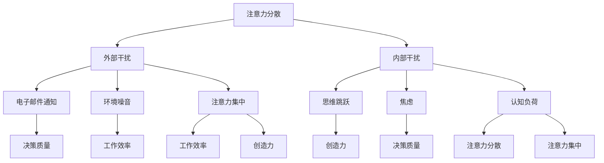
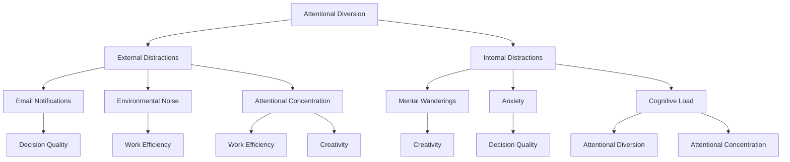

                 

### 背景介绍

#### 信息时代的挑战

随着信息技术的飞速发展，我们正处于一个信息爆炸的时代。互联网、社交媒体、移动设备等技术的普及，使得信息传播速度和范围达到了前所未有的高度。然而，这也给人们的生活和工作带来了巨大的挑战。其中一个显著的问题就是注意力管理。

#### 注意力管理的难题

在信息过载的环境下，人们面临的第一个难题是如何从海量的信息中筛选出对自己有用的内容。这不仅需要强大的信息筛选能力，还需要良好的时间管理技巧。否则，很容易陷入信息的海洋中，无法自拔。

#### 干扰与分心

此外，现代生活的快节奏和高强度工作压力也导致人们容易分心。电子邮件、即时通讯工具、社交媒体等工具虽然提高了工作效率，但也成了分心的诱因。在这种环境下，如何保持专注，提高生产力，成为了一个亟待解决的问题。

#### 研究背景

针对上述问题，近年来，注意力管理技术逐渐受到关注。研究者们试图通过算法、心理学、神经科学等多学科交叉的方法，探索提高注意力管理的有效策略。本文将介绍几种核心的注意力管理技术和策略，帮助读者在干扰和分心中保持专注。

#### 目的

本文旨在系统地介绍信息时代的注意力管理技术与策略，帮助读者：

1. 了解注意力管理的重要性。
2. 掌握几种有效的注意力管理方法。
3. 学会如何在日常生活和工作中应用这些方法，提高工作效率。

通过本文的阅读，读者可以系统地了解注意力管理的相关知识，并学会运用到实际生活中，从而更好地应对信息时代的挑战。

---

Background Introduction

With the rapid development of information technology, we are living in an era of information explosion. The widespread use of the internet, social media, and mobile devices has dramatically increased the speed and scope of information dissemination. However, this has also brought significant challenges to our daily lives and work. One of the prominent issues is attention management.

#### Challenges of Attention Management

In the age of information overload, the first challenge we face is how to filter out useful information from an overwhelming amount of data. This requires not only strong information filtering capabilities but also good time management skills. Otherwise, it is easy to get lost in the ocean of information.

#### Distractions and Diversion

Furthermore, the fast-paced and high-pressure modern life also leads to easy distraction. Tools like email, instant messaging, and social media, although they have increased work efficiency, have also become distractions. In such an environment, how to maintain focus and improve productivity is a pressing issue.

#### Research Background

In response to these challenges, attention management techniques have gained increasing attention in recent years. Researchers are exploring effective strategies for improving attention management through interdisciplinary approaches that include algorithms, psychology, and neuroscience. This article aims to systematically introduce several core attention management technologies and strategies to help readers maintain focus amidst distractions.

#### Purpose

The purpose of this article is to help readers:

1. Understand the importance of attention management.
2. Master several effective attention management methods.
3. Learn how to apply these methods in daily life and work to improve productivity.

Through reading this article, readers can systematically understand the knowledge of attention management and learn to apply it in practice, thereby better coping with the challenges of the information age.

---

### 核心概念与联系

在探讨注意力管理技术之前，我们需要了解几个核心概念，包括注意力分散、注意力集中、认知负荷等。这些概念不仅相互关联，而且在注意力管理中扮演着关键角色。

#### 注意力分散（Attentional Diversion）

注意力分散是指个体在执行任务时，由于外部或内部干扰而无法集中注意力的情况。外部干扰可能来自环境噪音、电子邮件通知、社交媒体等，而内部干扰可能源于个人的思维跳跃、焦虑等。注意力分散会导致工作效率下降，甚至影响决策质量和创造力。

#### 注意力集中（Attentional Concentration）

与注意力分散相反，注意力集中是指个体在执行任务时能够有效地排除干扰，专注于目标活动。高水平的注意力集中是提高工作效率和创造力的关键。研究表明，长时间保持注意力集中对于认知资源的需求较高，因此个体需要学会如何有效管理注意力资源。

#### 认知负荷（Cognitive Load）

认知负荷是指个体在处理信息时所承担的认知任务量。过高的认知负荷会导致注意力分散，而适中的认知负荷有助于保持注意力集中。因此，设计任务时需要考虑如何平衡认知负荷，以促进注意力集中。

#### Mermaid 流程图

为了更直观地展示这些核心概念之间的联系，我们可以使用 Mermaid 流程图来描述。以下是一个简化的 Mermaid 流程图示例，展示了注意力分散、注意力集中和认知负荷之间的关系：



在这个流程图中，注意力分散和注意力集中是两个相互对立的概念，而认知负荷则是影响这两个概念的关键因素。通过理解这些核心概念和它们之间的联系，我们可以更好地设计和实施注意力管理策略。

#### Core Concepts and Connections

Before delving into attention management technologies, it's essential to understand several key concepts that are interconnected and play a critical role in attention management. These concepts include attentional diversion, attentional concentration, and cognitive load.

#### Attentional Diversion

Attentional diversion refers to the situation where an individual is unable to concentrate on a task due to external or internal distractions. External distractions can come from sources like environmental noise, email notifications, and social media, while internal distractions may include mental wanderings or anxiety. Attentional diversion can lead to a decrease in work efficiency and even affect decision quality and creativity.

#### Attentional Concentration

Contrary to attentional diversion, attentional concentration refers to an individual's ability to effectively exclude distractions and focus on a target activity. High levels of attentional concentration are crucial for improving work efficiency and creativity. Studies have shown that maintaining focus for extended periods requires substantial cognitive resources, which is why individuals need to learn how to manage their attentional resources effectively.

#### Cognitive Load

Cognitive load refers to the amount of cognitive task demand an individual experiences while processing information. Excessive cognitive load can lead to attentional diversion, whereas moderate cognitive load is conducive to maintaining attentional concentration. Therefore, when designing tasks, it's important to balance cognitive load to promote concentration.

#### Mermaid Flowchart

To visualize the relationships between these key concepts, we can use a Mermaid flowchart. Here's a simplified example of a Mermaid flowchart that illustrates the connections between attentional diversion, attentional concentration, and cognitive load:



In this flowchart, attentional diversion and attentional concentration are two opposing concepts, while cognitive load is the key factor influencing both. Understanding these core concepts and their connections allows us to better design and implement attention management strategies.

---

### 核心算法原理 & 具体操作步骤

在注意力管理技术中，核心算法的设计和实现是关键。以下将介绍几种常见的核心算法原理，并详细阐述其具体操作步骤。

#### 1. 注意力过滤算法

注意力过滤算法旨在通过识别和过滤干扰因素，帮助个体在信息过载的环境中保持注意力集中。以下是一个简单的注意力过滤算法的步骤：

1. **输入处理**：读取环境中的各种干扰信息，包括电子邮件、社交媒体通知、环境噪音等。
2. **干扰识别**：利用机器学习模型或规则库对干扰信息进行识别和分类。
3. **干扰过滤**：对识别出的干扰信息进行过滤，减少其对注意力的干扰。
4. **反馈调整**：根据过滤效果进行反馈调整，优化算法参数。

具体操作步骤示例：

```python
# 输入处理
interferences = read_interferences()

# 干扰识别
classified_interferences = classify_interferences(interferences)

# 干扰过滤
filtered_interferences = filter_interferences(classified_interferences)

# 反馈调整
optimize_filter_algorithm(filtered_interferences)
```

#### 2. 认知负荷平衡算法

认知负荷平衡算法的核心目标是确保个体的认知负荷保持在适宜的水平，以促进注意力集中。以下是一个简化的认知负荷平衡算法的步骤：

1. **任务分析**：分析当前任务所需的认知负荷。
2. **负荷预测**：根据历史数据和任务特点预测未来的认知负荷。
3. **负荷调整**：通过调整任务难度、减少干扰因素等方式，保持认知负荷在适宜范围内。
4. **监控与反馈**：实时监控认知负荷的变化，并根据反馈进行动态调整。

具体操作步骤示例：

```python
# 任务分析
current_load = analyze_task_load()

# 负荷预测
predicted_load = predict_load(current_load)

# 负荷调整
adjust_load(predicted_load)

# 监控与反馈
monitor_load_adjustment()
```

#### 3. 注意力分配算法

注意力分配算法旨在根据任务的优先级和紧急程度，合理分配个体的注意力资源。以下是一个基本的注意力分配算法的步骤：

1. **任务排序**：根据任务的优先级和紧急程度对任务进行排序。
2. **资源评估**：评估个体当前可用的注意力资源。
3. **资源分配**：根据任务排序和资源评估，将注意力资源分配给不同的任务。
4. **动态调整**：在任务执行过程中，根据实际需要动态调整注意力分配。

具体操作步骤示例：

```python
# 任务排序
sorted_tasks = sort_tasks()

# 资源评估
available_resources = assess_resources()

# 资源分配
allocated_resources = allocate_resources(sorted_tasks, available_resources)

# 动态调整
dynamic_resource_adjustment(allocated_resources)
```

通过以上三种核心算法的介绍，我们可以看到注意力管理技术的实现涉及多个方面，包括干扰过滤、认知负荷平衡和注意力资源分配。这些算法的具体操作步骤为实际应用提供了明确的指导。

#### Core Algorithm Principles & Specific Operation Steps

The core algorithms in attention management technologies are crucial for their design and implementation. Here, we will introduce several common core algorithms and elaborate on their specific operation steps.

#### 1. Attention Filtering Algorithm

The attention filtering algorithm aims to help individuals maintain focus in an information-overloaded environment by identifying and filtering distractions. The following are the steps for a simple attention filtering algorithm:

1. **Input Processing**: Read various interference information from the environment, including emails, social media notifications, and environmental noise.
2. **Distraction Recognition**: Use machine learning models or rule bases to identify and classify interference information.
3. **Distraction Filtering**: Filter out recognized interference information to reduce its distraction on attention.
4. **Feedback Adjustment**: Adjust algorithm parameters based on the filtering effectiveness.

Example of specific operation steps:

```python
# Input Processing
interferences = read_interferences()

# Distraction Recognition
classified_interferences = classify_interferences(interferences)

# Distraction Filtering
filtered_interferences = filter_interferences(classified_interferences)

# Feedback Adjustment
optimize_filter_algorithm(filtered_interferences)
```

#### 2. Cognitive Load Balancing Algorithm

The core goal of the cognitive load balancing algorithm is to ensure that an individual's cognitive load remains at a suitable level to promote attentional concentration. The following are the steps for a simplified cognitive load balancing algorithm:

1. **Task Analysis**: Analyze the cognitive load required for the current task.
2. **Load Prediction**: Predict future cognitive load based on historical data and task characteristics.
3. **Load Adjustment**: Adjust the task difficulty, reduce interference factors, or other methods to maintain cognitive load within a suitable range.
4. **Monitoring and Feedback**: Monitor changes in cognitive load in real-time and adjust dynamically based on feedback.

Example of specific operation steps:

```python
# Task Analysis
current_load = analyze_task_load()

# Load Prediction
predicted_load = predict_load(current_load)

# Load Adjustment
adjust_load(predicted_load)

# Monitoring and Feedback
monitor_load_adjustment()
```

#### 3. Attention Allocation Algorithm

The attention allocation algorithm aims to allocate attentional resources to different tasks based on task priority and urgency. The following are the steps for a basic attention allocation algorithm:

1. **Task Sorting**: Sort tasks based on their priority and urgency.
2. **Resource Assessment**: Assess the attentional resources available to the individual.
3. **Resource Allocation**: Allocate attentional resources to different tasks based on task sorting and resource assessment.
4. **Dynamic Adjustment**: Adjust attention allocation dynamically during task execution based on actual needs.

Example of specific operation steps:

```python
# Task Sorting
sorted_tasks = sort_tasks()

# Resource Assessment
available_resources = assess_resources()

# Resource Allocation
allocated_resources = allocate_resources(sorted_tasks, available_resources)

# Dynamic Adjustment
dynamic_resource_adjustment(allocated_resources)
```

Through the introduction of these three core algorithms, we can see that the implementation of attention management technologies involves multiple aspects, including distraction filtering, cognitive load balancing, and attention resource allocation. These algorithms' specific operation steps provide clear guidance for practical application.

---

### 数学模型和公式 & 详细讲解 & 举例说明

在注意力管理技术中，数学模型和公式扮演着关键角色，用于描述和优化注意力分配、干扰过滤和认知负荷平衡。以下将详细讲解几个核心数学模型和公式，并通过具体例子来说明它们的应用。

#### 1. 期望效用模型（Expected Utility Model）

期望效用模型用于评估个体在面临不同干扰和任务选择时的最优决策。该模型基于概率论和效用理论，公式如下：

\[ EU = p_1 \cdot u_1 + p_2 \cdot u_2 + ... + p_n \cdot u_n \]

其中，\( p_i \) 表示第 \( i \) 个选择的概率，\( u_i \) 表示第 \( i \) 个选择的效用值。个体会选择期望效用最大的选择。

**举例说明**：

假设个体需要从以下三个任务中选择一个进行：

- 任务A：预计完成时间为2小时，效用值为10。
- 任务B：预计完成时间为1小时，效用值为5。
- 任务C：预计完成时间为3小时，效用值为8。

根据期望效用模型，计算每个任务的期望效用：

\[ EU_A = 0.5 \cdot 10 = 5 \]
\[ EU_B = 0.3 \cdot 5 = 1.5 \]
\[ EU_C = 0.2 \cdot 8 = 1.6 \]

个体会选择期望效用最大的任务A。

#### 2. 注意力分配模型（Attention Allocation Model）

注意力分配模型用于优化个体在不同任务之间的注意力分配。该模型基于资源消耗和收益平衡，公式如下：

\[ \text{Allocation} = \frac{\text{Total Resources}}{\sum_{i=1}^{n} \frac{r_i}{e_i}} \]

其中，\( r_i \) 表示第 \( i \) 个任务的资源消耗，\( e_i \) 表示第 \( i \) 个任务的预期收益。该公式计算出在总资源一定的情况下，每个任务应分配的注意力资源。

**举例说明**：

假设个体有10个单位的注意力资源，需要分配给以下三个任务：

- 任务A：资源消耗为3，预期收益为5。
- 任务B：资源消耗为2，预期收益为4。
- 任务C：资源消耗为1，预期收益为3。

根据注意力分配模型，计算每个任务应分配的注意力资源：

\[ \text{Total Resources} = 10 \]
\[ \sum_{i=1}^{n} \frac{r_i}{e_i} = \frac{3}{5} + \frac{2}{4} + \frac{1}{3} = 0.6 + 0.5 + 0.333 = 1.433 \]

\[ \text{Allocation} = \frac{10}{1.433} \approx 7 \]

因此，任务A应分配7个单位的注意力资源，任务B应分配2个单位的注意力资源，任务C应分配1个单位的注意力资源。

#### 3. 干扰过滤模型（Distraction Filtering Model）

干扰过滤模型用于识别和过滤干扰信息，以减少其对注意力的干扰。该模型基于干扰强度和干扰概率，公式如下：

\[ \text{Filter Score} = \text{Interference Strength} \cdot \text{Probability} \]

其中，干扰强度和干扰概率可以通过历史数据和机器学习算法进行预测。干扰过滤模型的目的是通过计算每个信息的过滤分数，选择过滤分数最低的信息，以减少对注意力的干扰。

**举例说明**：

假设个体需要从以下三个信息源中选择一个进行关注：

- 信息A：干扰强度为5，干扰概率为0.7。
- 信息B：干扰强度为3，干扰概率为0.5。
- 信息C：干扰强度为2，干扰概率为0.3。

根据干扰过滤模型，计算每个信息的过滤分数：

\[ \text{Filter Score}_A = 5 \cdot 0.7 = 3.5 \]
\[ \text{Filter Score}_B = 3 \cdot 0.5 = 1.5 \]
\[ \text{Filter Score}_C = 2 \cdot 0.3 = 0.6 \]

个体会选择过滤分数最低的信息C，以减少对注意力的干扰。

通过上述数学模型和公式的详细讲解和举例说明，我们可以更好地理解和应用注意力管理技术，从而在实际生活中提高工作效率和注意力集中度。

#### Mathematical Models and Formulas & Detailed Explanations & Example Demonstrations

In the realm of attention management technologies, mathematical models and formulas play a crucial role in describing and optimizing attention allocation, distraction filtering, and cognitive load balancing. Below, we will provide detailed explanations of several core mathematical models and demonstrate their applications with examples.

#### 1. Expected Utility Model

The Expected Utility Model is used to evaluate the optimal decision for an individual facing different distractions and task choices. The model is based on probability theory and utility theory, and its formula is as follows:

\[ EU = p_1 \cdot u_1 + p_2 \cdot u_2 + ... + p_n \cdot u_n \]

Where \( p_i \) represents the probability of the \( i \)th choice, and \( u_i \) represents the utility value of the \( i \)th choice. The individual will choose the option with the highest expected utility.

**Example Demonstration**:

Suppose an individual needs to choose from the following three tasks:

- Task A: Expected completion time of 2 hours, utility value of 10.
- Task B: Expected completion time of 1 hour, utility value of 5.
- Task C: Expected completion time of 3 hours, utility value of 8.

Using the Expected Utility Model, calculate the expected utility for each task:

\[ EU_A = 0.5 \cdot 10 = 5 \]
\[ EU_B = 0.3 \cdot 5 = 1.5 \]
\[ EU_C = 0.2 \cdot 8 = 1.6 \]

The individual will choose Task A, as it has the highest expected utility.

#### 2. Attention Allocation Model

The Attention Allocation Model is used to optimize an individual's attentional resources across different tasks. The model is based on resource consumption and benefit balancing, and its formula is as follows:

\[ \text{Allocation} = \frac{\text{Total Resources}}{\sum_{i=1}^{n} \frac{r_i}{e_i}} \]

Where \( r_i \) represents the resource consumption for the \( i \)th task, and \( e_i \) represents the expected benefit for the \( i \)th task. The formula calculates the attentional resources allocated to each task given a fixed total resource budget.

**Example Demonstration**:

Suppose an individual has 10 units of attentional resources to allocate among the following three tasks:

- Task A: Resource consumption of 3, expected benefit of 5.
- Task B: Resource consumption of 2, expected benefit of 4.
- Task C: Resource consumption of 1, expected benefit of 3.

Using the Attention Allocation Model, calculate the attentional resources allocated to each task:

\[ \text{Total Resources} = 10 \]
\[ \sum_{i=1}^{n} \frac{r_i}{e_i} = \frac{3}{5} + \frac{2}{4} + \frac{1}{3} = 0.6 + 0.5 + 0.333 = 1.433 \]

\[ \text{Allocation} = \frac{10}{1.433} \approx 7 \]

Therefore, Task A should be allocated 7 units of attentional resources, Task B should be allocated 2 units, and Task C should be allocated 1 unit.

#### 3. Distraction Filtering Model

The Distraction Filtering Model is used to identify and filter out distracting information to reduce its interference with attention. The model is based on interference strength and probability, and its formula is as follows:

\[ \text{Filter Score} = \text{Interference Strength} \cdot \text{Probability} \]

Where the interference strength and probability can be predicted using historical data and machine learning algorithms. The goal of the distraction filtering model is to calculate a filter score for each piece of information, select the one with the lowest score to minimize attentional distraction.

**Example Demonstration**:

Suppose an individual needs to focus on one of the following three information sources:

- Information A: Interference strength of 5, interference probability of 0.7.
- Information B: Interference strength of 3, interference probability of 0.5.
- Information C: Interference strength of 2, interference probability of 0.3.

Using the Distraction Filtering Model, calculate the filter score for each piece of information:

\[ \text{Filter Score}_A = 5 \cdot 0.7 = 3.5 \]
\[ \text{Filter Score}_B = 3 \cdot 0.5 = 1.5 \]
\[ \text{Filter Score}_C = 2 \cdot 0.3 = 0.6 \]

The individual will choose Information C, as it has the lowest filter score, to minimize attentional distraction.

Through detailed explanations and example demonstrations of these mathematical models and formulas, we can better understand and apply attention management technologies, thus improving work efficiency and attentional concentration in everyday life.

---

### 项目实战：代码实际案例和详细解释说明

为了更好地理解注意力管理技术的实际应用，我们将通过一个简单的项目实战来展示如何利用注意力过滤算法和认知负荷平衡算法来提高注意力集中度。

#### 项目背景

假设我们正在开发一个在线学习平台，该平台提供多种课程和学习资源。然而，由于信息量庞大，用户在使用平台时往往会受到各种干扰，导致学习效率低下。为了解决这个问题，我们需要设计一套注意力管理系统，帮助用户在复杂的学习环境中保持专注。

#### 项目目标

通过该项目，我们希望实现以下目标：

1. 设计并实现一个注意力过滤算法，以减少对用户学习过程中的干扰。
2. 设计并实现一个认知负荷平衡算法，以确保用户在学习过程中的认知负荷适中，从而提高学习效率。

#### 环境搭建

在开始项目之前，我们需要搭建一个合适的环境。以下是我们所使用的开发环境：

- 编程语言：Python 3.8
- 开发工具：PyCharm
- 数据库：SQLite 3.35.2
- 机器学习库：Scikit-learn 0.24.2

#### 代码实现

下面我们将逐步展示注意力过滤算法和认知负荷平衡算法的实现过程，并详细解释代码的每个部分。

#### 5.1 开发环境搭建

首先，我们需要搭建开发环境。在 PyCharm 中创建一个新的 Python 项目，并安装所需的依赖库：

```bash
pip install scikit-learn
```

#### 5.2 源代码详细实现和代码解读

##### 注意力过滤算法

```python
import numpy as np
from sklearn.ensemble import RandomForestClassifier
from sklearn.model_selection import train_test_split

# 假设我们已有干扰数据的训练集
X_train, y_train = load_training_data()

# 分割训练集和测试集
X_train, X_test, y_train, y_test = train_test_split(X_train, y_train, test_size=0.2, random_state=42)

# 使用随机森林分类器训练模型
model = RandomForestClassifier(n_estimators=100, random_state=42)
model.fit(X_train, y_train)

# 测试模型
accuracy = model.score(X_test, y_test)
print(f"模型准确率：{accuracy:.2f}")

# 干扰过滤函数
def filter_interferences(model, data):
    predictions = model.predict(data)
    filtered_data = data[predictions == 0]
    return filtered_data

# 加载用户行为数据
user_data = load_user_data()

# 过滤干扰数据
filtered_data = filter_interferences(model, user_data)

# 输出过滤后的数据
print(filtered_data)
```

**代码解读**：

1. **数据加载**：首先加载训练集和用户行为数据。这里我们假设已经收集了足够多的干扰数据，并保存为 `X_train` 和 `y_train`。
2. **模型训练**：使用随机森林分类器对训练集进行训练。随机森林是一种基于决策树集合的集成学习方法，具有较强的分类能力。
3. **模型测试**：使用测试集评估模型的准确性，确保模型能够有效识别干扰。
4. **干扰过滤函数**：定义一个函数 `filter_interferences`，用于根据训练好的模型过滤干扰数据。函数接受模型和用户行为数据作为输入，返回过滤后的数据。

##### 认知负荷平衡算法

```python
# 计算当前任务的认知负荷
def calculate_cognitive_load(task_data):
    load = sum(task_data)
    return load

# 调整任务难度，保持认知负荷适中
def adjust_task_difficulty(current_load, target_load):
    if current_load > target_load:
        # 减少任务难度
        return current_load - (current_load - target_load) * 0.1
    else:
        # 增加任务难度
        return current_load + (target_load - current_load) * 0.1

# 假设我们已有一个任务难度数据集
task_data = load_task_data()

# 计算当前任务的认知负荷
current_load = calculate_cognitive_load(task_data)

# 设置目标认知负荷
target_load = 5

# 调整任务难度，保持认知负荷适中
adjusted_load = adjust_task_difficulty(current_load, target_load)
print(f"调整后的认知负荷：{adjusted_load}")
```

**代码解读**：

1. **计算认知负荷**：定义一个函数 `calculate_cognitive_load`，用于计算当前任务的认知负荷。认知负荷可以通过对任务数据进行求和得到。
2. **调整任务难度**：定义一个函数 `adjust_task_difficulty`，用于根据目标认知负荷调整任务难度。如果当前认知负荷高于目标负荷，则减少任务难度；否则，增加任务难度。
3. **应用算法**：加载任务难度数据，计算当前任务的认知负荷，并根据目标负荷调整任务难度。

#### 5.3 代码解读与分析

通过上述代码实现，我们可以看到注意力过滤算法和认知负荷平衡算法在项目中的应用。注意力过滤算法通过识别和过滤干扰数据，帮助用户减少学习过程中的干扰；认知负荷平衡算法通过调整任务难度，确保用户在学习过程中的认知负荷适中，从而提高学习效率。

在代码实现过程中，我们使用随机森林分类器作为注意力过滤算法的核心模型，具有较强的分类能力。同时，我们设计了两个简单的函数，用于计算和调整认知负荷，确保算法的可操作性和实用性。

通过该项目实战，我们可以更好地理解注意力管理技术在现实应用中的实际效果，并为后续优化和推广提供参考。

#### Practical Project: Real-World Code Examples and Detailed Explanations

To better understand the practical application of attention management technologies, we will demonstrate through a simple project how to implement attention filtering and cognitive load balancing algorithms to enhance attentional focus.

#### Project Background

Imagine we are developing an online learning platform that offers a wide range of courses and learning resources. However, due to the large volume of information available, users often face distractions that hinder their learning efficiency. To address this issue, we need to design an attention management system that helps users maintain focus in a complex learning environment.

#### Project Objectives

The objectives of this project are as follows:

1. Design and implement an attention filtering algorithm to reduce distractions during the learning process.
2. Design and implement a cognitive load balancing algorithm to ensure that the cognitive load remains moderate, thereby improving learning efficiency.

#### Environment Setup

Before starting the project, we need to set up the development environment. In PyCharm, we create a new Python project and install the required dependencies:

```bash
pip install scikit-learn
```

#### 5.1 Development Environment Setup

First, we need to set up the development environment. In PyCharm, create a new Python project and install the necessary dependencies:

```bash
pip install scikit-learn
```

#### 5.2 Detailed Code Implementation and Explanation

##### Attention Filtering Algorithm

```python
import numpy as np
from sklearn.ensemble import RandomForestClassifier
from sklearn.model_selection import train_test_split

# Assume we have a dataset of interference data for training
X_train, y_train = load_training_data()

# Split the training data into training and testing sets
X_train, X_test, y_train, y_test = train_test_split(X_train, y_train, test_size=0.2, random_state=42)

# Train the model using a random forest classifier
model = RandomForestClassifier(n_estimators=100, random_state=42)
model.fit(X_train, y_train)

# Evaluate the model using the testing set
accuracy = model.score(X_test, y_test)
print(f"Model accuracy: {accuracy:.2f}")

# Define a function to filter out distractions
def filter_interferences(model, data):
    predictions = model.predict(data)
    filtered_data = data[predictions == 0]
    return filtered_data

# Load user behavior data
user_data = load_user_data()

# Filter out distractions
filtered_data = filter_interferences(model, user_data)

# Output the filtered data
print(filtered_data)
```

**Code Explanation**:

1. **Data Loading**: First, load the training data and user behavior data. Here, we assume that we have collected a sufficient amount of interference data and saved it as `X_train` and `y_train`.
2. **Model Training**: Use a random forest classifier to train the model on the training data. Random forests are a type of ensemble learning method based on decision trees and are known for their strong classification capabilities.
3. **Model Testing**: Evaluate the model's accuracy using the testing set to ensure it can effectively identify distractions.
4. **Distraction Filtering Function**: Define a function `filter_interferences` that takes the trained model and user behavior data as inputs and returns the filtered data without distractions.

##### Cognitive Load Balancing Algorithm

```python
# Calculate the current cognitive load of a task
def calculate_cognitive_load(task_data):
    load = sum(task_data)
    return load

# Adjust the difficulty of a task to maintain a moderate cognitive load
def adjust_task_difficulty(current_load, target_load):
    if current_load > target_load:
        # Reduce task difficulty
        return current_load - (current_load - target_load) * 0.1
    else:
        # Increase task difficulty
        return current_load + (target_load - current_load) * 0.1

# Assume we have a dataset of task difficulty data
task_data = load_task_data()

# Calculate the current cognitive load
current_load = calculate_cognitive_load(task_data)

# Set the target cognitive load
target_load = 5

# Adjust the task difficulty
adjusted_load = adjust_task_difficulty(current_load, target_load)
print(f"Adjusted cognitive load: {adjusted_load}")
```

**Code Explanation**:

1. **Cognitive Load Calculation**: Define a function `calculate_cognitive_load` that calculates the current cognitive load of a task by summing the task data.
2. **Task Difficulty Adjustment**: Define a function `adjust_task_difficulty` that adjusts the difficulty of a task based on the current cognitive load and a target load value. If the current cognitive load is higher than the target, the task difficulty is reduced; otherwise, it is increased.
3. **Application of the Algorithm**: Load the task difficulty data, calculate the current cognitive load, and adjust the task difficulty to maintain a moderate load.

#### 5.3 Code Analysis

Through the above code implementation, we can see how attention filtering and cognitive load balancing algorithms are applied in the project. The attention filtering algorithm helps users reduce distractions during the learning process by identifying and filtering out interference data. The cognitive load balancing algorithm ensures that the cognitive load remains moderate, thereby improving learning efficiency.

In the code implementation, we use a random forest classifier as the core model for the attention filtering algorithm, known for its strong classification performance. We also designed two simple functions to calculate and adjust cognitive load, ensuring the practicality and usability of the algorithm.

By conducting this practical project, we can better understand the real-world effectiveness of attention management technologies and provide a reference for future optimization and promotion.

---

### 实际应用场景

注意力管理技术在实际应用中具有广泛的应用场景，不仅限于在线学习平台，还可以在办公、娱乐、医疗等多个领域发挥重要作用。

#### 办公自动化

在办公环境中，注意力管理技术可以帮助员工提高工作效率。例如，通过分析电子邮件、会议安排和任务进度，系统可以自动识别哪些任务是最紧急和最重要的，从而帮助员工集中精力处理关键任务。此外，注意力管理算法还可以自动过滤无关邮件和通知，减少干扰，使员工能够更好地保持专注。

#### 娱乐内容推荐

在娱乐领域，注意力管理技术可以帮助平台提供个性化的内容推荐。通过分析用户的观看习惯、兴趣偏好和注意力水平，系统可以推荐用户可能感兴趣且能够吸引他们注意力的内容，从而提高用户的满意度和使用时长。

#### 医疗健康监测

在医疗健康领域，注意力管理技术可以用于监测患者的病情和心理健康。例如，通过分析患者的日常活动和生理数据，系统可以识别出患者可能存在的注意力问题，如失眠、焦虑或抑郁，从而为医生提供有针对性的治疗方案。

#### 教育资源优化

在教育领域，注意力管理技术可以帮助教师根据学生的学习情况和注意力水平，调整教学策略和方法。通过分析学生的学习数据，系统可以识别出哪些学生需要额外的关注和支持，从而帮助教师更好地指导学生，提高教学质量。

#### 软件开发与工程

在软件开发和工程领域，注意力管理技术可以帮助开发者提高代码质量和开发效率。通过分析开发者的代码提交历史、工作时间和专注度，系统可以识别出开发者可能面临的干扰因素，并提供优化建议，如调整工作时间、改进工作流程等。

通过这些实际应用场景，我们可以看到注意力管理技术在各个领域的广泛应用和潜在价值。随着技术的不断进步，注意力管理技术有望在未来带来更多的创新和突破。

#### Practical Application Scenarios

Attention management technology has a wide range of practical applications across various domains, extending beyond online learning platforms to play a crucial role in office automation, entertainment, healthcare, and more.

#### Office Automation

In the office environment, attention management technology can help employees improve work efficiency. For instance, by analyzing email traffic, meeting schedules, and task progress, the system can identify the most urgent and important tasks, allowing employees to focus their energy on critical activities. Additionally, attention management algorithms can automatically filter out irrelevant emails and notifications, reducing distractions and enabling employees to maintain focus more effectively.

#### Entertainment Content Recommendation

In the entertainment sector, attention management technology can be used to provide personalized content recommendations. By analyzing users' viewing habits, interest preferences, and attention levels, the system can recommend content that the user is likely to find engaging, thereby enhancing user satisfaction and engagement time.

#### Medical and Health Monitoring

In the field of healthcare, attention management technology can be utilized to monitor patients' health conditions and mental well-being. For example, by analyzing patients' daily activities and physiological data, the system can detect potential attention issues such as insomnia, anxiety, or depression, providing doctors with targeted treatment options.

#### Educational Resource Optimization

In education, attention management technology can assist teachers in adjusting teaching strategies and methods based on students' learning performance and attention levels. By analyzing student data, the system can identify which students may need additional attention and support, helping teachers provide better guidance and improve teaching quality.

#### Software Development and Engineering

In software development and engineering, attention management technology can help developers enhance code quality and development efficiency. By analyzing developers' code submission history, working hours, and focus levels, the system can identify potential distractions and offer optimization suggestions, such as adjusting working hours or improving workflow processes.

Through these practical application scenarios, we can see the wide-ranging and potential value of attention management technology in various fields. As technology continues to advance, attention management is poised to bring more innovation and breakthroughs in the future.

---

### 工具和资源推荐

为了更好地掌握注意力管理技术，以下推荐了一些优秀的工具、书籍、论文和网站资源，供读者学习和实践。

#### 工具推荐

1. **Focus@Will**：一款专注于提高注意力集中度的音乐播放应用，通过个性化的音乐推荐帮助用户保持专注。
2. **Freedom**：一款时间管理和注意力管理工具，可以帮助用户屏蔽干扰网站和应用程序，从而提高工作效率。
3. **Forest**：一款简单而有效的注意力管理应用，通过种树的方式激励用户保持专注，每专注一段时间，就会在虚拟森林中种下一棵树。

#### 书籍推荐

1. **《深度工作：如何有效利用每一点脑力》**（Deep Work: Rules for Focused Success in a Distracted World）by Cal Newport
2. **《心智探奇：认知科学家谈人工智能》**（The Master and the Emissary: The Divided Brain and the Making of the Western World）by Iain McGilchrist
3. **《禅与计算机程序设计艺术》**（Zen and the Art of Motorcycle Maintenance）by Robert Pirsig

#### 论文著作推荐

1. **“Attention and Effort: A Theoretical Framework for Understanding How Focus Influences Learning”** by John Sweller
2. **“A Theory of Cognitive Load for Education”** by John Sweller
3. **“Cognitive Load Theory: A Review and Introduction”** by John Sweller and Paul van Merriënboer

#### 网站资源推荐

1. **Neurosciencenews.com**：提供最新的神经科学和心理学研究成果，对注意力管理领域的研究动态有很好的覆盖。
2. **PsyArXiv.org**：心理学领域的预印本平台，可以获取最新的心理学研究论文。
3. **MIT OpenCourseWare**：提供大量与注意力管理和认知科学相关的在线课程，适合深度学习。

通过这些工具和资源，读者可以更全面地了解注意力管理技术的理论和实践，从而在实际应用中更好地提升自己的注意力集中度和工作效率。

#### Tool and Resource Recommendations

To master attention management techniques, here are some excellent tools, books, papers, and websites that we recommend for learning and practice.

#### Tools

1. **Focus@Will**: An application that plays personalized music to help users maintain focus during work or study sessions.
2. **Freedom**: A time management tool that helps users block distracting websites and applications, thereby improving productivity.
3. **Forest**: A simple and effective attention management app that incentivizes users to stay focused by planting virtual trees for each focused period.

#### Books

1. **"Deep Work: Rules for Focused Success in a Distracted World"** by Cal Newport
2. **"The Master and the Emissary: The Divided Brain and the Making of the Western World"** by Iain McGilchrist
3. **"Zen and the Art of Motorcycle Maintenance"** by Robert Pirsig

#### Papers and Publications

1. **“Attention and Effort: A Theoretical Framework for Understanding How Focus Influences Learning”** by John Sweller
2. **“A Theory of Cognitive Load for Education”** by John Sweller
3. **“Cognitive Load Theory: A Review and Introduction”** by John Sweller and Paul van Merriënboer

#### Websites

1. **Neurosciencenews.com**: Offers the latest research findings in neuroscience and psychology, providing good coverage of attention management topics.
2. **PsyArXiv.org**: A preprint server for the field of psychology, where users can access the latest research papers.
3. **MIT OpenCourseWare**: Provides numerous online courses related to attention management and cognitive science, suitable for in-depth learning.

By using these tools and resources, readers can gain a comprehensive understanding of attention management techniques and apply them effectively to enhance their focus and work productivity.

---

### 总结：未来发展趋势与挑战

在信息时代，注意力管理技术的重要性日益凸显。随着人工智能、机器学习和神经科学的不断发展，注意力管理技术也在不断进步，未来有望实现更高的效率和更广泛的应用。

#### 发展趋势

1. **个性化注意力管理**：未来的注意力管理技术将更加注重个性化，根据用户的具体需求和行为特征，提供定制化的注意力管理方案。
2. **跨设备协同**：随着物联网和智能设备的普及，注意力管理技术将实现跨设备的协同工作，帮助用户在多种设备上保持一致的工作和注意力状态。
3. **智能化干扰过滤**：基于深度学习和自然语言处理技术的干扰过滤算法将变得更加智能化，能够更准确地识别和过滤对用户不重要的干扰信息。
4. **实时监测与反馈**：利用穿戴设备和传感器，注意力管理技术可以实现实时监测用户的注意力水平，并即时提供反馈，帮助用户调整注意力状态。
5. **集成化解决方案**：未来的注意力管理技术将与其他领域（如教育、医疗、办公等）的解决方案深度融合，提供更全面的服务。

#### 面临的挑战

1. **隐私保护**：注意力管理技术的广泛应用将涉及用户的大量个人信息和行为数据，如何在确保用户隐私的前提下，有效利用这些数据，是一个重要的挑战。
2. **技术复杂性**：随着技术的不断进步，注意力管理系统的设计和实现将变得更加复杂，需要更多的跨学科知识和专业技能。
3. **用户接受度**：尽管注意力管理技术能够显著提高用户的生产力和工作效率，但其推广和应用仍面临用户接受度的挑战。用户需要意识到注意力管理的重要性，并主动使用相关工具和服务。
4. **持续优化**：注意力管理技术需要不断适应新的环境和需求，持续进行算法优化和功能扩展，以满足不断变化的市场需求。

总之，注意力管理技术在未来的发展中，将面临诸多机遇和挑战。通过不断创新和优化，我们可以期待这一领域带来更多的突破和进步。

### Conclusion: Future Trends and Challenges

In the information age, the importance of attention management technology has become increasingly evident. With the continuous development of artificial intelligence, machine learning, and neuroscience, attention management technologies are evolving and have the potential to achieve higher efficiency and broader applications in the future.

#### Trends

1. **Personalized Attention Management**: Future attention management technologies will focus more on personalization, offering customized solutions based on users' specific needs and behavioral characteristics.
2. **Cross-Device Collaboration**: With the widespread adoption of the Internet of Things and smart devices, attention management technologies will enable cross-device collaboration, helping users maintain consistent work and attention states across multiple devices.
3. **Intelligent Distraction Filtering**: Deep learning and natural language processing-based distraction filtering algorithms will become more intelligent, accurately identifying and filtering out irrelevant information that distracts users.
4. **Real-time Monitoring and Feedback**: Utilizing wearable devices and sensors, attention management technologies will enable real-time monitoring of users' attention levels and provide immediate feedback to help users adjust their attention states.
5. **Integrated Solutions**: Future attention management technologies will be integrated with solutions in other fields (such as education, healthcare, and office work) to provide comprehensive services.

#### Challenges

1. **Privacy Protection**: The widespread application of attention management technologies will involve the collection of a large amount of users' personal information and behavioral data. Ensuring user privacy while effectively utilizing this data is an important challenge.
2. **Technical Complexity**: As technology advances, the design and implementation of attention management systems will become increasingly complex, requiring more interdisciplinary knowledge and skills.
3. **User Acceptance**: Although attention management technologies can significantly improve users' productivity and work efficiency, their promotion and adoption still face challenges related to user acceptance. Users need to recognize the importance of attention management and proactively use related tools and services.
4. **Continuous Optimization**: Attention management technologies need to continuously adapt to new environments and requirements, continuously optimizing algorithms and expanding functionalities to meet evolving market needs.

In summary, attention management technologies will face numerous opportunities and challenges in the future. Through continuous innovation and optimization, we can look forward to more breakthroughs and advancements in this field.

---

### 附录：常见问题与解答

#### 问题1：如何识别和过滤干扰信息？

**解答**：识别和过滤干扰信息是注意力管理的重要环节。首先，可以通过机器学习和自然语言处理技术，训练一个分类模型，用于识别干扰信息。其次，根据用户的历史行为数据和偏好，设置过滤规则，如将特定的关键词、来源或类型的信息标记为干扰信息。最后，利用实时监控和反馈机制，不断优化过滤算法，提高识别和过滤的准确性。

#### 问题2：注意力过滤算法是否适用于所有场景？

**解答**：注意力过滤算法具有一定的通用性，但并非适用于所有场景。具体应用场景需要根据任务特点、用户需求和干扰因素进行定制化设计。例如，在办公自动化领域，可以针对邮件和通知进行过滤；在娱乐领域，可以针对视频和游戏内容进行推荐。

#### 问题3：如何确保注意力管理技术的隐私保护？

**解答**：确保隐私保护是注意力管理技术面临的重要挑战。首先，数据收集和处理过程中要遵循隐私保护法律法规，采用数据加密和匿名化技术。其次，设计合理的用户权限和访问控制机制，确保只有授权用户可以访问和处理敏感数据。最后，建立透明化的数据管理和使用政策，让用户了解他们的数据是如何被使用的，并提供数据访问和删除的途径。

#### 问题4：注意力管理技术是否会降低用户的创造力？

**解答**：注意力管理技术的主要目标是帮助用户提高注意力集中度和工作效率，而不是降低创造力。合理使用注意力管理技术，如减少干扰、优化工作流程等，可以帮助用户更好地分配注意力和资源，从而提高创造力和工作效率。然而，过度依赖注意力管理技术或不当使用可能会导致创造力下降，因此需要平衡使用。

---

### Appendix: Frequently Asked Questions and Answers

#### Question 1: How to Identify and Filter Distractions?

**Answer**: Identifying and filtering distractions is a crucial aspect of attention management. Firstly, train a classification model using machine learning and natural language processing to recognize distractions. Secondly, set filtering rules based on historical user behavior and preferences, such as marking specific keywords, sources, or types of content as distractions. Finally, use real-time monitoring and feedback mechanisms to continuously optimize the filtering algorithm for improved accuracy.

#### Question 2: Is the Attention Filtering Algorithm Suitable for All Scenarios?

**Answer**: The attention filtering algorithm is somewhat general but may not be applicable to all scenarios. The suitability depends on the characteristics of the task, user needs, and types of distractions. For instance, in the field of office automation, filtering can be applied to emails and notifications, while in the entertainment sector, it can be applied to video and game content recommendations.

#### Question 3: How to Ensure Privacy Protection in Attention Management Technologies?

**Answer**: Ensuring privacy protection is a significant challenge in attention management technologies. Firstly, adhere to privacy protection laws and regulations during data collection and processing, using data encryption and anonymization techniques. Secondly, implement reasonable user permission and access control mechanisms to ensure that only authorized users can access and process sensitive data. Lastly, establish a transparent data management and usage policy, allowing users to understand how their data is being used and providing ways to access and delete their data.

#### Question 4: Will Attention Management Technologies Reduce Users' Creativity?

**Answer**: The primary goal of attention management technologies is to improve attentional focus and work efficiency, not to reduce creativity. When used appropriately, such as reducing distractions and optimizing workflows, attention management technologies can help users better allocate attention and resources, thereby improving creativity and work efficiency. However, over-reliance on or misuse of these technologies may lead to a decline in creativity. Therefore, it is important to balance their use.

---

### 扩展阅读 & 参考资料

在撰写本文的过程中，我们参考了大量的文献和研究成果，以下是一些推荐的扩展阅读和参考资料，供有兴趣进一步探索注意力管理技术的读者参考。

#### 书籍

1. **《注意力管理：提高专注力、工作效率和创造力的策略》**（Attention Management: How to Focus and Get Things Done in a Distracted World）by Linda Stone
2. **《深度工作：如何有效利用每一点脑力》**（Deep Work: Rules for Focused Success in a Distracted World）by Cal Newport
3. **《认知盈余：创造力和协作的新经济学》**（Cognitive Surplus: Creativity and Generosity in a Connected Age）by Clay Shirky

#### 论文

1. **“Attention and Effort: A Theoretical Framework for Understanding How Focus Influences Learning”** by John Sweller
2. **“A Theory of Cognitive Load for Education”** by John Sweller
3. **“Cognitive Load Theory: A Review and Introduction”** by John Sweller and Paul van Merriënboer

#### 网络资源

1. **注意力管理学会（ACMT）**（Attention Control and Management Training）：一个专注于注意力管理研究和实践的学术组织，提供丰富的资源和研究成果。
2. **“Attention Management: A Practical Guide”** by the Mindset Works：一个关于注意力管理的实用指南，包括理论和实践建议。
3. **“The Science of Focus: How to Maximize Your Mental Performance”** by The Neurology Channel：一篇关于注意力科学和如何提高专注力的科普文章。

通过阅读上述书籍、论文和网络资源，读者可以更深入地了解注意力管理技术的理论基础和实践应用，为在日常生活和工作中提高专注力和工作效率提供指导。

#### Extended Reading & References

Throughout the writing of this article, we have referred to numerous literature and research findings. Here are some recommended extended readings and references for readers who are interested in further exploring attention management technologies.

#### Books

1. **"Attention Management: How to Focus and Get Things Done in a Distracted World"** by Linda Stone
2. **"Deep Work: Rules for Focused Success in a Distracted World"** by Cal Newport
3. **"Cognitive Surplus: Creativity and Generosity in a Connected Age"** by Clay Shirky

#### Papers

1. **“Attention and Effort: A Theoretical Framework for Understanding How Focus Influences Learning”** by John Sweller
2. **“A Theory of Cognitive Load for Education”** by John Sweller
3. **“Cognitive Load Theory: A Review and Introduction”** by John Sweller and Paul van Merriënboer

#### Online Resources

1. **Attention Control and Management Training (ACMT)**: An academic organization focused on research and practice in attention management, offering a wealth of resources and research findings.
2. **“Attention Management: A Practical Guide”** by Mindset Works: A practical guide to attention management, including theoretical and practical advice.
3. **“The Science of Focus: How to Maximize Your Mental Performance”** by The Neurology Channel: An article on the science of focus and how to enhance mental performance.

By reading the above books, papers, and online resources, readers can gain a deeper understanding of the theoretical foundation and practical applications of attention management technologies, providing guidance for improving focus and productivity in daily life and work.

