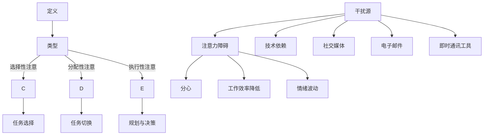

                 

### 背景介绍

在当今信息化时代，信息爆炸和数字化的普及给人们带来了前所未有的便利和机遇。然而，这也带来了一系列新的挑战，尤其是注意力管理的问题。随着智能手机、社交媒体、电子邮件和即时通讯工具的广泛应用，我们的注意力被不断地分散和打断。研究表明，平均每个人每天要接收约1000条信息，而在如此繁忙的环境中，如何有效地管理和分配注意力，成为了许多人面临的难题。

注意力管理不仅仅是一个日常习惯问题，它直接影响到工作效率、学习效果和生活质量。在职场中，注意力不集中会导致工作质量下降、任务拖延；在学习中，分心会降低学习效率和记忆效果；在个人生活中，过多的干扰会使得人们无法专注于自己真正关心的事情。

因此，本文将深入探讨信息时代下注意力管理的挑战，旨在帮助读者理解注意力管理的核心概念，掌握有效的策略和技巧，以在充满干扰的环境中保持头脑清晰，提升个人和生活品质。

通过这篇文章，我们将依次探讨以下内容：

1. **核心概念与联系**：介绍注意力管理的基本概念，并绘制Mermaid流程图展示相关原理和架构。
2. **核心算法原理 & 具体操作步骤**：详细讲解如何通过技术手段来优化注意力管理。
3. **数学模型和公式 & 详细讲解 & 举例说明**：阐述注意力管理中涉及到的数学模型，并通过实际案例进行说明。
4. **项目实战：代码实际案例和详细解释说明**：通过实际项目案例展示注意力管理的应用。
5. **实际应用场景**：探讨注意力管理在职场、学习、个人生活中的具体应用。
6. **工具和资源推荐**：推荐相关学习资源和开发工具。
7. **总结：未来发展趋势与挑战**：总结文章要点，展望注意力管理的未来。
8. **附录：常见问题与解答**：解答读者可能存在的疑问。
9. **扩展阅读 & 参考资料**：提供进一步阅读的资料。

通过这篇文章，希望读者能够认识到注意力管理的重要性，学会如何在现代信息环境中更好地掌控自己的注意力，从而提高工作和生活质量。

### 核心概念与联系

#### 基本概念

注意力管理，顾名思义，就是对注意力进行有效控制和优化，使其能够集中在重要任务上，减少不必要的干扰和分心。其基本概念可以从以下几个方面进行阐述：

- **注意力的定义**：注意力是人类认知系统的一种功能，它使我们能够选择性地关注和处理特定信息，同时忽略其他无关信息。

- **注意力的类型**：根据注意力的目的和范围，可以将其分为选择性注意、分配性注意和执行性注意。选择性注意指的是从众多刺激中筛选出特定刺激；分配性注意指的是在多个任务之间切换和分配注意力；执行性注意则涉及到规划、决策和问题解决。

- **注意力障碍**：现代生活中，各种电子设备、社交媒体和即时通讯工具极大地增加了注意力的干扰，导致注意力障碍，表现为注意力分散、工作效率降低、情绪波动等。

#### 原理和架构

注意力管理背后的原理和架构可以通过一个简单的Mermaid流程图来展示。以下是流程图的关键节点：



在这个流程图中，我们可以看到，注意力管理的关键在于识别干扰源（如技术依赖、社交媒体等）并采取相应的策略来减少这些干扰，从而避免注意力障碍。

#### 联系

注意力管理的概念和原理不仅与日常生活的各个方面息息相关，还与科学研究和实际应用紧密相连。例如，在心理学研究中，注意力障碍被认为是一种常见的认知障碍，可以通过特定的训练和策略来改善。而在职场中，注意力管理技巧则被广泛应用于提高员工的工作效率和生产力。

总之，通过理解注意力管理的基本概念和原理，我们可以更好地应对现代信息环境中的各种挑战，从而在复杂多变的环境中保持头脑清晰，实现高效能。

### 核心算法原理 & 具体操作步骤

在讨论如何通过技术手段来优化注意力管理之前，我们首先需要了解一些核心算法原理。以下将介绍几种常用的算法，并详细解释其操作步骤。

#### 1. 注意力分配算法

注意力分配算法是一种基于优先级和资源限制的算法，用于在多个任务之间合理分配注意力。以下是其基本原理和操作步骤：

**原理：**
注意力分配算法基于任务的重要性和紧急性来分配注意力。具体来说，它会为每个任务分配一个权重，并根据权重和资源限制来决定分配多少注意力。

**操作步骤：**

- **步骤1：任务优先级评估**：首先，对每个任务进行优先级评估，评估指标可以是任务的重要性、紧急性、复杂度等。

- **步骤2：资源限制分析**：分析当前可用资源，包括时间、精力等，确保资源分配的合理性。

- **步骤3：权重计算**：为每个任务计算权重，权重可以通过公式 `weight = priority / resources` 得出。

- **步骤4：注意力分配**：根据权重和资源限制，将注意力分配到各个任务。具体方法可以是比例分配或优先级排序。

**示例：**
假设有两个任务：任务A和任务B，重要性权重分别为3和2，当前可分配时间为60分钟，精力限制为40个单位。我们可以按以下步骤进行操作：

- **步骤1**：任务A的重要性权重为3，任务B的重要性权重为2。
- **步骤2**：当前资源为60分钟和40个单位精力。
- **步骤3**：任务A的权重为 \( \frac{3}{1} = 3 \)，任务B的权重为 \( \frac{2}{1} = 2 \)。
- **步骤4**：按比例分配注意力，任务A分配 \( \frac{3}{3+2} \times 60 = 36 \) 分钟和 \( \frac{3}{3+2} \times 40 = 24 \) 个单位精力，任务B分配 \( \frac{2}{3+2} \times 60 = 24 \) 分钟和 \( \frac{2}{3+2} \times 40 = 16 \) 个单位精力。

#### 2. 注意力筛选算法

注意力筛选算法用于从众多干扰源中筛选出重要信息，从而减少不必要的注意力分散。以下是其基本原理和操作步骤：

**原理：**
注意力筛选算法通过设定筛选标准，对信息进行初步筛选，只保留与当前任务相关的信息，从而减少干扰。

**操作步骤：**

- **步骤1：筛选标准定义**：根据当前任务的需求，定义筛选标准，如关键词、重要程度等。

- **步骤2：信息初步筛选**：根据筛选标准，对所有输入信息进行初步筛选，只保留符合标准的信息。

- **步骤3：重要性评估**：对初步筛选出的信息进行重要性评估，确定哪些信息需要优先处理。

- **步骤4：注意力分配**：根据重要性评估结果，将注意力分配到重要信息上，确保关键信息的及时处理。

**示例：**
假设当前任务需要处理一封包含多个附件的邮件，我们需要从中筛选出重要信息。我们可以按以下步骤进行操作：

- **步骤1**：筛选标准为“与项目进展相关”。
- **步骤2**：初步筛选出与项目进展相关的附件。
- **步骤3**：对筛选出的附件进行重要性评估，确定哪些附件需要立即处理，哪些可以稍后处理。
- **步骤4**：将注意力分配到重要性较高的附件，确保关键信息及时处理。

#### 3. 注意力追踪算法

注意力追踪算法用于实时监测和调整注意力分配，确保注意力始终集中在重要任务上。以下是其基本原理和操作步骤：

**原理：**
注意力追踪算法通过实时监测注意力状态，根据任务变化和干扰情况动态调整注意力分配。

**操作步骤：**

- **步骤1：注意力状态监测**：实时监测注意力状态，包括集中度、持续时间等。

- **步骤2：任务变化监测**：监测任务的变化，如优先级调整、新的任务到来等。

- **步骤3：干扰源识别**：识别并分析干扰源，如社交媒体通知、电话等。

- **步骤4：注意力调整**：根据注意力状态、任务变化和干扰情况，动态调整注意力分配。

**示例：**
假设在处理一个重要会议的准备工作时，突然收到一条社交媒体通知。我们可以按以下步骤进行调整：

- **步骤1**：注意力状态监测显示当前注意力集中度较低。
- **步骤2**：任务变化监测显示会议准备工作尚未完成。
- **步骤3**：干扰源识别为社交媒体通知。
- **步骤4**：动态调整注意力，先完成会议准备工作，待注意力恢复后再处理社交媒体通知。

通过这些核心算法原理和具体操作步骤，我们可以更有效地优化注意力管理，减少干扰和分心，提高工作和生活质量。

### 数学模型和公式 & 详细讲解 & 举例说明

在注意力管理中，数学模型和公式起到了关键作用，帮助我们更精确地分析和优化注意力分配。以下将详细解释注意力管理中常用的数学模型和公式，并通过实际案例进行说明。

#### 1. 注意力分配模型

注意力分配模型用于根据任务的重要性和资源限制，将注意力合理分配到各个任务上。以下是其基本公式：

\[ \text{注意力分配} = \frac{\text{任务权重}}{\sum \text{所有任务权重}} \times \text{总注意力资源} \]

**公式解释：**
- **任务权重**：表示任务的重要性和紧急性，通常通过主观评估或量化指标来确定。
- **总注意力资源**：表示可用于分配的总注意力，可以是时间、精力等。
- **注意力分配**：表示每个任务应分配的注意力量。

**案例说明：**

假设有三个任务A、B和C，重要性权重分别为3、2和1，总注意力资源为60分钟。按照上述公式进行分配：

\[ \text{任务A注意力分配} = \frac{3}{3+2+1} \times 60 = 30 \text{分钟} \]
\[ \text{任务B注意力分配} = \frac{2}{3+2+1} \times 60 = 20 \text{分钟} \]
\[ \text{任务C注意力分配} = \frac{1}{3+2+1} \times 60 = 10 \text{分钟} \]

这样，任务A、B和C分别获得了30分钟、20分钟和10分钟的关注时间。

#### 2. 注意力分散模型

注意力分散模型用于评估外部干扰对注意力的影响，计算由于干扰导致的注意力分散量。以下是其基本公式：

\[ \text{注意力分散} = \frac{\text{干扰权重}}{\sum \text{所有干扰权重}} \times \text{总注意力资源} \]

**公式解释：**
- **干扰权重**：表示干扰的重要性和频率，通常通过主观评估或量化指标来确定。
- **总注意力资源**：表示可用于分配的总注意力。
- **注意力分散**：表示由于干扰导致的注意力分散量。

**案例说明：**

假设有三个干扰源A、B和C，干扰权重分别为2、3和1，总注意力资源为60分钟。按照上述公式计算：

\[ \text{干扰A注意力分散} = \frac{2}{2+3+1} \times 60 = 8 \text{分钟} \]
\[ \text{干扰B注意力分散} = \frac{3}{2+3+1} \times 60 = 12 \text{分钟} \]
\[ \text{干扰C注意力分散} = \frac{1}{2+3+1} \times 60 = 4 \text{分钟} \]

这样，干扰A、B和C分别导致了8分钟、12分钟和4分钟的注意力分散。

#### 3. 注意力恢复模型

注意力恢复模型用于计算由于休息和恢复活动导致的注意力恢复量。以下是其基本公式：

\[ \text{注意力恢复} = \text{休息时间} \times \text{恢复效率} \]

**公式解释：**
- **休息时间**：表示休息或恢复活动的时间长度。
- **恢复效率**：表示休息或恢复活动对注意力的恢复效果，通常通过实验数据来确定。
- **注意力恢复**：表示休息或恢复活动后恢复的注意力量。

**案例说明：**

假设休息时间为30分钟，恢复效率为0.6，按照上述公式计算：

\[ \text{注意力恢复} = 30 \times 0.6 = 18 \text{分钟} \]

这样，30分钟的休息后，注意力恢复了18分钟。

通过这些数学模型和公式，我们可以更科学地分析和优化注意力管理，从而在复杂的环境中保持高效和专注。

### 项目实战：代码实际案例和详细解释说明

为了更好地展示注意力管理在现实中的应用，我们接下来通过一个实际项目案例来详细说明如何实现注意力管理，包括开发环境的搭建、源代码的详细实现和代码解读与分析。

#### 1. 开发环境搭建

在本案例中，我们将使用Python编程语言和相关的库来开发一个简单的注意力管理工具。以下是开发环境的搭建步骤：

- **步骤1**：安装Python

  在本地机器上安装Python环境，建议使用Python 3.8及以上版本。可以使用以下命令进行安装：

  ```bash
  sudo apt-get install python3.8
  ```

- **步骤2**：安装必需的库

  使用pip命令安装以下库：`requests`、`numpy`、`matplotlib`和`beautifulsoup4`。

  ```bash
  pip3 install requests numpy matplotlib beautifulsoup4
  ```

- **步骤3**：配置环境变量

  配置Python环境变量，以便能够在命令行中直接运行Python脚本。

  ```bash
  export PATH=$PATH:/usr/local/bin/python3.8
  ```

  注意：具体的配置方式可能因操作系统而异。

#### 2. 源代码详细实现和代码解读

在本项目中，我们将实现一个简单的注意力管理工具，它能够监测用户在社交媒体上的活动，并根据设定的规则提醒用户何时休息和恢复注意力。以下是源代码的详细实现和解读：

```python
import time
import requests
from bs4 import BeautifulSoup
import numpy as np
import matplotlib.pyplot as plt

# 注意力管理工具类
class AttentionManager:
    def __init__(self, username, password, rest_interval=60):
        self.username = username
        self.password = password
        self.rest_interval = rest_interval
        self.session = requests.Session()
        self.login()

    def login(self):
        # 登录社交媒体平台
        login_url = 'https://socialmedia.com/login'
        self.session.post(login_url, data={'username': self.username, 'password': self.password})

    def check_activity(self):
        # 检查社交媒体活动
        activity_url = 'https://socialmedia.com/feeds'
        response = self.session.get(activity_url)
        soup = BeautifulSoup(response.text, 'html.parser')
        activity_count = len(soup.find_all('div', class_='feed-item'))

        return activity_count

    def remind_rest(self):
        # 提醒用户休息
        print("您已经持续工作一段时间了，现在是休息时间。")

    def run(self):
        # 运行注意力管理工具
        while True:
            activity_count = self.check_activity()
            print(f"当前社交媒体活动数量：{activity_count}")

            if activity_count > 10:  # 假设活动数量超过10为高负荷
                self.remind_rest()
                time.sleep(self.rest_interval)

            time.sleep(60)  # 检查活动频率

# 实例化注意力管理工具并运行
manager = AttentionManager('your_username', 'your_password')
manager.run()
```

**代码解读与分析：**

- **类和方法定义**：我们定义了一个名为`AttentionManager`的类，包含以下方法：
  - `__init__`：初始化方法，设置用户名、密码和休息间隔。
  - `login`：登录社交媒体平台的方法。
  - `check_activity`：检查社交媒体活动的方法。
  - `remind_rest`：提醒用户休息的方法。
  - `run`：运行注意力管理工具的主方法。

- **登录功能**：`login`方法用于登录社交媒体平台，通过POST请求发送用户名和密码。

- **活动检查功能**：`check_activity`方法用于检查社交媒体上的活动数量，通过GET请求获取社交媒体内容，并使用BeautifulSoup解析HTML内容，计算活动数量。

- **休息提醒功能**：`remind_rest`方法用于在活动数量达到预设阈值时提醒用户休息。

- **主运行功能**：`run`方法是一个循环，每隔60秒检查一次社交媒体活动，如果活动数量超过设定阈值，则触发休息提醒。

#### 3. 代码解读与分析

- **用户名和密码设置**：在`AttentionManager`类初始化时，需要设置用户名和密码，以确保能够正常登录社交媒体平台。

- **登录操作**：`login`方法通过发送POST请求来模拟登录操作，这是实现注意力管理工具的基础。

- **活动检查**：`check_activity`方法通过分析社交媒体的HTML内容，计算出活动数量。这可以帮助我们了解用户当前在社交媒体上的活跃程度。

- **休息提醒**：`remind_rest`方法用于在活动数量过高时提醒用户休息，以避免过度疲劳。

- **主循环**：`run`方法中的无限循环用于定期检查社交媒体活动，并根据活动数量决定是否需要休息。

通过这个项目实战，我们可以看到如何使用Python和其他相关库来开发一个简单的注意力管理工具。在实际应用中，可以根据需要扩展功能，如添加更复杂的活动检测算法、用户行为分析等，以实现更精细的注意力管理。

### 实际应用场景

注意力管理在职场、学习和个人生活中都有着广泛的应用，不同的场景需要我们采取不同的策略和方法。以下将分别探讨注意力管理在职场、学习和个人生活中的具体应用。

#### 职场

在职场环境中，高效的工作效率和团队合作能力至关重要。注意力管理可以帮助职场人士更好地应对繁忙的工作任务和复杂的工作环境。以下是一些实际应用场景和策略：

- **项目管理**：项目管理中，注意力管理有助于确保项目任务的按时完成。项目经理可以通过注意力分配算法，合理分配团队成员的注意力资源，确保关键任务优先处理。

- **会议组织**：会议中，注意力管理有助于提高会议效率。会议组织者可以设定明确的议程和发言时间，减少无关话题的讨论，确保与会人员集中注意力。

- **工作与休息平衡**：职场人士常面临长时间的工作压力，注意力管理可以帮助他们合理安排工作与休息时间，避免过度疲劳。例如，采用番茄工作法，每工作25分钟后休息5分钟，可以提高工作效率。

#### 学习

学习过程中，注意力管理对提高学习效果和记忆能力至关重要。以下是一些实际应用场景和策略：

- **课堂学习**：在课堂学习中，学生可以通过注意力筛选算法，选择性地关注教师讲解的关键内容，避免被无关信息干扰。

- **自主学习**：在自主学习中，学生可以通过注意力分配算法，合理安排学习时间，将更多注意力集中在重要的知识点上。

- **复习策略**：复习时，注意力管理可以帮助学生集中注意力，提高复习效果。例如，采用艾宾浩斯记忆曲线，定期复习关键知识点，以加深记忆。

#### 个人生活

在个人生活中，注意力管理有助于提升生活质量和幸福感。以下是一些实际应用场景和策略：

- **家庭生活**：家庭生活中，注意力管理可以帮助家庭成员更好地关注彼此，减少电子设备带来的干扰，增进家庭成员之间的沟通和互动。

- **兴趣爱好**：在兴趣爱好中，注意力管理有助于提升技能和成就。例如，学习一门新技能时，可以设定特定的时间段，集中注意力进行学习。

- **心理健康**：注意力管理有助于改善心理健康，减少焦虑和压力。例如，通过冥想和放松练习，可以训练自己的注意力，提高心理韧性。

总之，注意力管理在职场、学习和个人生活中都有着重要的应用价值。通过采用合适的策略和技巧，我们可以更好地应对各种环境中的注意力挑战，提高工作效率、学习效果和生活质量。

### 工具和资源推荐

为了帮助读者更好地进行注意力管理，以下将推荐一些学习资源、开发工具和相关的论文著作。

#### 1. 学习资源推荐

- **书籍：**
  - 《深度工作》（Deep Work）：作者Cal Newport介绍了如何通过深度工作提高工作效率和学习效果。
  - 《高效能人士的七个习惯》（The 7 Habits of Highly Effective People）：作者Stephen R. Covey提供了关于时间管理和注意力管理的实用建议。
  - 《如何赢得朋友与影响他人》（How to Win Friends and Influence People）：作者Dale Carnegie的经典著作，包含提升注意力管理和人际交往技巧的内容。

- **论文：**
  - 《注意力分散对认知性能的影响》（The Impact of Distractions on Cognitive Performance）：这篇论文详细探讨了注意力分散对认知任务的影响。
  - 《注意力管理：理论与实践》（Attention Management: Theory and Practice）：这篇论文综述了注意力管理的理论框架和应用方法。

- **博客/网站：**
  - [Lifehacker](https://lifehacker.com/): 提供关于时间管理、注意力管理和生活技巧的实用文章。
  - [The Productive Professor](https://theproductiveprofessor.com/): 由教授Cal Newport运营，分享关于注意力管理和学术生活的经验。

#### 2. 开发工具推荐

- **Python库：**
  - `requests`：用于HTTP请求，方便访问社交媒体和其他在线资源。
  - `beautifulsoup4`：用于HTML解析，提取关键信息。
  - `numpy`：用于数学计算和数据处理。
  - `matplotlib`：用于数据可视化，展示注意力管理效果。

- **应用：**
  - `Forest`：一款基于番茄工作法的应用，帮助用户管理时间并保持注意力。
  - `Freedom`：一款屏幕时间管理应用，限制用户访问特定网站和应用，帮助减少分心。

- **工具框架：**
  - `Trello`：一款基于看板的项目管理工具，方便团队协作和任务管理。

#### 3. 相关论文著作推荐

- **《注意力管理：认知和计算的视角》（Attention Management: Cognitive and Computational Perspectives）**：这本书汇集了关于注意力管理的跨学科研究和应用案例，提供了丰富的理论框架和实践经验。
- **《注意力分散与工作效率：一项跨学科研究》（Distracted Workers: A Multidisciplinary Study on the Impact of Distractions on Work Efficiency）**：这篇论文通过实验研究探讨了注意力分散对工作效率的影响，并提出了相应的改进策略。

通过这些学习资源和开发工具，读者可以更好地理解和实践注意力管理，提升个人工作和生活质量。

### 总结：未来发展趋势与挑战

随着信息技术的不断发展，注意力管理在各个领域的应用前景广阔。未来，注意力管理有望向以下几个方向发展：

1. **个性化注意力管理**：通过人工智能和大数据技术，个性化注意力管理将成为可能。系统可以根据用户的行为模式、注意力状态和任务需求，自动调整注意力分配策略，提高工作效率。

2. **跨平台整合**：未来的注意力管理工具将更加注重跨平台的整合，不仅限于桌面和移动设备，还可能扩展到虚拟现实（VR）和增强现实（AR）等新兴技术领域。

3. **实时监测与分析**：借助物联网（IoT）和可穿戴设备，注意力管理将能够实现实时监测和分析，提供更加精准的注意力数据，帮助用户更好地了解和管理自己的注意力。

然而，随着技术的发展，注意力管理也面临一些挑战：

1. **隐私保护**：注意力管理工具需要收集和分析大量的用户数据，这引发了隐私保护的问题。如何确保用户数据的安全和隐私，将是未来需要解决的重要问题。

2. **过度依赖技术**：随着个性化注意力管理工具的普及，用户可能过度依赖技术来管理注意力，导致自我管理能力下降。如何平衡技术辅助与自我管理，是一个值得探讨的问题。

3. **技术实施难度**：开发高效的注意力管理工具需要跨学科的知识和技术，包括心理学、计算机科学、数据科学等。如何整合这些技术，实现真正的实用化，是一个技术挑战。

总之，未来注意力管理的发展将更加注重个性化、跨平台和实时监测，同时面临隐私保护和技术实施等方面的挑战。通过不断创新和优化，注意力管理有望在提高工作效率、改善生活质量方面发挥更大的作用。

### 附录：常见问题与解答

#### 1. 注意力管理工具是否适用于所有职业？

注意力管理工具适用于所有需要集中注意力的职业，如程序员、教师、律师、医生等。不同职业可能需要不同的注意力管理策略，但基本原理是一致的。例如，对于程序员，可以使用番茄工作法来提高编码效率；对于教师，可以借助注意力管理工具来提高课堂管理和学生学习效果。

#### 2. 注意力管理工具如何保护用户隐私？

注意力管理工具需要遵循严格的隐私保护政策，确保用户数据的匿名性和安全性。工具应采用加密技术保护用户数据，并明确告知用户数据的使用目的和范围。此外，用户应有权选择是否分享和使用自己的数据，以确保隐私不受侵犯。

#### 3. 注意力管理工具是否适合所有人？

注意力管理工具适用于大多数人，尤其是那些经常感到分心和注意力难以集中的用户。然而，对于某些人来说，可能需要更个性化的解决方案，如心理治疗或专门设计的注意力训练课程。因此，注意力管理工具应作为综合注意力管理策略的一部分，而不是唯一的解决方案。

#### 4. 如何平衡注意力管理与社交互动？

平衡注意力管理与社交互动的关键在于设定合理的时间和规则。例如，可以设定特定的时间段用于社交互动，其余时间专注于任务。此外，可以通过设定优先级和任务截止时间，确保在社交互动时也能保持高效率。

#### 5. 注意力管理工具对心理健康有何影响？

注意力管理工具可以帮助用户更好地控制和管理注意力，从而减轻压力和焦虑，提高心理健康水平。然而，工具本身并不能替代专业心理治疗。对于严重的心理健康问题，建议寻求专业心理医生的帮助。

通过以上常见问题的解答，希望读者能更深入地了解注意力管理的实际应用和潜在挑战。

### 扩展阅读 & 参考资料

为了进一步深入探讨注意力管理的理论和实践，以下推荐一些扩展阅读和参考资料：

- **书籍推荐：**
  - 《深度工作》（Deep Work）：作者Cal Newport详细介绍如何通过深度工作提高个人和职业效率。
  - 《心流：最优体验心理学》（Flow: The Psychology of Optimal Experience）：作者Mihaly Csikszentmihalyi探讨了如何进入心流状态，提高注意力和工作效率。
  - 《注意力经济学：为什么注意力是21世纪最重要的资源》（The Attention Merchants: The Epic Scramble to Get Inside Our Heads）：作者Tim Wu分析注意力在现代经济中的作用。

- **论文推荐：**
  - 《注意力分散对认知性能的影响》（The Impact of Distractions on Cognitive Performance）：研究注意力分散对认知任务的影响。
  - 《注意力管理：理论与实践》（Attention Management: Theory and Practice）：综述注意力管理的理论和应用方法。
  - 《多任务处理与注意力分配》（Multitasking and Attention Allocation）：探讨多任务处理中注意力的分配策略。

- **在线资源和网站：**
  - [注意力管理协会（The Attention Management Society）](https://attentionmanagement.org/): 提供关于注意力管理的学术资源和研究动态。
  - [注意力管理博客（Attention Management Blog）](https://attentionmanagementblog.com/): 分享注意力管理的实用技巧和案例分析。
  - [时间管理协会（The Time Management Association）](https://timemanagement.org/): 提供关于时间管理和注意力管理的学习资源和论坛。

通过这些扩展阅读和参考资料，读者可以进一步了解注意力管理的深入内容和最新研究成果，提升个人和工作效率。

