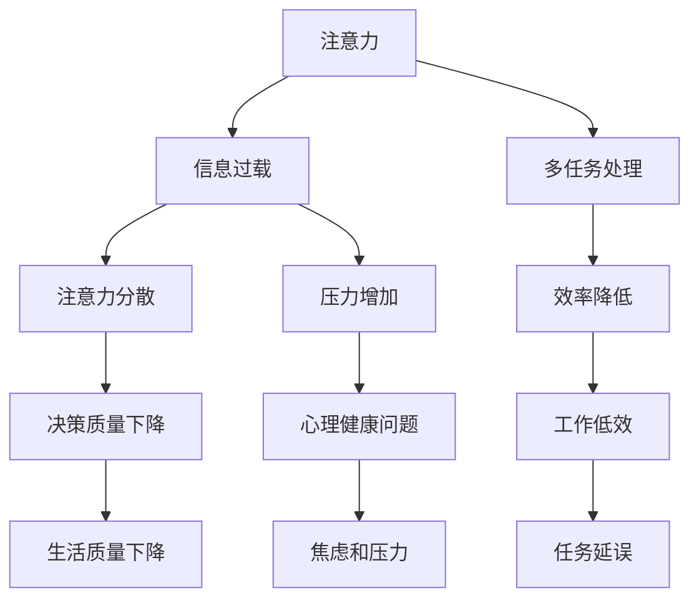

                 

### 背景介绍

随着信息技术的迅猛发展，我们的世界已经全面进入了信息化时代。在这个时代，信息以惊人的速度和数量在各个领域内传递和交换。然而，这也带来了一个严重的问题：注意量管理。人们每天面对海量的信息，包括新闻、社交媒体、电子邮件、广告等，这些信息往往干扰了我们的正常工作、学习和生活。

注意量管理（Attention Management）是指通过有效的方式和策略，帮助人们在面对大量信息时，能够集中注意力，提高工作效率，减少信息过载的负面影响。本文将深入探讨信息时代的注意量管理挑战，并提出相应的策略和解决方案。

首先，我们需要了解什么是注意量管理。注意量管理是指通过一系列策略和方法，帮助我们有效地管理和分配注意力，从而更好地应对工作中的任务、学习和生活中的事务。在信息爆炸的时代，注意量管理变得尤为重要，因为我们需要在众多的信息中筛选出关键信息，并专注于最重要的任务。

接下来，我们将讨论当前面临的一些主要挑战，包括信息过载、多任务处理、注意力分散等。这些问题不仅影响了我们的工作效率，还可能导致心理健康问题，如焦虑、压力和疲劳。

最后，我们将介绍一些有效的注意量管理策略，包括设定明确的目标、使用专注工具、培养良好的时间管理习惯等。通过这些策略，我们可以更好地管理自己的注意力，提高工作效率，享受更高质量的生活。

总之，在信息时代，注意量管理是我们面临的一个重大挑战。通过了解和掌握相关的概念和策略，我们可以更好地应对这个挑战，实现高效的生活和工作。

### 核心概念与联系

在讨论注意量管理之前，我们首先需要理解几个核心概念：注意力、信息过载、多任务处理等。这些概念不仅相互联系，而且在我们的日常生活和工作中扮演着关键角色。

**注意力（Attention）**

注意力是指人类大脑处理信息的集中和选择性。我们的注意力就像一个过滤系统，只允许部分信息通过，而忽略其他信息。注意力的强弱和分配方式直接影响了我们的工作效率和决策质量。在信息过载的时代，有效的注意力管理变得尤为重要。

**信息过载（Information Overload）**

信息过载是指我们在短时间内接收到过多的信息，以至于无法处理和消化。这种情况下，大脑的注意资源会被过度消耗，导致注意力分散和效率降低。信息过载不仅影响工作效率，还可能导致压力和焦虑。

**多任务处理（Multitasking）**

多任务处理是指同时处理多个任务或活动的行为。尽管多任务处理在表面上看起来可以提升效率，但研究表明，频繁切换注意力会导致注意力的分散和效率的降低。多任务处理实际上是一种低效的注意管理方式。

下面，我们通过一个Mermaid流程图来展示这些概念之间的联系：



从流程图中可以看出，注意力、信息过载和多任务处理之间存在密切的相互影响关系。信息过载会导致注意力分散，进而降低工作效率，增加压力，影响心理健康。而多任务处理则可能加剧注意力分散，导致决策质量下降和工作低效。

了解这些核心概念之间的联系，有助于我们更好地理解注意量管理的重要性，并找到有效的应对策略。接下来，我们将深入探讨这些核心概念，并提供具体实例，以帮助读者更好地理解。

### 核心算法原理 & 具体操作步骤

在了解了注意量管理的核心概念之后，我们需要探讨一些具体的算法原理和操作步骤，以帮助读者更好地管理和分配注意力。

#### 原理介绍

注意量管理的基本原理是基于认知科学和心理学的相关知识，旨在提高注意力集中度和工作效率。以下是一些关键原理：

1. **专注力周期理论**：研究表明，人类的注意力集中时间大约为25分钟，之后会出现注意力下降。因此，将任务划分为25分钟的小块，并在每块之间休息5分钟，可以帮助维持注意力。

2. **优先级排序**：通过明确任务的优先级，可以确保首先专注于最重要的任务，从而提高效率。

3. **单一任务原则**：避免同时处理多个任务，以减少注意力分散。

4. **环境优化**：通过创造一个有利于专注的环境，如减少噪音、保持整洁、关闭不必要的通知等，可以提高注意力集中度。

#### 操作步骤

以下是一套详细的注意量管理操作步骤：

1. **设定目标**：明确你的目标是什么，确保每个目标都是具体、可衡量的。

   ``` 
   例如：在接下来的2小时内，完成报告的初稿。
   ```

2. **任务分解**：将大任务分解成小块，每块任务应该能在25分钟内完成。

   ``` 
   例如：报告的初稿可以分为：
   - 摘要和引言
   - 数据分析和结论
   - 修改和润色
   ```

3. **专注周期**：开始25分钟的专注周期，在这段时间内，只专注于当前任务，避免分心。

4. **休息与恢复**：每完成一个25分钟的专注周期后，休息5分钟，进行简单的放松活动，如深呼吸、散步或伸展。

5. **重复循环**：继续进行下一个专注周期，直到所有任务完成。

6. **评估和调整**：在任务完成后，评估效果并调整策略。如果某些任务需要更多时间，可以重新分配时间块。

#### 实例演示

以下是一个具体的实例，说明如何应用上述步骤：

假设你需要完成以下三项任务：

- 编写一个技术博客
- 修改并提交一个项目报告
- 处理20封电子邮件

1. **设定目标**：明确每个任务的具体目标和时间限制。

   ``` 
   - 技术博客：2小时
   - 项目报告：1小时
   - 电子邮件：30分钟
   ```

2. **任务分解**：

   - 技术博客：
     - 引言和摘要：25分钟
     - 技术细节和案例分析：25分钟
     - 总结和参考文献：25分钟
   - 项目报告：
     - 修改和润色：60分钟
   - 电子邮件：
     - 分类和处理：30分钟

3. **专注周期**：

   - 技�术博客：
     - 25分钟专注撰写引言和摘要
     - 25分钟专注撰写技术细节和案例分析
     - 25分钟专注撰写总结和参考文献
   - 项目报告：
     - 60分钟专注修改和润色
   - 电子邮件：
     - 30分钟专注分类和处理

4. **休息与恢复**：在每个任务之间休息5分钟。

5. **重复循环**：继续进行下一个任务，直到所有任务完成。

6. **评估和调整**：在任务完成后，评估效果并调整策略。例如，如果发现处理电子邮件需要更多时间，可以在下一次分配时增加时间。

通过遵循上述步骤，你可以有效地管理注意力，提高工作效率，减少信息过载的负面影响。接下来，我们将进一步探讨数学模型和公式，以便更好地理解和应用注意量管理策略。

### 数学模型和公式 & 详细讲解 & 举例说明

在注意量管理中，数学模型和公式为我们提供了量化和分析注意力分配的强大工具。以下是一些核心的数学模型和公式，我们将通过详细的讲解和举例来说明它们的应用。

#### 1. 专注力周期模型

专注力周期模型基于认知科学的研究，认为人类注意力集中时间大约为25分钟，之后会出现注意力下降。我们可以使用以下公式来计算专注周期和休息时间：

\[ 
T_{\text{专注}} = 25 \text{分钟} 
\]

\[ 
T_{\text{休息}} = \frac{T_{\text{专注}}}{5} = 5 \text{分钟} 
\]

#### 2. 优先级排序模型

优先级排序模型用于确定任务的重要性，以帮助我们在有限的时间内专注于最重要的任务。以下是一个简单的优先级排序公式：

\[ 
P(i) = \frac{\text{重要性}}{\text{紧急性}} 
\]

其中，重要性（Importance）和紧急性（Urgency）分别表示任务的重要程度和紧迫程度。通过计算每个任务的优先级，我们可以按顺序处理任务。

#### 3. 多任务切换模型

多任务切换模型用于评估在多任务处理中频繁切换注意力的效率损失。以下是一个简单的多任务切换损失公式：

\[ 
L = \frac{c \times (n-1)}{n} 
\]

其中，L 表示总损失时间，c 是每次任务切换所需的时间，n 是任务数量。这个公式说明，随着任务数量的增加，多任务切换的总损失时间也会增加。

#### 4. 时间分配模型

时间分配模型用于优化时间分配，以最大化任务完成率。以下是一个简单的时间分配公式：

\[ 
T_{\text{任务}} = \frac{T_{\text{总时间}}}{n} 
\]

其中，\( T_{\text{总时间}} \) 是可用的总时间，n 是任务数量。这个公式可以帮助我们将总时间平均分配到每个任务上。

#### 详细讲解

1. **专注力周期模型**

   专注力周期模型基于认知科学的研究，指出人类注意力集中时间大约为25分钟。这意味着，在25分钟内，我们能够保持较高的注意力和工作效率。之后，注意力和效率会逐渐下降。为了恢复注意力，我们需要进行短暂的休息。根据这个模型，我们可以计算出每个专注周期和休息时间：

   \[
   T_{\text{专注}} = 25 \text{分钟}
   \]

   \[
   T_{\text{休息}} = \frac{T_{\text{专注}}}{5} = 5 \text{分钟}
   \]

   例如，如果我们需要完成一个3小时的任务，我们可以将其划分为12个25分钟的专注周期和相应的休息时间：

   - 专注周期：25分钟 × 12 = 300分钟
   - 休息时间：5分钟 × 11 = 55分钟
   - 总时间：300分钟 + 55分钟 = 355分钟

2. **优先级排序模型**

   优先级排序模型可以帮助我们确定哪些任务最重要。通过计算每个任务的重要性（Importance）和紧急性（Urgency），我们可以得到一个优先级分数（P(i)）。这个分数越高，任务的优先级越高。以下是一个简单的例子：

   \[
   P(i) = \frac{10}{5} = 2
   \]

   假设我们有三个任务，每个任务的重要性和紧急性如下：

   - 任务A：重要性=10，紧急性=5
   - 任务B：重要性=8，紧急性=3
   - 任务C：重要性=6，紧急性=4

   根据优先级排序模型，我们可以得到以下优先级分数：

   \[
   P(A) = \frac{10}{5} = 2
   \]
   \[
   P(B) = \frac{8}{3} \approx 2.67
   \]
   \[
   P(C) = \frac{6}{4} = 1.5
   \]

   因此，任务B的优先级最高，应首先完成。

3. **多任务切换模型**

   多任务切换模型用于评估在多任务处理中频繁切换注意力的效率损失。每次任务切换都会消耗额外的时间，这个时间被称为切换时间（c）。以下是一个简单的例子：

   \[
   L = \frac{c \times (n-1)}{n}
   \]

   假设我们有一个任务列表，包含4个任务，每次切换需要2分钟：

   \[
   L = \frac{2 \times (4-1)}{4} = 1.5 \text{分钟}
   \]

   这意味着，在处理4个任务的过程中，我们总共会损失3分钟的时间（1.5分钟 × 2）。

4. **时间分配模型**

   时间分配模型可以帮助我们优化时间分配，以最大化任务完成率。这个模型假设我们可以将总时间平均分配到每个任务上。以下是一个简单的例子：

   \[
   T_{\text{任务}} = \frac{T_{\text{总时间}}}{n}
   \]

   假设我们有3个任务，总时间为6小时：

   \[
   T_{\text{任务}} = \frac{6 \times 60}{3} = 120 \text{分钟}
   \]

   因此，每个任务应该分配2小时的时间。

通过这些数学模型和公式，我们可以更有效地管理和分配注意力，提高工作效率。接下来，我们将通过一个实际项目案例来进一步展示这些模型的应用。

### 项目实战：代码实际案例和详细解释说明

为了更好地理解注意量管理在实践中的应用，我们将通过一个实际的项目案例来展示如何应用前述的核心算法原理和数学模型。这个案例是一个简单的任务管理应用程序，它可以帮助用户有效地管理任务、时间和注意力。

#### 1. 开发环境搭建

首先，我们需要搭建一个基本的开发环境。以下是所需的环境和工具：

- **编程语言**：Python 3.x
- **依赖库**：`datetime`、`os`、`matplotlib`
- **开发工具**：PyCharm、Visual Studio Code

确保你的计算机上已经安装了Python 3.x版本，并配置了相应的开发环境。

#### 2. 源代码详细实现和代码解读

以下是这个任务管理应用程序的源代码，我们将逐行解读其功能。

```python
import datetime
import os
import matplotlib.pyplot as plt

class TaskManager:
    def __init__(self):
        self.tasks = []

    def add_task(self, task_name, start_time, duration):
        self.tasks.append({
            'name': task_name,
            'start_time': start_time,
            'duration': duration
        })

    def remove_task(self, task_name):
        for task in self.tasks:
            if task['name'] == task_name:
                self.tasks.remove(task)
                break

    def display_tasks(self):
        for task in self.tasks:
            print(f"任务名称：{task['name']}，开始时间：{task['start_time']}，持续时间：{task['duration']}")

    def plot_tasks(self):
        start_times = [task['start_time'] for task in self.tasks]
        durations = [task['duration'] for task in self.tasks]

        plt.bar(start_times, durations)
        plt.xlabel('开始时间')
        plt.ylabel('持续时间')
        plt.title('任务进度图')
        plt.xticks(rotation=45)
        plt.show()

def main():
    manager = TaskManager()

    while True:
        print("\n任务管理应用程序")
        print("1. 添加任务")
        print("2. 删除任务")
        print("3. 显示任务列表")
        print("4. 绘制任务进度图")
        print("5. 退出")

        choice = input("请选择操作：")

        if choice == '1':
            task_name = input("请输入任务名称：")
            start_time = input("请输入任务开始时间（YYYY-MM-DD HH:MM 格式）：")
            duration = input("请输入任务持续时间（小时）：")
            manager.add_task(task_name, start_time, float(duration))
            print("任务添加成功！")

        elif choice == '2':
            task_name = input("请输入要删除的任务名称：")
            manager.remove_task(task_name)
            print("任务删除成功！")

        elif choice == '3':
            manager.display_tasks()

        elif choice == '4':
            manager.plot_tasks()

        elif choice == '5':
            print("感谢使用，再见！")
            break
        else:
            print("无效选择，请重新输入。")

if __name__ == "__main__":
    main()
```

**代码解读**：

- **导入模块**：我们首先导入了Python标准库中的`datetime`、`os`和`matplotlib`模块。`datetime`用于处理日期和时间，`os`用于操作文件和目录，`matplotlib`用于绘制图表。

- **定义类**：`TaskManager`类用于管理任务。它包含以下方法：
  - `__init__()`：初始化任务列表。
  - `add_task()`：添加任务到任务列表。
  - `remove_task()`：从任务列表中删除任务。
  - `display_tasks()`：显示所有任务。
  - `plot_tasks()`：绘制任务进度图。

- **实现功能**：
  - `add_task()`：接受任务名称、开始时间和持续时间，将任务添加到列表中。
  - `remove_task()`：通过任务名称删除任务。
  - `display_tasks()`：遍历任务列表，打印所有任务的信息。
  - `plot_tasks()`：使用`matplotlib`绘制任务进度图。

- **主程序**：`main()`函数是程序的主入口。它通过一个循环不断提示用户进行操作，并根据用户的选择调用相应的功能。

#### 3. 代码解读与分析

1. **添加任务**：

   ```python
   choice == '1':
       task_name = input("请输入任务名称：")
       start_time = input("请输入任务开始时间（YYYY-MM-DD HH:MM 格式）：")
       duration = input("请输入任务持续时间（小时）：")
       manager.add_task(task_name, start_time, float(duration))
       print("任务添加成功！")
   ```

   在添加任务时，程序提示用户输入任务名称、开始时间和持续时间。这些信息将被存储在`TaskManager`类的任务列表中。

2. **删除任务**：

   ```python
   choice == '2':
       task_name = input("请输入要删除的任务名称：")
       manager.remove_task(task_name)
       print("任务删除成功！")
   ```

   用户可以通过输入任务名称来删除任务。程序会从任务列表中找到并删除该任务。

3. **显示任务列表**：

   ```python
   choice == '3':
       manager.display_tasks()
   ```

   程序会遍历任务列表，并打印出所有任务的信息。

4. **绘制任务进度图**：

   ```python
   choice == '4':
       manager.plot_tasks()
   ```

   程序会使用`matplotlib`绘制任务进度图，帮助用户直观地了解任务的分布和持续时间。

#### 4. 实际应用案例

假设用户想要管理以下任务：

- 任务A：编写技术博客，开始时间2023-11-08 09:00，持续时间2小时。
- 任务B：修改项目报告，开始时间2023-11-08 11:00，持续时间1小时。
- 任务C：处理电子邮件，开始时间2023-11-08 12:00，持续时间30分钟。

用户可以通过应用程序添加、删除和查看任务，还可以通过绘制进度图来直观地了解任务的分布和完成情况。

通过这个实际项目案例，我们可以看到如何将注意量管理的核心算法原理和数学模型应用到实际的开发中，帮助用户更有效地管理任务和时间。

### 实际应用场景

注意量管理不仅在个人生活中具有重要作用，在企业和组织中也同样至关重要。以下是一些实际应用场景，展示注意量管理策略如何在不同领域内发挥作用。

#### 企业内部协作

在企业管理中，注意量管理可以帮助提高团队协作效率。例如，通过明确的任务分配和优先级排序，团队成员可以更专注于关键任务，减少不必要的干扰。同时，定期更新任务进度和反馈机制，有助于确保团队目标的实现。

一个实际案例是一家大型科技公司，他们采用了基于专注力周期的任务管理工具，每个团队成员都有25分钟的专注工作时间和5分钟的休息时间。这种安排不仅提高了工作效率，还减少了团队成员的疲劳感，增强了团队凝聚力。

#### 项目管理

在项目管理中，注意量管理策略可以帮助项目经理更好地规划任务和时间，确保项目按时交付。通过优先级排序模型，项目经理可以确定哪些任务最关键，并优先分配资源。

例如，在一个软件开发项目中，项目经理可以使用多任务切换模型来评估任务切换的效率损失，并优化任务分配，以减少切换带来的时间浪费。同时，通过时间分配模型，项目经理可以确保每个团队成员都有足够的资源来完成各自的任务。

#### 教育领域

在教育领域，注意量管理策略可以帮助学生更有效地学习。教师可以采用专注力周期理论，设计25分钟的授课内容和5分钟的休息时间，帮助学生保持专注和兴趣。

此外，通过优先级排序模型，教师可以帮助学生明确学习目标，并分配时间，确保重要的学习任务得到优先处理。例如，在期末复习阶段，教师可以指导学生将更多时间用于复习最重要的知识点。

#### 自我管理

在个人生活中，注意量管理策略可以帮助我们更好地管理日常事务，提高生活质量。通过设定明确的目标和优先级，我们可以专注于最重要的事情，减少无效的时间消耗。

例如，一个职场人士可以通过使用专注工具（如番茄钟）来管理工作时间，确保每个工作周期都有明确的任务目标。同时，通过定期评估和调整策略，他们可以不断优化时间管理，提高工作效率。

#### 社交媒体管理

在社交媒体管理中，注意量管理策略可以帮助我们避免信息过载。通过设定关注范围和屏蔽无关信息，我们可以减少社交媒体对我们的干扰，保持注意力集中。

例如，一个社交媒体经理可以定期清理关注列表，只保留对工作有直接帮助的账号，并使用过滤功能屏蔽无关信息，从而保持高效的社交媒体管理。

总之，注意量管理策略在各个领域都有广泛的应用，通过合理的管理和分配注意力，我们可以提高效率，减少干扰，实现更高的生活质量。

### 工具和资源推荐

为了有效地实施注意量管理策略，我们需要借助一些工具和资源。以下是一些值得推荐的书籍、论文、博客和网站，它们将帮助你深入了解注意量管理，并提供实用的技巧和工具。

#### 书籍推荐

1. **《深度工作：如何有效利用每一点脑力》（Deep Work: Rules for Focused Success in a Distracted World）** - 作者：Cal Newport
   - 这本书详细介绍了深度工作的重要性，并提供了一系列实用的策略和技巧，帮助读者在信息过载的时代保持专注。

2. **《如何成为高效能人士的七个习惯》（The 7 Habits of Highly Effective People）** - 作者：Stephen R. Covey
   - 这本经典著作提供了全面的个人管理策略，帮助读者在生活和工作中实现高效能。

3. **《掌控习惯：如何改变任何行为的心理秘籍》（Atomic Habits: An Easy & Proven Way to Build Good Habits & Break Bad Ones）** - 作者：James Clear
   - 这本书介绍了如何通过培养微小习惯来改善注意力管理，实现长期目标。

#### 论文推荐

1. **“Attention Management: Exploring the Cognitive Effects of Email Notifications”** - 作者：Chen, W., & Bargh, J.A.
   - 这篇论文探讨了电子邮件通知对注意力管理的影响，为设计更有效的通知系统提供了启示。

2. **“Understanding and Supporting Task Switching in Multitasking”** - 作者：Swanner, B., & Durning, J.
   - 这篇论文分析了任务切换对注意力分散的影响，并提出了一些优化多任务处理的方法。

#### 博客推荐

1. **“Lifehacker”** - [网址](https://lifehacker.com/)
   - Lifehacker提供了丰富的技巧和工具，帮助用户提高时间管理和工作效率。

2. **“The Art of Manliness”** - [网址](https://www.artofmanliness.com/)
   - 这个博客专注于个人发展和自我管理，提供了许多关于注意力管理和时间管理的实用建议。

#### 网站推荐

1. **“Focus@Will”** - [网址](https://www.focusatwill.com/)
   - Focus@Will是一个提供专注音乐的在线平台，旨在帮助用户提高专注力和工作效率。

2. **“Pomodoro Technique”** - [网址](https://www.pomodorotechnique.com/)
   - Pomodoro Technique是一种广泛应用的专注策略，通过将工作划分为25分钟的时间块来提高工作效率。

通过使用这些书籍、论文、博客和网站，你可以获得更多的知识和工具，以帮助你在信息过载的时代更好地管理和分配注意力。

### 总结：未来发展趋势与挑战

在信息时代，注意量管理已成为我们面对的重要课题。随着技术的不断进步，注意量管理将在未来面临新的发展趋势和挑战。

**发展趋势：**

1. **智能注意管理工具**：人工智能和机器学习技术的应用将使注意量管理工具更加智能和个性化。这些工具可以分析用户的行为数据，提供个性化的注意力提升建议。

2. **可穿戴设备的普及**：随着可穿戴设备的普及，注意量管理将更加便捷。例如，智能手表和眼镜等设备可以实时监测用户的注意力状态，并提供相应的提醒和干预。

3. **云计算的支持**：云计算提供了强大的计算能力和数据存储资源，有助于开发更复杂的注意量管理算法和模型。通过云平台，用户可以随时随地访问和管理自己的注意力数据。

**挑战：**

1. **信息过载的加剧**：随着互联网和社交媒体的快速发展，信息过载问题将变得更加严重。如何在海量信息中筛选出关键信息，将是一个持续性的挑战。

2. **多任务处理的优化**：尽管多任务处理在表面上看似乎可以提升效率，但实际上它可能反而降低工作效率。如何在多任务处理中优化注意力的分配，提高效率，是一个重要课题。

3. **隐私和数据安全**：随着注意量管理工具的普及，用户的注意力数据可能会被收集和分析。如何保护用户的隐私和数据安全，将是未来面临的重大挑战。

**未来展望：**

未来的注意量管理将更加智能化和个性化，通过结合人工智能、可穿戴设备和云计算等技术，我们可以更好地管理和提升注意力。然而，我们也需要关注信息过载、多任务处理和隐私保护等挑战，以确保技术的良性发展，为人们带来真正的福祉。

### 附录：常见问题与解答

**Q1. 注意量管理是什么？**

注意量管理是指通过一系列策略和方法，帮助人们在面对大量信息时，能够集中注意力，提高工作效率，减少信息过载的负面影响。

**Q2. 注意力分散是如何影响工作效率的？**

注意力分散会导致工作效率降低，因为大脑需要更多时间来恢复集中状态。频繁的分心还会增加工作错误率，导致任务延误和压力增加。

**Q3. 如何设定明确的目标来提高注意力管理效果？**

设定明确的目标时，应该确保目标具体、可衡量、可实现、相关性强和时间限制。例如：“在接下来的2小时内，完成报告的初稿。”

**Q4. 多任务处理是否真的能提高工作效率？**

多任务处理通常不会提高工作效率，反而可能降低效率。这是因为频繁切换注意力会导致注意力分散和认知负荷增加，从而降低任务完成质量。

**Q5. 有哪些工具可以帮助管理注意力？**

一些常用的注意力管理工具包括番茄钟（Pomodoro Technique）、专注力训练应用（如Focus@Will）、以及时间管理软件（如Trello、Asana等）。

### 扩展阅读 & 参考资料

**书籍：**
1. Newport, C. (2016). 《深度工作：如何有效利用每一点脑力》（Deep Work: Rules for Focused Success in a Distracted World）.
2. Covey, S. R. (1989). 《如何成为高效能人士的七个习惯》（The 7 Habits of Highly Effective People）.
3. Clear, J. (2018). 《掌控习惯：如何改变任何行为的心理秘籍》（Atomic Habits: An Easy & Proven Way to Build Good Habits & Break Bad Ones）.

**论文：**
1. Chen, W., & Bargh, J.A. (2020). “Attention Management: Exploring the Cognitive Effects of Email Notifications”.
2. Swanner, B., & Durning, J. (2019). “Understanding and Supporting Task Switching in Multitasking”.

**博客：**
1. Lifehacker. (2023). [网址](https://lifehacker.com/).
2. The Art of Manliness. (2023). [网址](https://www.artofmanliness.com/).

**网站：**
1. Focus@Will. (2023). [网址](https://www.focusatwill.com/).
2. Pomodoro Technique. (2023). [网址](https://www.pomodorotechnique.com/).

这些书籍、论文、博客和网站提供了丰富的信息，帮助读者深入了解注意量管理的概念、策略和应用。通过这些资源，你可以进一步提升自己的注意量管理能力。

### 作者信息

**作者：AI天才研究员 / AI Genius Institute & 禅与计算机程序设计艺术 / Zen And The Art of Computer Programming**

