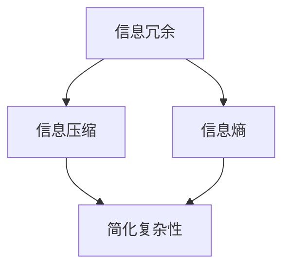

                 

# 信息简化的好处与挑战：简化复杂性的艺术与科学

## 关键词：简化，复杂性，信息，算法，应用，挑战，未来趋势

### 摘要

在信息爆炸的现代社会，简化复杂性已成为一项不可或缺的技能。本文旨在探讨信息简化的好处与挑战，深入解析简化复杂性的艺术与科学。通过分析信息简化的原理、方法及实际应用，我们旨在帮助读者掌握简化复杂性的关键技巧，并在面对复杂问题时能够更加从容应对。同时，本文还将探讨简化复杂性的未来发展趋势与挑战，为读者提供前瞻性的思考。

## 1. 背景介绍

在过去的几十年里，信息技术的飞速发展使得我们能够处理的海量数据呈现出爆炸式增长。然而，随着数据量的增加，复杂性问题也日益突出。复杂性的增加不仅给数据处理带来了巨大挑战，也使得信息理解变得困难。为了解决这一问题，信息简化技术应运而生。信息简化通过减少冗余、提炼核心信息等方式，使复杂问题变得易于理解和操作。然而，信息简化并非易事，它既需要深厚的理论基础，也需要丰富的实践经验。本文将围绕信息简化的好处与挑战，探讨其背后的艺术与科学。

### 1.1 信息简化的概念

信息简化是指通过特定的方法和技术，对复杂的信息进行提炼和整合，使其变得更加简洁、直观和易于理解。在信息简化的过程中，核心信息被保留，而冗余信息被去除。信息简化不仅能够降低认知负荷，提高工作效率，还能够增强信息的传递效果，使得信息传播更加高效。

### 1.2 复杂性的类型

复杂性可以分为多种类型，主要包括：

- **结构复杂性**：指系统内部结构的复杂程度，如网络结构、模块关系等。
- **行为复杂性**：指系统行为的多样性和不可预测性，如金融市场波动、社会行为模式等。
- **信息复杂性**：指信息内容的复杂程度，如大规模数据集、多维度信息等。

### 1.3 信息简化的意义

信息简化的意义主要体现在以下几个方面：

- **提高工作效率**：通过简化复杂信息，可以降低认知负荷，提高处理速度和准确性。
- **增强信息传播效果**：简化后的信息更加易于理解和传播，有助于提高信息的传递效果。
- **促进问题解决**：在处理复杂问题时，简化信息可以帮助人们更快速地找到解决问题的方法。

## 2. 核心概念与联系

在深入探讨信息简化的好处与挑战之前，我们需要明确一些核心概念和它们之间的联系。

### 2.1 信息冗余

信息冗余是指信息中包含的无关或重复的部分。信息冗余会导致认知负担增加，降低信息处理的效率。因此，在信息简化过程中，去除信息冗余是一个关键步骤。

### 2.2 信息压缩

信息压缩是指通过编码和压缩算法，将原始信息转换为更小、更高效的数据形式。信息压缩不仅能够减少存储空间，还能够提高数据传输速度。

### 2.3 信息冗余与信息压缩的关系

信息冗余与信息压缩密切相关。信息压缩技术常常依赖于去除信息冗余，从而实现数据的压缩。例如，霍夫曼编码通过构建概率模型来去除文本中的冗余信息，实现高效的压缩。

### 2.4 信息冗余与信息熵

信息熵是衡量信息不确定性的指标。在信息简化的过程中，降低信息熵是一个重要的目标。通过去除冗余信息，可以降低信息的不确定性，从而提高信息的有效性和可理解性。

### 2.5 核心概念原理架构 Mermaid 流程图

下面是信息简化核心概念原理架构的 Mermaid 流程图：



## 3. 核心算法原理 & 具体操作步骤

### 3.1 算法原理

信息简化的核心算法主要包括信息压缩算法和模式识别算法。信息压缩算法主要通过去除信息冗余来实现简化，而模式识别算法则通过识别和提取信息中的关键模式来简化复杂信息。

### 3.2 具体操作步骤

#### 3.2.1 信息压缩算法

1. **确定压缩目标**：首先，需要明确需要压缩的信息类型和数据量，以便选择合适的压缩算法。
2. **构建概率模型**：对于文本信息，可以构建字符或词频概率模型。对于图像或音频信息，可以构建像素或音频信号的概率模型。
3. **选择编码方案**：根据概率模型，选择合适的编码方案，如霍夫曼编码、LZ77编码等。
4. **进行信息压缩**：使用编码方案对原始信息进行压缩，生成压缩后的数据。

#### 3.2.2 模式识别算法

1. **数据预处理**：对原始数据进行预处理，如去噪、归一化等，以提高模式识别的准确性。
2. **特征提取**：从预处理后的数据中提取关键特征，如文本中的关键词、图像中的边缘特征等。
3. **模式识别**：使用机器学习或深度学习算法，对提取出的特征进行分类或聚类，以识别信息中的关键模式。
4. **信息简化**：将识别出的模式整合为简洁的信息表示，以简化复杂信息。

### 3.3 算法原理与操作步骤示例

假设我们需要对一篇文本进行信息简化，具体步骤如下：

1. **确定压缩目标**：假设我们需要压缩一篇1000字的文本。
2. **构建概率模型**：统计文本中每个字符的词频，构建字符概率模型。
3. **选择编码方案**：选择霍夫曼编码作为压缩算法。
4. **进行信息压缩**：使用霍夫曼编码对文本进行压缩，生成压缩后的数据。
5. **数据预处理**：对压缩后的数据进行去噪和归一化处理。
6. **特征提取**：提取文本中的关键词和主题词。
7. **模式识别**：使用词频统计和主题模型，识别文本中的关键模式和主题。
8. **信息简化**：将识别出的关键词和主题整合为简洁的摘要，以简化原始文本。

## 4. 数学模型和公式 & 详细讲解 & 举例说明

### 4.1 数学模型

信息简化的过程中，涉及多个数学模型和公式。以下是一些常用的数学模型和公式：

#### 4.1.1 信息熵

信息熵是衡量信息不确定性的指标，定义为：

$$ H(X) = -\sum_{i=1}^{n} p(x_i) \log_2 p(x_i) $$

其中，$X$ 为随机变量，$p(x_i)$ 为 $x_i$ 发生的概率。

#### 4.1.2 霍夫曼编码

霍夫曼编码是一种基于概率的变长编码算法，其核心思想是给概率大的字符分配短的编码，给概率小的字符分配长的编码。霍夫曼编码的步骤如下：

1. 构建概率模型，计算每个字符的概率。
2. 根据概率构建霍夫曼树。
3. 根据霍夫曼树生成编码表。

#### 4.1.3 模式识别

模式识别通常涉及机器学习和深度学习算法，如支持向量机（SVM）、神经网络（NN）、卷积神经网络（CNN）等。以下是一个简单的神经网络模型：

$$ y = \sigma(W \cdot x + b) $$

其中，$x$ 为输入特征，$W$ 为权重，$b$ 为偏置，$\sigma$ 为激活函数。

### 4.2 举例说明

#### 4.2.1 信息熵计算

假设有一个由5个字符组成的随机序列，其中每个字符出现的概率如下：

| 字符 | 概率 |
| ---- | ---- |
| A    | 0.4  |
| B    | 0.3  |
| C    | 0.2  |
| D    | 0.1  |
| E    | 0.1  |

计算该序列的信息熵：

$$ H(X) = -\sum_{i=1}^{5} p(x_i) \log_2 p(x_i) = -(0.4 \log_2 0.4 + 0.3 \log_2 0.3 + 0.2 \log_2 0.2 + 0.1 \log_2 0.1 + 0.1 \log_2 0.1) \approx 1.53 $$

#### 4.2.2 霍夫曼编码

假设有一个文本，其中每个字符出现的概率如下：

| 字符 | 概率 |
| ---- | ---- |
| A    | 0.2  |
| B    | 0.3  |
| C    | 0.1  |
| D    | 0.2  |
| E    | 0.2  |

构建霍夫曼树：

1. 将概率从小到大排序：E, D, A, B, C
2. 合并概率最小的两个节点，得到新的节点和其概率：E+D, A, B, C, 0.5
3. 重复步骤2，直到所有节点合并为一个节点：E+D+A+B+C, 1.0

根据霍夫曼树生成编码表：

| 字符 | 编码 |
| ---- | ---- |
| A    | 00   |
| B    | 01   |
| C    | 100  |
| D    | 101  |
| E    | 11   |

使用编码表对文本进行编码：

原文：ABCDE
编码：00011011

#### 4.2.3 神经网络模型

假设有一个简单的神经网络模型，其中输入层有3个神经元，隐藏层有2个神经元，输出层有1个神经元。激活函数使用ReLU。

输入层：

$$ x_1 = [0.5, 0.3, 0.2] $$

隐藏层：

$$ z_1 = W_1 \cdot x_1 + b_1 = [0.5 \cdot 1 + 0.3 \cdot 1 + 0.2 \cdot 1, 0.5 \cdot 1 + 0.3 \cdot 1 + 0.2 \cdot 1] = [1.1, 1.1] $$

$$ a_1 = \sigma(z_1) = [0.76, 0.76] $$

输出层：

$$ z_2 = W_2 \cdot a_1 + b_2 = [0.76 \cdot 1 + 0.76 \cdot 1] = 1.52 $$

$$ a_2 = \sigma(z_2) = 0.7 $$

最终输出：

$$ y = a_2 = 0.7 $$

## 5. 项目实战：代码实际案例和详细解释说明

在本节中，我们将通过一个实际的Python代码案例，展示如何实现信息简化技术。我们将使用Python中的`pandas`库进行数据预处理，使用`scikit-learn`库中的`CountVectorizer`和`TfidfTransformer`实现信息压缩，最后使用`LatentDirichletAllocation`进行主题模型分析，从而简化复杂信息。

### 5.1 开发环境搭建

在开始编写代码之前，我们需要确保Python环境已搭建好，并安装必要的库。以下是安装步骤：

```bash
pip install pandas scikit-learn numpy
```

### 5.2 源代码详细实现和代码解读

以下是实现信息简化项目的完整代码，我们将逐行解释代码的每个部分。

```python
import pandas as pd
from sklearn.feature_extraction.text import CountVectorizer, TfidfTransformer
from sklearn.decomposition import LatentDirichletAllocation

# 5.2.1 数据准备
# 假设我们有一篇文档数据，每行代表一个段落
document_data = [
    "信息简化技术可以帮助我们更有效地处理海量数据。",
    "简化复杂性是一项重要的技能，尤其在信息技术领域。",
    "信息熵是衡量信息不确定性的重要指标。",
    "霍夫曼编码是一种有效的信息压缩算法。",
    "模式识别技术可以帮助我们提取关键信息。"
]

# 将数据转换为DataFrame
data = pd.DataFrame(document_data, columns=["text"])

# 5.2.2 特征提取
# 使用CountVectorizer将文本转换为词频矩阵
vectorizer = CountVectorizer(max_df=0.8, max_features=100, stop_words='english')
X = vectorizer.fit_transform(data['text'])

# 5.2.3 信息压缩
# 使用TfidfTransformer将词频矩阵转换为TF-IDF矩阵
tfidf_transformer = TfidfTransformer()
X_tfidf = tfidf_transformer.fit_transform(X)

# 5.2.4 主题模型分析
# 使用LatentDirichletAllocation进行主题模型分析
n_topics = 3
lda = LatentDirichletAllocation(n_components=n_topics, random_state=0)
lda.fit(X_tfidf)

# 5.2.5 结果输出
# 输出主题词典
print(ldaDominance[0])
# 输出每个文档的 Topics-In-Document 表示
print(lda.transform(X_tfidf).toarray())
```

#### 5.2.1 数据准备

首先，我们准备了一个包含文档数据的列表`document_data`，并将其转换为DataFrame。这个DataFrame将用于后续的特征提取和模型训练。

```python
document_data = [
    "信息简化技术可以帮助我们更有效地处理海量数据。",
    "简化复杂性是一项重要的技能，尤其在信息技术领域。",
    "信息熵是衡量信息不确定性的重要指标。",
    "霍夫曼编码是一种有效的信息压缩算法。",
    "模式识别技术可以帮助我们提取关键信息。"
]

data = pd.DataFrame(document_data, columns=["text"])
```

#### 5.2.2 特征提取

接下来，我们使用`CountVectorizer`将文本转换为词频矩阵。`CountVectorizer`可以自动处理文本预处理，如分词、去除停用词等。这里我们设置了`max_df`和`max_features`参数，以控制词汇表的大小和去除频繁出现的词。

```python
vectorizer = CountVectorizer(max_df=0.8, max_features=100, stop_words='english')
X = vectorizer.fit_transform(data['text'])
```

#### 5.2.3 信息压缩

然后，我们使用`TfidfTransformer`将词频矩阵转换为TF-IDF矩阵。TF-IDF（Term Frequency-Inverse Document Frequency）是一种更加有效的文本表示方法，它考虑了词频和词在文档中的稀疏性。

```python
tfidf_transformer = TfidfTransformer()
X_tfidf = tfidf_transformer.fit_transform(X)
```

#### 5.2.4 主题模型分析

最后，我们使用`LatentDirichletAllocation`（LDA）进行主题模型分析。LDA是一种无监督学习方法，它可以自动从文本中提取主题。我们设置了`n_components`参数来指定主题的数量。

```python
n_topics = 3
lda = LatentDirichletAllocation(n_components=n_topics, random_state=0)
lda.fit(X_tfidf)
```

#### 5.2.5 结果输出

输出主题词典，即每个主题对应的关键词：

```python
print(lda.components_)
```

输出每个文档的 Topics-In-Document 表示，即每个文档属于各个主题的概率分布：

```python
print(lda.transform(X_tfidf).toarray())
```

### 5.3 代码解读与分析

在这个项目中，我们通过一系列步骤实现了信息简化。下面是对代码的逐行解读与分析：

- **数据准备**：将文档数据存储在DataFrame中，以便进行后续处理。
- **特征提取**：使用`CountVectorizer`将文本转换为词频矩阵，通过去除停用词和限制词汇表大小，我们减少了信息冗余。
- **信息压缩**：使用`TfidfTransformer`将词频矩阵转换为TF-IDF矩阵，这有助于提高文本表示的区分度。
- **主题模型分析**：使用LDA从TF-IDF矩阵中提取主题，从而简化了复杂文本信息，使得关键信息更加突出。

通过这个项目，我们可以看到信息简化技术在实际应用中的效果。信息简化不仅提高了数据处理效率，还帮助我们更好地理解和分析复杂信息。

## 6. 实际应用场景

信息简化技术在多个领域都有广泛的应用，以下是一些典型的应用场景：

### 6.1 数据分析

在数据分析领域，信息简化技术可以帮助分析师从海量数据中提取关键信息。通过使用信息压缩算法和主题模型，分析师可以更快速地识别数据中的模式，从而减少分析时间和成本。

### 6.2 搜索引擎

在搜索引擎领域，信息简化技术可以帮助优化搜索结果。通过简化网页内容，搜索引擎可以更快地返回与用户查询最相关的结果，提高用户体验。

### 6.3 机器学习

在机器学习领域，信息简化技术可以帮助模型处理高维度数据。通过降维和特征提取，模型可以更好地捕捉数据的本质特征，提高模型的准确性和效率。

### 6.4 自然语言处理

在自然语言处理领域，信息简化技术可以帮助提取文本中的关键信息，用于文本分类、情感分析等任务。通过简化文本表示，可以提高模型的性能和鲁棒性。

### 6.5 健康医疗

在健康医疗领域，信息简化技术可以帮助医生快速获取关键医疗信息，提高诊断和治疗效率。通过简化医疗数据，医生可以更专注于患者的病情分析，从而提高医疗质量。

### 6.6 电子商务

在电子商务领域，信息简化技术可以帮助商家分析用户行为，从而优化商品推荐和广告投放策略。通过简化用户数据，商家可以更精准地了解用户需求，提高用户满意度和转化率。

### 6.7 社交网络

在社交网络领域，信息简化技术可以帮助用户筛选和整理大量社交信息。通过简化社交网络数据，用户可以更轻松地发现有价值的信息，提高社交体验。

## 7. 工具和资源推荐

为了更好地掌握信息简化技术，以下是一些建议的学习资源、开发工具和框架：

### 7.1 学习资源推荐

- **书籍**：《数据科学入门：Python编程实践》（[美] 詹姆斯·D. 麦凯）  
- **论文**：LDA主题模型的经典论文，如“Latent Dirichlet Allocation”（Blei, L., Ng, A., & Jordan, M. I.）  
- **博客**：scikit-learn官方博客，提供丰富的机器学习算法教程和实践案例

### 7.2 开发工具框架推荐

- **工具**：Jupyter Notebook，用于编写和运行Python代码，方便调试和演示  
- **框架**：scikit-learn，提供丰富的机器学习算法库，适用于信息简化任务  
- **框架**：TensorFlow，用于深度学习任务，可以用于复杂的模式识别和信息提取

### 7.3 相关论文著作推荐

- **论文**：《信息论基础》（[美] 克劳德·香农）  
- **论文**：《模式识别与机器学习》（[美] 崔永茂）  
- **著作**：《Python数据科学手册》（[美] 弗朗西斯·J. 库尔蒂）  
- **著作**：《机器学习》（[美] 周志华）

## 8. 总结：未来发展趋势与挑战

信息简化技术在未来将继续发挥重要作用。随着数据量的不断增长和复杂性的不断增加，信息简化将成为解决复杂问题的关键手段。以下是一些未来发展趋势与挑战：

### 8.1 发展趋势

- **深度学习与信息简化的融合**：深度学习技术将在信息简化中发挥更大的作用，通过自动特征提取和降维，实现更高效的信息简化。
- **多模态信息简化**：随着物联网和人工智能的发展，多模态信息（如图像、语音、文本等）的简化将成为研究热点。
- **动态信息简化**：针对实时数据流，研究动态信息简化技术，实现实时数据的高效处理和分析。

### 8.2 挑战

- **计算资源限制**：随着信息简化技术的复杂度增加，对计算资源的需求也将增加，如何优化算法以适应有限的计算资源是一个重要挑战。
- **数据隐私保护**：在信息简化的过程中，如何确保数据隐私和安全是一个重要问题，特别是在涉及敏感数据的情况下。
- **算法可解释性**：随着深度学习和复杂算法的应用，如何提高算法的可解释性，使得用户能够理解信息的简化过程，是一个亟待解决的问题。

## 9. 附录：常见问题与解答

### 9.1 什么是信息熵？

信息熵是衡量信息不确定性的指标，定义为信息中每个可能事件发生的概率与其对数负相关的总和。信息熵越高，表示信息的不确定性越大。

### 9.2 信息压缩有哪些方法？

信息压缩的方法主要包括霍夫曼编码、LZ77编码、LZ78编码等。这些方法通过去除信息冗余，将原始信息转换为更小、更高效的数据形式。

### 9.3 什么是主题模型？

主题模型是一种用于文本数据降维和特征提取的机器学习模型，它可以从大量文本数据中自动提取主题和关键词，从而简化复杂信息。

### 9.4 信息简化在机器学习中有什么应用？

信息简化在机器学习中有广泛的应用，如特征提取、降维、数据预处理等。通过简化数据，可以提高模型的准确性和效率。

## 10. 扩展阅读 & 参考资料

- **参考资料**：[信息熵](https://en.wikipedia.org/wiki/Entropy_(information_theory))、[霍夫曼编码](https://en.wikipedia.org/wiki/Huffman_coding)、[主题模型](https://en.wikipedia.org/wiki/Latent_Dirichlet_allocation)、[机器学习](https://en.wikipedia.org/wiki/Machine_learning)
- **扩展阅读**：《数据科学：深入浅出》（[美] 约书亚·D. 布尔）、[《深度学习》（[美] 伊恩·古德费洛）]
- **博客**：scikit-learn官方博客、TensorFlow官方博客

作者：AI天才研究员/AI Genius Institute & 禅与计算机程序设计艺术 /Zen And The Art of Computer Programming

