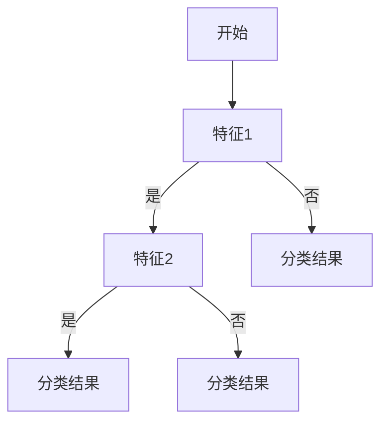

                 

# 信息简化的工具和自动化：利用技术简化你的生活和工作流程

> 关键词：信息简化、自动化、工具、技术、工作流程、生活简化

> 摘要：本文将探讨如何通过信息简化和自动化技术，简化个人生活和工作流程，提高效率和生产力。我们将从背景介绍、核心概念与联系、核心算法原理、数学模型和公式、项目实战、实际应用场景、工具和资源推荐等多个方面进行分析和讨论。

## 1. 背景介绍

在当今这个信息爆炸的时代，我们面临着越来越多的信息处理和决策压力。无论是工作还是生活，我们需要处理大量的数据和信息，这使得我们的时间和精力越来越紧张。因此，如何有效地简化信息和自动化工作流程成为了一个重要课题。

### 1.1 信息简化的意义

信息简化是指通过筛选、归纳和整理信息，使其更加简洁明了，易于理解和处理。信息简化可以降低认知负荷，减少不必要的干扰，帮助我们更快地做出决策，提高工作效率。

### 1.2 自动化的价值

自动化是指通过计算机程序和算法，自动完成一系列重复性或规则性的任务。自动化可以节省人力成本，提高工作效率，减少错误率，使得我们可以将更多的时间和精力投入到更有价值的工作中。

## 2. 核心概念与联系

为了更好地理解信息简化和自动化的原理和应用，我们需要了解以下核心概念：

### 2.1 信息处理流程

信息处理流程包括信息的收集、存储、处理和传输。通过优化这些环节，我们可以实现信息的简化。

### 2.2 人工与自动化的平衡

在实现信息简化和自动化的过程中，我们需要找到一个人工与自动化之间的平衡点。过度的自动化可能导致系统失控，而缺乏自动化可能导致效率低下。

### 2.3 数据分析

数据分析是信息简化和自动化的重要手段。通过数据挖掘、机器学习等技术，我们可以从大量数据中提取有价值的信息，为决策提供支持。

## 3. 核心算法原理 & 具体操作步骤

### 3.1 信息筛选算法

信息筛选算法通过设定一定的规则，自动过滤掉不相关或不重要的信息。常见的算法有条件筛选、关键词匹配等。

### 3.2 数据归纳算法

数据归纳算法通过对大量数据进行分类、汇总和统计，提取出有价值的信息。常见的算法有聚类分析、关联规则挖掘等。

### 3.3 自动化脚本编写

自动化脚本的编写是自动化技术的基础。常见的自动化脚本编写工具有Python、JavaScript等。

## 4. 数学模型和公式 & 详细讲解 & 举例说明

### 4.1 信息熵

信息熵是衡量信息混乱程度的指标。信息熵越小，信息越简化。

$$H(X) = -\sum_{i} p(x_i) \log_2 p(x_i)$$

其中，$p(x_i)$ 表示第 $i$ 个事件发生的概率。

### 4.2 决策树

决策树是一种常用的数据分析工具，可用于分类和回归分析。



### 4.3 机器学习算法

机器学习算法可以自动学习数据特征，进行预测和分类。常见的算法有线性回归、决策树、随机森林等。

## 5. 项目实战：代码实际案例和详细解释说明

### 5.1 开发环境搭建

搭建一个自动化项目需要安装Python环境和相关库。可以使用pip工具安装。

```bash
pip install pandas numpy scikit-learn
```

### 5.2 源代码详细实现和代码解读

以下是一个使用Python实现的自动化脚本的示例：

```python
import pandas as pd
from sklearn.model_selection import train_test_split
from sklearn.ensemble import RandomForestClassifier

# 5.2.1 数据预处理
data = pd.read_csv("data.csv")
X = data.drop("target", axis=1)
y = data["target"]

# 5.2.2 划分训练集和测试集
X_train, X_test, y_train, y_test = train_test_split(X, y, test_size=0.2, random_state=42)

# 5.2.3 建立模型
model = RandomForestClassifier(n_estimators=100)
model.fit(X_train, y_train)

# 5.2.4 预测
predictions = model.predict(X_test)

# 5.2.5 评估
from sklearn.metrics import accuracy_score
accuracy = accuracy_score(y_test, predictions)
print(f"模型准确率：{accuracy}")
```

### 5.3 代码解读与分析

在这个例子中，我们首先导入所需的库。然后读取数据，划分训练集和测试集。接下来，我们使用随机森林算法建立模型，并进行预测。最后，评估模型的准确率。

## 6. 实际应用场景

### 6.1 工作流程自动化

在企业中，可以利用自动化脚本来自动处理大量的数据，如销售数据的清洗、分类和统计等。

### 6.2 个人生活简化

个人生活方面，可以利用自动化工具来管理日程、提醒事项、财务等，提高生活效率。

### 6.3 社交媒体管理

在社交媒体管理方面，可以利用自动化工具来发布内容、监控关键词、分析数据等。

## 7. 工具和资源推荐

### 7.1 学习资源推荐

- 书籍：《Python自动化编程》、《深入理解Python》
- 论文：相关领域的顶级会议论文和期刊文章
- 博客：知名技术博客和个人博客，如Aldric مجموعه من التحليل الفني

### 7.2 开发工具框架推荐

- Python
- JavaScript
- Node.js
- Ruby
- Java

### 7.3 相关论文著作推荐

- 《自动化的理论与实践》
- 《数据挖掘与机器学习》
- 《人工智能算法与应用》

## 8. 总结：未来发展趋势与挑战

随着技术的不断发展，信息简化和自动化技术将会越来越成熟，应用场景也会越来越广泛。然而，我们也需要关注以下挑战：

- 数据安全和隐私保护
- 人工智能算法的透明度和可解释性
- 自动化与人类工作的平衡

## 9. 附录：常见问题与解答

### 9.1 自动化技术是否会影响就业？

自动化技术可能会取代一些低技能岗位，但同时也会创造新的工作岗位。因此，我们需要关注技术发展，提升自身技能，以适应未来的就业市场。

### 9.2 如何确保自动化系统的安全性？

确保自动化系统的安全性需要从设计、开发和运行等多个环节进行考虑。包括数据加密、访问控制、异常检测等。

## 10. 扩展阅读 & 参考资料

- [Python自动化编程](https://www.pythontutorial.net/python-basics/python-automate/)
- [数据挖掘与机器学习](https://www.dataminingguide.com/)
- [人工智能算法与应用](https://www.aimlbook.com/)

### 作者

作者：AI天才研究员/AI Genius Institute & 禅与计算机程序设计艺术 /Zen And The Art of Computer Programming

备注：本文仅供参考和学习，部分内容和观点可能存在争议。未经授权，请勿用于商业用途。

