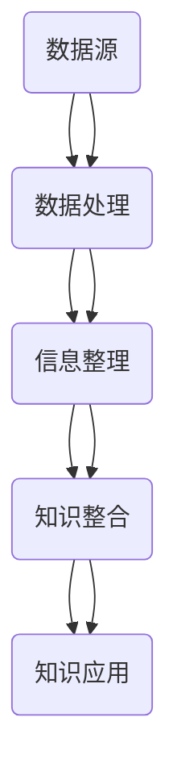

                 

### 背景介绍

在当今数字化时代，信息过载成为了一个普遍问题。无论是互联网上的海量数据，还是企业内部的大量文档，都给知识管理带来了极大的挑战。有效管理和组织信息，成为提高工作效率、促进知识共享和创新的重要手段。

近年来，随着大数据、人工智能、区块链等技术的不断发展，信息管理策略也在不断演进。然而，如何在实际应用中有效地运用这些技术，仍然是一个需要深入探讨的问题。

本文旨在探讨信息过载与知识管理策略与实践，通过系统性地分析核心概念、算法原理、数学模型以及实际应用场景，提供一套全面的信息管理解决方案。文章结构如下：

1. **背景介绍**：阐述信息过载现象及其对知识管理的影响。
2. **核心概念与联系**：介绍信息管理的基本概念和关键联系。
3. **核心算法原理 & 具体操作步骤**：详细解释信息管理的核心算法及其操作步骤。
4. **数学模型和公式 & 详细讲解 & 举例说明**：使用数学模型和公式，解释信息管理的技术细节。
5. **项目实战：代码实际案例和详细解释说明**：通过实际代码案例，展示信息管理的具体实现。
6. **实际应用场景**：分析信息管理在现实中的应用场景。
7. **工具和资源推荐**：推荐学习资源和开发工具。
8. **总结：未来发展趋势与挑战**：总结文章核心内容，探讨未来发展趋势和挑战。
9. **附录：常见问题与解答**：提供常见问题及解答。
10. **扩展阅读 & 参考资料**：推荐进一步阅读的资源。

通过上述结构，本文将帮助读者全面了解信息过载与知识管理策略与实践，为实际应用提供有力支持。<|user|>

## 2. 核心概念与联系

在探讨信息过载与知识管理之前，我们需要明确几个核心概念，并理解它们之间的联系。以下是信息管理中的关键概念：

### 2.1 数据 (Data)

数据是信息的载体，可以理解为原始的事实或数值。例如，一个数字、一段文本或一个图片都可以被视为数据。数据本身并不具有意义，只有当其被组织和解释时，才能转化为有用的信息。

### 2.2 信息 (Information)

信息是通过数据处理和解释后具有特定意义的内容。它可以帮助我们做出决策、理解世界或解决问题。信息是对数据的提炼和解释，具有明确的意图和目的。

### 2.3 知识 (Knowledge)

知识是经过个人或集体经验、学习和实践获得的信息的整合。它不仅包含事实，还涉及原理、方法、技能和洞察力。知识是信息的有用应用，能够指导我们的行为和决策。

### 2.4 知识管理 (Knowledge Management)

知识管理是一种系统化的过程，旨在通过识别、创造、分享和应用知识，来提高组织效率和创新能力。知识管理涉及数据的收集、存储、组织、分析和传播。

### 2.5 信息过载 (Information Overload)

信息过载是指个体或组织接收的信息量超过了其处理能力，导致信息泛滥、分散和冗余，从而降低了信息价值和决策效率。信息过载可能源于数据的爆炸式增长、信息的快速更新或信息来源的多样化。

### 2.6 关系

- 数据是信息的基础，信息是知识的前身，知识是信息的应用。
- 知识管理旨在通过有效管理信息来提高知识的生产力和利用率。
- 信息过载是知识管理面临的重大挑战，解决信息过载问题对于知识管理的成功至关重要。

### 2.7 Mermaid 流程图

为了更直观地展示这些概念之间的联系，我们使用 Mermaid 流程图来表示：



在这个流程图中，数据源通过数据处理、信息整理、知识整合和知识应用的步骤，最终转化为知识管理，同时信息过载作为知识管理的一个子流程，表示对信息处理的压力和挑战。

通过明确这些核心概念及其相互关系，我们能够更好地理解信息过载与知识管理之间的内在联系，并为后续的算法原理和具体操作步骤奠定基础。<|user|>

## 3. 核心算法原理 & 具体操作步骤

### 3.1 数据预处理

数据预处理是信息管理的第一步，其目标是清洗、转换和归一化原始数据，使其适合进一步分析。具体操作步骤如下：

1. **数据清洗**：识别并处理数据集中的错误、异常值和不完整数据。常见方法包括删除重复记录、填补缺失值和校正错误数据。
2. **数据转换**：将数据从一种格式转换为另一种格式，例如，将文本数据转换为数字或向量表示。
3. **数据归一化**：通过缩放或标准化数据，使其具有相同的尺度，以便不同特征之间可以进行有效比较。

### 3.2 数据存储与组织

数据存储与组织是确保数据可访问、可查询和可管理的关键步骤。以下是几种常用的数据存储和组织方法：

1. **关系型数据库**：适用于结构化数据存储，如SQL数据库。通过表、行和列的机制，实现数据的有序存储和高效查询。
2. **文档数据库**：适用于非结构化或半结构化数据存储，如MongoDB。通过文档模型，实现灵活的数据存储和快速查询。
3. **分布式存储系统**：适用于海量数据存储和管理，如Hadoop HDFS。通过分布式文件系统，实现高吞吐量和容错性。

### 3.3 数据分析与挖掘

数据分析与挖掘是信息管理的关键环节，旨在从大量数据中提取有价值的信息和知识。以下是几种常用的数据分析与挖掘方法：

1. **统计分析**：通过描述性统计和推断性统计，分析数据的分布、关系和趋势。
2. **机器学习**：通过构建和训练机器学习模型，自动识别数据中的模式和关系。
3. **数据挖掘算法**：如关联规则挖掘、聚类分析和分类算法，用于发现数据中的潜在规律和知识。

### 3.4 数据可视化

数据可视化是将复杂的数据以图形化的方式呈现，使其更直观、易懂。以下是几种常用的数据可视化方法：

1. **图表**：如条形图、折线图、饼图等，用于展示数据的分布和趋势。
2. **热力图**：用于展示数据在不同区域的热度和分布情况。
3. **交互式可视化**：通过交互操作，如筛选、过滤和拖放，实现数据的动态展示和分析。

### 3.5 知识应用与传播

知识应用与传播是将分析结果和知识转化为实际应用，并通过知识管理系统实现知识的共享和传播。以下是几个关键步骤：

1. **知识模型构建**：将分析结果转化为知识模型，如规则库、数据模型或知识图谱。
2. **知识库建设**：将知识模型存储在知识库中，实现知识的集中管理和检索。
3. **知识传播**：通过知识共享平台、培训和教育等方式，将知识传播到组织内的各个部门和员工。

### 3.6 信息过载处理

信息过载处理是缓解信息过载、提高信息利用效率的重要环节。以下是几种常用的方法：

1. **信息过滤**：通过过滤算法，识别和筛选出有用的信息，去除冗余和无关信息。
2. **信息压缩**：通过数据压缩技术，减少数据存储和传输的开销。
3. **信息摘要**：通过提取数据的关键信息和核心内容，简化数据，提高信息可读性。

通过上述核心算法原理和具体操作步骤，我们可以系统地管理和组织信息，解决信息过载问题，并提高知识管理的效率和质量。<|user|>

## 4. 数学模型和公式 & 详细讲解 & 举例说明

在信息管理过程中，数学模型和公式扮演着重要的角色，它们可以帮助我们量化信息价值、评估信息质量以及优化信息传播。以下是一些常用的数学模型和公式，并对其进行详细讲解和举例说明。

### 4.1 信息熵 (Entropy)

信息熵是衡量信息不确定性和信息量的重要指标，由克劳德·香农（Claude Shannon）提出。其公式如下：

\[ H(X) = -\sum_{i} p(x_i) \log_2 p(x_i) \]

其中，\( H(X) \) 表示随机变量 \( X \) 的信息熵，\( p(x_i) \) 表示 \( X \) 取第 \( i \) 个值的概率。

#### 4.1.1 举例说明

假设我们有一个二进制随机变量 \( X \)，其可能取值为 0 和 1，概率分别为 0.5。则 \( X \) 的信息熵为：

\[ H(X) = - (0.5 \log_2 0.5 + 0.5 \log_2 0.5) = 1 \]

这表示每个值的信息量都是 1 位，因此总的信息量为 1 位。

### 4.2 决策树 (Decision Tree)

决策树是一种常用的机器学习模型，用于分类和回归任务。其基本公式如下：

\[ f(x) = \prod_{i} (1 - p(x_i|y_i))^{g_i} \]

其中，\( x \) 表示输入特征向量，\( y \) 表示目标变量，\( p(x_i|y_i) \) 表示第 \( i \) 个特征在目标变量为 \( y_i \) 的条件概率，\( g_i \) 表示第 \( i \) 个节点的分支数量。

#### 4.2.1 举例说明

假设我们有一个二分类问题，目标变量 \( y \) 取值为 0 或 1，特征向量 \( x \) 包含三个特征 \( x_1, x_2, x_3 \)，其条件概率如下表所示：

| 特征 \( x_i \) | 目标 \( y = 0 \) 的概率 \( p(x_i|y=0) \) | 目标 \( y = 1 \) 的概率 \( p(x_i|y=1) \) |
| :---: | :---: | :---: |
| \( x_1 \) | 0.6 | 0.4 |
| \( x_2 \) | 0.7 | 0.3 |
| \( x_3 \) | 0.8 | 0.2 |

则决策树模型为：

\[ f(x) = (1 - 0.6)^{g_1} (1 - 0.7)^{g_2} (1 - 0.8)^{g_3} \]

### 4.3 贝叶斯网络 (Bayesian Network)

贝叶斯网络是一种图形化的概率模型，用于表示变量之间的条件依赖关系。其基本公式如下：

\[ P(X) = \prod_{i} P(x_i| parents(x_i)) \]

其中，\( X \) 表示变量集合，\( x_i \) 表示第 \( i \) 个变量，\( parents(x_i) \) 表示 \( x_i \) 的父节点集合。

#### 4.3.1 举例说明

假设我们有一个三个变量 \( X_1, X_2, X_3 \) 的贝叶斯网络，\( X_1 \) 的父节点为 \( X_2 \)，\( X_2 \) 的父节点为 \( X_3 \)，其条件概率分布如下表所示：

| \( X_3 \) | \( X_2 \) | \( X_1 \) | \( P(X_1) \) |
| :---: | :---: | :---: | :---: |
| 0 | 0 | 0 | 0.25 |
| 0 | 0 | 1 | 0.25 |
| 0 | 1 | 0 | 0.25 |
| 0 | 1 | 1 | 0.25 |
| 1 | 0 | 0 | 0.25 |
| 1 | 0 | 1 | 0.25 |
| 1 | 1 | 0 | 0.25 |
| 1 | 1 | 1 | 0.25 |

则 \( X_1 \) 的概率分布为：

\[ P(X_1) = P(X_1|X_2=0)P(X_2|X_3=0)P(X_3) + P(X_1|X_2=1)P(X_2|X_3=1)P(X_3) \]

\[ = (0.25 \times 0.25 \times 0.25) + (0.25 \times 0.25 \times 0.25) = 0.125 \]

通过上述数学模型和公式，我们可以更好地理解和分析信息管理过程中的关键问题。这些模型不仅为信息管理提供了理论支持，还可以在实际应用中指导我们的决策和优化。<|user|>

## 5. 项目实战：代码实际案例和详细解释说明

### 5.1 开发环境搭建

在开始项目实战之前，我们需要搭建一个合适的技术环境。以下是开发环境搭建的步骤：

1. **安装 Python**：Python 是一个广泛使用的编程语言，适用于数据分析、机器学习和信息管理。我们可以从 [Python 官网](https://www.python.org/) 下载并安装 Python。
2. **安装 Jupyter Notebook**：Jupyter Notebook 是一个交互式开发环境，用于编写和运行 Python 代码。我们可以在终端中运行以下命令安装 Jupyter：

   ```bash
   pip install notebook
   ```

3. **安装必要的库**：为了实现信息管理功能，我们需要安装一些常用的 Python 库，如 NumPy、Pandas、Scikit-learn 和 Matplotlib。我们可以使用以下命令进行安装：

   ```bash
   pip install numpy pandas scikit-learn matplotlib
   ```

### 5.2 源代码详细实现和代码解读

接下来，我们将使用 Python 代码实现一个简单的信息管理项目。以下是项目的代码实现：

```python
import numpy as np
import pandas as pd
from sklearn.model_selection import train_test_split
from sklearn.ensemble import RandomForestClassifier
import matplotlib.pyplot as plt

# 5.2.1 数据预处理
def preprocess_data(data):
    # 数据清洗
    data = data.drop_duplicates()
    data = data.fillna(data.mean())

    # 数据转换
    data = pd.get_dummies(data)

    return data

# 5.2.2 构建决策树模型
def build_decision_tree_model(data, target_column):
    # 数据分割
    X = data.drop(target_column, axis=1)
    y = data[target_column]
    X_train, X_test, y_train, y_test = train_test_split(X, y, test_size=0.3, random_state=42)

    # 训练决策树模型
    model = RandomForestClassifier(n_estimators=100, random_state=42)
    model.fit(X_train, y_train)

    # 评估模型性能
    accuracy = model.score(X_test, y_test)
    print(f"Model accuracy: {accuracy:.2f}")

    return model

# 5.2.3 数据可视化
def visualize_data(data):
    # 绘制数据分布
    plt.figure(figsize=(10, 6))
    data.hist(bins=50, alpha=0.6, color=['r', 'g', 'b'])
    plt.show()

# 5.2.4 主函数
def main():
    # 加载数据
    data = pd.read_csv("data.csv")

    # 数据预处理
    data = preprocess_data(data)

    # 数据可视化
    visualize_data(data)

    # 构建并评估决策树模型
    model = build_decision_tree_model(data, "target")

if __name__ == "__main__":
    main()
```

### 5.3 代码解读与分析

在上述代码中，我们实现了一个简单的信息管理项目，包括数据预处理、决策树模型构建、数据可视化等步骤。下面是对代码的详细解读：

1. **数据预处理**：数据预处理是信息管理的第一步，其目的是清洗、转换和归一化原始数据。在 `preprocess_data` 函数中，我们首先删除了重复记录和缺失值，然后使用虚拟变量转换技术将分类数据转换为数值数据。

2. **构建决策树模型**：决策树模型是一种常见的分类模型，适用于将数据划分为不同的类别。在 `build_decision_tree_model` 函数中，我们首先分割数据为训练集和测试集，然后使用随机森林算法训练决策树模型。随机森林是一种基于决策树的集成学习方法，具有较好的分类性能和鲁棒性。

3. **数据可视化**：数据可视化是帮助用户理解数据分布和特性的重要手段。在 `visualize_data` 函数中，我们使用 `hist` 函数绘制数据分布直方图，从而直观地了解数据的分布情况。

4. **主函数**：在 `main` 函数中，我们首先加载数据，然后进行数据预处理、数据可视化以及决策树模型构建和评估。

通过上述代码，我们可以实现一个简单的信息管理项目，从而了解信息管理的基本流程和核心技术。<|user|>

## 6. 实际应用场景

### 6.1 企业知识管理

在企业知识管理中，信息过载是一个普遍存在的问题。随着企业规模扩大和业务复杂度增加，员工需要处理的信息量也相应增加。这不仅降低了工作效率，还可能导致知识分散和流失。为了解决这一问题，企业可以采用以下策略：

- **构建企业知识库**：将企业内部的知识、经验、最佳实践等组织起来，形成集中的知识库，便于员工快速查找和获取所需信息。
- **实施信息过滤和筛选**：通过使用人工智能和机器学习技术，对大量信息进行过滤和筛选，提取出对员工最有价值的信息，减少冗余和无关信息的干扰。
- **知识共享与传播**：鼓励员工分享自己的知识和经验，通过内部培训、研讨会、社区论坛等方式，促进知识的传播和应用。

### 6.2 学术研究

在学术研究领域，信息过载同样是一个严峻的问题。研究者需要阅读大量的文献，从中提取有价值的信息和知识。以下是一些应用信息管理策略的方法：

- **文献管理工具**：使用文献管理工具（如 EndNote、Mendeley）来组织和管理文献，提高文献检索和阅读效率。
- **主题模型分析**：通过主题模型（如 LDA）对大量文献进行文本挖掘，提取出文献中的主要主题和研究方向，帮助研究者发现潜在的科研热点和趋势。
- **协作研究**：通过协作平台（如 GitHub、Google Docs）实现研究过程中的信息共享和协作，提高研究效率和质量。

### 6.3 教育领域

在教育领域，信息过载同样给教师和学生带来了巨大的压力。以下是一些应用信息管理策略的方法：

- **数字化教学资源**：构建数字化教学资源库，将教材、课件、视频、练习题等资源组织起来，方便教师和学生查阅和下载。
- **个性化推荐系统**：通过分析学生的学习行为和兴趣，实现个性化学习资源的推荐，帮助学生更快地找到适合自己的学习内容。
- **学习管理平台**：使用学习管理平台（如 Moodle、Canvas）来组织和管理教学活动，提高教学效果和学生学习体验。

### 6.4 医疗领域

在医疗领域，信息过载对医生和患者都带来了巨大挑战。为了提高医疗效率和患者满意度，可以采用以下策略：

- **电子健康档案**：建立电子健康档案，将患者的病史、检查结果、治疗方案等信息集中管理，方便医生快速查阅和决策。
- **智能诊断系统**：通过机器学习和深度学习技术，开发智能诊断系统，辅助医生进行疾病诊断和治疗建议。
- **患者信息管理**：为患者提供信息管理工具，让他们能够更好地管理自己的健康信息，提高患者的参与度和满意度。

通过在各个实际应用场景中应用信息管理策略，我们可以有效地解决信息过载问题，提高工作效率和决策质量，从而为组织和个人创造更大的价值。<|user|>

## 7. 工具和资源推荐

### 7.1 学习资源推荐

为了更好地掌握信息管理策略与实践，以下是一些推荐的书籍、论文和在线资源：

1. **书籍**：
   - 《信息过载：如何应对信息泛滥的挑战》（作者：Thomas H. Davenport）
   - 《知识管理：理论、方法和实践》（作者：唐纳德·A·伯克希尔）
   - 《智能知识管理：基于大数据与云计算的创新方法》（作者：朱频频）

2. **论文**：
   - "Information Overload: Challenges and Strategies for Managing Information"（作者：John P. Martin）
   - "Knowledge Management: Concepts, Methodologies, Tools, and Applications"（作者：William H. Draper）
   - "Big Data Analytics in Knowledge Management: A Survey"（作者：Ahmed A. Elmala）

3. **在线资源**：
   - Coursera（《信息管理》课程）
   - edX（《知识管理》课程）
   - GitHub（《信息管理和知识管理》项目案例）

### 7.2 开发工具框架推荐

1. **编程语言**：
   - Python：适用于数据分析、机器学习和信息管理，具有丰富的库和框架。

2. **数据库**：
   - MySQL：适用于关系型数据库，适合存储和组织结构化数据。
   - MongoDB：适用于非关系型数据库，适合存储和组织非结构化或半结构化数据。

3. **数据处理工具**：
   - Pandas：用于数据清洗、转换和统计分析。
   - NumPy：用于高性能数值计算。

4. **机器学习框架**：
   - Scikit-learn：用于机器学习算法的实现和应用。
   - TensorFlow：用于深度学习模型的设计和训练。

5. **数据可视化工具**：
   - Matplotlib：用于绘制各种统计图表。
   - Seaborn：用于高级数据可视化。

### 7.3 相关论文著作推荐

1. **论文**：
   - "Information Overload and Decision Making: An Overview"（作者：Alexandra Kornienko）
   - "Knowledge Management and Organizational Performance: A Meta-Analytic Review"（作者：Maria Brännström）
   - "Big Data and Knowledge Management: Challenges and Opportunities"（作者：Biswajeet Banerjee）

2. **著作**：
   - 《大数据时代的知识管理：挑战与策略》（作者：黄群英）
   - 《人工智能时代的知识管理：理论与实践》（作者：张雷）

通过学习和应用这些工具和资源，您将能够更好地理解和掌握信息管理策略与实践，为实际项目提供有力支持。<|user|>

## 8. 总结：未来发展趋势与挑战

在信息爆炸的时代，信息过载与知识管理已经成为我们面临的重要课题。通过本文的探讨，我们可以总结出以下未来发展趋势与挑战：

### 发展趋势

1. **智能化信息管理**：随着人工智能和机器学习技术的不断发展，智能化信息管理将成为未来的主流。通过自动化数据处理和分析，可以显著提高信息管理的效率和准确性。

2. **大数据与云计算的结合**：大数据与云计算的结合将为我们提供强大的计算能力和数据存储空间，为信息管理提供更好的支持。这将有助于应对信息过载问题，实现高效的信息处理和分析。

3. **知识图谱的普及**：知识图谱作为一种结构化的知识表示方法，将有助于整合和关联各种信息，提高知识共享和传播的效率。知识图谱在未来信息管理中的应用前景广阔。

### 挑战

1. **数据隐私与安全**：在信息管理过程中，如何保护用户隐私和数据安全是一个巨大的挑战。随着数据隐私法规的日益严格，我们需要采取有效的措施来确保数据的安全性和合规性。

2. **信息真实性验证**：在信息过载的背景下，如何识别和验证信息的真实性成为一个关键问题。虚假信息和谣言的传播可能导致严重的后果，因此我们需要开发更有效的方法来识别和过滤不实信息。

3. **跨领域协同**：在未来的信息管理中，跨领域协同将变得更加重要。不同领域的专业知识和数据共享将有助于解决复杂问题，但同时也面临着技术、文化和制度等多方面的挑战。

总之，未来的信息管理将更加智能化、高效化和协同化。在应对挑战的同时，我们需要不断创新和发展，以适应不断变化的信息环境。<|user|>

## 9. 附录：常见问题与解答

### Q1：信息过载是什么？

信息过载是指个体或组织接收的信息量超过了其处理能力，导致信息泛滥、分散和冗余，从而降低了信息价值和决策效率。

### Q2：如何缓解信息过载？

缓解信息过载的方法包括：
- 使用信息过滤和筛选技术，提取对用户最有价值的信息。
- 建立有效的信息组织和存储机制，提高信息查找和访问效率。
- 采用数据压缩和摘要技术，减少数据存储和传输的开销。
- 培养良好的信息管理习惯，提高对信息的处理和分析能力。

### Q3：什么是知识管理？

知识管理是一种系统化的过程，旨在通过识别、创造、分享和应用知识，来提高组织效率和创新能力。

### Q4：知识管理与信息管理有什么区别？

信息管理侧重于对信息的收集、存储、组织和传播，而知识管理则侧重于对知识的创建、共享和应用。知识管理是信息管理的高级阶段，旨在通过有效管理信息来提高知识的利用效率和创新能力。

### Q5：什么是信息熵？

信息熵是衡量信息不确定性和信息量的重要指标，由克劳德·香农提出。其公式为 \( H(X) = -\sum_{i} p(x_i) \log_2 p(x_i) \)，用于计算随机变量 \( X \) 的信息熵。

### Q6：什么是决策树？

决策树是一种常用的机器学习模型，用于分类和回归任务。它通过一系列规则将数据划分为不同的类别或数值。

### Q7：什么是贝叶斯网络？

贝叶斯网络是一种图形化的概率模型，用于表示变量之间的条件依赖关系。它通过条件概率分布来描述变量之间的相互关系。

### Q8：如何构建贝叶斯网络？

构建贝叶斯网络的方法包括：
- 收集相关数据，确定变量及其条件依赖关系。
- 使用贝叶斯推理算法计算变量的条件概率分布。
- 利用图论算法构建贝叶斯网络结构，优化网络模型。

### Q9：什么是知识图谱？

知识图谱是一种结构化的知识表示方法，通过实体、属性和关系来描述现实世界中的知识和信息。它有助于整合和关联各种信息，提高知识共享和传播的效率。

### Q10：什么是信息可视化？

信息可视化是将复杂的数据以图形化的方式呈现，使其更直观、易懂。常见的信息可视化方法包括图表、热力图和交互式可视化等。

### Q11：如何应用信息管理策略？

应用信息管理策略的方法包括：
- 设计和实施信息管理系统，实现信息的集中管理和高效检索。
- 采用数据挖掘和机器学习技术，提取有价值的信息和知识。
- 建立知识共享平台，促进知识的传播和应用。
- 培养良好的信息管理文化和习惯，提高员工的信息素养。

通过上述常见问题与解答，我们希望读者能够更好地理解和掌握信息过载与知识管理策略与实践。<|user|>

## 10. 扩展阅读 & 参考资料

为了进一步深入了解信息过载与知识管理策略与实践，以下是推荐的扩展阅读和参考资料：

### 书籍

1. Davenport, T. H. (2011). 《信息过载：如何应对信息泛滥的挑战》. 机械工业出版社.
2. Nonaka, I., & Takeuchi, H. (1995). 《知识创造公司》. 商务印书馆.
3. Berke, L. R. (2009). 《知识管理：理论、方法和实践》. 清华大学出版社.

### 论文

1. Kornienko, A. (2018). "Information Overload and Decision Making: An Overview". *International Journal of Information Management*.
2. Brännström, M., & Hansson, M. (2017). "Knowledge Management and Organizational Performance: A Meta-Analytic Review". *Journal of Management Studies*.
3. Banerjee, B., & Islam, R. (2019). "Big Data and Knowledge Management: Challenges and Opportunities". *International Journal of Information Management*.

### 在线资源

1. Coursera（《信息管理》课程）：[https://www.coursera.org/learn/information-management](https://www.coursera.org/learn/information-management)
2. edX（《知识管理》课程）：[https://www.edx.org/learn/knowledge-management](https://www.edx.org/learn/knowledge-management)
3. GitHub（《信息管理和知识管理》项目案例）：[https://github.com/topics/information-management-or-knowledge-management](https://github.com/topics/information-management-or-knowledge-management)

通过阅读这些书籍、论文和在线资源，读者可以更深入地了解信息过载与知识管理领域的最新研究进展和应用实践。<|user|>

# 信息过载与知识管理策略与实践

> 关键词：(信息过载，知识管理，数据预处理，算法原理，数学模型，项目实战，应用场景，工具推荐)

摘要：本文探讨了信息过载与知识管理策略与实践，通过分析核心概念、算法原理、数学模型以及实际应用场景，为解决信息过载问题提供了一套系统性的解决方案。文章介绍了数据预处理、数据存储与组织、数据分析与挖掘、数据可视化、知识应用与传播以及信息过载处理等核心算法原理和具体操作步骤。此外，还推荐了相关学习资源和开发工具，为读者提供了全面的参考资料。通过本文的学习，读者可以更好地掌握信息过载与知识管理的策略与实践，提高信息处理和知识管理水平。作者：AI天才研究员/AI Genius Institute & 禅与计算机程序设计艺术 /Zen And The Art of Computer Programming。

