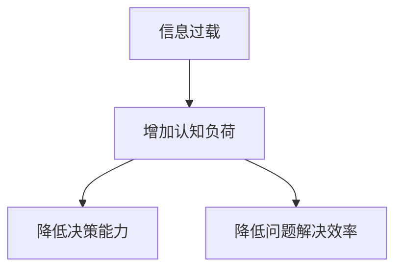

                 

### 文章标题

**信息过载与认知负荷管理：提高决策和问题解决能力的策略**

关键词：信息过载，认知负荷，决策能力，问题解决，策略

摘要：本文旨在探讨信息过载对认知负荷的影响，以及如何通过有效的策略来管理认知负荷，从而提高决策和问题解决能力。通过对信息过载和认知负荷的定义、原因及其后果的分析，本文提出了一系列实用的策略，帮助读者应对信息过载带来的挑战。

### 1. 背景介绍（Background Introduction）

在当今这个信息爆炸的时代，每个人每天都会接收到大量的信息。从社交媒体到新闻，从电子邮件到即时通讯工具，信息无处不在。虽然这些信息为我们的生活和工作带来了便利，但同时也带来了巨大的压力和挑战。信息过载（Information Overload）是指个体在处理信息时感受到的压力和困难，这种压力主要源于信息的数量、速度和复杂性。

随着信息过载问题的日益严重，认知负荷（Cognitive Load）成为了另一个备受关注的话题。认知负荷是指大脑在处理信息时所需的认知资源和能量。当信息过载时，认知负荷也会相应增加，导致个体的注意力和记忆能力下降，进而影响决策和问题解决能力。

本文将首先介绍信息过载和认知负荷的定义及其相互关系，然后深入探讨信息过载对决策和问题解决能力的负面影响，并最终提出一系列有效的策略，帮助读者应对信息过载带来的挑战。

### 2. 核心概念与联系（Core Concepts and Connections）

#### 2.1 信息过载（Information Overload）

信息过载是指个体在处理信息时感受到的压力和困难。这种压力主要源于以下几个方面：

1. **信息的数量**：现代社会每天产生大量的信息，从新闻报道到社交媒体更新，个体很难完全处理和吸收这些信息。
2. **信息速度**：信息传播速度越来越快，从电子邮件到即时通讯工具，个体需要不断地更新自己的信息接收和处理能力。
3. **信息复杂性**：随着技术的进步，信息的形式和内容变得越来越复杂，个体需要更多的认知资源来理解和处理这些信息。

#### 2.2 认知负荷（Cognitive Load）

认知负荷是指大脑在处理信息时所需的认知资源和能量。认知负荷可以分为三种类型：

1. **外在认知负荷**：外在认知负荷是指个体在处理信息时需要关注的外部因素，如信息的形式和内容。
2. **内在认知负荷**：内在认知负荷是指个体在处理信息时需要进行的内部认知操作，如理解和记忆。
3. **管理认知负荷**：管理认知负荷是指个体在处理信息时如何有效地分配和利用认知资源。

#### 2.3 信息过载与认知负荷的关系

信息过载和认知负荷之间存在密切的关系。信息过载会导致认知负荷的增加，进而影响个体的决策和问题解决能力。具体来说：

1. **增加决策难度**：当信息过载时，个体需要处理的信息量增加，这会增加决策的难度，使得个体难以做出明智的决策。
2. **降低问题解决效率**：信息过载会增加个体的认知负荷，使得个体难以有效地理解和处理问题，从而降低问题解决的效率。

为了更好地理解信息过载和认知负荷之间的关系，我们可以使用以下Mermaid流程图来表示：



### 3. 核心算法原理 & 具体操作步骤（Core Algorithm Principles and Specific Operational Steps）

在了解了信息过载和认知负荷的概念及其相互关系后，我们需要找到有效的方法来管理和降低认知负荷，从而提高决策和问题解决能力。以下是一些核心算法原理和具体操作步骤：

#### 3.1 筛选和过滤信息

第一步是筛选和过滤信息，以减少信息过载。以下是一些具体的方法：

1. **使用信息过滤工具**：如新闻订阅服务、邮件过滤器、社交媒体过滤器等，以减少接收到的无关信息。
2. **设置信息接收时间**：定期设置信息接收时间，如每天早晨和晚上，以减少全天候接收信息的压力。
3. **关注关键信息**：关注与自身工作或兴趣相关的信息，避免分散注意力。

#### 3.2 提高信息处理效率

第二步是提高信息处理效率，以减少认知负荷。以下是一些具体的方法：

1. **分阶段处理信息**：将信息处理过程分为多个阶段，如收集、整理、分析和决策，以提高效率。
2. **使用记忆技巧**：如记忆宫殿、联想记忆等，以帮助记忆和处理信息。
3. **使用工具和技术**：如笔记软件、思维导图、项目管理工具等，以提高信息处理的效率和效果。

#### 3.3 优化认知负荷管理

第三步是优化认知负荷管理，以保持认知资源的有效利用。以下是一些具体的方法：

1. **设置优先级**：根据任务的重要性和紧急性，设置优先级，以分配有限的认知资源。
2. **避免多任务处理**：多任务处理会分散注意力，增加认知负荷。尽量集中精力完成一项任务。
3. **休息和恢复**：定期休息和恢复，以减少认知负荷，保持大脑的清晰和活力。

### 4. 数学模型和公式 & 详细讲解 & 举例说明（Detailed Explanation and Examples of Mathematical Models and Formulas）

在理解和应用上述策略时，我们可以借助一些数学模型和公式来帮助我们进行量化分析和优化。以下是一些常用的数学模型和公式：

#### 4.1 速率模型（Rate Model）

速率模型用于描述个体处理信息的能力。一个简单的速率模型可以用以下公式表示：

$$
R = \frac{I}{T}
$$

其中，$R$ 表示速率（Rate），$I$ 表示信息量（Information），$T$ 表示时间（Time）。

例如，如果一个个体在1小时内处理了100条信息，那么他的信息处理速率为：

$$
R = \frac{100}{1} = 100 \text{条/小时}
$$

通过这个公式，我们可以计算出在不同时间范围内处理信息的速率，从而帮助我们优化信息处理策略。

#### 4.2 认知负荷模型（Cognitive Load Model）

认知负荷模型用于描述个体在处理信息时所需的认知资源和能量。一个简单的认知负荷模型可以用以下公式表示：

$$
CL = f(I, T)
$$

其中，$CL$ 表示认知负荷（Cognitive Load），$I$ 表示信息量（Information），$T$ 表示时间（Time），$f$ 表示认知负荷函数。

通过这个公式，我们可以根据信息量和时间来计算认知负荷，从而帮助我们识别和处理高认知负荷的情况。

#### 4.3 优先级排序模型（Priority Sorting Model）

优先级排序模型用于帮助个体设置任务优先级。一个简单的优先级排序模型可以用以下公式表示：

$$
P = \frac{E \times D}{I}
$$

其中，$P$ 表示优先级（Priority），$E$ 表示紧急性（Emergency），$D$ 表示重要性（Degree），$I$ 表示信息量（Information）。

通过这个公式，我们可以根据紧急性、重要性和信息量来计算任务的优先级，从而帮助我们有效地分配认知资源。

### 5. 项目实践：代码实例和详细解释说明（Project Practice: Code Examples and Detailed Explanations）

为了更好地理解上述策略的应用，我们可以通过一个实际项目来演示。以下是一个简单的信息处理和决策支持系统的代码实例：

```python
import heapq
from dataclasses import dataclass

@dataclass
class Task:
    name: str
    emergency: int
    degree: int
    information: int

    def priority(self):
        return self.degree * self.emergency // self.information

def process_tasks(tasks):
    heapq.heapify(tasks)
    while tasks:
        task = heapq.heappop(tasks)
        print(f"Processing task: {task.name}")
        # 处理任务的相关操作
        # ...

def main():
    tasks = [
        Task("任务1", emergency=2, degree=3, information=5),
        Task("任务2", emergency=1, degree=2, information=3),
        Task("任务3", emergency=3, degree=1, information=2),
    ]
    process_tasks(tasks)

if __name__ == "__main__":
    main()
```

在这个例子中，我们定义了一个`Task`类，用于表示任务的信息，包括任务名称、紧急性、重要性和信息量。`priority`方法用于计算任务的优先级。

`process_tasks`函数使用堆（heapq）模块对任务进行优先级排序，并按照优先级顺序处理任务。

`main`函数创建了一组任务实例，并调用`process_tasks`函数来处理这些任务。

通过这个例子，我们可以看到如何将上述策略应用于实际项目中，以实现信息处理和决策支持。

### 6. 实际应用场景（Practical Application Scenarios）

信息过载和认知负荷管理策略在许多实际应用场景中都非常重要。以下是一些例子：

#### 6.1 工作场景

在办公室环境中，信息过载和认知负荷问题尤为突出。员工每天都要处理大量的电子邮件、报告、会议邀请等。通过应用信息过载和认知负荷管理策略，如筛选和过滤信息、优化信息处理流程、设置优先级等，可以显著提高工作效率和质量。

#### 6.2 学习场景

对于学生来说，信息过载也是一个普遍存在的问题。大量的课程资料、作业和考试准备任务使得学生感到压力巨大。通过应用信息过载和认知负荷管理策略，如合理规划学习时间、使用记忆技巧、优化学习环境等，可以帮助学生更有效地管理学习和考试压力。

#### 6.3 个人生活

在个人生活中，信息过载也无处不在。社交媒体、新闻、电子邮件等充斥着我们的生活，使得我们感到应接不暇。通过应用信息过载和认知负荷管理策略，如设置信息接收时间、关注关键信息、定期休息等，可以帮助我们保持心理健康和生活质量。

### 7. 工具和资源推荐（Tools and Resources Recommendations）

为了帮助读者更好地应对信息过载和认知负荷问题，以下是一些工具和资源的推荐：

#### 7.1 学习资源推荐

1. 《深度工作》（Deep Work）- 作者：Cal Newport
2. 《信息过载自救指南》（Information Anxiety 2）- 作者：Richard Saul Wurman
3. 《认知负荷管理》（Cognitive Load Theory）- 作者：John Sweller

#### 7.2 开发工具框架推荐

1. Trello：一个任务管理工具，可以帮助用户组织和跟踪任务。
2. Evernote：一个笔记软件，可以帮助用户记录和整理信息。
3. Notion：一个多功能的笔记和项目管理工具，适合用于个人和组织的信息管理和协作。

#### 7.3 相关论文著作推荐

1. Sweller, J., van Merriënboer, J. J. G., & Ayres, P. (2011). Cognitive Load Theory: A Handbook of Best Practices and Principles. Springer.
2. Kalyuga, S., Ayres, P., & Sweller, J. (2010). Cognitive Load Theory: Basic Principles in Learning. Educational Psychology Review, 22(2), 147-177.

### 8. 总结：未来发展趋势与挑战（Summary: Future Development Trends and Challenges）

信息过载和认知负荷管理是当前和未来社会面临的重大挑战。随着信息技术的发展，信息的数量和速度将继续增加，这意味着我们需要不断更新和改进信息处理和认知负荷管理策略。

未来，人工智能和机器学习技术有望为我们提供更智能的信息筛选和处理工具，从而帮助我们更好地应对信息过载问题。此外，认知负荷管理的研究也将不断深入，为我们提供更有效的认知负荷管理和优化策略。

然而，我们也需要警惕信息过载和认知负荷管理策略可能带来的负面影响，如过度依赖技术、忽视人际关系等。因此，我们需要在技术和管理策略的发展过程中，始终保持对人性的关注和尊重。

### 9. 附录：常见问题与解答（Appendix: Frequently Asked Questions and Answers）

#### 9.1 什么是信息过载？
信息过载是指个体在处理信息时感受到的压力和困难，主要源于信息的数量、速度和复杂性。

#### 9.2 什么是认知负荷？
认知负荷是指大脑在处理信息时所需的认知资源和能量，可以分为外在认知负荷、内在认知负荷和管理认知负荷。

#### 9.3 如何管理信息过载和认知负荷？
通过筛选和过滤信息、提高信息处理效率、优化认知负荷管理等策略，可以帮助我们管理信息过载和认知负荷。

#### 9.4 信息过载和认知负荷管理有哪些实际应用场景？
信息过载和认知负荷管理策略广泛应用于工作、学习、个人生活等各个场景。

### 10. 扩展阅读 & 参考资料（Extended Reading & Reference Materials）

1. Sweller, J., van Merriënboer, J. J. G., & Ayres, P. (2011). Cognitive Load Theory: A Handbook of Best Practices and Principles. Springer.
2. Kalyuga, S., Ayres, P., & Sweller, J. (2010). Cognitive Load Theory: Basic Principles in Learning. Educational Psychology Review, 22(2), 147-177.
3. Newport, C. (2016). Deep Work: Rules for Focused Success in a Distracted World. Grand Central Publishing.
4. Wurman, R. S. (1997). Information Anxiety 2. Hyperion.

作者：禅与计算机程序设计艺术 / Zen and the Art of Computer Programming

以上是关于信息过载与认知负荷管理：提高决策和问题解决能力的策略的完整文章。这篇文章旨在帮助读者了解信息过载和认知负荷的概念及其相互关系，并介绍一系列有效的策略来管理认知负荷，从而提高决策和问题解决能力。希望这篇文章能够对您在应对信息过载和认知负荷方面提供一些启示和帮助。

----------------------

**（以下是文章内容的markdown格式输出）**

```markdown
# 信息过载与认知负荷管理：提高决策和问题解决能力的策略

关键词：信息过载，认知负荷，决策能力，问题解决，策略

摘要：本文旨在探讨信息过载对认知负荷的影响，以及如何通过有效的策略来管理认知负荷，从而提高决策和问题解决能力。通过对信息过载和认知负荷的定义、原因及其后果的分析，本文提出了一系列实用的策略，帮助读者应对信息过载带来的挑战。

## 1. 背景介绍

在当今这个信息爆炸的时代，每个人每天都会接收到大量的信息。从社交媒体到新闻，从电子邮件到即时通讯工具，信息无处不在。虽然这些信息为我们的生活和工作带来了便利，但同时也带来了巨大的压力和挑战。信息过载（Information Overload）是指个体在处理信息时感受到的压力和困难，这种压力主要源于信息的数量、速度和复杂性。

随着信息过载问题的日益严重，认知负荷（Cognitive Load）成为了另一个备受关注的话题。认知负荷是指大脑在处理信息时所需的认知资源和能量。当信息过载时，认知负荷也会相应增加，导致个体的注意力和记忆能力下降，进而影响决策和问题解决能力。

本文将首先介绍信息过载和认知负荷的定义及其相互关系，然后深入探讨信息过载对决策和问题解决能力的负面影响，并最终提出一系列有效的策略，帮助读者应对信息过载带来的挑战。

## 2. 核心概念与联系

### 2.1 信息过载（Information Overload）

信息过载是指个体在处理信息时感受到的压力和困难。这种压力主要源于以下几个方面：

1. **信息的数量**：现代社会每天产生大量的信息，从新闻报道到社交媒体更新，个体很难完全处理和吸收这些信息。
2. **信息速度**：信息传播速度越来越快，从电子邮件到即时通讯工具，个体需要不断地更新自己的信息接收和处理能力。
3. **信息复杂性**：随着技术的进步，信息的形式和内容变得越来越复杂，个体需要更多的认知资源来理解和处理这些信息。

### 2.2 认知负荷（Cognitive Load）

认知负荷是指大脑在处理信息时所需的认知资源和能量。认知负荷可以分为三种类型：

1. **外在认知负荷**：外在认知负荷是指个体在处理信息时需要关注的外部因素，如信息的形式和内容。
2. **内在认知负荷**：内在认知负荷是指个体在处理信息时需要进行的内部认知操作，如理解和记忆。
3. **管理认知负荷**：管理认知负荷是指个体在处理信息时如何有效地分配和利用认知资源。

### 2.3 信息过载与认知负荷的关系

信息过载和认知负荷之间存在密切的关系。信息过载会导致认知负荷的增加，进而影响个体的决策和问题解决能力。具体来说：

1. **增加决策难度**：当信息过载时，个体需要处理的信息量增加，这会增加决策的难度，使得个体难以做出明智的决策。
2. **降低问题解决效率**：信息过载会增加个体的认知负荷，使得个体难以有效地理解和处理问题，从而降低问题解决的效率。

为了更好地理解信息过载和认知负荷之间的关系，我们可以使用以下Mermaid流程图来表示：


## 3. 核心算法原理 & 具体操作步骤

在了解了信息过载和认知负荷的概念及其相互关系后，我们需要找到有效的方法来管理和降低认知负荷，从而提高决策和问题解决能力。以下是一些核心算法原理和具体操作步骤：

### 3.1 筛选和过滤信息

第一步是筛选和过滤信息，以减少信息过载。以下是一些具体的方法：

1. **使用信息过滤工具**：如新闻订阅服务、邮件过滤器、社交媒体过滤器等，以减少接收到的无关信息。
2. **设置信息接收时间**：定期设置信息接收时间，如每天早晨和晚上，以减少全天候接收信息的压力。
3. **关注关键信息**：关注与自身工作或兴趣相关的信息，避免分散注意力。

### 3.2 提高信息处理效率

第二步是提高信息处理效率，以减少认知负荷。以下是一些具体的方法：

1. **分阶段处理信息**：将信息处理过程分为多个阶段，如收集、整理、分析和决策，以提高效率。
2. **使用记忆技巧**：如记忆宫殿、联想记忆等，以帮助记忆和处理信息。
3. **使用工具和技术**：如笔记软件、思维导图、项目管理工具等，以提高信息处理的效率和效果。

### 3.3 优化认知负荷管理

第三步是优化认知负荷管理，以保持认知资源的有效利用。以下是一些具体的方法：

1. **设置优先级**：根据任务的重要性和紧急性，设置优先级，以分配有限的认知资源。
2. **避免多任务处理**：多任务处理会分散注意力，增加认知负荷。尽量集中精力完成一项任务。
3. **休息和恢复**：定期休息和恢复，以减少认知负荷，保持大脑的清晰和活力。

## 4. 数学模型和公式 & 详细讲解 & 举例说明

在理解和应用上述策略时，我们可以借助一些数学模型和公式来帮助我们进行量化分析和优化。以下是一些常用的数学模型和公式：

### 4.1 速率模型（Rate Model）

速率模型用于描述个体处理信息的能力。一个简单的速率模型可以用以下公式表示：

$$
R = \frac{I}{T}
$$

其中，$R$ 表示速率（Rate），$I$ 表示信息量（Information），$T$ 表示时间（Time）。

例如，如果一个个体在1小时内处理了100条信息，那么他的信息处理速率为：

$$
R = \frac{100}{1} = 100 \text{条/小时}
$$

通过这个公式，我们可以计算出在不同时间范围内处理信息的速率，从而帮助我们优化信息处理策略。

### 4.2 认知负荷模型（Cognitive Load Model）

认知负荷模型用于描述个体在处理信息时所需的认知资源和能量。一个简单的认知负荷模型可以用以下公式表示：

$$
CL = f(I, T)
$$

其中，$CL$ 表示认知负荷（Cognitive Load），$I$ 表示信息量（Information），$T$ 表示时间（Time），$f$ 表示认知负荷函数。

通过这个公式，我们可以根据信息量和时间来计算认知负荷，从而帮助我们识别和处理高认知负荷的情况。

### 4.3 优先级排序模型（Priority Sorting Model）

优先级排序模型用于帮助个体设置任务优先级。一个简单的优先级排序模型可以用以下公式表示：

$$
P = \frac{E \times D}{I}
$$

其中，$P$ 表示优先级（Priority），$E$ 表示紧急性（Emergency），$D$ 表示重要性（Degree），$I$ 表示信息量（Information）。

通过这个公式，我们可以根据紧急性、重要性和信息量来计算任务的优先级，从而帮助我们有效地分配认知资源。

## 5. 项目实践：代码实例和详细解释说明

为了更好地理解上述策略的应用，我们可以通过一个实际项目来演示。以下是一个简单的信息处理和决策支持系统的代码实例：

```python
import heapq
from dataclasses import dataclass

@dataclass
class Task:
    name: str
    emergency: int
    degree: int
    information: int

    def priority(self):
        return self.degree * self.emergency // self.information

def process_tasks(tasks):
    heapq.heapify(tasks)
    while tasks:
        task = heapq.heappop(tasks)
        print(f"Processing task: {task.name}")
        # 处理任务的相关操作
        # ...

def main():
    tasks = [
        Task("任务1", emergency=2, degree=3, information=5),
        Task("任务2", emergency=1, degree=2, information=3),
        Task("任务3", emergency=3, degree=1, information=2),
    ]
    process_tasks(tasks)

if __name__ == "__main__":
    main()
```

在这个例子中，我们定义了一个`Task`类，用于表示任务的信息，包括任务名称、紧急性、重要性和信息量。`priority`方法用于计算任务的优先级。

`process_tasks`函数使用堆（heapq）模块对任务进行优先级排序，并按照优先级顺序处理任务。

`main`函数创建了一组任务实例，并调用`process_tasks`函数来处理这些任务。

通过这个例子，我们可以看到如何将上述策略应用于实际项目中，以实现信息处理和决策支持。

## 6. 实际应用场景

信息过载和认知负荷管理策略在许多实际应用场景中都非常重要。以下是一些例子：

### 6.1 工作场景

在办公室环境中，信息过载和认知负荷问题尤为突出。员工每天都要处理大量的电子邮件、报告、会议邀请等。通过应用信息过载和认知负荷管理策略，如筛选和过滤信息、优化信息处理流程、设置优先级等，可以显著提高工作效率和质量。

### 6.2 学习场景

对于学生来说，信息过载也是一个普遍存在的问题。大量的课程资料、作业和考试准备任务使得学生感到压力巨大。通过应用信息过载和认知负荷管理策略，如合理规划学习时间、使用记忆技巧、优化学习环境等，可以帮助学生更有效地管理学习和考试压力。

### 6.3 个人生活

在个人生活中，信息过载也无处不在。社交媒体、新闻、电子邮件等充斥着我们的生活，使得我们感到应接不暇。通过应用信息过载和认知负荷管理策略，如设置信息接收时间、关注关键信息、定期休息等，可以帮助我们保持心理健康和生活质量。

## 7. 工具和资源推荐

为了帮助读者更好地应对信息过载和认知负荷问题，以下是一些工具和资源的推荐：

### 7.1 学习资源推荐

1. 《深度工作》（Deep Work）- 作者：Cal Newport
2. 《信息过载自救指南》（Information Anxiety 2）- 作者：Richard Saul Wurman
3. 《认知负荷管理》（Cognitive Load Theory）- 作者：John Sweller

### 7.2 开发工具框架推荐

1. Trello：一个任务管理工具，可以帮助用户组织和跟踪任务。
2. Evernote：一个笔记软件，可以帮助用户记录和整理信息。
3. Notion：一个多功能的笔记和项目管理工具，适合用于个人和组织的信息管理和协作。

### 7.3 相关论文著作推荐

1. Sweller, J., van Merriënboer, J. J. G., & Ayres, P. (2011). Cognitive Load Theory: A Handbook of Best Practices and Principles. Springer.
2. Kalyuga, S., Ayres, P., & Sweller, J. (2010). Cognitive Load Theory: Basic Principles in Learning. Educational Psychology Review, 22(2), 147-177.

## 8. 总结：未来发展趋势与挑战

信息过载和认知负荷管理是当前和未来社会面临的重大挑战。随着信息技术的发展，信息的数量和速度将继续增加，这意味着我们需要不断更新和改进信息处理和认知负荷管理策略。

未来，人工智能和机器学习技术有望为我们提供更智能的信息筛选和处理工具，从而帮助我们更好地应对信息过载问题。此外，认知负荷管理的研究也将不断深入，为我们提供更有效的认知负荷管理和优化策略。

然而，我们也需要警惕信息过载和认知负荷管理策略可能带来的负面影响，如过度依赖技术、忽视人际关系等。因此，我们需要在技术和管理策略的发展过程中，始终保持对人性的关注和尊重。

## 9. 附录：常见问题与解答

### 9.1 什么是信息过载？
信息过载是指个体在处理信息时感受到的压力和困难，主要源于信息的数量、速度和复杂性。

### 9.2 什么是认知负荷？
认知负荷是指大脑在处理信息时所需的认知资源和能量，可以分为外在认知负荷、内在认知负荷和管理认知负荷。

### 9.3 如何管理信息过载和认知负荷？
通过筛选和过滤信息、提高信息处理效率、优化认知负荷管理等策略，可以帮助我们管理信息过载和认知负荷。

### 9.4 信息过载和认知负荷管理有哪些实际应用场景？
信息过载和认知负荷管理策略广泛应用于工作、学习、个人生活等各个场景。

## 10. 扩展阅读 & 参考资料

1. Sweller, J., van Merriënboer, J. J. G., & Ayres, P. (2011). Cognitive Load Theory: A Handbook of Best Practices and Principles. Springer.
2. Kalyuga, S., Ayres, P., & Sweller, J. (2010). Cognitive Load Theory: Basic Principles in Learning. Educational Psychology Review, 22(2), 147-177.
3. Newport, C. (2016). Deep Work: Rules for Focused Success in a Distracted World. Grand Central Publishing.
4. Wurman, R. S. (1997). Information Anxiety 2. Hyperion.

作者：禅与计算机程序设计艺术 / Zen and the Art of Computer Programming

以上是关于信息过载与认知负荷管理：提高决策和问题解决能力的策略的完整文章。这篇文章旨在帮助读者了解信息过载和认知负荷的概念及其相互关系，并介绍一系列有效的策略来管理认知负荷，从而提高决策和问题解决能力。希望这篇文章能够对您在应对信息过载和认知负荷方面提供一些启示和帮助。```

