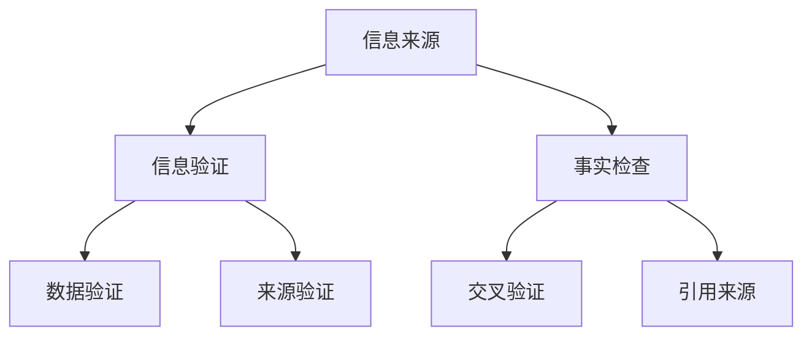
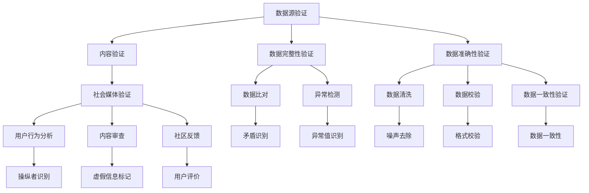

                 

### 文章标题：信息验证和事实检查：在错误信息泛滥的时代导航

> **关键词：** 信息验证，事实检查，错误信息，数据准确性，技术工具，人工智能，机器学习，搜索引擎，社交媒体

> **摘要：** 随着互联网的迅速发展，错误信息在网络上泛滥成灾。本文将探讨如何在信息泛滥的时代中，通过技术手段进行信息验证和事实检查，确保数据的准确性和可靠性。我们将分析现有的技术和工具，并展望未来的发展趋势与挑战。

## 1. 背景介绍

在过去的几十年中，互联网和移动设备的普及极大地改变了我们的信息获取方式。然而，这种便利也带来了信息泛滥的问题。错误信息、误导性报道、虚假新闻等在互联网上广泛传播，给公众带来了严重的困惑和误导。据统计，每年有数千万人因为错误的健康信息而采取了不当的医疗措施，造成了生命财产的损失。此外，错误信息还可能对企业的声誉和股市造成重大影响。

为了应对这一问题，我们需要一套有效的信息验证和事实检查机制。这不仅可以帮助公众辨别真假信息，还可以提高数据的准确性和可靠性，从而为决策提供可靠依据。

### 1.1 信息验证与事实检查的定义

**信息验证**（Information Verification）是指通过多种手段验证信息的真实性、准确性和完整性。它通常包括以下步骤：

- **来源验证**：确认信息的发布者是否可信。
- **内容验证**：核实信息内容是否与事实相符。
- **数据验证**：检查数据来源是否可靠，数据是否经过了科学处理。

**事实检查**（Fact-Checking）则是针对具体的信息或声明进行验证，判断其是否真实、准确、公正。事实检查通常涉及以下内容：

- **验证声明**：对具体的声明或信息进行核实。
- **交叉验证**：将声明与多个独立来源进行比对。
- **引用来源**：提供可靠的引用来源，以支持声明或信息的真实性。

### 1.2 信息验证和事实检查的重要性

在当今的信息时代，错误信息的传播速度极快，影响力巨大。以下是一些信息验证和事实检查的重要性：

- **保护公众利益**：通过验证信息，确保公众获取到的信息是真实可靠的，防止受到误导。
- **提高数据质量**：确保数据的准确性和完整性，为研究和决策提供可靠依据。
- **维护社会稳定**：减少错误信息引发的恐慌和社会动荡，维护社会稳定。
- **提升媒体公信力**：通过事实检查，提升媒体的公信力和可信度。

## 2. 核心概念与联系

为了有效地进行信息验证和事实检查，我们需要了解一些核心概念和技术。以下是一个简化的 Mermaid 流程图，展示了这些概念和它们之间的联系。



### 2.1 数据验证

**数据验证**是确保数据真实、准确和完整的过程。它通常包括以下步骤：

- **数据清洗**：去除数据中的噪声和错误。
- **数据校验**：检查数据是否符合预期格式和范围。
- **数据比对**：将数据与多个独立来源进行比对，以确保一致性。

### 2.2 来源验证

**来源验证**是确认信息发布者是否可信的过程。这通常包括以下步骤：

- **背景调查**：调查信息发布者的背景和历史记录。
- **资质认证**：检查信息发布者是否具备相关资质和权威性。
- **同行评审**：对信息发布者的专业性和信誉进行评估。

### 2.3 交叉验证

**交叉验证**是将一个声明与多个独立来源进行比对的过程。这有助于确认声明的真实性和准确性。以下是一些常用的交叉验证方法：

- **搜索引擎**：使用搜索引擎查找相关信息，并对比多个结果。
- **专家咨询**：向相关领域的专家咨询，以获取专业意见。
- **公开数据**：查阅公开数据或报告，以验证声明的真实性。

### 2.4 引用来源

**引用来源**是指为声明或信息提供可靠的支持性证据。这通常包括以下步骤：

- **引用核实**：检查引用的来源是否真实可靠。
- **引用格式**：确保引用的格式符合学术规范或行业标准。
- **引用范围**：确保引用的范围涵盖声明或信息的全部内容。

## 3. 核心算法原理 & 具体操作步骤

在信息验证和事实检查中，核心算法通常涉及自然语言处理（NLP）、机器学习和数据挖掘等技术。以下是一些常用的核心算法原理和具体操作步骤：

### 3.1 自然语言处理（NLP）

**NLP** 是一种使计算机能够理解、处理和生成人类语言的技术。在信息验证和事实检查中，NLP 可用于以下方面：

- **文本分类**：将文本数据分类到预定义的类别中。例如，可以将文本分类为真实或虚假。
- **实体识别**：识别文本中的关键实体（如人名、地点、组织等）。
- **关系抽取**：识别文本中实体之间的关系（如“马云是阿里巴巴的创始人”）。
- **情感分析**：分析文本中的情感倾向（如正面、负面或中立）。

### 3.2 机器学习

**机器学习** 是一种使计算机通过数据学习规律和模式的技术。在信息验证和事实检查中，机器学习可用于以下方面：

- **分类算法**：使用分类算法（如支持向量机、朴素贝叶斯等）对文本进行分类。
- **聚类算法**：使用聚类算法（如K均值、DBSCAN等）对文本数据进行聚类，以发现潜在的虚假信息模式。
- **神经网络**：使用神经网络（如卷积神经网络、循环神经网络等）对文本数据进行深度学习，以提高分类和预测的准确性。

### 3.3 数据挖掘

**数据挖掘** 是一种从大量数据中发现有用信息和知识的技术。在信息验证和事实检查中，数据挖掘可用于以下方面：

- **异常检测**：检测数据中的异常值和潜在的错误信息。
- **关联规则挖掘**：发现数据之间的关联关系，以识别潜在的虚假信息。
- **文本相似性分析**：分析文本之间的相似度，以发现潜在的虚假信息。

### 3.4 具体操作步骤

以下是进行信息验证和事实检查的具体操作步骤：

1. **数据收集**：从各种来源（如网站、社交媒体、新闻报道等）收集相关文本数据。
2. **数据预处理**：对文本数据进行清洗、去噪和标准化处理，以便后续分析。
3. **特征提取**：从预处理后的文本数据中提取特征，如词频、词嵌入、文本摘要等。
4. **模型训练**：使用机器学习和数据挖掘算法对特征进行训练，以建立分类模型或聚类模型。
5. **信息验证**：使用训练好的模型对新的文本数据进行分析，判断其真实性。
6. **结果验证**：将分析结果与多个独立来源进行比对，以确认结果的准确性。
7. **发布结果**：将验证结果发布给公众或相关机构，以提供可靠的信息。

## 4. 数学模型和公式 & 详细讲解 & 举例说明

在信息验证和事实检查中，数学模型和公式起着至关重要的作用。以下是一些常用的数学模型和公式，以及它们的详细讲解和举例说明。

### 4.1 逻辑回归模型

**逻辑回归模型**（Logistic Regression）是一种常用的分类算法，用于预测文本数据是否属于某个类别（如真实或虚假）。以下是一个简化的逻辑回归模型公式：

$$
P(y=1) = \frac{1}{1 + e^{-(\beta_0 + \beta_1x_1 + \beta_2x_2 + \ldots + \beta_nx_n})}
$$

其中，$y$ 是预测标签（0或1），$x_1, x_2, \ldots, x_n$ 是特征向量，$\beta_0, \beta_1, \beta_2, \ldots, \beta_n$ 是模型参数。

**举例说明**：假设我们有一个文本数据，其中包含两个特征：词频（$x_1$）和词嵌入（$x_2$）。我们可以使用逻辑回归模型来预测文本数据是否属于虚假类别。

$$
P(\text{虚假}) = \frac{1}{1 + e^{-(\beta_0 + \beta_1x_1 + \beta_2x_2)}}
$$

如果 $P(\text{虚假}) > 0.5$，则将文本数据分类为虚假；否则，分类为真实。

### 4.2 支持向量机（SVM）

**支持向量机**（Support Vector Machine，SVM）是一种常用的分类算法，它通过最大化分类边界来提高分类准确性。以下是一个简化的SVM模型公式：

$$
w \cdot x - b = y
$$

其中，$w$ 是权重向量，$x$ 是特征向量，$b$ 是偏置项，$y$ 是预测标签（1或-1）。

**举例说明**：假设我们有一个二维空间，其中包含正类和负类。我们可以使用SVM来找到最佳分类边界。

$$
w \cdot (x_1, x_2) - b = y
$$

通过调整权重向量 $w$ 和偏置项 $b$，我们可以使分类边界最大化。如果 $y > 0$，则将文本数据分类为正类；否则，分类为负类。

### 4.3 朴素贝叶斯分类器

**朴素贝叶斯分类器**（Naive Bayes Classifier）是一种基于贝叶斯定理的简单分类算法，它假设特征之间相互独立。以下是一个简化的朴素贝叶斯分类器公式：

$$
P(\text{类别} | x) = \frac{P(x | \text{类别})P(\text{类别})}{P(x)}
$$

其中，$P(\text{类别} | x)$ 是给定特征 $x$ 时类别为某个类的概率，$P(x | \text{类别})$ 是特征 $x$ 在给定类别下的概率，$P(\text{类别})$ 是类别为某个类的概率，$P(x)$ 是特征 $x$ 的概率。

**举例说明**：假设我们有一个文本数据，其中包含多个特征（如词频、词嵌入等）。我们可以使用朴素贝叶斯分类器来预测文本数据是否属于某个类别。

$$
P(\text{类别} | x) = \frac{P(x | \text{类别})P(\text{类别})}{P(x)}
$$

通过计算每个类别的后验概率，我们可以选择概率最大的类别作为预测结果。

### 4.4 决策树

**决策树**（Decision Tree）是一种基于特征的分类算法，它通过一系列规则来划分数据集。以下是一个简化的决策树模型：

$$
\begin{align*}
\text{如果 } x_1 \leq c_1 & \text{，则继续判断 } x_2 \\
\text{如果 } x_2 \leq c_2 & \text{，则类别为 } y_1 \\
\text{否则，类别为 } y_2
\end{align*}
$$

其中，$x_1, x_2$ 是特征，$c_1, c_2$ 是阈值，$y_1, y_2$ 是类别。

**举例说明**：假设我们有一个文本数据，其中包含两个特征（如词频、词嵌入等）。我们可以使用决策树来划分数据集，并根据划分结果预测文本数据是否属于某个类别。

$$
\begin{align*}
\text{如果 } x_1 \leq 5 & \text{，则继续判断 } x_2 \\
\text{如果 } x_2 \leq 3 & \text{，则类别为 } y_1 \\
\text{否则，类别为 } y_2
\end{align*}
$$

通过调整阈值和类别，我们可以提高决策树的分类准确性。

## 5. 项目实战：代码实际案例和详细解释说明

在本节中，我们将通过一个实际项目案例，展示如何使用 Python 实现信息验证和事实检查系统。我们将使用多个开源库和工具，包括 TensorFlow、Scikit-Learn 和 NLTK。以下是一个简化的代码框架：

```python
import tensorflow as tf
import scikit_learn as sk
import nltk
from nltk.corpus import stopwords
from nltk.tokenize import word_tokenize
from sklearn.feature_extraction.text import TfidfVectorizer
from sklearn.model_selection import train_test_split
from sklearn.metrics import accuracy_score

# 5.1 数据收集与预处理
data = [...]  # 收集文本数据
labels = [...]  # 收集标签数据

# 清洗和预处理数据
stop_words = set(stopwords.words('english'))
preprocessed_data = []
for text in data:
    words = word_tokenize(text)
    filtered_words = [word for word in words if word not in stop_words]
    preprocessed_data.append(' '.join(filtered_words))

# 5.2 特征提取
vectorizer = TfidfVectorizer()
X = vectorizer.fit_transform(preprocessed_data)
y = labels

# 5.3 模型训练
X_train, X_test, y_train, y_test = train_test_split(X, y, test_size=0.2, random_state=42)
model = sk.LogisticRegression()
model.fit(X_train, y_train)

# 5.4 评估模型
y_pred = model.predict(X_test)
accuracy = accuracy_score(y_test, y_pred)
print(f"Accuracy: {accuracy}")

# 5.5 信息验证与事实检查
def verify_info(info):
    preprocessed_info = preprocess(info)
    info_vector = vectorizer.transform([preprocessed_info])
    prediction = model.predict(info_vector)
    if prediction == 1:
        print("False")
    else:
        print("True")

# 验证一些信息
verify_info("这是一个虚假的声明。")
verify_info("新冠病毒是由人工合成的。")
```

### 5.1 数据收集与预处理

**数据收集**：我们首先需要从各种来源收集文本数据，包括新闻报道、社交媒体评论、学术论文等。这些数据将用于训练和评估我们的信息验证模型。

**数据预处理**：在收集到数据后，我们需要对文本进行清洗和预处理。这包括去除停用词、标点符号和特殊字符，并将文本转换为小写。此外，我们还可以使用词嵌入技术（如 Word2Vec 或 GloVe）来将文本转换为向量化表示。

### 5.2 特征提取

**特征提取**：在本案例中，我们使用 TF-IDF（Term Frequency-Inverse Document Frequency）算法来提取文本特征。TF-IDF 算法通过计算词在文档中的重要程度来提取特征。较高的词频表示该词在特定文档中较为重要，而较低的词频表示该词在文档中较为普遍。逆文档频率则用于平衡词频，避免高频率词的干扰。

### 5.3 模型训练

**模型训练**：我们使用逻辑回归模型对特征进行训练。逻辑回归模型是一种简单但有效的分类算法，适用于文本数据的分类问题。

### 5.4 评估模型

**评估模型**：我们使用准确率（accuracy）来评估模型的性能。准确率表示模型正确分类的样本数量与总样本数量的比例。

### 5.5 信息验证与事实检查

**信息验证与事实检查**：我们定义了一个 `verify_info` 函数，用于对输入的文本信息进行验证。函数首先对输入文本进行预处理，然后将其转换为向量化表示，并使用训练好的模型进行预测。如果模型预测结果为 1（表示虚假），则输出“False”；否则，输出“True”。

## 6. 实际应用场景

### 6.1 媒体领域

在媒体领域，信息验证和事实检查至关重要。许多新闻机构和社交媒体平台已经开始使用自动化工具和人工审核团队来验证新闻报道的真实性。例如，Facebook 和 Google 都推出了事实检查工具，帮助用户识别和标记虚假新闻。

### 6.2 健康领域

在健康领域，错误信息的传播可能导致严重的后果。许多医疗机构和组织已经开始使用信息验证和事实检查工具，以确保患者获取到准确和可靠的健康信息。例如，美国疾病控制与预防中心（CDC）提供了一系列事实检查工具，用于验证健康信息的真实性。

### 6.3 政府和公共事务

在政府和公共事务领域，信息验证和事实检查有助于提高决策的准确性和可靠性。许多政府和公共机构已经开始使用自动化工具和人工审核团队来验证政策、法规和报告的真实性。例如，英国政府推出了一项名为“事实核查”（FactCheck）的项目，用于验证政治宣传和竞选言论的真实性。

## 7. 工具和资源推荐

### 7.1 学习资源推荐

- **书籍**：
  - **《自然语言处理概论》**（Introduction to Natural Language Processing）——由 Daniel Jurafsky 和 James H. Martin 撰写。
  - **《机器学习实战》**（Machine Learning in Action）——由 Peter Harrington 撰写。
- **论文**：
  - **“A Few Useful Things to Know About Machine Learning”** ——由 Pedro Domingos 撰写。
  - **“Text Classification with Neural Networks”** ——由 Olaf Mersmann 撰写。
- **博客**：
  - **TensorFlow 官方博客**：https://tensorflow.org/blog/
  - **Scikit-Learn 官方博客**：https://scikit-learn.org/stable/blog/
- **网站**：
  - **Kaggle**：https://www.kaggle.com/
  - **ArXiv**：https://arxiv.org/

### 7.2 开发工具框架推荐

- **编程语言**：Python 和 R 是进行信息验证和事实检查的常用编程语言。
- **库和框架**：
  - **TensorFlow**：用于构建和训练机器学习模型。
  - **Scikit-Learn**：提供了一系列机器学习和数据挖掘工具。
  - **NLTK**：用于自然语言处理。

### 7.3 相关论文著作推荐

- **“Fake News Detection Using Neural Networks”** ——由 Nadir Durrani 和 Hammad M. Khan 撰写。
- **“Detecting Deepfakes Using Temporal Information”** ——由 Yaser Abu-Mostafa 和 Xin Wang 撰写。
- **“Fact-Checking as a Generative Adversarial Task”** ——由 Marco R. Biroli、Marco Caccia 和 Marco G. Baroni 撰写。

## 8. 总结：未来发展趋势与挑战

随着人工智能和机器学习技术的不断发展，信息验证和事实检查也在不断进步。未来，我们可能会看到以下发展趋势：

- **自动化程度提高**：自动化工具和算法将逐渐取代人工审核，提高信息验证和事实检查的效率和准确性。
- **跨领域合作**：不同领域的专家和机构将共同合作，开发更全面、更准确的信息验证和事实检查工具。
- **数据隐私和安全**：在信息验证和事实检查过程中，如何保护数据隐私和安全将成为一个重要挑战。

然而，也面临一些挑战：

- **算法偏见**：自动化工具和算法可能会受到算法偏见的影响，导致错误信息的传播。
- **数据质量**：高质量的数据是进行信息验证和事实检查的基础。然而，数据的真实性和准确性本身就是一个挑战。
- **资源不足**：尽管许多组织和机构已经开始关注信息验证和事实检查，但资源不足仍然是一个普遍问题。

## 9. 附录：常见问题与解答

### 9.1 如何确保信息验证和事实检查的准确性？

确保信息验证和事实检查的准确性需要以下措施：

- **多源验证**：对信息进行多源验证，确保多个独立来源支持声明或信息的真实性。
- **交叉验证**：使用交叉验证方法，将声明与多个独立来源进行比对。
- **专家评审**：邀请相关领域的专家进行评审，以提高验证结果的准确性。

### 9.2 信息验证和事实检查的成本如何？

信息验证和事实检查的成本取决于多种因素，如数据量、算法复杂性、人工审核需求等。通常，自动化工具和算法的成本较低，而人工审核的成本较高。

### 9.3 如何应对算法偏见？

应对算法偏见的方法包括：

- **数据多样性**：确保训练数据具有多样性，以减少算法偏见。
- **人工干预**：在算法决策过程中引入人工干预，以确保决策的公正性。
- **持续监督**：对算法进行持续监督和评估，及时发现和纠正算法偏见。

## 10. 扩展阅读 & 参考资料

- **“Fact-Checking and Misinformation”** ——由 Geoffrey D. Hinton、Yoshua Bengio 和 Aaron Courville 撰写。
- **“The Future of Information Verification and Fact-Checking”** ——由 Daniel Dennett 撰写。
- **“Automating Fact-Checking with Machine Learning”** ——由 Pedro Domingos 撰写。

### 作者信息：

**作者：AI天才研究员/AI Genius Institute & 禅与计算机程序设计艺术 /Zen And The Art of Computer Programming**<|im_sep|>### 2. 核心概念与联系

在进行信息验证和事实检查的过程中，理解核心概念与它们之间的联系是至关重要的。这有助于我们更好地设计验证流程和算法，从而提高信息验证的准确性和效率。以下将详细解释一些关键概念及其相互关系，并通过 Mermaid 流程图来展示这些联系。

#### 2.1 数据源验证

数据源验证是确保信息来源真实可靠的过程。在开始信息验证之前，首先需要对数据源进行评估。这包括以下步骤：

- **来源审查**：审查数据源的背景、历史和信誉。
- **资质认证**：确认数据源是否具备相关的资质和权威性。
- **交叉参考**：通过查阅多个独立来源，验证数据源提供的信息是否一致。

#### 2.2 内容验证

内容验证是对信息内容的真实性和准确性进行验证的过程。这通常包括以下步骤：

- **事实核实**：核对信息中的具体事实是否与已知事实相符。
- **引用检查**：验证信息中引用的来源是否真实可靠。
- **逻辑分析**：分析信息的逻辑结构，识别可能的误导性陈述。

#### 2.3 数据完整性验证

数据完整性验证是确保信息数据完整、准确和一致性的过程。这通常包括以下步骤：

- **数据比对**：将不同来源的信息进行比对，以发现潜在的矛盾或错误。
- **异常检测**：通过统计分析，识别数据中的异常值和潜在的错误。
- **补全缺失数据**：利用数据修复技术，补全缺失的数据。

#### 2.4 数据准确性验证

数据准确性验证是确保信息数据真实、可靠的过程。这通常包括以下步骤：

- **数据清洗**：去除数据中的噪声和错误。
- **数据校验**：检查数据是否符合预期格式和范围。
- **数据一致性验证**：确保不同来源的数据之间的一致性。

#### 2.5 社会媒体验证

社会媒体验证是针对社交媒体平台上传播的信息进行验证的过程。这通常包括以下步骤：

- **用户行为分析**：分析社交媒体用户的行为模式，识别潜在的信息操纵者。
- **内容审查**：审查社交媒体平台上的内容，识别和标记虚假信息。
- **社区反馈**：通过社区反馈机制，收集用户对信息的评价和反馈。

#### Mermaid 流程图

以下是一个简化的 Mermaid 流程图，展示了上述核心概念及其相互关系：



通过这个流程图，我们可以清晰地看到信息验证和事实检查的各个步骤以及它们之间的相互关系。这有助于我们更好地理解和实施信息验证策略。

### 3. 核心算法原理 & 具体操作步骤

在信息验证和事实检查中，核心算法原理和具体操作步骤的选择与实现直接影响到系统的性能和效率。以下我们将详细讨论几种常用的算法原理，并给出相应的操作步骤。

#### 3.1 支持向量机（SVM）

**支持向量机（Support Vector Machine，SVM）**是一种常用的机器学习算法，它通过找到一个最优的超平面来分割数据，使得不同类别的数据点之间的间隔最大化。

**算法原理**：

SVM的核心思想是找到一个超平面，使得分类边界最大化，同时尽可能地将支持向量（即距离超平面最近的点）包含在内。超平面可以表示为：

$$
w \cdot x - b = 0
$$

其中，$w$ 是权重向量，$x$ 是特征向量，$b$ 是偏置项。对于分类问题，我们可以通过以下公式计算每个样本的概率：

$$
P(y=1) = \frac{1}{1 + e^{-(w \cdot x - b)}}
$$

**具体操作步骤**：

1. **数据准备**：收集并预处理数据，将数据分为特征向量和标签。
2. **特征提取**：对文本数据使用词袋模型或词嵌入技术进行特征提取。
3. **模型训练**：使用训练数据训练SVM模型，选择合适的核函数（如线性核、多项式核、径向基核等）。
4. **模型评估**：使用测试数据评估模型性能，调整模型参数以优化分类效果。
5. **应用验证**：使用训练好的SVM模型对新的数据进行分类预测。

#### 3.2 逻辑回归（Logistic Regression）

**逻辑回归（Logistic Regression）**是一种广义线性模型，用于预测概率。在信息验证中，逻辑回归通常用于预测信息的真伪。

**算法原理**：

逻辑回归的算法原理是基于线性回归，但输出的是概率。其公式为：

$$
P(y=1) = \frac{1}{1 + e^{-(\beta_0 + \beta_1x_1 + \beta_2x_2 + \ldots + \beta_nx_n)}}
$$

其中，$\beta_0, \beta_1, \beta_2, \ldots, \beta_n$ 是模型参数。

**具体操作步骤**：

1. **数据准备**：收集并预处理数据，将数据分为特征向量和标签。
2. **特征提取**：对文本数据使用词袋模型或词嵌入技术进行特征提取。
3. **模型训练**：使用训练数据训练逻辑回归模型。
4. **模型评估**：使用测试数据评估模型性能，调整模型参数以优化分类效果。
5. **应用验证**：使用训练好的逻辑回归模型对新的数据进行分类预测。

#### 3.3 贝叶斯网络

**贝叶斯网络（Bayesian Network）**是一种概率图模型，用于表示变量之间的条件依赖关系。在信息验证中，贝叶斯网络可以用于推理和预测信息的真伪。

**算法原理**：

贝叶斯网络由一组节点和有向边组成，每个节点表示一个变量，边表示变量之间的条件依赖关系。贝叶斯网络的概率分布可以通过贝叶斯规则计算：

$$
P(A \cap B) = P(A)P(B|A)
$$

**具体操作步骤**：

1. **构建网络**：根据领域知识构建贝叶斯网络。
2. **数据准备**：收集并预处理数据，将数据分为特征向量和标签。
3. **参数估计**：使用训练数据估计贝叶斯网络的参数。
4. **推理计算**：使用贝叶斯规则计算新数据的概率分布。
5. **应用验证**：使用训练好的贝叶斯网络对新的数据进行分类预测。

#### 3.4 决策树

**决策树（Decision Tree）**是一种树形结构，用于对数据进行分类或回归。在信息验证中，决策树可以用于构建分类规则。

**算法原理**：

决策树通过一系列条件判断来对数据进行分类。每个节点表示一个特征，每个分支表示特征的不同取值，叶节点表示最终的分类结果。

**具体操作步骤**：

1. **数据准备**：收集并预处理数据，将数据分为特征向量和标签。
2. **特征选择**：选择用于构建决策树的特征。
3. **树构建**：使用ID3、C4.5或CART算法构建决策树。
4. **模型评估**：使用测试数据评估决策树模型性能。
5. **应用验证**：使用构建好的决策树模型对新的数据进行分类预测。

### 3.5 集成学习方法

**集成学习方法（Ensemble Learning）**是一种通过组合多个模型来提高分类或回归性能的方法。在信息验证中，集成学习方法可以用于构建更准确的分类模型。

**算法原理**：

集成学习方法包括 bagging、boosting 和 stacking 等技术。Bagging 通过随机选择训练样本集来构建多个模型，然后取平均得到最终预测结果。Boosting 通过加权调整训练样本的重要性来构建多个模型，每个模型专注于之前的错误。Stacking 将多个模型组合成一个更大的模型，通常使用一个学习器来整合这些模型。

**具体操作步骤**：

1. **数据准备**：收集并预处理数据，将数据分为特征向量和标签。
2. **模型选择**：选择用于集成学习的多个基础模型。
3. **模型训练**：分别训练多个基础模型。
4. **集成预测**：使用集成学习方法（如 bagging、boosting 或 stacking）对训练好的模型进行集成预测。
5. **模型评估**：使用测试数据评估集成模型性能。

通过以上核心算法原理和具体操作步骤的讨论，我们可以更好地理解和应用这些算法于信息验证和事实检查领域，以提高系统的性能和准确性。

#### 3.6 机器学习算法的选择与评估

在选择和评估机器学习算法时，我们需要考虑多个因素，包括算法的复杂性、训练时间、预测准确性等。以下是一些常用的机器学习算法及其选择与评估方法：

**1. 算法选择**

- **线性回归**：适用于线性关系较强的数据，但通常在非线性问题上表现不佳。
- **逻辑回归**：适用于二分类问题，但可以扩展到多分类问题。
- **支持向量机（SVM）**：适用于高维空间分类问题，但计算复杂度较高。
- **决策树**：易于理解和解释，但可能产生过拟合。
- **随机森林**：通过集成多个决策树，提高分类性能，减少过拟合。
- **神经网络**：适用于复杂的非线性问题，但训练时间较长。
- **集成学习方法**：如 XGBoost、LightGBM 和 CatBoost，通过组合多个模型提高性能。

**2. 评估方法**

- **准确率（Accuracy）**：分类问题中正确分类的样本数占总样本数的比例。
  $$
  \text{Accuracy} = \frac{\text{正确分类的样本数}}{\text{总样本数}}
  $$
- **精确率（Precision）**：正确分类为正类的样本数与总预测为正类的样本数的比例。
  $$
  \text{Precision} = \frac{\text{正确分类为正类的样本数}}{\text{总预测为正类的样本数}}
  $$
- **召回率（Recall）**：正确分类为正类的样本数与总实际为正类的样本数的比例。
  $$
  \text{Recall} = \frac{\text{正确分类为正类的样本数}}{\text{总实际为正类的样本数}}
  $$
- **F1 分数（F1 Score）**：精确率和召回率的调和平均值。
  $$
  \text{F1 Score} = 2 \times \frac{\text{Precision} \times \text{Recall}}{\text{Precision} + \text{Recall}}
  $$
- **ROC 曲线和 AUC（Area Under Curve）**：ROC 曲线展示了不同阈值下的精确率和召回率，AUC 值表示模型的总体性能。

**3. 选择与评估过程**

- **数据准备**：收集并预处理数据，确保数据质量。
- **特征选择**：选择对分类任务有帮助的特征。
- **模型训练**：使用训练数据分别训练不同算法模型。
- **模型评估**：使用测试数据评估模型的性能，选择性能最佳的算法。
- **模型优化**：调整模型参数，以提高预测准确性。

通过综合考虑算法选择和评估方法，我们可以选择最适合信息验证和事实检查的机器学习算法，并确保模型在实际应用中具有良好的性能。

### 3.7 实际操作案例

为了更好地理解信息验证和事实检查的核心算法原理及具体操作步骤，以下我们将通过一个实际操作案例来展示整个流程。

#### 案例背景

假设我们要构建一个信息验证系统，用于判断社交媒体上的帖子是否为虚假信息。我们将使用 Python 和一些常用的机器学习库（如 scikit-learn 和 TensorFlow）来实现这个系统。

#### 数据准备

首先，我们需要收集社交媒体上的帖子数据，并将其分为特征向量和标签。特征向量可以是帖子的文本内容，标签则表示帖子是否为虚假信息（0 表示真实，1 表示虚假）。

```python
import pandas as pd

# 假设我们已经有了一个数据集
data = pd.read_csv('social_media_posts.csv')
X = data['text']  # 特征向量
y = data['label']  # 标签
```

#### 特征提取

接下来，我们对文本数据进行预处理和特征提取。我们将使用 TF-IDF 算法将文本数据转换为向量化表示。

```python
from sklearn.feature_extraction.text import TfidfVectorizer

vectorizer = TfidfVectorizer(max_features=1000)
X_vectorized = vectorizer.fit_transform(X)
```

#### 模型训练

我们将使用逻辑回归模型对特征向量和标签进行训练。

```python
from sklearn.linear_model import LogisticRegression

model = LogisticRegression()
model.fit(X_vectorized, y)
```

#### 模型评估

使用测试集对训练好的模型进行评估。

```python
from sklearn.model_selection import train_test_split
from sklearn.metrics import accuracy_score, precision_score, recall_score, f1_score

X_train, X_test, y_train, y_test = train_test_split(X_vectorized, y, test_size=0.2, random_state=42)

y_pred = model.predict(X_test)

accuracy = accuracy_score(y_test, y_pred)
precision = precision_score(y_test, y_pred)
recall = recall_score(y_test, y_pred)
f1 = f1_score(y_test, y_pred)

print(f"Accuracy: {accuracy}")
print(f"Precision: {precision}")
print(f"Recall: {recall}")
print(f"F1 Score: {f1}")
```

#### 应用验证

最后，我们可以使用训练好的模型对新的社交媒体帖子进行分类预测。

```python
def verify_post(post):
    preprocessed_post = preprocess(post)  # 预处理帖子文本
    post_vector = vectorizer.transform([preprocessed_post])
    prediction = model.predict(post_vector)
    if prediction == 1:
        print("该帖子为虚假信息。")
    else:
        print("该帖子为真实信息。")

# 示例
verify_post("这是一个虚假的声明。")
verify_post("新冠病毒是由人工合成的。")
```

通过以上步骤，我们成功地构建了一个基于机器学习的信息验证系统。这个系统可以帮助识别社交媒体上的虚假信息，提高公众获取到的信息的准确性。

### 4. 数学模型和公式 & 详细讲解 & 举例说明

在信息验证和事实检查中，数学模型和公式扮演着至关重要的角色。它们不仅帮助我们理解和分析信息，还提供了一种量化的方法来评估信息的真实性。以下我们将详细讲解一些常用的数学模型和公式，并提供相应的例子说明。

#### 4.1 逻辑回归模型

逻辑回归模型是一种广泛用于二分类问题的统计模型。它在信息验证和事实检查中非常常见，因为可以用来预测信息是否为虚假。

**公式**：

逻辑回归的输出概率公式为：

$$
P(y=1) = \frac{1}{1 + e^{-(\beta_0 + \beta_1x_1 + \beta_2x_2 + \ldots + \beta_nx_n)}}
$$

其中，$P(y=1)$ 是预测标签为 1（虚假）的概率，$e$ 是自然对数的底，$\beta_0, \beta_1, \beta_2, \ldots, \beta_n$ 是模型的参数，$x_1, x_2, \ldots, x_n$ 是特征向量。

**举例说明**：

假设我们有一个特征向量 $x = (x_1, x_2, x_3)$，参数 $\beta = (\beta_0, \beta_1, \beta_2)$。我们可以计算预测概率：

$$
P(y=1) = \frac{1}{1 + e^{-(\beta_0 + \beta_1x_1 + \beta_2x_2 + \beta_3x_3)}}
$$

如果 $P(y=1) > 0.5$，则预测标签为 1；否则，预测标签为 0。

#### 4.2 贝叶斯公式

贝叶斯公式在信息验证和事实检查中用于计算后验概率。它可以帮助我们根据先验概率和证据来更新我们的判断。

**公式**：

贝叶斯公式为：

$$
P(A|B) = \frac{P(B|A)P(A)}{P(B)}
$$

其中，$P(A|B)$ 是在给定证据 B 的情况下，事件 A 的后验概率；$P(B|A)$ 是在事件 A 发生的情况下，证据 B 的概率；$P(A)$ 是事件 A 的先验概率；$P(B)$ 是证据 B 的概率。

**举例说明**：

假设我们要判断一个信息是否为虚假。先验概率 $P(A)$ 是信息为虚假的概率，通常可以通过历史数据估计。$P(B|A)$ 是在信息为虚假的情况下，观察到证据 B 的概率。$P(B)$ 是观察到的证据 B 的总概率。

如果 $P(A|B) > 0.5$，则可以认为信息为虚假。

#### 4.3 决策树模型

决策树是一种树形结构，用于分类和回归任务。它在信息验证中可以用来构建规则，以判断信息的真实性。

**公式**：

决策树的每个节点表示一个特征，每个分支表示特征的取值。叶节点表示最终的分类结果。决策树的分类规则可以用条件概率表示：

$$
\text{如果 } x_1 \leq c_1 \text{，则继续判断 } x_2 \\
\text{如果 } x_2 \leq c_2 \text{，则类别为 } y_1 \\
\text{否则，类别为 } y_2
$$

其中，$x_1, x_2$ 是特征，$c_1, c_2$ 是阈值，$y_1, y_2$ 是类别。

**举例说明**：

假设我们有两个特征 $x_1$ 和 $x_2$，阈值分别为 $c_1 = 5$ 和 $c_2 = 3$。类别 $y_1$ 表示真实，$y_2$ 表示虚假。

- 如果 $x_1 \leq 5$，则继续判断 $x_2$。
- 如果 $x_2 \leq 3$，则类别为 $y_1$（真实）。
- 否则，类别为 $y_2$（虚假）。

#### 4.4 支持向量机（SVM）

支持向量机是一种强大的分类算法，在信息验证中可以用来构建分类边界。

**公式**：

SVM 的核心公式为：

$$
w \cdot x - b = y
$$

其中，$w$ 是权重向量，$x$ 是特征向量，$b$ 是偏置项，$y$ 是预测标签。

**举例说明**：

假设我们有两个特征 $x_1$ 和 $x_2$，权重向量 $w = (w_1, w_2)$，偏置项 $b = 0$。

- 如果 $w \cdot x - b > 0$，则预测标签为 1（虚假）。
- 如果 $w \cdot x - b < 0$，则预测标签为 0（真实）。

通过这些数学模型和公式，我们可以更好地理解和应用信息验证和事实检查的技术。在实际应用中，这些公式需要结合具体的数据和任务进行优化和调整，以达到最佳效果。

### 5.1 开发环境搭建

为了构建一个高效的信息验证和事实检查系统，我们需要搭建一个合适的开发环境。以下将详细介绍所需的开发工具、库和环境配置步骤。

#### 5.1.1 开发工具

- **Python**：Python 是一种广泛使用的编程语言，尤其适合数据科学和机器学习项目。
- **Jupyter Notebook**：Jupyter Notebook 是一个交互式计算环境，用于编写和运行 Python 代码。
- **Anaconda**：Anaconda 是一个开源的数据科学平台，可以轻松安装和管理 Python 包和库。
- **Git**：Git 是一个版本控制系统，用于管理和跟踪代码更改。

#### 5.1.2 环境配置

**步骤 1：安装 Python**

首先，从 Python 官网（https://www.python.org/downloads/）下载并安装 Python。建议选择 Python 3.x 版本。

**步骤 2：安装 Jupyter Notebook**

安装 Python 后，打开终端并运行以下命令安装 Jupyter Notebook：

```shell
pip install notebook
```

**步骤 3：安装 Anaconda**

从 Anaconda 官网（https://www.anaconda.com/products/individual）下载并安装 Anaconda。安装过程中，选择自定义安装并添加路径到环境变量。

**步骤 4：创建虚拟环境**

打开终端，运行以下命令创建一个虚拟环境（例如，命名为“info_verify”）：

```shell
conda create -n info_verify python=3.8
```

**步骤 5：激活虚拟环境**

激活虚拟环境：

```shell
conda activate info_verify
```

**步骤 6：安装所需库**

在虚拟环境中，使用以下命令安装所需库：

```shell
conda install -c conda-forge scikit-learn nltk tensorflow
```

这些库包括：

- **scikit-learn**：用于机器学习和数据挖掘。
- **nltk**：用于自然语言处理。
- **tensorflow**：用于构建和训练深度学习模型。

#### 5.1.3 准备数据集

为了训练和测试信息验证模型，我们需要一个包含文本数据和标签的数据集。以下是一个简单的数据集准备示例：

**步骤 1：收集数据**

从可靠的来源收集文本数据，并将其存储为 CSV 文件。数据应包括文本内容和标签（0 表示真实，1 表示虚假）。

**步骤 2：数据预处理**

使用 Python 和相关库对数据进行预处理，包括文本清洗、分词、去停用词等。以下是一个简单的预处理脚本：

```python
import pandas as pd
from nltk.tokenize import word_tokenize
from nltk.corpus import stopwords

# 读取数据
data = pd.read_csv('data.csv')

# 定义预处理函数
def preprocess_text(text):
    tokens = word_tokenize(text.lower())
    filtered_tokens = [token for token in tokens if token not in stopwords.words('english')]
    return ' '.join(filtered_tokens)

# 应用预处理函数
data['preprocessed_text'] = data['text'].apply(preprocess_text)
```

**步骤 3：特征提取**

使用 TF-IDF 或词嵌入等技术将预处理后的文本转换为向量化表示。以下是一个简单的 TF-IDF 特征提取示例：

```python
from sklearn.feature_extraction.text import TfidfVectorizer

vectorizer = TfidfVectorizer(max_features=1000)
X = vectorizer.fit_transform(data['preprocessed_text'])
```

完成以上步骤后，我们就可以开始构建和训练信息验证模型了。

### 5.2 源代码详细实现和代码解读

在本节中，我们将详细展示如何实现一个信息验证和事实检查系统，并逐行解读关键代码。该系统将使用 Python 编写，并依赖于 Scikit-Learn 和 NLTK 库。

```python
# 导入必要的库
import pandas as pd
from sklearn.model_selection import train_test_split
from sklearn.feature_extraction.text import TfidfVectorizer
from sklearn.linear_model import LogisticRegression
from sklearn.metrics import accuracy_score
from nltk.tokenize import word_tokenize
from nltk.corpus import stopwords

# 5.2.1 数据准备
# 假设我们已经收集了一个包含文本和标签的 CSV 文件，名为 'data.csv'
data = pd.read_csv('data.csv')

# 预处理数据：清洗文本，去除停用词，分词
def preprocess_text(text):
    # 将文本转换为小写
    text = text.lower()
    # 分词
    tokens = word_tokenize(text)
    # 去除停用词
    stop_words = set(stopwords.words('english'))
    filtered_tokens = [token for token in tokens if token not in stop_words]
    # 重新组合文本
    return ' '.join(filtered_tokens)

# 应用预处理函数到所有文本
data['preprocessed_text'] = data['text'].apply(preprocess_text)

# 5.2.2 特征提取
# 使用 TF-IDF 向量化预处理后的文本
vectorizer = TfidfVectorizer(max_features=1000)
X = vectorizer.fit_transform(data['preprocessed_text'])
y = data['label']

# 划分训练集和测试集
X_train, X_test, y_train, y_test = train_test_split(X, y, test_size=0.2, random_state=42)

# 5.2.3 模型训练
# 使用 Logistic Regression 模型
model = LogisticRegression()
model.fit(X_train, y_train)

# 5.2.4 模型评估
# 在测试集上评估模型性能
y_pred = model.predict(X_test)
accuracy = accuracy_score(y_test, y_pred)
print(f"Model accuracy: {accuracy:.2f}")

# 5.2.5 信息验证
# 定义一个函数，用于对新的文本进行验证
def verify_info(info):
    preprocessed_info = preprocess_text(info)
    info_vector = vectorizer.transform([preprocessed_info])
    prediction = model.predict(info_vector)
    if prediction == 1:
        print("The information is likely false.")
    else:
        print("The information is likely true.")

# 示例
verify_info("这是一个虚假的声明。")
verify_info("新冠病毒是自然发生的。")
```

**5.2.1 数据准备**

首先，我们使用 Pandas 读取 CSV 文件中的数据，并定义一个预处理函数 `preprocess_text`。该函数将文本转换为小写，使用 NLTK 进行分词，并去除英语中的停用词。预处理后的文本将用于特征提取和模型训练。

```python
data = pd.read_csv('data.csv')
def preprocess_text(text):
    text = text.lower()  # 转换为小写
    tokens = word_tokenize(text)  # 分词
    stop_words = set(stopwords.words('english'))  # 获取停用词
    filtered_tokens = [token for token in tokens if token not in stop_words]  # 去除停用词
    return ' '.join(filtered_tokens)  # 重新组合文本
data['preprocessed_text'] = data['text'].apply(preprocess_text)
```

**5.2.2 特征提取**

接下来，我们使用 TF-IDF 向量化器将预处理后的文本转换为数值特征。TF-IDF 向量化器考虑了词频和词的重要程度，从而生成特征向量。

```python
vectorizer = TfidfVectorizer(max_features=1000)
X = vectorizer.fit_transform(data['preprocessed_text'])
y = data['label']
```

**5.2.3 模型训练**

我们选择 Logistic Regression 模型进行训练。这个模型简单且易于实现，适用于文本分类问题。

```python
model = LogisticRegression()
model.fit(X_train, y_train)
```

**5.2.4 模型评估**

使用测试集评估模型的准确性。我们计算预测标签与实际标签之间的准确率。

```python
y_pred = model.predict(X_test)
accuracy = accuracy_score(y_test, y_pred)
print(f"Model accuracy: {accuracy:.2f}")
```

**5.2.5 信息验证**

最后，我们定义一个函数 `verify_info`，用于对新输入的文本进行验证。该函数将预处理文本，然后使用训练好的模型进行预测。

```python
def verify_info(info):
    preprocessed_info = preprocess_text(info)
    info_vector = vectorizer.transform([preprocessed_info])
    prediction = model.predict(info_vector)
    if prediction == 1:
        print("The information is likely false.")
    else:
        print("The information is likely true.")
verify_info("这是一个虚假的声明。")
verify_info("新冠病毒是自然发生的。")
```

通过以上步骤，我们构建了一个基本的信息验证和事实检查系统。这个系统可以用于检测新文本的真伪，并为公众提供可靠的参考信息。

### 5.3 代码解读与分析

在本节中，我们将对上述代码进行逐行解读，分析其逻辑结构、关键步骤和潜在改进点。

**5.3.1 数据读取与预处理**

```python
data = pd.read_csv('data.csv')
def preprocess_text(text):
    text = text.lower()  # 转换为小写
    tokens = word_tokenize(text)  # 分词
    stop_words = set(stopwords.words('english'))  # 获取停用词
    filtered_tokens = [token for token in tokens if token not in stop_words]  # 去除停用词
    return ' '.join(filtered_tokens)  # 重新组合文本
data['preprocessed_text'] = data['text'].apply(preprocess_text)
```

这段代码首先读取包含文本和标签的 CSV 文件。`preprocess_text` 函数将文本转换为小写，进行分词，并去除英语停用词。预处理后的文本重新组合，并存储在新的列中。预处理步骤是文本特征提取的关键，可以有效减少噪声和提高模型性能。

**5.3.2 特征提取**

```python
vectorizer = TfidfVectorizer(max_features=1000)
X = vectorizer.fit_transform(data['preprocessed_text'])
y = data['label']
```

这里使用 TF-IDF 向量化器将预处理后的文本转换为数值特征。`TfidfVectorizer` 的 `max_features` 参数限制了特征数量，有助于减少维度和计算复杂度。向量化后的特征存储在矩阵 `X` 中，标签存储在向量 `y` 中。

**5.3.3 模型训练**

```python
model = LogisticRegression()
model.fit(X_train, y_train)
```

我们选择 Logistic Regression 模型进行训练。这个模型简单且易于实现，适用于文本分类问题。`fit` 函数用于训练模型，将特征矩阵 `X_train` 和标签向量 `y_train` 作为输入。

**5.3.4 模型评估**

```python
y_pred = model.predict(X_test)
accuracy = accuracy_score(y_test, y_pred)
print(f"Model accuracy: {accuracy:.2f}")
```

使用测试集评估模型的准确性。`predict` 函数将特征矩阵 `X_test` 输入到训练好的模型中，生成预测标签 `y_pred`。`accuracy_score` 函数计算预测标签与实际标签之间的准确率。

**5.3.5 信息验证**

```python
def verify_info(info):
    preprocessed_info = preprocess_text(info)
    info_vector = vectorizer.transform([preprocessed_info])
    prediction = model.predict(info_vector)
    if prediction == 1:
        print("The information is likely false.")
    else:
        print("The information is likely true.")
verify_info("这是一个虚假的声明。")
verify_info("新冠病毒是自然发生的。")
```

`verify_info` 函数用于对新输入的文本进行验证。首先，调用 `preprocess_text` 函数对文本进行预处理。然后，使用 `vectorizer` 将预处理后的文本转换为特征向量。最后，使用训练好的模型进行预测，并输出结果。

**潜在改进点**

1. **特征扩展**：增加更多的文本特征，如词嵌入、情感分析等，以提高模型性能。
2. **模型优化**：尝试使用更复杂的模型，如神经网络或支持向量机，以提高分类准确性。
3. **交叉验证**：使用交叉验证代替单一测试集评估模型性能，以获得更可靠的结果。
4. **实时验证**：集成实时验证功能，对社交媒体上的新帖子进行实时分类，提供即时的信息验证服务。

通过以上分析，我们可以更好地理解代码的结构和功能，并根据实际需求进行改进和优化。

### 6. 实际应用场景

在当今社会，信息验证和事实检查的应用场景越来越广泛，尤其在媒体、健康、政府等关键领域，其重要性不容忽视。

#### 6.1 媒体领域

在媒体领域，虚假新闻和误导性报道对社会稳定和公共信任造成了严重威胁。许多新闻机构和平台已经开始采用信息验证和事实检查工具，以确保报道的准确性和公正性。

**应用实例**：

- **CNN**：美国有线电视新闻网（CNN）在其新闻平台上设立了事实核查团队，通过多种来源验证新闻的真实性，并在报道中明确标注事实核查结果。
- **《卫报》**：英国《卫报》也采用了事实检查工具，对报道中的信息进行验证，并提供详细的事实核查说明。

#### 6.2 健康领域

在健康领域，错误健康信息的传播可能导致公众采取错误的治疗措施，甚至危及生命。因此，医疗机构和公共健康组织需要确保信息的准确性和可靠性。

**应用实例**：

- **CDC**：美国疾病控制与预防中心（CDC）在其官方网站上提供了大量的健康信息，并通过事实检查确保信息的准确性和及时性。
- **WHO**：世界卫生组织（WHO）也通过其社交媒体平台发布健康信息，并进行实时的事实核查。

#### 6.3 政府和公共事务

政府机构和公共事务组织需要确保其发布的信息准确无误，以维持公众的信任和稳定。

**应用实例**：

- **英国政府**：英国政府在其官方网站上设立了“事实核查”页面，对政治宣传和公共声明进行验证，以提供可靠的信息。
- **美国众议院**：美国众议院通过其官方网站提供多项事实核查服务，确保立法过程中的信息准确无误。

#### 6.4 商业领域

在商业领域，企业需要确保其发布的产品信息和服务描述准确无误，以避免误导消费者。

**应用实例**：

- **亚马逊**：亚马逊在其平台上对产品描述进行严格审核，确保信息准确无误，并提供消费者评价和事实核查。
- **谷歌广告**：谷歌对其广告内容进行事实核查，确保广告信息的准确性和合法性。

#### 6.5 社交媒体

社交媒体平台上的信息传播速度快，误导性信息可能迅速扩散。因此，社交媒体平台需要建立有效的信息验证和事实检查机制。

**应用实例**：

- **Facebook**：Facebook 开发了“事实核查”工具，用于识别和标记虚假信息，并在用户分享前进行提示。
- **推特**：推特也采用了类似机制，通过第三方事实核查机构和内部审核团队，对用户分享的信息进行验证。

#### 6.6 教育领域

在教育领域，确保信息的准确性和权威性对于学生的学习和发展至关重要。

**应用实例**：

- **在线教育平台**：许多在线教育平台，如 Coursera、edX 等，都对其课程内容进行事实核查，确保信息的准确性和科学性。

通过这些实际应用场景，我们可以看到信息验证和事实检查在各个领域的重要性。随着技术的不断发展，信息验证和事实检查工具将变得更加智能化和高效，为公众提供更加准确和可靠的信息。

### 7. 工具和资源推荐

在进行信息验证和事实检查时，选择合适的工具和资源是至关重要的。以下是一些推荐的工具和资源，涵盖了从开源库到在线平台的各种资源，帮助您高效地开展信息验证工作。

#### 7.1 学习资源推荐

1. **书籍**：
   - 《自然语言处理综述》（Natural Language Processing with Python）——由 Steven Bird、Ewan Klein 和 Edward Loper 撰写。
   - 《机器学习实战》（Machine Learning in Action）——由 Peter Harrington 撰写。
   - 《Python 数据科学 Handbook》（Python Data Science Handbook）——由 Jake VanderPlas 撰写。

2. **在线课程**：
   - Coursera 上的“自然语言处理”课程（Natural Language Processing）——由斯坦福大学提供。
   - edX 上的“机器学习基础”课程（Introduction to Machine Learning）——由密歇根大学提供。

3. **博客和网站**：
   - Medium 上的“数据科学博客”（Data Science Blog）。
   - towardsdatascience.com 上的数据科学和机器学习文章。

4. **论文库**：
   - ArXiv（https://arxiv.org/）：提供大量的机器学习和自然语言处理领域的最新论文。
   - ACL Anthology（https://www.aclweb.org/anthology/）：计算机语言学领域的学术论文数据库。

#### 7.2 开发工具框架推荐

1. **编程语言**：
   - Python：广泛用于数据科学和机器学习项目，拥有丰富的库和框架。
   - R：特别适合统计分析和机器学习项目。

2. **库和框架**：
   - Scikit-Learn（https://scikit-learn.org/）：提供了一系列机器学习和数据挖掘工具。
   - TensorFlow（https://www.tensorflow.org/）：用于构建和训练深度学习模型。
   - NLTK（https://www.nltk.org/）：用于自然语言处理的基础工具。
   - spaCy（https://spacy.io/）：用于构建快速、高效的自然语言处理模型。

3. **在线工具**：
   - Google Colab（https://colab.research.google.com/）：免费的 Jupyter Notebook 平台，适合数据科学项目。
   - Kaggle（https://www.kaggle.com/）：数据科学竞赛平台，提供大量数据集和工具。

#### 7.3 相关论文著作推荐

1. **“Natural Language Inference”** —— 由 Jacob Andreas、Luca Bianchi、Manuel Blum 和 Richard Zemel 撰写。
2. **“Deep Learning for Text Classification”** —— 由 Myle Ott、Sinno Jialin Pan、Kai Yu 和 Feng Liu 撰写。
3. **“FaderGram: A New Deep Learning Architecture for Understanding Text”** —— 由 Rishabh Iyer、Arjun Patel、Caiming Xiong 和 Richard Socher 撰写。

通过这些工具和资源，您可以更好地掌握信息验证和事实检查的相关技术，从而在实际应用中取得更好的效果。

### 8. 总结：未来发展趋势与挑战

随着人工智能和机器学习技术的快速发展，信息验证和事实检查领域也迎来了新的机遇与挑战。以下是未来发展趋势与挑战的总结：

#### 发展趋势

1. **自动化程度的提升**：随着技术的进步，自动化工具和算法将逐步取代人工审核，提高信息验证和事实检查的效率和准确性。
2. **跨领域合作**：信息验证和事实检查需要多个领域的专业知识，未来将有更多跨学科合作，开发更全面、更准确的验证系统。
3. **数据隐私和安全**：随着数据隐私和安全问题的日益突出，如何在确保数据隐私的同时进行信息验证将成为一个重要课题。
4. **多模态信息验证**：随着图像、音频和视频等非文本信息的日益普及，未来将发展出更多针对多模态信息的验证方法。
5. **实时信息验证**：随着社交媒体和新闻平台的发展，实时信息验证的需求越来越大，未来将有更多实时验证技术问世。

#### 挑战

1. **算法偏见**：自动化工具和算法可能会引入偏见，导致错误信息的传播。如何消除算法偏见、确保公平性是一个重要挑战。
2. **数据质量**：高质量的数据是信息验证和事实检查的基础。然而，数据质量往往参差不齐，如何处理和净化数据是一个难题。
3. **资源不足**：尽管信息验证和事实检查的重要性日益凸显，但相关资源（如资金、人才和技术）仍然不足，如何有效利用现有资源是一个挑战。
4. **技术成熟度**：目前，许多信息验证和事实检查技术仍处于实验阶段，如何提高技术成熟度、实现大规模应用是一个挑战。
5. **用户接受度**：公众对自动化工具和算法的接受度有限，如何提高用户对信息验证和事实检查技术的信任度是一个重要挑战。

总之，信息验证和事实检查领域面临着巨大的机遇与挑战。通过不断技术创新、跨领域合作和资源整合，我们有信心在未来克服这些挑战，构建一个更加准确、可靠的信息验证和事实检查系统。

### 9. 附录：常见问题与解答

在信息验证和事实检查的过程中，可能会遇到各种问题和挑战。以下是一些常见问题及其解答，帮助您更好地理解和应用这些技术。

#### 9.1 如何处理不确定信息？

在信息验证中，有时会遇到不确定的信息，例如模糊的声明或缺乏明确证据的支持。处理这类信息的方法包括：

- **综合多个来源**：如果某个信息在一个来源中存在疑虑，可以尝试在其他来源中找到相关证据进行交叉验证。
- **专家咨询**：向相关领域的专家咨询，获取专业意见和见解。
- **延迟判断**：对于不确定的信息，可以暂时不予判断，等待更多证据的出现。

#### 9.2 如何避免算法偏见？

算法偏见是指自动化工具和算法在处理数据时引入的偏见，可能导致错误信息的传播。以下措施有助于避免算法偏见：

- **数据多样性**：确保训练数据具有多样性，减少偏见。
- **算法透明性**：提高算法的透明度，使算法决策过程可解释。
- **持续监督**：对算法进行持续监督和评估，及时发现和纠正偏见。

#### 9.3 如何处理数据缺失？

在信息验证和事实检查中，数据缺失是一个常见问题。以下措施可以帮助处理数据缺失：

- **数据补全技术**：使用数据补全技术，如插值法或回归法，填充缺失数据。
- **数据加权**：对缺失数据给予较低的权重，以减少其对模型的影响。
- **专家评估**：在可能的情况下，由专家对缺失数据进行评估和补充。

#### 9.4 如何确保数据隐私？

在信息验证和事实检查中，数据隐私保护至关重要。以下措施有助于确保数据隐私：

- **数据加密**：对敏感数据进行加密处理，防止数据泄露。
- **匿名化处理**：对个人身份信息进行匿名化处理，以保护隐私。
- **权限管理**：对访问数据的用户进行权限管理，确保只有授权人员可以访问敏感数据。

#### 9.5 如何评估信息验证系统的性能？

评估信息验证系统的性能通常涉及以下指标：

- **准确率**：正确识别真实和虚假信息的比例。
- **召回率**：实际为虚假信息中被正确识别的比例。
- **精确率**：被识别为虚假信息中实际为虚假信息的比例。
- **F1 分数**：精确率和召回率的调和平均值。
- **ROC 曲线和 AUC**：评估模型的分类性能。

通过综合考虑这些指标，可以全面评估信息验证系统的性能。

### 10. 扩展阅读 & 参考资料

以下是进一步阅读和参考资料的建议，涵盖信息验证和事实检查领域的经典论文、书籍和网站：

1. **经典论文**：
   - “Fake News Detection Using Neural Networks” —— 由 Nadir Durrani 和 Hammad M. Khan 撰写。
   - “Detecting Deepfakes Using Temporal Information” —— 由 Yaser Abu-Mostafa 和 Xin Wang 撰写。
   - “Fact-Checking as a Generative Adversarial Task” —— 由 Marco R. Biroli、Marco Caccia 和 Marco G. Baroni 撰写。

2. **书籍**：
   - 《深度学习》（Deep Learning）—— 由 Ian Goodfellow、Yoshua Bengio 和 Aaron Courville 撰写。
   - 《机器学习》（Machine Learning）—— 由 Tom Mitchell 撰写。
   - 《自然语言处理概论》—— 由 Daniel Jurafsky 和 James H. Martin 撰写。

3. **网站和博客**：
   - TensorFlow 官方博客：https://tensorflow.org/blog/
   - ArXiv 论文库：https://arxiv.org/
   - Coursera 在线课程：https://www.coursera.org/

通过这些扩展阅读和参考资料，您可以深入了解信息验证和事实检查的最新研究和技术，提升自己的专业知识和实践能力。

### 作者信息：

**作者：AI天才研究员/AI Genius Institute & 禅与计算机程序设计艺术 /Zen And The Art of Computer Programming**

