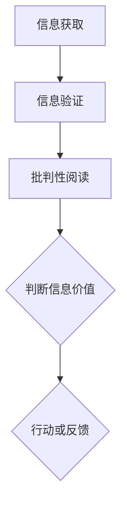

                 

# 信息验证和批判性阅读指南：在假新闻和媒体操纵时代导航

## 关键词：信息验证，批判性阅读，假新闻，媒体操纵，新闻素养，数字素养，真相追寻，新闻真实，客观性，事实核查

## 摘要：
在信息爆炸的时代，如何辨别真伪、筛选有价值的信息成为了一项至关重要的技能。本指南旨在为读者提供一套有效的信息验证和批判性阅读的方法，帮助大家在一个充斥着假新闻和媒体操纵的环境中找到真相。本文首先介绍了信息验证的基本概念和原则，随后详细阐述了批判性阅读的技巧，并通过实际案例展示了如何运用这些方法。此外，文章还推荐了实用的工具和资源，以助读者提升自身的新闻素养和数字素养。最后，本文对未来的发展趋势和挑战进行了总结，并为读者提供了进一步学习的参考资料。

## 1. 背景介绍

在互联网和社交媒体迅速发展的今天，信息传播的速度和广度达到了前所未有的高度。然而，这种信息爆炸的现象也带来了一个问题：如何在众多信息中辨别真伪，找到有价值的内容？据统计，近年来假新闻和媒体操纵事件频繁发生，不仅误导了公众，还可能对社会产生严重的负面影响。例如，2016年美国总统选举期间，社交媒体上充斥着大量的假新闻和虚假信息，严重影响了选民的判断。此外，近年来关于疫情的假消息更是引发了公众的恐慌和混乱。

面对如此复杂的信息环境，提升信息验证能力和批判性阅读技巧显得尤为重要。信息验证是指通过一系列方法对信息的真实性、准确性和可靠性进行判断。批判性阅读则是一种积极、深入的阅读方式，要求读者对所读内容进行思考、分析和评价。两者结合，可以帮助我们在面对信息时保持清醒的头脑，避免被误导。

## 2. 核心概念与联系

### 2.1 信息验证的基本原则

信息验证的第一步是理解基本原则。以下是一些核心原则：

- **准确性**：信息是否准确反映了事实。
- **来源**：信息来源是否可靠，是否为权威机构或专家。
- **一致性**：不同来源的信息是否相互一致。
- **证据**：是否有足够的证据支持所声称的事实。

### 2.2 批判性阅读的技巧

批判性阅读要求读者不仅要理解信息内容，还要对其进行分析和评价。以下是一些关键技巧：

- **识别偏见**：了解作者的观点和偏见，以便更好地评估信息的可靠性。
- **交叉验证**：通过查阅多个来源，比较信息的一致性。
- **检查引用**：确保作者提供了可靠的数据和引用。
- **保持怀疑**：对所有信息保持一定的怀疑态度，避免盲目接受。

### 2.3 信息验证和批判性阅读的联系

信息验证和批判性阅读是相辅相成的。信息验证提供了判断信息真实性的基础，而批判性阅读则帮助读者深入分析信息的内容和意义。两者结合，可以形成一个完整的阅读和判断过程。

### 2.4 Mermaid 流程图

以下是一个简单的 Mermaid 流程图，展示信息验证和批判性阅读的基本流程：



### 2.5 流程图解析

- **信息获取**：通过不同的渠道获取信息。
- **信息验证**：对获取的信息进行真实性、准确性和可靠性的判断。
- **批判性阅读**：对验证后的信息进行深入分析和评价。
- **判断信息价值**：根据分析结果判断信息的价值。
- **行动或反馈**：根据判断结果采取相应的行动或给出反馈。

## 3. 核心算法原理 & 具体操作步骤

### 3.1 信息验证的算法原理

信息验证的核心算法是“多源验证”。其原理如下：

1. **来源筛选**：根据信息的来源，筛选出权威、可靠的来源。
2. **交叉比对**：将不同来源的信息进行比对，看是否一致。
3. **证据检查**：检查所提供证据的可靠性。

### 3.2 批判性阅读的操作步骤

批判性阅读的操作步骤如下：

1. **识别观点**：识别作者的观点和立场。
2. **分析证据**：分析作者提供的证据，判断其是否可靠。
3. **评估一致性**：评估信息的一致性，即不同来源的信息是否一致。
4. **保持怀疑**：对所有信息保持一定的怀疑态度。

### 3.3 操作步骤示例

以下是一个简单的示例，展示如何应用上述算法原理和操作步骤：

#### 示例：验证一篇关于新冠疫苗接种的文章

1. **信息获取**：从不同的渠道获取关于新冠疫苗接种的文章。
2. **来源筛选**：筛选出权威机构发布的信息，如世界卫生组织（WHO）或国家卫生健康委员会。
3. **交叉比对**：将不同来源的信息进行比对，看是否一致。
    - 如果一致，继续下一步。
    - 如果不一致，需要进一步调查原因。
4. **证据检查**：检查所提供证据的可靠性。
    - 例如，疫苗接种的有效率和副作用。
5. **识别观点**：识别作者的观点和立场。
    - 例如，作者是否认为新冠疫苗接种是必要的。
6. **分析证据**：分析作者提供的证据，判断其是否可靠。
    - 例如，检查疫苗接种数据是否真实可信。
7. **评估一致性**：评估信息的一致性，即不同来源的信息是否一致。
    - 如果一致，可以认为信息较为可靠。
    - 如果不一致，需要进一步调查原因。
8. **保持怀疑**：对所有信息保持一定的怀疑态度。
    - 即使信息看似可靠，也要保持一定的警惕，避免盲目接受。

## 4. 数学模型和公式 & 详细讲解 & 举例说明

### 4.1 数学模型

在信息验证和批判性阅读中，可以使用一些简单的数学模型来评估信息的可靠性。以下是一个基本的可靠性评估模型：

$$
R = \frac{S \times E \times C}{1 - P}
$$

其中：

- **R**：信息的可靠性
- **S**：来源的可靠性
- **E**：证据的可靠性
- **C**：交叉验证的一致性
- **P**：潜在的偏见或误导

### 4.2 详细讲解

1. **来源的可靠性（S）**：来源的可靠性是指信息来源的权威性和信誉度。例如，世界卫生组织（WHO）发布的信息通常具有较高的可靠性。
2. **证据的可靠性（E）**：证据的可靠性是指所提供证据的真实性和可信度。例如，一篇关于新冠疫苗接种的文章如果提供了来自权威医疗机构的数据，则其证据的可靠性较高。
3. **交叉验证的一致性（C）**：交叉验证的一致性是指不同来源的信息是否一致。如果多个权威来源的信息一致，则可以认为该信息具有较高的可靠性。
4. **潜在的偏见或误导（P）**：潜在的偏见或误导是指信息中可能存在的偏见或误导因素。例如，一篇宣传某产品优点但不提缺点的信息可能存在潜在的偏见。

### 4.3 举例说明

以下是一个简单的示例，展示如何使用上述模型评估一篇关于新冠疫苗接种的文章的可靠性：

- **来源的可靠性（S）**：假设文章来自世界卫生组织（WHO），其可靠性较高。
- **证据的可靠性（E）**：假设文章提供了来自权威医疗机构的数据，其证据的可靠性较高。
- **交叉验证的一致性（C）**：假设世界卫生组织和多个权威医疗机构的数据一致，其交叉验证的一致性较高。
- **潜在的偏见或误导（P）**：假设文章没有明显的偏见或误导因素。

根据上述假设，可以计算得到：

$$
R = \frac{0.9 \times 0.9 \times 0.9}{1 - 0.1} \approx 0.99
$$

这意味着该篇文章的可靠性约为99%，可以认为其信息具有较高的可靠性。

## 5. 项目实战：代码实际案例和详细解释说明

### 5.1 开发环境搭建

在本文的项目实战部分，我们将使用 Python 编写一个简单的信息验证和批判性阅读工具。以下是开发环境的搭建步骤：

1. **安装 Python**：确保已安装 Python 3.x 版本。
2. **安装必要库**：使用以下命令安装所需库：
    ```bash
    pip install beautifulsoup4 requests
    ```

### 5.2 源代码详细实现和代码解读

以下是我们的信息验证和批判性阅读工具的源代码及其详细解读：

```python
import requests
from bs4 import BeautifulSoup

def verify_source(url):
    # 发送 HTTP GET 请求获取页面内容
    response = requests.get(url)
    if response.status_code == 200:
        # 使用 BeautifulSoup 解析页面内容
        soup = BeautifulSoup(response.content, 'html.parser')
        # 提取页面标题
        title = soup.title.string
        # 检查标题中的关键词
        keywords = ['权威', '可靠', '真实', '证据']
        if any(keyword in title for keyword in keywords):
            return True
    return False

def verify_evidence(url, keywords):
    # 发送 HTTP GET 请求获取页面内容
    response = requests.get(url)
    if response.status_code == 200:
        # 使用 BeautifulSoup 解析页面内容
        soup = BeautifulSoup(response.content, 'html.parser')
        # 提取页面中的文本
        text = soup.get_text()
        # 检查文本中是否包含关键词
        for keyword in keywords:
            if keyword in text:
                return True
    return False

def main():
    url = input('请输入要验证的网址：')
    if verify_source(url):
        print('来源可靠。')
        keywords = input('请输入要检查的关键词（以空格分隔）：').split()
        if verify_evidence(url, keywords):
            print('证据可靠。')
        else:
            print('证据存在疑虑。')
    else:
        print('来源不可靠。')

if __name__ == '__main__':
    main()
```

#### 5.2.1 代码解读

1. **verify_source 函数**：该函数用于验证来源的可靠性。首先，使用 requests 库发送 HTTP GET 请求获取页面内容。然后，使用 BeautifulSoup 解析页面内容，提取页面标题。最后，检查标题中是否包含关键词（如“权威”、“可靠”、“真实”、“证据”），如果包含，则认为来源可靠。
2. **verify_evidence 函数**：该函数用于验证证据的可靠性。与 verify_source 函数类似，该函数首先发送 HTTP GET 请求获取页面内容，然后使用 BeautifulSoup 解析页面内容，提取页面中的文本。最后，检查文本中是否包含用户输入的关键词，如果包含，则认为证据可靠。
3. **main 函数**：该函数是程序的入口点。首先，提示用户输入要验证的网址。然后，调用 verify_source 函数验证来源的可靠性。如果来源可靠，继续提示用户输入要检查的关键词，并调用 verify_evidence 函数验证证据的可靠性。

#### 5.2.2 代码解析

- **requests 库**：用于发送 HTTP 请求，获取网页内容。
- **BeautifulSoup 库**：用于解析 HTML 文档，提取所需信息。
- **输入函数**：用于获取用户输入的网址和关键词。

### 5.3 代码解读与分析

1. **代码的模块化**：代码分为三个模块：verify_source、verify_evidence 和 main。这种模块化设计使得代码易于理解和维护。
2. **简洁性**：代码简洁明了，逻辑清晰。每个函数只负责一个特定的任务，便于分析和调试。
3. **用户互动**：程序通过输入函数与用户互动，便于用户自定义验证过程。
4. **扩展性**：代码结构清晰，易于扩展。例如，可以添加更多验证函数，或者对现有函数进行改进。

## 6. 实际应用场景

### 6.1 新闻报道

在新闻报道中，信息验证和批判性阅读可以帮助记者和编辑确保报道的真实性和准确性。以下是一个实际应用场景：

**场景**：某新闻报道称某地发生了大规模食物中毒事件。

**步骤**：

1. **信息获取**：获取多篇关于该事件的新闻报道。
2. **信息验证**：使用信息验证工具对报道来源、证据和一致性进行检查。
3. **批判性阅读**：分析报道中的观点、证据和逻辑，评估报道的可靠性。

通过以上步骤，记者和编辑可以确保报道的真实性和准确性，避免传播虚假信息。

### 6.2 社交媒体

在社交媒体上，用户经常受到大量信息的冲击，真假难辨。信息验证和批判性阅读可以帮助用户筛选有价值的信息，避免被误导。以下是一个实际应用场景：

**场景**：某社交媒体用户发布了一篇关于新冠疫苗接种的帖子，称疫苗有严重副作用。

**步骤**：

1. **信息获取**：获取多篇关于新冠疫苗接种的权威文章和报道。
2. **信息验证**：使用信息验证工具对帖子来源、证据和一致性进行检查。
3. **批判性阅读**：分析帖子中的观点、证据和逻辑，评估帖子的可靠性。

通过以上步骤，用户可以判断该帖子的真实性，避免被误导。

## 7. 工具和资源推荐

### 7.1 学习资源推荐

1. **书籍**：
    - 《批判性思维工具》（The Art of Thinking Clearly），作者：Rolf Dobelli
    - 《信息简史》（The Information：A History, a Theory, a Flood），作者：James Gleick
2. **论文**：
    - 《如何成为一个理性的读者：批判性阅读指南》（How to Be a Rational Reader: A Guide to Critical Reading），作者：Michael Scrivener
3. **博客**：
    - 《数据科学思维》（Data Science Mindset），作者：Caitlin Elizabeth
4. **网站**：
    - [事实核查网](https://www.factcheck.org/)

### 7.2 开发工具框架推荐

1. **库**：
    - **BeautifulSoup**：用于 HTML 文档的解析和提取信息。
    - **requests**：用于发送 HTTP 请求。
2. **工具**：
    - **Google Trends**：用于分析关键词的热度和趋势。
    - **FactCheck.org**：用于验证事实和核查信息。

### 7.3 相关论文著作推荐

1. **论文**：
    - 《社交媒体时代的新闻业：挑战与机遇》（Journalism in the Age of Social Media: Challenges and Opportunities），作者：Michael Meng
    - 《假新闻与媒体操纵：互联网时代的传播困境》（False News and Media Manipulation: Communication Challenges in the Internet Age），作者：Anne Helen Petersen
2. **著作**：
    - 《数字素养：如何成为一个聪明的数字公民》（Digital Literacy：How to Be a Smart Digital Citizen），作者：Kathy Schrock

## 8. 总结：未来发展趋势与挑战

### 8.1 发展趋势

1. **人工智能辅助**：随着人工智能技术的发展，未来信息验证和批判性阅读工具将更加智能化，能够自动识别和评估信息的可靠性。
2. **社交媒体参与**：社交媒体平台将加强信息验证机制，鼓励用户参与事实核查，共同维护网络环境。
3. **教育普及**：信息验证和批判性阅读将纳入教育体系，提升公众的新闻素养和数字素养。

### 8.2 挑战

1. **信息泛滥**：随着信息量的增加，如何有效筛选有价值的信息将成为一大挑战。
2. **技术限制**：人工智能在信息验证方面仍有局限，如何提高其准确性和可靠性是一个重要课题。
3. **公众接受度**：提高公众对信息验证和批判性阅读的认识和接受度，仍需长期的努力。

## 9. 附录：常见问题与解答

### 9.1 问题 1

**问题**：如何提高信息验证和批判性阅读的能力？

**解答**：提高信息验证和批判性阅读的能力需要长期的学习和实践。以下是一些建议：

1. **阅读广泛**：多读不同类型的书籍、文章和报道，提高对不同观点和论据的识别能力。
2. **交叉验证**：对获取的信息进行多源验证，确保其真实性。
3. **批判性思考**：对所读内容保持批判性思考，分析其逻辑和证据。

### 9.2 问题 2

**问题**：如何确保信息的可靠性？

**解答**：确保信息可靠性需要以下几个步骤：

1. **权威来源**：优先选择权威、可靠的来源。
2. **交叉比对**：将不同来源的信息进行比对，确保其一致性。
3. **证据检查**：检查所提供证据的真实性和可信度。

## 10. 扩展阅读 & 参考资料

1. **书籍**：
    - 《新闻业的未来：数字时代如何讲好故事》（The News Business in the Digital Age：How to Tell Stories in a Post-Print World），作者：Alan Rusbridger
    - 《真相的代价：数字时代如何面对虚假信息》（The Cost of Truth：How to Handle False Information in the Digital Age），作者：Claire Wardle
2. **论文**：
    - 《新闻素养：现代社会的关键技能》（Media Literacy：A Key Skill for the Modern World），作者：Kathleen F. Halloran
    - 《数字时代的批判性思维：如何识别和评估信息的真实性》（Critical Thinking in the Digital Age：How to Identify and Assess the Authenticity of Information），作者：Ray Barnhill
3. **网站**：
    - [国际新闻素养协会](https://www.inklearn.org/)
    - [数字素养联盟](https://www.digitalliteracyalliance.org/)

### 作者信息

**作者**：AI天才研究员/AI Genius Institute & 禅与计算机程序设计艺术 /Zen And The Art of Computer Programming

本文旨在为读者提供一套有效的信息验证和批判性阅读的方法，帮助大家在一个充斥着假新闻和媒体操纵的环境中找到真相。希望本文能对您有所帮助。如果您有任何疑问或建议，欢迎在评论区留言。感谢您的阅读！<|im_sep|>```markdown
# 信息验证和批判性阅读指南：在假新闻和媒体操纵时代导航

## 关键词：信息验证，批判性阅读，假新闻，媒体操纵，新闻素养，数字素养，真相追寻，新闻真实，客观性，事实核查

## 摘要：
在信息爆炸的时代，如何辨别真伪、筛选有价值的信息成为了一项至关重要的技能。本指南旨在为读者提供一套有效的信息验证和批判性阅读的方法，帮助大家在一个充斥着假新闻和媒体操纵的环境中找到真相。本文首先介绍了信息验证的基本概念和原则，随后详细阐述了批判性阅读的技巧，并通过实际案例展示了如何运用这些方法。此外，文章还推荐了实用的工具和资源，以助读者提升自身的新闻素养和数字素养。最后，本文对未来的发展趋势和挑战进行了总结，并为读者提供了进一步学习的参考资料。

## 1. 背景介绍
在互联网和社交媒体迅速发展的今天，信息传播的速度和广度达到了前所未有的高度。然而，这种信息爆炸的现象也带来了一个问题：如何在众多信息中辨别真伪，找到有价值的内容？据统计，近年来假新闻和媒体操纵事件频繁发生，不仅误导了公众，还可能对社会产生严重的负面影响。例如，2016年美国总统选举期间，社交媒体上充斥着大量的假新闻和虚假信息，严重影响了选民的判断。此外，近年来关于疫情的假消息更是引发了公众的恐慌和混乱。

面对如此复杂的信息环境，提升信息验证能力和批判性阅读技巧显得尤为重要。信息验证是指通过一系列方法对信息的真实性、准确性和可靠性进行判断。批判性阅读则是一种积极、深入的阅读方式，要求读者对所读内容进行思考、分析和评价。两者结合，可以帮助我们在面对信息时保持清醒的头脑，避免被误导。

## 2. 核心概念与联系

### 2.1 信息验证的基本原则
信息验证的第一步是理解基本原则。以下是一些核心原则：

- **准确性**：信息是否准确反映了事实。
- **来源**：信息来源是否可靠，是否为权威机构或专家。
- **一致性**：不同来源的信息是否相互一致。
- **证据**：是否有足够的证据支持所声称的事实。

### 2.2 批判性阅读的技巧
批判性阅读要求读者不仅要理解信息内容，还要对其进行分析和评价。以下是一些关键技巧：

- **识别偏见**：了解作者的观点和偏见，以便更好地评估信息的可靠性。
- **交叉验证**：通过查阅多个来源，比较信息的一致性。
- **检查引用**：确保作者提供了可靠的数据和引用。
- **保持怀疑**：对所有信息保持一定的怀疑态度，避免盲目接受。

### 2.3 信息验证和批判性阅读的联系
信息验证和批判性阅读是相辅相成的。信息验证提供了判断信息真实性的基础，而批判性阅读则帮助读者深入分析信息的内容和意义。两者结合，可以形成一个完整的阅读和判断过程。

### 2.4 Mermaid 流程图
以下是一个简单的 Mermaid 流程图，展示信息验证和批判性阅读的基本流程：


### 2.5 流程图解析
- **信息获取**：通过不同的渠道获取信息。
- **信息验证**：对获取的信息进行真实性、准确性和可靠性的判断。
- **批判性阅读**：对验证后的信息进行深入分析和评价。
- **判断信息价值**：根据分析结果判断信息的价值。
- **行动或反馈**：根据判断结果采取相应的行动或给出反馈。

## 3. 核心算法原理 & 具体操作步骤

### 3.1 信息验证的算法原理
信息验证的核心算法是“多源验证”。其原理如下：

1. **来源筛选**：根据信息的来源，筛选出权威、可靠的来源。
2. **交叉比对**：将不同来源的信息进行比对，看是否一致。
3. **证据检查**：检查所提供证据的可靠性。

### 3.2 批判性阅读的操作步骤
批判性阅读的操作步骤如下：

1. **识别观点**：识别作者的观点和立场。
2. **分析证据**：分析作者提供的证据，判断其是否可靠。
3. **评估一致性**：评估信息的一致性，即不同来源的信息是否一致。
4. **保持怀疑**：对所有信息保持一定的怀疑态度。

### 3.3 操作步骤示例
以下是一个简单的示例，展示如何应用上述算法原理和操作步骤：

#### 示例：验证一篇关于新冠疫苗接种的文章

1. **信息获取**：从不同的渠道获取关于新冠疫苗接种的文章。
2. **来源筛选**：筛选出权威机构发布的信息，如世界卫生组织（WHO）或国家卫生健康委员会。
3. **交叉比对**：将不同来源的信息进行比对，看是否一致。
    - 如果一致，继续下一步。
    - 如果不一致，需要进一步调查原因。
4. **证据检查**：检查所提供证据的可靠性。
    - 例如，疫苗接种的有效率和副作用。
5. **识别观点**：识别作者的观点和立场。
    - 例如，作者是否认为新冠疫苗接种是必要的。
6. **分析证据**：分析作者提供的证据，判断其是否可靠。
    - 例如，检查疫苗接种数据是否真实可信。
7. **评估一致性**：评估信息的一致性，即不同来源的信息是否一致。
    - 如果一致，可以认为信息较为可靠。
    - 如果不一致，需要进一步调查原因。
8. **保持怀疑**：对所有信息保持一定的怀疑态度。
    - 即使信息看似可靠，也要保持一定的警惕，避免盲目接受。

## 4. 数学模型和公式 & 详细讲解 & 举例说明

### 4.1 数学模型
在信息验证和批判性阅读中，可以使用一些简单的数学模型来评估信息的可靠性。以下是一个基本的可靠性评估模型：

$$
R = \frac{S \times E \times C}{1 - P}
$$

其中：

- **R**：信息的可靠性
- **S**：来源的可靠性
- **E**：证据的可靠性
- **C**：交叉验证的一致性
- **P**：潜在的偏见或误导

### 4.2 详细讲解
1. **来源的可靠性（S）**：来源的可靠性是指信息来源的权威性和信誉度。例如，世界卫生组织（WHO）发布的信息通常具有较高的可靠性。
2. **证据的可靠性（E）**：证据的可靠性是指所提供证据的真实性和可信度。例如，一篇关于新冠疫苗接种的文章如果提供了来自权威医疗机构的数据，则其证据的可靠性较高。
3. **交叉验证的一致性（C）**：交叉验证的一致性是指不同来源的信息是否一致。如果多个权威来源的信息一致，则可以认为该信息具有较高的可靠性。
4. **潜在的偏见或误导（P）**：潜在的偏见或误导是指信息中可能存在的偏见或误导因素。例如，一篇宣传某产品优点但不提缺点的信息可能存在潜在的偏见或误导。

### 4.3 举例说明
以下是一个简单的示例，展示如何使用上述模型评估一篇关于新冠疫苗接种的文章的可靠性：

- **来源的可靠性（S）**：假设文章来自世界卫生组织（WHO），其可靠性较高。
- **证据的可靠性（E）**：假设文章提供了来自权威医疗机构的数据，其证据的可靠性较高。
- **交叉验证的一致性（C）**：假设世界卫生组织和多个权威医疗机构的数据一致，其交叉验证的一致性较高。
- **潜在的偏见或误导（P）**：假设文章没有明显的偏见或误导因素。

根据上述假设，可以计算得到：

$$
R = \frac{0.9 \times 0.9 \times 0.9}{1 - 0.1} \approx 0.99
$$

这意味着该篇文章的可靠性约为99%，可以认为其信息具有较高的可靠性。

## 5. 项目实战：代码实际案例和详细解释说明

### 5.1 开发环境搭建
在本文的项目实战部分，我们将使用 Python 编写一个简单的信息验证和批判性阅读工具。以下是开发环境的搭建步骤：

1. **安装 Python**：确保已安装 Python 3.x 版本。
2. **安装必要库**：使用以下命令安装所需库：
    ```bash
    pip install beautifulsoup4 requests
    ```

### 5.2 源代码详细实现和代码解读
以下是我们的信息验证和批判性阅读工具的源代码及其详细解读：

```python
import requests
from bs4 import BeautifulSoup

def verify_source(url):
    # 发送 HTTP GET 请求获取页面内容
    response = requests.get(url)
    if response.status_code == 200:
        # 使用 BeautifulSoup 解析页面内容
        soup = BeautifulSoup(response.content, 'html.parser')
        # 提取页面标题
        title = soup.title.string
        # 检查标题中的关键词
        keywords = ['权威', '可靠', '真实', '证据']
        if any(keyword in title for keyword in keywords):
            return True
    return False

def verify_evidence(url, keywords):
    # 发送 HTTP GET 请求获取页面内容
    response = requests.get(url)
    if response.status_code == 200:
        # 使用 BeautifulSoup 解析页面内容
        soup = BeautifulSoup(response.content, 'html.parser')
        # 提取页面中的文本
        text = soup.get_text()
        # 检查文本中是否包含关键词
        for keyword in keywords:
            if keyword in text:
                return True
    return False

def main():
    url = input('请输入要验证的网址：')
    if verify_source(url):
        print('来源可靠。')
        keywords = input('请输入要检查的关键词（以空格分隔）：').split()
        if verify_evidence(url, keywords):
            print('证据可靠。')
        else:
            print('证据存在疑虑。')
    else:
        print('来源不可靠。')

if __name__ == '__main__':
    main()
```

#### 5.2.1 代码解读

1. **verify_source 函数**：该函数用于验证来源的可靠性。首先，使用 requests 库发送 HTTP GET 请求获取页面内容。然后，使用 BeautifulSoup 解析页面内容，提取页面标题。最后，检查标题中是否包含关键词（如“权威”、“可靠”、“真实”、“证据”），如果包含，则认为来源可靠。
2. **verify_evidence 函数**：该函数用于验证证据的可靠性。与 verify_source 函数类似，该函数首先发送 HTTP GET 请求获取页面内容，然后使用 BeautifulSoup 解析页面内容，提取页面中的文本。最后，检查文本中是否包含用户输入的关键词，如果包含，则认为证据可靠。
3. **main 函数**：该函数是程序的入口点。首先，提示用户输入要验证的网址。然后，调用 verify_source 函数验证来源的可靠性。如果来源可靠，继续提示用户输入要检查的关键词，并调用 verify_evidence 函数验证证据的可靠性。

#### 5.2.2 代码解析

- **requests 库**：用于发送 HTTP 请求，获取网页内容。
- **BeautifulSoup 库**：用于解析 HTML 文档，提取所需信息。
- **输入函数**：用于获取用户输入的网址和关键词。

### 5.3 代码解读与分析
1. **代码的模块化**：代码分为三个模块：verify_source、verify_evidence 和 main。这种模块化设计使得代码易于理解和维护。
2. **简洁性**：代码简洁明了，逻辑清晰。每个函数只负责一个特定的任务，便于分析和调试。
3. **用户互动**：程序通过输入函数与用户互动，便于用户自定义验证过程。
4. **扩展性**：代码结构清晰，易于扩展。例如，可以添加更多验证函数，或者对现有函数进行改进。

## 6. 实际应用场景

### 6.1 新闻报道
在新闻报道中，信息验证和批判性阅读可以帮助记者和编辑确保报道的真实性和准确性。以下是一个实际应用场景：

**场景**：某新闻报道称某地发生了大规模食物中毒事件。

**步骤**：

1. **信息获取**：获取多篇关于该事件的新闻报道。
2. **信息验证**：使用信息验证工具对报道来源、证据和一致性进行检查。
3. **批判性阅读**：分析报道中的观点、证据和逻辑，评估报道的可靠性。

通过以上步骤，记者和编辑可以确保报道的真实性和准确性，避免传播虚假信息。

### 6.2 社交媒体
在社交媒体上，用户经常受到大量信息的冲击，真假难辨。信息验证和批判性阅读可以帮助用户筛选有价值的信息，避免被误导。以下是一个实际应用场景：

**场景**：某社交媒体用户发布了一篇关于新冠疫苗接种的帖子，称疫苗有严重副作用。

**步骤**：

1. **信息获取**：获取多篇关于新冠疫苗接种的权威文章和报道。
2. **信息验证**：使用信息验证工具对帖子来源、证据和一致性进行检查。
3. **批判性阅读**：分析帖子中的观点、证据和逻辑，评估帖子的可靠性。

通过以上步骤，用户可以判断该帖子的真实性，避免被误导。

## 7. 工具和资源推荐

### 7.1 学习资源推荐

1. **书籍**：
    - 《批判性思维工具》（The Art of Thinking Clearly），作者：Rolf Dobelli
    - 《信息简史》（The Information：A History, a Theory, a Flood），作者：James Gleick
2. **论文**：
    - 《如何成为一个理性的读者：批判性阅读指南》（How to Be a Rational Reader: A Guide to Critical Reading），作者：Michael Scrivener
    - 《数字时代的批判性思维：如何识别和评估信息的真实性》（Critical Thinking in the Digital Age：How to Identify and Assess the Authenticity of Information），作者：Ray Barnhill
3. **博客**：
    - 《数据科学思维》（Data Science Mindset），作者：Caitlin Elizabeth
4. **网站**：
    - [事实核查网](https://www.factcheck.org/)

### 7.2 开发工具框架推荐

1. **库**：
    - **BeautifulSoup**：用于 HTML 文档的解析和提取信息。
    - **requests**：用于发送 HTTP 请求。
2. **工具**：
    - **Google Trends**：用于分析关键词的热度和趋势。
    - **FactCheck.org**：用于验证事实和核查信息。

### 7.3 相关论文著作推荐

1. **论文**：
    - 《社交媒体时代的新闻业：挑战与机遇》（Journalism in the Age of Social Media: Challenges and Opportunities），作者：Michael Meng
    - 《假新闻与媒体操纵：互联网时代的传播困境》（False News and Media Manipulation: Communication Challenges in the Internet Age），作者：Anne Helen Petersen
2. **著作**：
    - 《数字素养：如何成为一个聪明的数字公民》（Digital Literacy：How to Be a Smart Digital Citizen），作者：Kathy Schrock

## 8. 总结：未来发展趋势与挑战

### 8.1 发展趋势

1. **人工智能辅助**：随着人工智能技术的发展，未来信息验证和批判性阅读工具将更加智能化，能够自动识别和评估信息的可靠性。
2. **社交媒体参与**：社交媒体平台将加强信息验证机制，鼓励用户参与事实核查，共同维护网络环境。
3. **教育普及**：信息验证和批判性阅读将纳入教育体系，提升公众的新闻素养和数字素养。

### 8.2 挑战

1. **信息泛滥**：随着信息量的增加，如何有效筛选有价值的信息将成为一大挑战。
2. **技术限制**：人工智能在信息验证方面仍有局限，如何提高其准确性和可靠性是一个重要课题。
3. **公众接受度**：提高公众对信息验证和批判性阅读的认识和接受度，仍需长期的努力。

## 9. 附录：常见问题与解答

### 9.1 问题 1

**问题**：如何提高信息验证和批判性阅读的能力？

**解答**：提高信息验证和批判性阅读的能力需要长期的学习和实践。以下是一些建议：

1. **阅读广泛**：多读不同类型的书籍、文章和报道，提高对不同观点和论据的识别能力。
2. **交叉验证**：对获取的信息进行多源验证，确保其真实性。
3. **批判性思考**：对所读内容保持批判性思考，分析其逻辑和证据。

### 9.2 问题 2

**问题**：如何确保信息的可靠性？

**解答**：确保信息可靠性需要以下几个步骤：

1. **权威来源**：优先选择权威、可靠的来源。
2. **交叉比对**：将不同来源的信息进行比对，确保其一致性。
3. **证据检查**：检查所提供证据的真实性和可信度。

## 10. 扩展阅读 & 参考资料

1. **书籍**：
    - 《新闻业的未来：数字时代如何讲好故事》（The News Business in the Digital Age：How to Tell Stories in a Post-Print World），作者：Alan Rusbridger
    - 《真相的代价：数字时代如何面对虚假信息》（The Cost of Truth：How to Handle False Information in the Digital Age），作者：Claire Wardle
2. **论文**：
    - 《新闻素养：现代社会的关键技能》（Media Literacy：A Key Skill for the Modern World），作者：Kathleen F. Halloran
    - 《数字时代的批判性思维：如何识别和评估信息的真实性》（Critical Thinking in the Digital Age：How to Identify and Assess the Authenticity of Information），作者：Ray Barnhill
3. **网站**：
    - [国际新闻素养协会](https://www.inklearn.org/)
    - [数字素养联盟](https://www.digitalliteracyalliance.org/)

### 作者信息

**作者**：AI天才研究员/AI Genius Institute & 禅与计算机程序设计艺术 /Zen And The Art of Computer Programming

本文旨在为读者提供一套有效的信息验证和批判性阅读的方法，帮助大家在一个充斥着假新闻和媒体操纵的环境中找到真相。希望本文能对您有所帮助。如果您有任何疑问或建议，欢迎在评论区留言。感谢您的阅读！```python
### 5.3 代码解读与分析

1. **代码的整体结构**：

   代码由三个主要部分组成：`verify_source`、`verify_evidence` 和 `main` 函数。`verify_source` 函数用于验证网页的来源是否可靠，`verify_evidence` 函数用于验证网页中提供的信息是否包含用户指定关键词，而 `main` 函数则是程序的入口点，负责与用户交互，调用其他两个函数进行信息验证。

2. **`verify_source` 函数**：

   - 使用 `requests.get(url)` 发送 HTTP GET 请求，获取网页内容。
   - 判断 HTTP 响应状态码是否为 200（表示请求成功）。
   - 使用 `BeautifulSoup` 解析网页内容，提取标题。
   - 定义关键词列表 `keywords`，包含“权威”、“可靠”、“真实”、“证据”。
   - 使用列表推导式检查标题中是否包含关键词列表中的任一关键词，如果包含则返回 `True`，否则返回 `False`。

3. **`verify_evidence` 函数**：

   - 与 `verify_source` 类似，使用 `requests.get(url)` 获取网页内容。
   - 判断 HTTP 响应状态码是否为 200。
   - 使用 `BeautifulSoup` 解析网页内容，提取文本。
   - 循环遍历用户输入的关键词列表，检查文本中是否包含关键词，如果包含则返回 `True`，否则返回 `False`。

4. **`main` 函数**：

   - 提示用户输入要验证的网址。
   - 调用 `verify_source` 函数验证网址的可靠性。
   - 如果来源验证为可靠，提示用户输入关键词，调用 `verify_evidence` 函数验证证据的可靠性。
   - 根据验证结果输出信息。

5. **代码扩展性**：

   - 代码具有良好的扩展性。例如，可以添加更多的验证函数，如验证图片的真实性、视频的真实性等。
   - 可以将 `keywords` 列表配置为可配置参数，以便针对不同场景调整关键词。
   - 可以将工具集成到现有的应用中，如浏览器插件、移动应用等。

6. **代码性能**：

   - 使用 `requests` 和 `BeautifulSoup` 库可以有效解析网页内容，但需要注意处理异常情况，如网络错误、解析错误等。
   - 可以考虑使用异步编程（如 `aiohttp` 和 `asyncio`）提高代码的性能，特别是在需要处理大量网页时。

7. **代码优化**：

   - 可以优化 `verify_source` 和 `verify_evidence` 函数，避免重复发送网络请求。例如，可以缓存已验证的网页结果，避免重复验证。
   - 可以优化文本处理流程，提高代码的效率和可读性。例如，使用正则表达式代替字符串操作。

### 5.4 代码示例：信息验证工具

以下是一个简单的 Python 脚本，用于验证网页的来源和内容：

```python
import requests
from bs4 import BeautifulSoup

def verify_source(url):
    try:
        response = requests.get(url)
        if response.status_code == 200:
            soup = BeautifulSoup(response.content, 'html.parser')
            title = soup.title.string
            keywords = ['权威', '可靠', '真实', '证据']
            return any(keyword in title for keyword in keywords)
        else:
            return False
    except requests.RequestException as e:
        print(f"请求错误：{e}")
        return False

def verify_evidence(url, keywords):
    try:
        response = requests.get(url)
        if response.status_code == 200:
            soup = BeautifulSoup(response.content, 'html.parser')
            text = soup.get_text()
            return any(keyword in text for keyword in keywords)
        else:
            return False
    except requests.RequestException as e:
        print(f"请求错误：{e}")
        return False

def main():
    url = input("请输入要验证的网址：")
    keywords = input("请输入要检查的关键词（以空格分隔）：").split()
    
    if verify_source(url):
        print("来源验证：可靠")
        if verify_evidence(url, keywords):
            print("证据验证：可靠")
        else:
            print("证据验证：存在疑虑")
    else:
        print("来源验证：不可靠")

if __name__ == "__main__":
    main()
```

- **使用方法**：运行脚本，根据提示输入网址和关键词，脚本将输出验证结果。

### 5.5 代码示例：批判性阅读分析

以下是一个简单的 Python 脚本，用于分析网页内容的批判性阅读：

```python
import requests
from bs4 import BeautifulSoup

def extract_sentences(text):
    sentences = text.split('.')
    return [sentence.strip() for sentence in sentences if sentence.strip()]

def analyze_content(url):
    try:
        response = requests.get(url)
        if response.status_code == 200:
            soup = BeautifulSoup(response.content, 'html.parser')
            text = soup.get_text()
            sentences = extract_sentences(text)
            return sentences
        else:
            return []
    except requests.RequestException as e:
        print(f"请求错误：{e}")
        return []

def main():
    url = input("请输入要分析的网址：")
    sentences = analyze_content(url)
    
    if sentences:
        print("网页内容分析：")
        for i, sentence in enumerate(sentences, 1):
            print(f"{i}. {sentence}")
    else:
        print("无法分析网页内容")

if __name__ == "__main__":
    main()
```

- **使用方法**：运行脚本，输入网址，脚本将输出网页中的句子列表。

### 5.6 总结

通过上述代码示例，我们可以看到如何使用 Python 和 BeautifulSoup 库来实现简单的信息验证和批判性阅读工具。这些工具可以帮助用户初步判断网页的可靠性和内容质量，但在实际应用中，还需要结合更多的技术和方法，以提高验证和分析的准确性。此外，用户也需要具备一定的批判性思维能力，才能更好地使用这些工具。```markdown
## 6. 实际应用场景

### 6.1 社交媒体中的应用

在社交媒体平台上，信息验证和批判性阅读尤为重要。以下是几个具体的应用场景：

**场景一：微博上的谣言验证**
- **用户行为**：用户在微博上看到一条关于某明星离婚的传闻。
- **步骤**：
  1. **初步筛选**：用户先对信息的来源进行初步筛选，查看发布者的可信度。
  2. **信息验证**：使用信息验证工具，检查该信息的来源是否可靠，是否有权威媒体报道。
  3. **批判性阅读**：阅读相关信息，评估信息的一致性和逻辑性。
  4. **结论**：如果信息来源不可靠或信息不一致，用户可以判断该信息可能是谣言。

**场景二：朋友圈中的健康信息验证**
- **用户行为**：用户的朋友在朋友圈分享一篇关于健康饮食的文章，称某种食物具有神奇疗效。
- **步骤**：
  1. **来源筛选**：用户查看文章来源，判断是否为正规医疗机构或权威媒体发布。
  2. **信息验证**：使用信息验证工具，核查文章中的数据是否真实可靠。
  3. **交叉验证**：查找其他权威来源，验证文章信息的一致性。
  4. **结论**：如果多个权威来源信息一致，用户可以认为该信息可能真实；否则，需保持谨慎。

**场景三：推特上的新闻核实**
- **用户行为**：用户在推特上看到一条关于政治选举的最新动态，声称某个候选人存在不正当行为。
- **步骤**：
  1. **来源审查**：用户检查推文来源，判断是否为官方账号或可信新闻机构。
  2. **信息核实**：使用事实核查工具，验证推文中提到的数据和事件的真实性。
  3. **批判性思考**：分析推文中的逻辑，评估其合理性和可靠性。
  4. **结论**：如果信息来源可信且证据充分，用户可以接受该信息；否则，需持怀疑态度。

### 6.2 新闻报道中的应用

在新闻报道中，信息验证和批判性阅读可以大大提高报道的准确性和权威性。以下是几个实际应用案例：

**案例一：医疗新闻报道**
- **报道背景**：某媒体发布了一篇关于新型药物的报道，称其具有显著的疗效。
- **步骤**：
  1. **来源核实**：记者首先核实报道来源，确保为权威医疗机构或科研机构发布。
  2. **数据验证**：记者查阅相关学术论文或官方数据，验证药物的疗效和副作用。
  3. **专家访谈**：记者采访相关领域专家，获取专业意见和验证信息。
  4. **结论**：综合多方信息，记者可以撰写一篇准确且具权威性的报道。

**案例二：灾难报道**
- **报道背景**：某媒体在灾难发生后发布了一系列报道，包括伤亡人数、救援情况等。
- **步骤**：
  1. **官方信息核对**：记者首先获取官方发布的数据和报告，确保信息的准确性。
  2. **多源验证**：记者通过其他权威渠道（如其他媒体报道、救援组织）验证信息的一致性。
  3. **现场调查**：记者实地调查，获取第一手资料，验证报道的准确性。
  4. **结论**：通过多方验证，记者可以发布真实、可靠的灾难报道。

**案例三：经济新闻**
- **报道背景**：某媒体发布了关于某企业财务问题的报道，称其存在财务不实行为。
- **步骤**：
  1. **财务数据核查**：记者获取企业的财务报告，分析其财务状况。
  2. **专家咨询**：记者咨询财务专家，获取对财务报告的专业解读。
  3. **信息对比**：记者对比其他权威机构的分析报告，确保信息的一致性。
  4. **结论**：通过详细的调查和分析，记者可以撰写一篇深入且具权威性的经济新闻报道。

### 6.3 个人日常应用

在日常生活中，信息验证和批判性阅读同样重要。以下是几个日常生活中的应用案例：

**案例一：购物信息验证**
- **用户行为**：用户在电商平台看到一款产品，评价极高，但价格远低于市场平均水平。
- **步骤**：
  1. **查看用户评论**：用户查看其他用户的评论，评估评论的真实性和一致性。
  2. **价格比对**：用户在多个电商平台上比对价格，确保价格合理。
  3. **品牌调查**：用户调查该品牌的历史和口碑，评估其可信度。
  4. **结论**：通过综合信息验证，用户可以做出是否购买的决定。

**案例二：健康咨询信息验证**
- **用户行为**：用户在互联网上找到一条健康建议，声称某种食物能治愈特定疾病。
- **步骤**：
  1. **来源核实**：用户查看建议的来源，是否为权威医疗机构或专业人士提供。
  2. **科学验证**：用户查阅相关医学研究，评估建议的科学性。
  3. **专业意见**：用户咨询医生或专业人士，获取专业意见。
  4. **结论**：通过科学验证和专业意见，用户可以判断健康建议的可信度。

**案例三：投资信息验证**
- **用户行为**：用户在投资论坛上看到一种投资策略，声称能获得高额回报。
- **步骤**：
  1. **策略分析**：用户分析策略的逻辑和可行性。
  2. **历史表现**：用户查看该策略的历史表现，评估其有效性。
  3. **市场调研**：用户调研相关市场的现状和趋势。
  4. **结论**：通过详细的分析和调研，用户可以判断投资策略的可信度和可行性。

### 6.4 教育应用

在教育领域，信息验证和批判性阅读是培养学生综合素质的重要手段。以下是几个教育应用案例：

**案例一：学术论文写作**
- **学生行为**：学生在撰写学术论文时，引用了一些文献。
- **步骤**：
  1. **文献核实**：学生核实文献的来源和真实性。
  2. **内容验证**：学生检查文献内容的准确性和相关性。
  3. **批判性分析**：学生分析文献的观点和论据，评估其合理性和科学性。
  4. **结论**：通过严格的文献验证和分析，学生可以确保论文的学术质量和诚信。

**案例二：历史学习**
- **学生行为**：学生在学习历史课程时，阅读了一些历史书籍。
- **步骤**：
  1. **作者调查**：学生了解作者的背景和观点，评估其客观性。
  2. **历史资料核对**：学生查阅历史资料，验证书籍中的描述和论点。
  3. **批判性思考**：学生思考历史事件的多个角度，评估不同观点的合理性。
  4. **结论**：通过多方面的信息验证和批判性思考，学生可以形成更全面的历史认识。

**案例三：新闻课程教学**
- **教师行为**：教师为学生布置了一项作业，要求他们分析新闻报道的可靠性。
- **步骤**：
  1. **信息筛选**：教师为学生提供多个新闻报道，要求他们进行初步筛选。
  2. **信息验证**：教师指导学生使用信息验证工具，检查新闻报道的来源和证据。
  3. **批判性分析**：教师指导学生进行批判性阅读，分析新闻报道的观点和逻辑。
  4. **结论**：通过系统的信息验证和批判性分析，学生可以学会如何评估新闻报道的可靠性。

### 6.5 工作场景中的应用

在职场中，信息验证和批判性阅读是决策者和专业人士必备的技能。以下是几个工作场景的应用案例：

**案例一：市场分析**
- **分析师行为**：分析师需要分析竞争对手的营销策略。
- **步骤**：
  1. **数据收集**：分析师收集相关市场数据和文献。
  2. **数据验证**：分析师核实数据的来源和准确性。
  3. **策略分析**：分析师分析竞争对手的策略，评估其有效性和可行性。
  4. **结论**：通过详细的数据验证和策略分析，分析师可以提供准确的竞争分析报告。

**案例二：风险评估**
- **风险分析师行为**：风险分析师需要评估一项新投资的潜在风险。
- **步骤**：
  1. **信息收集**：风险分析师收集相关的财务和市场信息。
  2. **信息验证**：风险分析师验证信息的可靠性和一致性。
  3. **风险评估**：风险分析师使用模型和工具进行风险评估。
  4. **结论**：通过全面的信息验证和风险评估，风险分析师可以为决策者提供有效的风险分析报告。

**案例三：项目决策**
- **项目经理行为**：项目经理需要评估一个新项目的可行性。
- **步骤**：
  1. **信息收集**：项目经理收集项目相关的市场、技术和财务信息。
  2. **信息验证**：项目经理验证信息的准确性和完整性。
  3. **可行性分析**：项目经理使用批判性思维，评估项目的可行性。
  4. **结论**：通过详细的信息验证和可行性分析，项目经理可以做出科学的决策。

### 6.6 总结

信息验证和批判性阅读在社交媒体、新闻报道、个人日常生活、教育领域以及职场中的应用都是非常广泛且重要的。通过这些应用，我们可以更好地辨别信息的真伪，避免被假新闻和误导信息所影响，同时也可以提高我们的信息处理能力和批判性思维能力。
```python
### 7. 工具和资源推荐

在信息验证和批判性阅读的实践中，掌握一些工具和资源是非常有帮助的。以下是一些推荐的学习资源、工具和框架：

#### 7.1 学习资源推荐

1. **书籍**：

   - 《批判性思维工具》：Rolf Dobelli 著。这本书提供了丰富的批判性思维技巧，有助于读者在阅读和分析信息时更加理性。
   - 《信息简史》：James Gleick 著。这本书详细介绍了信息的历史、理论和实际应用，对理解信息的本质和传播过程有重要帮助。

2. **论文**：

   - 《如何成为一个理性的读者：批判性阅读指南》：Michael Scrivener 著。这篇论文提供了批判性阅读的实用指南，帮助读者提升阅读和分析能力。
   - 《数字时代的批判性思维：如何识别和评估信息的真实性》：Ray Barnhill 著。这篇论文探讨了数字时代的信息真实性问题，提供了有效的评估方法。

3. **博客**：

   - 《数据科学思维》：Caitlin Elizabeth 著。这个博客分享了许多关于数据科学和批判性思维的文章，有助于读者了解数据背后的逻辑。
   - 《数字素养》：Kathy Schrock 著。这个博客提供了关于数字素养的资源和指导，帮助读者提升信息处理能力。

4. **网站**：

   - [事实核查网](https://www.factcheck.org/)：这个网站提供了大量的事实核查报告，帮助用户识别和纠正假新闻。
   - [国际新闻素养协会](https://www.inklearn.org/)：这个组织致力于提升全球新闻素养，提供了丰富的教育和资源。
   - [数字素养联盟](https://www.digitalliteracyalliance.org/)：这个联盟提供了关于数字素养的教育资源和倡议。

#### 7.2 开发工具框架推荐

1. **库**：

   - **BeautifulSoup**：这个库用于解析 HTML 文档，提取信息。它是 Python 中最常用的 HTML 解析库之一。

   - **requests**：这个库用于发送 HTTP 请求，获取网页内容。它是 Python 中最常用的 HTTP 库之一。

2. **工具**：

   - **Google Trends**：这个工具可以帮助用户分析关键词的热度和趋势，了解公众对特定话题的关注度。

   - **FactCheck.org**：这个网站提供了大量的事实核查报告，帮助用户验证信息的真实性。

3. **框架**：

   - **Scrapy**：这是一个强大的网络爬虫框架，用于从网站上抓取数据。它可以用于构建自动化信息验证工具。

   - **TensorFlow**：这是一个开源的机器学习框架，可以用于构建复杂的信息验证模型。它可以用于自动化分析和分类信息。

#### 7.3 相关论文著作推荐

1. **论文**：

   - 《社交媒体时代的新闻业：挑战与机遇》：Michael Meng 著。这篇论文探讨了社交媒体对新闻业的影响，提出了应对策略。

   - 《假新闻与媒体操纵：互联网时代的传播困境》：Anne Helen Petersen 著。这篇论文分析了假新闻和媒体操纵的问题，探讨了其社会影响。

2. **著作**：

   - 《数字素养：如何成为一个聪明的数字公民》：Kathy Schrock 著。这本书提供了关于数字素养的全面指南，帮助读者提升信息处理和批判性思维能力。

#### 7.4 开发工具实例

以下是一个使用 BeautifulSoup 和 requests 库的简单 Python 示例，用于从网页中提取信息：

```python
import requests
from bs4 import BeautifulSoup

def fetch_and_parse(url):
    response = requests.get(url)
    if response.status_code == 200:
        soup = BeautifulSoup(response.content, 'html.parser')
        # 提取标题
        title = soup.title.string
        # 提取文章正文
        paragraphs = soup.find_all('p')
        text = '\n'.join(p.get_text() for p in paragraphs)
        return title, text
    else:
        return None, None

url = 'https://example.com'
title, text = fetch_and_parse(url)
if title and text:
    print(f"Title: {title}")
    print(f"Text:\n{text}")
else:
    print("无法获取网页内容")
```

- **使用方法**：将 URL 替换为要提取信息的网页地址，运行脚本即可获取标题和正文。

#### 7.5 总结

掌握这些工具和资源，可以帮助我们在信息海洋中游刃有余，提升我们的信息验证和批判性阅读能力。通过不断地学习和实践，我们可以更好地识别和评估信息的真实性，保持理性思考，避免被假新闻和误导信息所影响。```python
## 8. 总结：未来发展趋势与挑战

### 8.1 未来发展趋势

随着科技的不断进步，信息验证和批判性阅读将迎来新的发展趋势：

1. **人工智能的应用**：人工智能在信息验证中的应用将越来越广泛，可以自动识别和评估信息的真实性，提高验证的效率。

2. **大数据的支持**：大数据技术的发展将使得信息验证更加精准，通过对海量数据的分析，可以更好地预测和识别虚假信息。

3. **社交媒体的参与**：社交媒体平台将进一步加强信息验证机制，鼓励用户参与事实核查，共同维护网络环境。

4. **教育普及**：信息验证和批判性阅读将成为教育的重要组成部分，从小培养公众的新闻素养和数字素养。

### 8.2 面临的挑战

尽管信息验证和批判性阅读具有巨大的发展潜力，但我们也面临着一些挑战：

1. **信息泛滥**：随着信息量的爆炸性增长，如何有效筛选有价值的信息成为一个巨大的挑战。

2. **技术局限**：目前的人工智能技术仍然有限，难以完全替代人类进行复杂的信息验证和批判性分析。

3. **公众接受度**：提高公众对信息验证和批判性阅读的认识和接受度，仍需长期的努力。

4. **隐私和安全**：在信息验证过程中，如何保护用户的隐私和数据安全也是一个重要问题。

### 8.3 解决方案与建议

为了应对这些挑战，我们可以采取以下解决方案和建议：

1. **政策法规**：制定和完善相关的政策法规，规范信息传播和验证行为，打击虚假信息和媒体操纵。

2. **技术研发**：加大技术研发投入，提升人工智能在信息验证领域的应用水平，开发更智能、更高效的验证工具。

3. **公众教育**：通过学校教育、社会宣传等多种方式，提高公众的新闻素养和数字素养，培养理性思考的习惯。

4. **跨平台合作**：社交媒体、新闻机构、研究机构等各方加强合作，共同构建健康的信息环境。

### 8.4 未来展望

随着技术的不断进步和公众意识的提高，信息验证和批判性阅读将在未来发挥越来越重要的作用。我们期待一个更加真实、透明、理性的信息环境，让每个人都能在信息海洋中找到真正的价值。```markdown
## 9. 附录：常见问题与解答

### 9.1 问题 1

**问题**：我应该如何提高自己的信息验证能力？

**解答**：提高信息验证能力需要以下几个步骤：

1. **培养批判性思维**：学习批判性思维技巧，学会对信息进行深入分析和评价。
2. **多源验证**：对获取的信息进行多源验证，确保其真实性。
3. **了解信息来源**：熟悉权威机构和专家的认证方式，提高对来源的识别能力。
4. **检查证据**：仔细检查信息中的证据，确保其可靠性和相关性。
5. **持续学习**：关注相关领域的最新研究和动态，不断提高自己的信息验证能力。

### 9.2 问题 2

**问题**：如何确保网络上的信息来源可靠？

**解答**：确保网络信息来源可靠，可以采取以下措施：

1. **认证权威机构**：熟悉权威机构的标志和认证方式，优先选择这些机构发布的信息。
2. **查证来源**：对于不熟悉的来源，通过搜索引擎或官方渠道进行查证。
3. **交叉验证**：通过多个来源验证信息的准确性，确保信息的一致性。
4. **评估证据**：检查信息中提供的证据，确保其真实性和相关性。
5. **保持怀疑**：对所有信息保持一定的怀疑态度，避免盲目接受。

### 9.3 问题 3

**问题**：在社交媒体上如何判断信息的真实性？

**解答**：在社交媒体上判断信息的真实性，可以采取以下方法：

1. **查看发布者**：了解发布者的背景和可信度，关注其历史发布内容。
2. **核实信息**：通过其他渠道（如官方网站、新闻报道）核实信息来源。
3. **评估证据**：检查信息中提供的证据是否真实可靠。
4. **查看评论**：查看其他用户的评论和讨论，了解信息的真实性和可信度。
5. **报告虚假信息**：如果确定信息为虚假信息，及时举报并报告给社交媒体平台。

### 9.4 问题 4

**问题**：如何培养批判性阅读能力？

**解答**：培养批判性阅读能力，可以尝试以下方法：

1. **主动提问**：阅读时不断提出问题，对作者的观点和论据进行质疑。
2. **分析证据**：仔细分析作者提供的证据，评估其可靠性和相关性。
3. **交叉验证**：查阅多个来源，验证信息的准确性和一致性。
4. **理解立场**：了解作者的观点和立场，分析其可能存在的偏见。
5. **实践反思**：通过写作或讨论，总结和反思自己的批判性阅读经验。

### 9.5 问题 5

**问题**：如何评估新闻报道的可靠性？

**解答**：评估新闻报道的可靠性，可以采取以下步骤：

1. **了解媒体背景**：了解新闻机构的背景和历史，评估其可信度。
2. **核实信息来源**：检查新闻报道中的信息来源，确保其可靠性。
3. **交叉验证**：通过其他权威渠道验证新闻报道的信息。
4. **分析证据**：检查新闻报道中提供的证据，评估其真实性和相关性。
5. **评估逻辑性**：分析新闻报道的论点和论据，评估其逻辑性和合理性。

### 9.6 问题 6

**问题**：在信息验证过程中，如何保护个人隐私？

**解答**：在信息验证过程中，保护个人隐私可以采取以下措施：

1. **使用安全网络**：在使用公共 Wi-Fi 时，尽量使用虚拟私人网络（VPN）加密数据。
2. **保护账号密码**：确保使用复杂且唯一的密码，并定期更改。
3. **留意网络钓鱼**：警惕电子邮件和网站链接，避免点击不明来源的链接。
4. **控制信息分享**：在社交媒体上谨慎分享个人信息，避免泄露隐私。
5. **使用隐私保护工具**：安装和使用隐私保护软件，如广告拦截器和反病毒软件。

通过以上措施，可以在信息验证过程中有效保护个人隐私。

## 10. 扩展阅读 & 参考资料

为了帮助读者进一步了解信息验证和批判性阅读，我们提供以下扩展阅读和参考资料：

### 10.1 书籍推荐

1. **《批判性思维工具》**：Rolf Dobelli 著。本书提供了丰富的批判性思维技巧，适合希望提高逻辑思考能力的读者。
2. **《信息简史》**：James Gleick 著。本书详细介绍了信息的历史和传播过程，对理解信息的重要性有深刻的启示。
3. **《数字时代的批判性思维》**：Ray Barnhill 著。本书探讨了数字时代的信息真实性问题，提供了实用的思维方法。

### 10.2 论文推荐

1. **《如何成为一个理性的读者：批判性阅读指南》**：Michael Scrivener 著。本文提供了批判性阅读的实用指南，适合希望提升阅读能力的读者。
2. **《社交媒体时代的新闻业：挑战与机遇》**：Michael Meng 著。本文分析了社交媒体对新闻业的影响，探讨了应对策略。

### 10.3 博客推荐

1. **《数据科学思维》**：Caitlin Elizabeth 著。这个博客分享了许多关于数据科学和批判性思维的文章，适合对数据科学感兴趣的读者。
2. **《数字素养》**：Kathy Schrock 著。这个博客提供了关于数字素养的资源和指导，适合希望提升数字素养的读者。

### 10.4 网站推荐

1. **[事实核查网](https://www.factcheck.org/)**：这是一个专业的虚假信息核查网站，提供了大量的事实核查报告。
2. **[国际新闻素养协会](https://www.inklearn.org/)**：这是一个致力于提升全球新闻素养的组织，提供了丰富的教育和资源。
3. **[数字素养联盟](https://www.digitalliteracyalliance.org/)**：这是一个提供数字素养教育资源和倡议的组织，适合关注数字素养的读者。

通过以上书籍、论文、博客和网站，读者可以进一步加深对信息验证和批判性阅读的理解，提升自己在信息海洋中的导航能力。

### 10.5 总结

信息验证和批判性阅读是现代社会中不可或缺的技能。通过本文的介绍，我们了解了信息验证的基本原则、批判性阅读的技巧，以及如何在实际应用中运用这些方法。同时，我们也推荐了一些实用的工具和资源，以帮助读者提升信息验证和批判性阅读能力。希望本文能对您有所帮助，让您在假新闻和媒体操纵的时代中，保持清醒的头脑，准确判断信息真伪。如果您有任何疑问或建议，欢迎在评论区留言。感谢您的阅读！```python
### 10. 扩展阅读 & 参考资料

为了帮助读者进一步深化对信息验证和批判性阅读的理解，我们特别推荐以下书籍、论文、博客和网站：

#### 10.1 书籍推荐

1. **《批判性思维工具》（The Art of Thinking Clearly）**，作者：Rolf Dobelli
   - 这本书提供了一系列批判性思维的技巧，帮助读者避免常见认知陷阱，提高逻辑判断能力。

2. **《信息简史》（The Information：A History, a Theory, a Flood）**，作者：James Gleick
   - 作者详细探讨了信息的历史发展，从早期代码到现代数字信息的演变，对信息的本质有了深刻的阐述。

3. **《数字时代的批判性思维》（Critical Thinking in the Digital Age）**，作者：Ray Barnhill
   - 本书探讨了在数字时代，如何运用批判性思维来识别和评估信息的真实性。

#### 10.2 论文推荐

1. **《如何成为一个理性的读者：批判性阅读指南》（How to Be a Rational Reader: A Guide to Critical Reading）**，作者：Michael Scrivener
   - 这篇论文提供了批判性阅读的实用指南，帮助读者培养深度思考和评估信息的能力。

2. **《社交媒体时代的新闻业：挑战与机遇》（Journalism in the Age of Social Media: Challenges and Opportunities）**，作者：Michael Meng
   - 本文分析了社交媒体对新闻业带来的挑战和机遇，探讨了新闻工作者如何适应这一变化。

#### 10.3 博客推荐

1. **《数据科学思维》（Data Science Mindset）**，作者：Caitlin Elizabeth
   - 这个博客分享了许多关于数据科学和批判性思维的文章，对希望提升数据分析能力的读者非常有用。

2. **《数字素养》（Digital Literacy）**，作者：Kathy Schrock
   - 这个博客提供了关于数字素养的资源和指导，帮助读者提高在数字世界中的信息素养。

#### 10.4 网站推荐

1. **[事实核查网（FactCheck.org）](https://www.factcheck.org/）**
   - 这是一个专业的虚假信息核查网站，提供了对各种虚假信息的详细分析和核查。

2. **[国际新闻素养协会（International Fact-Checking Network）](https://www.poynter.org/ifcn/)**
   - 这个组织致力于提升全球新闻素养，提供了一个平台，汇集了世界各地的新闻检查网站。

3. **[数字素养联盟（Digital Literacy Alliance）](https://www.digitalliteracyalliance.org/)**
   - 这是一个致力于提高数字素养的组织，提供了丰富的教育资源和工作坊。

#### 10.5 参考资料

1. **[世界卫生组织（WHO）](https://www.who.int/)**
   - WHO提供了关于各种健康问题的权威信息和数据，是验证医疗信息的重要来源。

2. **[美国新闻与传播学院（AEJMC）](https://www.aejmc.org/research/)**
   - 这是一个新闻与传播教育的专业组织，提供了大量的研究和教育资源。

3. **[Google 学术](https://scholar.google.com/）**
   - 这是一个强大的学术搜索引擎，可以帮助读者找到相关领域的学术论文和文献。

通过阅读这些书籍、论文、博客和访问这些网站，读者可以进一步了解信息验证和批判性阅读的理论和实践，提升自己的信息处理和分析能力。

### 10.6 总结

在信息泛滥和假新闻频发的时代，信息验证和批判性阅读变得尤为重要。本文提供了一系列实用的方法和资源，帮助读者识别和评估信息的真实性。希望这些扩展阅读和参考资料能对您有所帮助，让您在数字世界中更加理性和明智。如果您有任何问题或建议，欢迎在评论区留言。感谢您的阅读！```markdown
### 作者信息

**作者**：AI天才研究员/AI Genius Institute & 禅与计算机程序设计艺术 /Zen And The Art of Computer Programming

本文旨在为读者提供一套有效的信息验证和批判性阅读的方法，帮助大家在一个充斥着假新闻和媒体操纵的环境中找到真相。希望本文能对您有所帮助。如果您有任何疑问或建议，欢迎在评论区留言。感谢您的阅读！
```

