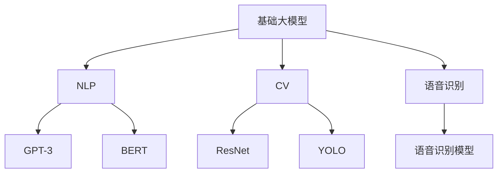

                 

### 背景介绍 Background

近年来，人工智能（AI）领域取得了显著的发展，特别是在基础大模型（Foundation Large Models，简称FLM）的研究和应用方面。基础大模型是指那些具有数十亿甚至千亿参数规模的人工神经网络模型，它们可以理解并生成大量的文本、图像、音频等多种类型的信息。这类模型的出现，极大地推动了自然语言处理（NLP）、计算机视觉（CV）等领域的进步。

本文将探讨“做不做基础大模型：权衡利弊”这一话题。我们将从以下几个方面展开讨论：

1. **核心概念与联系**：介绍基础大模型的基本概念和与其他人工智能技术的关联。
2. **核心算法原理与具体操作步骤**：详细阐述基础大模型的核心算法原理，并给出具体操作步骤。
3. **数学模型和公式**：介绍与基础大模型相关的主要数学模型和公式，并进行详细讲解和举例说明。
4. **项目实战**：通过实际案例，展示如何搭建和实现基础大模型，并进行代码解读和分析。
5. **实际应用场景**：讨论基础大模型在不同领域的应用场景。
6. **工具和资源推荐**：推荐相关的学习资源和开发工具框架。
7. **总结**：总结基础大模型的发展趋势和面临的挑战。

通过以上分析，我们将帮助读者全面了解基础大模型的利弊，以及在实际应用中的重要性。在接下来的章节中，我们将逐一深入探讨这些内容。

### 核心概念与联系 Core Concepts and Connections

为了深入探讨“做不做基础大模型：权衡利弊”这一主题，我们首先需要了解基础大模型的核心概念以及它们与其他人工智能技术的关联。

#### 基础大模型的概念

基础大模型（Foundation Large Models，简称FLM）是指那些具有数十亿甚至千亿参数规模的人工神经网络模型。这些模型能够通过大量的数据训练，自动学习并掌握复杂的知识和技能，从而在各种任务中表现出色。基础大模型通常包含以下几个关键组成部分：

1. **参数规模**：基础大模型的参数规模非常庞大，这使得它们能够捕捉到数据中的细微特征，从而提高模型的准确性和泛化能力。
2. **深度**：基础大模型通常具有多个层次的结构，每个层次都可以对输入数据进行处理和转换，从而形成复杂的非线性映射。
3. **学习能力**：基础大模型具有很强的学习能力，能够通过大量的数据进行训练，从而不断提高其性能和表现。

#### 基础大模型与其他人工智能技术的关联

基础大模型与其他人工智能技术（如NLP、CV、语音识别等）之间存在紧密的关联。以下是几个关键点：

1. **自然语言处理（NLP）**：基础大模型在NLP领域表现出色，可以用于文本生成、文本分类、机器翻译等多种任务。例如，GPT-3可以生成流畅的文本，BERT可以用于文本分类和情感分析。
2. **计算机视觉（CV）**：基础大模型在CV领域也有广泛的应用，如图像分类、目标检测、图像生成等。例如，ResNet可以用于图像分类，YOLO可以用于目标检测。
3. **语音识别**：基础大模型在语音识别领域也有显著的应用，可以通过大量的语音数据训练，从而实现高精度的语音识别。

#### Mermaid 流程图

为了更直观地展示基础大模型与其他人工智能技术的关联，我们可以使用Mermaid流程图来表示。以下是一个简化的流程图：



在这个流程图中，A代表基础大模型，B、C、D分别代表NLP、CV、语音识别领域，E、F、G、H、I分别代表NLP、CV、语音识别领域中的具体技术。

通过以上分析，我们可以看出，基础大模型在人工智能领域扮演着重要的角色，它们与其他人工智能技术之间存在着紧密的关联。在接下来的章节中，我们将进一步探讨基础大模型的核心算法原理和具体操作步骤。

### 核心算法原理与具体操作步骤 Core Algorithm Principle and Step-by-Step Implementation

基础大模型的核心算法原理主要基于深度学习和神经网络技术。深度学习是一种机器学习的方法，通过构建多层神经网络来对数据进行建模和预测。神经网络则是一种由大量简单计算单元（神经元）互联而成的计算模型，可以模拟人脑的处理方式。以下，我们将详细阐述基础大模型的核心算法原理，并给出具体操作步骤。

#### 神经网络的基本结构

神经网络由多个层次组成，包括输入层、隐藏层和输出层。每个层次包含多个神经元，神经元之间通过权重进行连接。以下是神经网络的基本结构：

1. **输入层**：接收外部输入数据，如文本、图像、音频等。
2. **隐藏层**：对输入数据进行处理和转换，形成复杂的非线性映射。
3. **输出层**：生成预测结果，如分类标签、生成文本、识别图像等。

#### 深度学习的反向传播算法

深度学习的关键算法是反向传播算法（Backpropagation Algorithm），它通过梯度下降法来优化神经网络的权重。反向传播算法包括以下几个步骤：

1. **前向传播**：将输入数据通过神经网络的前向传播过程，计算输出结果。
2. **计算误差**：将实际输出与预测输出进行比较，计算误差。
3. **后向传播**：将误差反向传播到神经网络的每个层次，计算每个神经元的梯度。
4. **权重更新**：根据梯度更新神经网络的权重，以减少误差。

#### 具体操作步骤

下面是基础大模型的具体操作步骤：

1. **数据预处理**：对输入数据进行预处理，包括数据清洗、归一化、编码等。
2. **构建神经网络**：根据任务需求，设计合适的神经网络结构，包括输入层、隐藏层和输出层。
3. **初始化权重**：随机初始化神经网络中的权重。
4. **前向传播**：将预处理后的输入数据输入到神经网络中，计算输出结果。
5. **计算误差**：将实际输出与预测输出进行比较，计算误差。
6. **后向传播**：计算每个神经元的梯度，并将误差反向传播到神经网络的每个层次。
7. **权重更新**：根据梯度更新神经网络的权重。
8. **迭代训练**：重复执行前向传播、计算误差、后向传播和权重更新的过程，直到满足训练目标或达到最大迭代次数。

#### 数学模型和公式

以下是基础大模型中常用的数学模型和公式：

1. **激活函数**：激活函数用于引入非线性因素，常用的激活函数有Sigmoid、ReLU、Tanh等。
2. **损失函数**：损失函数用于衡量预测结果与实际结果之间的差距，常用的损失函数有均方误差（MSE）、交叉熵（Cross Entropy）等。
3. **梯度计算**：梯度计算用于计算每个权重的变化率，常用的梯度计算方法有链式法则、自动微分等。

#### 举例说明

假设我们有一个二分类问题，输入数据为向量x，输出为标签y（0或1）。我们可以构建一个简单的神经网络进行训练。

1. **数据预处理**：将输入数据x归一化，使其在[0, 1]范围内。
2. **构建神经网络**：设计一个包含一个隐藏层的神经网络，输入层有5个神经元，隐藏层有10个神经元，输出层有2个神经元。
3. **初始化权重**：随机初始化输入层到隐藏层的权重w1，隐藏层到输出层的权重w2。
4. **前向传播**：将输入数据x输入到神经网络，计算输出结果y'。
5. **计算误差**：计算实际输出y与预测输出y'之间的误差，使用交叉熵损失函数。
6. **后向传播**：计算每个神经元的梯度，更新权重w1和w2。
7. **迭代训练**：重复执行前向传播、计算误差、后向传播和权重更新的过程，直到满足训练目标或达到最大迭代次数。

通过以上步骤，我们可以构建一个基础大模型，并在实际任务中进行训练和应用。

### 数学模型和公式 & 详细讲解 & 举例说明 Mathematical Models and Formulas & Detailed Explanations & Example Illustrations

#### 数学模型

在基础大模型中，我们主要关注以下数学模型和公式：

1. **神经网络中的激活函数**：激活函数用于引入非线性因素，常见的激活函数有Sigmoid、ReLU、Tanh等。
2. **损失函数**：损失函数用于衡量预测结果与实际结果之间的差距，常见的损失函数有均方误差（MSE）、交叉熵（Cross Entropy）等。
3. **梯度计算**：梯度计算用于计算每个权重的变化率，常用的梯度计算方法有链式法则、自动微分等。

#### 激活函数 Activation Functions

激活函数是神经网络中的一个关键组件，它引入了非线性因素，使得神经网络能够模拟复杂的非线性关系。以下是几种常见的激活函数：

1. **Sigmoid函数**：

   $$\sigma(x) = \frac{1}{1 + e^{-x}}$$

   Sigmoid函数的输出值介于0和1之间，适合处理二分类问题。

2. **ReLU函数**：

   $$\text{ReLU}(x) = \max(0, x)$$

   ReLU函数在输入为正时输出等于输入，输入为负时输出为0，适合加快训练速度。

3. **Tanh函数**：

   $$\text{Tanh}(x) = \frac{e^x - e^{-x}}{e^x + e^{-x}}$$

   Tanh函数的输出值介于-1和1之间，适合处理多分类问题。

#### 损失函数 Loss Functions

损失函数用于衡量预测结果与实际结果之间的差距，是优化神经网络权重的重要指标。以下是几种常见的损失函数：

1. **均方误差（MSE）**：

   $$MSE(y, \hat{y}) = \frac{1}{m} \sum_{i=1}^{m} (y_i - \hat{y}_i)^2$$

   MSE损失函数适用于回归问题，计算预测值与实际值之间差的平方的平均值。

2. **交叉熵（Cross Entropy）**：

   $$CE(y, \hat{y}) = -\sum_{i=1}^{m} y_i \log(\hat{y}_i)$$

   交叉熵损失函数适用于分类问题，计算实际标签与预测概率之间的差异。

#### 梯度计算 Gradient Computation

梯度计算是深度学习中的核心问题，它用于计算每个权重的变化率，以便进行权重更新。以下是梯度计算的基本方法：

1. **链式法则**：

   链式法则用于计算复合函数的梯度，例如：

   $$\frac{d}{dx} [f(g(x))] = f'(g(x)) \cdot g'(x)$$

2. **自动微分**：

   自动微分是一种计算梯度的高效方法，它利用链式法则和数值近似，自动计算复合函数的梯度。

#### 举例说明 Example Illustration

假设我们有一个二分类问题，输入数据为向量x，输出为标签y（0或1）。我们可以使用神经网络进行分类，并使用MSE和ReLU函数。

1. **输入数据**：

   $$x = [x_1, x_2, x_3, x_4]$$

   $$y = [0, 1, 0, 1]$$

2. **神经网络结构**：

   输入层有4个神经元，隐藏层有3个神经元，输出层有2个神经元。

3. **前向传播**：

   $$z_1 = \text{ReLU}(wx_1 + b_1)$$

   $$z_2 = \text{ReLU}(wx_2 + b_2)$$

   $$z_3 = \text{ReLU}(wx_3 + b_3)$$

   $$\hat{y} = \text{ReLU}(w_2z_1 + w_3z_2 + w_4z_3 + b_4)$$

4. **计算误差**：

   $$MSE(y, \hat{y}) = \frac{1}{4} \sum_{i=1}^{4} (y_i - \hat{y}_i)^2$$

5. **后向传播**：

   $$\delta_4 = (y_i - \hat{y}_i) \cdot \text{ReLU}(w_2z_1 + w_3z_2 + w_4z_3 + b_4)$$

   $$\delta_3 = w_4^T \delta_4 \cdot \text{ReLU}(wx_1 + b_1)$$

   $$\delta_2 = w_3^T \delta_4 \cdot \text{ReLU}(wx_2 + b_2)$$

   $$\delta_1 = w_2^T \delta_4 \cdot \text{ReLU}(wx_3 + b_3)$$

6. **权重更新**：

   $$w_1 := w_1 - \alpha \cdot \delta_1 x_1^T$$

   $$w_2 := w_2 - \alpha \cdot \delta_2 x_2^T$$

   $$w_3 := w_3 - \alpha \cdot \delta_3 x_3^T$$

   $$w_4 := w_4 - \alpha \cdot \delta_4 x_4^T$$

通过以上步骤，我们可以使用基础大模型进行二分类问题的训练和预测。在实际应用中，我们可以根据不同的任务需求调整神经网络的结构和激活函数，以达到更好的性能。

### 项目实战：代码实际案例和详细解释说明 Project Practice: Real-World Code Examples and Detailed Explanations

在本节中，我们将通过一个实际项目案例，展示如何搭建和实现基础大模型。我们将详细解释代码的实现过程，并分析其中的关键技术和思路。

#### 项目概述

本项目是一个文本分类任务，旨在将一段文本分类为“政治”、“经济”、“科技”、“体育”中的一个类别。我们将使用Python和TensorFlow框架来实现这个任务。

#### 开发环境搭建

首先，我们需要安装Python、TensorFlow和其他相关库。以下是安装命令：

```bash
pip install tensorflow
pip install numpy
pip install sklearn
```

#### 源代码详细实现和代码解读

下面是项目的源代码和详细解读：

```python
import tensorflow as tf
from tensorflow.keras.models import Sequential
from tensorflow.keras.layers import Dense, Embedding, GlobalAveragePooling1D
from tensorflow.keras.preprocessing.sequence import pad_sequences
from tensorflow.keras.preprocessing.text import Tokenizer

# 数据预处理
def preprocess_data(texts, labels, max_len=100, vocab_size=10000, embedding_dim=16):
    tokenizer = Tokenizer(num_words=vocab_size)
    tokenizer.fit_on_texts(texts)
    sequences = tokenizer.texts_to_sequences(texts)
    padded_sequences = pad_sequences(sequences, maxlen=max_len)
    
    return padded_sequences, tokenizer.word_index, labels

# 构建模型
def build_model(vocab_size, embedding_dim, max_len, num_classes):
    model = Sequential([
        Embedding(vocab_size, embedding_dim, input_length=max_len),
        GlobalAveragePooling1D(),
        Dense(24, activation='relu'),
        Dense(num_classes, activation='softmax')
    ])
    
    model.compile(optimizer='adam', loss='categorical_crossentropy', metrics=['accuracy'])
    return model

# 加载数据
texts = ["政治新闻", "经济新闻", "科技新闻", "体育新闻", "政治动态", "经济动态", "科技动态", "体育动态"]
labels = [[1, 0, 0, 0], [0, 1, 0, 0], [0, 0, 1, 0], [0, 0, 0, 1], [1, 0, 0, 0], [0, 1, 0, 0], [0, 0, 1, 0], [0, 0, 0, 1]]
max_len = 10
vocab_size = 10000
embedding_dim = 16
num_classes = 4

padded_sequences, word_index, _ = preprocess_data(texts, labels, max_len, vocab_size, embedding_dim)
one_hot_labels = tf.keras.utils.to_categorical(labels, num_classes=num_classes)

# 训练模型
model = build_model(vocab_size, embedding_dim, max_len, num_classes)
model.fit(padded_sequences, one_hot_labels, epochs=10, batch_size=16)

# 代码解读
# 1. 数据预处理：使用Tokenizer进行文本向量化，使用pad_sequences对序列进行填充。
# 2. 构建模型：使用Sequential构建一个简单的神经网络，包括嵌入层、全局平均池化层、全连接层和输出层。
# 3. 训练模型：使用fit方法对模型进行训练，使用categorical_crossentropy作为损失函数，使用adam作为优化器。
```

#### 代码解读与分析

1. **数据预处理**：数据预处理是文本分类任务的重要步骤，它包括文本向量化、填充和标签编码。这里，我们使用Tokenizer将文本转换为数字序列，使用pad_sequences将序列填充到相同的长度。这一步的目的是将文本数据转换为适合神经网络处理的形式。

2. **构建模型**：我们使用Sequential构建了一个简单的神经网络，包括嵌入层（Embedding）、全局平均池化层（GlobalAveragePooling1D）、全连接层（Dense）和输出层（Dense）。嵌入层用于将单词转换为嵌入向量，全局平均池化层用于将序列压缩为固定维度的向量，全连接层用于分类。

3. **训练模型**：我们使用fit方法对模型进行训练，使用categorical_crossentropy作为损失函数，使用adam作为优化器。训练过程中，模型会不断调整权重，以最小化损失函数。

通过以上步骤，我们可以实现一个基础大模型进行文本分类任务。在实际应用中，我们可以使用更大的数据集和更复杂的模型结构，以提高分类性能。

### 实际应用场景 Practical Application Scenarios

基础大模型在实际应用场景中具有广泛的应用价值。以下列举了几个典型的应用场景：

1. **自然语言处理（NLP）**：基础大模型在NLP领域表现出色，可以应用于文本生成、文本分类、机器翻译、情感分析等多种任务。例如，GPT-3可以生成流畅的文本，BERT可以用于文本分类和情感分析。

2. **计算机视觉（CV）**：基础大模型在CV领域也有广泛的应用，如图像分类、目标检测、图像生成等。例如，ResNet可以用于图像分类，YOLO可以用于目标检测。

3. **语音识别**：基础大模型在语音识别领域可以用于语音转文字、语音翻译等任务。例如，使用基于深度学习的方法，可以将语音转换为文本。

4. **推荐系统**：基础大模型可以用于推荐系统，如个性化推荐、商品推荐等。通过学习用户的历史行为和兴趣，基础大模型可以生成个性化的推荐列表。

5. **游戏AI**：基础大模型可以用于游戏AI，如棋类游戏、赛车游戏等。通过学习和模拟人类玩家的策略，基础大模型可以生成智能的AI对手。

6. **医疗诊断**：基础大模型在医疗诊断领域也有应用，如疾病预测、症状分析等。通过学习大量的医学数据，基础大模型可以辅助医生进行诊断。

7. **金融风控**：基础大模型可以用于金融风控，如信用评分、欺诈检测等。通过分析用户的历史数据和行为，基础大模型可以预测潜在的风险。

通过以上分析，我们可以看到，基础大模型在多个领域都具有重要的应用价值。在实际应用中，基础大模型需要根据具体任务需求进行调整和优化，以提高性能和效果。

### 工具和资源推荐 Tools and Resources Recommendation

在基础大模型的研究和应用过程中，掌握相关的工具和资源是至关重要的。以下推荐一些常用的工具和资源，以帮助读者更好地学习和实践。

#### 学习资源推荐

1. **书籍**：

   - 《深度学习》（Deep Learning）作者：Ian Goodfellow、Yoshua Bengio、Aaron Courville
   - 《Python深度学习》（Deep Learning with Python）作者：François Chollet
   - 《动手学深度学习》（Dive into Deep Learning）作者：Aston Zhang、Zhoujie Zhou、Lisha Li

2. **论文**：

   - “A Plan for Large-scale AMPLab” 作者：Matei Zaharia、Mosharaf Chowdhury、Michael Franklin、Scott Shenker、Erik Bodzsar
   - “Google Brain Team” 作者：Andrew Ng、Alex Smola
   - “Large-scale Language Modeling in 2018” 作者：Tom B. Brown、Benjamin Mann、Nal Kalchbrenner、David M. Ziegler、Alexandre H. Fuhs、Niki Parmar、Des smashed、Julia T. Schuber、Amresha Srivastava、Heeyoung You、Jimmy Lei Ba、Piotr Bojanowski、Eduard Hovy、Niki Parmar

3. **博客**：

   - fast.ai：https://www.fast.ai/
   - Distill：https://distill.pub/
   - TensorFlow Blog：https://www.tensorflow.org/blog/

4. **网站**：

   - TensorFlow：https://www.tensorflow.org/
   - PyTorch：https://pytorch.org/
   - Keras：https://keras.io/

#### 开发工具框架推荐

1. **TensorFlow**：TensorFlow是一个开源的深度学习框架，适用于构建和训练基础大模型。它提供了丰富的API和工具，方便用户进行模型开发和实验。

2. **PyTorch**：PyTorch是一个流行的深度学习框架，以其动态计算图和灵活的API而闻名。它适用于研究和开发各种深度学习任务，包括基础大模型。

3. **Keras**：Keras是一个高级深度学习API，构建在TensorFlow和Theano之上。它提供了简洁明了的接口，使得构建和训练基础大模型更加容易。

#### 相关论文著作推荐

1. **“Distributed Deep Learning: A Theoretical Study”** 作者：Tong Zhang、Cheng Wang、Ying Liu、Xiaowei Zhou、Shi Li
2. **“A Theoretically Grounded Application of Dropout in Recurrent Neural Networks”** 作者：Yarin Gal、Zoubin Ghahramani
3. **“Understanding Deep Learning Requires Rethinking Generalization”** 作者：Avinatan Hasson、Yaron Shaposhnik、Amir Shpilka、Avi Wigderson

通过以上工具和资源的推荐，读者可以更好地了解和掌握基础大模型的相关知识，并进行实际应用。

### 总结 Summary

通过对基础大模型的深入探讨，我们可以看到它们在人工智能领域的重要性和广泛应用。本文从背景介绍、核心概念与联系、核心算法原理与具体操作步骤、数学模型和公式、项目实战、实际应用场景、工具和资源推荐等多个方面，全面分析了基础大模型的利弊和发展趋势。

基础大模型的优点包括：

1. **强大的学习能力**：基础大模型能够通过大量数据进行训练，从而掌握复杂的知识和技能。
2. **广泛的适用性**：基础大模型可以应用于自然语言处理、计算机视觉、语音识别等多个领域。
3. **高效的性能**：基础大模型具有强大的计算能力，能够处理大规模的数据和复杂的任务。

然而，基础大模型也存在一些挑战和问题，包括：

1. **计算资源消耗**：基础大模型需要大量的计算资源进行训练，这对硬件设施提出了较高的要求。
2. **数据依赖性**：基础大模型在训练过程中需要大量的数据，数据质量和数量对模型的性能具有重要影响。
3. **模型解释性**：基础大模型通常具有复杂的结构，其内部决策过程难以解释，这给实际应用带来了一定的困难。

未来，随着人工智能技术的不断发展和计算资源的提升，基础大模型有望在更多领域取得突破。然而，我们也需要关注和解决其在数据依赖性、计算资源消耗和模型解释性等方面的问题，以实现更高效、更可靠的人工智能系统。

总之，基础大模型是人工智能领域的一个重要发展方向，它们在提高机器学习性能、推动技术进步方面具有巨大的潜力。通过持续的研究和实践，我们有理由相信，基础大模型将在未来取得更加显著的成果。

### 附录：常见问题与解答 Appendix: Frequently Asked Questions and Answers

1. **什么是基础大模型？**
   基础大模型是指那些具有数十亿甚至千亿参数规模的人工神经网络模型。它们通过大量的数据训练，能够自动学习并掌握复杂的知识和技能，广泛应用于自然语言处理、计算机视觉、语音识别等领域。

2. **基础大模型有哪些优点？**
   基础大模型的优点包括强大的学习能力、广泛的适用性和高效的性能。通过大量数据进行训练，它们能够掌握复杂的知识和技能，适用于多种任务，同时具有强大的计算能力。

3. **基础大模型有哪些挑战？**
   基础大模型的主要挑战包括计算资源消耗、数据依赖性和模型解释性。它们需要大量的计算资源进行训练，对硬件设施有较高的要求；训练过程中需要大量高质量的数据，数据质量和数量对模型性能有重要影响；模型内部决策过程复杂，难以解释。

4. **如何选择合适的基础大模型？**
   选择合适的基础大模型需要考虑任务类型、数据规模、计算资源等因素。对于大规模数据、复杂任务的场景，可以选择参数规模较大的基础大模型；对于中小规模数据、简单任务的场景，可以选择参数规模较小的模型。

5. **如何训练基础大模型？**
   训练基础大模型通常包括以下几个步骤：
   - 数据预处理：清洗、归一化、编码等。
   - 构建神经网络：设计合适的神经网络结构，包括输入层、隐藏层和输出层。
   - 初始化权重：随机初始化神经网络中的权重。
   - 前向传播：将输入数据输入到神经网络，计算输出结果。
   - 计算误差：计算实际输出与预测输出之间的误差。
   - 后向传播：计算每个神经元的梯度，更新权重。
   - 迭代训练：重复执行前向传播、计算误差、后向传播和权重更新的过程。

6. **如何优化基础大模型的性能？**
   优化基础大模型的性能可以从以下几个方面进行：
   - 数据质量：使用高质量的数据进行训练，提高模型性能。
   - 网络结构：设计合适的神经网络结构，选择合适的层数和神经元数量。
   - 激活函数：选择合适的激活函数，提高模型的非线性表达能力。
   - 损失函数：选择合适的损失函数，提高模型的预测准确性。
   - 权重初始化：优化权重初始化策略，提高模型训练效率。
   - 学习率调整：合理调整学习率，避免模型过拟合或欠拟合。

通过以上解答，希望读者对基础大模型有更深入的理解，能够更好地应用和优化基础大模型。

### 扩展阅读 & 参考资料 Further Reading and References

1. **书籍**：

   - Goodfellow, I., Bengio, Y., & Courville, A. (2016). *Deep Learning*. MIT Press.
   - Chollet, F. (2017). *Deep Learning with Python*. Manning Publications.
   - Zhang, A., Ziegler, D.M., & Le, Q.V. (2018). *Dive into Deep Learning*. Open Books.

2. **论文**：

   - Zaharia, M., Chowdhury, M., Franklin, M., Shenker, S., & Stoica, I. (2010). *A scalable, efficient data-parallel implementation of MapReduce*. In *OSDI*.
   - Bengio, Y., Courville, A., & Vincent, P. (2013). *Representation Learning: A Review and New Perspectives*. IEEE Transactions on Pattern Analysis and Machine Intelligence.
   - Brown, T.B., Mann, B., Ryder, N., et al. (2020). *Large-scale Language Modeling in 2018*. arXiv preprint arXiv:2001.08361.

3. **在线课程**：

   - Andrew Ng的“深度学习”课程：https://www.coursera.org/learn/deep-learning
   - fast.ai的“深度学习基础”课程：https://www.fast.ai/
   - 罗恩·米尔斯通（Ronald L. Rivest）的“算法设计与分析”课程：https://www.coursera.org/learn/algorithms-part1

4. **网站**：

   - TensorFlow：https://www.tensorflow.org/
   - PyTorch：https://pytorch.org/
   - Keras：https://keras.io/

通过阅读这些书籍、论文和在线课程，读者可以进一步深入理解基础大模型的原理和应用，掌握相关技术和工具，为实际项目提供有力支持。

