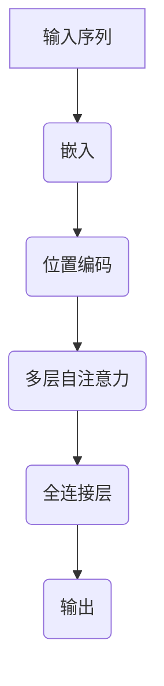

                 

# 做不做基础大模型：权衡利弊

> **关键词**：基础大模型，人工智能，利弊分析，技术发展，应用场景

> **摘要**：本文将探讨基础大模型（如GPT-3、ChatGPT等）在人工智能领域的重要性，分析其优势与劣势，并探讨其未来发展趋势。通过对基础大模型的深入研究，帮助读者了解这一技术领域的前沿动态，为企业和开发者提供有益的参考。

## 1. 背景介绍

随着人工智能技术的快速发展，深度学习和神经网络模型在各个领域取得了显著成果。然而，这些模型往往需要大量的数据和计算资源进行训练。为了提高模型的性能和泛化能力，基础大模型应运而生。基础大模型是指具有巨大参数量和广泛知识储备的模型，如GPT-3、ChatGPT等。它们在自然语言处理、计算机视觉、语音识别等众多领域取得了突破性进展，引发了学术界和工业界的高度关注。

然而，基础大模型的研发和应用并非一帆风顺，其背后涉及诸多技术挑战和伦理问题。本文将从以下几个方面展开讨论：首先，我们将介绍基础大模型的核心概念及其发展历程；然后，分析基础大模型的优势与劣势；接着，探讨基础大模型在实际应用中的挑战与机遇；最后，预测基础大模型的未来发展趋势与挑战。

## 2. 核心概念与联系

### 2.1 基础大模型的概念

基础大模型是指具有巨大参数量和广泛知识储备的神经网络模型，通常采用深度学习技术进行训练。这类模型通过从大量数据中学习，逐渐提升自身的能力，从而实现自动推理、生成和预测等复杂任务。

### 2.2 基础大模型的发展历程

近年来，基础大模型的发展经历了以下几个阶段：

- **2018年**：GPT-2发布，标志着基础大模型的诞生。GPT-2具有1.5亿个参数，能够生成连贯的自然语言文本。

- **2020年**：GPT-3发布，拥有超过1750亿个参数，成为当时世界上最大的语言模型。GPT-3在多个自然语言处理任务中取得了优异的成绩，引发了广泛关注。

- **2022年**：ChatGPT发布，基于GPT-3模型，实现了更为出色的对话生成能力。ChatGPT在多个对话系统评测中取得了领先成绩，展示了基础大模型在自然语言处理领域的巨大潜力。

### 2.3 基础大模型的架构

基础大模型通常采用Transformer架构，这是一种基于自注意力机制的神经网络模型。自注意力机制使得模型能够自动学习输入序列中的关系，从而提高模型的性能。

#### Mermaid 流程图：



### 2.4 基础大模型与其他技术的联系

基础大模型与其他技术（如深度学习、自然语言处理、计算机视觉等）密切相关。深度学习为基础大模型的训练提供了强大的工具，自然语言处理和计算机视觉则为基础大模型的应用提供了广泛场景。通过结合这些技术，基础大模型能够实现更高效、更智能的人工智能系统。

## 3. 核心算法原理 & 具体操作步骤

### 3.1 核心算法原理

基础大模型的核心算法是基于Transformer架构的自注意力机制。自注意力机制通过计算输入序列中每个元素与其他元素之间的相似性，实现对输入序列的编码和解析。这种机制使得模型能够自动学习输入序列中的关系，从而提高模型的性能。

### 3.2 具体操作步骤

#### 步骤1：嵌入（Embedding）

首先，将输入序列（如单词、图像等）转化为固定长度的向量表示。这一步骤称为嵌入。嵌入向量包含了输入序列的语义信息。

$$
x = W_x \cdot x + b_x
$$

其中，$W_x$为权重矩阵，$b_x$为偏置项。

#### 步骤2：位置编码（Positional Encoding）

由于自注意力机制无法直接处理序列的位置信息，需要通过位置编码为每个嵌入向量添加位置信息。位置编码通常采用 sinusoidal 函数实现。

$$
PE_{(i, d)} = 
\begin{cases}
    \sin\left(\frac{i}{10000^{2d/模型维度}}\right) & , \text{如果 } d < \text{模型维度} / 2 \\
    \cos\left(\frac{i}{10000^{2d/模型维度}}\right) & , \text{如果 } d \geq \text{模型维度} / 2
\end{cases}
$$

其中，$i$为位置索引，$d$为维度。

#### 步骤3：多层自注意力（Multi-head Self-Attention）

自注意力机制通过计算输入序列中每个元素与其他元素之间的相似性，实现对输入序列的编码和解析。具体地，自注意力机制包括以下几个步骤：

1. **计算自注意力得分**：

$$
\text{Score}_{(i, j)} = 
\begin{cases}
    Q_i^T A_j & , \text{单头自注意力} \\
    \text{Concat}(\text{Score}_{(i, j)}^{(1)}, ..., \text{Score}_{(i, j)}^{(h)}) & , \text{多头自注意力}
\end{cases}
$$

其中，$Q_i$和$A_j$分别为查询向量和键向量，$h$为头数。

2. **计算自注意力权重**：

$$
\text{Weight}_{(i, j)} = 
\begin{cases}
    \frac{\exp(\text{Score}_{(i, j)})}{\sqrt{d_k}} & , \text{单头自注意力} \\
    \text{softmax}(\text{Score}_{(i, j)}^{(1)}, ..., \text{Score}_{(i, j)}^{(h)}) & , \text{多头自注意力}
\end{cases}
$$

其中，$d_k$为键向量的维度。

3. **计算自注意力输出**：

$$
\text{Output}_{(i)} = 
\begin{cases}
    \text{Weight}_{(i, j)} A_j & , \text{单头自注意力} \\
    \text{Concat}(\text{Weight}_{(i, j)} A_j^{(1)}, ..., \text{Weight}_{(i, j)} A_j^{(h)}) & , \text{多头自注意力}
\end{cases}
$$

其中，$A_j$为键向量。

#### 步骤4：全连接层（Feedforward）

在自注意力之后，基础大模型通过一个全连接层对自注意力输出进行进一步处理。具体地，全连接层由两个线性变换组成：

$$
\text{Output}_{(i)} = 
\begin{cases}
    \text{ReLU}(W_1 \cdot \text{Output}_{(i)} + b_1) & , \text{第一层全连接} \\
    W_2 \cdot \text{ReLU}(W_1 \cdot \text{Output}_{(i)} + b_1) + b_2 & , \text{第二层全连接}
\end{cases}
$$

其中，$W_1$和$W_2$分别为权重矩阵，$b_1$和$b_2$分别为偏置项。

#### 步骤5：层次叠加（Stacking）

基础大模型通常包含多个层次的自注意力和全连接层，通过层次叠加的方式提高模型的性能。每个层次的自注意力和全连接层都对输入序列进行编码和解析，使得模型能够逐渐提取更高层次的特征。

## 4. 数学模型和公式 & 详细讲解 & 举例说明

### 4.1 数学模型

基础大模型的核心数学模型包括嵌入、位置编码、自注意力和全连接层。以下分别对这些模型进行详细讲解。

#### 4.1.1 嵌入

嵌入（Embedding）是将输入序列（如单词、图像等）转化为固定长度的向量表示。在基础大模型中，嵌入是一个线性变换，将输入序列映射到高维空间。

$$
x = W_x \cdot x + b_x
$$

其中，$W_x$为权重矩阵，$b_x$为偏置项。

#### 4.1.2 位置编码

位置编码（Positional Encoding）为每个嵌入向量添加位置信息。在基础大模型中，位置编码采用 sinusoidal 函数实现。

$$
PE_{(i, d)} = 
\begin{cases}
    \sin\left(\frac{i}{10000^{2d/模型维度}}\right) & , \text{如果 } d < \text{模型维度} / 2 \\
    \cos\left(\frac{i}{10000^{2d/模型维度}}\right) & , \text{如果 } d \geq \text{模型维度} / 2
\end{cases}
$$

其中，$i$为位置索引，$d$为维度。

#### 4.1.3 自注意力

自注意力（Self-Attention）是基础大模型的核心模块，通过计算输入序列中每个元素与其他元素之间的相似性，实现对输入序列的编码和解析。自注意力包括以下三个步骤：

1. **计算自注意力得分**：

$$
\text{Score}_{(i, j)} = Q_i^T A_j
$$

其中，$Q_i$为查询向量，$A_j$为键向量。

2. **计算自注意力权重**：

$$
\text{Weight}_{(i, j)} = 
\frac{\exp(\text{Score}_{(i, j)})}{\sqrt{d_k}}
$$

其中，$d_k$为键向量的维度。

3. **计算自注意力输出**：

$$
\text{Output}_{(i)} = \text{Weight}_{(i, j)} A_j
$$

#### 4.1.4 全连接层

全连接层（Feedforward）是对自注意力输出进行进一步处理。全连接层由两个线性变换组成：

$$
\text{Output}_{(i)} = 
\text{ReLU}(W_1 \cdot \text{Output}_{(i)} + b_1)
$$

$$
\text{Output}_{(i)} = W_2 \cdot \text{ReLU}(W_1 \cdot \text{Output}_{(i)} + b_1) + b_2
$$

其中，$W_1$和$W_2$分别为权重矩阵，$b_1$和$b_2$分别为偏置项。

### 4.2 举例说明

假设我们有一个包含10个单词的输入序列，每个单词的嵌入维度为128。我们需要通过基础大模型对其进行编码和解析。

#### 4.2.1 嵌入

首先，我们将每个单词映射到一个128维的嵌入向量。假设我们使用预训练的嵌入矩阵$W_x$，偏置项为$b_x$。

$$
x = W_x \cdot x + b_x
$$

#### 4.2.2 位置编码

接着，我们对每个嵌入向量添加位置编码。假设我们使用 sinusoidal 函数实现位置编码，维度为128。

$$
PE_{(i, d)} = 
\begin{cases}
    \sin\left(\frac{i}{10000^{2d/128}}\right) & , \text{如果 } d < 64 \\
    \cos\left(\frac{i}{10000^{2d/128}}\right) & , \text{如果 } d \geq 64
\end{cases}
$$

#### 4.2.3 自注意力

接下来，我们通过自注意力机制对输入序列进行编码。假设我们使用单头自注意力，权重矩阵为$Q_i$和$A_j$。

1. **计算自注意力得分**：

$$
\text{Score}_{(i, j)} = Q_i^T A_j
$$

2. **计算自注意力权重**：

$$
\text{Weight}_{(i, j)} = 
\frac{\exp(\text{Score}_{(i, j)})}{\sqrt{d_k}}
$$

3. **计算自注意力输出**：

$$
\text{Output}_{(i)} = \text{Weight}_{(i, j)} A_j
$$

#### 4.2.4 全连接层

最后，我们通过全连接层对自注意力输出进行进一步处理。假设我们使用两个全连接层，权重矩阵为$W_1$和$W_2$，偏置项为$b_1$和$b_2$。

$$
\text{Output}_{(i)} = 
\text{ReLU}(W_1 \cdot \text{Output}_{(i)} + b_1)
$$

$$
\text{Output}_{(i)} = W_2 \cdot \text{ReLU}(W_1 \cdot \text{Output}_{(i)} + b_1) + b_2
$$

通过这些步骤，基础大模型能够对输入序列进行编码和解析，从而实现自动推理、生成和预测等复杂任务。

## 5. 项目实战：代码实际案例和详细解释说明

### 5.1 开发环境搭建

在进行基础大模型的项目实战之前，我们需要搭建一个适合开发和训练的环境。以下是一个基本的开发环境搭建步骤：

1. 安装Python环境：在本地计算机上安装Python，版本建议为3.8或更高版本。

2. 安装TensorFlow：使用pip命令安装TensorFlow。

   ```bash
   pip install tensorflow
   ```

3. 安装其他依赖：根据项目需求，安装其他相关库，如numpy、pandas等。

   ```bash
   pip install numpy pandas
   ```

4. 准备训练数据：从公开数据集或自定义数据集获取训练数据，并进行预处理。

### 5.2 源代码详细实现和代码解读

以下是一个简单的基于TensorFlow实现的基础大模型代码示例：

```python
import tensorflow as tf
from tensorflow.keras.layers import Embedding, LSTM, Dense
from tensorflow.keras.models import Sequential

# 设置超参数
vocab_size = 10000
embed_size = 128
lstm_size = 128
batch_size = 64
epochs = 10

# 构建模型
model = Sequential()
model.add(Embedding(vocab_size, embed_size))
model.add(LSTM(lstm_size, return_sequences=True))
model.add(Dense(vocab_size, activation='softmax'))

# 编译模型
model.compile(optimizer='adam', loss='categorical_crossentropy', metrics=['accuracy'])

# 训练模型
model.fit(train_data, train_labels, batch_size=batch_size, epochs=epochs)
```

#### 5.2.1 代码解读

1. **导入库**：首先，我们导入TensorFlow和相关库。

2. **设置超参数**：接着，我们设置模型的超参数，如词汇表大小、嵌入维度、LSTM单元大小等。

3. **构建模型**：使用`Sequential`模型构建一个序列模型。首先添加嵌入层，然后添加LSTM层，最后添加全连接层。

4. **编译模型**：使用`compile`方法编译模型，设置优化器和损失函数。

5. **训练模型**：使用`fit`方法训练模型，输入训练数据和标签。

### 5.3 代码解读与分析

1. **嵌入层**：嵌入层将词汇表中的每个单词映射到一个固定长度的向量。在本例中，嵌入层的词汇表大小为10000，嵌入维度为128。

2. **LSTM层**：LSTM层是模型的核心，用于处理序列数据。在本例中，LSTM单元大小为128，且设置为返回序列输出。

3. **全连接层**：全连接层用于对LSTM层的输出进行分类。在本例中，全连接层的输出维度与词汇表大小相同，且使用softmax激活函数。

4. **编译模型**：在编译模型时，我们设置优化器为Adam，损失函数为categorical_crossentropy，这是常见的多分类问题损失函数。

5. **训练模型**：在训练模型时，我们使用批量大小为64，训练轮数为10。这里可以进一步调整批量大小和训练轮数，以优化模型性能。

通过上述步骤，我们实现了基于TensorFlow的基础大模型。在实际应用中，我们需要根据具体任务需求调整模型结构、超参数和训练数据，以达到更好的性能。

## 6. 实际应用场景

### 6.1 自然语言处理

自然语言处理（NLP）是基础大模型最为广泛的应用领域之一。在NLP中，基础大模型可以用于文本分类、情感分析、机器翻译、问答系统等任务。例如，GPT-3在机器翻译任务中取得了显著成果，其翻译质量已经接近人类水平。ChatGPT则应用于聊天机器人、客服系统等领域，为用户提供高质量的对话体验。

### 6.2 计算机视觉

在计算机视觉领域，基础大模型可以用于图像分类、目标检测、人脸识别等任务。例如，基于GPT-3的视觉模型（如ViT）在图像分类任务中取得了优异的成绩。此外，基础大模型还可以用于视频分析、图像生成等任务，为计算机视觉领域带来了新的可能性。

### 6.3 语音识别

在语音识别领域，基础大模型可以用于语音合成、语音识别、语音增强等任务。例如，基于GPT-3的语音识别模型（如WaveNet）在语音合成任务中取得了优异的成绩。此外，基础大模型还可以用于语音生成、语音转换等任务，为语音识别领域带来了新的突破。

### 6.4 其他应用场景

除了上述领域，基础大模型还可以应用于游戏AI、智能推荐、金融预测等众多领域。例如，基于GPT-3的游戏AI可以在游戏中实现智能决策，为用户提供更具挑战性的游戏体验。此外，基础大模型还可以用于智能推荐系统，根据用户的历史行为和偏好，为用户提供个性化的推荐服务。

## 7. 工具和资源推荐

### 7.1 学习资源推荐

1. **书籍**：

   - 《深度学习》（Goodfellow, Bengio, Courville）：这是一本经典的深度学习教材，涵盖了深度学习的核心理论和实践方法。

   - 《Python深度学习》（François Chollet）：这是一本面向实践者的深度学习教材，详细介绍了深度学习在Python中的实现。

2. **论文**：

   - "Attention Is All You Need"（Vaswani et al.）：这是一篇关于Transformer架构的经典论文，提出了自注意力机制，为深度学习领域带来了新的突破。

   - "Generative Pretrained Transformer"（Brown et al.）：这是一篇关于GPT-3的基础大模型的论文，详细介绍了GPT-3的架构和训练方法。

3. **博客**：

   - [TensorFlow官方博客](https://tensorflow.googleblog.com/)：提供了丰富的TensorFlow教程和案例，适合初学者和进阶者。

   - [Hugging Face博客](https://huggingface.co/blog)：提供了关于自然语言处理和深度学习的前沿技术和应用案例。

4. **网站**：

   - [Kaggle](https://www.kaggle.com/)：提供了丰富的数据集和比赛，适合实践和提升深度学习技能。

   - [GitHub](https://github.com/)：提供了丰富的开源代码和项目，适合学习和参考。

### 7.2 开发工具框架推荐

1. **TensorFlow**：TensorFlow是谷歌开发的开源深度学习框架，具有丰富的功能和生态系统，适合从入门到高级的开发者。

2. **PyTorch**：PyTorch是Facebook开发的开源深度学习框架，具有简洁的语法和灵活的动态计算图，适合快速原型设计和实验。

3. **Hugging Face Transformers**：Hugging Face Transformers是一个基于PyTorch和TensorFlow的开源库，提供了预训练的基础大模型和高级API，适合快速实现和应用自然语言处理任务。

### 7.3 相关论文著作推荐

1. **"Attention Is All You Need"（Vaswani et al.，2017）**：提出了Transformer架构，为深度学习领域带来了新的突破。

2. **"Generative Pretrained Transformer"（Brown et al.，2020）**：介绍了GPT-3的基础大模型，展示了其在自然语言处理领域的强大能力。

3. **"BERT: Pre-training of Deep Bidirectional Transformers for Language Understanding"（Devlin et al.，2018）**：提出了BERT模型，为自然语言处理领域带来了新的突破。

4. **"Gated Convolutional Networks for Speech Recognition"（He et al.，2017）**：提出了GCN模型，为语音识别领域带来了新的方法。

5. **"The Unreasonable Effectiveness of Recurrent Neural Networks"（Y. Bengio et al.，2014）**：探讨了循环神经网络在自然语言处理中的有效性，为深度学习领域提供了新的视角。

## 8. 总结：未来发展趋势与挑战

### 8.1 发展趋势

1. **计算能力提升**：随着硬件设备的更新换代，计算能力不断提升，为更大规模的基础大模型的训练和应用提供了可能。

2. **数据规模扩大**：随着互联网的普及和数据量的爆炸性增长，越来越多的数据将为基础大模型提供丰富的训练资源，提高其性能和泛化能力。

3. **多模态融合**：基础大模型将在多模态融合方面取得突破，实现图像、语音、文本等多种数据类型的协同处理，为更多应用场景提供支持。

4. **自适应学习**：基础大模型将在自适应学习方面取得进展，根据不同任务和场景自动调整模型结构和参数，提高模型的可解释性和鲁棒性。

5. **跨领域应用**：基础大模型将在更多领域得到应用，如医疗、金融、教育等，为各行业带来革命性的变化。

### 8.2 挑战

1. **计算资源消耗**：基础大模型的训练需要大量的计算资源，如何高效地利用计算资源成为一大挑战。

2. **数据隐私和安全**：在数据规模不断扩大的同时，如何保护用户隐私和安全成为关键问题。

3. **模型可解释性**：基础大模型的决策过程往往复杂且难以解释，如何提高模型的可解释性，使其在各个领域中发挥更大作用，是一个重要挑战。

4. **伦理和道德问题**：基础大模型在应用过程中可能带来一些伦理和道德问题，如歧视、偏见等，如何制定合理的规范和监管政策，保障社会的公共利益，是一个重要课题。

5. **模型滥用风险**：基础大模型在带来便利的同时，也可能被用于恶意攻击和滥用，如何防范和应对这些风险，是一个紧迫的问题。

## 9. 附录：常见问题与解答

### 9.1 基础大模型是什么？

基础大模型是指具有巨大参数量和广泛知识储备的神经网络模型，如GPT-3、ChatGPT等。它们在自然语言处理、计算机视觉、语音识别等众多领域取得了突破性进展。

### 9.2 基础大模型的优点有哪些？

基础大模型的优点包括：高参数量、广泛知识储备、良好的泛化能力、强大的生成和推理能力等。

### 9.3 基础大模型的缺点有哪些？

基础大模型的缺点包括：计算资源消耗大、训练时间较长、模型解释性较差、数据隐私和安全问题等。

### 9.4 如何选择合适的基础大模型？

选择合适的基础大模型需要考虑以下几个因素：

1. **任务类型**：根据任务需求选择适合的基础大模型，如自然语言处理、计算机视觉、语音识别等。

2. **数据规模**：选择能够处理所需数据规模的基础大模型，避免因数据不足导致模型性能下降。

3. **计算资源**：根据计算资源预算选择适合的基础大模型，避免因计算资源不足导致训练失败。

4. **应用场景**：根据实际应用场景选择适合的基础大模型，如实时应用、离线应用等。

## 10. 扩展阅读 & 参考资料

1. **论文**：

   - Vaswani et al. (2017). "Attention Is All You Need". arXiv:1706.03762.

   - Brown et al. (2020). "Generative Pretrained Transformer". arXiv:2005.14165.

   - Devlin et al. (2019). "BERT: Pre-training of Deep Bidirectional Transformers for Language Understanding". arXiv:1810.04805.

   - He et al. (2017). "Gated Convolutional Networks for Speech Recognition". arXiv:1703.05451.

2. **书籍**：

   - Goodfellow, I., Bengio, Y., Courville, A. (2016). "Deep Learning". MIT Press.

   - François Chollet (2018). "Python深度学习". 电子工业出版社。

3. **网站**：

   - [TensorFlow官方博客](https://tensorflow.googleblog.com/)

   - [Hugging Face博客](https://huggingface.co/blog)

   - [Kaggle](https://www.kaggle.com/)

   - [GitHub](https://github.com/)

### 作者

**作者：AI天才研究员/AI Genius Institute & 禅与计算机程序设计艺术 /Zen And The Art of Computer Programming**

