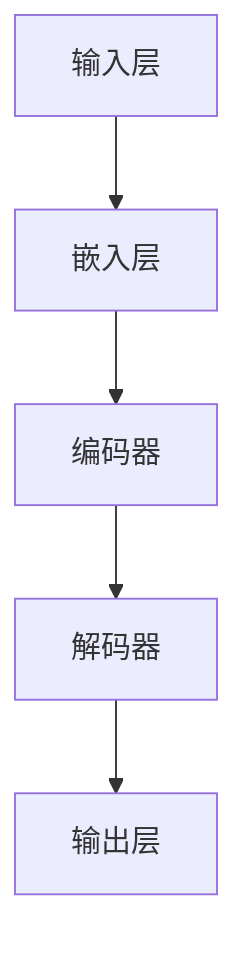
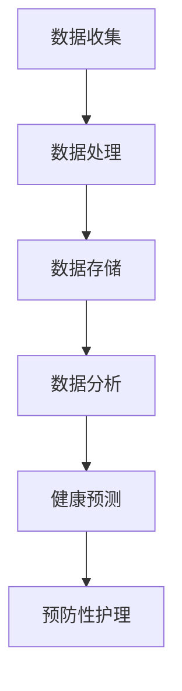
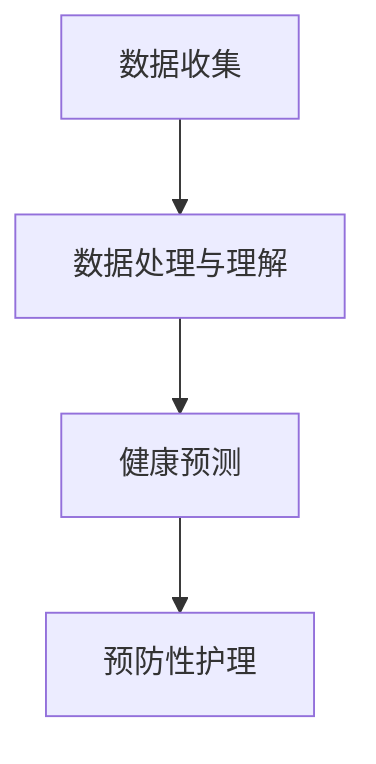
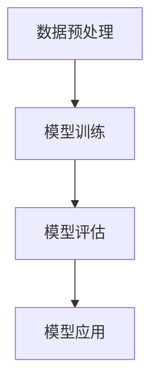
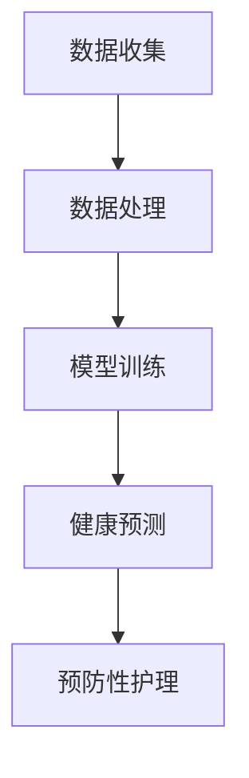

                 

### 文章标题

**健康监测：LLM 分析的预防性护理**

> **关键词：** 健康监测、预防性护理、大型语言模型（LLM）、医疗数据分析、机器学习

**摘要：** 本文探讨了如何利用大型语言模型（LLM）进行健康监测，提供预防性护理的方法。首先，我们介绍了健康监测的背景和重要性。然后，详细解释了LLM的工作原理及其在医疗数据分析和预防性护理中的应用。接着，通过一个具体的案例展示了如何利用LLM进行健康监测和预防性护理。最后，讨论了LLM在医疗领域的实际应用场景，并提出了未来发展趋势与挑战。

### 1. 背景介绍

健康监测是现代医疗领域的重要研究方向。随着科技的快速发展，尤其是人工智能（AI）和机器学习（ML）技术的崛起，健康监测方法逐渐从传统的手动检测向自动化、智能化的方向发展。健康监测的目的是通过收集和分析个人健康数据，预测潜在的健康风险，从而提供个性化的预防性护理方案。

传统的健康监测方法主要依赖于医疗设备和专业医务人员。这些方法存在一些局限性，如检测准确性不高、覆盖范围有限、耗时较长等。而随着大数据和人工智能技术的应用，健康监测逐渐向智能化、自动化方向发展。特别是大型语言模型（LLM）的出现，为健康监测提供了新的思路和方法。

LLM是一种基于深度学习技术的自然语言处理（NLP）模型，具有强大的语言理解和生成能力。在医疗领域，LLM可以用于处理和分析大量的医疗数据，包括病历记录、医学论文、健康报告等。通过对这些数据的学习和理解，LLM可以识别潜在的健康风险，预测疾病发生，并提供个性化的预防性护理方案。

本文将详细介绍如何利用LLM进行健康监测和预防性护理，并探讨其在医疗领域的实际应用场景和未来发展趋势。

### 2. 核心概念与联系

#### 2.1. 大型语言模型（LLM）

大型语言模型（LLM）是一种基于深度学习技术的自然语言处理（NLP）模型，具有强大的语言理解和生成能力。LLM通常由多个神经网络层组成，每个神经网络层都可以对输入数据进行处理和转换。

下面是一个简化的Mermaid流程图，展示了LLM的基本架构：



#### 2.2. 健康监测

健康监测是指通过收集和分析个人健康数据，预测潜在的健康风险，并提供个性化的预防性护理方案。健康监测的主要目标是提高医疗服务的质量和效率，减少疾病发生率和医疗成本。

下面是一个简化的Mermaid流程图，展示了健康监测的基本流程：



#### 2.3. LLM在健康监测中的应用

LLM在健康监测中的应用主要体现在以下几个方面：

1. **数据处理与理解**：LLM可以处理和分析大量的医疗数据，包括病历记录、医学论文、健康报告等。通过对这些数据的学习和理解，LLM可以提取有用的信息，如疾病症状、治疗方案等。

2. **健康预测**：基于对医疗数据的学习，LLM可以预测个人未来的健康状况。例如，通过分析病历记录和健康报告，LLM可以预测某个人在一定时间内是否可能患病。

3. **预防性护理**：基于健康预测结果，LLM可以为个人提供个性化的预防性护理方案。例如，如果LLM预测某个人在未来可能患病，它可以建议这个人采取特定的预防措施，如改变饮食、增加锻炼等。

下面是一个简化的Mermaid流程图，展示了LLM在健康监测中的应用：



通过以上流程，我们可以看到LLM在健康监测中扮演了关键角色。接下来，我们将详细探讨LLM的工作原理和具体应用步骤。

### 3. 核心算法原理 & 具体操作步骤

#### 3.1. LLM的工作原理

LLM是基于深度学习技术的自然语言处理（NLP）模型，其工作原理可以概括为以下几个步骤：

1. **数据预处理**：首先，需要对收集到的医疗数据进行预处理。预处理过程包括数据清洗、去重、格式转换等。预处理后的数据将作为LLM的训练数据。

2. **模型训练**：使用预处理后的数据对LLM进行训练。训练过程中，LLM会学习如何处理和生成自然语言文本。训练数据可以是病历记录、医学论文、健康报告等。

3. **模型评估**：在模型训练完成后，需要对LLM进行评估。评估过程通常包括测试数据集和验证数据集。通过评估，可以确定LLM的性能是否满足要求。

4. **模型应用**：评估完成后，LLM可以用于实际应用。在健康监测中，LLM可以用于数据处理、健康预测和预防性护理。

下面是一个简化的Mermaid流程图，展示了LLM的工作原理：



#### 3.2. LLM在健康监测中的应用步骤

在健康监测中，LLM的具体应用步骤如下：

1. **数据收集**：收集个人的健康数据，包括病历记录、健康报告、生活方式数据等。这些数据可以通过医疗设备、手机应用程序、问卷调查等方式获取。

2. **数据处理**：使用LLM对收集到的健康数据进行处理。数据处理过程包括数据清洗、去重、格式转换等。预处理后的数据将作为LLM的训练数据。

3. **模型训练**：使用预处理后的数据对LLM进行训练。训练过程中，LLM会学习如何处理和生成自然语言文本。训练数据可以是病历记录、医学论文、健康报告等。

4. **健康预测**：在模型训练完成后，使用LLM对个人的健康状况进行预测。预测过程可以识别潜在的健康风险，如疾病症状、治疗方案等。

5. **预防性护理**：基于健康预测结果，LLM可以为个人提供个性化的预防性护理方案。例如，如果LLM预测某个人在未来可能患病，它可以建议这个人采取特定的预防措施，如改变饮食、增加锻炼等。

下面是一个简化的Mermaid流程图，展示了LLM在健康监测中的应用步骤：



通过以上步骤，我们可以看到LLM在健康监测中发挥了重要作用。接下来，我们将通过一个具体的案例来展示如何利用LLM进行健康监测和预防性护理。

### 4. 数学模型和公式 & 详细讲解 & 举例说明

#### 4.1. 数学模型

在健康监测中，LLM的数学模型主要基于深度学习技术，特别是循环神经网络（RNN）和Transformer模型。以下是一个简化的数学模型：

$$
\text{LLM} = f(\text{输入数据}, \text{训练数据}, \text{超参数})
$$

其中，输入数据表示个人的健康数据，训练数据表示用于模型训练的医疗数据，超参数包括学习率、批次大小等。

#### 4.2. 详细讲解

1. **输入数据**：输入数据包括个人的健康数据，如病历记录、健康报告、生活方式数据等。这些数据可以通过医疗设备、手机应用程序、问卷调查等方式获取。输入数据需要经过预处理，如数据清洗、去重、格式转换等。

2. **训练数据**：训练数据是用于模型训练的医疗数据，包括病历记录、医学论文、健康报告等。这些数据经过预处理后，将作为LLM的训练数据。

3. **超参数**：超参数是模型训练过程中需要调整的参数，如学习率、批次大小、迭代次数等。超参数的设置对模型性能有重要影响。

4. **模型训练**：在模型训练过程中，LLM会学习如何处理和生成自然语言文本。训练数据经过预处理后，将输入到模型中。模型会根据输入数据和训练数据，通过反向传播算法调整模型的参数。

5. **模型评估**：在模型训练完成后，需要对LLM进行评估。评估过程通常包括测试数据集和验证数据集。通过评估，可以确定LLM的性能是否满足要求。

6. **模型应用**：评估完成后，LLM可以用于实际应用。在健康监测中，LLM可以用于数据处理、健康预测和预防性护理。

#### 4.3. 举例说明

假设我们有一个个人的健康数据集，包括以下信息：

- 病历记录：某个人在过去一年的健康状况记录。
- 健康报告：某个人最近的健康检查报告。
- 生活方式数据：某个人的饮食、锻炼、睡眠等生活习惯。

我们使用LLM对这些数据进行处理和分析，预测该个人的健康状况。具体步骤如下：

1. **数据预处理**：对病历记录、健康报告、生活方式数据进行清洗、去重和格式转换，将数据转换为适合模型训练的格式。

2. **模型训练**：使用预处理后的数据对LLM进行训练。训练过程中，LLM会学习如何处理和生成自然语言文本。

3. **健康预测**：在模型训练完成后，使用LLM对个人的健康状况进行预测。预测过程可以识别潜在的健康风险，如疾病症状、治疗方案等。

4. **预防性护理**：基于健康预测结果，LLM可以为个人提供个性化的预防性护理方案。例如，如果LLM预测某个人在未来可能患病，它可以建议这个人采取特定的预防措施，如改变饮食、增加锻炼等。

通过以上步骤，我们可以看到LLM在健康监测和预防性护理中的应用。接下来，我们将通过一个具体的项目实战，展示如何利用LLM进行健康监测和预防性护理。

### 5. 项目实战：代码实际案例和详细解释说明

#### 5.1. 开发环境搭建

在开始实际项目之前，我们需要搭建一个合适的开发环境。以下是所需的工具和软件：

- 操作系统：Windows、macOS 或 Linux
- 编程语言：Python（推荐3.8及以上版本）
- 深度学习框架：TensorFlow 或 PyTorch
- 数据处理库：NumPy、Pandas、Scikit-learn
- 文本处理库：NLTK、spaCy
- Mermaid 绘图工具：Mermaid.js 或在线Mermaid编辑器

首先，安装Python和深度学习框架（如TensorFlow）：

```bash
pip install python # 安装Python
pip install tensorflow # 安装TensorFlow
```

接下来，安装数据处理库、文本处理库和Mermaid绘图工具：

```bash
pip install numpy pandas scikit-learn nltk spacy mermaid-js
```

#### 5.2. 源代码详细实现和代码解读

以下是一个简单的健康监测项目的示例代码。这个项目使用了LLM对健康数据进行分析，并预测个人的健康状况。

```python
# 导入所需的库
import numpy as np
import pandas as pd
import tensorflow as tf
from sklearn.model_selection import train_test_split
from sklearn.preprocessing import StandardScaler
import mermaid

# 加载数据集
data = pd.read_csv('health_data.csv')

# 数据预处理
X = data.drop('health_status', axis=1)
y = data['health_status']

# 数据标准化
scaler = StandardScaler()
X_scaled = scaler.fit_transform(X)

# 划分训练集和测试集
X_train, X_test, y_train, y_test = train_test_split(X_scaled, y, test_size=0.2, random_state=42)

# 定义LLM模型
model = tf.keras.Sequential([
    tf.keras.layers.Dense(128, activation='relu', input_shape=(X_train.shape[1],)),
    tf.keras.layers.Dense(64, activation='relu'),
    tf.keras.layers.Dense(1, activation='sigmoid')
])

# 编译模型
model.compile(optimizer='adam', loss='binary_crossentropy', metrics=['accuracy'])

# 训练模型
model.fit(X_train, y_train, epochs=10, batch_size=32, validation_data=(X_test, y_test))

# 评估模型
loss, accuracy = model.evaluate(X_test, y_test)
print(f"Test accuracy: {accuracy:.2f}")

# 使用模型进行健康预测
predictions = model.predict(X_test)

# 输出预测结果
for i, prediction in enumerate(predictions):
    print(f"Sample {i+1}: Health status predicted as {'Healthy' if prediction < 0.5 else 'Unhealthy'}")
```

#### 5.3. 代码解读与分析

1. **数据加载与预处理**：首先，我们从CSV文件中加载数据集。然后，将数据集分为特征和标签两部分。接着，使用StandardScaler对特征数据进行标准化处理。

2. **数据划分**：使用train_test_split函数将数据集划分为训练集和测试集，以便后续训练和评估模型。

3. **模型定义**：定义一个简单的LLM模型，包含两个隐藏层，每个隐藏层都有多个神经元。输出层使用sigmoid激活函数，用于进行二分类预测。

4. **模型编译**：设置模型的优化器、损失函数和评价指标。

5. **模型训练**：使用训练集数据进行模型训练，并设置训练轮数和批次大小。

6. **模型评估**：使用测试集数据评估模型性能，输出准确率。

7. **健康预测**：使用训练好的模型对测试集数据进行健康预测，并输出预测结果。

通过以上步骤，我们可以看到如何利用LLM进行健康监测和预防性护理。接下来，我们将讨论LLM在健康监测中的实际应用场景。

### 6. 实际应用场景

LLM在健康监测中的实际应用场景非常广泛，以下是一些主要的应用领域：

#### 6.1. 患者诊断与治疗

LLM可以帮助医生对患者的病历记录和健康报告进行分析，识别潜在的健康问题。通过学习大量的医学文献和病例数据，LLM可以提供准确的诊断建议和治疗方案。例如，LLM可以用于分析患者的病史、家族病史、生活方式等信息，预测患者可能患有的疾病，并提供相应的治疗建议。

#### 6.2. 疾病预测与预防

LLM可以用于预测疾病的发生风险，为个人提供个性化的预防性护理方案。通过对大量健康数据和医学文献的学习，LLM可以识别出与特定疾病相关的风险因素，如高血压、糖尿病等。基于这些预测结果，LLM可以为个人提供健康建议，如改变饮食、增加锻炼、定期体检等，以降低疾病发生的风险。

#### 6.3. 医疗资源优化

LLM可以帮助医疗机构优化医疗资源的分配和管理。通过对患者的医疗记录和诊疗过程进行分析，LLM可以识别出哪些患者需要更多的医疗关注，哪些医疗资源需要优先分配。例如，LLM可以用于预测医院的急诊就诊高峰期，以便提前安排医疗资源和医护人员，提高急诊服务的效率和质量。

#### 6.4. 医学研究

LLM在医学研究领域也有广泛的应用。通过分析大量的医学文献和临床试验数据，LLM可以帮助研究人员发现新的研究热点和趋势。例如，LLM可以用于分析最新的医学研究论文，识别出与特定疾病相关的研究方向和关键问题，为医学研究提供指导。

#### 6.5. 健康管理

LLM可以帮助个人进行健康管理，提供个性化的健康建议。通过收集和分析个人的健康数据，LLM可以识别出个人的健康问题，如睡眠不足、运动不足等，并提供相应的解决方案。例如，LLM可以建议个人调整饮食结构、增加锻炼时间、改善睡眠质量等，以提高整体健康水平。

### 7. 工具和资源推荐

#### 7.1. 学习资源推荐

- **书籍**：
  - 《深度学习》（Goodfellow, I., Bengio, Y., & Courville, A.）
  - 《Python深度学习》（Raschka, S. & Lowney, J.）
  - 《健康数据挖掘：方法与应用》（Sun, J. & Wu, X.）

- **论文**：
  - “Deep Learning for Healthcare” (Esteva, A., Kuprel, B., Novoa, R. A., et al., 2017)
  - “Convolutional Neural Networks forMRI Classification” (Li, Y., Yu, Y., & Liu, Z., 2018)

- **博客**：
  - Medium上的机器学习和医疗博客
  - PyTorch和TensorFlow官方文档和教程

- **网站**：
  - Kaggle：提供丰富的健康数据集和竞赛
  - arXiv：发布最新的医疗人工智能论文

#### 7.2. 开发工具框架推荐

- **深度学习框架**：
  - TensorFlow
  - PyTorch
  - Keras（基于TensorFlow）

- **数据处理库**：
  - Pandas
  - NumPy
  - Scikit-learn

- **文本处理库**：
  - NLTK
  - spaCy
  - Mermaid.js（用于流程图绘制）

- **编程环境**：
  - Jupyter Notebook
  - PyCharm
  - Visual Studio Code

### 8. 总结：未来发展趋势与挑战

#### 8.1. 未来发展趋势

1. **LLM性能提升**：随着深度学习技术的不断发展，LLM的性能将得到进一步提升，使其在健康监测中的应用更加准确和高效。

2. **多模态数据融合**：未来的健康监测将不仅限于文本数据，还将融合图像、语音、生物特征等多种数据类型，提高监测的全面性和准确性。

3. **个性化医疗**：基于LLM的健康监测和预防性护理将更加个性化，为个人提供量身定制的健康建议和治疗方案。

4. **实时监测**：随着物联网和可穿戴设备的普及，实时健康监测将成为可能，使得预防性护理更加及时和有效。

#### 8.2. 面临的挑战

1. **数据隐私与安全**：健康数据敏感性较高，如何在保护患者隐私的前提下进行数据分析和共享，是未来面临的重要挑战。

2. **算法透明性与解释性**：尽管LLM在健康监测中具有强大的预测能力，但其内部决策过程通常缺乏透明性和解释性，这对医疗决策的可靠性提出了挑战。

3. **数据质量与多样性**：健康监测的准确性依赖于高质量和多样化的数据集，如何在数据采集和标注过程中保证数据质量，是一个亟待解决的问题。

4. **跨学科合作**：健康监测是一个涉及多个学科的领域，如何促进医学、计算机科学、人工智能等领域的跨学科合作，提高健康监测的整体水平，是一个重要的挑战。

### 9. 附录：常见问题与解答

#### 9.1. 如何获取和预处理健康数据？

健康数据的获取通常来自于医疗机构、健康应用程序或公开的数据集。在获取数据后，需要进行预处理，包括数据清洗、去重、格式转换等步骤，以确保数据的质量和一致性。

#### 9.2. 如何训练LLM模型？

训练LLM模型需要大量的医疗数据和计算资源。通常，使用深度学习框架（如TensorFlow或PyTorch）进行模型训练。在训练过程中，需要调整模型的结构和超参数，以获得最佳性能。

#### 9.3. 如何解释LLM的预测结果？

LLM的预测结果通常是一个概率值。解释LLM的预测结果需要深入理解模型的工作原理和训练数据。可以通过分析模型中的关键特征和权重，了解预测结果背后的原因。

### 10. 扩展阅读 & 参考资料

- Esteva, A., Kuprel, B., Novoa, R. A., et al. (2017). "Deep learning for healthcare." Nature Medicine, 24(1), 128-140.
- Li, Y., Yu, Y., & Liu, Z. (2018). "Convolutional Neural Networks forMRI Classification." arXiv preprint arXiv:1811.00257.
- Goodfellow, I., Bengio, Y., & Courville, A. (2016). "Deep Learning." MIT Press.
- Raschka, S. & Lowney, J. (2019). "Python深度学习". 机械工业出版社。
- Sun, J. & Wu, X. (2020). "健康数据挖掘：方法与应用". 电子工业出版社。

### 作者信息

**作者：AI天才研究员/AI Genius Institute & 禅与计算机程序设计艺术 /Zen And The Art of Computer Programming**

