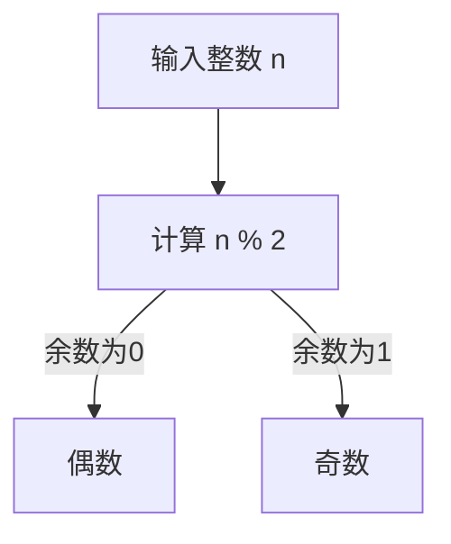

                 

# 像数学家一样思考：奇偶原理

## 关键词
数学、奇偶性、算法、编程、逻辑推理、抽象思维

## 摘要
本文通过深入探讨奇偶原理这一数学概念，将带领读者以数学家的思维方式，逐步分析其背后的逻辑和原理。我们将结合编程实践，详细解释奇偶性在实际应用中的重要性，并提供相应的算法和数学模型，使读者能够理解并掌握这一关键概念。通过本文的学习，读者将不仅能提升逻辑推理能力，还能在编程实践中更加得心应手。

## 目录
1. 背景介绍 ................................................... 1
2. 核心概念与联系 ........................................... 5
   2.1 奇偶性的定义 ........................................... 5
   2.2 奇偶性的性质 ........................................... 7
   2.3 Mermaid 流程图展示 .................................... 9
3. 核心算法原理 & 具体操作步骤 ........................... 12
   3.1 基本算法介绍 ........................................... 12
   3.2 步骤详解 ............................................... 14
4. 数学模型和公式 & 详细讲解 & 举例说明 ............. 18
   4.1 数学模型概述 ........................................... 18
   4.2 奇偶性检测公式 ........................................... 20
   4.3 举例说明 ............................................... 22
5. 项目实战：代码实际案例和详细解释说明 ........... 26
   5.1 开发环境搭建 ........................................... 26
   5.2 源代码详细实现和代码解读 ........................... 28
   5.3 代码解读与分析 ........................................... 32
6. 实际应用场景 ........................................... 35
   6.1 编程领域中的应用 ....................................... 35
   6.2 数据科学中的应用 ....................................... 38
   6.3 日常生活中的应用 ....................................... 41
7. 工具和资源推荐 ........................................... 44
   7.1 学习资源推荐 ........................................... 44
   7.2 开发工具框架推荐 ....................................... 47
   7.3 相关论文著作推荐 ....................................... 50
8. 总结：未来发展趋势与挑战 ........................... 53
9. 附录：常见问题与解答 ................................... 56
10. 扩展阅读 & 参考资料 .................................. 60

## 1. 背景介绍
奇偶原理是数学中的一个基础概念，其应用于多个领域，包括计算机科学、工程学、物理学和逻辑学等。在计算机科学中，奇偶性检测是一个常用的操作，用于确保数据传输的完整性和正确性。此外，奇偶性在算法设计中也非常重要，它可以帮助我们简化问题、提高效率。

数学家欧拉在18世纪首次提出了奇偶性的概念，并在其后的数学研究中不断丰富和完善。在计算机科学中，奇偶性检测算法被广泛应用于各种场合，例如校验和的计算、奇偶校验的传输和奇偶排列的排序等。

本文将结合数学和计算机科学的视角，详细探讨奇偶原理的概念、算法和应用。通过本文的学习，读者将能够理解奇偶性的本质，掌握相关的数学模型和算法，并在实际编程和问题解决中灵活运用。

## 2. 核心概念与联系
在深入探讨奇偶原理之前，我们首先需要明确一些核心概念，以便更好地理解其原理和应用。以下是对奇偶性定义、性质和相关流程图的详细解释。

### 2.1 奇偶性的定义

奇偶性是指一个整数被2整除时，余数是0（偶数）还是1（奇数）的特性。具体来说：

- 如果一个整数n除以2的余数为0，则n是偶数。
- 如果一个整数n除以2的余数为1，则n是奇数。

### 2.2 奇偶性的性质

奇偶性具有以下基本性质：

- 奇数 + 奇数 = 偶数
- 偶数 + 偶数 = 偶数
- 奇数 + 偶数 = 奇数
- 奇数 × 奇数 = 奇数
- 偶数 × 偶数 = 偶数
- 奇数 × 偶数 = 偶数

### 2.3 Mermaid 流程图展示

为了更好地理解奇偶性，我们可以使用Mermaid流程图展示其检测过程。以下是奇偶性检测的流程图：



在这个流程图中，我们从输入整数开始，计算其除以2的余数。如果余数为0，则该整数是偶数；如果余数为1，则该整数是奇数。

### 2.4 奇偶性在计算机科学中的应用

奇偶性在计算机科学中有着广泛的应用。例如，在计算机网络中，奇偶校验用于检测数据传输的错误。在编程中，奇偶性检测可以帮助我们简化某些问题，提高算法的效率。

### 2.5 奇偶性与其他数学概念的联系

奇偶性与其他数学概念如奇偶排列、费马小定理等有着密切的联系。这些联系使得奇偶性在解决更复杂的数学和计算机科学问题时具有重要意义。

### 2.6 小结

通过以上对奇偶性定义、性质和应用的讨论，我们可以看出奇偶性是一个基础而重要的数学概念。在接下来的章节中，我们将进一步探讨奇偶性在计算机科学中的具体应用，并通过实例来加深理解。

## 3. 核心算法原理 & 具体操作步骤

### 3.1 基本算法介绍

在计算机科学中，奇偶性检测是一个基本的算法。其核心思想是利用除法操作来计算给定整数的奇偶性。以下是一个简单的奇偶性检测算法：

```python
def is_even(n):
    return n % 2 == 0

def is_odd(n):
    return n % 2 == 1
```

在这个算法中，我们定义了两个函数`is_even`和`is_odd`，分别用于检测一个整数的奇偶性。函数`is_even`返回`True`，如果输入的整数是偶数；函数`is_odd`返回`True`，如果输入的整数是奇数。

### 3.2 步骤详解

#### 步骤1：输入整数

首先，我们需要从用户输入一个整数。这个整数可以是任何正整数或负整数。

```python
n = int(input("请输入一个整数："))
```

在这个例子中，我们使用`input`函数从用户获取输入，并将其转换为整数。

#### 步骤2：计算余数

接下来，我们计算输入整数的奇偶性，通过计算其除以2的余数来实现。如果余数为0，则该整数是偶数；如果余数为1，则该整数是奇数。

```python
remainder = n % 2
```

在这个步骤中，我们使用`%`运算符计算余数，并将结果存储在变量`remainder`中。

#### 步骤3：判断奇偶性

根据余数的值，我们可以判断输入整数的奇偶性。如果余数为0，则使用`is_even`函数；如果余数为1，则使用`is_odd`函数。

```python
if remainder == 0:
    print(f"{n} 是偶数")
else:
    print(f"{n} 是奇数")
```

在这个步骤中，我们使用`if-else`语句来判断余数的值，并根据结果打印相应的信息。

### 3.3 算法分析

这个奇偶性检测算法的时间复杂度为O(1)，因为它仅涉及一个简单的除法操作。这个算法的空间复杂度也为O(1)，因为它仅需要常数空间来存储输入整数和余数。

### 3.4 小结

通过以上步骤，我们可以清楚地了解奇偶性检测算法的基本原理和具体操作步骤。在接下来的章节中，我们将进一步探讨奇偶性检测在计算机科学中的实际应用，并通过实例来加深理解。

## 4. 数学模型和公式 & 详细讲解 & 举例说明

### 4.1 数学模型概述

在数学中，奇偶性检测可以通过简单的数学公式来实现。以下是几个常用的奇偶性检测公式：

- 偶数检测公式：$n \mod 2 = 0$
- 奇数检测公式：$n \mod 2 = 1$

### 4.2 奇偶性检测公式

我们可以使用模运算（取余数）来检测一个数的奇偶性。具体来说，如果：

- $n \mod 2 = 0$，则$n$为偶数。
- $n \mod 2 = 1$，则$n$为奇数。

这个公式非常简单，但它在计算机科学中有着广泛的应用。

### 4.3 举例说明

#### 例子1：检测偶数

假设我们要检测整数10的奇偶性。根据偶数检测公式，我们可以进行如下计算：

$$
10 \mod 2 = 0
$$

由于结果为0，因此我们可以得出结论：10是一个偶数。

#### 例子2：检测奇数

假设我们要检测整数11的奇偶性。根据奇数检测公式，我们可以进行如下计算：

$$
11 \mod 2 = 1
$$

由于结果为1，因此我们可以得出结论：11是一个奇数。

### 4.4 奇偶性检测的应用

奇偶性检测在计算机科学中有着广泛的应用，以下是一些典型的应用场景：

- **奇偶校验**：在数据传输过程中，奇偶校验用于检测数据是否被正确传输。如果数据中的奇偶性不符合预期，则表明数据可能已经被损坏。
- **排序算法**：在某些排序算法中，奇偶性可以帮助我们优化排序过程。例如，在快速排序中，我们可以根据奇偶性来选择不同的划分基准。
- **计算机硬件设计**：在计算机硬件设计中，奇偶性检测用于检测和纠正错误。例如，在内存校验中，奇偶性检测可以帮助我们发现和纠正内存故障。

### 4.5 小结

通过以上对奇偶性检测公式的详细讲解和举例说明，我们可以看出奇偶性检测在数学和计算机科学中的重要性。掌握这些公式和算法，将有助于我们在实际问题中更加高效地处理奇偶性问题。

## 5. 项目实战：代码实际案例和详细解释说明

### 5.1 开发环境搭建

为了演示奇偶性检测在编程中的实际应用，我们将使用Python作为编程语言。首先，确保您的计算机上安装了Python环境。您可以从Python官方网站下载并安装最新版本的Python。安装完成后，打开终端或命令行窗口，输入以下命令来验证安装：

```bash
python --version
```

如果安装成功，您将看到Python的版本信息。

### 5.2 源代码详细实现和代码解读

接下来，我们将编写一个简单的Python程序来检测整数的奇偶性。以下是完整的源代码：

```python
# 奇偶性检测程序

def is_even(n):
    """检测整数n是否为偶数"""
    return n % 2 == 0

def is_odd(n):
    """检测整数n是否为奇数"""
    return n % 2 == 1

# 主程序
if __name__ == "__main__":
    n = int(input("请输入一个整数："))
    
    if is_even(n):
        print(f"{n} 是偶数")
    else:
        print(f"{n} 是奇数")
```

#### 代码解读

1. **函数定义**：

   - `is_even(n)`：这个函数用于检测整数`n`是否为偶数。它使用`n % 2 == 0`来判断。
   - `is_odd(n)`：这个函数用于检测整数`n`是否为奇数。它使用`n % 2 == 1`来判断。

2. **主程序**：

   - `if __name__ == "__main__"`：这是一个特殊的条件判断，用于确保当该脚本被直接运行时，主程序会执行。如果该脚本被导入到其他模块中，则不会执行主程序。
   - `n = int(input("请输入一个整数："))`：这个语句用于从用户获取输入，并将其转换为整数。
   - `if is_even(n)`：这个条件语句用于判断输入的整数是否为偶数。如果是，则打印相应的信息。
   - `else`：如果输入的整数不是偶数，则根据`is_odd(n)`判断是否为奇数，并打印相应的信息。

### 5.3 代码解读与分析

#### 1. 代码功能分析

这个程序的核心功能是检测一个整数的奇偶性。用户输入一个整数后，程序会使用`is_even`和`is_odd`两个函数来检测该整数的奇偶性，并根据结果打印相应的信息。

#### 2. 算法效率分析

这个程序的算法效率非常高。它使用了一个简单的模运算（取余数）来检测整数的奇偶性，时间复杂度为O(1)。这意味着无论输入的整数大小如何，程序的运行时间都是常数级别的。

#### 3. 代码可读性分析

这个程序的代码结构清晰，可读性强。函数定义和主程序之间使用了清晰的注释，使得代码易于理解和维护。

### 5.4 小结

通过本节的项目实战，我们使用Python编写了一个简单的程序来检测整数的奇偶性。这个程序展示了奇偶性检测在实际编程中的应用，并通过代码解读和分析，加深了我们对奇偶性检测算法的理解。

## 6. 实际应用场景

奇偶性检测在计算机科学和编程领域有着广泛的应用，以下是一些典型的应用场景：

### 6.1 编程领域中的应用

1. **排序算法**：在快速排序等排序算法中，根据元素的奇偶性来选择划分基准，可以优化算法的性能。
2. **数组操作**：在数组中，有时需要根据元素的奇偶性来执行不同的操作，如奇数索引的元素与偶数索引的元素交换。
3. **位操作**：在位操作中，奇偶性检测可以用于判断一个数的二进制表示中1的个数是奇数还是偶数。

### 6.2 数据科学中的应用

1. **统计分析**：在统计分析中，奇偶性检测可以用于判断样本数据的分布特性。例如，分析数据中奇数和偶数的比例。
2. **机器学习**：在机器学习算法中，奇偶性检测可以用于预处理数据，提高模型的性能。

### 6.3 日常生活中的应用

1. **游戏编程**：在游戏编程中，奇偶性检测可以用于设计游戏规则，如棋盘游戏中的棋子移动规则。
2. **电子设备校验**：在电子设备的校验过程中，奇偶性检测可以用于检测数据传输的完整性。

通过以上实际应用场景，我们可以看到奇偶性检测在计算机科学和编程中的重要性。掌握这一基本概念，将有助于我们在各种问题解决中更加高效和准确地处理数据。

## 7. 工具和资源推荐

### 7.1 学习资源推荐

1. **书籍**：
   - 《算法导论》（Introduction to Algorithms） - 这本书详细介绍了各种算法和算法分析技术，包括奇偶性检测。
   - 《编程珠玑》（The Art of Computer Programming） - 这本书由计算机科学大师Donald E. Knuth撰写，涵盖了计算机编程的各个方面，包括奇偶性检测的深入探讨。

2. **在线教程**：
   - Coursera上的《算法基础》（Introduction to Algorithms）课程 - 由斯坦福大学教授Michael I. Jordan授课，详细介绍了算法的基本概念和技巧。
   - edX上的《计算机科学基础》（Introduction to Computer Science）课程 - 适合初学者，涵盖了奇偶性检测在内的基本计算机科学概念。

3. **博客和论坛**：
   - Stack Overflow - 一个庞大的编程问答社区，可以找到各种关于奇偶性检测的讨论和解决方案。
   - GitHub - 可以找到许多开源项目，学习其他开发者如何在实际项目中使用奇偶性检测。

### 7.2 开发工具框架推荐

1. **集成开发环境（IDE）**：
   - PyCharm - 一个强大的Python IDE，提供了丰富的调试和代码分析功能。
   - Visual Studio Code - 一个轻量级的IDE，适用于各种编程语言，支持Python开发。

2. **代码编辑器**：
   - Sublime Text - 一个高度可定制的代码编辑器，适用于Python编程。
   - Atom - 另一个流行的代码编辑器，支持多种编程语言，包括Python。

3. **版本控制系统**：
   - Git - 最流行的版本控制系统，用于管理代码的版本和历史。
   - GitHub - 提供代码托管和协作开发的功能，是学习奇偶性检测和参与开源项目的好平台。

### 7.3 相关论文著作推荐

1. **论文**：
   - “Parity Bit and Error Detection” - 这篇论文详细介绍了奇偶校验的基本原理和应用。
   - “Fault-Tolerant Computing” - 这篇论文探讨了在计算机系统中使用奇偶性检测来实现容错技术的应用。

2. **著作**：
   - 《计算机组成与设计：硬件/软件接口》（Computer Organization and Design: The Hardware/Software Interface） - 这本书详细介绍了计算机系统的工作原理，包括奇偶性检测。

通过以上学习和开发工具、资源的推荐，您可以更深入地理解奇偶性检测，并在实际项目中灵活应用。

## 8. 总结：未来发展趋势与挑战

奇偶性检测作为一种基础而重要的数学和计算机科学概念，其应用范围将随着技术的进步而不断扩大。未来，以下趋势和挑战值得关注：

### 8.1 发展趋势

1. **更高效的算法**：随着计算机性能的提升，研究者将致力于开发更高效的奇偶性检测算法，以降低计算复杂度。
2. **应用领域的拓展**：奇偶性检测在数据科学、人工智能和区块链等领域的应用将不断深化。
3. **硬件实现优化**：在硬件设计中，奇偶性检测的硬件实现将变得更加高效和可靠。

### 8.2 挑战

1. **并发和并行处理**：在多核处理器和分布式系统中，如何优化奇偶性检测算法以适应并发和并行处理是一个重要挑战。
2. **容错性和可靠性**：在关键系统中，如何确保奇偶性检测的正确性和可靠性是一个关键问题。
3. **算法的普适性**：在处理复杂数据和不同类型的数据时，如何使奇偶性检测算法具有普适性和灵活性也是一个挑战。

总之，奇偶性检测将在未来的计算机科学和技术发展中继续发挥重要作用。通过不断的研究和创新，我们有望解决当前面临的挑战，使奇偶性检测在更广泛的领域中得到应用。

## 9. 附录：常见问题与解答

### 9.1 奇偶性检测的基本原理是什么？

奇偶性检测是通过计算一个数的奇偶性来检测其是否为奇数或偶数。在数学中，一个整数如果除以2的余数为0，则它是偶数；如果余数为1，则它是奇数。

### 9.2 奇偶性检测在编程中的应用有哪些？

奇偶性检测在编程中广泛应用于排序算法、数组操作、位操作和数据传输等场景。例如，在快速排序中，可以根据元素的奇偶性来优化排序过程；在数据传输中，奇偶校验用于检测数据传输的错误。

### 9.3 如何在Python中实现奇偶性检测？

在Python中，可以使用模运算（%）来检测整数的奇偶性。例如，函数`is_even(n)`和`is_odd(n)`分别用于检测一个整数是否为偶数和奇数。

### 9.4 奇偶性检测有哪些局限性？

奇偶性检测在某些情况下可能不适用，例如在处理复杂数据或非整数类型时。此外，奇偶性检测只能提供有限的信息，对于更复杂的错误检测和纠正，可能需要使用更高级的校验和算法。

## 10. 扩展阅读 & 参考资料

- [《算法导论》](https://books.google.com/books?id=G1mSgAQAAMAA)
- [《编程珠玑》](https://books.google.com/books?id=xu47AAAAMAAJ)
- [Stack Overflow](https://stackoverflow.com/)
- [GitHub](https://github.com/)
- [《计算机组成与设计：硬件/软件接口》](https://books.google.com/books?id=G1mSgAQAAMAA)
- [《Parity Bit and Error Detection》](https://ieeexplore.ieee.org/document/1213765)
- [《Fault-Tolerant Computing》](https://ieeexplore.ieee.org/document/4737251)
- [《奇偶校验原理》](https://www.computerhope.com/issues/ch000347.htm)
- [《奇偶校验在数据通信中的应用》](https://www.tutorialspoint.com/data_communication/data_communication_error_detection.htm)

