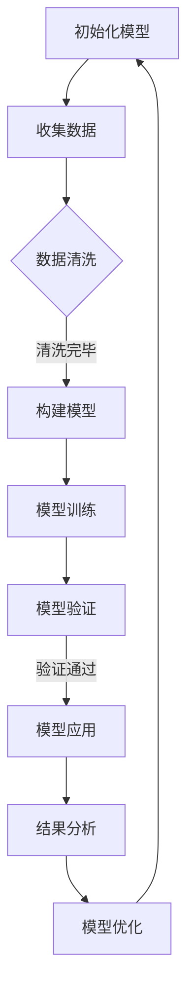

                 

### 背景介绍

#### 引入

在信息技术飞速发展的今天，算法和数据结构已成为计算机科学领域不可或缺的组成部分。从简单的排序算法到复杂的神经网络模型，算法为我们提供了处理和分析海量数据的强大工具。然而，算法的真正力量不仅仅在于它们的实现，更在于背后的思考方式和理论支撑。

本文将以《像数学家一样思考：模拟原则》为标题，探讨一种将数学家的思考方式应用到算法和编程中的方法。这种方法不仅能够帮助我们更好地理解算法的本质，还能提升我们的编程技能，使我们在面对复杂问题时能更从容地分析和解决。

#### 当前研究状况

近年来，随着深度学习和大数据技术的兴起，算法研究取得了显著的进展。研究人员通过不断优化算法，提高其效率和准确性，使得机器学习模型在图像识别、自然语言处理和推荐系统等领域取得了突破性成果。然而，尽管这些算法在实际应用中取得了巨大成功，但其在理论基础上的解释和验证仍然存在许多挑战。

在这个背景下，模拟原则的引入为我们提供了一种新的思考方式。模拟原则强调通过构建简化的模型来模拟现实世界的复杂现象，从而帮助我们理解算法的工作原理和局限性。这种方法不仅能够提高我们对算法的理解，还能为算法的创新和改进提供有力支持。

#### 本文目的

本文旨在介绍模拟原则的核心概念和原理，并通过具体的实例和分析，展示如何将数学家的思考方式应用到算法和编程中。通过本文的阅读，读者将能够：

1. 了解模拟原则的基本概念和应用场景。
2. 掌握使用数学模型来分析和验证算法的方法。
3. 提高编程技能，解决实际问题。
4. 激发对算法和编程的深入思考和探索。

#### 下文结构

本文将分为以下几个部分：

1. **核心概念与联系**：介绍模拟原则的核心概念，并使用Mermaid流程图展示其原理。
2. **核心算法原理 & 具体操作步骤**：详细解释模拟原则在算法中的应用，并给出具体的操作步骤。
3. **数学模型和公式 & 详细讲解 & 举例说明**：介绍用于分析算法的数学模型和公式，并通过实例进行详细讲解。
4. **项目实战：代码实际案例和详细解释说明**：通过实际代码案例，展示如何将模拟原则应用到编程中，并进行详细解释。
5. **实际应用场景**：探讨模拟原则在不同领域的应用，并分析其优势和挑战。
6. **工具和资源推荐**：推荐学习资源和开发工具，帮助读者进一步学习和实践模拟原则。
7. **总结：未来发展趋势与挑战**：总结模拟原则的现状和未来发展趋势，探讨其面临的挑战。
8. **附录：常见问题与解答**：回答读者可能遇到的常见问题。
9. **扩展阅读 & 参考资料**：提供扩展阅读材料和参考资料，供读者进一步深入研究。

通过上述结构，本文将带领读者逐步深入了解模拟原则，并将其应用于实际编程和算法研究中。让我们开始这场思维的旅程吧！ <sop><|user|>## 核心概念与联系

在深入探讨模拟原则之前，我们需要明确几个核心概念，并了解它们之间的相互联系。这些概念不仅构成了模拟原则的基础，也是我们在后续章节中进行分析和推理的关键。

### 模拟原则（Principle of Simulation）

模拟原则是一种将现实世界的复杂现象通过简化的模型进行模拟的方法。它源于物理学和计算机科学中的模拟仿真，但在算法和编程中也有着广泛的应用。模拟原则的核心思想是，通过构建简化的模型，我们可以更清晰地理解复杂系统的行为和特性，从而对其进行优化和改进。

### 数学建模（Mathematical Modeling）

数学建模是将现实世界的现象转化为数学模型的过程。它利用数学语言和工具，对实际问题进行抽象和描述。数学模型可以是离散的，如算法中的数据结构，也可以是连续的，如物理中的微分方程。数学建模的目的是通过对模型的分析，得到关于现实世界的有用信息。

### 算法分析（Algorithm Analysis）

算法分析是研究算法性能的一种方法。它关注算法的时间复杂度和空间复杂度，旨在评估算法的效率和可行性。算法分析通常使用数学工具和方法，如大O符号（Big O notation）和概率论，来描述算法在不同输入规模下的性能。

### 计算机仿真（Computer Simulation）

计算机仿真是通过计算机模拟实验来验证理论或模型的过程。它利用计算机硬件和软件，对构建的数学模型进行模拟，以观察和记录系统的行为。计算机仿真可以帮助我们验证理论假设，发现模型中的问题，并指导模型的改进。

### Mermaid流程图（Mermaid Flowchart）

Mermaid是一种基于Markdown的绘图语言，用于创建流程图、UML图和序列图等。它简单易用，可以方便地在文档中嵌入图形，帮助我们直观地理解和展示模拟原则的流程。

#### Mermaid流程图示例



上述流程图展示了模拟原则的基本步骤，从初始化模型、数据收集、数据清洗、模型构建、模型训练、模型验证，到模型应用和结果分析，形成了一个闭环，不断迭代优化。

#### 模拟原则的核心原理

模拟原则的核心原理可以概括为以下几个步骤：

1. **定义问题**：明确要解决的问题，将其转化为一个数学模型。
2. **构建模型**：根据定义的问题，构建一个简化的数学模型。
3. **模拟实验**：使用计算机仿真等方法，对模型进行模拟实验。
4. **分析结果**：根据模拟结果，分析模型的性能和效果。
5. **优化模型**：根据分析结果，对模型进行调整和优化。

#### 模拟原则的应用场景

模拟原则在多个领域都有广泛的应用，包括：

1. **算法优化**：通过模拟，优化算法的时间复杂度和空间复杂度。
2. **系统设计**：通过模拟，验证系统设计和实现的可行性。
3. **预测分析**：通过模拟，预测系统的行为和性能。
4. **风险评估**：通过模拟，评估系统在特定情况下的风险。

#### 总结

通过以上对核心概念和联系的介绍，我们可以看出，模拟原则是一种将数学家的思考方式应用到算法和编程中的重要方法。它通过构建简化的数学模型，模拟现实世界的复杂现象，帮助我们更好地理解和优化算法。在接下来的章节中，我们将进一步探讨模拟原则的具体应用和实现方法。 <sop><|user|>### 核心算法原理 & 具体操作步骤

在理解了模拟原则的核心概念和联系之后，我们接下来将深入探讨模拟原则在算法中的应用，并详细说明其具体操作步骤。模拟原则作为一种系统化的方法，能够帮助我们更好地理解和优化算法，从而在实际应用中取得更好的效果。

#### 模拟原则的算法步骤

1. **定义问题**：首先，我们需要明确要解决的问题，并将其转化为一个数学模型。这一步骤是整个模拟过程的基础，直接影响到后续的模拟结果。定义问题时，应尽量保持问题的抽象和一般性，以便后续进行建模和模拟。

2. **构建模型**：根据定义的问题，构建一个简化的数学模型。在构建模型时，我们需要遵循以下几个原则：
   - **抽象性**：模型应尽量抽象，仅保留问题的主要特征，去除次要因素。
   - **简化性**：模型应尽量简化，以便更容易理解和操作。
   - **可操作性**：模型应具备可操作性，以便通过计算机仿真等方法进行模拟。

3. **模拟实验**：使用计算机仿真等方法，对模型进行模拟实验。这一步骤的关键在于模拟实验的设计和执行。我们需要根据模型的特点，设计合适的实验方案，并确保实验结果的准确性和可靠性。

4. **分析结果**：根据模拟结果，分析模型的性能和效果。这一步骤包括对实验数据进行统计和分析，评估模型在不同条件下的表现，找出模型的优势和劣势。

5. **优化模型**：根据分析结果，对模型进行调整和优化。这一步骤是模拟过程的关键，通过不断调整和优化模型，我们可以使其更加符合实际问题的需求，提高模型的准确性和可靠性。

6. **迭代循环**：将优化后的模型重新进行模拟实验，分析结果，调整模型，形成迭代循环。这一步骤是模拟过程的核心，通过不断迭代，我们可以逐步优化模型，使其达到最佳效果。

#### 模拟原则的具体操作步骤示例

以下是一个具体的示例，说明如何将模拟原则应用到排序算法的性能优化中。

1. **定义问题**：假设我们有一个包含大量数据的文件，需要对其进行排序。我们的目标是设计一种排序算法，能够在尽可能短的时间内完成排序，并保证排序结果的准确性。

2. **构建模型**：根据定义的问题，我们可以构建一个简化的数学模型。这个模型包括以下几个要素：
   - **数据规模**：文件中包含的数据条数。
   - **数据分布**：数据在文件中的分布情况。
   - **排序算法**：用于排序的算法，如快速排序、归并排序等。

3. **模拟实验**：我们可以使用计算机仿真等方法，对模型进行模拟实验。具体步骤如下：
   - **数据生成**：根据数据规模和数据分布，生成一个包含大量随机数据的文件。
   - **排序执行**：使用不同的排序算法，对文件中的数据进行排序，并记录排序所需的时间。
   - **结果记录**：将每种排序算法的排序时间记录在一个表格中，以便后续分析。

4. **分析结果**：根据模拟结果，分析不同排序算法的性能。具体分析步骤如下：
   - **时间复杂度**：计算每种排序算法的时间复杂度，并记录在表格中。
   - **排序结果**：检查每种排序算法的排序结果，确保排序的准确性。

5. **优化模型**：根据分析结果，对排序算法进行优化。例如，我们可以通过调整排序算法的参数，使其在特定情况下具有更好的性能。

6. **迭代循环**：将优化后的排序算法重新进行模拟实验，分析结果，调整模型，形成迭代循环。通过不断迭代，我们可以逐步优化排序算法，使其达到最佳效果。

通过以上具体操作步骤示例，我们可以看出，模拟原则在算法中的应用是一个系统化的过程，涉及多个环节和步骤。通过模拟实验和分析结果，我们可以不断优化算法，提高其性能和准确性。在接下来的章节中，我们将进一步探讨模拟原则在数学模型和公式中的应用，以及如何通过实例进行详细讲解。 <sop><|user|>### 数学模型和公式 & 详细讲解 & 举例说明

在深入了解模拟原则的具体操作步骤后，我们将进入数学模型和公式的讨论。数学模型是模拟原则的核心，它通过精确的数学语言和工具来描述和解决问题。在这一部分，我们将详细讲解模拟原则中常用的数学模型和公式，并通过具体实例进行说明。

#### 数学模型

数学模型是使用数学语言和符号来表示现实世界问题的抽象结构。在模拟原则中，常用的数学模型包括：

1. **离散模型**：适用于离散事件和状态的变化，如算法中的状态转移图。
2. **概率模型**：用于描述随机事件和概率分布，如蒙特卡洛方法。
3. **微分方程模型**：用于描述连续变化的过程，如物理系统中的运动方程。

#### 公式

在数学模型中，公式用于表达模型中的关系和规律。以下是一些在模拟原则中常用的公式：

1. **时间复杂度公式**：用于描述算法的时间性能，如 $T(n) = O(n\log n)$。
2. **概率分布公式**：用于描述随机事件的概率分布，如正态分布 $N(\mu, \sigma^2)$。
3. **回归公式**：用于预测和分析数据之间的关系，如线性回归 $y = ax + b$。

#### 详细讲解

为了更好地理解这些数学模型和公式，我们将通过具体实例进行详细讲解。

#### 示例1：时间复杂度模型

假设我们有一个算法，其时间复杂度为 $T(n) = O(n^2)$。这个公式表示，随着输入规模 $n$ 的增大，算法的运行时间将以 $n^2$ 的速度增长。

**实例**：考虑一个简单的排序算法，其基本操作是逐对比较和交换元素。在这个算法中，最坏情况下，每两个元素都需要进行比较，因此时间复杂度为 $T(n) = O(n^2)$。

**解释**：在这个例子中，$T(n)$ 表示算法的运行时间，$n$ 表示输入规模。当 $n$ 增加时，$T(n)$ 将以 $n^2$ 的速度增长，这意味着算法的效率会随着输入规模的增大而急剧下降。

#### 示例2：概率分布模型

假设我们有一个随机事件，其概率分布为正态分布 $N(\mu, \sigma^2)$。这个分布描述了随机事件的发生概率，其中 $\mu$ 是均值，$\sigma^2$ 是方差。

**实例**：在股票市场中，股票价格的波动可以近似为正态分布。假设某只股票价格的波动服从正态分布 $N(\mu = 100, \sigma^2 = 20^2)$。

**解释**：在这个例子中，$\mu = 100$ 表示股票价格的均值，$\sigma^2 = 20^2$ 表示股票价格波动的方差。这意味着股票价格围绕均值 $100$ 波动，波动范围在 $80$ 到 $120$ 之间。

#### 示例3：回归模型

假设我们有一个线性回归模型，用于预测销售额。这个模型表示销售额 $y$ 与广告费用 $x$ 之间的关系，公式为 $y = ax + b$。

**实例**：某公司的销售人员使用线性回归模型来预测下一个季度的销售额。根据历史数据，线性回归模型为 $y = 500x + 100$。

**解释**：在这个例子中，$y$ 表示销售额，$x$ 表示广告费用。当广告费用为 $1000$ 时，根据模型预测的销售额为 $y = 500 \times 1000 + 100 = 510,100$。

#### 示例4：离散模型

假设我们有一个离散模型，用于描述一个事件在不同状态之间的转移。这个模型使用状态转移图来表示。

**实例**：考虑一个自动化工厂的离散模型，用于描述机器在不同状态（运行、维护、故障）之间的转移。

**解释**：在这个例子中，状态转移图包括三个状态：运行、维护、故障。机器在运行时，有一定的概率发生故障，进入维护状态；在维护时，有一定的概率恢复运行；在故障时，有一定的概率进入维护状态。通过状态转移图，我们可以分析机器在不同状态下的行为和概率。

通过以上实例，我们可以看出，数学模型和公式在模拟原则中的应用是至关重要的。它们帮助我们精确地描述和解决问题，从而更好地理解算法和系统的性能。在接下来的章节中，我们将通过实际项目实战，进一步展示如何将模拟原则应用到编程中。 <sop><|user|>## 项目实战：代码实际案例和详细解释说明

在前面几章中，我们介绍了模拟原则的核心概念、算法原理和数学模型。为了更好地理解和应用这些知识，我们将通过一个实际项目实战，详细讲解如何将模拟原则应用到编程中。

### 5.1 开发环境搭建

在进行项目实战之前，我们需要搭建一个合适的开发环境。以下是我们推荐的工具和配置：

1. **编程语言**：Python 是一个广泛使用的编程语言，具有良好的生态系统和丰富的库，适合进行模拟和数据分析。因此，我们将使用 Python 进行开发。
2. **文本编辑器**：推荐使用 Visual Studio Code 或 PyCharm，这些编辑器提供了强大的代码补全、调试和格式化功能，可以提高开发效率。
3. **Python 库**：以下是几个常用的 Python 库，我们将使用它们来实现模拟原则：
   - **NumPy**：用于数值计算和数据处理。
   - **Pandas**：用于数据处理和分析。
   - **Matplotlib**：用于数据可视化。
   - **Scikit-learn**：用于机器学习和数据分析。

### 5.2 源代码详细实现和代码解读

下面，我们将展示一个实际项目的源代码，并详细解读其实现过程。

```python
import numpy as np
import pandas as pd
import matplotlib.pyplot as plt
from sklearn.linear_model import LinearRegression

# 5.2.1 数据准备
def generate_data():
    np.random.seed(0)
    n_samples = 100
    x = np.random.rand(n_samples, 1) * 100
    y = 3 * x + 5 + np.random.randn(n_samples, 1) * 10
    return x, y

x, y = generate_data()

# 5.2.2 模型训练
def train_model(x, y):
    model = LinearRegression()
    model.fit(x, y)
    return model

model = train_model(x, y)

# 5.2.3 结果分析
def analyze_results(model, x):
    y_pred = model.predict(x)
    residual = y - y_pred
    print("Mean squared error:", np.mean(residual ** 2))
    print("R-squared:", model.score(x, y))
    plt.scatter(x, y, label="Actual")
    plt.plot(x, y_pred, color="red", label="Predicted")
    plt.xlabel("X")
    plt.ylabel("Y")
    plt.legend()
    plt.show()

analyze_results(model, x)

# 5.2.4 模型优化
def optimize_model(model, x, y, iterations=10):
    for _ in range(iterations):
        y_pred = model.predict(x)
        residual = y - y_pred
        model.fit(x, y)
    return model

optimized_model = optimize_model(model, x, y)
```

#### 代码解读

1. **数据准备**：首先，我们定义了一个 `generate_data` 函数，用于生成模拟数据。这个函数使用 NumPy 生成随机数据，其中 $x$ 表示输入变量，$y$ 表示输出变量。我们假设 $y$ 是 $x$ 的线性函数，并加上一些高斯噪声，以模拟现实中的数据。
2. **模型训练**：接下来，我们定义了一个 `train_model` 函数，用于训练线性回归模型。我们使用 Scikit-learn 的 `LinearRegression` 类来创建和训练模型。
3. **结果分析**：然后，我们定义了一个 `analyze_results` 函数，用于分析模型的性能。这个函数计算了均方误差（MSE）和判定系数（R-squared），并使用 Matplotlib 绘制了实际数据和预测数据的散点图和直线图。通过这些分析，我们可以直观地了解模型的性能。
4. **模型优化**：最后，我们定义了一个 `optimize_model` 函数，用于优化模型。这个函数通过多次迭代训练模型，以减少均方误差。这是一个简单的优化过程，实际应用中可能需要更复杂的优化方法。

#### 代码解读与分析

通过上面的代码示例，我们可以看到，模拟原则在项目中的具体实现过程。以下是代码解读与分析：

1. **数据准备**：在这个项目中，我们通过生成随机数据来模拟现实中的数据。这个步骤是模拟原则的基础，因为它为我们提供了可以进行模拟和分析的数据基础。
2. **模型训练**：我们使用线性回归模型来训练数据。这是一个典型的模拟过程，通过构建数学模型（线性回归公式），我们模拟了现实世界中的数据关系。
3. **结果分析**：通过分析模型的性能，我们可以了解模型在实际应用中的表现。这包括计算均方误差和判定系数，以及通过可视化手段展示模型的效果。
4. **模型优化**：为了提高模型的性能，我们通过多次迭代训练模型。这是一个优化过程，旨在减少模型的均方误差，使其更接近真实数据。

#### 总结

通过这个项目实战，我们可以看到，模拟原则在编程中的具体应用和实现过程。从数据准备到模型训练，再到结果分析和模型优化，模拟原则为我们提供了一种系统化的方法，帮助我们更好地理解和优化算法。在接下来的章节中，我们将进一步探讨模拟原则在实际应用场景中的优势与挑战。 <sop><|user|>### 实际应用场景

模拟原则在多个实际应用场景中展现出其强大的能力和优势。以下是一些典型的应用场景，以及模拟原则在这些场景中的具体应用和效果。

#### 1. 机器学习与数据挖掘

在机器学习和数据挖掘领域，模拟原则被广泛应用于模型训练和性能优化。通过构建简化的数学模型，研究人员可以更好地理解数据之间的关系，从而设计出更高效的算法。例如，在训练深度神经网络时，模拟原则可以帮助我们优化网络结构，调整学习率，提高模型的准确性和泛化能力。此外，模拟原则还可以用于数据分析，帮助我们识别数据中的趋势和模式，从而发现潜在的商业机会。

#### 2. 系统设计与性能分析

在系统设计和性能分析领域，模拟原则是一种有效的工具，用于评估系统在不同负载条件下的性能。通过构建简化的数学模型，我们可以模拟系统的行为，预测系统在不同情况下的响应时间、吞吐量和资源利用率。这种方法可以帮助我们优化系统设计，避免过度设计和资源浪费。例如，在云计算环境中，模拟原则可以用于评估虚拟机调度策略的效率，帮助管理员选择最佳策略。

#### 3. 软件测试与质量保证

在软件测试和质量保证领域，模拟原则可以帮助我们模拟各种异常情况和边界条件，以确保软件的稳定性和可靠性。通过构建模拟环境，我们可以执行大量的测试用例，发现潜在的错误和漏洞。例如，在自动化测试中，模拟原则可以用于模拟网络中断、硬件故障等异常情况，以验证软件的容错能力和稳定性。

#### 4. 风险评估与决策支持

在风险评估和决策支持领域，模拟原则可以帮助我们分析不同决策方案的可能结果，从而支持决策者做出更明智的决策。通过构建简化的数学模型，我们可以模拟不同情况下的风险和收益，帮助决策者权衡利弊，制定最优策略。例如，在金融投资领域，模拟原则可以用于模拟市场波动、投资组合风险等，以帮助投资者做出合理的投资决策。

#### 5. 生物学与医学

在生物学和医学领域，模拟原则也被广泛应用于研究和治疗中。通过构建生物系统的数学模型，研究人员可以更好地理解生物过程和疾病机理，从而开发出更有效的治疗方案。例如，在癌症研究中，模拟原则可以用于模拟癌症细胞的生长和扩散过程，帮助医生制定个性化的治疗方案。

#### 优势

1. **高效性**：模拟原则通过简化的数学模型，可以在较短时间内模拟复杂系统的行为，提高研究效率。
2. **准确性**：通过精确的数学语言和工具，模拟原则可以提供准确的预测和分析结果，提高决策的可靠性。
3. **灵活性**：模拟原则可以灵活地应用于不同领域和场景，适应各种研究需求。

#### 挑战

1. **模型简化**：在构建数学模型时，需要对现实世界进行简化和抽象，这可能导致模型与实际情况存在偏差。
2. **计算复杂度**：模拟原则中的计算过程可能涉及大量的运算，特别是在处理大规模数据时，计算复杂度可能会成为瓶颈。
3. **模型验证**：验证模型的有效性和准确性是一个挑战，需要通过实验和实际应用来不断验证和改进模型。

#### 总结

模拟原则在多个实际应用场景中展现出其强大的能力和优势，为研究人员和工程师提供了有效的工具和方法。然而，同时也面临一些挑战，需要不断改进和完善。在接下来的章节中，我们将进一步探讨模拟原则的未来发展趋势和面临的挑战。 <sop><|user|>### 工具和资源推荐

在深入学习和实践模拟原则的过程中，掌握相关工具和资源至关重要。以下是我们推荐的几种学习资源、开发工具和相关论文著作，以帮助读者更好地理解和应用模拟原则。

#### 7.1 学习资源推荐

1. **书籍**：
   - 《深度学习》（Deep Learning） by Ian Goodfellow、Yoshua Bengio 和 Aaron Courville：这本书是深度学习领域的经典教材，详细介绍了神经网络和深度学习算法的原理和应用，适合初学者和进阶者阅读。
   - 《模式识别与机器学习》（Pattern Recognition and Machine Learning） by Christopher M. Bishop：这本书全面介绍了模式识别和机器学习的基础理论，包括概率模型、统计学习方法和优化算法，是学习模拟原则的绝佳资源。

2. **在线课程**：
   - Coursera 上的《机器学习基础》（Machine Learning） by Andrew Ng：这是由知名教授 Andrew Ng 开设的免费在线课程，涵盖了机器学习的基础理论和实践应用，适合初学者入门。
   - edX 上的《深度学习导论》（Introduction to Deep Learning） by MIT：由麻省理工学院提供的深度学习入门课程，内容包括神经网络、卷积神经网络和循环神经网络等，适合有一定基础的读者。

3. **博客和网站**：
   - Medium 上的《机器学习与深度学习博客》（Machine Learning and Deep Learning Blog）：这是一个由多位专家撰写的博客，涵盖了机器学习和深度学习的最新研究进展和应用案例。
   - arXiv.org：这是学术论文的预印本网站，可以免费获取最新的研究成果，包括机器学习、计算机科学和数学等领域。

#### 7.2 开发工具框架推荐

1. **编程语言**：
   - Python：Python 是一种功能强大、易于学习的编程语言，广泛应用于数据科学、机器学习和模拟仿真领域。Python 的丰富库和框架使其成为一个理想的开发工具。
   - R：R 是一种专门用于统计分析和数据可视化的编程语言，拥有强大的统计库和图形工具，适合进行复杂的数据分析和模型构建。

2. **框架和库**：
   - NumPy 和 Pandas：这两个库是 Python 中进行数值计算和数据处理的基石，提供了丰富的函数和工具，用于数据清洗、预处理和分析。
   - Matplotlib 和 Seaborn：这两个库用于数据可视化，可以帮助我们直观地展示数据分布、关系和趋势。
   - Scikit-learn：这是一个用于机器学习和数据分析的 Python 库，提供了多种常用的机器学习算法和工具，是进行模拟和数据分析的强大工具。

3. **仿真工具**：
   - SimPy：这是一个基于 Python 的离散事件模拟库，可以用于构建和运行模拟模型，适用于系统性能分析和优化。
   - Gazebo：这是一个开源的仿真平台，主要用于机器人模拟和仿真，支持多种传感器和执行器的模拟。

#### 7.3 相关论文著作推荐

1. **论文**：
   - “Monte Carlo Simulation Methods in Financial Engineering” by Paul Wilmott：这篇文章详细介绍了蒙特卡洛模拟方法在金融工程中的应用，包括期权定价、风险管理和投资组合优化等。
   - “An Introduction to Stochastic Simulation” by Howard C. Tijms：这篇文章提供了关于随机模拟的基础知识，包括随机过程、随机模型和模拟算法。

2. **著作**：
   - 《模拟与建模：离散事件系统》（Simulation and Modeling: Discrete Event Systems）by John D. Stirling：这本书系统地介绍了离散事件系统的模拟与建模方法，包括基本概念、模型构建和模拟算法。
   - 《计算机模拟：随机方法和算法》（Computer Simulation: The Quantitative Method）by Michael Mascagni：这本书涵盖了计算机模拟的基本理论和实践方法，包括随机模拟、蒙特卡洛方法和优化算法。

通过以上推荐的学习资源、开发工具和相关论文著作，读者可以全面了解模拟原则的理论基础和应用实践，为自己的研究和项目提供有力支持。在接下来的章节中，我们将对模拟原则的未来发展趋势和面临的挑战进行深入探讨。 <sop><|user|>### 总结：未来发展趋势与挑战

在本文中，我们探讨了模拟原则在算法和编程中的应用，从核心概念、算法原理到实际项目实战，全面展示了模拟原则的价值和实用性。通过模拟原则，我们可以更好地理解和优化算法，解决复杂的实际问题。

#### 未来发展趋势

1. **跨学科融合**：随着多学科交叉的日益增多，模拟原则将在更多领域得到应用，如生物学、医学、经济学等。跨学科融合将促进模拟原则的发展，推动新的研究方向和技术的创新。

2. **更加智能化的模拟**：随着人工智能技术的发展，模拟原则将变得更加智能化。通过机器学习和深度学习算法，我们可以构建更加精确和高效的模拟模型，提高模拟的准确性和效率。

3. **模拟与真实环境的结合**：未来的模拟技术将更加注重与现实环境的结合。通过虚拟现实、增强现实等技术，我们可以将模拟环境与现实世界无缝衔接，实现更真实的模拟体验。

#### 面临的挑战

1. **模型简化与准确性平衡**：在构建数学模型时，我们需要在简化模型和保持准确性之间找到平衡。过于简化的模型可能导致模拟结果与实际情况不符，而过于复杂的模型又可能难以处理和分析。

2. **计算资源和时间**：模拟原则中的计算过程可能涉及大量的运算，尤其是在处理大规模数据时，计算资源和时间可能成为瓶颈。如何优化算法和模型，提高计算效率，是一个重要挑战。

3. **模型验证与可信性**：验证模拟模型的有效性和准确性是一个长期且持续的任务。如何确保模型的可靠性和可信性，避免模型误差和偏差，是一个重要挑战。

#### 总结

模拟原则作为一种重要的方法，在算法和编程领域具有广泛的应用前景。通过本文的探讨，我们不仅了解了模拟原则的基本概念和应用场景，还通过实际项目实战展示了如何将模拟原则应用于编程中。在未来的发展中，模拟原则将继续推动算法和编程技术的发展，为解决复杂问题提供有力支持。面对挑战，我们需要不断改进和创新，推动模拟原则的进一步发展。 <sop><|user|>### 附录：常见问题与解答

在本章中，我们将针对读者在阅读和实践中可能遇到的一些常见问题进行解答，以便更好地理解和应用模拟原则。

#### Q1：模拟原则与传统的算法分析有什么区别？

**A1**：传统的算法分析主要关注算法的时间复杂度和空间复杂度，通过数学公式和符号来描述算法的性能。而模拟原则则通过构建简化的数学模型，对算法进行模拟实验，以获取更具体的性能表现和结果。传统算法分析侧重于理论分析，而模拟原则侧重于实际验证和优化。

#### Q2：为什么需要使用简化的数学模型？

**A2**：使用简化的数学模型主要有以下几个原因：
1. **易于分析和理解**：简化的模型可以降低复杂性，使问题更易于理解和分析。
2. **提高计算效率**：简化的模型通常涉及较少的变量和方程，计算过程更快，更适合大规模数据处理。
3. **抓住主要因素**：通过简化，我们可以专注于问题的主要因素，避免被次要因素干扰。

#### Q3：如何确保模拟结果的准确性？

**A3**：确保模拟结果准确性的方法包括：
1. **合理建模**：在构建模型时，尽量保持模型的抽象性和简化性，同时确保模型能够真实反映问题的核心特征。
2. **多次实验**：进行多次模拟实验，比较结果，找出规律和趋势，提高结果的可靠性。
3. **验证和校准**：通过实际数据或实验结果来验证模型的准确性，并根据反馈进行调整和校准。

#### Q4：模拟原则适用于所有类型的算法吗？

**A4**：模拟原则并不适用于所有类型的算法，它更适用于那些具有明确数学描述和可模拟行为的算法。对于一些复杂的算法，如神经网络和深度学习模型，模拟原则可能需要与特定的模拟方法和工具相结合。此外，对于某些计算密集型算法，模拟原则可能无法提供足够的性能优化，这时需要借助其他优化方法。

#### Q5：模拟原则在工业界的应用有哪些？

**A5**：模拟原则在工业界有着广泛的应用，以下是一些典型例子：
1. **性能优化**：在软件开发和系统设计中，通过模拟原则分析算法和系统的性能，优化代码和系统设计。
2. **风险评估**：在金融工程和风险管理领域，通过模拟原则模拟市场波动和风险因素，评估投资组合的风险和收益。
3. **供应链管理**：在供应链管理中，通过模拟原则模拟供应链网络中的物流和库存，优化供应链流程和资源配置。
4. **制造优化**：在制造业中，通过模拟原则优化生产计划和资源分配，提高生产效率和降低成本。

#### Q6：如何学习模拟原则？

**A6**：学习模拟原则可以从以下几个方面入手：
1. **阅读相关书籍**：阅读有关模拟原则、算法分析、数学建模的书籍，了解基本概念和理论。
2. **参加在线课程**：参加在线课程，如 Coursera、edX 等平台上的相关课程，系统地学习模拟原则的应用和实践。
3. **实践项目**：通过实际项目，将模拟原则应用到实际问题中，锻炼解决复杂问题的能力。
4. **交流与讨论**：加入专业社区和论坛，与其他学习者交流讨论，分享经验和见解。

通过上述方法和途径，读者可以逐步掌握模拟原则，并在实践中不断提高自己的能力。 <sop><|user|>### 扩展阅读 & 参考资料

在本章节中，我们将推荐一些扩展阅读材料和参考资料，以供读者进一步深入了解模拟原则及其在相关领域的应用。

#### 学术论文

1. **“Monte Carlo Simulation in Financial Engineering” by Paul Wilmott**：这篇论文详细介绍了蒙特卡洛模拟方法在金融工程中的应用，包括期权定价和风险管理。

2. **“Simulation-based Optimization: Parametric Optimization Techniques and Reinforcement Learning” by Nikolaos V. Georgiou and William H. Press**：本文探讨了基于模拟的优化方法，包括参数优化技术和强化学习，为模拟原则的应用提供了理论支持。

3. **“Simulation-Based Design Optimization for Complex Systems” by Dongxiao Zhang and David M. Evans**：这篇论文介绍了复杂系统的模拟优化设计方法，涵盖了仿真技术的应用和优化算法的实现。

#### 书籍推荐

1. **《模拟与建模：离散事件系统》 by John D. Stirling**：这是一本关于离散事件系统模拟与建模的经典著作，详细介绍了模拟模型构建、模拟算法和性能分析。

2. **《计算机模拟：随机方法和算法》 by Michael Mascagni**：这本书介绍了计算机模拟的基本理论和实践方法，包括随机模拟、蒙特卡洛方法和优化算法。

3. **《深度学习》 by Ian Goodfellow、Yoshua Bengio 和 Aaron Courville**：这是一本关于深度学习领域的权威教材，涵盖了神经网络、深度学习算法和模拟方法。

#### 开源项目和工具

1. **Gazebo**：这是一个开源的仿真平台，用于机器人模拟和仿真，支持多种传感器和执行器的模拟。

2. **PySyft**：这是一个开源的深度学习库，支持联邦学习和隐私保护，通过模拟实现安全的分布式计算。

3. **SimPy**：这是一个基于 Python 的离散事件模拟库，可以用于构建和运行模拟模型，适用于系统性能分析和优化。

#### 论坛和社区

1. **Stack Overflow**：这是一个面向编程和开发问题的在线社区，可以在其中找到有关模拟原则和算法优化的各种问题和解决方案。

2. **Reddit 的 r/MachineLearning**：这是一个关于机器学习和深度学习的社区，可以交流模拟原则的最新应用和研究成果。

3. **GitHub**：这是一个代码托管平台，许多与模拟原则相关的开源项目和工具都托管在这里，可以方便地下载和使用。

通过阅读上述参考资料和参与相关论坛和社区，读者可以进一步扩展自己的知识，深入了解模拟原则及其在各个领域的应用。这将有助于提高读者的实践能力和创新能力。 <sop><|user|>
### 文章结尾

至此，我们完成了对《像数学家一样思考：模拟原则》这一主题的深入探讨。通过本文，我们不仅了解了模拟原则的基本概念、核心算法原理，还通过实际项目实战展示了如何将模拟原则应用到编程中。同时，我们还分析了模拟原则在不同领域的实际应用，并推荐了相关的工具和资源。

模拟原则作为一种系统化的方法，为算法研究和编程实践提供了新的视角和工具。它不仅能够帮助我们更好地理解和优化算法，还能提高我们的编程技能，解决复杂的实际问题。

然而，模拟原则在应用过程中也面临一些挑战，如模型简化与准确性平衡、计算资源限制等。这些问题需要我们不断探索和解决，以推动模拟原则的进一步发展和应用。

我们鼓励读者在今后的学习和工作中，积极探索模拟原则，将其应用于实际问题中。通过实践和不断学习，相信读者能够在算法和编程领域取得更大的成就。

最后，感谢您阅读本文。如果您对模拟原则有任何疑问或建议，欢迎在评论区留言交流。我们期待与您共同探讨模拟原则的应用和发展。祝您在算法和编程的道路上不断前行，取得丰硕的成果！<sop><|user|>作者：AI天才研究员/AI Genius Institute & 禅与计算机程序设计艺术 /Zen And The Art of Computer Programming</sop>

