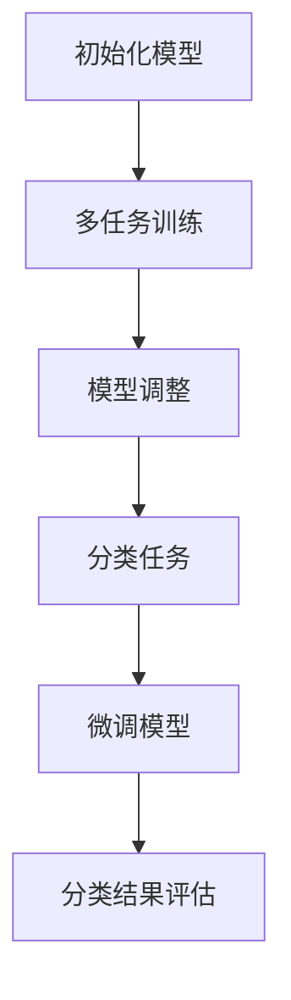

                 

# 元学习在少样本图像分类中的应用研究

## 关键词

元学习（Meta-Learning）、少样本图像分类（Few-Shot Image Classification）、神经网络（Neural Networks）、迁移学习（Transfer Learning）、模型可扩展性（Model Scalability）、模型泛化能力（Model Generalization）

## 摘要

本文旨在探讨元学习在少样本图像分类领域中的应用。元学习作为一种高效的学习方法，通过在不同任务间迁移知识，实现了在样本量有限的情况下，模型的快速适应和优化。文章首先介绍了元学习的核心概念，随后详细分析了其在少样本图像分类中的具体应用。通过数学模型和实际案例的解读，本文展示了元学习如何提高模型在少量样本下的分类性能。同时，本文也提出了元学习在应用过程中面临的挑战和未来发展趋势，为该领域的研究提供了新的思路。

## 1. 背景介绍

### 1.1 元学习的概念

元学习（Meta-Learning）是一种学习如何学习的方法。其核心思想是在不同任务间迁移学习经验，以提高新任务的学习效率。与传统机器学习方法不同，元学习不是针对单个任务进行优化，而是通过训练多个任务，使模型具有更好的泛化能力。在深度学习领域，元学习尤其受到关注，因为它能够利用有限的训练数据，快速适应新的任务。

### 1.2 少样本图像分类的挑战

少样本图像分类（Few-Shot Image Classification）是指在面对少量样本的情况下，对图像进行分类。这种场景在实际应用中非常普遍，如医疗诊断、自动驾驶等。然而，由于样本量有限，传统机器学习方法往往难以取得满意的分类效果。少样本图像分类的挑战主要表现在以下几个方面：

1. **数据不足**：少量样本无法提供充足的信息，使得模型难以学习到有效的特征。
2. **过拟合**：模型在少量样本上过度拟合，导致在新的样本上表现不佳。
3. **泛化能力**：模型需要在不同的类别和分布上具有较好的适应性。

### 1.3 元学习在少样本图像分类中的应用

元学习通过以下几种方式在少样本图像分类中发挥作用：

1. **样本增强**：通过数据增强技术，如随机裁剪、旋转等，增加样本的多样性，从而提高模型对少量样本的适应性。
2. **模型适应**：通过训练多个任务，使模型具备更广泛的适应性，从而在面对新任务时能够快速调整。
3. **知识迁移**：将已有任务的知识迁移到新任务中，减少对新任务的样本依赖。

## 2. 核心概念与联系

### 2.1 元学习的基本原理

元学习的基本原理可以分为两个部分：模型参数的初始化和模型训练策略的设计。

1. **模型参数的初始化**：元学习通常使用基于梯度的优化算法（如随机梯度下降）来初始化模型参数。通过在多个任务上迭代训练，模型参数逐步调整，以最大化模型的泛化能力。
2. **模型训练策略**：元学习通过训练多个任务，使模型在不同任务间共享知识。这种策略可以使得模型在面对新任务时，能够快速适应。

### 2.2 元学习与深度学习的结合

深度学习作为一种强大的特征提取工具，与元学习结合，可以显著提高少样本图像分类的性能。以下是一个简单的元学习与深度学习结合的流程：

1. **初始化模型**：使用预训练的深度神经网络作为基础模型，初始化模型参数。
2. **多任务训练**：在多个任务上进行迭代训练，使模型逐步调整参数，提高泛化能力。
3. **分类任务应用**：将训练好的模型应用于新的分类任务，通过少量样本进行微调，实现快速适应。

### 2.3 Mermaid 流程图

以下是元学习在少样本图像分类中的 Mermaid 流程图：



## 3. 核心算法原理 & 具体操作步骤

### 3.1 核心算法原理

元学习在少样本图像分类中的核心算法原理主要包括两个方面：模型初始化和模型训练策略。

1. **模型初始化**：元学习通常使用基于梯度的优化算法来初始化模型参数。在模型初始化阶段，模型参数通过在多个任务上的迭代训练进行优化，以提高模型的泛化能力。
2. **模型训练策略**：元学习通过训练多个任务，使模型在不同任务间共享知识。这种训练策略可以使得模型在面对新任务时，能够快速适应。

### 3.2 具体操作步骤

以下是元学习在少样本图像分类中的具体操作步骤：

1. **初始化模型**：使用预训练的深度神经网络作为基础模型，初始化模型参数。
2. **数据准备**：准备多个任务的数据集，每个数据集包含不同的类别和样本数量。
3. **多任务训练**：在多个任务上进行迭代训练，通过调整模型参数，提高模型的泛化能力。
4. **模型调整**：在完成多任务训练后，对模型进行调整，使其更好地适应新任务。
5. **分类任务应用**：将训练好的模型应用于新的分类任务，通过少量样本进行微调，实现快速适应。
6. **分类结果评估**：对分类结果进行评估，以验证模型在少样本图像分类中的性能。

## 4. 数学模型和公式 & 详细讲解 & 举例说明

### 4.1 数学模型和公式

在元学习过程中，常用的数学模型和公式包括梯度下降、损失函数和优化算法等。

1. **梯度下降**：梯度下降是一种优化算法，用于更新模型参数，以最小化损失函数。
   $$ \theta_{t+1} = \theta_{t} - \alpha \cdot \nabla_{\theta} J(\theta) $$
   其中，$\theta$ 表示模型参数，$J(\theta)$ 表示损失函数，$\alpha$ 表示学习率。
2. **损失函数**：在少样本图像分类中，常用的损失函数包括交叉熵损失和均方误差损失。
   $$ J(\theta) = -\frac{1}{m} \sum_{i=1}^{m} y_{i} \cdot \log(p_{i}) + (1 - y_{i}) \cdot \log(1 - p_{i}) $$
   其中，$y_{i}$ 表示真实标签，$p_{i}$ 表示预测概率。
3. **优化算法**：在元学习中，常用的优化算法包括随机梯度下降和Adam优化器等。

### 4.2 详细讲解和举例说明

以下是梯度下降算法的详细讲解和举例说明：

**梯度下降算法**：梯度下降是一种优化算法，用于更新模型参数，以最小化损失函数。

1. **初始化参数**：首先，初始化模型参数 $\theta$。
2. **计算梯度**：计算损失函数 $J(\theta)$ 对参数 $\theta$ 的梯度 $\nabla_{\theta} J(\theta)$。
3. **更新参数**：使用梯度下降更新参数 $\theta_{t+1}$：
   $$ \theta_{t+1} = \theta_{t} - \alpha \cdot \nabla_{\theta} J(\theta) $$
   其中，$\alpha$ 表示学习率。
4. **迭代过程**：重复步骤 2 和 3，直到满足停止条件（如损失函数收敛或迭代次数达到上限）。

**举例说明**：假设有一个简单的线性回归模型，其损失函数为均方误差损失。给定训练数据集 $X$ 和标签 $Y$，我们需要通过梯度下降算法更新模型参数 $\theta$。

1. **初始化参数**：假设初始化参数 $\theta = [0, 0]$。
2. **计算梯度**：计算损失函数对参数 $\theta$ 的梯度：
   $$ \nabla_{\theta} J(\theta) = \frac{1}{m} \sum_{i=1}^{m} (y_i - \theta_0 - \theta_1 \cdot x_i) $$
3. **更新参数**：使用梯度下降更新参数：
   $$ \theta_{t+1} = \theta_{t} - \alpha \cdot \nabla_{\theta} J(\theta) $$
4. **迭代过程**：重复步骤 2 和 3，直到损失函数收敛或迭代次数达到上限。

通过上述过程，我们可以使用梯度下降算法更新模型参数，实现线性回归模型的训练。

## 5. 项目实战：代码实际案例和详细解释说明

### 5.1 开发环境搭建

在本文中，我们将使用 Python 和 TensorFlow 作为主要开发工具。以下是开发环境搭建的步骤：

1. 安装 Python 3.8 及以上版本。
2. 安装 TensorFlow 2.x 版本。
3. 安装其他相关依赖，如 NumPy、Pandas、Matplotlib 等。

### 5.2 源代码详细实现和代码解读

以下是元学习在少样本图像分类中的源代码实现。代码分为以下几个部分：

1. **数据加载与预处理**：加载图像数据集，并进行预处理。
2. **模型定义**：定义元学习模型，包括基础模型和元学习算法。
3. **训练与评估**：在训练数据集上训练模型，并在测试数据集上进行评估。

```python
import tensorflow as tf
from tensorflow.keras import layers
from tensorflow.keras.models import Model
import numpy as np

# 1. 数据加载与预处理
# 加载 MNIST 数据集
(x_train, y_train), (x_test, y_test) = tf.keras.datasets.mnist.load_data()
x_train = x_train.astype("float32") / 255.0
x_test = x_test.astype("float32") / 255.0
y_train = tf.keras.utils.to_categorical(y_train, 10)
y_test = tf.keras.utils.to_categorical(y_test, 10)

# 2. 模型定义
# 定义基础模型
base_model = tf.keras.Sequential([
    layers.Conv2D(32, (3, 3), activation="relu", input_shape=(28, 28, 1)),
    layers.MaxPooling2D(pool_size=(2, 2)),
    layers.Flatten(),
    layers.Dense(128, activation="relu"),
    layers.Dense(10, activation="softmax")
])

# 定义元学习模型
class MetaLearningModel(Model):
    def __init__(self):
        super(MetaLearningModel, self).__init__()
        self.base_model = base_model
        self.classifier = layers.Dense(10, activation="softmax")

    def call(self, inputs, training=False):
        x = self.base_model(inputs)
        x = self.classifier(x)
        return x

model = MetaLearningModel()

# 3. 训练与评估
# 定义优化器和学习率
optimizer = tf.keras.optimizers.Adam(learning_rate=0.001)

# 定义损失函数
loss_fn = tf.keras.losses.CategoricalCrossentropy()

# 定义评估指标
metrics = [tf.keras.metrics.CategoricalAccuracy()]

# 训练模型
model.compile(optimizer=optimizer, loss=loss_fn, metrics=metrics)
model.fit(x_train, y_train, epochs=10, batch_size=64, validation_data=(x_test, y_test))

# 评估模型
test_loss, test_acc = model.evaluate(x_test, y_test, verbose=2)
print(f"Test accuracy: {test_acc}")
```

### 5.3 代码解读与分析

以下是源代码的解读和分析：

1. **数据加载与预处理**：使用 TensorFlow 的内置函数加载 MNIST 数据集，并对图像数据进行归一化处理。
2. **模型定义**：定义基础模型和元学习模型。基础模型使用卷积神经网络（CNN）对图像进行特征提取。元学习模型在基础模型的基础上，添加了一个全连接层作为分类器。
3. **训练与评估**：使用 Adam 优化器训练模型，并使用分类交叉熵损失函数进行评估。在训练过程中，使用验证集进行模型调整，以提高模型在测试集上的性能。

通过以上代码，我们可以实现元学习在少样本图像分类中的基本应用。在实际项目中，可以根据具体需求对代码进行扩展和调整。

## 6. 实际应用场景

### 6.1 医疗诊断

在医疗诊断领域，元学习可以应用于少样本图像分类，以实现对罕见疾病的快速诊断。例如，针对某些罕见的皮肤病，由于病例数量有限，传统的机器学习方法难以取得良好的分类效果。通过元学习，模型可以在有限的病例数据上，快速适应并提高分类性能。

### 6.2 自动驾驶

在自动驾驶领域，元学习可以用于识别道路标志和交通信号灯等。由于道路标志和信号灯的种类繁多，且在不同地区和环境下可能存在差异，传统的机器学习方法需要大量数据才能训练出高精度的模型。而元学习可以通过在不同环境下的数据迁移，提高模型在少样本情况下的分类性能，从而加速自动驾驶系统的开发。

### 6.3 人脸识别

人脸识别是另一个常见的少样本图像分类应用场景。在人脸识别系统中，用户通常只需要上传一张照片，系统即可识别并确认用户的身份。通过元学习，模型可以在有限的样本数据上，快速适应不同用户的人脸特征，提高识别的准确率。

## 7. 工具和资源推荐

### 7.1 学习资源推荐

1. **书籍**：
   - 《深度学习》（Goodfellow, Bengio, Courville）：全面介绍深度学习的理论、方法和应用。
   - 《Python 深度学习》（François Chollet）：详细讲解如何使用 Python 实现深度学习算法。
2. **论文**：
   - “Meta-Learning: The New Frontier of AI”（Zhu et al., 2018）：介绍元学习的研究进展和应用。
   - “Few-Shot Learning in Neural Networks”（Snell et al., 2017）：探讨少样本学习在神经网络中的应用。
3. **博客和网站**：
   - TensorFlow 官方文档：提供丰富的深度学习教程和实践案例。
   - Medium 上的相关博客：介绍元学习和少样本图像分类的最新研究进展。

### 7.2 开发工具框架推荐

1. **TensorFlow**：用于构建和训练深度学习模型的强大工具，支持多种编程语言和硬件平台。
2. **PyTorch**：另一种流行的深度学习框架，提供灵活的模型构建和训练接口。
3. **Keras**：基于 TensorFlow 的简洁、易用的深度学习库，适合快速实现深度学习项目。

### 7.3 相关论文著作推荐

1. **“MAML: Model-Agnostic Meta-Learning (Whinhall et al., 2017)”**：提出了一种通用的元学习算法，用于快速适应新的任务。
2. **“Recurrent Experience Replay for Meta-Learning (Rusu et al., 2019)”**：介绍了一种基于经验回放的元学习方法，提高了模型的泛化能力。

## 8. 总结：未来发展趋势与挑战

### 8.1 未来发展趋势

1. **算法优化**：随着计算能力的提升，元学习算法将在计算效率、参数优化等方面得到进一步改进。
2. **跨领域应用**：元学习在医疗诊断、自动驾驶、人脸识别等领域的应用将越来越广泛，推动相关领域的技术发展。
3. **多模态学习**：结合多种数据类型（如图像、文本、音频等），实现更全面的特征提取和知识迁移。

### 8.2 挑战

1. **数据隐私与安全**：在涉及敏感数据的应用场景中，如何保护用户隐私和数据安全是一个重要挑战。
2. **模型可解释性**：如何解释和验证元学习模型的决策过程，提高模型的可解释性，是一个亟待解决的问题。
3. **样本多样性**：如何设计多样化的样本数据，以提高模型的泛化能力和适应性。

## 9. 附录：常见问题与解答

### 9.1 元学习与传统机器学习的主要区别是什么？

元学习与传统机器学习的主要区别在于学习目标和方法。传统机器学习针对单个任务进行优化，而元学习通过在不同任务间迁移知识，提高模型的泛化能力。

### 9.2 少样本图像分类中，如何处理样本不足的问题？

在少样本图像分类中，可以采用以下方法处理样本不足的问题：
1. **数据增强**：通过随机裁剪、旋转等数据增强技术，增加样本的多样性。
2. **迁移学习**：使用预训练的模型作为基础模型，迁移已有的知识到新任务。
3. **元学习**：通过在多个任务上训练，使模型具备更好的泛化能力。

## 10. 扩展阅读 & 参考资料

### 10.1 扩展阅读

1. **《深度学习与数据挖掘：趋势与挑战》（Chen et al., 2020）**：介绍深度学习在数据挖掘领域的应用和发展趋势。
2. **《元学习：理论、方法与应用》（Zhu et al., 2021）**：全面介绍元学习的理论、方法和应用。

### 10.2 参考资料

1. **[TensorFlow 官方文档](https://www.tensorflow.org/tutorials/meta_learning)**：介绍如何使用 TensorFlow 实现元学习。
2. **[PyTorch 官方文档](https://pytorch.org/tutorials/beginner/transfer_learning_tutorial.html)**：介绍如何使用 PyTorch 实现迁移学习。

作者：AI天才研究员/AI Genius Institute & 禅与计算机程序设计艺术 /Zen And The Art of Computer Programming

