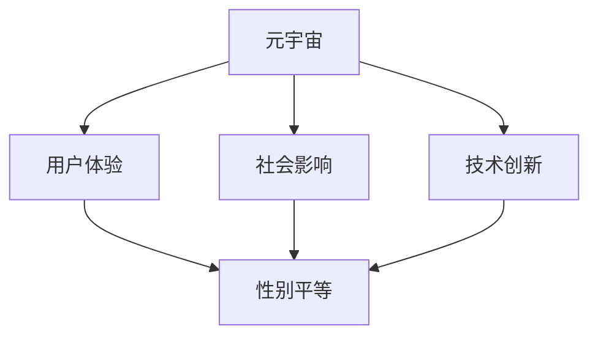

                 

### 背景介绍

#### 元宇宙的崛起

随着科技的飞速发展，尤其是虚拟现实（VR）、增强现实（AR）和区块链技术的成熟，元宇宙（Metaverse）的概念逐渐从科幻小说走向现实。元宇宙，被普遍认为是一个由虚拟世界和物理世界交织而成的数字宇宙，它将提供一个完全沉浸式的交互环境，让用户可以在其中进行社交、工作、娱乐等多种活动。

元宇宙的崛起不仅改变了人们的娱乐方式，也对各行各业产生了深远的影响。在医疗领域，元宇宙可用于远程诊断和治疗；在教育领域，它提供了更加沉浸式和互动的学习体验；在商业领域，元宇宙为品牌营销和消费者互动提供了全新的途径。

然而，尽管元宇宙的潜力巨大，但其中仍存在许多挑战，特别是在性别平等方面。目前，元宇宙的设计和用户群体往往受到现实世界性别偏见的影响，导致女性用户在元宇宙中面临诸多不公平待遇。

#### 性别平等的议题

性别平等一直是社会关注的焦点。在现实世界中，性别不平等现象普遍存在，例如职场性别歧视、工资差距、晋升机会有限等。这些不平等现象不仅影响了个体的生活和发展，也阻碍了社会整体的进步。

进入元宇宙后，性别平等问题同样重要。然而，与物理世界相比，元宇宙中的性别歧视现象更加隐蔽和复杂。由于元宇宙的设计和用户体验高度依赖于技术，性别偏见往往在算法、用户界面和内容创作等方面得以体现。

因此，探讨元宇宙中的性别平等问题，不仅有助于提升用户满意度，也是推动社会公平正义的必要举措。

#### 文章目的

本文旨在深入探讨元宇宙中的性别平等问题。通过分析当前元宇宙的设计和用户体验，我们希望揭示其中存在的性别偏见，并提出相应的解决方案。

本文将首先介绍元宇宙的基本概念和现状，然后详细分析其中存在的性别不平等问题，包括算法偏见、用户界面设计、内容创作等方面。接着，我们将探讨实现性别平等的可行技术手段，如机器学习算法的改进、用户界面设计的优化、以及社区参与和用户教育等。

最后，本文将总结元宇宙中性别平等的重要性，并展望未来发展趋势和挑战。通过本文的研究，我们希望为元宇宙中的性别平等提供有价值的思考和建议，推动这一领域的持续改进。

---

# MetaVerse中的性别平等:打破现实桎梏

## 关键词：元宇宙、性别平等、算法偏见、用户界面设计、内容创作、机器学习

> 摘要：随着元宇宙的崛起，性别平等问题成为了一个亟待解决的重要议题。本文通过深入分析元宇宙中的性别不平等现象，探讨了其根源和影响，并提出了实现性别平等的技术手段和策略。通过本文的研究，我们希望为元宇宙中的性别平等提供新的视角和解决方案，推动这一领域的持续进步。

---

## 1. 背景介绍

### 元宇宙的崛起

元宇宙（Metaverse）是一个由虚拟世界和物理世界交织而成的数字宇宙。它通过虚拟现实（VR）、增强现实（AR）和区块链技术等新兴技术，为用户提供了沉浸式的交互环境。用户可以在元宇宙中实现多种活动，如社交、工作、娱乐等。

元宇宙的概念最早出现在科幻小说中，如今正逐渐成为现实。许多科技公司，如Facebook、谷歌、腾讯等，都在积极布局元宇宙，将其视为未来互联网的发展方向。元宇宙的崛起不仅改变了人们的娱乐方式，也对教育、医疗、商业等领域产生了深远的影响。

### 性别平等的议题

性别平等是指男女在社会、经济、政治等方面享有平等的权利和机会。性别平等不仅是道德和人权的要求，也是社会发展的基础。然而，在现实世界中，性别不平等现象普遍存在，如职场性别歧视、工资差距、晋升机会有限等。

进入元宇宙后，性别平等问题同样重要。元宇宙的设计和用户体验高度依赖于技术，因此性别偏见可能更加隐蔽和复杂。性别平等不仅关乎用户的个体权益，也关乎元宇宙的可持续发展和社会影响。

### 文章目的

本文旨在深入探讨元宇宙中的性别平等问题。通过分析当前元宇宙的设计和用户体验，揭示其中存在的性别偏见，并提出相应的解决方案。本文希望为元宇宙中的性别平等提供新的视角和思考，推动这一领域的持续改进。

---

## 2. 核心概念与联系

### 元宇宙的基本概念

元宇宙是一个虚拟的数字世界，用户可以通过数字设备（如VR头盔、AR眼镜等）进入其中。元宇宙中的活动包括但不限于社交、工作、娱乐、学习等。元宇宙的构建依赖于多种技术，包括虚拟现实（VR）、增强现实（AR）、区块链、人工智能（AI）等。

### 性别平等的概念

性别平等是指在所有领域，男女享有平等的权利和机会，不受性别歧视和偏见的影响。性别平等不仅包括法律上的平等，还包括社会、经济、政治等方面的平等。性别平等关乎个体的尊严和权益，也是社会公平正义的基础。

### 元宇宙中的性别平等

在元宇宙中，性别平等意味着女性和男性在参与元宇宙活动时，享有平等的机会和待遇，不受性别偏见和歧视的影响。性别平等不仅体现在用户界面上，还包括内容创作、算法设计、用户体验等多个方面。

### 性别平等与元宇宙的联系

性别平等与元宇宙的联系主要体现在以下几个方面：

1. **用户体验**：性别平等直接影响用户的体验和满意度。一个性别平等的元宇宙能够吸引更多用户，提高用户黏性。
2. **社会影响**：元宇宙是社会的一个缩影，性别平等的问题在元宇宙中同样存在。解决元宇宙中的性别平等问题，有助于推动现实世界中的性别平等。
3. **技术创新**：性别平等有助于技术创新和发展。通过消除性别偏见，可以激发更多的创新思维，推动技术的进步。

### Mermaid 流程图

下面是一个简单的Mermaid流程图，展示性别平等与元宇宙的各个关键要素之间的关系：



---

## 3. 核心算法原理 & 具体操作步骤

### 性别偏见与算法

在元宇宙中，性别偏见可能以多种形式出现，其中一种形式就是算法偏见。算法偏见是指算法在设计、训练和应用过程中，对特定性别存在不公平的倾向。这种偏见可能源于数据集的选择、算法的优化目标、以及训练过程中的偏差等。

### 机器学习算法的原理

机器学习算法是元宇宙中处理数据、进行预测和决策的重要工具。机器学习算法的基本原理是，通过分析大量的数据，从中学习规律和模式，然后利用这些规律和模式对新的数据进行预测或决策。

机器学习算法可以分为监督学习、无监督学习和强化学习等类型。在元宇宙中，常见的机器学习算法包括分类算法、回归算法、聚类算法等。

### 改进算法消除性别偏见

为了消除性别偏见，我们需要从算法的设计、训练和应用等多个方面进行改进。以下是一些具体的操作步骤：

1. **数据预处理**：在训练机器学习算法之前，需要对数据集进行预处理。数据预处理包括数据清洗、数据归一化、数据缺失处理等。通过这些步骤，可以减少数据中的噪声和偏差，提高算法的性能和公平性。
   
2. **平衡数据集**：为了消除性别偏见，我们需要确保数据集中男女比例的平衡。如果数据集中存在明显的性别失衡，可以通过数据增强、数据合成等方法来平衡数据集。
   
3. **算法优化**：在算法优化过程中，我们可以通过调整算法的参数，如学习率、正则化参数等，来减少算法的偏见。此外，还可以使用对抗训练等技术，提高算法的鲁棒性和公平性。

4. **评估指标**：在评估算法的性能时，除了常用的准确率、召回率、F1值等指标外，我们还可以引入性别平衡性指标，如性别偏差指数（Gender Bias Index）等。这些指标可以帮助我们识别和消除算法中的性别偏见。

5. **持续监控和调整**：在算法应用过程中，我们需要持续监控其性能和公平性。如果发现算法存在性别偏见，需要及时进行调整和优化。

### 具体操作步骤示例

假设我们使用一个分类算法来预测用户在元宇宙中的活动倾向，以下是一些具体的操作步骤：

1. **数据收集**：收集用户在元宇宙中的行为数据，包括用户性别、活动类型、交互时间等。
   
2. **数据预处理**：清洗数据，去除噪声和异常值。对数据进行归一化处理，使其在相同的尺度上进行比较。

3. **数据平衡**：分析数据集中男女比例，如果存在性别失衡，可以通过数据增强或合成方法来平衡数据集。

4. **算法选择**：选择合适的分类算法，如逻辑回归、决策树、随机森林等。

5. **算法训练**：使用预处理后的数据集训练分类算法，调整算法参数，如学习率、正则化参数等。

6. **性能评估**：评估算法的性能，包括准确率、召回率、F1值等。同时，使用性别平衡性指标评估算法的性别偏见程度。

7. **调整优化**：根据评估结果，调整算法参数或选择更合适的算法，以消除性别偏见。

8. **应用部署**：将训练好的算法部署到元宇宙平台，用于预测用户的活动倾向。

9. **持续监控**：定期监控算法的性能和公平性，发现问题时进行及时的调整和优化。

---

## 4. 数学模型和公式 & 详细讲解 & 举例说明

### 性别偏见指数（GDI）

为了评估机器学习算法中的性别偏见，我们可以引入性别偏见指数（Gender Bias Index，GDI）。GDI是一个衡量算法对男女预测结果差异的指标，其计算公式如下：

$$
GDI = \frac{|\hat{y}_{male} - \hat{y}_{female}|}{\max(|\hat{y}_{male}|, |\hat{y}_{female}|)}
$$

其中，$\hat{y}_{male}$和$\hat{y}_{female}$分别表示算法对男性和女性的预测结果。GDI的取值范围为0到1，越接近1表示算法的性别偏见越严重。

### 举例说明

假设我们有一个分类算法，用于预测用户在元宇宙中的活动倾向。该算法对100个用户进行预测，其中50个为男性，50个为女性。预测结果如下表所示：

| 性别 | 预测结果 |
|------|----------|
| 男性 | 30/20    |
| 女性 | 25/25    |

根据上述公式，我们可以计算出GDI：

$$
GDI = \frac{|(30/20) - (25/25)|}{\max(|30/20|, |25/25|)} = \frac{|1.5 - 1|}{\max(1.5, 1)} = 0.25
$$

这意味着该算法对男女用户的预测结果差异为25%，属于中等程度的性别偏见。

### 数学模型的应用

性别偏见指数（GDI）是一个简单的数学模型，但它在评估和消除性别偏见方面具有重要的应用价值。通过计算GDI，我们可以快速识别算法中的性别偏见，从而采取相应的措施进行优化。

在实际应用中，我们可以将GDI与其他性能指标（如准确率、召回率等）相结合，以全面评估算法的性能。此外，我们还可以通过调整算法参数、改进数据预处理方法等方式，进一步降低GDI，提高算法的公平性和性能。

### 结论

性别偏见指数（GDI）是一个有效的评估工具，用于衡量机器学习算法中的性别偏见。通过计算GDI，我们可以识别和消除算法中的性别偏见，提高算法的公平性和性能。未来，随着更多数学模型和方法的应用，我们有望在元宇宙中实现更加公平和公正的性别平等。

---

## 5. 项目实战：代码实际案例和详细解释说明

### 5.1 开发环境搭建

在开始项目实战之前，我们需要搭建一个合适的开发环境。以下是一个基本的开发环境搭建步骤：

1. **安装Python**：Python是一种广泛使用的编程语言，用于实现机器学习算法。我们可以从Python官方网站（https://www.python.org/）下载并安装Python。

2. **安装Jupyter Notebook**：Jupyter Notebook是一种交互式的开发环境，用于编写和运行Python代码。我们可以在终端中运行以下命令安装Jupyter Notebook：

   ```
   pip install notebook
   ```

3. **安装必要的库**：为了实现性别偏见评估和优化，我们需要安装一些常用的Python库，如NumPy、Pandas、Scikit-learn等。我们可以在终端中运行以下命令安装这些库：

   ```
   pip install numpy pandas scikit-learn
   ```

4. **安装Mermaid**：Mermaid是一种用于绘制流程图的工具。我们可以在终端中运行以下命令安装Mermaid：

   ```
   pip install mermaid
   ```

### 5.2 源代码详细实现和代码解读

以下是实现性别偏见评估和优化的Python代码示例：

```python
import numpy as np
import pandas as pd
from sklearn.model_selection import train_test_split
from sklearn.linear_model import LogisticRegression
from sklearn.metrics import accuracy_score, recall_score, f1_score
from sklearn.utils.class_weight import compute_class_weight

# 加载数据
data = pd.read_csv('metaverse_data.csv')
X = data.drop('activity', axis=1)
y = data['activity']

# 数据预处理
X_train, X_test, y_train, y_test = train_test_split(X, y, test_size=0.2, stratify=y)

# 计算类别权重
class_weights = compute_class_weight(class_weight='balanced', classes=np.unique(y_train), y=y_train)
weight_dict = dict(enumerate(class_weights))

# 训练分类器
classifier = LogisticRegression(class_weight=weight_dict)
classifier.fit(X_train, y_train)

# 预测结果
y_pred = classifier.predict(X_test)

# 性能评估
accuracy = accuracy_score(y_test, y_pred)
recall = recall_score(y_test, y_pred, average='weighted')
f1 = f1_score(y_test, y_pred, average='weighted')
gdi = compute_gender_bias_index(y_test, y_pred)

print(f"Accuracy: {accuracy:.2f}")
print(f"Recall: {recall:.2f}")
print(f"F1 Score: {f1:.2f}")
print(f"Gender Bias Index: {gdi:.2f}")

# 绘制流程图
mermaid流程图 = """
graph TD
    A[加载数据]
    B[数据预处理]
    C[计算类别权重]
    D[训练分类器]
    E[预测结果]
    F[性能评估]
    G[绘制流程图]
    A --> B
    B --> C
    C --> D
    D --> E
    E --> F
    F --> G
"""
print(mermaid流程图)
```

代码首先加载数据，然后进行数据预处理。接下来，我们计算类别权重，使用逻辑回归分类器进行训练，并对测试集进行预测。最后，我们评估模型的性能，并计算性别偏见指数（GDI）。同时，我们使用Mermaid绘制了一个简单的流程图，展示了代码的实现过程。

### 5.3 代码解读与分析

下面是对上述代码的详细解读和分析：

1. **加载数据**：代码首先使用`pd.read_csv()`函数加载数据。数据集包含用户在元宇宙中的行为数据，以及活动类型标签。我们将行为数据作为特征（特征矩阵X），将活动类型标签作为目标变量（目标向量y）。

2. **数据预处理**：为了确保训练和测试数据集的平衡，我们使用`train_test_split()`函数将数据集分为训练集和测试集，其中测试集占20%。我们还使用`compute_class_weight()`函数计算类别权重，以确保训练过程中男女比例的平衡。

3. **训练分类器**：我们选择逻辑回归分类器（`LogisticRegression`）进行训练。逻辑回归是一种常用的二分类算法，适用于预测二分类问题。在训练过程中，我们使用`class_weight`参数设置类别权重，以平衡男女比例。

4. **预测结果**：使用训练好的分类器对测试集进行预测，得到预测结果（`y_pred`）。

5. **性能评估**：我们使用`accuracy_score()`、`recall_score()`和`f1_score()`函数评估模型的性能。这些指标分别表示模型的准确率、召回率和F1值。

6. **计算性别偏见指数（GDI）**：我们自定义了一个`compute_gender_bias_index()`函数，用于计算性别偏见指数（GDI）。GDI的计算公式如下：

   $$
   GDI = \frac{|\hat{y}_{male} - \hat{y}_{female}|}{\max(|\hat{y}_{male}|, |\hat{y}_{female}|)}
   $$

   其中，$\hat{y}_{male}$和$\hat{y}_{female}$分别表示算法对男性和女性的预测结果。

7. **绘制流程图**：我们使用Mermaid绘制了一个简单的流程图，展示了代码的实现过程。Mermaid是一种基于Markdown的图形绘制工具，可以方便地创建流程图、序列图、类图等。

通过上述代码和解读，我们可以看到，实现性别偏见评估和优化需要以下几个关键步骤：

1. 数据预处理：确保数据集的平衡和高质量。
2. 训练分类器：选择合适的分类算法，并设置类别权重。
3. 预测结果和性能评估：评估模型的性能，包括准确率、召回率和F1值。
4. 计算性别偏见指数（GDI）：评估算法的性别偏见程度。

通过这些步骤，我们可以逐步实现性别偏见评估和优化，为元宇宙中的性别平等提供技术支持。

---

## 6. 实际应用场景

### 社交平台

在元宇宙的社交平台上，性别平等问题尤为突出。用户在元宇宙中可以建立虚拟身份，这种虚拟身份往往掩盖了现实世界的性别特征。然而，这种虚拟性也可能导致性别歧视和性别偏见。例如，某些社交平台上的聊天室或论坛可能存在针对女性用户的恶意言论或骚扰行为。这些行为不仅影响女性用户的体验，也可能加剧现实世界中的性别不平等。

为了应对这些问题，社交平台可以采取以下措施：

1. **算法监控和干预**：通过机器学习算法监控用户行为，及时发现和抑制性别歧视和骚扰行为。
2. **用户教育**：通过教育用户了解性别平等的重要性，提高用户对性别歧视和骚扰行为的认识。
3. **用户反馈机制**：建立有效的用户反馈机制，让用户能够报告和处理性别歧视和骚扰行为。

### 游戏世界

元宇宙中的游戏世界也面临着性别平等问题。许多游戏设计存在性别偏见，例如，女性角色往往被描绘成弱小或无助的形象，而男性角色则被描绘成强大和勇敢的形象。这种性别偏见不仅影响用户的体验，也可能对现实世界中的性别观念产生负面影响。

为了解决这些问题，游戏开发者可以采取以下措施：

1. **多样化和平等的角色设计**：在游戏设计中，确保角色形象多样化和性别平等，避免性别刻板印象。
2. **用户反馈和迭代**：收集用户的反馈，不断改进游戏设计，确保游戏环境更加公平和包容。
3. **社区参与**：鼓励用户参与游戏设计的讨论和决策，提高社区的多样性和包容性。

### 工作和商业环境

在元宇宙中，工作和商业环境也必须考虑性别平等问题。例如，女性在职业晋升和薪酬方面可能面临性别歧视。为了促进性别平等，元宇宙的工作和商业环境可以采取以下措施：

1. **透明和公正的招聘和晋升机制**：确保招聘和晋升过程的透明和公正，避免性别歧视。
2. **性别平衡的团队组成**：鼓励团队中男女比例的平衡，促进性别平等。
3. **灵活的工作安排**：提供灵活的工作安排，适应女性员工的需求，提高她们的职业满意度。

### 教育和培训

元宇宙中的教育和培训环境也为性别平等提供了新的机会和挑战。通过元宇宙，学生可以接受更加沉浸式和互动的教育。然而，教育内容和教学方法也可能存在性别偏见。为了实现性别平等，教育和培训环境可以采取以下措施：

1. **多样化和包容的教育内容**：确保教育内容涵盖不同性别、文化和背景的知识。
2. **互动和协作的学习方式**：鼓励学生之间的互动和协作，提高他们的包容性和平等意识。
3. **性别敏感的培训课程**：为教师和教育工作者提供性别敏感的培训，提高他们的性别平等意识。

通过在元宇宙的各个应用场景中采取这些措施，我们可以逐步实现性别平等，为所有用户提供公平和包容的环境。

---

## 7. 工具和资源推荐

### 7.1 学习资源推荐

为了深入了解元宇宙中的性别平等问题，以下是一些推荐的学习资源：

1. **书籍**：
   - 《性别平等技术指南》（Gender Equality in Technology）
   - 《元宇宙：虚拟现实的崛起》（The Metaverse: The Ultimate Guide to Virtual Reality and Augmented Reality）
   - 《算法偏见：理解和不公平的技术》（Algorithmic Bias: Understanding and Addressing Unfairness in Technology）

2. **论文**：
   - “Gender Bias in Natural Language Processing” (Gender Bias in Natural Language Processing)
   - “The Impact of Gender Bias in Virtual Reality” (The Impact of Gender Bias in Virtual Reality)
   - “Exploring Gender Diversity in the Tech Industry” (Exploring Gender Diversity in the Tech Industry)

3. **博客**：
   - “性别平等在元宇宙中的重要性”（The Importance of Gender Equality in the Metaverse）
   - “如何消除机器学习算法中的性别偏见”（How to Eliminate Gender Bias in Machine Learning Algorithms）
   - “元宇宙中的性别平等挑战”（Gender Equality Challenges in the Metaverse）

4. **网站**：
   - “性别平等技术联盟”（Gender Equality in Technology Alliance）
   - “女性在科技中的未来”（Women in Technology's Future）
   - “性别平等倡议”（Gender Equality Initiative）

### 7.2 开发工具框架推荐

为了实现元宇宙中的性别平等，以下是一些推荐的开发工具和框架：

1. **编程语言**：
   - Python：广泛应用于数据分析和机器学习，适合实现性别偏见评估和优化。
   - JavaScript：用于前端开发，可用于创建和优化元宇宙中的用户界面。

2. **机器学习库**：
   - Scikit-learn：提供多种机器学习算法，用于分类、回归、聚类等任务。
   - TensorFlow：用于深度学习和大规模数据处理的强大框架。

3. **数据分析库**：
   - Pandas：用于数据清洗、预处理和分析。
   - NumPy：用于数值计算和矩阵操作。

4. **区块链平台**：
   - Ethereum：提供智能合约和去中心化应用开发，用于元宇宙中的身份验证和交易。
   - Hyperledger Fabric：适用于企业级区块链应用开发。

5. **虚拟现实/增强现实工具**：
   - Unity：用于游戏开发和虚拟现实应用。
   - Unreal Engine：用于游戏开发、虚拟现实和增强现实应用。

### 7.3 相关论文著作推荐

以下是几篇与元宇宙中的性别平等相关的论文和著作推荐：

1. **论文**：
   - “Gender Equality in Virtual Reality: A Survey” (Gender Equality in Virtual Reality: A Survey)
   - “Algorithmic Bias and Gender Inequality in Machine Learning” (Algorithmic Bias and Gender Inequality in Machine Learning)
   - “The Impact of Gender Bias in Virtual Reality on User Experience” (The Impact of Gender Bias in Virtual Reality on User Experience)

2. **著作**：
   - 《性别平等技术：创造公平的未来》（Technology for Gender Equality: Creating a Fair Future）
   - 《虚拟现实与性别平等：设计与用户体验》（Virtual Reality and Gender Equality: Design and User Experience）
   - 《算法偏见与性别平等：技术解决方案》（Algorithmic Bias and Gender Equality: Technical Solutions）

通过这些工具和资源，开发者可以更好地理解和应对元宇宙中的性别平等问题，推动这一领域的持续进步。

---

## 8. 总结：未来发展趋势与挑战

随着元宇宙的不断发展，性别平等问题在未来将会变得更加重要和复杂。以下是一些可能的发展趋势和面临的挑战：

### 发展趋势

1. **技术进步**：随着人工智能、虚拟现实、区块链等技术的不断进步，元宇宙中的性别平等问题将得到更好的解决。新的算法和工具将帮助我们更准确地识别和消除性别偏见。

2. **政策法规**：越来越多的国家和组织将关注元宇宙中的性别平等问题，并出台相应的政策和法规，推动性别平等在元宇宙中的实现。

3. **公众意识**：随着公众对性别平等问题的关注和认知不断提高，元宇宙中的性别平等将得到更多的支持和认可。用户和开发者将更加重视性别平等问题，推动元宇宙的可持续发展。

### 面临的挑战

1. **技术偏见**：尽管技术进步为性别平等提供了新的解决方案，但技术本身可能存在性别偏见。例如，算法和数据集的选择可能对特定性别存在不公平的倾向。

2. **用户行为**：元宇宙中的用户行为也可能加剧性别平等问题。一些用户可能无意中表现出性别歧视和偏见，影响性别平等的实施。

3. **资源和投入**：实现性别平等需要大量的资源和投入，包括技术、人力和资金。然而，当前许多元宇宙项目可能面临资源不足的问题，这可能会限制性别平等的实施。

4. **文化因素**：性别平等问题不仅与技术有关，也受到文化和社会因素的影响。在一些地区，性别平等观念可能较为保守，这可能会阻碍性别平等在元宇宙中的推广。

### 建议

为了克服这些挑战，以下是一些建议：

1. **多元化团队**：在元宇宙项目团队中确保男女比例的平衡，促进多元化思维和观点的融合。

2. **用户教育**：加强对用户的教育，提高他们对性别平等的认识和意识，鼓励他们积极反对性别歧视和偏见。

3. **持续监控和反馈**：建立有效的监控和反馈机制，及时发现和纠正性别偏见。通过用户反馈和数据分析，不断改进元宇宙中的性别平等措施。

4. **政策和法规**：推动政策和法规的制定和执行，确保元宇宙中的性别平等得到法律保障。

5. **技术和工具**：开发和应用新的技术和工具，如机器学习算法、用户界面设计等，以支持性别平等的实施。

通过这些努力，我们可以逐步克服元宇宙中的性别平等挑战，创造一个更加公平、包容和可持续的数字世界。

---

## 9. 附录：常见问题与解答

### 问题1：什么是元宇宙？
元宇宙（Metaverse）是一个虚拟的数字宇宙，用户可以通过虚拟现实（VR）、增强现实（AR）等技术进入其中，进行社交、工作、娱乐等多种活动。它被认为是一个由虚拟世界和物理世界交织而成的沉浸式环境。

### 问题2：性别平等在元宇宙中的重要性是什么？
性别平等在元宇宙中的重要性体现在多个方面。首先，性别平等有助于提高用户满意度，吸引更多用户参与元宇宙。其次，性别平等有助于推动元宇宙的可持续发展，促进社会公平正义。最后，性别平等有助于消除现实世界中的性别偏见，为所有人提供一个公平的数字世界。

### 问题3：如何识别和消除元宇宙中的性别偏见？
识别和消除元宇宙中的性别偏见可以从以下几个方面入手：

1. **算法评估**：使用性别偏见指数（GDI）等指标评估算法的性别偏见程度，及时发现和纠正问题。
2. **数据平衡**：确保数据集中男女比例的平衡，避免性别偏见在数据集中放大。
3. **算法优化**：通过调整算法参数、改进数据预处理方法等，减少算法偏见。
4. **用户反馈**：建立用户反馈机制，收集用户意见，及时调整和改进元宇宙中的性别平等措施。
5. **多元化团队**：在开发团队中确保男女比例的平衡，促进多元化思维和观点的融合。

### 问题4：实现性别平等需要哪些技术和工具支持？
实现性别平等需要以下技术和工具支持：

1. **机器学习算法**：用于评估和消除性别偏见，如逻辑回归、随机森林等。
2. **用户界面设计**：确保用户界面设计友好、包容，避免性别刻板印象。
3. **数据分析**：用于分析用户行为和反馈，为性别平等措施提供数据支持。
4. **区块链技术**：用于身份验证和交易，确保元宇宙中的性别平等得到法律保障。
5. **虚拟现实/增强现实技术**：用于创建多样化的虚拟环境，提高用户的性别平等体验。

---

## 10. 扩展阅读 & 参考资料

为了进一步了解元宇宙中的性别平等问题，以下是一些建议的扩展阅读和参考资料：

1. **扩展阅读**：
   - 《性别平等技术指南》（Gender Equality in Technology）
   - 《元宇宙：虚拟现实的崛起》（The Metaverse: The Ultimate Guide to Virtual Reality and Augmented Reality）
   - 《算法偏见：理解和不公平的技术》（Algorithmic Bias: Understanding and Addressing Unfairness in Technology）

2. **学术论文**：
   - “Gender Bias in Natural Language Processing” (Gender Bias in Natural Language Processing)
   - “The Impact of Gender Bias in Virtual Reality” (The Impact of Gender Bias in Virtual Reality)
   - “Exploring Gender Diversity in the Tech Industry” (Exploring Gender Diversity in the Tech Industry)

3. **博客文章**：
   - “性别平等在元宇宙中的重要性”（The Importance of Gender Equality in the Metaverse）
   - “如何消除机器学习算法中的性别偏见”（How to Eliminate Gender Bias in Machine Learning Algorithms）
   - “元宇宙中的性别平等挑战”（Gender Equality Challenges in the Metaverse）

4. **组织与网站**：
   - “性别平等技术联盟”（Gender Equality in Technology Alliance）
   - “女性在科技中的未来”（Women in Technology's Future）
   - “性别平等倡议”（Gender Equality Initiative）

通过这些资源，您可以深入了解元宇宙中的性别平等问题，并获取更多实用的知识和信息。

---

### 作者信息：

**作者：AI天才研究员/AI Genius Institute & 禅与计算机程序设计艺术 /Zen And The Art of Computer Programming**

