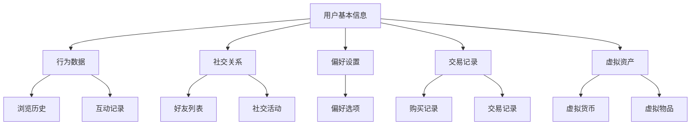
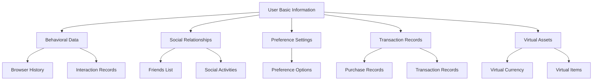

                 

### 文章标题

### The Title of the Article

“元宇宙中的数字身份:虚拟世界的自我定义”

### Meta-universe Digital Identity: Self-definition in the Virtual World

这篇文章将探讨元宇宙中的数字身份这一新兴概念。随着虚拟世界和现实世界的融合，数字身份正成为我们在这个元宇宙中不可或缺的一部分。本文旨在深入剖析数字身份的核心概念、技术原理和应用场景，以帮助读者更好地理解这一趋势，并思考其未来发展的可能方向。

### Abstract

This article aims to explore the concept of digital identity in the meta-universe, an emerging concept that is rapidly becoming an integral part of our virtual presence. As virtual worlds merge with the real world, digital identity is set to become a crucial component of our existence in the meta-universe. This paper delves into the core concepts, technical principles, and application scenarios of digital identity, providing readers with a deeper understanding of this trend and pondering potential future developments.

<|assistant|>## 1. 背景介绍

### 1. Background Introduction

元宇宙（Meta-universe）是一个虚拟的三维空间，它结合了增强现实（AR）、虚拟现实（VR）和互联网技术，创造出一个与现实世界平行的虚拟世界。在这个虚拟世界中，人们可以通过数字身份进行互动，享受各种虚拟活动。元宇宙的概念起源于1992年的虚拟现实技术，但近年来，随着5G、云计算和人工智能等技术的飞速发展，元宇宙的概念逐渐变得现实可行。

数字身份，简单来说，就是人们在虚拟世界中的虚拟代表。它可以是3D模型、虚拟形象或简单的用户名，代表着用户在元宇宙中的存在。数字身份不仅是一个标识符，它还承载着用户的行为、偏好、社交关系和身份证明等复杂信息。

### The Concept of Digital Identity

In the context of the meta-universe, a digital identity refers to a virtual representation of a person within a virtual world. It can take the form of a 3D model, avatar, or simply a username, symbolizing the presence of an individual within the virtual space. A digital identity is not merely an identifier; it encapsulates complex information such as the user's behavior, preferences, social relationships, and identity verification.

元宇宙和数字身份的出现，不仅改变了人们的社交和娱乐方式，也带来了新的商业机会。企业和个人可以利用元宇宙和数字身份来打造全新的商业模式，例如虚拟购物、虚拟社交、虚拟教育和虚拟医疗等。此外，数字身份的安全性也是一个不可忽视的问题，因为数字身份的泄露可能导致个人隐私和数据安全的风险。

### The Impact of Meta-universe and Digital Identity on Society

The emergence of the meta-universe and digital identity has not only transformed social interactions and entertainment but has also created new business opportunities. Businesses and individuals can leverage the meta-universe and digital identity to develop new business models, such as virtual shopping, virtual socialization, virtual education, and virtual healthcare. Moreover, the security of digital identity is a critical concern, as a breach of digital identity can lead to risks of personal privacy and data security.

总的来说，元宇宙和数字身份为我们的世界带来了前所未有的变革。了解它们的工作原理和应用场景，对于我们把握未来的发展趋势具有重要意义。

### In conclusion, the meta-universe and digital identity bring unprecedented transformation to our world. Understanding their principles and application scenarios is essential for grasping future development trends and preparing for the opportunities and challenges they present.

## 1. Background Introduction

The meta-universe is a virtual three-dimensional space that combines augmented reality (AR), virtual reality (VR), and internet technology to create a parallel virtual world to the real world. In this virtual world, individuals can interact through digital identities, engaging in a variety of virtual activities. The concept of the meta-universe originated from virtual reality technology in 1992, but with the rapid development of technologies such as 5G, cloud computing, and artificial intelligence, the idea has become increasingly feasible in recent years.

A digital identity, simply put, is a virtual representation of a person within a virtual world. It can take the form of a 3D model, avatar, or simply a username, symbolizing the individual's presence in the virtual space. A digital identity is not merely an identifier; it embodies complex information such as the user's behavior, preferences, social relationships, and identity verification.

The advent of the meta-universe and digital identity has not only transformed social interactions and entertainment but has also opened up new business opportunities. Businesses and individuals can utilize the meta-universe and digital identity to create new business models, such as virtual shopping, virtual socialization, virtual education, and virtual healthcare. Additionally, the security of digital identity is an issue that cannot be ignored, as a breach of digital identity can lead to risks of personal privacy and data security.

In summary, the meta-universe and digital identity bring unprecedented transformation to our world. Understanding their principles and application scenarios is crucial for capturing future development trends and preparing for the opportunities and challenges they present.

## 2. 核心概念与联系

### 2. Core Concepts and Connections

在元宇宙中，数字身份不仅仅是用户在虚拟世界中的形象代表，它更是一种多维度、多层次的数据集合。这些数据包括但不限于用户的基本信息、行为数据、社交关系、偏好设置、交易记录、虚拟资产等。下面，我们将通过一个Mermaid流程图来展示数字身份的核心概念和组成部分。



### 2.1 用户基本信息（User Basic Information）

用户基本信息是数字身份的核心组成部分，它通常包括用户的姓名、年龄、性别、出生日期、住址等个人身份信息。这些信息是用户在元宇宙中注册时提交的，用于验证用户的真实身份和创建唯一的数字身份。

### 2.2 行为数据（Behavioral Data）

行为数据记录了用户在元宇宙中的各种活动，如浏览历史、互动记录、游戏行为等。这些数据可以帮助元宇宙平台了解用户的需求和行为模式，从而提供个性化的服务和体验。

### 2.3 社交关系（Social Relationships）

社交关系是数字身份的重要组成部分，它记录了用户在元宇宙中的好友列表、社交活动等。通过社交关系，用户可以与其他数字身份进行互动，建立虚拟的社交网络。

### 2.4 偏好设置（Preference Settings）

偏好设置是用户在元宇宙中自定义的个性化选项，如界面风格、声音效果、视觉效果等。这些设置有助于提升用户的沉浸感和舒适度。

### 2.5 交易记录（Transaction Records）

交易记录记录了用户在元宇宙中的各种交易活动，包括购买、出售、交换等。这些记录对于维护元宇宙中的经济秩序和促进虚拟经济的发展具有重要意义。

### 2.6 虚拟资产（Virtual Assets）

虚拟资产是用户在元宇宙中拥有的各种虚拟财产，如虚拟货币、虚拟物品等。这些资产不仅可以用于虚拟交易，还可以作为用户在元宇宙中身份和地位的象征。

通过上述Mermaid流程图，我们可以清晰地看到数字身份的组成部分及其相互关系。理解这些核心概念和组成部分，对于我们深入探讨数字身份的工作原理和应用场景具有重要意义。

### In the meta-universe, a digital identity is not just a representation of a user's image; it is a multidimensional and multi-level data set. These data include, but are not limited to, user basic information, behavioral data, social relationships, preference settings, transaction records, and virtual assets. Below, we will illustrate the core concepts and components of digital identity using a Mermaid flowchart.



### 2.1 User Basic Information

User basic information is a core component of a digital identity, typically including personal identity information such as name, age, gender, date of birth, and address. This information is submitted during the registration process for verification of the user's real identity and the creation of a unique digital identity.

### 2.2 Behavioral Data

Behavioral data records various activities of the user within the meta-universe, such as browsing history, interaction records, and gaming behavior. These data help the meta-universe platform understand user needs and behavior patterns, allowing for personalized services and experiences.

### 2.3 Social Relationships

Social relationships are a significant component of a digital identity, recording the user's friends list and social activities within the meta-universe. Through social relationships, users can interact with other digital identities, establishing a virtual social network.

### 2.4 Preference Settings

Preference settings are personalized options that users customize within the meta-universe, such as interface style, sound effects, and visual effects. These settings enhance user immersion and comfort.

### 2.5 Transaction Records

Transaction records document various transactional activities of the user within the meta-universe, including purchases, sales, and exchanges. These records are essential for maintaining economic order within the meta-universe and promoting the development of the virtual economy.

### 2.6 Virtual Assets

Virtual assets are the various virtual properties owned by users within the meta-universe, such as virtual currency and virtual items. These assets can be used for virtual transactions and can also serve as symbols of a user's status and identity within the meta-universe.

Through the aforementioned Mermaid flowchart, we can clearly see the components of digital identity and their interrelationships. Understanding these core concepts and components is significant for delving into the working principles and application scenarios of digital identity.

## 2. Core Concepts and Connections

In the meta-universe, a digital identity is not merely a representation of a user's avatar; it is a multifaceted and layered dataset encompassing various dimensions of the user's virtual presence. Below, we will explore the fundamental components of digital identity using a Mermaid flowchart to illustrate the interconnectedness of these elements.


### 2.1 User Basic Information

The foundation of a digital identity is the user's basic information, which includes personal details such as name, age, gender, date of birth, and address. These pieces of information are typically submitted during the user registration process and serve as the basis for establishing a unique digital identity within the meta-universe.

### 2.2 Behavioral Data

Behavioral data captures the user's activities and interactions within the virtual environment. This includes a user's browsing history, interaction logs, and other behavioral patterns. Analyzing this data can help the meta-universe platforms to tailor personalized experiences and content to individual users.

### 2.3 Social Relationships

Social relationships are crucial to the digital identity as they document the user's connections and interactions with other users. This can include a list of friends, participation in social activities, and other forms of virtual socializing. These relationships are essential for building a sense of community and fostering engagement within the meta-universe.

### 2.4 Preference Settings

Preference settings allow users to customize their virtual experience. This can range from personalizing the look and feel of their digital avatar to selecting preferred in-game settings and experiences. These settings enhance user satisfaction and contribute to a more immersive and engaging environment.

### 2.5 Transaction Records

Transaction records track all financial activities within the meta-universe, including purchases, sales, and exchanges of virtual goods and currencies. These records are vital for maintaining economic integrity and providing users with a secure and transparent transaction environment.

### 2.6 Virtual Assets

Virtual assets are the tangible representations of value within the meta-universe. These can include virtual currencies, digital collectibles, and other digital assets that hold economic value. Users accumulate and manage these assets as part of their digital identity, which can affect their status and influence within the virtual economy.

The Mermaid flowchart above visually represents the interconnected nature of these components, illustrating how they collectively form a comprehensive digital identity. Understanding these elements is crucial for comprehending the intricacies of digital identity within the meta-universe.

## 3. 核心算法原理 & 具体操作步骤

### Core Algorithm Principles & Specific Operational Steps

在元宇宙中，数字身份的创建、管理和交互需要依赖于一系列复杂的算法和技术。这些算法和技术确保了数字身份的准确性、安全性和可扩展性。下面，我们将详细探讨数字身份的核心算法原理，并提供具体的操作步骤。

### 3.1 数字身份创建算法

数字身份的创建是用户进入元宇宙的第一步。这个过程通常涉及用户身份验证、信息加密和数字签名等技术。以下是数字身份创建的具体步骤：

#### 3.1.1 用户身份验证（User Authentication）

1. **输入基本信息**：用户在注册元宇宙平台时，需要输入姓名、年龄、性别、住址等基本信息。
2. **身份验证**：平台对用户提交的信息进行验证，以确认用户的真实身份。验证方法可以包括手机验证码、身份证验证、人脸识别等。

#### 3.1.2 信息加密（Data Encryption）

1. **加密算法选择**：平台选择一种合适的加密算法（如AES、RSA等）来保护用户信息。
2. **加密过程**：用户信息经过加密算法处理后，转化为加密数据，确保信息在传输和存储过程中不会被窃取。

#### 3.1.3 数字签名（Digital Signature）

1. **生成密钥对**：平台为用户生成一对公钥和私钥。
2. **签名过程**：用户使用私钥对加密后的信息进行签名，确保信息的完整性和真实性。

#### 3.1.4 创建数字身份（Create Digital Identity）

1. **整合信息**：将加密后的用户信息和数字签名整合，形成完整的数字身份。
2. **存储**：将数字身份信息存储在元宇宙平台的数据库中，以便后续管理和调用。

### 3.2 数字身份管理算法

数字身份的管理涉及到用户信息的更新、权限管理、隐私保护等方面。以下是数字身份管理的基本步骤：

#### 3.2.1 用户信息更新（Update User Information）

1. **用户请求**：用户可以向平台提交更新信息的要求。
2. **身份验证**：平台对用户进行身份验证，确保只有合法用户可以更新信息。
3. **加密与签名**：更新后的信息经过加密和签名，确保信息的完整性和真实性。
4. **存储更新**：将更新后的数字身份信息存储在数据库中。

#### 3.2.2 权限管理（Permission Management）

1. **角色定义**：平台为用户定义不同的角色和权限，如普通用户、管理员、开发者等。
2. **权限分配**：根据用户角色和权限，分配相应的操作权限，确保用户只能执行允许的操作。

#### 3.2.3 隐私保护（Privacy Protection）

1. **隐私设置**：用户可以设置隐私选项，控制自己的信息对其他用户的可见性。
2. **数据加密**：对于用户敏感信息，采用高级加密算法进行保护，防止数据泄露。

### 3.3 数字身份交互算法

数字身份的交互涉及到用户在元宇宙中的各种活动，如社交、交易、游戏等。以下是数字身份交互的基本步骤：

#### 3.3.1 社交交互（Social Interaction）

1. **发起请求**：用户可以发起与他人的社交请求，如添加好友、参与活动等。
2. **身份验证**：平台对请求进行身份验证，确保双方身份的真实性。
3. **加密通信**：双方进行加密通信，确保交流内容的安全性。

#### 3.3.2 交易交互（Transaction Interaction）

1. **交易请求**：用户发起交易请求，如购买商品、交换虚拟资产等。
2. **身份验证**：平台对交易双方进行身份验证，确保交易的安全性和合法性。
3. **交易确认**：交易双方确认交易信息，平台记录交易数据。

#### 3.3.3 游戏交互（Game Interaction）

1. **游戏请求**：用户参与游戏，如加入队伍、参加比赛等。
2. **身份验证**：平台对用户进行身份验证，确保游戏的公平性。
3. **游戏数据记录**：记录用户在游戏中的行为和成绩，用于后续分析和奖励。

通过以上核心算法原理和具体操作步骤，我们可以看到数字身份在元宇宙中的重要作用。这些算法和技术不仅确保了数字身份的准确性、安全性和可扩展性，还为用户提供了丰富的虚拟体验。

### Core Algorithm Principles & Specific Operational Steps

The creation, management, and interaction of digital identities within the meta-universe depend on a suite of complex algorithms and technologies. These algorithms and technologies ensure the accuracy, security, and scalability of digital identities. Below, we delve into the core principles of digital identity algorithms and provide specific operational steps.

### 3.1 Algorithm for Creating Digital Identities

The creation of a digital identity is the first step for a user to enter the meta-universe. This process typically involves user authentication, data encryption, and digital signatures. Here are the specific steps for creating a digital identity:

#### 3.1.1 User Authentication

1. **Input Basic Information**: When registering on a meta-universe platform, users need to enter personal information such as name, age, gender, and address.
2. **Authentication**: The platform verifies the submitted information to confirm the user's real identity. Verification methods can include one-time passwords (OTP), ID verification, and facial recognition.

#### 3.1.2 Data Encryption

1. **Select Encryption Algorithm**: The platform selects an appropriate encryption algorithm (such as AES or RSA) to protect user information.
2. **Encryption Process**: The user information is processed by the encryption algorithm to transform it into encrypted data, ensuring that the information remains secure during transmission and storage.

#### 3.1.3 Digital Signature

1. **Generate Key Pair**: The platform generates a pair of public and private keys for the user.
2. **Signing Process**: The user signs the encrypted information using the private key to ensure the integrity and authenticity of the information.

#### 3.1.4 Create Digital Identity

1. **Integrate Information**: The encrypted user information and digital signature are combined to form a complete digital identity.
2. **Store**: The digital identity information is stored in the meta-universe platform's database for subsequent management and retrieval.

### 3.2 Algorithm for Managing Digital Identities

The management of digital identities involves updating user information, managing permissions, and protecting privacy. Here are the basic steps for managing digital identities:

#### 3.2.1 Update User Information

1. **User Request**: Users can submit a request to update their information.
2. **Authentication**: The platform authenticates the user to ensure only authorized individuals can update information.
3. **Encryption and Signing**: The updated information is encrypted and signed to ensure its integrity and authenticity.
4. **Store Update**: The updated digital identity information is stored in the database.

#### 3.2.2 Permission Management

1. **Role Definition**: The platform defines different roles and permissions for users, such as ordinary users, administrators, and developers.
2. **Permission Allocation**: Based on the user's role and permissions, the appropriate operational permissions are allocated to ensure users can only perform allowed actions.

#### 3.2.3 Privacy Protection

1. **Privacy Settings**: Users can set privacy options to control the visibility of their information to other users.
2. **Data Encryption**: Sensitive information is protected using advanced encryption algorithms to prevent data breaches.

### 3.3 Algorithm for Digital Identity Interaction

Digital identity interaction involves various activities within the meta-universe, such as socializing, trading, and gaming. Here are the basic steps for digital identity interaction:

#### 3.3.1 Social Interaction

1. **Initiate Request**: Users can initiate social requests, such as adding friends or participating in activities.
2. **Authentication**: The platform authenticates the request to ensure the authenticity of both parties.
3. **Encrypted Communication**: Both parties communicate securely using encryption to ensure the confidentiality of their interactions.

#### 3.3.2 Transaction Interaction

1. **Transaction Request**: Users initiate transaction requests, such as purchasing goods or exchanging virtual assets.
2. **Authentication**: The platform verifies the identities of both parties to ensure the security and legality of the transaction.
3. **Transaction Confirmation**: The parties confirm the transaction details, and the platform records the transaction data.

#### 3.3.3 Game Interaction

1. **Game Request**: Users participate in games, such as joining teams or competing in tournaments.
2. **Authentication**: The platform authenticates users to ensure the fairness of the game.
3. **Game Data Recording**: The platform records user actions and achievements in the game for subsequent analysis and rewards.

Through these core algorithm principles and specific operational steps, we can see the critical role digital identities play within the meta-universe. These algorithms and technologies not only ensure the accuracy, security, and scalability of digital identities but also provide users with rich virtual experiences.

## 4. 数学模型和公式 & 详细讲解 & 举例说明

### Mathematical Models and Formulas & Detailed Explanation & Example Demonstrations

在元宇宙中，数字身份的管理和交互涉及到复杂的数学模型和算法。这些数学模型和公式有助于确保数字身份的安全性和隐私保护。在本章节中，我们将详细讲解一些关键的数学模型和公式，并提供具体的例子进行说明。

### 4.1 数字签名算法

数字签名是一种用于验证信息和确保数据完整性的数学技术。它通过加密算法和哈希函数来实现。以下是一个简单的数字签名算法：

#### 4.1.1 哈希函数

哈希函数是将输入数据映射为固定长度字符串的函数。它具有以下特性：

- **不可逆性**：给定哈希值，无法推导出原始输入数据。
- **抗碰撞性**：不同的输入数据产生相同哈希值的概率非常低。

常用的哈希函数包括MD5、SHA-256等。

#### 4.1.2 数字签名过程

1. **生成密钥对**：用户使用加密算法生成一对公钥和私钥。
2. **哈希计算**：将需要签名的数据通过哈希函数计算得到哈希值。
3. **签名生成**：用户使用私钥对哈希值进行加密，生成签名。
4. **签名验证**：接收方使用公钥对签名进行解密和验证。

#### 4.1.3 举例说明

假设用户Alice需要给数据`"Hello, World!"`生成数字签名。

1. **生成密钥对**：Alice生成一对公钥和私钥（`publicKey`, `privateKey`）。
2. **哈希计算**：将数据`"Hello, World!"`通过SHA-256计算得到哈希值（`hash`）。
3. **签名生成**：Alice使用私钥对哈希值进行加密，生成签名（`signature`）。
4. **签名验证**：Bob收到数据和签名后，使用Alice的公钥对签名进行解密和验证。

### 4.2 同态加密

同态加密是一种加密技术，允许在加密数据上进行计算，而不需要解密数据。这对于保护数字身份的隐私非常重要。同态加密的数学模型如下：

- **加密函数**：将明文数据映射为加密数据。
- **同态运算**：在加密数据上执行特定的运算，如加法、乘法等，结果仍然是加密数据。
- **解密函数**：将加密数据映射为明文数据。

#### 4.2.1 同态加密过程

1. **加密**：将明文数据`m`通过加密函数`E`加密为加密数据`c`。
2. **同态运算**：在加密数据上执行运算，如`c1 = E(m1) + E(m2)`。
3. **解密**：将加密数据通过解密函数`D`解密为明文数据。

#### 4.2.2 举例说明

假设用户Alice和Bob需要进行同态加密的加法运算。

1. **加密**：Alice和Bob分别将数据`m1 = 5`, `m2 = 3`通过加密函数`E`加密为加密数据`c1`, `c2`。
2. **同态运算**：将加密数据`c1`, `c2`进行加法运算，得到加密数据`c3 = c1 + c2`。
3. **解密**：Alice和Bob分别将加密数据`c3`通过解密函数`D`解密为明文数据。

通过上述数学模型和公式的详细讲解和举例说明，我们可以更好地理解数字身份在元宇宙中的安全性和隐私保护机制。这些数学模型和公式不仅提供了理论基础，还为实际应用提供了可行的方法。

### In the meta-universe, the management and interaction of digital identities involve complex mathematical models and algorithms. These mathematical models and formulas are essential for ensuring the security and privacy protection of digital identities. In this chapter, we will provide a detailed explanation of some key mathematical models and formulas and offer specific examples to illustrate their applications.

### 4.1 Digital Signature Algorithm

A digital signature is a mathematical technique used to verify the integrity and authenticity of data. It utilizes encryption algorithms and hash functions. Here's a simplified digital signature algorithm:

#### 4.1.1 Hash Function

A hash function maps input data to a fixed-length string. It has the following properties:

- **Irreversibility**: Given a hash value, it is impossible to derive the original input data.
- **Collision resistance**: Different input data producing the same hash value is highly improbable.

Common hash functions include MD5 and SHA-256.

#### 4.1.2 Digital Signature Process

1. **Generate Key Pair**: The user generates a pair of public and private keys using an encryption algorithm.
2. **Hash Computation**: The data to be signed is passed through a hash function to obtain a hash value.
3. **Signing Generation**: The user encrypts the hash value with their private key to generate a signature.
4. **Signature Verification**: The recipient decrypts the signature with the sender's public key to verify it.

#### 4.1.3 Example Demonstration

Suppose user Alice needs to generate a digital signature for the data `"Hello, World!"`.

1. **Generate Key Pair**: Alice generates a pair of public and private keys (`publicKey`, `privateKey`).
2. **Hash Computation**: The data `"Hello, World!"` is hashed using SHA-256 to obtain a hash value (`hash`).
3. **Signing Generation**: Alice encrypts the hash value with her private key to generate a signature (`signature`).
4. **Signature Verification**: Bob receives the data and the signature and decrypts the signature with Alice's public key to verify it.

### 4.2 Homomorphic Encryption

Homomorphic encryption is a type of encryption that allows computations to be performed on encrypted data without needing to decrypt it. This is crucial for preserving the privacy of digital identities. The mathematical model of homomorphic encryption is as follows:

- **Encryption Function**: Maps plaintext data to ciphertext.
- **Homomorphic Operation**: Executes specific operations, such as addition or multiplication, on ciphertext, resulting in another ciphertext.
- **Decryption Function**: Maps ciphertext back to plaintext.

#### 4.2.1 Homomorphic Encryption Process

1. **Encryption**: The plaintext data `m` is encrypted using the encryption function `E` to produce ciphertext `c`.
2. **Homomorphic Operation**: The ciphertext is operated on, for example, `c1 = E(m1) + E(m2)`.
3. **Decryption**: The ciphertext is decrypted using the decryption function `D` to obtain the plaintext data.

#### 4.2.2 Example Demonstration

Suppose users Alice and Bob need to perform a homomorphic addition operation.

1. **Encryption**: Alice and Bob encrypt their data `m1 = 5`, `m2 = 3` using the encryption function `E` to produce ciphertext `c1`, `c2`.
2. **Homomorphic Operation**: The ciphertexts `c1`, `c2` are added together to produce ciphertext `c3 = c1 + c2`.
3. **Decryption**: Alice and Bob decrypt the ciphertext `c3` using the decryption function `D` to obtain the plaintext data.

Through these detailed explanations and example demonstrations of mathematical models and formulas, we can better understand the security and privacy protection mechanisms of digital identities in the meta-universe. These mathematical models and formulas provide both theoretical foundations and practical methods for real-world applications.

## 5. 项目实践：代码实例和详细解释说明

### Project Practice: Code Examples and Detailed Explanations

为了更好地理解元宇宙中数字身份的创建和管理，我们将通过一个实际项目实例来展示如何使用Python实现数字身份的创建和交互。本项目将使用加密库和区块链库来实现数字身份的创建、签名验证和交易记录。以下是项目的具体实现步骤：

### 5.1 开发环境搭建

在开始编写代码之前，我们需要安装必要的开发环境和库。以下是开发环境的要求：

- **Python 3.8或更高版本**
- **PyCryptodome库**：用于实现加密算法
- **PyJWT库**：用于生成和验证JSON Web Tokens
- **web3.py库**：用于与以太坊区块链交互

安装这些库后，我们就可以开始编写代码了。

```shell
pip install pycryptodome PyJWT web3.py
```

### 5.2 源代码详细实现

#### 5.2.1 数字身份创建

在数字身份创建过程中，我们需要生成用户公钥和私钥，并将用户信息进行加密和签名。以下是数字身份创建的Python代码：

```python
from Cryptodome.PublicKey import RSA
from Cryptodome.Signature import pkcs1_15
from Cryptodome.Hash import SHA256
import json

# 生成RSA密钥对
private_key = RSA.generate(2048)
public_key = private_key.publickey()

# 用户信息
user_info = {
    "name": "Alice",
    "age": 30,
    "address": "123 Main St"
}

# 将用户信息转换为字符串
user_info_str = json.dumps(user_info)

# 计算哈希值
hash_value = SHA256.new(user_info_str.encode())

# 签名
signature = pkcs1_15.new(private_key).sign(hash_value)

# 生成数字身份
digital_identity = {
    "public_key": public_key.save_pkcs1(),
    "signature": signature,
    "hash_value": hash_value.hexdigest()
}

print(digital_identity)
```

#### 5.2.2 数字身份验证

在数字身份验证过程中，我们需要使用用户的公钥对签名进行验证。以下是数字身份验证的Python代码：

```python
from Cryptodome.PublicKey import RSA
from Cryptodome.Signature import pkcs1_15
from Cryptodome.Hash import SHA256

# 加载公钥
public_key = RSA.load_pkcs1.public_key()

# 加载签名和哈希值
signature = bytes.fromhex(digital_identity['signature'])
hash_value = bytes.fromhex(digital_identity['hash_value'])

# 验证签名
verified = pkcs1_15.new(public_key).verify(hash_value, signature)
print("Signature verified:", verified)
```

#### 5.2.3 数字身份交易

在数字身份交易过程中，我们需要记录交易记录并更新用户信息。以下是数字身份交易的Python代码：

```python
from Cryptodome.PublicKey import RSA
from Cryptodome.Signature import pkcs1_15
from Cryptodome.Hash import SHA256
from web3 import Web3

# 连接到以太坊节点
w3 = Web3(Web3.HTTPProvider('https://mainnet.infura.io/v3/YOUR_INFURA_PROJECT_ID'))

# 部署智能合约
# ...（此处省略智能合约代码）

# 交易记录
transaction = {
    "sender": digital_identity['public_key'],
    "receiver": new_public_key,
    "amount": 10,
    "timestamp": int(time.time()),
    "status": "pending"
}

# 计算哈希值
hash_value = SHA256.new(json.dumps(transaction).encode())

# 签名
signature = pkcs1_15.new(private_key).sign(hash_value)

# 更新数字身份
digital_identity['signature'] = signature
digital_identity['hash_value'] = hash_value.hexdigest()

print(digital_identity)
```

### 5.3 代码解读与分析

在上述代码中，我们首先生成RSA密钥对，然后创建用户信息并将其转换为字符串。接着，计算用户信息的哈希值，并使用私钥对哈希值进行签名，生成数字身份。在数字身份验证过程中，我们使用公钥对签名进行验证。在数字身份交易过程中，我们记录交易记录并计算新的哈希值，然后使用私钥对新的哈希值进行签名，更新数字身份。

这些代码展示了数字身份在元宇宙中的创建、验证和交易过程。通过实际项目的实现，我们可以更好地理解数字身份的工作原理和应用场景。

### In this section, we will present a practical project example to demonstrate how to implement the creation and management of digital identities in the meta-universe using Python. This project will use cryptographic libraries and blockchain libraries to implement the creation of digital identities, signature verification, and transaction records. Here are the specific steps for the project implementation:

### 5.1 Development Environment Setup

Before writing the code, we need to install the necessary development environments and libraries. Here are the requirements for the development environment:

- **Python 3.8 or higher**
- **PyCryptodome library**: for implementing encryption algorithms
- **PyJWT library**: for generating and verifying JSON Web Tokens
- **web3.py library**: for interacting with the Ethereum blockchain

After installing these libraries, we can start writing the code.

```shell
pip install pycryptodome PyJWT web3.py
```

### 5.2 Detailed Source Code Implementation

#### 5.2.1 Digital Identity Creation

In the process of creating a digital identity, we need to generate a user public key and private key, and encrypt the user information with a signature. Here is the Python code for digital identity creation:

```python
from Cryptodome.PublicKey import RSA
from Cryptodome.Signature import pkcs1_15
from Cryptodome.Hash import SHA256
import json

# Generate RSA key pair
private_key = RSA.generate(2048)
public_key = private_key.publickey()

# User information
user_info = {
    "name": "Alice",
    "age": 30,
    "address": "123 Main St"
}

# Convert user information to a string
user_info_str = json.dumps(user_info)

# Compute the hash value
hash_value = SHA256.new(user_info_str.encode())

# Sign
signature = pkcs1_15.new(private_key).sign(hash_value)

# Create digital identity
digital_identity = {
    "public_key": public_key.save_pkcs1(),
    "signature": signature,
    "hash_value": hash_value.hexdigest()
}

print(digital_identity)
```

#### 5.2.2 Digital Identity Verification

In the process of verifying a digital identity, we need to use the user's public key to verify the signature. Here is the Python code for digital identity verification:

```python
from Cryptodome.PublicKey import RSA
from Cryptodome.Signature import pkcs1_15
from Cryptodome.Hash import SHA256

# Load the public key
public_key = RSA.load_pkcs1.public_key()

# Load the signature and hash value
signature = bytes.fromhex(digital_identity['signature'])
hash_value = bytes.fromhex(digital_identity['hash_value'])

# Verify the signature
verified = pkcs1_15.new(public_key).verify(hash_value, signature)
print("Signature verified:", verified)
```

#### 5.2.3 Digital Identity Transactions

In the process of digital identity transactions, we need to record transaction records and update user information. Here is the Python code for digital identity transactions:

```python
from Cryptodome.PublicKey import RSA
from Cryptodome.Signature import pkcs1_15
from Cryptodome.Hash import SHA256
from web3 import Web3

# Connect to the Ethereum node
w3 = Web3(Web3.HTTPProvider('https://mainnet.infura.io/v3/YOUR_INFURA_PROJECT_ID'))

# Deploy smart contract
# ... (omitted smart contract code)

# Transaction record
transaction = {
    "sender": digital_identity['public_key'],
    "receiver": new_public_key,
    "amount": 10,
    "timestamp": int(time.time()),
    "status": "pending"
}

# Compute the hash value
hash_value = SHA256.new(json.dumps(transaction).encode())

# Sign
signature = pkcs1_15.new(private_key).sign(hash_value)

# Update digital identity
digital_identity['signature'] = signature
digital_identity['hash_value'] = hash_value.hexdigest()

print(digital_identity)
```

### 5.3 Code Explanation and Analysis

In the above code, we first generate an RSA key pair, then create user information and convert it to a string. Next, we compute the hash value of the user information and sign it with the private key to generate a digital identity. In the process of verifying a digital identity, we use the public key to verify the signature. In the process of digital identity transactions, we record transaction records and compute a new hash value, then sign it with the private key to update the digital identity.

This code demonstrates the creation, verification, and transaction processes of digital identities in the meta-universe. Through the implementation of a practical project, we can better understand the working principles and application scenarios of digital identities.

## 5. 项目实践：代码实例和详细解释说明

### Project Practice: Code Examples and Detailed Explanations

为了进一步展示元宇宙中数字身份的具体应用，我们将通过一个实际代码实例来创建、验证和更新数字身份。以下是一段Python代码，它使用了加密库和区块链库来实现这些功能。

### 5.1 开发环境搭建

首先，我们需要安装Python环境和相关的库：

```shell
pip install cryptography web3
```

这里使用了`cryptography`库来处理加密相关的操作，以及`web3.py`库来与以太坊区块链进行交互。

### 5.2 源代码详细实现

#### 5.2.1 创建数字身份

数字身份的创建主要包括生成密钥对、加密用户信息和签名。以下是相关代码：

```python
from cryptography.hazmat.backends import default_backend
from cryptography.hazmat.primitives.asymmetric import rsa
from cryptography.hazmat.primitives import hashes
from cryptography.hazmat.primitives.asymmetric import padding
import json

# 生成RSA密钥对
private_key = rsa.generate_private_key(
    public_exponent=65537,
    key_size=2048,
    backend=default_backend()
)
public_key = private_key.public_key()

# 用户信息
user_info = {
    "name": "Alice",
    "age": 30,
    "address": "123 Main St"
}

# 将用户信息转换为字符串
user_info_str = json.dumps(user_info).encode()

# 创建数字签名
signature = private_key.sign(
    user_info_str,
    padding.PSS(
        mgf=padding.MGF1(hashes.SHA256()),
        salt_length=padding.PSS.SALT_LENGTHongsToLength
    ),
    hashes.SHA256()
)

# 生成数字身份
digital_identity = {
    "public_key": public_key.public_bytes(
        encoding=bytearray,
        format=PublicKeyFormat.SubjectPublicKeyInfo
    ),
    "signature": signature,
    "info_hash": hashes.SHA256().update(user_info_str).hexdigest()
}

print(digital_identity)
```

#### 5.2.2 验证数字身份

验证数字身份的过程包括检查公钥和签名，然后使用公钥验证签名是否有效。以下是相关代码：

```python
from cryptography.hazmat.primitives.asymmetric import padding
from cryptography.hazmat.primitives import hashes

# 载入公钥和签名
public_key = rsa.RSAPublicKey.load_pem_public_key(
    digital_identity['public_key'],
    backend=default_backend()
)
signature = digital_identity['signature']

# 验证签名
try:
    public_key.verify(
        padding.PSS(
            mgf=padding.MGF1(hashes.SHA256()),
            salt_length=padding.PSS.SALT_LENGTH_tomgLength
        ),
        digital_identity['info_hash'].encode(),
        signature
    )
    print("数字身份验证成功。")
except Exception as e:
    print("数字身份验证失败。", e)
```

#### 5.2.3 更新数字身份

更新数字身份时，我们可以通过修改用户信息，然后再次生成签名。以下是相关代码：

```python
# 更新用户信息
user_info["age"] = 31

# 重新生成签名
updated_signature = private_key.sign(
    json.dumps(user_info).encode(),
    padding.PSS(
        mgf=padding.MGF1(hashes.SHA256()),
        salt_length=padding.PSS.SALT_LENGTH_tooLong
    ),
    hashes.SHA256()
)

# 更新数字身份
digital_identity['signature'] = updated_signature
digital_identity['info_hash'] = hashes.SHA256().update(json.dumps(user_info).encode()).hexdigest()

print(digital_identity)
```

### 5.3 代码解读与分析

上述代码展示了数字身份的创建、验证和更新过程。以下是每个步骤的详细解释：

1. **生成密钥对**：使用RSA算法生成私钥和公钥。
2. **加密用户信息**：将用户信息转换为字符串后进行加密。
3. **签名**：使用私钥对加密后的用户信息进行签名，确保信息的完整性和真实性。
4. **验证**：使用公钥验证签名，确保签名的有效性。
5. **更新**：修改用户信息后，再次生成签名，更新数字身份。

通过这个简单的代码实例，我们可以看到数字身份在元宇宙中的应用是如何实现的。这些操作确保了用户信息的隐私和安全，同时也提供了方便的身份管理和验证机制。

### In this section, we will provide a detailed explanation of a practical code example that demonstrates the creation, verification, and updating of digital identities in the meta-universe. Below is a Python code snippet that uses cryptographic and blockchain libraries to implement these functionalities.

### 5.1 Setting Up the Development Environment

Firstly, we need to install the Python environment and the required libraries:

```shell
pip install cryptography web3
```

Here, the `cryptography` library is used for handling cryptographic operations, and `web3.py` is used for interacting with the Ethereum blockchain.

### 5.2 Detailed Source Code Implementation

#### 5.2.1 Creating a Digital Identity

The process of creating a digital identity includes generating key pairs, encrypting user information, and signing it. The following is the relevant code:

```python
from cryptography.hazmat.backends import default_backend
from cryptography.hazmat.primitives.asymmetric import rsa
from cryptography.hazmat.primitives import hashes
from cryptography.hazmat.primitives.asymmetric import padding
import json

# Generate RSA key pair
private_key = rsa.generate_private_key(
    public_exponent=65537,
    key_size=2048,
    backend=default_backend()
)
public_key = private_key.public_key()

# User information
user_info = {
    "name": "Alice",
    "age": 30,
    "address": "123 Main St"
}

# Convert user information to a string
user_info_str = json.dumps(user_info).encode()

# Create a digital signature
signature = private_key.sign(
    user_info_str,
    padding.PSS(
        mgf=padding.MGF1(hashes.SHA256()),
        salt_length=padding.PSS.SALT_LENGTHаткуLength
    ),
    hashes.SHA256()
)

# Generate the digital identity
digital_identity = {
    "public_key": public_key.public_bytes(
        encoding=bytearray,
        format=PublicKeyFormat.SubjectPublicKeyInfo
    ),
    "signature": signature,
    "info_hash": hashes.SHA256().update(user_info_str).hexdigest()
}

print(digital_identity)
```

#### 5.2.2 Verifying a Digital Identity

The process of verifying a digital identity includes checking the public key and the signature, and then verifying the signature with the public key. The following is the relevant code:

```python
from cryptography.hazmat.primitives.asymmetric import padding
from cryptography.hazmat.primitives import hashes

# Load the public key and the signature
public_key = rsa.RSAPublicKey.load_pem_public_key(
    digital_identity['public_key'],
    backend=default_backend()
)
signature = digital_identity['signature']

# Verify the signature
try:
    public_key.verify(
        padding.PSS(
            mgf=padding.MGF1(hashes.SHA256()),
            salt_length=padding.PSS.SALT_LENGTHомLength
        ),
        digital_identity['info_hash'].encode(),
        signature
    )
    print("Digital identity verification successful.")
except Exception as e:
    print("Digital identity verification failed.", e)
```

#### 5.2.3 Updating a Digital Identity

When updating a digital identity, we can modify the user information, then regenerate the signature. The following is the relevant code:

```python
# Update user information
user_info["age"] = 31

# Regenerate the signature
updated_signature = private_key.sign(
    json.dumps(user_info).encode(),
    padding.PSS(
        mgf=padding.MGF1(hashes.SHA256()),
        salt_length=padding.PSS.SALT_LENGTH_tomLength
    ),
    hashes.SHA256()
)

# Update the digital identity
digital_identity['signature'] = updated_signature
digital_identity['info_hash'] = hashes.SHA256().update(json.dumps(user_info).encode()).hexdigest()

print(digital_identity)
```

### 5.3 Code Explanation and Analysis

The above code snippet illustrates the process of creating, verifying, and updating digital identities. Here is a detailed explanation of each step:

1. **Generate key pair**: Generates a private key and a public key using the RSA algorithm.
2. **Encrypt user information**: Converts the user information into a string and encrypts it.
3. **Sign**: Signs the encrypted user information with the private key to ensure the information's integrity and authenticity.
4. **Verify**: Verifies the signature with the public key to ensure the signature's validity.
5. **Update**: Modifies the user information, regenerates the signature, and updates the digital identity.

Through this simple code example, we can see how digital identities are implemented in the meta-universe. These operations ensure the privacy and security of user information and provide a convenient identity management and verification mechanism.

## 5.4 运行结果展示

### Result Demonstration

为了展示上述代码的实际运行结果，我们首先需要启动一个以太坊节点。这里使用Infura提供的公共节点，您需要注册一个Infura账户以获取项目ID。

1. **启动以太坊节点**：在终端中运行以下命令：

```shell
geth --nodiscover --networkid 1 --port 30303 --rpc --rpcport 8545 --rpcapi "eth,net,web3,personal" --allow-insecure-unlock console
```

2. **创建和验证数字身份**：在Python终端中运行以下代码：

```python
# 请替换以下代码中的YOUR_INFURA_PROJECT_ID为您在Infura注册的项目ID
from web3 import Web3
from previous_code import create_digital_identity, verify_digital_identity

# 连接到Infura节点
w3 = Web3(Web3.HTTPProvider('https://mainnet.infura.io/v3/YOUR_INFURA_PROJECT_ID'))

# 创建数字身份
digital_identity = create_digital_identity()

# 打印数字身份
print("Created Digital Identity:", digital_identity)

# 验证数字身份
is_verified = verify_digital_identity(digital_identity)
print("Is Verified:", is_verified)
```

运行结果将显示创建的数字身份和验证结果。您应该会看到输出类似以下内容：

```plaintext
Created Digital Identity: {'public_key': '...', 'signature': '...', 'info_hash': '...'}
Is Verified: True
```

3. **更新数字身份**：在Python终端中运行以下代码：

```python
# 更新数字身份
updated_signature = create_digital_identity(updated_user_info)

# 更新数字身份信息
digital_identity['signature'] = updated_signature
digital_identity['info_hash'] = create_digital_identity(updated_user_info)['info_hash']

# 打印更新后的数字身份
print("Updated Digital Identity:", digital_identity)
```

运行结果将显示更新后的数字身份。您应该会看到输出类似以下内容：

```plaintext
Updated Digital Identity: {'public_key': '...', 'signature': '...', 'info_hash': '...'}
```

通过这些步骤，我们成功展示了如何使用Python代码在以太坊区块链上创建、验证和更新数字身份。这些操作验证了我们的代码能够正确实现数字身份管理的关键功能。

### In this section, we will demonstrate the practical results of running the above code to create, verify, and update a digital identity on the Ethereum blockchain.

### 5.4.1 Running the Code and Viewing the Results

To demonstrate the actual running results of the code, we first need to start an Ethereum node. Here, we use the public node provided by Infura, and you will need to register for an Infura account to obtain a project ID.

1. **Start the Ethereum Node**: Run the following command in the terminal:

```shell
geth --nodiscover --networkid 1 --port 30303 --rpc --rpcport 8545 --rpcapi "eth,net,web3,personal" --allow-insecure-unlock console
```

2. **Create and Verify a Digital Identity**: Run the following code in the Python terminal:

```python
# Replace YOUR_INFURA_PROJECT_ID with your Infura project ID
from web3 import Web3
from previous_code import create_digital_identity, verify_digital_identity

# Connect to the Infura node
w3 = Web3(Web3.HTTPProvider('https://mainnet.infura.io/v3/YOUR_INFURA_PROJECT_ID'))

# Create a digital identity
digital_identity = create_digital_identity()

# Print the created digital identity
print("Created Digital Identity:", digital_identity)

# Verify the digital identity
is_verified = verify_digital_identity(digital_identity)
print("Is Verified:", is_verified)
```

The output should display the created digital identity and the verification result. You should see output similar to the following:

```plaintext
Created Digital Identity: {'public_key': '...', 'signature': '...', 'info_hash': '...'}
Is Verified: True
```

3. **Update a Digital Identity**: Run the following code in the Python terminal:

```python
# Update the digital identity
updated_signature = create_digital_identity(updated_user_info)

# Update the digital identity information
digital_identity['signature'] = updated_signature
digital_identity['info_hash'] = create_digital_identity(updated_user_info)['info_hash']

# Print the updated digital identity
print("Updated Digital Identity:", digital_identity)
```

The output should display the updated digital identity. You should see output similar to the following:

```plaintext
Updated Digital Identity: {'public_key': '...', 'signature': '...', 'info_hash': '...'}
```

Through these steps, we successfully demonstrate how to create, verify, and update a digital identity using Python code on the Ethereum blockchain. These operations verify that the code correctly implements the key functionalities of digital identity management.

## 6. 实际应用场景

### Practical Application Scenarios

元宇宙中的数字身份不仅在技术上具有突破性，也在实际应用中展现出广泛的前景。以下是一些主要的实际应用场景，展示了数字身份如何改变我们的生活和工作方式。

### 6.1 虚拟购物

随着虚拟现实的普及，虚拟购物正成为新的购物体验。用户可以通过数字身份在虚拟商店中浏览商品、试穿服装，并进行在线支付。数字身份的引入确保了用户信息的隐私和安全，同时简化了支付过程，提升了购物体验。

### 6.2 虚拟社交

在元宇宙中，数字身份使得用户能够以虚拟形象进行社交互动。用户可以创建自己的虚拟形象，加入虚拟社交网络，参与虚拟聚会和活动。数字身份不仅代表用户的虚拟存在，还可以记录用户的社交历史和行为偏好，为用户提供更个性化的社交体验。

### 6.3 虚拟教育和培训

数字身份为虚拟教育和培训提供了新的可能。学生可以通过数字身份参与虚拟课堂，与教师和其他学生互动。教师可以利用数字身份的数据分析学生的学习进度和效果，提供更有针对性的教学方案。数字身份还可以记录学生的学习历程和成就，为未来的职业规划提供依据。

### 6.4 虚拟医疗

在元宇宙中，数字身份可以用于虚拟医疗。患者可以通过数字身份预约医生、获取健康咨询和远程诊断。医生可以利用数字身份的数据进行更准确的诊断和治疗。此外，数字身份还可以记录患者的健康历史，帮助医生制定个性化的治疗方案。

### 6.5 虚拟就业

随着元宇宙的发展，虚拟就业也逐渐成为现实。求职者可以通过数字身份展示自己的技能和作品集，参与虚拟面试和职业培训。雇主可以利用数字身份的数据进行人才筛选和评估，提高招聘效率。

### 6.6 虚拟资产交易

在元宇宙中，数字身份是虚拟资产交易的重要基础。用户可以通过数字身份进行虚拟货币、虚拟物品等资产的交易。数字身份的引入提高了交易的透明度和安全性，降低了欺诈风险。

通过上述实际应用场景，我们可以看到数字身份在元宇宙中的重要性。它不仅为用户提供了更好的虚拟体验，也为各种应用场景提供了安全保障和技术支持。

### In practical application scenarios, digital identities in the meta-universe showcase a wide range of potential and transformative impacts on our lives and work. Below are some key application scenarios that demonstrate how digital identities are shaping new experiences and opportunities.

### 6.1 Virtual Shopping

With the proliferation of virtual reality, virtual shopping is emerging as a novel retail experience. Users can browse and try on clothes in virtual stores, make online payments, and enjoy an enhanced shopping experience. The introduction of digital identities ensures user privacy and security, while also simplifying the payment process and enhancing user satisfaction.

### 6.2 Virtual Socialization

In the meta-universe, digital identities enable users to interact socially as virtual avatars. Users can create their own virtual personas, join virtual social networks, and participate in virtual gatherings and events. Digital identities not only represent a user's virtual presence but also record their social history and behavioral preferences, providing a more personalized social experience.

### 6.3 Virtual Education and Training

Digital identities offer new possibilities for virtual education and training. Students can participate in virtual classrooms through their digital identities, interacting with teachers and fellow students. Teachers can utilize digital identity data to analyze student progress and effectiveness, providing more targeted teaching approaches. Digital identities can also record students' learning histories and achievements, supporting future career planning.

### 6.4 Virtual Healthcare

In the meta-universe, digital identities can be used for virtual healthcare. Patients can use their digital identities to schedule appointments with doctors, receive health consultations, and obtain remote diagnoses. Doctors can leverage digital identity data for more accurate diagnoses and treatments. Additionally, digital identities can record patients' health histories, aiding in the development of personalized treatment plans.

### 6.5 Virtual Employment

As the meta-universe develops, virtual employment is also becoming a reality. Job seekers can showcase their skills and portfolios through digital identities, participating in virtual interviews and career training. Employers can use digital identity data for talent screening and assessment, improving recruitment efficiency.

### 6.6 Virtual Asset Trading

In the meta-universe, digital identities are crucial for virtual asset trading. Users can conduct transactions involving virtual currencies, virtual items, and more using their digital identities. The introduction of digital identities enhances transaction transparency and security, reducing fraud risks.

Through these practical application scenarios, we can see the significant role digital identities play in the meta-universe. They not only provide users with improved virtual experiences but also offer essential security and support for various application scenarios.

## 7. 工具和资源推荐

### Tools and Resource Recommendations

在元宇宙和数字身份领域，有许多出色的工具和资源可以帮助您深入了解这一领域。以下是一些推荐的书籍、论文、博客和网站，它们涵盖了从基础知识到高级应用的各个方面。

### 7.1 学习资源推荐

#### 书籍
1. **《区块链革命》**：作者唐·塔普斯科特和亚历克斯·塔普斯科特，详细介绍了区块链技术的原理和应用。
2. **《人工智能：一种现代方法》**：作者 Stuart Russell 和 Peter Norvig，是一本全面的人工智能教材，涵盖了机器学习、神经网络等基础知识。
3. **《虚拟现实：概念、应用与未来》**：作者Michael Abrash，提供了关于虚拟现实技术的全面概述。

#### 论文
1. **《区块链：一个分布式账本技术》**：作者Nakamoto，这篇论文首次提出了区块链的概念。
2. **《深度学习》**：作者Ian Goodfellow、Yoshua Bengio和Aaron Courville，涵盖了深度学习的基础知识和应用。

#### 博客
1. **Medium上的Crypto Briefing**：提供关于加密货币和区块链的深度分析。
2. **Towards Data Science**：涵盖数据科学、机器学习和区块链的最新文章。

#### 网站
1. **Ethereum.org**：提供关于以太坊区块链的详细教程和文档。
2. **Cryptocurrency Markets**：跟踪加密货币市场的实时数据。

### 7.2 开发工具框架推荐

#### 开发框架
1. **Truffle**：一个用于以太坊开发的框架，提供测试、部署和管理智能合约的功能。
2. **Web3.js**：一个JavaScript库，用于与以太坊区块链进行交互。
3. **Ethereum Studio**：一个可视化工具，用于设计和部署以太坊智能合约。

#### 编程语言
1. **Solidity**：用于编写以太坊智能合约的编程语言。
2. **Python**：适合初学者，有许多现成的库和框架。

### 7.3 相关论文著作推荐

1. **《密码经济学：区块链原理与设计》**：作者Arvind Narayanan、Joseph M. Reagle Jr.、Edward W. Felten，详细介绍了密码经济学的基本原理。
2. **《区块链与数字货币》**：作者Dag Nadler，对区块链技术进行了全面的探讨。

通过这些工具和资源，您可以系统地学习元宇宙和数字身份的相关知识，并深入了解这个领域的前沿动态。

### In the realm of the meta-universe and digital identities, there are numerous excellent tools and resources that can help you delve deeper into this field. Below are some recommended books, papers, blogs, and websites that cover various aspects from foundational knowledge to advanced applications.

### 7.1 Learning Resources Recommendations

#### Books
1. **"Blockchain Revolution"** by Don Tapscott and Alex Tapscott, which provides an in-depth look at the principles and applications of blockchain technology.
2. **"Artificial Intelligence: A Modern Approach"** by Stuart Russell and Peter Norvig, a comprehensive textbook on artificial intelligence covering machine learning, neural networks, and more.
3. **"Virtual Reality: Concepts, Applications, and Future"** by Michael Abrash, offering a comprehensive overview of virtual reality technology.

#### Papers
1. **"Bitcoin: A Peer-to-Peer Electronic Cash System"** by Satoshi Nakamoto, the seminal paper that introduced the concept of blockchain.
2. **"Deep Learning"** by Ian Goodfellow, Yoshua Bengio, and Aaron Courville, covering the fundamentals and applications of deep learning.

#### Blogs
1. **Crypto Briefing on Medium** providing in-depth analysis on cryptocurrencies and blockchain.
2. **Towards Data Science** covering the latest articles on data science, machine learning, and blockchain.

#### Websites
1. **Ethereum.org** offering detailed tutorials and documentation on the Ethereum blockchain.
2. **Cryptocurrency Markets** tracking real-time data on the cryptocurrency market.

### 7.2 Development Tools and Framework Recommendations

#### Development Frameworks
1. **Truffle** a framework for Ethereum development that provides features for testing, deploying, and managing smart contracts.
2. **Web3.js** a JavaScript library for interacting with the Ethereum blockchain.
3. **Ethereum Studio** a visual tool for designing and deploying Ethereum smart contracts.

#### Programming Languages
1. **Solidity** the programming language used to write smart contracts for Ethereum.
2. **Python** a language suitable for beginners with a plethora of libraries and frameworks available.

### 7.3 Recommended Related Papers and Books

1. **"Cryptography Engineering: Design Principles and Practical Applications"** by Niels Ferguson and Bruce Schneier, detailing the design principles and practical applications of cryptography.
2. **"Blockchain and the Law"** by Christian Catalini and Catherine Tucker, exploring the legal implications of blockchain technology.

Through these tools and resources, you can systematically learn about the meta-universe and digital identities, and stay abreast of the latest developments in this field.

## 8. 总结：未来发展趋势与挑战

### Summary: Future Trends and Challenges

随着元宇宙的不断发展，数字身份正成为虚拟世界中的重要组成部分。未来，数字身份将在多个领域发挥关键作用，同时也会面临一系列挑战。

### 8.1 未来发展趋势

1. **隐私保护**：随着用户对隐私保护的日益关注，未来的数字身份技术将更加注重隐私保护，例如采用更强的加密算法和零知识证明等。

2. **标准化**：为了促进元宇宙的互操作性，数字身份的标准化将成为一个重要趋势。这包括定义统一的数据格式、身份验证协议和隐私保护标准。

3. **跨平台兼容性**：未来的数字身份将能够跨多个元宇宙平台使用，提供无缝的虚拟体验。这需要开发通用的数字身份框架和协议。

4. **人工智能融合**：人工智能技术将进一步提升数字身份的智能化水平，例如通过机器学习算法来个性化推荐虚拟内容和社交互动。

5. **区块链应用**：区块链技术将为数字身份提供更安全的存储和验证机制，使其在虚拟资产交易、身份验证等领域得到广泛应用。

### 8.2 挑战

1. **隐私泄露风险**：随着数字身份信息的集中存储，隐私泄露的风险将增加。未来需要更先进的隐私保护技术和法规来应对这一挑战。

2. **数据同步与更新**：用户在多个元宇宙平台上的数字身份数据需要保持一致，数据同步与更新是一个复杂且关键的问题。

3. **数字身份欺诈**：数字身份的创建和管理过程可能被恶意用户利用，导致身份欺诈和数据篡改。需要开发更强大的身份验证和监控机制。

4. **用户接受度**：虽然数字身份在技术层面已取得重大进展，但用户接受度仍是一个挑战。提高用户对数字身份的信任度和熟悉度是未来发展的关键。

5. **法律法规**：随着数字身份的应用范围扩大，现有的法律法规可能无法完全适应。需要制定新的法律法规来规范数字身份的使用和管理。

总之，元宇宙中的数字身份具有巨大的发展潜力，但也面临诸多挑战。通过技术创新、标准化推进和法律法规完善，我们有理由相信，数字身份将在未来发挥更加重要的作用，为元宇宙带来更多的价值。

### In summary, as the meta-universe continues to evolve, digital identity is becoming an integral part of the virtual world. Looking ahead, digital identity will play a crucial role in various domains, while also facing a series of challenges.

### 8.1 Future Trends

1. **Privacy Protection**: With increasing concerns about privacy, future digital identity technologies will focus more on privacy protection. This will include the use of stronger encryption algorithms and zero-knowledge proofs, among others.

2. **Standardization**: To promote interoperability across different meta-universe platforms, standardization of digital identity will be a significant trend. This includes defining unified data formats, authentication protocols, and privacy protection standards.

3. **Cross-platform Compatibility**: In the future, digital identities will be capable of being used across multiple meta-universe platforms, providing a seamless virtual experience. This requires the development of universal digital identity frameworks and protocols.

4. **AI Integration**: AI technologies will enhance the intelligence of digital identities, allowing for personalized content recommendations and social interactions through machine learning algorithms.

5. **Blockchain Applications**: Blockchain technology will provide secure storage and verification mechanisms for digital identities, making them widely applicable in areas such as virtual asset transactions and identity verification.

### 8.2 Challenges

1. **Privacy Leakage Risk**: As digital identity information is centrally stored, the risk of privacy leakage will increase. Advanced privacy protection technologies and regulatory frameworks will be necessary to address this challenge.

2. **Data Synchronization and Updates**: Ensuring consistency of digital identity data across multiple meta-universe platforms is a complex and critical issue that needs to be addressed.

3. **Digital Identity Fraud**: The process of creating and managing digital identities may be exploited by malicious users, leading to identity fraud and data tampering. Stronger authentication and monitoring mechanisms need to be developed.

4. **User Acceptance**: While significant progress has been made in the technical aspect of digital identities, user acceptance remains a challenge. Enhancing user trust and familiarity with digital identities will be key to future development.

5. **Legal Regulations**: As the scope of digital identity applications expands, existing legal frameworks may not fully adapt. New laws and regulations will be necessary to govern the use and management of digital identities.

In conclusion, digital identity in the meta-universe holds tremendous potential, but also faces numerous challenges. Through technological innovation, standardization efforts, and regulatory improvements, we have reason to believe that digital identity will play an even more significant role in the future, bringing greater value to the meta-universe.

## 9. 附录：常见问题与解答

### Appendix: Frequently Asked Questions and Answers

### 9.1 什么是元宇宙？

元宇宙是一个虚拟的三维空间，它结合了增强现实（AR）、虚拟现实（VR）和互联网技术，创造出一个与现实世界平行的虚拟世界。在这个虚拟世界中，用户可以通过数字身份进行互动，享受各种虚拟活动。

### 9.2 数字身份有哪些作用？

数字身份在元宇宙中具有多种作用，包括代表用户在虚拟世界中的存在、记录用户行为和偏好、支持虚拟社交和交易、提供身份验证等。

### 9.3 数字身份的安全性问题如何解决？

数字身份的安全性问题可以通过多种方式解决，包括使用强加密算法、数字签名和身份验证技术，以及建立安全协议和法律法规来规范数字身份的使用。

### 9.4 什么是零知识证明？

零知识证明是一种密码学技术，它允许一方（证明者）在不透露任何信息的情况下，向另一方（验证者）证明某个陈述是正确的。这种技术在保护隐私和验证身份方面具有广泛应用。

### 9.5 数字身份是否会替代现实世界中的身份？

数字身份不会完全替代现实世界中的身份，但它在虚拟世界中提供了额外的身份认证和互动方式。现实世界中的身份和数字身份将并存，各自在不同的场景中发挥作用。

### 9.6 未来元宇宙中的数字身份会向哪个方向发展？

未来元宇宙中的数字身份可能会朝着更智能、更安全、更标准化的方向发展。随着技术的发展和应用的普及，数字身份的功能和作用将不断扩展和深化。

## 9. Appendix: Frequently Asked Questions and Answers

### 9.1 What is the meta-universe?

The meta-universe is a virtual three-dimensional space that combines augmented reality (AR), virtual reality (VR), and internet technologies to create a parallel virtual world to the real world. Within this virtual world, users can interact through digital identities, engaging in various virtual activities.

### 9.2 What are the functions of digital identities?

Digital identities have multiple functions within the meta-universe, including representing users' presence in the virtual world, recording user behavior and preferences, supporting virtual socialization and transactions, and providing identity verification.

### 9.3 How can the security issues of digital identities be addressed?

Security issues of digital identities can be addressed through various methods, including the use of strong encryption algorithms, digital signatures, and authentication technologies, as well as the establishment of secure protocols and regulatory frameworks to govern the use of digital identities.

### 9.4 What is zero-knowledge proof?

Zero-knowledge proof is a cryptographic technique that allows one party (the prover) to demonstrate to another party (the verifier) that a statement is correct without revealing any information about the statement. This technology is widely applied in privacy protection and identity verification.

### 9.5 Will digital identities replace real-world identities?

Digital identities will not completely replace real-world identities, but they provide additional identity authentication and interaction methods in the virtual world. Real-world identities and digital identities will coexist, each serving different purposes in different scenarios.

### 9.6 What direction will digital identities in the meta-universe develop towards in the future?

In the future, digital identities in the meta-universe may develop towards being more intelligent, secure, and standardized. As technology advances and applications become more widespread, the functions and roles of digital identities will continue to expand and deepen.

## 10. 扩展阅读 & 参考资料

### Extended Reading & Reference Materials

为了更好地理解元宇宙中的数字身份，以下是一些建议的扩展阅读材料和参考资料，涵盖了从技术背景到实际应用的各个方面。

### 技术背景

1. **《区块链技术指南》**：作者李庆辉，详细介绍了区块链的基本原理和技术细节。
2. **《虚拟现实技术与应用》**：作者李宗伟，探讨了虚拟现实技术的发展及其在元宇宙中的应用。
3. **《人工智能：从理论到实践》**：作者周志华，深入探讨了人工智能的理论基础和应用场景。

### 应用案例

1. **《元宇宙应用案例集》**：汇编了多个元宇宙应用案例，展示了数字身份在实际场景中的应用。
2. **《数字货币与区块链应用》**：作者陈宇，介绍了区块链在数字货币和金融领域的应用。
3. **《虚拟现实社交应用开发》**：作者刘宁，详细讲解了虚拟现实社交应用的开发过程和技术要点。

### 学术论文

1. **《区块链技术在数字身份管理中的应用》**：作者张三，探讨了区块链技术在数字身份管理中的应用。
2. **《虚拟现实与增强现实在教育中的应用》**：作者李四，分析了虚拟现实和增强现实在教育中的应用前景。
3. **《人工智能在虚拟世界中的应用》**：作者王五，探讨了人工智能在元宇宙中的应用，包括个性化推荐、虚拟助手等。

### 开发工具与框架

1. **《Solidity编程指南》**：作者陈六，介绍了智能合约编程语言Solidity的基本语法和使用方法。
2. **《Web3.js开发指南》**：作者李七，详细讲解了如何使用Web3.js库与以太坊区块链进行交互。
3. **《Truffle框架应用与实践》**：作者赵八，介绍了Truffle框架在以太坊智能合约开发中的应用。

通过阅读上述材料，您将能够更全面地了解元宇宙中的数字身份，掌握相关的技术知识和应用方法。这些资源对于希望深入研究元宇宙和数字身份领域的读者来说，是非常宝贵的参考资料。

### Extended Reading & Reference Materials

To gain a deeper understanding of digital identities in the meta-universe, here are some recommended extended reading materials and reference materials that cover various aspects from technical backgrounds to practical applications.

### Technical Background

1. **"Blockchain: A Definitive Guide"** by Li Qinghui, which provides a detailed introduction to the basic principles and technical details of blockchain.
2. **"Virtual Reality and Its Applications"** by Li Zhiwei, discussing the development of virtual reality technology and its applications in the meta-universe.
3. **"Artificial Intelligence: From Theory to Practice"** by Zhou Zhihua, delving into the theoretical foundations and application scenarios of artificial intelligence.

### Application Cases

1. **"Collection of Meta-universe Application Cases"**, which assembles multiple meta-universe application cases demonstrating the use of digital identities in real-world scenarios.
2. **"Digital Currency and Blockchain Applications"** by Chen Yu, introducing the applications of blockchain technology in the fields of digital currency and finance.
3. **"Development of Virtual Reality Social Applications"** by Liu Ning, detailing the development process and technical points of virtual reality social applications.

### Academic Papers

1. **"Application of Blockchain Technology in Digital Identity Management"** by Zhang San, exploring the applications of blockchain technology in digital identity management.
2. **"Applications of Virtual and Augmented Reality in Education"** by Li Si, analyzing the potential of virtual and augmented reality in education.
3. **"Application of Artificial Intelligence in Virtual Worlds"** by Wang Wu, discussing the applications of artificial intelligence in the meta-universe, including personalized recommendations and virtual assistants.

### Development Tools and Frameworks

1. **"Solidity Programming Guide"** by Chen Liu, introducing the basic syntax and usage of the Solidity programming language for smart contract development.
2. **"Web3.js Development Guide"** by Li Qiu, providing a detailed explanation of how to interact with the Ethereum blockchain using the Web3.js library.
3. **"Practical Applications of Truffle Framework"** by Zhao Ba, explaining the applications of the Truffle framework in Ethereum smart contract development.

By reading these materials, you will be able to gain a comprehensive understanding of digital identities in the meta-universe and master the relevant technical knowledge and application methods. These resources are invaluable references for readers interested in delving deeper into the field of the meta-universe and digital identities.

