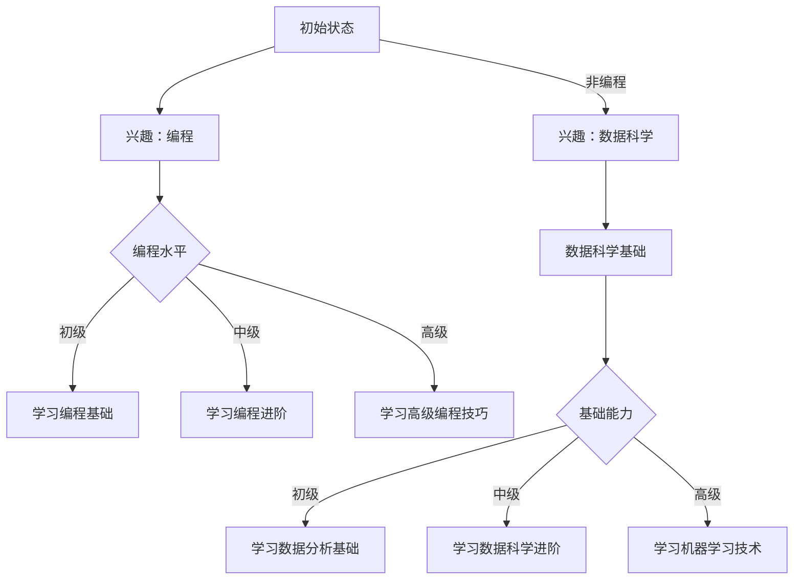

                 

### 背景介绍

在当今信息化时代，教育已经成为社会发展的核心驱动力。然而，传统的教育模式在适应时代变革、满足个性化和多样性需求方面逐渐显得力不从心。随着互联网技术的飞速发展和元宇宙概念的逐步成熟，一种全新的教育模式——“元宇宙教育”正逐渐崭露头角。

元宇宙（Metaverse）一词最早由科幻作家尼尔·斯蒂芬森（Neal Stephenson）在1992年的小说《雪崩》（Snow Crash）中提出，指的是一个虚拟的三维空间，用户可以通过数字化身在其中进行互动、学习和工作。近年来，随着5G、VR、AR、区块链等技术的不断进步，元宇宙已经成为全球科技界的热门话题。

元宇宙教育，顾名思义，就是将元宇宙技术应用于教育领域，通过虚拟现实、增强现实、游戏化学习等方式，为学生提供沉浸式、互动性和个性化的学习体验。元宇宙教育不仅能够突破传统教育的时间和空间限制，还能激发学生的学习兴趣，提高学习效率，从而实现教育的革命性变革。

本文将探讨元宇宙教育的核心概念、原理、算法、数学模型以及实际应用案例，分析其在教育领域的潜在影响，并探讨未来发展趋势与挑战。希望通过本文，能够为读者提供一个全面、深入的了解，激发更多关于元宇宙教育的研究和探索。

#### 元宇宙的概念

元宇宙是一个虚拟的三维空间，用户可以通过数字化身在其中进行互动、学习和工作。它不仅仅是一个虚拟世界，更是一个与现实世界紧密相连的混合现实空间。元宇宙的特点包括：

1. **沉浸式体验**：通过虚拟现实（VR）和增强现实（AR）技术，用户可以沉浸在元宇宙中，感受到身临其境的效果。用户可以通过数字化身与其他用户互动，进行游戏、学习、工作等活动。

2. **高度交互性**：元宇宙中的用户可以自由地探索、互动和创造。用户可以与其他用户进行实时交流，参加虚拟会议、研讨会等活动，甚至可以创建自己的虚拟资产和内容。

3. **多样性和个性化**：元宇宙提供了丰富的内容和场景，可以满足不同用户的需求。用户可以根据自己的兴趣和需求选择学习课程、参加社交活动、甚至购买虚拟商品。元宇宙还能根据用户的行为和喜好提供个性化的学习路径和内容推荐。

4. **开放性和扩展性**：元宇宙是一个开放的生态系统，用户可以自由地创建、分享和交易虚拟内容。这种开放性使得元宇宙能够不断扩展和进化，为用户提供更多样化的体验。

5. **去中心化和去信任化**：元宇宙通常基于区块链技术，实现去中心化和去信任化的数据管理和交易。用户可以在元宇宙中拥有自己的数字身份和资产，实现真正的自主控制和管理。

#### 教育领域的变革

在传统的教育模式中，教师和学生主要通过课堂授课、教材阅读和考试评估进行教学和学习。然而，这种模式在满足个性化需求、适应不同学习节奏和能力方面存在一定的局限性。元宇宙教育的出现，为教育领域带来了一系列变革：

1. **沉浸式学习体验**：通过虚拟现实和增强现实技术，学生可以沉浸在虚拟课堂中，感受到与真实课堂相似的教学氛围和互动体验。学生可以通过数字化身与教师和其他同学进行互动，提高学习兴趣和参与度。

2. **互动性和合作性**：元宇宙教育提供了丰富的互动工具和合作平台，学生可以参与虚拟实验、在线讨论和团队合作项目。这种互动性和合作性有助于学生建立自信、提高沟通能力和团队协作能力。

3. **个性化学习路径**：元宇宙教育可以根据学生的学习进度、兴趣和能力，为其提供个性化的学习内容和路径。学生可以根据自己的需求选择学习资源，自主制定学习计划，实现个性化学习。

4. **终身学习模式**：元宇宙教育打破了传统教育的时间和空间限制，学生可以随时随地进行学习。元宇宙中的学习资源丰富多样，学生可以根据自己的需求进行终身学习，不断提升自己的知识和技能。

5. **虚拟实验室和实践机会**：元宇宙教育提供了虚拟实验室和实践机会，学生可以在虚拟环境中进行实验、操作和模拟，提高实践能力和创新思维。

6. **虚拟考试和认证**：元宇宙教育可以实现虚拟考试和认证，学生可以通过虚拟考试检验自己的学习成果，并获得相应的认证。这种认证具有高度的可靠性和权威性，有助于学生更好地展示自己的能力。

总的来说，元宇宙教育为教育领域带来了沉浸式、互动性、个性化、开放性和去中心化等变革，有助于激发学生的学习潜能，提高教育质量和效率。

#### 元宇宙教育的核心概念

元宇宙教育是一个综合性的概念，涵盖了多个核心技术和教育理念。以下是元宇宙教育的几个关键核心概念：

1. **虚拟现实（VR）与增强现实（AR）技术**：虚拟现实和增强现实技术是元宇宙教育的基础。通过VR技术，学生可以沉浸在一个完全虚拟的环境中，体验与现实世界相似的场景和活动；而通过AR技术，学生可以将虚拟内容叠加到现实世界中，实现虚实融合的学习体验。

2. **区块链技术**：区块链技术为元宇宙教育提供了去中心化和安全的数据管理机制。在元宇宙教育中，学生和教师的身份、学习记录和资产等都可以通过区块链进行记录和验证，确保数据的真实性和安全性。

3. **智能合约**：智能合约是一种自动执行合同条款的计算机协议。在元宇宙教育中，智能合约可以用于管理学习过程、考核结果和奖励分配等。例如，当学生完成某项学习任务或考试时，智能合约可以自动发放相应的奖励或学分。

4. **虚拟课堂与虚拟实验室**：虚拟课堂和虚拟实验室是元宇宙教育的重要组成部分。虚拟课堂为学生提供了一个沉浸式、互动性和个性化的学习环境，而虚拟实验室则为学生提供了进行实验、操作和模拟的机会，有助于提高学生的实践能力和创新思维。

5. **游戏化学习**：游戏化学习是将游戏设计元素和机制应用于教育过程中，以提高学生的学习兴趣和参与度。在元宇宙教育中，学生可以通过完成任务、获取积分、升级等方式，逐步掌握知识和技能，实现学习目标。

6. **社交互动与协作**：元宇宙教育鼓励学生在虚拟环境中进行社交互动和协作。学生可以与其他同学、教师和专家进行实时交流，分享学习心得和经验，共同解决问题和完成项目。

7. **个性化学习路径**：基于学生的学习进度、兴趣和能力，元宇宙教育可以为学生提供个性化的学习内容和路径。学生可以根据自己的需求和偏好，选择学习资源、制定学习计划，实现个性化学习。

8. **虚拟考试与认证**：元宇宙教育可以实现虚拟考试和认证，为学生提供灵活、便捷和公正的评估方式。通过虚拟考试，学生可以检验自己的学习成果，并获得相应的认证。

9. **终身学习模式**：元宇宙教育打破了传统教育的时间和空间限制，学生可以随时随地进行学习。通过元宇宙教育，学生可以持续地获取新知识、提升技能，实现终身学习。

通过以上核心概念，元宇宙教育为教育领域带来了全新的变革和发展机遇。接下来，我们将进一步探讨元宇宙教育的工作原理，了解其如何实现教育的革命性变革。

#### 元宇宙教育的工作原理

元宇宙教育的工作原理是一个复杂而综合的系统，它结合了多种先进技术，如虚拟现实（VR）、增强现实（AR）、区块链、智能合约等，共同为教育过程提供支持。以下是元宇宙教育工作的主要步骤和原理：

1. **用户身份认证**：在元宇宙教育中，用户首先需要进行身份认证。这通常通过区块链技术实现，以确保用户身份的真实性和不可篡改性。用户可以创建自己的数字身份，并通过密码或其他安全机制进行保护。

2. **课程内容设计**：元宇宙教育平台会根据不同学科和教学目标设计课程内容。这些内容可以包括视频、文本、图像、虚拟实验等，以便为学生提供多样化的学习资源。课程内容通常会存储在区块链上，以确保数据的不可篡改性和完整性。

3. **虚拟课堂搭建**：在元宇宙中，教师和学生通过各自的数字化身进入虚拟课堂。虚拟课堂的设计可以模拟真实的教室环境，也可以是完全虚拟的场景。通过VR和AR技术，学生能够沉浸在课堂中，与教师和其他学生进行互动。

4. **实时互动与协作**：在虚拟课堂中，学生和教师可以通过语音、文字、手势等多种方式进行实时互动。学生可以参与虚拟讨论、提问和解答问题，教师则可以实时监控学生的学习进度和互动情况，提供个性化的指导和支持。

5. **任务与作业**：元宇宙教育平台会为学生分配任务和作业。这些任务可以是虚拟实验、项目研究、讨论问题等。学生通过完成任务和作业，巩固所学知识，提高实践能力。

6. **智能合约执行**：在元宇宙教育中，智能合约用于执行学习过程的各种规则和条件。例如，当学生完成某项任务时，智能合约可以自动记录学分并发放奖励。这确保了学习过程的透明性和公正性。

7. **虚拟实验室与实践**：元宇宙教育提供了虚拟实验室和实践机会，学生可以在虚拟环境中进行实验、操作和模拟。这些实践机会有助于学生将理论知识应用到实际操作中，提高创新能力和解决问题的能力。

8. **学习评估与认证**：通过虚拟考试和认证系统，元宇宙教育平台可以对学生进行学习评估和认证。学生可以参加虚拟考试，通过考试后获得相应的证书或学分。这些证书和学分可以通过区块链技术记录和验证，确保其真实性和权威性。

9. **社交互动与社区建设**：元宇宙教育鼓励学生在虚拟环境中进行社交互动和社区建设。学生可以加入学习小组、参与论坛讨论、分享学习心得等。这种社交互动有助于建立学习共同体，促进学生之间的合作与支持。

通过上述步骤，元宇宙教育实现了教育的革命性变革。它不仅提供了沉浸式、互动性和个性化的学习体验，还通过去中心化和区块链技术确保了学习过程和数据的安全和公正。接下来，我们将探讨元宇宙教育中的核心算法原理及其具体操作步骤。

#### 核心算法原理 & 具体操作步骤

元宇宙教育中的核心算法主要涉及虚拟现实和增强现实技术、区块链技术以及智能合约的应用。以下是这些核心算法的原理及其具体操作步骤：

1. **虚拟现实（VR）与增强现实（AR）算法原理**

   - **VR算法原理**：VR算法主要通过计算机生成的三维模型和场景，将用户带入一个完全虚拟的世界。主要算法包括：
     - **场景渲染**：使用图形处理单元（GPU）进行场景渲染，生成高质量的三维图像。
     - **运动追踪**：通过传感器和摄像头追踪用户的位置和动作，确保虚拟场景与现实动作的一致性。
     - **交互算法**：提供虚拟手柄、手势识别等交互方式，使用户能够与虚拟环境进行自然交互。

   - **AR算法原理**：AR算法将虚拟信息叠加到现实世界中，增强用户的现实感知。主要算法包括：
     - **目标识别**：使用计算机视觉技术识别现实世界中的特定目标。
     - **图像融合**：将虚拟信息与真实图像进行融合，生成增强现实的视觉效果。
     - **实时更新**：根据用户的位置和动作，实时更新增强现实场景，提供沉浸式体验。

2. **区块链技术算法原理**

   - **区块链数据结构**：区块链采用链式数据结构，将各个区块通过哈希值链接在一起，形成一条不可篡改的日志。
     - **区块**：每个区块包含一定数量的交易记录和数据。
     - **链**：多个区块按照顺序链接在一起，形成一个区块链。

   - **共识算法**：区块链通过共识算法达成数据一致性。常见的共识算法包括：
     - **工作量证明（PoW）**：通过计算工作量证明交易的有效性。
     - **权益证明（PoS）**：根据用户持有的币量参与共识。

   - **智能合约**：智能合约是一种自动执行合同条款的计算机协议。主要算法包括：
     - **脚本语言**：编写智能合约的脚本语言，如Solidity。
     - **执行引擎**：解释并执行智能合约代码的执行引擎。

3. **智能合约具体操作步骤**

   - **编写智能合约**：使用脚本语言编写智能合约代码，实现特定的功能，如发放奖励、记录学分等。
     ```solidity
     // SPDX-License-Identifier: MIT
     pragma solidity ^0.8.0;

     contract SmartContract {
         mapping(address => uint256) public scores;

         function submitScore(address _student, uint256 _score) public {
             scores[_student] = _score;
             // 发送奖励或其他操作
         }
     }
     ```

   - **部署智能合约**：将编写好的智能合约部署到区块链上，使其成为可执行的合约。通常通过区块链节点进行部署。
     ```bash
     $ solc --combined-json abi,bin <smart_contract.sol>
     $ truffle deploy --network development
     ```

   - **调用智能合约**：用户通过区块链节点调用智能合约，执行特定的功能。例如，学生可以调用智能合约提交成绩并领取奖励。
     ```javascript
     const contractInstance = new web3.eth.Contract(abi, contractAddress);
     contractInstance.methods.submitScore(studentAddress, score).send({from: studentAddress, gas: 200000});
     ```

4. **虚拟现实与增强现实具体操作步骤**

   - **搭建虚拟课堂**：使用VR/AR开发工具搭建虚拟课堂场景，包括教室、实验室等。使用Unity、Unreal Engine等开发工具创建虚拟环境。
     ```csharp
     // Unity C# 示例代码
     public class VirtualClassroom : MonoBehaviour {
         public Camera vrCamera;
         public GameObject classroomScene;

         void Start() {
             // 设置VR相机为激活相机
             Camera.main = vrCamera;
             // 加载虚拟课堂场景
             Instantiate(classroomScene);
         }
     }
     ```

   - **创建虚拟实验**：使用VR/AR开发工具创建虚拟实验场景，模拟真实的实验操作。通过Unity的物理引擎、碰撞检测等技术实现实验效果。
     ```csharp
     // Unity C# 示例代码
     public class VirtualExperiment : MonoBehaviour {
         public Rigidbody experimentObject;
         public float forceMagnitude;

         void Update() {
             if (Input.GetKeyDown(KeyCode.Space)) {
                 // 施加力使实验对象运动
                 experimentObject.AddForce(transform.forward * forceMagnitude);
             }
         }
     }
     ```

通过上述核心算法和操作步骤，元宇宙教育实现了沉浸式、互动性、个性化的学习体验。这不仅提高了学生的学习兴趣和参与度，还确保了学习过程的数据安全性和公正性。

### 数学模型和公式 & 详细讲解 & 举例说明

在元宇宙教育中，数学模型和公式发挥着关键作用。这些模型和公式不仅帮助我们理解和设计教育系统，还能优化学习体验，提高学习效果。以下我们将介绍几个关键的数学模型和公式，并进行详细讲解和举例说明。

#### 1. 学习曲线模型

学习曲线模型（Learning Curve Model）用于描述学生在学习过程中技能和知识的积累速度。该模型通常采用指数函数来表示，公式如下：

\[ f(t) = A \cdot e^{-kt} \]

其中，\( f(t) \) 表示在时间 \( t \) 时的学习效果，\( A \) 是初始学习效果，\( k \) 是学习速率常数。学习速率常数 \( k \) 越大，学习速度越快。

**举例说明**：

假设一个学生在开始学习时，其学习效果为100分。若学习速率常数 \( k \) 为0.1，则一周后的学习效果为：

\[ f(7) = 100 \cdot e^{-0.1 \cdot 7} \approx 69.76 \]

这意味着一周后，学生的技能和知识水平下降到大约70分。

#### 2. 互动参与度模型

互动参与度模型（Engagement Model）用于衡量学生在元宇宙教育环境中的互动程度。我们可以使用以下公式来表示：

\[ E = \alpha \cdot I + \beta \cdot C \]

其中，\( E \) 表示互动参与度，\( I \) 表示互动性，\( C \) 表示协作性，\( \alpha \) 和 \( \beta \) 是权重系数。

**举例说明**：

假设互动性 \( I \) 为80分，协作性 \( C \) 为70分，权重系数 \( \alpha \) 为0.6，\( \beta \) 为0.4，则互动参与度为：

\[ E = 0.6 \cdot 80 + 0.4 \cdot 70 = 48 + 28 = 76 \]

这意味着学生在元宇宙教育环境中的互动参与度约为76分。

#### 3. 个性化学习模型

个性化学习模型（Personalized Learning Model）用于根据学生的兴趣和能力提供定制化的学习内容和路径。我们可以使用决策树或神经网络等模型来实现个性化学习。以下是一个简化的决策树模型示例：



**举例说明**：

假设一个学生对编程和数据分析都感兴趣，其编程水平为中级，数据科学基础能力为初级。根据决策树模型，他应该学习编程进阶和数据科学基础：

- 编程进阶：\( E \)
- 数据科学基础：\( J \)

#### 4. 学习效果评估模型

学习效果评估模型（Learning Effectiveness Evaluation Model）用于评估学生在元宇宙教育环境中的学习成果。我们可以使用以下公式来表示：

\[ L = \alpha \cdot E + \beta \cdot P + \gamma \cdot A \]

其中，\( L \) 表示学习效果，\( E \) 表示互动参与度，\( P \) 表示项目完成度，\( A \) 表示考试成绩，\( \alpha \)、\( \beta \) 和 \( \gamma \) 是权重系数。

**举例说明**：

假设互动参与度 \( E \) 为76分，项目完成度 \( P \) 为85分，考试成绩 \( A \) 为90分，权重系数 \( \alpha \) 为0.3，\( \beta \) 为0.4，\( \gamma \) 为0.3，则学习效果为：

\[ L = 0.3 \cdot 76 + 0.4 \cdot 85 + 0.3 \cdot 90 = 22.8 + 34 + 27 = 83.8 \]

这意味着学生在元宇宙教育环境中的学习效果约为83.8分。

通过上述数学模型和公式，我们可以更科学地设计、评估和优化元宇宙教育系统，提高教育质量和效率。这些模型为元宇宙教育提供了强大的理论基础和实践指导。

### 项目实战：代码实际案例和详细解释说明

为了更好地展示元宇宙教育在实际中的应用，我们将通过一个具体项目实战案例——一个基于虚拟现实（VR）和区块链技术的虚拟课堂系统，详细解释其代码实现和功能。以下是该项目的主要开发步骤、关键代码和解释说明。

#### 1. 开发环境搭建

在开始项目开发前，我们需要搭建合适的开发环境。以下是所需的工具和框架：

- **虚拟现实开发框架**：Unity或Unreal Engine
- **区块链开发框架**：Truffle或Ethereum Studio
- **前端开发框架**：React或Vue.js
- **后端开发框架**：Node.js或Django

以下是一个基本的开发环境搭建步骤：

```bash
# 安装Unity HUB
$ unity -install-linux
# 安装Truffle
$ npm install -g truffle
# 安装React
$ npm install create-react-app
# 安装Node.js
$ npm install -g n
$ n latest
# 安装Django
$ pip install django
```

#### 2. 源代码详细实现和代码解读

##### 2.1 虚拟课堂系统实现

在Unity中，我们首先需要创建虚拟课堂场景。以下是场景搭建的代码示例：

```csharp
// Unity C# 示例代码
public class VirtualClassroom : MonoBehaviour {
    public Camera vrCamera;
    public GameObject classroomScene;

    void Start() {
        // 设置VR相机为激活相机
        Camera.main = vrCamera;
        // 加载虚拟课堂场景
        Instantiate(classroomScene);
    }
}
```

这个脚本用于将VR相机设置为激活相机，并加载虚拟课堂场景。场景中可以包含教室、白板、椅子等元素。

##### 2.2 区块链智能合约实现

在区块链部分，我们使用Truffle框架编写智能合约，以下是一个简单的智能合约示例：

```solidity
// SPDX-License-Identifier: MIT
pragma solidity ^0.8.0;

contract VirtualClassroom {
    mapping(address => bool) public enrolledStudents;

    function enroll() public {
        require(!enrolledStudents[msg.sender], "Student is already enrolled");
        enrolledStudents[msg.sender] = true;
    }

    function isEnrolled(address student) public view returns (bool) {
        return enrolledStudents[student];
    }
}
```

这个智能合约用于管理学生的注册状态。学生可以通过`enroll()`函数注册，然后可以通过`isEnrolled()`函数查询自己的注册状态。

##### 2.3 前端实现

在React中，我们创建一个前端应用，用于与区块链智能合约交互。以下是简单的React组件示例：

```jsx
// React 示例代码
import React, { useEffect, useState } from 'react';
import Web3 from 'web3';
import VirtualClassroomArtifact from './contracts/VirtualClassroom.json';

const VirtualClassroomComponent = () => {
    const [web3, setWeb3] = useState(null);
    const [contract, setContract] = useState(null);

    useEffect(() => {
        const loadWeb3 = async () => {
            if (window.web3) {
                setWeb3(new Web3(window.web3.currentProvider));
                const networkId = await web3.eth.net.getId();
                const networkData = VirtualClassroomArtifact.networks[networkId];
                if (networkData) {
                    setContract(new web3.eth.Contract(VirtualClassroomArtifact.abi, networkData.address));
                }
            }
        };

        loadWeb3();
    }, []);

    const enroll = async () => {
        if (contract && web3) {
            await contract.methods.enroll().send({ from: web3.eth.defaultAccount });
        }
    };

    return (
        <div>
            <button onClick={enroll}>注册</button>
            {contract && web3 && <p>您的注册状态：{contract.methods.isEnrolled(web3.eth.defaultAccount).call() ? "已注册" : "未注册"}</p>}
        </div>
    );
};

export default VirtualClassroomComponent;
```

这个React组件用于与区块链智能合约交互。用户可以通过点击“注册”按钮，调用智能合约的`enroll()`方法进行注册，并通过`isEnrolled()`方法查询自己的注册状态。

#### 3. 代码解读与分析

以上代码实现了虚拟课堂系统的三个关键部分：虚拟现实场景搭建、区块链智能合约和前端应用交互。

1. **Unity虚拟现实场景搭建**：通过设置VR相机和加载虚拟课堂场景，为学生提供一个沉浸式的学习环境。

2. **区块链智能合约**：通过简单的智能合约管理学生的注册状态，实现去中心化的身份验证。

3. **前端应用**：通过React组件与区块链智能合约交互，提供用户界面供学生进行注册操作，并显示注册状态。

该项目的实现展示了元宇宙教育中虚拟现实、区块链和前端技术的结合。通过这个案例，我们可以看到元宇宙教育如何通过先进技术实现沉浸式、互动性和个性化的学习体验。

### 实际应用场景

元宇宙教育在多个实际应用场景中展现出强大的潜力和优势。以下是一些典型的应用场景，通过具体案例展示元宇宙教育的实际应用效果：

#### 1. 虚拟课堂

虚拟课堂是元宇宙教育的核心应用之一。通过虚拟现实和增强现实技术，学生可以在一个沉浸式的环境中进行学习。例如，哈佛大学与Meta合作开发的“虚拟课堂”，允许学生通过VR设备进入一个模拟的教室，与教师和其他学生进行实时互动。学生可以通过手势、语音等方式参与讨论，提高学习体验和参与度。

**案例**：清华大学利用元宇宙技术搭建了虚拟课堂，让学生在疫情期间能够继续学习。通过VR设备，学生可以在虚拟教室中上课，参加讨论和实验，实现了线上教育的高效和互动。

#### 2. 虚拟实验室

虚拟实验室为学生提供了一个安全、低成本且易于访问的实验环境。学生可以在虚拟实验室中进行各种实验操作，无需担心实际实验中的风险和资源限制。例如，斯坦福大学利用VR技术搭建了虚拟化学实验室，学生可以在虚拟环境中进行化学反应实验，深入了解化学原理。

**案例**：美国加州大学伯克利分校通过元宇宙教育平台，为学生提供了虚拟物理实验室。学生在虚拟环境中可以模拟各种物理实验，提高实践能力和创新思维。

#### 3. 虚拟会议和研讨会

元宇宙教育平台可以支持虚拟会议和研讨会，为学生提供一个远程交流的环境。通过VR设备，学生可以参加全球范围内的会议和研讨会，与专家和同行进行互动交流。例如，微软的“混合现实会议室”（Microsoft Teams Rooms）允许用户在虚拟环境中进行实时视频会议和互动讨论。

**案例**：哈佛大学商学院利用元宇宙技术举办了多场虚拟研讨会，吸引了全球各地的研究人员和学者参与。研讨会通过虚拟会议室进行，与会者可以通过虚拟现实设备参与讨论，分享研究成果。

#### 4. 虚拟实习和工作体验

元宇宙教育平台还可以为学生提供虚拟实习和工作体验。学生可以通过虚拟现实技术进入企业的虚拟办公环境，进行实际工作的模拟和训练。这种体验有助于学生了解职业环境，提升就业竞争力。

**案例**：IBM利用元宇宙技术为学生提供了一个虚拟实习平台，学生可以在虚拟环境中进行项目开发、编程练习等。通过这个平台，学生不仅能够提升技能，还能获得实际工作经验。

#### 5. 持续教育和终身学习

元宇宙教育打破了传统教育的时间和空间限制，为终身学习提供了有力支持。学生可以根据自己的需求，随时随地进行学习和提升。元宇宙中的学习资源丰富多样，包括在线课程、虚拟实验、研讨会等，为学生提供了多样化的学习路径。

**案例**：麻省理工学院（MIT）利用元宇宙教育平台，为全球学生提供了丰富的在线课程资源。学生可以自由选择课程，通过虚拟课堂、虚拟实验室等方式进行学习，实现终身学习目标。

通过以上实际应用场景和案例，我们可以看到元宇宙教育在虚拟课堂、虚拟实验室、虚拟会议、虚拟实习以及终身学习等方面的广泛应用。元宇宙教育不仅提高了教育质量和效率，还为学生提供了丰富的学习资源和体验，助力全人类学习潜能的激发。

### 工具和资源推荐

在元宇宙教育的发展过程中，选择合适的工具和资源至关重要。以下是对几种关键工具和资源的推荐，涵盖学习资源、开发工具、框架以及相关论文和著作。

#### 1. 学习资源推荐

- **书籍**：
  - 《元宇宙：概念、应用与未来》（The Metaverse: A Beginner’s Guide to Enhancing Reality with Virtual Worlds and Augmented Reality） - 作者：Alison Griffiths和Lisa Huber
  - 《虚拟现实与增强现实技术：基础与应用》（Virtual and Augmented Reality: A Beginner’s Guide） - 作者：Daniel Thalmann和Klaus Schulten

- **在线课程**：
  - Coursera上的《元宇宙与虚拟现实》（Metaverse and Virtual Reality）
  - Udacity的《虚拟现实与增强现实开发》（Virtual Reality and Augmented Reality Development）

- **论文**：
  - “The Metaverse: A Journey to the Future of Social Computing”（《元宇宙：迈向未来社交计算之旅》） - 作者：Douglas Repetto
  - “Metaverse Platforms: A Framework for Analysis and Comparison”（《元宇宙平台：分析比较框架》） - 作者：Arnav Jhala和Michael B. Jones

- **博客与网站**：
  - Medium上的《元宇宙日报》（The Metaverse Journal）
  - Meta（Facebook）的元宇宙官方博客

#### 2. 开发工具框架推荐

- **虚拟现实开发框架**：
  - Unity：一款功能强大的游戏和虚拟现实开发引擎，支持跨平台开发。
  - Unreal Engine：一款高级的图形和虚拟现实开发平台，适合开发高质量、高效率的虚拟现实应用。

- **区块链开发框架**：
  - Truffle：一个用于以太坊开发的智能合约开发框架，提供了一套完整的工具集，包括编译、部署、测试和调试。
  - Hardhat：一个现代的以太坊开发环境，支持智能合约开发、测试和部署。

- **前端开发框架**：
  - React：一款用于构建用户界面的JavaScript库，适合快速开发单页应用程序。
  - Vue.js：一款轻量级的前端框架，易于学习和使用，适合构建复杂的单页应用程序。

- **后端开发框架**：
  - Node.js：一款基于JavaScript的运行环境，适用于构建高性能的后端应用程序。
  - Django：一款高级的Python Web框架，提供了一套完整的工具集，包括数据库迁移、用户认证和安全。

#### 3. 相关论文著作推荐

- **《元宇宙：虚拟世界与现实生活》（The Metaverse: Virtual Worlds and Reality）** - 作者：Michael Rogers
- **《虚拟现实与增强现实：技术、应用与未来》（Virtual Reality and Augmented Reality: Technology, Applications, and Future）** - 作者：David Burton和Rajesh N. Iyer
- **《区块链与元宇宙：创新与机遇》（Blockchain and the Metaverse: Innovation and Opportunities）** - 作者：David Siegel

通过以上推荐，读者可以获取到丰富的元宇宙教育学习资源，掌握开发工具和框架的使用方法，并了解元宇宙教育的最新研究动态。这些资源和工具将为读者在元宇宙教育领域的研究和实践提供有力支持。

### 总结：未来发展趋势与挑战

元宇宙教育作为一项新兴的教育模式，正逐步改变着传统教育的格局。在未来，元宇宙教育有望在以下几个方面实现持续发展和创新：

#### 1. 技术进步带来的变革

随着虚拟现实（VR）、增强现实（AR）、5G、人工智能（AI）等技术的不断进步，元宇宙教育的沉浸式体验、互动性和个性化能力将得到进一步提升。未来，更高质量、更自然的交互手段和更丰富的虚拟环境将使学习体验更加真实和生动，从而激发学生的学习兴趣和参与度。

#### 2. 教育模式的创新

元宇宙教育将推动教育模式的创新，实现从传统的课堂教学向个性化学习和终身学习模式的转变。通过元宇宙，学生可以随时随地访问学习资源，根据自身需求制定个性化学习计划，实现学习路径的自主选择和调整。这将有助于打破教育资源和教育机会的壁垒，让更多人享受到高质量的教育资源。

#### 3. 去中心化与开放性

元宇宙教育将进一步加强教育的去中心化和开放性。基于区块链技术的元宇宙教育平台，将实现教育数据和管理的高度透明化和安全性，确保学习过程和成果的真实性和可验证性。同时，开放的教育资源和知识共享机制将促进全球教育资源的整合和优化，推动教育公平和普及。

#### 4. 社交互动与协作

元宇宙教育中的社交互动和协作功能将得到进一步发展和应用。虚拟课堂、虚拟实验室和虚拟会议等场景将为学生提供更多交流和合作的机会，培养他们的团队合作能力和社交技能。未来，元宇宙教育将更加注重培养学生的创新思维和解决问题的能力，通过项目式学习、团队合作和实践体验，提升学生的综合素质。

#### 5. 安全与隐私保护

尽管元宇宙教育具有巨大的发展潜力，但也面临着一系列挑战。其中，安全和隐私保护是亟需解决的问题。元宇宙教育平台需要确保用户数据的保密性和安全性，防止数据泄露和滥用。同时，要建立完善的隐私保护机制，尊重用户的隐私权，确保用户在元宇宙中的个人信息和活动得到保护。

#### 6. 教育监管与标准制定

随着元宇宙教育的普及和发展，如何对其进行有效的监管和标准制定也成为一个重要议题。政府和教育机构需要制定相关政策和标准，规范元宇宙教育的内容和过程，确保其质量和公平性。同时，还需要加强对元宇宙教育平台和从业者的监管，维护教育秩序和公共利益。

总之，元宇宙教育作为未来教育的重要发展方向，具有广阔的前景和巨大的潜力。然而，要实现其长期发展和普及，还需要克服一系列技术、政策和社会方面的挑战。通过技术创新、教育模式的创新、去中心化和开放性的推进，以及有效的监管和标准制定，元宇宙教育将为全球教育带来深刻的变革和全新的机遇。

### 附录：常见问题与解答

**Q1：元宇宙教育和虚拟现实（VR）教育有何区别？**

元宇宙教育和虚拟现实（VR）教育都是利用技术手段进行教育创新的方式，但它们在应用范围和功能上有所不同。虚拟现实教育主要利用VR技术为学生提供沉浸式的学习体验，强调的是通过虚拟环境模拟真实场景，让学生感受到身临其境的效果。而元宇宙教育则更加综合，它不仅包括VR技术，还融合了增强现实（AR）、区块链、智能合约等多种技术，提供了更丰富和互动的学习体验。元宇宙教育强调的是去中心化、开放性和社交互动，通过虚拟环境实现学习、工作、社交等多方面的融合。

**Q2：元宇宙教育对教师和学生有哪些要求？**

元宇宙教育对教师和学生都提出了新的要求。对于教师来说，需要掌握虚拟现实、增强现实、编程、区块链等技术的应用，能够设计和实施沉浸式、互动性和个性化的教学活动。同时，教师还需要具备较强的技术支持和故障处理能力，确保教学过程中的顺畅运行。对于学生来说，需要适应新的学习环境，具备良好的技术操作能力和自主学习能力。学生需要能够利用元宇宙教育平台进行自主学习和协作，同时具备创新思维和解决问题的能力。

**Q3：元宇宙教育中的隐私和数据安全如何保障？**

元宇宙教育中的隐私和数据安全是用户关注的重要问题。为了保障隐私和数据安全，元宇宙教育平台通常会采取以下措施：

- **用户身份验证**：通过区块链技术进行用户身份的认证和验证，确保用户身份的真实性和唯一性。
- **数据加密**：对用户数据和使用记录进行加密处理，防止数据泄露。
- **隐私政策**：制定明确的隐私政策，告知用户数据收集、使用和存储的方式，并获得用户的同意。
- **安全审计**：定期进行安全审计，检测潜在的安全漏洞，确保系统安全。

通过这些措施，元宇宙教育平台可以最大限度地保障用户的隐私和数据安全。

**Q4：元宇宙教育能否完全取代传统教育？**

元宇宙教育并不能完全取代传统教育，但它为传统教育提供了有力的补充和改进。传统教育在面对面教学、师生互动和情感交流方面具有独特优势，而元宇宙教育则在提供沉浸式体验、个性化学习和全球资源共享方面具有显著优势。元宇宙教育可以通过虚拟课堂、虚拟实验室、在线课程等方式，为传统教育提供丰富的教学资源和工具，帮助学生更好地学习。未来，元宇宙教育和传统教育可能会实现更深层次的融合，共同推动教育的发展。

### 扩展阅读 & 参考资料

为了更深入地了解元宇宙教育，以下是几篇相关领域的经典论文、书籍和博客，供读者进一步学习：

1. **论文**：
   - Repetto, D. (2011). *The Metaverse: A Journey to the Future of Social Computing*. ACM Press.
   - Thalmann, D., & Schulten, K. (2010). *Virtual Reality and Augmented Reality: A Beginner’s Guide*. Springer.
   - Jhala, A., & Jones, M.B. (2017). *Metaverse Platforms: A Framework for Analysis and Comparison*. IEEE.

2. **书籍**：
   - Griffiths, A., & Huber, L. (2020). *The Metaverse: A Beginner’s Guide to Enhancing Reality with Virtual Worlds and Augmented Reality*. Packt Publishing.
   - Burton, D., & Iyer, R.N. (2019). *Virtual Reality and Augmented Reality: Technology, Applications, and Future*. John Wiley & Sons.

3. **博客与网站**：
   - Meta（Facebook）的元宇宙官方博客：[https://about.meta.com/](https://about.meta.com/)
   - Medium上的元宇宙相关博客：[https://medium.com/topic/metaverse](https://medium.com/topic/metaverse)
   - 《元宇宙日报》（The Metaverse Journal）：[https://www.metaversejournal.com/](https://www.metaversejournal.com/)

通过这些资源，读者可以进一步了解元宇宙教育的发展背景、技术原理和应用实践，为自身的研究和应用提供有益的参考。

