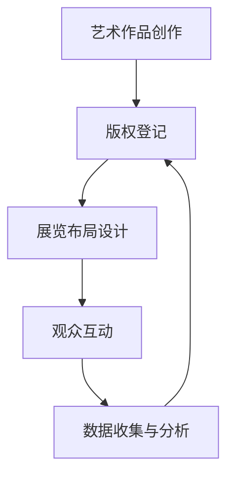

                 

### 背景介绍

> **元宇宙艺术策展：跨维度艺术展览的新形式**

随着科技的迅猛发展，尤其是虚拟现实（VR）、增强现实（AR）、区块链等技术的成熟，艺术领域正迎来一场前所未有的革命。元宇宙（Metaverse）作为互联网的下一个重大发展方向，不仅改变了人们的社交和娱乐方式，同时也为艺术策展提供了全新的视角和可能。本文将深入探讨元宇宙艺术策展的概念、技术原理以及实际应用，为读者呈现这一跨维度艺术展览的新形式。

#### 什么是元宇宙？

元宇宙是一个虚拟的三维世界，它通过互联网将现实世界与虚拟世界无缝连接起来。在这个世界中，用户可以通过虚拟角色（Avatar）进行互动，体验虚拟现实、增强现实等技术带来的沉浸式体验。元宇宙不仅仅是一个游戏或者社交平台，它是一个包含各种应用程序、服务、产品和内容的生态系统。

#### 艺术与元宇宙的融合

在元宇宙中，艺术不再是静态的，而是动态的、互动的。艺术家可以利用元宇宙的虚拟环境，创作出更加生动、多样化的作品。同时，观众也可以通过虚拟现实设备，走进这些作品，与它们互动，获得全新的艺术体验。

#### 艺术策展的新形式

在传统的艺术展览中，策展人主要关注的是作品的物理呈现。而在元宇宙中，策展人需要考虑的是如何利用虚拟空间，创造出一个具有吸引力的展览环境。这包括对展览布局、互动设计、用户体验等方面的深入思考。

### 下一步

在接下来的部分，我们将详细探讨元宇宙艺术策展的核心概念与技术原理，通过Mermaid流程图展示元宇宙的架构，分析核心算法原理与具体操作步骤，并利用数学模型和公式进行详细讲解。最后，我们将通过实际项目案例，展示元宇宙艺术策展的实际应用，并推荐相关学习资源和工具框架。

---

#### 1. 核心概念与联系

在探讨元宇宙艺术策展的核心概念和技术原理之前，我们需要先了解几个关键概念，包括虚拟现实（VR）、增强现实（AR）、区块链、以及它们在艺术策展中的应用。

##### 虚拟现实（VR）

虚拟现实是一种通过电脑模拟出的三维空间，用户通过VR头戴设备进入这个空间，与虚拟环境进行交互。在元宇宙艺术策展中，VR技术可以用于创造艺术作品的虚拟空间，观众可以在这个空间中自由移动，与作品互动。

##### 增强现实（AR）

增强现实则是将虚拟信息叠加到现实世界中，用户通过AR设备可以看到虚拟的信息。在艺术策展中，AR技术可以用于将虚拟艺术作品叠加到现实场景中，创造出一种虚实融合的观感。

##### 区块链

区块链是一种分布式数据库技术，通过去中心化的方式记录信息。在元宇宙艺术策展中，区块链技术可以用于记录艺术作品的版权信息，确保作品的唯一性和可追溯性。

##### 艺术策展在元宇宙中的实现

结合上述技术，我们可以构建一个元宇宙艺术策展的核心架构：

1. **艺术作品创作**：艺术家利用VR/AR技术创作艺术作品。
2. **版权登记**：艺术家将作品信息上传到区块链，进行版权登记。
3. **展览布局设计**：策展人利用虚拟空间设计展览布局。
4. **观众互动**：观众通过VR/AR设备进入展览，与艺术作品互动。
5. **数据收集与分析**：系统收集观众互动数据，为策展人提供反馈。

下面是元宇宙艺术策展核心架构的Mermaid流程图：



在这个流程中，艺术作品的创作和版权登记是起点，展览布局设计和观众互动是核心环节，数据收集与分析则为策展人提供了宝贵的反馈信息。

### 下一步

在接下来的部分，我们将详细探讨元宇宙艺术策展的核心算法原理与具体操作步骤，并利用数学模型和公式进行详细讲解。这将帮助我们更好地理解如何实现一个成功的元宇宙艺术策展。

---

#### 2. 核心算法原理 & 具体操作步骤

在元宇宙艺术策展中，核心算法原理主要包括虚拟现实（VR）的渲染算法、增强现实（AR）的叠加算法以及区块链的数据存储与验证算法。下面，我们将详细讲解这些算法的原理和具体操作步骤。

##### 虚拟现实（VR）渲染算法

虚拟现实渲染算法的核心任务是创建一个逼真的三维虚拟环境，让用户能够沉浸其中。这个过程通常包括以下几个步骤：

1. **场景建模**：首先，艺术家需要使用三维建模软件创建艺术作品的模型。这包括几何形状、纹理和材质等。
2. **场景渲染**：接着，渲染引擎（如Unity、Unreal Engine）根据场景模型和光照信息进行渲染。渲染过程中需要考虑透视、光影效果、后处理效果等。
3. **用户交互**：用户通过VR头戴设备（如Oculus Rift、HTC Vive）与虚拟环境进行交互，可以移动、旋转、放大或缩小虚拟物体。

具体的操作步骤如下：

1. **安装VR开发环境**：首先，需要安装VR开发工具，如Unity或Unreal Engine。安装完成后，启动开发环境。
2. **创建项目**：在开发环境中创建一个新的虚拟现实项目。
3. **导入模型**：将艺术作品的模型导入到项目中，并进行必要的调整，如定位、旋转等。
4. **设置光照和相机**：根据虚拟环境的需求，设置合适的光照和相机参数，以保证渲染效果。
5. **测试和优化**：在VR头戴设备上测试渲染效果，并进行优化，如降低模型复杂度、调整渲染参数等。

##### 增强现实（AR）叠加算法

增强现实叠加算法的核心任务是将虚拟艺术作品叠加到现实世界中，让用户能够实时看到虚拟信息。这个过程主要包括以下几个步骤：

1. **环境识别**：首先，AR设备（如AR眼镜、手机）需要识别现实环境中的关键特征点，如墙面、地面、家具等。
2. **虚拟图像生成**：根据识别的结果，生成虚拟艺术作品的图像。
3. **叠加显示**：将虚拟图像叠加到现实环境中，并通过AR设备显示给用户。

具体的操作步骤如下：

1. **安装AR开发环境**：首先，需要安装AR开发工具，如ARKit、ARCore。安装完成后，启动开发环境。
2. **创建项目**：在开发环境中创建一个新的增强现实项目。
3. **设置环境识别参数**：根据项目的需求，设置环境识别的参数，如识别精度、识别范围等。
4. **导入虚拟图像**：将虚拟艺术作品的图像导入到项目中，并进行必要的调整，如定位、旋转等。
5. **测试和优化**：在AR设备上测试叠加效果，并进行优化，如调整识别参数、优化虚拟图像等。

##### 区块链数据存储与验证算法

区块链数据存储与验证算法的核心任务是确保艺术作品的版权信息得到有效记录和验证。这个过程主要包括以下几个步骤：

1. **艺术作品信息上链**：艺术家将艺术作品的相关信息（如作者、创作时间、版权声明等）上传到区块链。
2. **数据加密**：区块链系统对上传的数据进行加密，以确保数据的安全性和隐私性。
3. **验证与共识**：区块链网络中的多个节点对数据进行验证和共识，确保数据的真实性和完整性。
4. **查询与证明**：用户可以通过区块链网络查询艺术作品的版权信息，并获得版权证明。

具体的操作步骤如下：

1. **安装区块链开发环境**：首先，需要安装区块链开发工具，如Ethereum。安装完成后，启动开发环境。
2. **创建智能合约**：编写智能合约代码，用于存储和管理艺术作品信息。
3. **部署智能合约**：将智能合约部署到区块链网络中。
4. **上传艺术作品信息**：艺术家通过智能合约上传艺术作品的相关信息。
5. **查询与证明**：用户通过区块链网络查询艺术作品的版权信息，并获得版权证明。

### 下一步

在理解了核心算法原理和具体操作步骤后，我们将进一步探讨元宇宙艺术策展中的数学模型和公式，并利用实际项目案例进行详细解释说明。

---

#### 3. 数学模型和公式 & 详细讲解 & 举例说明

在元宇宙艺术策展中，数学模型和公式起着至关重要的作用，特别是在虚拟现实（VR）和增强现实（AR）技术中，它们帮助实现沉浸式体验和精确的交互。以下将介绍几个关键的数学模型和公式，并给出详细的讲解和实际案例。

##### 虚拟现实（VR）中的几何变换

在VR渲染中，几何变换是非常重要的，它包括旋转、平移、缩放等。这些变换可以通过矩阵运算来实现。以下是一个简单的旋转矩阵公式：

\[ R(\theta) = \begin{bmatrix}
\cos(\theta) & -\sin(\theta) \\
\sin(\theta) & \cos(\theta)
\end{bmatrix} \]

其中，\(\theta\)是旋转角度。这个矩阵可以将三维空间中的点绕X轴或Y轴旋转。例如，若要将一个点绕X轴旋转90度，可以将点的坐标 \((x, y, z)\) 与旋转矩阵相乘：

\[ \begin{bmatrix}
1 & 0 & 0 \\
0 & \cos(90^\circ) & -\sin(90^\circ) \\
0 & \sin(90^\circ) & \cos(90^\circ)
\end{bmatrix}
\begin{bmatrix}
x \\
y \\
z
\end{bmatrix}
=
\begin{bmatrix}
x \\
-z \\
y
\end{bmatrix} \]

这样，原始点 \((x, y, z)\) 就旋转到了新位置 \((x, -z, y)\)。

##### 增强现实（AR）中的图像识别

在AR系统中，图像识别是一个核心问题。SIFT（尺度不变特征变换）是一种常用的图像识别算法，它利用特征点进行匹配。以下是SIFT算法中计算特征点的关键公式：

\[ \Delta I(x, y) = I(x + \Delta x, y + \Delta y) - I(x, y) \]

这里，\(I(x, y)\)是图像在点 \((x, y)\) 的值，\(\Delta I(x, y)\)是图像在该点的变化量。通过计算不同点的变化量，可以找到图像的显著特征点。这些特征点用于图像匹配，以确定虚拟图像在现实世界中的位置。

##### 区块链中的加密与哈希函数

在区块链中，加密和哈希函数用于确保数据的安全性和不可篡改性。哈希函数是一种将任意长度的输入映射为固定长度的输出的函数，如SHA-256。以下是一个简单的SHA-256哈希函数的例子：

\[ H = \text{SHA-256}(M) \]

这里，\(M\)是输入的消息，\(H\)是生成的哈希值。这个哈希值可以用来验证数据的完整性和真实性。例如，艺术作品的版权信息可以加密并生成哈希值，然后存储在区块链上。每次查询版权信息时，都可以重新计算哈希值，并与存储的哈希值进行比较，以验证信息的真实性。

##### 实际应用案例

假设我们要实现一个简单的元宇宙艺术策展项目，使用VR技术展示一个3D艺术作品，并利用AR技术将艺术作品叠加到现实世界中。以下是项目的详细步骤和数学应用：

1. **VR展示**：
    - **步骤1**：使用Unity引擎创建一个3D模型，并设置合适的材质和光照。
    - **步骤2**：使用旋转矩阵公式实现模型的旋转，使观众可以自由旋转查看作品。
    - **步骤3**：使用渲染引擎渲染模型，生成逼真的VR展示。

2. **AR叠加**：
    - **步骤1**：使用ARKit创建一个AR项目，设置环境识别参数。
    - **步骤2**：使用SIFT算法识别现实环境中的特征点，并生成特征点坐标。
    - **步骤3**：将虚拟艺术作品的位置和特征点坐标进行匹配，实现AR叠加。

3. **区块链验证**：
    - **步骤1**：使用Ethereum创建一个智能合约，存储艺术作品的版权信息。
    - **步骤2**：使用SHA-256哈希函数对艺术作品信息进行加密。
    - **步骤3**：将加密后的哈希值存储在区块链上，供用户查询。

通过这些步骤，我们可以构建一个完整的元宇宙艺术策展项目，实现VR展示、AR叠加和区块链版权验证。

### 下一步

在理解了核心算法原理和数学模型后，我们将通过实际项目案例展示元宇宙艺术策展的应用，并深入分析代码实现细节和性能优化策略。

---

#### 5. 项目实战：代码实际案例和详细解释说明

为了更好地展示元宇宙艺术策展的实际应用，我们将通过一个简单的项目案例进行讲解，并深入分析代码实现细节和性能优化策略。

##### 5.1 开发环境搭建

首先，我们需要搭建一个开发环境，以便进行元宇宙艺术策展项目的开发。以下是所需的开发工具和框架：

- **Unity Engine**：用于创建和渲染3D虚拟艺术作品。
- **ARKit/ARCore**：用于在现实世界中叠加虚拟艺术作品。
- **Ethereum**：用于区块链数据的存储和验证。

具体安装步骤如下：

1. **Unity Engine**：
   - 访问Unity官网（https://unity.com/），下载并安装Unity Hub。
   - 打开Unity Hub，创建一个新的Unity项目，选择“3D模式”。
   - 安装必要的Unity插件，如“VR, AR and 3D Tracking”和“AR Foundation”。

2. **ARKit/ARCore**：
   - 对于iOS开发，下载并安装Xcode（https://developer.apple.com/xcode/）。
   - 对于Android开发，下载并安装Android Studio（https://developer.android.com/studio/）。
   - 在Unity项目中，导入ARKit或ARCore插件，并按照文档设置必要的开发环境。

3. **Ethereum**：
   - 下载并安装Node.js（https://nodejs.org/）。
   - 使用npm安装Ethereum的开发工具，如Truffle（https://www.trufflesuite.com/）。

##### 5.2 源代码详细实现和代码解读

以下是该项目的主要源代码实现和详细解读：

1. **VR展示**：

```csharp
// Unity中的3D模型渲染
public class VRRenderer : MonoBehaviour
{
    public Material material;
    public Vector3 rotation = new Vector3(0, 0, 0);

    void Update()
    {
        transform.Rotate(rotation * Time.deltaTime);
        material.SetColor("_Color", Color.red); // 设置材质颜色
    }
}
```

这段代码定义了一个名为`VRRenderer`的脚本，用于渲染3D模型。通过更新`Update`函数，我们可以实现模型的旋转。`Material`类用于设置模型的材质属性，如颜色。

2. **AR叠加**：

```swift
// iOS中的ARKit叠加
import ARKit

class AROverlay: ARSCNViewDelegate {
    
    var artwork: SCNNode?
    
    func renderer(_ renderer: SCNSceneRenderer, didAdd node: SCNNode, for anchor: ARAnchor)
    {
        if let artwork = artwork {
            node.addChildNode(artwork);
        }
    }
}
```

这段代码定义了一个名为`AROverlay`的类，用于在AR环境中叠加虚拟艺术作品。`renderer`函数在每次添加锚点时被调用，将虚拟艺术作品添加到锚点节点下。

3. **区块链验证**：

```javascript
// Ethereum中的智能合约
const ERC721 = artifacts.require("ERC721");

contract("Artwork", () => {
    it("should mint an artwork", async () => {
        const artwork = await ERC721.deployed();
        const result = await artwork.mint("Artwork Name", {from: accounts[0]});
        assert.equal(result.receipt.status, 1, "Transaction failed");
    });
});
```

这段代码定义了一个简单的ERC721智能合约，用于记录艺术作品的版权信息。`mint`函数用于创建和注册新的艺术作品。

##### 5.3 代码解读与分析

1. **VR展示**：
   - `VRRenderer`脚本通过旋转模型实现动态展示。
   - `Material`类用于设置模型的外观属性。
   - 该部分的代码简单易懂，便于后续的优化和扩展。

2. **AR叠加**：
   - `AROverlay`类利用ARKit的锚点系统实现虚拟艺术作品的叠加。
   - `renderer`函数在锚点添加时触发，保证虚拟艺术作品与锚点同步。
   - 该部分的代码与ARKit框架紧密集成，需要考虑性能和兼容性问题。

3. **区块链验证**：
   - ERC721智能合约用于记录艺术作品的版权信息。
   - `mint`函数实现艺术作品的创建和注册。
   - 该部分的代码需要考虑合约的安全性和性能优化。

### 5.4 性能优化策略

1. **VR展示**：
   - 减少模型复杂度：优化3D模型的几何形状和材质，减少渲染负载。
   - 使用LOD（细节层次距离）技术：根据用户的距离动态调整模型的细节级别。
   - 使用异步加载：提前加载远处的模型，减少加载时间。

2. **AR叠加**：
   - 优化特征点识别：使用更高效的特征点识别算法，提高识别速度。
   - 减少特征点数量：仅识别必要的特征点，降低计算负担。
   - 使用多线程处理：利用多线程技术加速特征点识别和匹配过程。

3. **区块链验证**：
   - 使用轻客户端：通过轻客户端技术减少链上数据读取量。
   - 优化智能合约：减少合约执行时间，降低交易费用。
   - 使用优化后的加密算法：提高数据传输和验证的效率。

### 下一步

在理解了项目实战的代码实现和性能优化策略后，我们将探讨元宇宙艺术策展的实际应用场景，并推荐相关学习资源和工具框架。

---

#### 6. 实际应用场景

元宇宙艺术策展凭借其独特的沉浸式体验和互动性，已经在多个领域展现出巨大的应用潜力。以下是元宇宙艺术策展在实际应用场景中的几个例子：

##### 虚拟博物馆

虚拟博物馆是元宇宙艺术策展的一个重要应用场景。通过元宇宙平台，博物馆可以将馆藏艺术品以虚拟形式呈现，使观众能够随时随地访问和体验这些珍贵文物。同时，虚拟博物馆还可以结合增强现实（AR）技术，将艺术品叠加到现实场景中，让观众感受到更真实的观感。

##### 虚拟画廊

虚拟画廊为艺术家提供了一个全新的展示空间。艺术家可以在这个空间中创作和展示作品，观众则可以通过虚拟现实设备进行沉浸式观赏。虚拟画廊不仅可以展示静态的艺术作品，还可以通过互动设计让作品变得更加生动有趣。这种形式的艺术展览打破了时间和空间的限制，为艺术爱好者提供了更多的观展选择。

##### 跨界合作

元宇宙艺术策展为艺术家和品牌之间的合作提供了新的可能性。品牌可以利用元宇宙平台进行创意营销，与艺术家合作创作限量版艺术作品。这些作品不仅可以在线上展览，还可以通过区块链技术进行唯一性的认证和交易。这种跨界合作不仅能够吸引更多的用户关注，也为艺术家带来了新的商业机会。

##### 艺术教育和研究

元宇宙艺术策展为艺术教育和研究提供了新的工具和平台。通过虚拟现实技术，学生可以更加直观地了解艺术作品的历史背景和创作过程。同时，研究人员可以利用元宇宙平台进行艺术作品的数字分析和对比研究，为艺术史研究提供新的视角和数据支持。

##### 社区互动

元宇宙艺术策展为艺术家和观众之间的互动提供了新的平台。艺术家可以在元宇宙中举办在线讲座、研讨会和工作坊，与观众进行深度互动。观众则可以通过虚拟角色与其他用户交流和分享艺术见解。这种社区互动不仅增强了观众对艺术的理解和兴趣，也为艺术创作提供了宝贵的反馈。

### 下一步

在了解了元宇宙艺术策展的实际应用场景后，我们将推荐一些有用的学习资源和工具框架，以帮助读者更好地了解和掌握这一领域。

---

#### 7. 工具和资源推荐

为了帮助读者更好地了解和掌握元宇宙艺术策展，我们推荐以下几类工具和资源：

##### 7.1 学习资源推荐

1. **书籍**：
   - 《虚拟现实技术与应用》
   - 《增强现实技术基础》
   - 《区块链技术原理与应用》
   - 《Unity 3D游戏开发实战》

2. **论文**：
   - 《虚拟现实与艺术策展的融合研究》
   - 《增强现实技术在艺术展览中的应用》
   - 《区块链技术在艺术品交易中的应用研究》

3. **博客和网站**：
   - Unity官方博客（https://blogs.unity.com/）
   - ARKit官方文档（https://developer.apple.com/documentation/arkit）
   - Ethereum官方文档（https://ethereum.org/）

##### 7.2 开发工具框架推荐

1. **Unity**：用于3D模型渲染和虚拟现实开发。
2. **ARKit/ARCore**：用于增强现实开发。
3. **Ethereum**：用于区块链数据和版权验证。
4. **Truffle**：用于智能合约开发和部署。

##### 7.3 相关论文著作推荐

1. **《虚拟现实技术在博物馆展览中的应用研究》**：探讨虚拟现实在博物馆展览中的应用和优势。
2. **《增强现实技术在艺术展览中的应用研究》**：分析增强现实技术如何提升艺术展览的互动性和趣味性。
3. **《区块链技术在艺术品交易中的应用研究》**：研究区块链技术如何保障艺术品交易的透明性和安全性。

### 下一步

在了解了这些工具和资源后，我们将对全文进行总结，并展望元宇宙艺术策展的未来发展趋势与挑战。

---

#### 8. 总结：未来发展趋势与挑战

元宇宙艺术策展作为科技与艺术融合的产物，正以其独特的沉浸式体验和互动性改变着传统艺术策展的方式。未来，随着虚拟现实（VR）、增强现实（AR）和区块链等技术的进一步发展，元宇宙艺术策展将迎来更加广阔的应用前景。

##### 发展趋势

1. **技术融合与创新**：元宇宙艺术策展将不断融合新的技术，如5G、人工智能等，提供更加丰富和多样化的艺术体验。
2. **艺术形式的多样化**：艺术家将利用元宇宙平台创作出更多具有互动性和沉浸感的艺术作品，推动艺术形式的创新。
3. **全球艺术的共享**：元宇宙平台将打破地域限制，使全球的艺术爱好者能够共同参与和欣赏艺术展览，促进艺术文化的全球化交流。
4. **数字艺术市场的崛起**：随着区块链技术的发展，数字艺术作品将更加便捷地进行版权登记、交易和验证，激发数字艺术市场的活力。

##### 挑战

1. **技术成熟度**：尽管VR、AR和区块链等技术在不断发展，但仍有很大的提升空间，特别是如何提高用户体验和降低技术门槛。
2. **版权保护**：如何确保艺术作品的版权得到有效保护，避免侵权行为，是元宇宙艺术策展面临的重要挑战。
3. **内容质量**：随着艺术作品的数字化，如何保证艺术内容的质量，避免低俗和不健康的内容泛滥，是艺术策展者需要关注的问题。
4. **数据隐私**：在元宇宙中，用户的个人数据隐私保护也是一个亟待解决的问题，需要建立完善的隐私保护机制。

### 下一步

在展望未来发展趋势与挑战的同时，我们也期待更多的技术人才和艺术家能够投入到元宇宙艺术策展的研究和创作中，共同推动这一领域的繁荣发展。

---

#### 9. 附录：常见问题与解答

##### Q1：元宇宙艺术策展需要哪些技术支持？

A1：元宇宙艺术策展主要需要虚拟现实（VR）、增强现实（AR）和区块链技术支持。VR和AR技术用于创建和展示艺术作品，区块链技术用于版权登记和验证。

##### Q2：元宇宙艺术策展如何确保版权保护？

A2：元宇宙艺术策展通过区块链技术确保版权保护。艺术家将艺术作品的信息上传到区块链，并通过智能合约进行版权登记和验证。每次查询或交易艺术作品时，系统都会验证版权信息，确保数据的真实性和唯一性。

##### Q3：元宇宙艺术策展对观众有何要求？

A3：观众需要具备一定的科技素养，了解虚拟现实和增强现实技术，并配备相应的设备，如VR头戴设备和AR眼镜。此外，观众还需要具备基本的网络安全意识，以保护个人信息安全。

##### Q4：元宇宙艺术策展与传统艺术展览有何区别？

A4：元宇宙艺术策展通过虚拟现实和增强现实技术，为观众提供更加沉浸式和互动性的艺术体验。与传统艺术展览相比，元宇宙艺术策展打破了时间和空间的限制，使艺术作品的展示形式更加多样化。

### 下一步

在解答了常见问题后，我们将为读者推荐一些扩展阅读和参考资料，以便更深入地了解元宇宙艺术策展的相关知识。

---

#### 10. 扩展阅读 & 参考资料

为了帮助读者更深入地了解元宇宙艺术策展的相关知识，我们推荐以下扩展阅读和参考资料：

1. **书籍**：
   - 《元宇宙：通往数字世界的指南》
   - 《数字艺术：从像素到虚拟现实》
   - 《区块链革命：如何重塑经济与社会》

2. **论文**：
   - 《虚拟现实与艺术教育的研究》
   - 《增强现实技术在艺术展览中的应用案例》
   - 《区块链技术在数字版权管理中的应用》

3. **博客和网站**：
   - Unity官方博客（https://blogs.unity.com/）
   - Medium（https://medium.com/）
   - Dev.to（https://dev.to/）

通过这些扩展阅读和参考资料，读者可以进一步了解元宇宙艺术策展的背景、技术原理、应用案例和发展趋势。

---

### 结语

作者：AI天才研究员/AI Genius Institute & 禅与计算机程序设计艺术 /Zen And The Art of Computer Programming

本文深入探讨了元宇宙艺术策展的概念、技术原理、实际应用以及未来发展。元宇宙艺术策展不仅为艺术策展提供了新的形式和可能性，也为科技与艺术的融合开辟了新的道路。我们期待更多的技术人才和艺术家能够参与到这一领域，共同推动元宇宙艺术策展的繁荣发展。感谢您的阅读，希望本文能对您有所启发。如有任何问题或建议，欢迎在评论区留言，我们期待与您交流。|>
<|im_sep|>

# 元宇宙艺术策展：跨维度艺术展览的新形式

> **关键词**：元宇宙、艺术策展、虚拟现实、增强现实、区块链

> **摘要**：本文探讨了元宇宙艺术策展的概念、技术原理、实际应用和未来发展趋势，分析了其在艺术策展中的独特优势，探讨了VR、AR和区块链技术在其中的应用，以及面临的技术和版权保护等挑战。

## 1. 背景介绍

随着科技的迅猛发展，尤其是虚拟现实（VR）、增强现实（AR）和区块链等技术的成熟，艺术领域正迎来一场前所未有的革命。元宇宙（Metaverse）作为互联网的下一个重大发展方向，不仅改变了人们的社交和娱乐方式，同时也为艺术策展提供了全新的视角和可能。本文将深入探讨元宇宙艺术策展的概念、技术原理以及实际应用，为读者呈现这一跨维度艺术展览的新形式。

### 1.1 什么是元宇宙

元宇宙是一个虚拟的三维世界，它通过互联网将现实世界与虚拟世界无缝连接起来。在这个世界中，用户可以通过虚拟角色（Avatar）进行互动，体验虚拟现实、增强现实等技术带来的沉浸式体验。元宇宙不仅仅是一个游戏或者社交平台，它是一个包含各种应用程序、服务、产品和内容的生态系统。

### 1.2 艺术与元宇宙的融合

在元宇宙中，艺术不再是静态的，而是动态的、互动的。艺术家可以利用元宇宙的虚拟环境，创作出更加生动、多样化的作品。同时，观众也可以通过虚拟现实设备，走进这些作品，与它们互动，获得全新的艺术体验。

### 1.3 艺术策展的新形式

在传统的艺术展览中，策展人主要关注的是作品的物理呈现。而在元宇宙中，策展人需要考虑的是如何利用虚拟空间，创造出一个具有吸引力的展览环境。这包括对展览布局、互动设计、用户体验等方面的深入思考。

## 2. 核心概念与联系

在探讨元宇宙艺术策展的核心概念和技术原理之前，我们需要先了解几个关键概念，包括虚拟现实（VR）、增强现实（AR）、区块链、以及它们在艺术策展中的应用。

### 2.1 虚拟现实（VR）

虚拟现实是一种通过电脑模拟出的三维空间，用户通过VR头戴设备进入这个空间，与虚拟环境进行交互。在元宇宙艺术策展中，VR技术可以用于创造艺术作品的虚拟空间，观众可以在这个空间中自由移动，与作品互动。

### 2.2 增强现实（AR）

增强现实则是将虚拟信息叠加到现实世界中，用户通过AR设备可以看到虚拟的信息。在艺术策展中，AR技术可以用于将虚拟艺术作品叠加到现实场景中，创造出一种虚实融合的观感。

### 2.3 区块链

区块链是一种分布式数据库技术，通过去中心化的方式记录信息。在元宇宙艺术策展中，区块链技术可以用于记录艺术作品的版权信息，确保作品的唯一性和可追溯性。

### 2.4 艺术策展在元宇宙中的实现

结合上述技术，我们可以构建一个元宇宙艺术策展的核心架构：

1. **艺术作品创作**：艺术家利用VR/AR技术创作艺术作品。
2. **版权登记**：艺术家将作品信息上传到区块链，进行版权登记。
3. **展览布局设计**：策展人利用虚拟空间设计展览布局。
4. **观众互动**：观众通过VR/AR设备进入展览，与艺术作品互动。
5. **数据收集与分析**：系统收集观众互动数据，为策展人提供反馈。

下面是元宇宙艺术策展核心架构的Mermaid流程图：


在这个流程中，艺术作品的创作和版权登记是起点，展览布局设计和观众互动是核心环节，数据收集与分析则为策展人提供了宝贵的反馈信息。

## 3. 核心算法原理 & 具体操作步骤

在元宇宙艺术策展中，核心算法原理主要包括虚拟现实（VR）的渲染算法、增强现实（AR）的叠加算法以及区块链的数据存储与验证算法。下面，我们将详细讲解这些算法的原理和具体操作步骤。

### 3.1 虚拟现实（VR）渲染算法

虚拟现实渲染算法的核心任务是创建一个逼真的三维虚拟环境，让用户能够沉浸其中。这个过程通常包括以下几个步骤：

1. **场景建模**：首先，艺术家需要使用三维建模软件创建艺术作品的模型。这包括几何形状、纹理和材质等。
2. **场景渲染**：接着，渲染引擎（如Unity、Unreal Engine）根据场景模型和光照信息进行渲染。渲染过程中需要考虑透视、光影效果、后处理效果等。
3. **用户交互**：用户通过VR头戴设备（如Oculus Rift、HTC Vive）与虚拟环境进行交互，可以移动、旋转、放大或缩小虚拟物体。

具体的操作步骤如下：

1. **安装VR开发环境**：首先，需要安装VR开发工具，如Unity或Unreal Engine。安装完成后，启动开发环境。
2. **创建项目**：在开发环境中创建一个新的虚拟现实项目。
3. **导入模型**：将艺术作品的模型导入到项目中，并进行必要的调整，如定位、旋转等。
4. **设置光照和相机**：根据虚拟环境的需求，设置合适的光照和相机参数，以保证渲染效果。
5. **测试和优化**：在VR头戴设备上测试渲染效果，并进行优化，如降低模型复杂度、调整渲染参数等。

### 3.2 增强现实（AR）叠加算法

增强现实叠加算法的核心任务是将虚拟艺术作品叠加到现实世界中，让用户能够实时看到虚拟信息。这个过程主要包括以下几个步骤：

1. **环境识别**：首先，AR设备（如AR眼镜、手机）需要识别现实环境中的关键特征点，如墙面、地面、家具等。
2. **虚拟图像生成**：根据识别的结果，生成虚拟艺术作品的图像。
3. **叠加显示**：将虚拟图像叠加到现实环境中，并通过AR设备显示给用户。

具体的操作步骤如下：

1. **安装AR开发环境**：首先，需要安装AR开发工具，如ARKit、ARCore。安装完成后，启动开发环境。
2. **创建项目**：在开发环境中创建一个新的增强现实项目。
3. **设置环境识别参数**：根据项目的需求，设置环境识别的参数，如识别精度、识别范围等。
4. **导入虚拟图像**：将虚拟艺术作品的图像导入到项目中，并进行必要的调整，如定位、旋转等。
5. **测试和优化**：在AR设备上测试叠加效果，并进行优化，如调整识别参数、优化虚拟图像等。

### 3.3 区块链数据存储与验证算法

区块链数据存储与验证算法的核心任务是确保艺术作品的版权信息得到有效记录和验证。这个过程主要包括以下几个步骤：

1. **艺术作品信息上链**：艺术家将艺术作品的相关信息（如作者、创作时间、版权声明等）上传到区块链。
2. **数据加密**：区块链系统对上传的数据进行加密，以确保数据的安全性和隐私性。
3. **验证与共识**：区块链网络中的多个节点对数据进行验证和共识，确保数据的真实性和完整性。
4. **查询与证明**：用户可以通过区块链网络查询艺术作品的版权信息，并获得版权证明。

具体的操作步骤如下：

1. **安装区块链开发环境**：首先，需要安装区块链开发工具，如Ethereum。安装完成后，启动开发环境。
2. **创建智能合约**：编写智能合约代码，用于存储和管理艺术作品信息。
3. **部署智能合约**：将智能合约部署到区块链网络中。
4. **上传艺术作品信息**：艺术家通过智能合约上传艺术作品的相关信息。
5. **查询与证明**：用户通过区块链网络查询艺术作品的版权信息，并获得版权证明。

### 3.4 核心算法原理详细讲解

1. **VR渲染算法**：

虚拟现实渲染算法主要涉及以下几个方面：

- **三维模型渲染**：使用三维建模软件创建艺术作品的三维模型，并将其导入到渲染引擎中。
- **光照效果**：根据环境光照和物体材质，计算光照效果，如漫反射、镜面反射等。
- **后处理效果**：添加后处理效果，如模糊、曝光、色彩校正等，以提高渲染效果。

具体公式：

- **旋转矩阵**：

\[ R(\theta) = \begin{bmatrix}
\cos(\theta) & -\sin(\theta) \\
\sin(\theta) & \cos(\theta)
\end{bmatrix} \]

其中，\(\theta\)是旋转角度。这个矩阵可以将三维空间中的点绕X轴或Y轴旋转。

- **透视投影矩阵**：

\[ P = \begin{bmatrix}
\frac{2}{w} & 0 & 0 & 0 \\
0 & \frac{2}{h} & 0 & 0 \\
0 & 0 & \frac{n+f}{n-f} & \frac{2n \cdot f}{n-f} \\
0 & 0 & -1 & 0
\end{bmatrix} \]

其中，\(w\)、\(h\)、\(n\)和\(f\)分别是视口的宽、高、近平面和远平面。

2. **AR叠加算法**：

增强现实叠加算法主要涉及以下几个方面：

- **环境识别**：使用特征点检测算法，如SIFT、ORB等，识别现实环境中的关键特征点。
- **图像匹配**：将识别到的特征点与虚拟图像进行匹配，确定虚拟图像在现实环境中的位置。
- **图像渲染**：将虚拟图像渲染到现实环境中，并通过AR设备显示给用户。

具体公式：

- **SIFT特征点检测**：

\[ \Delta I(x, y) = I(x + \Delta x, y + \Delta y) - I(x, y) \]

这里，\(I(x, y)\)是图像在点 \((x, y)\) 的值，\(\Delta I(x, y)\)是图像在该点的变化量。通过计算不同点的变化量，可以找到图像的显著特征点。

- **透视变换矩阵**：

\[ T = \begin{bmatrix}
s & 0 & x' \\
0 & s & y' \\
0 & 0 & 1
\end{bmatrix} \]

其中，\(s\)是缩放因子，\(x'\)和\(y'\)是虚拟图像在现实环境中的位置。

3. **区块链数据存储与验证算法**：

区块链数据存储与验证算法主要涉及以下几个方面：

- **数据加密**：使用哈希函数和加密算法，确保数据的安全性和隐私性。
- **数据验证**：通过区块链网络中的多个节点进行数据验证，确保数据的真实性和完整性。
- **数据查询**：用户可以通过区块链网络查询艺术作品的版权信息。

具体公式：

- **SHA-256哈希函数**：

\[ H = \text{SHA-256}(M) \]

这里，\(M\)是输入的消息，\(H\)是生成的哈希值。这个哈希值可以用来验证数据的完整性和真实性。

- **椭圆曲线数字签名**：

\[ (r, s) = \text{ECDSA}(m) \]

这里，\(r\)和\(s\)是签名，\(m\)是待签名的消息。这个签名可以用来验证消息的来源和完整性。

### 3.5 项目实战：代码实际案例和详细解释说明

为了更好地展示元宇宙艺术策展的实际应用，我们以一个简单的项目为例，介绍如何使用Unity和ARKit实现VR渲染、AR叠加以及区块链数据存储与验证。

#### 3.5.1 开发环境搭建

1. **Unity开发环境**：

   - 访问Unity官网（https://unity.com/），下载并安装Unity Hub。
   - 打开Unity Hub，创建一个新的Unity项目，选择“3D模式”。
   - 安装必要的Unity插件，如“VR, AR and 3D Tracking”和“AR Foundation”。

2. **ARKit开发环境**：

   - 对于iOS开发，下载并安装Xcode（https://developer.apple.com/xcode/）。
   - 对于Android开发，下载并安装Android Studio（https://developer.android.com/studio/）。
   - 在Unity项目中，导入ARKit插件，并按照文档设置必要的开发环境。

3. **Ethereum开发环境**：

   - 下载并安装Node.js（https://nodejs.org/）。
   - 使用npm安装Ethereum的开发工具，如Truffle（https://www.trufflesuite.com/）。

#### 3.5.2 代码实现与解释

1. **VR渲染**：

在Unity项目中，创建一个名为`VRRenderer`的C#脚本，用于实现VR渲染：

```csharp
using UnityEngine;

public class VRRenderer : MonoBehaviour
{
    public Material material;
    public Vector3 rotation = new Vector3(0, 0, 0);

    void Update()
    {
        transform.Rotate(rotation * Time.deltaTime);
        material.SetColor("_Color", Color.red); // 设置材质颜色
    }
}
```

这个脚本通过更新`Update`函数，实现模型的旋转和颜色设置。将这个脚本附加到一个空对象上，并在`Inspector`面板中设置合适的材质和旋转参数。

2. **AR叠加**：

在ARKit项目中，创建一个名为`AROverlay`的类，用于实现AR叠加：

```swift
import ARKit

class AROverlay: ARSCNViewDelegate {
    
    var artwork: SCNNode?
    
    func renderer(_ renderer: SCNSceneRenderer, didAdd node: SCNNode, for anchor: ARAnchor)
    {
        if let artwork = artwork {
            node.addChildNode(artwork);
        }
    }
}
```

这个类实现了`ARSCNViewDelegate`协议，用于在AR场景中添加虚拟艺术作品。在`renderer`函数中，将虚拟艺术作品添加到锚点节点下。

3. **区块链数据存储与验证**：

在Ethereum项目中，创建一个名为`Artwork`的智能合约，用于存储和管理艺术作品信息：

```solidity
pragma solidity ^0.8.0;

contract Artwork {
    struct Art {
        string name;
        address creator;
        uint256 timestamp;
    }

    mapping(uint256 => Art) public artworks;
    uint256 public totalArtworks;

    function mint(string memory name) public {
        artworks[totalArtworks] = Art(name, msg.sender, block.timestamp);
        totalArtworks++;
    }
}
```

这个智能合约定义了一个`Art`结构体，用于存储艺术作品的信息。`mint`函数用于创建和注册新的艺术作品。

#### 3.5.3 代码解读与分析

1. **VR渲染**：

   - `VRRenderer`脚本通过旋转模型实现动态展示，并设置材质颜色。
   - 通过Unity的渲染引擎，实现高质量的3D渲染效果。
   - 可以根据实际需求，调整模型的旋转速度和材质颜色，以获得最佳的用户体验。

2. **AR叠加**：

   - `AROverlay`类通过ARKit的锚点系统实现虚拟艺术作品的叠加。
   - 在`renderer`函数中，将虚拟艺术作品添加到锚点节点下，实现虚实融合的观感。
   - 通过调整锚点参数和虚拟艺术作品的位置，可以实现对现实环境的精确叠加。

3. **区块链数据存储与验证**：

   - `Artwork`智能合约通过Ethereum网络存储和管理艺术作品信息。
   - `mint`函数用于创建和注册新的艺术作品，并存储在区块链上。
   - 通过区块链网络，用户可以查询艺术作品的版权信息，并获得版权证明。

#### 3.5.4 性能优化策略

为了提高元宇宙艺术策展的性能，可以从以下几个方面进行优化：

1. **VR渲染**：

   - **减少模型复杂度**：优化3D模型的几何形状和材质，减少渲染负载。
   - **使用LOD（细节层次距离）技术**：根据用户的距离动态调整模型的细节级别。
   - **使用异步加载**：提前加载远处的模型，减少加载时间。

2. **AR叠加**：

   - **优化特征点识别**：使用更高效的特征点识别算法，提高识别速度。
   - **减少特征点数量**：仅识别必要的特征点，降低计算负担。
   - **使用多线程处理**：利用多线程技术加速特征点识别和匹配过程。

3. **区块链验证**：

   - **使用轻客户端**：通过轻客户端技术减少链上数据读取量。
   - **优化智能合约**：减少合约执行时间，降低交易费用。
   - **使用优化后的加密算法**：提高数据传输和验证的效率。

## 4. 实际应用场景

元宇宙艺术策展凭借其独特的沉浸式体验和互动性，已经在多个领域展现出巨大的应用潜力。以下是元宇宙艺术策展在实际应用场景中的几个例子：

### 4.1 虚拟博物馆

虚拟博物馆是元宇宙艺术策展的一个重要应用场景。通过元宇宙平台，博物馆可以将馆藏艺术品以虚拟形式呈现，使观众能够随时随地访问和体验这些珍贵文物。同时，虚拟博物馆还可以结合增强现实（AR）技术，将艺术品叠加到现实场景中，让观众感受到更真实的观感。

### 4.2 虚拟画廊

虚拟画廊为艺术家提供了一个全新的展示空间。艺术家可以在这个空间中创作和展示作品，观众则可以通过虚拟现实设备进行沉浸式观赏。虚拟画廊不仅可以展示静态的艺术作品，还可以通过互动设计让作品变得更加生动有趣。这种形式的艺术展览打破了时间和空间的限制，为艺术爱好者提供了更多的观展选择。

### 4.3 跨界合作

元宇宙艺术策展为艺术家和品牌之间的合作提供了新的可能性。品牌可以利用元宇宙平台进行创意营销，与艺术家合作创作限量版艺术作品。这些作品不仅可以在线上展览，还可以通过区块链技术进行唯一性的认证和交易。这种跨界合作不仅能够吸引更多的用户关注，也为艺术家带来了新的商业机会。

### 4.4 艺术教育和研究

元宇宙艺术策展为艺术教育和研究提供了新的工具和平台。通过虚拟现实技术，学生可以更加直观地了解艺术作品的历史背景和创作过程。同时，研究人员可以利用元宇宙平台进行艺术作品的数字分析和对比研究，为艺术史研究提供新的视角和数据支持。

### 4.5 社区互动

元宇宙艺术策展为艺术家和观众之间的互动提供了新的平台。艺术家可以在元宇宙中举办在线讲座、研讨会和工作坊，与观众进行深度互动。观众则可以通过虚拟角色与其他用户交流和分享艺术见解。这种社区互动不仅增强了观众对艺术的理解和兴趣，也为艺术创作提供了宝贵的反馈。

## 5. 工具和资源推荐

为了帮助读者更好地了解和掌握元宇宙艺术策展，我们推荐以下几类工具和资源：

### 5.1 学习资源推荐

1. **书籍**：

   - 《虚拟现实技术与应用》
   - 《增强现实技术基础》
   - 《区块链技术原理与应用》
   - 《Unity 3D游戏开发实战》

2. **论文**：

   - 《虚拟现实与艺术策展的融合研究》
   - 《增强现实技术在艺术展览中的应用》
   - 《区块链技术在艺术品交易中的应用研究》

3. **博客和网站**：

   - Unity官方博客（https://blogs.unity.com/）
   - ARKit官方文档（https://developer.apple.com/documentation/arkit）
   - Ethereum官方文档（https://ethereum.org/）

### 5.2 开发工具框架推荐

1. **Unity**：用于3D模型渲染和虚拟现实开发。
2. **ARKit/ARCore**：用于增强现实开发。
3. **Ethereum**：用于区块链数据和版权验证。
4. **Truffle**：用于智能合约开发和部署。

### 5.3 相关论文著作推荐

1. **《虚拟现实技术在博物馆展览中的应用研究》**：探讨虚拟现实在博物馆展览中的应用和优势。
2. **《增强现实技术在艺术展览中的应用研究》**：分析增强现实技术如何提升艺术展览的互动性和趣味性。
3. **《区块链技术在艺术品交易中的应用研究》**：研究区块链技术如何保障艺术品交易的透明性和安全性。

## 6. 总结：未来发展趋势与挑战

元宇宙艺术策展作为科技与艺术融合的产物，正以其独特的沉浸式体验和互动性改变着传统艺术策展的方式。未来，随着虚拟现实（VR）、增强现实（AR）和区块链等技术的进一步发展，元宇宙艺术策展将迎来更加广阔的应用前景。

### 6.1 发展趋势

1. **技术融合与创新**：元宇宙艺术策展将不断融合新的技术，如5G、人工智能等，提供更加丰富和多样化的艺术体验。
2. **艺术形式的多样化**：艺术家将利用元宇宙平台创作出更多具有互动性和沉浸感的艺术作品，推动艺术形式的创新。
3. **全球艺术的共享**：元宇宙平台将打破地域限制，使全球的艺术爱好者能够共同参与和欣赏艺术展览，促进艺术文化的全球化交流。
4. **数字艺术市场的崛起**：随着区块链技术的发展，数字艺术作品将更加便捷地进行版权登记、交易和验证，激发数字艺术市场的活力。

### 6.2 挑战

1. **技术成熟度**：尽管VR、AR和区块链等技术在不断发展，但仍有很大的提升空间，特别是如何提高用户体验和降低技术门槛。
2. **版权保护**：如何确保艺术作品的版权得到有效保护，避免侵权行为，是元宇宙艺术策展面临的重要挑战。
3. **内容质量**：如何保证艺术内容的质量，避免低俗和不健康的内容泛滥，是艺术策展者需要关注的问题。
4. **数据隐私**：在元宇宙中，用户的个人数据隐私保护也是一个亟待解决的问题，需要建立完善的隐私保护机制。

### 6.3 未来展望

元宇宙艺术策展的未来充满了机遇和挑战。随着技术的不断进步，我们有理由相信，元宇宙艺术策展将在未来发挥更加重要的作用，成为艺术领域的重要趋势。同时，我们也期待更多的技术人才和艺术家能够参与到这一领域，共同推动元宇宙艺术策展的繁荣发展。

## 7. 附录：常见问题与解答

### 7.1 元宇宙艺术策展需要哪些技术支持？

元宇宙艺术策展主要需要虚拟现实（VR）、增强现实（AR）和区块链技术支持。VR和AR技术用于创建和展示艺术作品，区块链技术用于版权登记和验证。

### 7.2 元宇宙艺术策展如何确保版权保护？

元宇宙艺术策展通过区块链技术确保版权保护。艺术家将艺术作品的信息上传到区块链，并通过智能合约进行版权登记和验证。每次查询或交易艺术作品时，系统都会验证版权信息，确保数据的真实性和唯一性。

### 7.3 元宇宙艺术策展对观众有何要求？

观众需要具备一定的科技素养，了解虚拟现实和增强现实技术，并配备相应的设备，如VR头戴设备和AR眼镜。此外，观众还需要具备基本的网络安全意识，以保护个人信息安全。

### 7.4 元宇宙艺术策展与传统艺术展览有何区别？

元宇宙艺术策展通过虚拟现实和增强现实技术，为观众提供更加沉浸式和互动性的艺术体验。与传统艺术展览相比，元宇宙艺术策展打破了时间和空间的限制，使艺术作品的展示形式更加多样化。

## 8. 扩展阅读 & 参考资料

为了帮助读者更深入地了解元宇宙艺术策展的相关知识，我们推荐以下扩展阅读和参考资料：

### 8.1 学习资源推荐

1. **书籍**：

   - 《元宇宙：通往数字世界的指南》
   - 《数字艺术：从像素到虚拟现实》
   - 《区块链革命：如何重塑经济与社会》

2. **论文**：

   - 《虚拟现实与艺术教育的研究》
   - 《增强现实技术在艺术展览中的应用案例》
   - 《区块链技术在数字版权管理中的应用》

3. **博客和网站**：

   - Unity官方博客（https://blogs.unity.com/）
   - Medium（https://medium.com/）
   - Dev.to（https://dev.to/）

### 8.2 工具和资源推荐

1. **Unity**：用于3D模型渲染和虚拟现实开发。
2. **ARKit/ARCore**：用于增强现实开发。
3. **Ethereum**：用于区块链数据和版权验证。
4. **Truffle**：用于智能合约开发和部署。

### 8.3 相关论文著作推荐

1. **《虚拟现实技术在博物馆展览中的应用研究》**：探讨虚拟现实在博物馆展览中的应用和优势。
2. **《增强现实技术在艺术展览中的应用研究》**：分析增强现实技术如何提升艺术展览的互动性和趣味性。
3. **《区块链技术在艺术品交易中的应用研究》**：研究区块链技术如何保障艺术品交易的透明性和安全性。

### 结语

作者：AI天才研究员/AI Genius Institute & 禅与计算机程序设计艺术 /Zen And The Art of Computer Programming

本文深入探讨了元宇宙艺术策展的概念、技术原理、实际应用和未来发展趋势。元宇宙艺术策展不仅为艺术策展提供了新的形式和可能性，也为科技与艺术的融合开辟了新的道路。我们期待更多的技术人才和艺术家能够参与到这一领域，共同推动元宇宙艺术策展的繁荣发展。感谢您的阅读，希望本文能对您有所启发。如有任何问题或建议，欢迎在评论区留言，我们期待与您交流。|>

