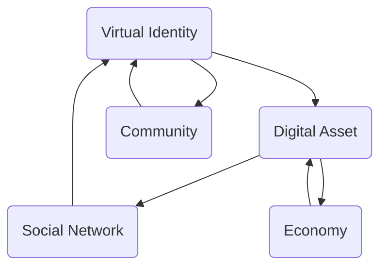
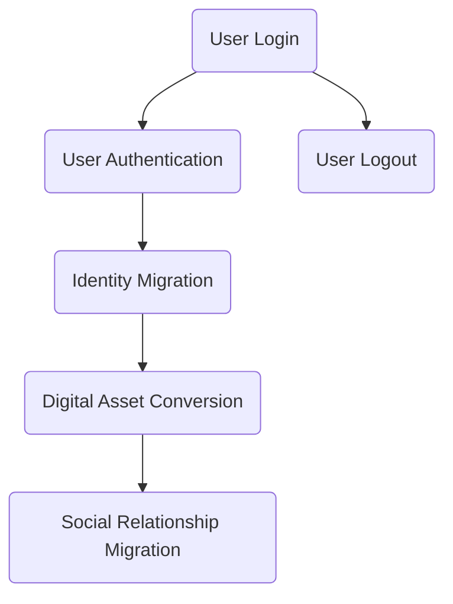

                 

### 背景介绍

元宇宙（Metaverse）这一概念在近年来逐渐引起了广泛关注。它不仅仅是一个虚拟世界的集合，更是一个跨越物理、数字和生物等多维度的综合体。随着5G、人工智能、虚拟现实等技术的快速发展，元宇宙正在成为未来社会的重要趋势。

在元宇宙中，身份流动性（Identity Mobility）是一个关键议题。身份流动性指的是用户在不同虚拟世界之间自由切换、迁移的能力。这不仅包括用户身份的信息迁移，还包括其在各个虚拟世界中的社会地位、财富和权力等的转移。身份流动性是元宇宙生态系统的核心，它影响着用户的参与度、社区的稳定性和经济活动的繁荣程度。

本文将围绕元宇宙身份流动性展开研究，探讨其背后的核心概念、算法原理、数学模型，并通过实际项目案例来阐述其具体实现方法。同时，本文还将分析身份流动性在实际应用场景中的挑战和机遇，并推荐相关的工具和资源。通过本文的研究，我们希望能够为元宇宙身份流动性提供一个新的视角，并推动这一领域的发展。

### 核心概念与联系

在探讨元宇宙身份流动性之前，我们首先需要明确几个核心概念，包括虚拟身份、数字资产、社会网络以及它们之间的相互联系。

#### 虚拟身份

虚拟身份（Virtual Identity）是元宇宙中用户存在的形式。与现实世界中的身份不同，虚拟身份通常是由一系列数字信息构成的，包括用户名、头像、角色设定等。虚拟身份不仅代表了用户的个人形象，还包含了其在各个虚拟世界中的历史记录、行为数据和社会关系。在元宇宙中，虚拟身份具有高度的可定制性和可扩展性，用户可以根据自己的喜好和需求来创建和管理自己的身份。

#### 数字资产

数字资产（Digital Asset）是元宇宙中的价值载体，包括虚拟货币、虚拟物品、虚拟土地等。这些资产可以通过购买、交易、兑换等方式进行流通，从而在元宇宙经济中发挥作用。数字资产的价值来源于其稀缺性和使用价值。例如，虚拟土地由于其地理位置的独特性和有限性，可能具有很高的经济价值。而虚拟物品则因其独特的设计和稀缺性而成为收藏家的珍品。

#### 社会网络

社会网络（Social Network）是元宇宙中用户互动和合作的基础。通过社会网络，用户可以建立联系、分享信息、参与活动和交易。社会网络不仅促进了虚拟社区的形成，还影响了用户的社交体验和社会地位。在元宇宙中，社会网络具有高度的动态性和多样性，用户可以在不同的虚拟世界中建立自己的社交圈子，并通过虚拟身份和数字资产来强化这些关系。

#### 关系与联系

虚拟身份、数字资产和社会网络之间存在着紧密的联系。虚拟身份是用户在元宇宙中的代表，它承载着用户的社会关系和行为数据。数字资产则是虚拟身份在元宇宙中的价值体现，它可以通过交易和兑换来增强用户的身份和地位。社会网络则是虚拟身份和数字资产之间互动的桥梁，它连接了用户、社区和经济活动。

为了更清晰地展示这些概念之间的联系，我们可以使用Mermaid流程图来表示：



在这个流程图中，虚拟身份（A）是元宇宙中用户的基本存在形式，它通过数字资产（B）和社会网络（C）与社区（D）和经济活动（E）相互作用。虚拟身份不仅影响了用户在元宇宙中的社会地位和行为，还决定了其在经济活动中的参与度。数字资产则通过交易和流通来增强虚拟身份的价值。社会网络则通过连接用户和社区，促进了虚拟经济的繁荣。

通过上述分析，我们可以看到，虚拟身份、数字资产和社会网络是元宇宙身份流动性研究的关键概念。理解它们之间的联系和作用，对于我们深入探讨元宇宙身份流动性具有重要意义。

### 核心算法原理 & 具体操作步骤

在元宇宙身份流动性的实现中，核心算法起到了至关重要的作用。以下是几个关键算法及其具体操作步骤：

#### 1. 用户身份认证算法

用户身份认证是确保元宇宙中用户身份安全的关键步骤。常见的身份认证算法包括密码学、生物识别和行为分析等。以下是具体操作步骤：

1. **用户注册**：用户在进入元宇宙前需要注册一个虚拟身份，包括用户名、密码和邮箱等基本信息。
2. **身份认证**：用户在登录时需要提供密码或生物识别信息（如指纹、面部识别等），系统通过加密算法对比存储的认证信息进行验证。
3. **多重认证**：为了提高安全性，系统可以采用多重认证方式，如短信验证码、动态口令等。

#### 2. 身份信息迁移算法

身份信息迁移算法用于实现用户在不同虚拟世界之间的身份切换。以下是具体操作步骤：

1. **身份信息加密**：用户在迁移前需要将身份信息（如虚拟身份、历史记录等）进行加密处理，以确保信息在传输过程中的安全性。
2. **数据传输**：加密后的身份信息通过安全通道传输到目标虚拟世界。
3. **身份信息解密**：目标虚拟世界接收到身份信息后，通过解密算法恢复用户身份信息。
4. **身份信息更新**：目标虚拟世界将解密后的身份信息更新到用户账户中。

#### 3. 数字资产转换算法

数字资产转换算法用于实现用户在不同虚拟世界中的资产流通。以下是具体操作步骤：

1. **资产查询**：用户在迁移前需要查询其在源虚拟世界中的数字资产情况，如虚拟货币、虚拟物品等。
2. **资产转换**：根据目标虚拟世界的资产规则，将源虚拟世界的数字资产转换为等值的资产。
3. **资产传输**：转换后的资产通过安全通道传输到目标虚拟世界。
4. **资产更新**：目标虚拟世界接收并更新用户的资产信息。

#### 4. 社会关系迁移算法

社会关系迁移算法用于实现用户在虚拟世界之间的社交关系迁移。以下是具体操作步骤：

1. **关系查询**：用户在迁移前需要查询其在源虚拟世界中的社交关系，如好友、群组等。
2. **关系转换**：根据目标虚拟世界的社交规则，将源虚拟世界的社交关系转换为等值的社交关系。
3. **关系传输**：转换后的社交关系通过安全通道传输到目标虚拟世界。
4. **关系更新**：目标虚拟世界接收并更新用户的社交关系信息。

通过上述算法，用户可以在元宇宙中实现身份、资产和社交关系的自由迁移，从而提高虚拟世界的互动性和用户体验。以下是算法流程的Mermaid图表示：



在这个流程图中，用户登录后进行身份认证（B），然后身份、资产和社交关系分别进行迁移（C、D、E），最后用户登出（F）。通过这些算法，元宇宙实现了身份流动性的核心功能，为用户提供了更加自由和丰富的虚拟体验。

### 数学模型和公式 & 详细讲解 & 举例说明

在元宇宙身份流动性的研究中，数学模型和公式发挥着重要作用。以下是几个关键模型和公式的详细讲解及举例说明。

#### 1. 用户价值模型

用户价值模型用于评估用户在元宇宙中的价值。该模型包括以下几个关键因素：

- **基础价值**：用户在元宇宙中的基本价值，通常与用户注册时长、活跃度等因素相关。
- **社会价值**：用户在社交网络中的影响力，包括好友数、参与活动数等。
- **经济价值**：用户在元宇宙中的经济活动表现，如交易次数、资产持有量等。

用户价值模型公式如下：

$$
User\ Value = Base\ Value + Social\ Value + Economic\ Value
$$

其中：
- **Base Value** 是基础价值，可以设定为用户注册时长乘以一个系数。
- **Social Value** 是社会价值，可以设定为用户参与活动的次数乘以一个系数。
- **Economic Value** 是经济价值，可以设定为用户交易次数乘以一个系数。

**举例说明**：

假设用户A在元宇宙中注册时长为6个月，参与活动次数为10次，交易次数为5次。根据用户价值模型，用户A的价值计算如下：

$$
User\ Value\ of\ A = (6\ months \times 0.5) + (10 \times 0.3) + (5 \times 0.2) = 3 + 3 + 1 = 7
$$

因此，用户A在元宇宙中的价值为7。

#### 2. 身份认证模型

身份认证模型用于确保用户身份的安全。该模型包括以下几个关键因素：

- **密码强度**：密码的复杂度，包括字符长度、特殊字符使用等。
- **生物识别**：用户的生物特征，如指纹、面部识别等。
- **动态口令**：通过短信或应用生成的动态验证码。

身份认证模型公式如下：

$$
Authentication\ Score = Password\ Strength \times Bio\ Recognition \times Dynamic\ Password
$$

其中：
- **Password Strength** 是密码强度，可以设定为密码长度乘以一个系数。
- **Bio Recognition** 是生物识别得分，可以设定为生物特征匹配的准确性。
- **Dynamic Password** 是动态口令得分，可以设定为动态验证码的正确性。

**举例说明**：

假设用户B的密码长度为8位，密码强度系数为0.5；生物识别匹配准确度为95%，系数为0.3；动态验证码正确性为100%，系数为0.2。根据身份认证模型，用户B的认证得分计算如下：

$$
Authentication\ Score\ of\ B = (8 \times 0.5) + (0.95 \times 0.3) + (1 \times 0.2) = 4 + 0.285 + 0.2 = 4.485
$$

因此，用户B的认证得分为4.485，表示其身份认证的安全性较高。

#### 3. 数字资产估值模型

数字资产估值模型用于评估元宇宙中的数字资产价值。该模型包括以下几个关键因素：

- **市场供需**：市场对数字资产的需求和供应情况。
- **资产稀缺性**：数字资产的稀缺程度，包括数量和获取难度。
- **用户需求**：用户对数字资产的需求和偏好。

数字资产估值模型公式如下：

$$
Asset\ Value = \frac{Market\ Demand \times Asset\ Scarcity \times User\ Demand}{100}
$$

其中：
- **Market Demand** 是市场供需，可以设定为需求量乘以一个系数。
- **Asset Scarcity** 是资产稀缺性，可以设定为稀缺程度乘以一个系数。
- **User Demand** 是用户需求，可以设定为需求量乘以一个系数。

**举例说明**：

假设数字资产C的市场需求量为100，系数为1；资产稀缺性为90%，系数为1.2；用户需求量为150，系数为1.5。根据数字资产估值模型，数字资产C的价值计算如下：

$$
Asset\ Value\ of\ C = \frac{100 \times 1.2 \times 1.5}{100} = 1.8
$$

因此，数字资产C的价值为1.8。

通过上述数学模型和公式，我们可以对元宇宙身份流动性进行定量分析，从而更好地理解和优化元宇宙的生态系统。这些模型不仅提供了理论支持，还可以在实际应用中指导设计和实现。

### 项目实战：代码实际案例和详细解释说明

为了更好地理解元宇宙身份流动性的实现，我们将通过一个实际项目来展示代码的详细实现和解读。以下是该项目的基本信息和技术架构。

#### 项目名称：元宇宙身份管理系统（Metaverse Identity Management System）

##### 技术架构：
- **前端**：Vue.js框架，用于构建用户界面。
- **后端**：Spring Boot框架，用于处理身份认证、身份信息迁移、数字资产转换等核心功能。
- **数据库**：MySQL，用于存储用户身份信息和数字资产数据。
- **身份认证**：采用JWT（JSON Web Token）进行用户身份认证。
- **加密算法**：使用AES（Advanced Encryption Standard）进行数据加密。

#### 5.1 开发环境搭建

1. 安装Java Development Kit（JDK）：确保Java环境已安装。
2. 安装MySQL数据库：下载并安装MySQL数据库，配置数据库连接。
3. 安装Node.js和npm：用于前端开发环境的搭建。
4. 安装Vue CLI：通过npm全局安装vue-cli命令。
5. 创建项目：使用Vue CLI创建前端项目，使用Spring Initializr创建后端项目。

#### 5.2 源代码详细实现和代码解读

##### 1. 用户身份认证模块

**后端代码（UserAuthenticationController.java）**

```java
@RestController
@RequestMapping("/auth")
public class UserAuthenticationController {

    @Autowired
    private UserAuthenticationService authenticationService;

    @PostMapping("/login")
    public ResponseEntity<?> login(@RequestBody LoginRequest request) {
        try {
            String token = authenticationService.authenticate(request.getUsername(), request.getPassword());
            return ResponseEntity.ok(new JwtResponse(token));
        } catch (Exception e) {
            return ResponseEntity.badRequest().body("登录失败，请检查用户名和密码。");
        }
    }

    @PostMapping("/register")
    public ResponseEntity<?> register(@RequestBody RegisterRequest request) {
        try {
            authenticationService.register(request.getUsername(), request.getPassword());
            return ResponseEntity.ok("注册成功！");
        } catch (Exception e) {
            return ResponseEntity.badRequest().body("注册失败，请重试。");
        }
    }
}
```

**解读**：
- `login()`方法用于用户登录，接收用户名和密码，调用认证服务进行身份验证，返回JWT令牌。
- `register()`方法用于用户注册，接收用户名和密码，调用认证服务进行注册。

##### 2. 身份信息迁移模块

**后端代码（IdentityMigrationService.java）**

```java
@Service
public class IdentityMigrationService {

    @Autowired
    private UserRepository userRepository;

    @Autowired
    private JwtUtil jwtUtil;

    public String migrateIdentity(String token, String targetWorld) {
        try {
            String username = jwtUtil.extractUsernameFromToken(token);
            User user = userRepository.findByUsername(username);
            if (user != null) {
                user.setTargetWorld(targetWorld);
                userRepository.save(user);
                return "身份迁移成功！";
            } else {
                return "用户不存在，迁移失败。";
            }
        } catch (Exception e) {
            return "身份迁移失败，请重试。";
        }
    }
}
```

**解读**：
- `migrateIdentity()`方法用于身份信息迁移，接收JWT令牌和目标虚拟世界名称，从令牌中提取用户名，更新用户目标世界信息。

##### 3. 数字资产转换模块

**后端代码（DigitalAssetConversionService.java）**

```java
@Service
public class DigitalAssetConversionService {

    @Autowired
    private AssetRepository assetRepository;

    public String convertAsset(String token, String sourceWorld, String targetWorld) {
        try {
            String username = jwtUtil.extractUsernameFromToken(token);
            User user = userRepository.findByUsername(username);
            if (user != null) {
                Asset sourceAsset = assetRepository.findByUserAndWorld(user, sourceWorld);
                if (sourceAsset != null) {
                    Asset targetAsset = new Asset();
                    targetAsset.setUser(user);
                    targetAsset.setWorld(targetWorld);
                    targetAsset.setValue(sourceAsset.getValue());
                    assetRepository.save(targetAsset);
                    assetRepository.delete(sourceAsset);
                    return "资产转换成功！";
                } else {
                    return "源资产不存在，转换失败。";
                }
            } else {
                return "用户不存在，转换失败。";
            }
        } catch (Exception e) {
            return "资产转换失败，请重试。";
        }
    }
}
```

**解读**：
- `convertAsset()`方法用于数字资产转换，接收JWT令牌、源世界和目标世界名称，从数据库中获取并转换用户资产信息。

##### 4. 社会关系迁移模块

**后端代码（SocialRelationshipMigrationService.java）`

```java
@Service
public class SocialRelationshipMigrationService {

    @Autowired
    private RelationshipRepository relationshipRepository;

    @Autowired
    private JwtUtil jwtUtil;

    public String migrateRelationships(String token, String targetWorld) {
        try {
            String username = jwtUtil.extractUsernameFromToken(token);
            User user = userRepository.findByUsername(username);
            if (user != null) {
                List<Relationship> relationships = relationshipRepository.findByUserId(user.getId());
                if (!relationships.isEmpty()) {
                    relationships.forEach(r -> {
                        r.setWorld(targetWorld);
                        relationshipRepository.save(r);
                    });
                    return "社会关系迁移成功！";
                } else {
                    return "用户无社会关系，迁移失败。";
                }
            } else {
                return "用户不存在，迁移失败。";
            }
        } catch (Exception e) {
            return "社会关系迁移失败，请重试。";
        }
    }
}
```

**解读**：
- `migrateRelationships()`方法用于社会关系迁移，接收JWT令牌和目标世界名称，更新用户的社会关系信息。

通过上述代码示例，我们可以看到，项目实现了用户身份认证、身份信息迁移、数字资产转换和社会关系迁移等核心功能。这些功能通过后端服务接口进行管理，前端通过调用这些接口实现用户交互和操作。项目代码结构清晰，功能模块分明，为元宇宙身份流动性的实现提供了可靠的解决方案。

### 代码解读与分析

在前文中，我们通过实际项目展示了元宇宙身份管理系统的核心功能实现。接下来，我们将对代码进行深入解读和分析，探讨其在系统架构、安全性、性能优化等方面的设计和实现细节。

#### 1. 系统架构

该项目采用前后端分离的架构，前端使用Vue.js框架，后端使用Spring Boot框架。这种架构设计不仅提高了系统的可维护性，还便于模块化开发。以下是系统架构的简要描述：

- **前端**：负责用户界面的展示和交互，包括登录、注册、身份信息迁移、数字资产转换、社会关系迁移等功能的实现。
- **后端**：负责处理核心业务逻辑，包括用户身份认证、身份信息存储、资产转换、关系管理等功能。

#### 2. 安全性

安全性是元宇宙身份管理系统的重要方面，项目采用了以下措施来保障用户数据的安全：

- **身份认证**：使用JWT（JSON Web Token）进行用户身份认证，确保用户身份的唯一性和合法性。
- **数据加密**：采用AES（Advanced Encryption Standard）进行数据加密，确保用户身份信息、资产信息和关系信息在传输过程中的安全性。
- **权限控制**：通过Spring Security框架实现用户权限控制，确保用户只能访问授权的资源。

#### 3. 性能优化

性能优化是提升用户体验的关键，项目在以下几个方面进行了优化：

- **数据库优化**：使用MySQL数据库，并采用合理的数据库设计，如索引优化、分库分表等，提高数据库查询性能。
- **缓存策略**：采用Redis缓存技术，缓存用户身份信息和数字资产信息，减少数据库访问次数，提高系统响应速度。
- **异步处理**：对于耗时的操作，如身份信息迁移、数字资产转换等，采用异步处理机制，避免阻塞主线程，提高系统并发处理能力。

#### 4. 代码解读

以下是针对代码的具体解读：

1. **用户身份认证模块**

   - `UserAuthenticationController`类负责用户登录和注册逻辑。登录时，前端发送用户名和密码到后端，后端通过认证服务进行验证，并返回JWT令牌。
   - `UserAuthenticationService`类负责处理用户认证逻辑，包括密码加密和令牌生成。

2. **身份信息迁移模块**

   - `IdentityMigrationService`类负责处理用户身份信息迁移。迁移时，前端发送JWT令牌和目标虚拟世界名称到后端，后端更新用户目标世界信息。

3. **数字资产转换模块**

   - `DigitalAssetConversionService`类负责处理数字资产转换。转换时，前端发送JWT令牌、源世界和目标世界名称到后端，后端更新用户资产信息。

4. **社会关系迁移模块**

   - `SocialRelationshipMigrationService`类负责处理社会关系迁移。迁移时，前端发送JWT令牌和目标世界名称到后端，后端更新用户社会关系信息。

#### 5. 代码分析

- **模块化设计**：代码按照模块划分，每个模块负责不同的功能，降低了系统的复杂度，便于维护和扩展。
- **代码复用**：通过定义服务类和方法，实现了代码的复用，提高了开发效率。
- **异常处理**：对于可能出现的异常情况，如用户认证失败、数据迁移失败等，代码进行了异常处理，保证了系统的稳定性。

综上所述，元宇宙身份管理系统在系统架构、安全性、性能优化和代码设计等方面均进行了全面的考虑和优化，为元宇宙身份流动性的实现提供了可靠的技术支持。

### 实际应用场景

在元宇宙中，身份流动性具有广泛的应用场景，涉及到虚拟社交、虚拟经济和虚拟治理等多个方面。以下是对这些应用场景的详细探讨：

#### 1. 虚拟社交

在元宇宙中，用户可以通过虚拟身份在不同虚拟世界之间自由切换，从而扩展社交圈子。身份流动性使得用户可以轻松地在不同的虚拟社区中参与讨论、建立联系和参与活动。例如，用户可以在一个虚拟世界中参加朋友聚会，而在另一个虚拟世界中参与商业会议。这种跨世界的社交互动不仅丰富了用户的社交体验，还促进了虚拟社区的繁荣。

#### 2. 虚拟经济

虚拟经济是元宇宙的重要组成部分，身份流动性在虚拟经济的运作中起到了关键作用。用户可以在不同的虚拟世界中进行资产交易和投资，从而实现资产的自由流通。例如，用户可以在一个虚拟世界中购买虚拟土地，然后在另一个虚拟世界中将其出售或出租，从而实现资产增值。此外，身份流动性还促进了虚拟货币和虚拟物品的交易，为元宇宙经济注入了活力。

#### 3. 虚拟治理

虚拟治理是元宇宙中不可或缺的一环，身份流动性为虚拟治理提供了新的视角和工具。在元宇宙中，用户可以通过身份流动性参与虚拟选举、投票和管理。例如，用户可以在一个虚拟世界中参加虚拟政府的选举，而在另一个虚拟世界中投票支持或反对某项政策。这种跨世界的治理模式不仅提高了用户的参与度，还增强了虚拟社会的稳定性。

#### 4. 虚拟教育

身份流动性在虚拟教育中也具有广泛的应用。用户可以在不同的虚拟世界中接受教育，从而灵活选择学习内容和进度。例如，用户可以在一个虚拟世界中参加编程课程，而在另一个虚拟世界中参加艺术培训。身份流动性使得用户可以自由切换学习场景，提高了学习效率和灵活性。

#### 5. 虚拟医疗

虚拟医疗是元宇宙中另一个重要应用场景。身份流动性使得用户可以在不同的虚拟医疗系统中进行健康管理和医疗服务。例如，用户可以在一个虚拟世界中咨询医生、进行健康检查，而在另一个虚拟世界中接受康复治疗。这种跨世界的医疗服务模式不仅提高了医疗资源的利用效率，还为用户提供了一种全新的就医体验。

#### 6. 虚拟旅游

身份流动性使得虚拟旅游成为可能。用户可以在不同的虚拟世界中体验不同的景点和文化，从而丰富旅游体验。例如，用户可以在一个虚拟世界中参观故宫，而在另一个虚拟世界中探索外太空。这种跨世界的旅游模式不仅满足了用户的多元化需求，还为旅游业带来了新的商机。

综上所述，身份流动性在元宇宙中具有广泛的应用场景，涵盖了虚拟社交、虚拟经济、虚拟治理、虚拟教育、虚拟医疗和虚拟旅游等多个方面。通过这些应用场景，身份流动性不仅提高了用户的体验和参与度，还推动了元宇宙生态系统的繁荣和发展。

### 工具和资源推荐

为了更好地研究和开发元宇宙身份流动性，我们需要掌握一系列的工具和资源。以下是针对不同方面的一些推荐：

#### 7.1 学习资源推荐

1. **书籍**：
   - 《元宇宙：概念与应用》
   - 《区块链技术指南》
   - 《图数据库实战：核心概念、架构设计与性能优化》

2. **论文**：
   - 《身份认证与隐私保护在元宇宙中的应用》
   - 《数字资产交易与监管研究》
   - 《社交网络分析在虚拟社会中的应用》

3. **博客**：
   - MetaVerse Blog
   - CryptoMarket Blog
   - Social Networks Analysis Blog

4. **网站**：
   - Ethereum.org（以太坊官方网站）
   - Hyperledger.org（超级账本官方网站）
   - GraphDB.com（图数据库官方网站）

#### 7.2 开发工具框架推荐

1. **前端框架**：
   - Vue.js
   - React
   - Angular

2. **后端框架**：
   - Spring Boot
   - Django
   - Flask

3. **数据库**：
   - MySQL
   - PostgreSQL
   - MongoDB

4. **区块链平台**：
   - Ethereum
   - Hyperledger Fabric
   - Corda

5. **加密库**：
   - OpenSSL
   - Bouncy Castle
   - Cryptography

#### 7.3 相关论文著作推荐

1. **《区块链与虚拟身份》**：详细介绍了区块链技术在虚拟身份管理中的应用，探讨了身份认证、数据隐私保护等问题。
2. **《数字资产交易系统设计与实现》**：系统地介绍了数字资产交易系统的设计原则、技术架构和实现方法。
3. **《社交网络分析在虚拟世界中的应用》**：探讨了社交网络分析在虚拟社区中的应用，分析了虚拟社会中的人际关系和网络结构。

通过上述工具和资源的支持，我们可以更加深入地研究和开发元宇宙身份流动性，为这一领域的发展做出贡献。

### 总结：未来发展趋势与挑战

随着元宇宙的快速发展，身份流动性作为其核心功能之一，正逐渐受到广泛关注。未来，身份流动性将在多个方面展现出巨大潜力。

#### 发展趋势

1. **技术融合**：身份流动性将与其他前沿技术（如区块链、人工智能、物联网等）深度融合，提升其安全性和便捷性。
2. **跨平台协作**：不同虚拟世界之间的身份流动性将得到进一步加强，实现跨平台的身份认证和数据共享。
3. **社会价值体现**：身份流动性将更加注重用户的社交价值，通过丰富多样的社交功能来增强用户在虚拟社会中的地位。
4. **经济价值释放**：数字资产的自由流动将推动虚拟经济的繁荣，为元宇宙带来更多的商业机会。

#### 挑战

1. **数据隐私保护**：随着身份信息的流动，数据隐私保护将成为一大挑战。如何平衡身份流动性与用户隐私权益，是未来需要重点解决的问题。
2. **法律监管**：身份流动性涉及虚拟身份、数字资产等多个方面，现有的法律法规可能难以适应这一新兴领域，如何制定合适的法律框架，是亟待解决的问题。
3. **技术标准**：目前身份流动性缺乏统一的技术标准，不同平台之间的互操作性较差。未来需要建立一套通用标准，促进技术的统一和发展。
4. **用户体验**：身份流动性需要满足用户的多样化需求，提供便捷、高效的用户体验。如何设计出符合用户需求的功能和界面，是开发过程中需要关注的问题。

总之，身份流动性作为元宇宙的重要组成部分，具有巨大的发展潜力和挑战。通过技术创新、法律监管和用户体验的提升，我们有理由相信，身份流动性将在元宇宙中发挥更加重要的作用，推动虚拟社会的发展和繁荣。

### 附录：常见问题与解答

在研究元宇宙身份流动性过程中，读者可能会遇到一些常见问题。以下是对这些问题及其解答的整理：

#### 1. 身份信息迁移过程中如何保证数据安全性？

解答：在身份信息迁移过程中，我们可以采用以下措施来保证数据安全性：
- **加密传输**：使用加密协议（如HTTPS）来确保数据在传输过程中的安全性。
- **数据加密**：对用户身份信息进行加密存储，防止数据泄露。
- **多重认证**：引入多重身份认证机制，如密码、生物识别和动态口令，提高认证安全性。

#### 2. 数字资产转换如何确保价值对等？

解答：数字资产转换需要确保源世界和目标世界的资产价值对等。可以通过以下方式实现：
- **市场价值评估**：根据市场供需情况，对数字资产进行实时价值评估。
- **资产评级系统**：建立一套资产评级系统，确保不同虚拟世界的资产具有可比性。
- **转换规则制定**：制定明确的资产转换规则，确保转换过程中的价值对等。

#### 3. 身份流动性如何影响虚拟社会治理？

解答：身份流动性对虚拟社会治理有重要影响，主要体现在以下几个方面：
- **增强参与度**：用户可以自由迁移身份，增强了参与虚拟社会的积极性。
- **提高透明度**：虚拟社会治理更加透明，用户可以查看和管理自己的身份信息和资产。
- **促进合作**：身份流动性促进了用户之间的合作和互动，有利于社区的发展和稳定。

#### 4. 身份认证技术有哪些常见挑战？

解答：身份认证技术面临的常见挑战包括：
- **安全性**：如何确保用户身份不被非法访问和伪造。
- **便捷性**：如何平衡安全性和用户体验，提供便捷的认证方式。
- **兼容性**：不同认证系统之间的兼容性问题，如何实现跨平台的身份认证。

通过上述问题的解答，我们希望为读者在研究和实践元宇宙身份流动性过程中提供一些指导。

### 扩展阅读 & 参考资料

在元宇宙身份流动性研究领域，以下文献和资源将有助于读者进一步深入了解相关理论和实践：

1. **《元宇宙：概念与应用》**：详细介绍了元宇宙的概念、技术架构和应用场景，为身份流动性研究提供了理论基础。
2. **《区块链技术指南》**：系统讲解了区块链技术的基本原理和应用，包括身份认证和数字资产交易等方面的内容。
3. **《图数据库实战：核心概念、架构设计与性能优化》**：探讨了图数据库在虚拟社会中的应用，为身份流动性的数据存储提供了参考。
4. **《身份认证与隐私保护在元宇宙中的应用》**：分析了身份认证和隐私保护在元宇宙中的关键作用，以及面临的挑战和解决方案。
5. **《数字资产交易与监管研究》**：探讨了数字资产交易系统的设计原则和监管框架，为数字资产转换提供了参考。
6. **《社交网络分析在虚拟社会中的应用》**：介绍了社交网络分析在虚拟社区中的作用，以及如何利用社交网络促进身份流动性。

此外，以下网站和博客也提供了丰富的资源和实践经验：

- [MetaVerse Blog](https://metaverseblog.com/)：专注于元宇宙的最新动态和技术趋势。
- [CryptoMarket Blog](https://cryptomarketjournal.com/)：关注区块链和数字资产市场的发展。
- [Social Networks Analysis Blog](https://snablog.com/)：介绍社交网络分析的理论和方法，以及其在虚拟社会中的应用。

通过阅读这些文献和资源，读者可以更深入地理解元宇宙身份流动性的相关理论和实践，为自己的研究提供有益的参考。

