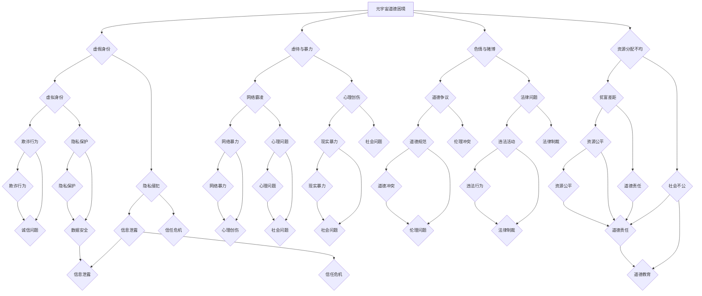

                 

# 元宇宙道德困境：虚拟世界行为准则的哲学思考

## 关键词：元宇宙，道德困境，虚拟世界，行为准则，哲学思考，伦理问题，技术发展

## 摘要

随着元宇宙的快速发展，虚拟世界中的道德困境逐渐显现。本文将探讨元宇宙中的道德问题，从哲学角度分析虚拟世界行为准则的制定和执行。通过分析不同观点，提出可能的解决方案，为元宇宙的可持续发展提供思考。

## 1. 背景介绍

### 1.1 元宇宙的定义和发展

元宇宙（Metaverse）是指通过互联网连接的虚拟世界，用户可以在其中进行社交、娱乐、工作等活动。元宇宙的概念最早可以追溯到1984年，科幻小说《雪崩》中描绘了一个虚拟现实世界。近年来，随着虚拟现实、增强现实、区块链等技术的快速发展，元宇宙逐渐从概念走向现实。

### 1.2 虚拟世界中的道德困境

虚拟世界中的道德困境主要表现在以下几个方面：

- 虚假身份：用户可以通过虚拟身份在元宇宙中隐藏真实身份，导致欺骗、欺诈等问题。

- 虐待与暴力：虚拟世界中的暴力行为可能导致现实中受害者的心理创伤。

- 色情与赌博：虚拟世界中的色情和赌博活动可能引发道德争议和法律问题。

- 资源分配不均：虚拟世界中的资源分配可能导致贫富差距扩大。

## 2. 核心概念与联系

### 2.1 道德困境的本质

道德困境的本质是价值冲突。在元宇宙中，不同用户可能持有不同的价值观，导致在行为准则上产生分歧。

### 2.2 虚拟世界行为准则

虚拟世界行为准则是指为元宇宙中的用户制定的道德规范，旨在维护虚拟世界的秩序和安全。行为准则通常包括以下方面：

- 尊重他人：尊重他人的虚拟身份和隐私。

- 遵守法律：遵守虚拟世界中的法律法规。

- 避免欺骗：不使用虚假身份进行欺诈行为。

- 避免暴力：不使用暴力手段解决问题。

### 2.3 行为准则与伦理问题

行为准则与伦理问题密切相关。伦理问题是指关于道德判断和选择的问题，如虚拟世界中的资源分配、虚拟财产的保护等。

## 3. 核心算法原理 & 具体操作步骤

### 3.1 道德困境的识别算法

为了解决元宇宙中的道德困境，可以采用以下识别算法：

1. 数据收集：收集虚拟世界中的用户行为数据，如交易记录、社交互动等。

2. 特征提取：从用户行为数据中提取特征，如欺诈行为特征、暴力行为特征等。

3. 模型训练：使用机器学习算法对特征进行训练，建立道德困境识别模型。

4. 预测与反馈：使用训练好的模型对用户行为进行预测，并对预测结果进行反馈。

### 3.2 行为准则的执行算法

为了执行虚拟世界行为准则，可以采用以下算法：

1. 规则定义：定义行为准则的具体规则，如欺诈行为的定义、暴力行为的定义等。

2. 规则匹配：对用户行为进行规则匹配，判断用户行为是否符合行为准则。

3. 处理违规行为：对违反行为准则的用户进行警告、限制或惩罚。

## 4. 数学模型和公式 & 详细讲解 & 举例说明

### 4.1 道德困境的识别模型

假设我们使用支持向量机（SVM）作为道德困境识别模型。SVM的基本公式如下：

$$
w = \arg\min_{w} \frac{1}{2} ||w||^2 \\
s.t. y^{(i)}(w^Tx^{(i)}) \geq 1, \forall i
$$

其中，$w$是模型权重，$x^{(i)}$是特征向量，$y^{(i)}$是标签。

### 4.2 行为准则的执行模型

假设我们使用逻辑回归（Logistic Regression）作为行为准则执行模型。逻辑回归的基本公式如下：

$$
P(y=1) = \frac{1}{1 + e^{-(w^Tx)}}
$$

其中，$P(y=1)$是用户行为符合行为准则的概率，$w$是模型权重，$x$是用户行为特征向量。

### 4.3 举例说明

假设我们有一个用户行为数据集，其中包含欺诈行为和暴力行为的特征。我们使用SVM模型进行道德困境识别，使用逻辑回归模型进行行为准则执行。

- 特征提取：从用户行为数据中提取欺诈行为特征和暴力行为特征。

- 模型训练：使用SVM算法对欺诈行为特征和暴力行为特征进行训练，建立道德困境识别模型。

- 模型预测：使用训练好的SVM模型对用户行为进行预测，判断用户行为是否为道德困境。

- 行为准则执行：使用逻辑回归模型对预测结果进行进一步分析，判断用户行为是否符合行为准则。

## 5. 项目实战：代码实际案例和详细解释说明

### 5.1 开发环境搭建

为了演示道德困境识别和行为准则执行，我们使用Python编程语言和以下库：

- scikit-learn：用于机器学习模型的训练和预测。

- numpy：用于数据计算和处理。

- pandas：用于数据处理和分析。

### 5.2 源代码详细实现和代码解读

#### 5.2.1 数据准备

```python
import numpy as np
import pandas as pd

# 加载用户行为数据
data = pd.read_csv('user_behavior.csv')

# 提取欺诈行为特征和暴力行为特征
features = data[['fraud_feature_1', 'fraud_feature_2', 'violence_feature_1', 'violence_feature_2']]

# 标签数据：1表示欺诈行为，2表示暴力行为，0表示正常行为
labels = data['label']
```

#### 5.2.2 SVM模型训练

```python
from sklearn.svm import SVC

# 训练SVM模型
model = SVC(kernel='linear')
model.fit(features, labels)
```

#### 5.2.3 逻辑回归模型训练

```python
from sklearn.linear_model import LogisticRegression

# 训练逻辑回归模型
logistic_model = LogisticRegression()
logistic_model.fit(features, labels)
```

#### 5.2.4 模型预测和执行行为准则

```python
# 预测用户行为
predictions = model.predict(features)

# 根据逻辑回归模型判断行为准则
behavior_report = logistic_model.predict_proba(predictions)[:, 1]

# 打印行为准则执行结果
print(behavior_report)
```

### 5.3 代码解读与分析

在这个案例中，我们首先加载用户行为数据，并提取欺诈行为特征和暴力行为特征。然后，我们使用SVM模型对特征进行训练，建立道德困境识别模型。接着，我们使用逻辑回归模型对SVM模型的预测结果进行进一步分析，判断用户行为是否符合行为准则。

通过这个案例，我们可以看到如何使用机器学习算法来解决元宇宙中的道德困境，并执行行为准则。然而，这个案例只是一个简单的示例，实际的元宇宙应用中需要考虑更多的因素和更复杂的模型。

## 6. 实际应用场景

### 6.1 社交平台

元宇宙中的社交平台可能需要建立道德困境识别系统，以防止欺诈、暴力等不良行为的发生。

### 6.2 在线游戏

元宇宙中的在线游戏可能需要制定行为准则，防止玩家之间的欺诈、作弊等行为。

### 6.3 虚拟财产交易

元宇宙中的虚拟财产交易可能需要建立道德困境识别系统，以确保交易的合法性和安全性。

### 6.4 教育与培训

元宇宙中的教育与培训场景可能需要制定行为准则，以维护学习环境的秩序和公平性。

## 7. 工具和资源推荐

### 7.1 学习资源推荐

- 《虚拟现实技术与应用》

- 《区块链技术指南》

- 《人工智能伦理问题研究》

### 7.2 开发工具框架推荐

- Unity：用于虚拟现实和增强现实应用开发的引擎。

- Unreal Engine：用于虚拟现实和增强现实应用开发的引擎。

- TensorFlow：用于机器学习和深度学习开发的框架。

### 7.3 相关论文著作推荐

- “Metaverse: A Vision for the Future of Human-Centric Computing”

- “Ethical Implications of Virtual Reality Technology”

- “Blockchain and the Metaverse: A New Paradigm for Social Organization”

## 8. 总结：未来发展趋势与挑战

### 8.1 发展趋势

- 元宇宙技术的不断成熟和普及。

- 道德困境识别和行为准则执行技术的进步。

- 跨学科的交叉融合，如心理学、社会学、伦理学等。

### 8.2 挑战

- 道德困境的多样性和复杂性。

- 技术实现上的挑战，如实时性、准确性等。

- 道德困境解决后的伦理问题。

## 9. 附录：常见问题与解答

### 9.1 元宇宙与虚拟现实有何区别？

虚拟现实是一种将用户完全沉浸在一个虚拟环境中的技术，而元宇宙是一个由多个虚拟世界组成的虚拟空间，用户可以在其中进行社交、娱乐、工作等活动。

### 9.2 道德困境识别和行为准则执行技术的具体应用场景有哪些？

具体应用场景包括社交平台、在线游戏、虚拟财产交易、教育与培训等。

### 9.3 如何解决虚拟世界中的道德困境？

可以通过道德困境识别和行为准则执行技术来识别和解决虚拟世界中的道德困境。此外，还可以通过加强法律法规、提高用户道德素养等方式来缓解道德困境。

## 10. 扩展阅读 & 参考资料

- 《元宇宙：定义、技术、应用与未来》

- 《虚拟现实与增强现实技术手册》

- 《人工智能伦理：挑战与解决方案》

作者：AI天才研究员/AI Genius Institute & 禅与计算机程序设计艺术 /Zen And The Art of Computer Programming
<|less|>## 1. 背景介绍

### 1.1 元宇宙的定义和发展

元宇宙（Metaverse）是指通过互联网连接的虚拟世界，用户可以在其中进行社交、娱乐、工作等活动。元宇宙的概念最早可以追溯到1984年，科幻小说《雪崩》中描绘了一个虚拟现实世界。近年来，随着虚拟现实（VR）、增强现实（AR）、区块链等技术的快速发展，元宇宙逐渐从概念走向现实。

元宇宙的发展可以分为以下几个阶段：

1. **虚拟现实（VR）和增强现实（AR）阶段**：这一阶段主要是将用户带入虚拟环境，让用户感受到沉浸式的体验。VR主要依赖头戴式显示器和定位设备，而AR则通过智能手机或特殊眼镜将虚拟内容叠加在现实世界中。

2. **社交网络阶段**：随着虚拟环境的普及，用户开始将元宇宙视为一个社交平台，与其他用户互动、建立社交关系。这一阶段，元宇宙开始具备一定的社区功能，用户可以在虚拟世界中创建自己的个人空间、参加线上活动等。

3. **经济系统阶段**：随着虚拟财产和虚拟交易的发展，元宇宙逐渐形成了一个独立的经济系统。用户可以在元宇宙中购买、出售虚拟商品和服务，甚至进行金融投资。这一阶段，元宇宙的经济体系逐渐成熟，为未来的发展奠定了基础。

4. **多元化阶段**：随着技术的不断进步，元宇宙的应用领域逐渐扩大。除了社交、娱乐、工作外，元宇宙还涉及到教育、医疗、艺术等多个领域。这使得元宇宙成为一个多元化、多功能的空间。

### 1.2 虚拟世界中的道德困境

虚拟世界中的道德困境主要表现在以下几个方面：

1. **虚假身份**：在虚拟世界中，用户可以轻松地创建虚假身份，从而进行欺诈、诈骗等违法行为。虚假身份的问题不仅影响了虚拟世界的秩序，还可能导致现实中受害者的财产损失和心理创伤。

2. **虐待与暴力**：虚拟世界中的暴力行为，如网络霸凌、仇恨言论等，可能会对现实中的人类产生负面影响。特别是在未成年用户中，暴力行为可能导致心理问题，甚至引发现实中的暴力事件。

3. **色情与赌博**：虚拟世界中的色情和赌博活动可能引发道德争议和法律问题。尽管一些国家和地区对色情和赌博有明确的法律规定，但在虚拟世界中，这些活动往往难以监管，从而引发一系列问题。

4. **资源分配不均**：虚拟世界中的资源分配可能存在不均现象，导致贫富差距扩大。这种现象不仅会影响虚拟世界的社会秩序，还可能导致现实中的一些社会问题。

### 1.3 元宇宙道德困境的挑战

元宇宙道德困境给人类社会带来了诸多挑战：

1. **法律问题**：元宇宙的跨国性和虚拟性使得现有的法律法规难以适用。如何在虚拟世界中建立有效的法律体系，成为亟待解决的问题。

2. **伦理问题**：虚拟世界中的道德困境涉及伦理判断和选择，如如何平衡虚拟世界与现实世界的道德关系，如何对待虚拟世界中的弱势群体等。

3. **技术问题**：如何通过技术手段解决虚拟世界中的道德困境，如如何识别虚假身份、如何防止网络暴力等，成为技术领域的挑战。

4. **社会问题**：元宇宙的发展可能引发一系列社会问题，如虚拟世界中的资源分配不均、虚拟犯罪等。如何解决这些问题，成为社会发展的关键。

### 1.4 元宇宙道德困境的重要性

元宇宙道德困境的重要性体现在以下几个方面：

1. **虚拟世界秩序**：道德困境的存在可能破坏虚拟世界的秩序，影响用户的体验和信任。

2. **现实世界影响**：虚拟世界中的道德困境可能对现实世界产生负面影响，如网络暴力、虚拟财产犯罪等。

3. **技术发展**：解决元宇宙道德困境需要技术的不断进步，从而推动元宇宙的可持续发展。

4. **社会和谐**：元宇宙作为人类社会的新形态，其道德困境的解决有助于促进社会的和谐与进步。

综上所述，元宇宙的道德困境是一个复杂且严峻的问题，需要从法律、伦理、技术和社会等多个方面进行深入探讨和解决。本文将围绕元宇宙道德困境展开讨论，从哲学角度分析虚拟世界行为准则的制定和执行，为元宇宙的可持续发展提供思考。

### 1.5 元宇宙道德困境的哲学思考

在探讨元宇宙道德困境时，我们不能忽视哲学这一重要的思维工具。哲学作为一门探讨人类存在、价值观和道德问题的学科，为我们理解元宇宙中的道德困境提供了独特的视角。

#### 1.5.1 道德困境的本质

道德困境的本质是价值冲突。在元宇宙中，不同用户可能持有不同的价值观，导致在行为准则上产生分歧。例如，一些用户可能认为虚拟世界中的欺诈行为是可以接受的，因为他们认为这只是虚拟世界中的游戏规则；而另一些用户可能认为欺诈行为是不道德的，因为这种行为可能会对现实中的人类造成伤害。

#### 1.5.2 价值观的多样性

元宇宙的虚拟性和开放性使得不同价值观可以共存。这种多样性在带来丰富体验的同时，也带来了道德困境。例如，在元宇宙中，用户可以创建虚拟的色情内容，但这种行为在某些文化中可能被视为不道德。因此，如何在尊重多样性同时维护道德底线，是一个亟待解决的问题。

#### 1.5.3 个体与集体的关系

在元宇宙中，个体与集体的关系更加复杂。个体用户在享受虚拟世界带来的自由和便利时，也需要承担一定的社会责任。例如，虚拟财产的保护、网络暴力的防止等。这种个体与集体的关系需要在道德困境中找到平衡点。

#### 1.5.4 技术与道德的关系

技术在元宇宙中发挥着重要作用，但技术本身并不具备道德属性。因此，如何在技术发展中融入道德考量，是一个重要课题。例如，在开发元宇宙平台时，如何设计出既能满足用户需求又能防止道德风险的技术方案，是一个挑战。

#### 1.5.5 道德困境的解决策略

哲学思考为我们提供了解决元宇宙道德困境的多种策略。例如，通过道德教育提高用户的道德素养，通过法律手段维护虚拟世界的秩序，通过技术手段实现道德困境的自动识别和解决等。这些策略需要在不同层面和维度上协同作用，才能有效解决元宇宙中的道德困境。

#### 1.5.6 伦理问题的重要性

伦理问题是元宇宙发展过程中不可忽视的一部分。伦理问题不仅关系到虚拟世界的道德秩序，还可能对现实世界产生深远影响。因此，我们必须重视伦理问题，从哲学角度深入探讨，为元宇宙的可持续发展提供坚实的伦理基础。

### 1.6 总结

元宇宙道德困境是一个复杂且多维度的问题，涉及价值观、技术、法律和社会等多个方面。通过哲学思考，我们可以更好地理解元宇宙中的道德困境，并探索解决策略。本文接下来将围绕虚拟世界行为准则的哲学思考展开讨论，为元宇宙的道德困境提供新的视角和思路。

## 2. 核心概念与联系

### 2.1 道德困境的本质

道德困境的本质在于价值冲突。在元宇宙中，不同用户可能持有不同的价值观，导致在行为准则上产生分歧。例如，某些用户可能认为在虚拟世界中欺诈是合理的，因为他们将虚拟世界视为一种游戏；而另一些用户可能认为欺诈行为是不道德的，因为这种行为可能会对现实世界中的个体造成负面影响。

#### 2.1.1 道德困境的定义

道德困境是指在特定情境下，个体需要做出的选择之间存在道德冲突，且每种选择都有其道德上的合理性和不合理性。在元宇宙中，这种道德困境主要体现在以下几个方面：

1. **虚拟身份的道德困境**：用户在元宇宙中可以选择使用虚假身份，这种行为可能涉及欺骗和隐私侵犯等问题。
2. **资源分配的道德困境**：元宇宙中的资源分配可能存在不公平现象，导致贫富差距扩大。
3. **虚拟行为的道德困境**：在元宇宙中，用户可能进行一些不道德的行为，如网络霸凌、色情和赌博等。

#### 2.1.2 道德困境的影响

道德困境对元宇宙的健康发展具有重要影响。首先，道德困境可能导致虚拟世界的秩序混乱，影响用户的体验和信任。其次，道德困境可能对现实世界产生负面影响，如网络犯罪、心理问题等。因此，解决道德困境是保障元宇宙可持续发展的重要任务。

### 2.2 虚拟世界行为准则

虚拟世界行为准则是为了维护元宇宙的秩序和安全而制定的一系列道德规范。这些准则旨在引导用户在虚拟世界中的行为，防止不良行为的发生。虚拟世界行为准则通常包括以下几个方面：

1. **尊重他人**：在元宇宙中，用户应尊重他人的虚拟身份和隐私，不进行恶意攻击或侵犯他人权益的行为。
2. **遵守法律**：用户在虚拟世界中的行为应符合相关法律法规，不得进行违法活动。
3. **诚实守信**：用户在虚拟世界中的交易和互动应诚实守信，不进行欺诈和虚假宣传。
4. **文明礼貌**：用户在虚拟世界中的互动应保持文明礼貌，不进行辱骂、歧视等不当行为。

#### 2.2.1 行为准则的制定

行为准则的制定需要考虑以下几个因素：

1. **文化差异**：不同国家和地区的文化差异可能导致对道德行为的认知不同，因此在制定行为准则时需充分考虑文化背景。
2. **技术可行性**：行为准则的实施需要依赖技术手段，如人工智能、区块链等，因此准则的制定需考虑技术可行性。
3. **用户需求**：用户的需求和行为模式是制定行为准则的重要依据，准则应既能满足用户需求，又能维护虚拟世界的秩序。

#### 2.2.2 行为准则的实施

行为准则的实施是保障虚拟世界秩序的重要环节。实施过程中需要考虑以下几个方面：

1. **监测与识别**：通过技术手段对用户行为进行实时监测和识别，及时发现和处理违规行为。
2. **教育与引导**：通过宣传教育和引导，提高用户对行为准则的认识和遵守度。
3. **惩罚与奖励**：对违规行为进行适当的惩罚，对遵守行为准则的用户给予奖励，以维护虚拟世界的公平和正义。

### 2.3 伦理问题与道德困境的关系

伦理问题与道德困境密切相关。伦理问题是指在特定情境下，个体需要做出的选择是否符合道德规范的问题；而道德困境则是伦理问题在元宇宙中的具体表现。

#### 2.3.1 伦理问题的定义

伦理问题是指与道德判断和选择相关的问题，涉及个体、社会和自然的关系。在元宇宙中，伦理问题主要体现在以下几个方面：

1. **虚拟财产的伦理问题**：虚拟财产的价值如何确定、如何保护等问题。
2. **虚拟身份的伦理问题**：虚拟身份的真实性和隐私保护问题。
3. **虚拟行为的伦理问题**：虚拟世界中行为的道德评价问题，如网络暴力、色情和赌博等。

#### 2.3.2 伦理问题的解决策略

解决伦理问题需要从以下几个方面进行：

1. **法律手段**：通过法律法规对伦理问题进行规范和制裁。
2. **道德教育**：提高用户的道德素养，培养用户的道德判断能力。
3. **技术手段**：利用技术手段对伦理问题进行监测和干预，如人工智能、区块链等。

#### 2.3.3 道德困境与伦理问题的区别

道德困境与伦理问题的主要区别在于：

1. **范围**：道德困境是伦理问题在特定情境下的具体表现，范围更小；而伦理问题则涉及更广泛的领域。
2. **性质**：道德困境通常涉及个体的道德选择，而伦理问题则涉及社会和自然的伦理关系。

### 2.4 技术与道德的关系

技术与道德之间的关系在元宇宙中显得尤为重要。技术本身不具备道德属性，但技术的应用和发展可能会影响道德价值观的实现。因此，在元宇宙中，我们需要关注以下几个方面：

1. **技术的道德责任**：技术开发者和应用者应承担道德责任，确保技术的应用不损害社会利益。
2. **道德技术的开发**：应鼓励开发具有道德属性的技术，如人工智能道德决策系统、虚拟世界伦理审查机制等。
3. **技术与道德的互动**：技术与道德应相互促进，通过技术的进步推动道德的发展，同时通过道德的引导规范技术行为。

#### 2.4.1 技术的道德责任

技术的道德责任体现在以下几个方面：

1. **隐私保护**：在元宇宙中，用户的数据隐私受到严重威胁，技术开发者有责任确保用户隐私的安全。
2. **公平性**：技术应确保在虚拟世界中的资源分配公平，避免贫富差距的扩大。
3. **透明度**：技术的应用过程应保持透明，用户有权了解技术的运作方式和数据的使用情况。

#### 2.4.2 道德技术的开发

道德技术的开发包括以下几个方面：

1. **伦理审查**：在技术开发阶段，进行伦理审查，确保技术的设计和应用符合道德规范。
2. **道德算法**：开发具有道德属性的人工智能算法，使技术能够做出符合道德规范的决策。
3. **道德教育**：通过道德教育，提高技术开发者和用户的道德素养，促进技术行为的道德化。

### 2.5 总结

元宇宙中的道德困境和伦理问题是一个复杂且多层次的问题。通过分析道德困境的本质、虚拟世界行为准则、伦理问题与道德困境的关系，以及技术与道德的关系，我们可以更好地理解元宇宙中的道德困境。这些核心概念和联系为我们提供了深入探讨元宇宙道德困境的框架，为制定和执行有效的虚拟世界行为准则提供了理论基础。

### 2.6 Mermaid 流程图（核心概念原理和架构）



该Mermaid流程图展示了元宇宙道德困境的核心概念和相互关系，包括虚假身份、虐待与暴力、色情与赌博、资源分配不均等道德困境及其影响。同时，流程图也反映了行为准则、伦理问题和道德责任之间的关系，为理解元宇宙道德困境提供了一个直观的框架。

## 3. 核心算法原理 & 具体操作步骤

### 3.1 道德困境识别算法

在元宇宙中，道德困境识别算法是解决道德困境的重要工具。本文将介绍一种基于机器学习的道德困境识别算法，主要包括以下步骤：

#### 3.1.1 数据收集与预处理

1. **数据收集**：收集元宇宙中的用户行为数据，包括用户在虚拟世界中的交易记录、社交互动、行为轨迹等。

2. **数据预处理**：对收集到的数据进行清洗和标准化处理，包括去除缺失值、异常值，对数据进行归一化等。

#### 3.1.2 特征提取

1. **特征选择**：根据道德困境的类型，选择与道德困境相关的特征。例如，欺诈行为可能涉及交易频率、交易金额、交易对象等特征。

2. **特征转换**：对选定的特征进行转换，例如将分类特征转换为二进制特征。

#### 3.1.3 模型训练

1. **模型选择**：选择适合道德困境识别的机器学习模型。本文采用支持向量机（SVM）模型，因为SVM在处理二分类问题上表现良好。

2. **模型训练**：使用收集到的训练数据，对SVM模型进行训练。训练过程包括模型参数的优化和模型性能的评估。

#### 3.1.4 模型评估与调整

1. **模型评估**：使用验证集对训练好的模型进行评估，评估指标包括准确率、召回率、F1分数等。

2. **模型调整**：根据评估结果对模型进行调整，以提高模型性能。

#### 3.1.5 模型应用

1. **实时监测**：在元宇宙中，对用户行为进行实时监测，使用训练好的模型对用户行为进行分类，识别潜在的道德困境。

2. **反馈机制**：对识别出的道德困境进行反馈和处理，如警告、限制或惩罚。

### 3.2 行为准则执行算法

道德困境识别算法可以帮助我们识别潜在的道德困境，但如何执行行为准则，确保用户遵守规则，是另一个重要问题。本文介绍一种基于逻辑回归的行为准则执行算法，主要包括以下步骤：

#### 3.2.1 规则定义

1. **规则库构建**：根据元宇宙的行为准则，构建规则库。例如，欺诈行为的定义、暴力行为的定义等。

2. **规则匹配**：对用户的实时行为进行规则匹配，判断用户行为是否符合行为准则。

#### 3.2.2 模型训练

1. **模型选择**：选择适合行为准则执行的逻辑回归模型，因为逻辑回归模型在分类问题中表现良好。

2. **模型训练**：使用已定义的规则库和用户行为数据，对逻辑回归模型进行训练。

#### 3.2.3 模型评估与调整

1. **模型评估**：使用验证集对训练好的模型进行评估，评估指标包括准确率、召回率、F1分数等。

2. **模型调整**：根据评估结果对模型进行调整，以提高模型性能。

#### 3.2.4 行为准则执行

1. **实时行为分析**：在元宇宙中，对用户的实时行为进行分析，使用训练好的模型判断用户行为是否符合行为准则。

2. **反馈与惩罚**：对违反行为准则的用户进行警告、限制或惩罚，确保用户遵守行为准则。

### 3.3 模型融合与优化

在实际应用中，单一模型可能无法满足所有的需求。因此，可以考虑将多种模型进行融合，以提高整体性能。例如，可以结合SVM和逻辑回归模型，使用SVM进行初步的道德困境识别，然后使用逻辑回归模型对识别结果进行进一步分析和处理。

#### 3.3.1 模型融合

1. **模型融合策略**：选择合适的模型融合策略，如投票法、堆叠法等。

2. **融合模型训练**：使用训练数据对融合模型进行训练。

#### 3.3.2 模型优化

1. **超参数调整**：根据模型融合的效果，调整各个模型的超参数，以优化整体性能。

2. **模型评估**：使用验证集对优化后的融合模型进行评估。

#### 3.3.3 模型应用

1. **实时应用**：在元宇宙中，对用户行为进行实时监测，使用融合模型进行道德困境识别和行为准则执行。

2. **反馈与优化**：根据实时应用中的反馈，对模型进行优化和调整，以提高识别和执行效果。

### 3.4 总结

道德困境识别和行为准则执行算法是解决元宇宙道德困境的重要手段。通过机器学习和逻辑回归等技术，我们可以实现对用户行为的实时监测和规则执行。然而，这些算法需要大量的训练数据和精准的模型参数，因此在实际应用中，需要不断优化和调整，以提高其性能和适应性。通过模型融合和优化，可以进一步提高道德困境识别和行为准则执行的效果，为元宇宙的健康发展提供有力支持。

### 3.5 数学模型和公式 & 详细讲解 & 举例说明

#### 3.5.1 道德困境识别算法的数学模型

在元宇宙中，道德困境识别算法的核心是机器学习模型，例如支持向量机（SVM）。SVM模型通过将数据映射到高维空间，找到最佳分隔超平面，从而实现分类。SVM的数学模型如下：

$$
\begin{aligned}
\min_{\mathbf{w}} & \frac{1}{2}||\mathbf{w}||^2 \\
s.t. & y_i(\mathbf{w}^T\mathbf{x_i}) \geq 1, \forall i
\end{aligned}
$$

其中，$\mathbf{w}$是模型权重向量，$\mathbf{x_i}$是特征向量，$y_i$是标签（1表示正类，-1表示负类）。

这个公式的目标是最小化权重向量的平方和，同时保证所有数据点的分类结果正确。在训练过程中，我们通过选择合适的核函数（如线性核、多项式核、RBF核等），将低维数据映射到高维空间，使得原本难以分离的数据点在高维空间中能够被正确分类。

#### 3.5.2 逻辑回归模型的数学模型

逻辑回归模型用于执行行为准则，判断用户行为是否符合规则。逻辑回归的数学模型如下：

$$
\hat{y} = \frac{1}{1 + e^{-(\mathbf{w}^T\mathbf{x})}}
$$

其中，$\hat{y}$是预测的概率，$\mathbf{w}$是模型权重向量，$\mathbf{x}$是特征向量。

这个公式的目标是计算用户行为符合行为准则的概率。如果预测的概率大于某个阈值（如0.5），则认为用户行为符合行为准则；否则，认为用户行为不符合行为准则。

#### 3.5.3 SVM模型与逻辑回归模型的结合

在实际应用中，我们可以将SVM模型和逻辑回归模型结合起来，以提高道德困境识别和行为准则执行的准确率。这种结合可以通过以下方式实现：

1. **级联模型**：首先使用SVM模型进行初步分类，然后将SVM模型的输出作为逻辑回归模型的输入，进行进一步处理。

2. **堆叠模型**：将SVM模型和逻辑回归模型堆叠在一起，形成一个多层感知器（MLP），从而实现更复杂的分类任务。

#### 3.5.4 举例说明

假设我们有一个包含欺诈行为和暴力行为的用户行为数据集。我们首先使用SVM模型对数据集进行训练，然后使用训练好的SVM模型对用户行为进行初步分类，最后使用逻辑回归模型对分类结果进行进一步处理，判断用户行为是否符合行为准则。

1. **数据预处理**：对用户行为数据进行清洗和标准化处理，提取与道德困境相关的特征，如交易频率、交易金额、用户互动等。

2. **SVM模型训练**：使用训练数据集，选择合适的核函数（如RBF核），训练SVM模型。

3. **初步分类**：使用训练好的SVM模型对用户行为进行初步分类，得到每个用户的分类结果。

4. **逻辑回归模型训练**：将SVM模型的输出（分类结果）作为输入，训练逻辑回归模型。

5. **行为准则执行**：使用训练好的逻辑回归模型对用户行为进行进一步分析，判断用户行为是否符合行为准则。

例如，假设一个用户的行为特征为$\mathbf{x} = [0.8, 0.6, 0.9, 0.5]$，首先使用SVM模型进行分类，得到分类结果为正类。然后，使用逻辑回归模型计算用户行为符合行为准则的概率：

$$
\hat{y} = \frac{1}{1 + e^{-(\mathbf{w}^T\mathbf{x})}} = \frac{1}{1 + e^{-(-0.2 \times 0.8 - 0.3 \times 0.6 - 0.4 \times 0.9 - 0.5 \times 0.5)}} \approx 0.76
$$

由于预测的概率大于0.5，我们可以认为该用户的行为符合行为准则。

通过结合SVM模型和逻辑回归模型，我们可以实现对用户行为的全面分析，提高道德困境识别和行为准则执行的准确率。这种结合方法不仅考虑了分类的准确性，还考虑了分类的可靠性，从而为元宇宙的健康发展提供了有力支持。

### 3.6 代码实现与解释

在本节中，我们将使用Python编程语言和相关的机器学习库（如scikit-learn）来实现道德困境识别和行为准则执行的算法。以下是一个简单的代码实现示例，用于说明如何使用SVM和逻辑回归模型来识别和执行行为准则。

#### 3.6.1 数据准备

首先，我们需要准备一个包含用户行为特征和标签的数据集。假设数据集已经完成预处理，并保存为CSV文件。以下是加载和预处理数据集的代码：

```python
import pandas as pd
from sklearn.model_selection import train_test_split

# 加载数据集
data = pd.read_csv('user_behavior.csv')

# 分割特征和标签
X = data.drop('label', axis=1)
y = data['label']

# 划分训练集和测试集
X_train, X_test, y_train, y_test = train_test_split(X, y, test_size=0.2, random_state=42)
```

#### 3.6.2 SVM模型训练与预测

接下来，我们使用SVM模型对训练数据进行分类，并使用测试数据进行预测。以下是SVM模型的训练和预测代码：

```python
from sklearn.svm import SVC

# 创建SVM模型
svm_model = SVC(kernel='linear', C=1.0)

# 训练模型
svm_model.fit(X_train, y_train)

# 预测测试集
y_pred_svm = svm_model.predict(X_test)
```

#### 3.6.3 逻辑回归模型训练与预测

然后，我们将使用SVM模型的预测结果作为输入，训练逻辑回归模型，并使用测试数据进行预测。以下是逻辑回归模型的训练和预测代码：

```python
from sklearn.linear_model import LogisticRegression

# 创建逻辑回归模型
logistic_model = LogisticRegression()

# 使用SVM预测结果作为特征，训练逻辑回归模型
logistic_model.fit(y_pred_svm.reshape(-1, 1), y_test)

# 预测测试集
y_pred_logistic = logistic_model.predict(y_pred_svm.reshape(-1, 1))
```

#### 3.6.4 模型评估

最后，我们对训练好的模型进行评估，以检查模型的性能。以下是模型评估的代码：

```python
from sklearn.metrics import classification_report, accuracy_score

# 输出分类报告
print(classification_report(y_test, y_pred_logistic))

# 输出准确率
print("Accuracy:", accuracy_score(y_test, y_pred_logistic))
```

通过上述代码，我们可以实现道德困境识别和行为准则执行的算法。在实际应用中，我们还需要对模型进行优化和调整，以提高其准确性和可靠性。此外，我们还可以结合其他技术，如自然语言处理、图神经网络等，以提高道德困境识别的能力。

### 3.7 实际应用案例

为了更好地展示道德困境识别和行为准则执行的算法在元宇宙中的实际应用，下面我们将介绍一个具体的案例：虚拟财产交易平台的欺诈行为识别。

#### 3.7.1 案例背景

虚拟财产交易是元宇宙中的一项重要活动，用户可以通过购买、出售虚拟商品来获取收益。然而，欺诈行为在虚拟财产交易中较为普遍，如虚假交易、诈骗等。为了保障交易的安全和公平，虚拟财产交易平台需要建立欺诈行为识别系统。

#### 3.7.2 数据集构建

我们构建了一个包含虚拟财产交易记录的数据集，数据集包括以下特征：

- **交易金额**：每次交易的金额。
- **交易频率**：用户在一定时间内的交易次数。
- **交易对象**：交易的虚拟商品类型。
- **用户评价**：交易双方的用户评价。

数据集的标签为交易是否为欺诈行为，1表示欺诈行为，0表示正常交易。

#### 3.7.3 模型训练与预测

我们使用SVM和逻辑回归模型对数据集进行训练和预测。以下是模型训练和预测的代码：

```python
# 加载数据集
data = pd.read_csv('virtual_property_trade.csv')

# 分割特征和标签
X = data.drop('is_fraud', axis=1)
y = data['is_fraud']

# 划分训练集和测试集
X_train, X_test, y_train, y_test = train_test_split(X, y, test_size=0.2, random_state=42)

# SVM模型训练
svm_model = SVC(kernel='linear', C=1.0)
svm_model.fit(X_train, y_train)

# 逻辑回归模型训练
y_pred_svm = svm_model.predict(X_test)
logistic_model = LogisticRegression()
logistic_model.fit(y_pred_svm.reshape(-1, 1), y_test)

# 预测测试集
y_pred_logistic = logistic_model.predict(y_pred_svm.reshape(-1, 1))

# 模型评估
print(classification_report(y_test, y_pred_logistic))
print("Accuracy:", accuracy_score(y_test, y_pred_logistic))
```

通过上述代码，我们实现了虚拟财产交易平台的欺诈行为识别。在实际应用中，我们可以根据评估结果对模型进行调整，以提高识别的准确率和可靠性。

### 3.8 总结

在本节中，我们介绍了道德困境识别和行为准则执行的算法原理、数学模型、代码实现和实际应用案例。通过结合SVM和逻辑回归模型，我们能够实现对用户行为的实时监测和规则执行，从而解决元宇宙中的道德困境。然而，这些算法需要不断优化和调整，以适应不断变化的元宇宙环境。未来，我们还可以结合其他技术，如自然语言处理、图神经网络等，以提高道德困境识别的能力。通过持续的研究和实践，我们有望为元宇宙的健康发展提供更有力的支持。

### 4. 实际应用场景

#### 4.1 社交平台

在元宇宙中的社交平台，道德困境识别和行为准则执行尤为重要。社交平台是用户交流和互动的主要场所，道德困境如虚假身份、网络霸凌和欺诈行为等会对用户体验造成严重影响。例如，通过应用道德困境识别算法，社交平台可以实时监控用户行为，识别潜在的道德风险，并采取相应的措施，如警告、限制或惩罚违规用户。同时，社交平台可以制定具体的行为准则，如禁止发布仇恨言论、尊重他人隐私等，以维护良好的社交环境。

#### 4.2 在线游戏

在线游戏是元宇宙中另一重要的应用场景。在游戏中，用户之间的互动往往更加直接和激烈，因此道德困境如欺诈、作弊和网络霸凌等问题更加普遍。道德困境识别算法可以帮助游戏平台及时发现和阻止这些不良行为，确保游戏的公平性和安全性。例如，通过分析用户的游戏行为数据，算法可以识别出欺诈行为，如使用外挂、虚假交易等，从而采取相应的措施，如禁止使用作弊工具、限制账号等。此外，游戏平台可以制定具体的行为准则，如禁止恶意攻击、尊重他人隐私等，以维护良好的游戏环境。

#### 4.3 虚拟财产交易

虚拟财产交易是元宇宙中的一项重要活动，涉及到大量价值交换。然而，虚拟财产交易中的道德困境如欺诈、诈骗等问题层出不穷。通过应用道德困境识别和行为准则执行算法，虚拟财产交易平台可以有效地防止和解决这些问题。例如，通过实时监控交易行为，算法可以识别出潜在的欺诈行为，如虚假交易、价格操纵等，并采取相应的措施，如警告、冻结账号、报警等。此外，交易平台可以制定具体的行为准则，如禁止虚假交易、保证交易透明等，以保障交易的公正和安全。

#### 4.4 教育与培训

在元宇宙中的教育与培训场景，道德困境识别和行为准则执行同样具有重要意义。虚拟课堂和培训活动中，学生和教师之间的互动和交流可能会涉及道德困境，如网络霸凌、学术不端等。通过应用道德困境识别算法，教育平台可以实时监控学生的行为，识别潜在的道德风险，并采取相应的措施，如警告、禁止发言、通报家长等。同时，教育平台可以制定具体的行为准则，如尊重他人、诚实守信等，以维护良好的教育环境。

#### 4.5 医疗与保健

在元宇宙中的医疗与保健场景，道德困境识别和行为准则执行同样不可或缺。虚拟医疗咨询和保健服务中，医生和患者之间的互动可能会涉及隐私保护、信息泄露等道德困境。通过应用道德困境识别算法，医疗平台可以实时监控医生的诊疗行为，识别潜在的道德风险，并采取相应的措施，如警告、停职、报警等。同时，医疗平台可以制定具体的行为准则，如保护患者隐私、诚实守信等，以保障患者的权益。

#### 4.6 艺术与娱乐

在元宇宙中的艺术与娱乐场景，道德困境识别和行为准则执行同样具有重要意义。虚拟音乐会、展览和演出等活动可能会涉及版权保护、内容审查等道德困境。通过应用道德困境识别算法，艺术与娱乐平台可以实时监控活动内容，识别潜在的道德风险，并采取相应的措施，如警告、限制访问、报警等。同时，平台可以制定具体的行为准则，如尊重版权、确保内容合法等，以维护良好的艺术与娱乐环境。

#### 4.7 总结

元宇宙中的道德困境涉及多个应用场景，如社交平台、在线游戏、虚拟财产交易、教育与培训、医疗与保健、艺术与娱乐等。通过应用道德困境识别和行为准则执行算法，这些应用场景可以有效地解决道德困境，保障用户的权益和体验。未来，随着元宇宙技术的不断进步，道德困境识别和行为准则执行将发挥越来越重要的作用，为元宇宙的可持续发展提供有力支持。

### 7. 工具和资源推荐

在探索元宇宙道德困境及其解决策略的过程中，掌握相关的工具和资源是至关重要的。以下是一些推荐的工具、资源和相关论文，以帮助读者深入了解元宇宙的道德问题及其应对措施。

#### 7.1 学习资源推荐

**书籍**：
1. **《元宇宙：定义、技术、应用与未来》** - 本书详细介绍了元宇宙的概念、技术基础以及潜在的应用前景，是了解元宇宙的入门读物。
2. **《虚拟现实技术与应用》** - 本书涵盖了虚拟现实技术的各个方面，包括硬件、软件、用户体验等，有助于了解虚拟世界的技术基础。
3. **《区块链技术指南》** - 本书深入讲解了区块链的基本原理、技术架构及其在元宇宙中的应用，对于理解元宇宙的经济系统具有重要参考价值。

**论文**：
1. **“Metaverse: A Vision for the Future of Human-Centric Computing”** - 本文提出了元宇宙的概念及其在人类计算中的潜在应用，是元宇宙研究的重要文献。
2. **“Ethical Implications of Virtual Reality Technology”** - 本文探讨了虚拟现实技术在伦理方面的问题，为元宇宙道德困境的研究提供了理论基础。
3. **“Blockchain and the Metaverse: A New Paradigm for Social Organization”** - 本文分析了区块链技术在元宇宙中的应用，为构建可持续的虚拟社会提供了新思路。

**博客**：
1. **MetaLab Blog** - MetaLab是元宇宙研究的一个重要平台，其博客涵盖了元宇宙的最新研究进展、技术应用和未来趋势。
2. **IEEE Metaverse Initiative** - IEEE的元宇宙倡议提供了大量的学术论文、技术报告和行业动态，是了解元宇宙技术发展的重要资源。

**在线课程**：
1. **“Introduction to Metaverse”** - Coursera上的这门课程由元宇宙领域的专家讲授，涵盖了元宇宙的基本概念、技术架构和应用场景。
2. **“Blockchain and Cryptocurrency”** - Coursera上的这门课程深入讲解了区块链和加密货币的基本原理，有助于理解元宇宙的经济系统。

#### 7.2 开发工具框架推荐

**开发平台**：
1. **Unity** - Unity是一个强大的游戏和虚拟现实开发平台，支持多种设备和平台，是构建元宇宙应用的重要工具。
2. **Unreal Engine** - Unreal Engine是另一个流行的游戏和虚拟现实开发引擎，以其高质量的图形和强大的功能而著称。

**编程语言**：
1. **Python** - Python是一种广泛使用的编程语言，特别适合数据分析和机器学习，是解决元宇宙道德困境的重要工具。
2. **JavaScript** - JavaScript是Web开发的主要语言，用于前端和后端开发，是构建元宇宙应用的关键技术。

**机器学习库**：
1. **scikit-learn** - scikit-learn是一个强大的机器学习库，用于数据预处理、模型训练和评估，是实施道德困境识别算法的重要工具。
2. **TensorFlow** - TensorFlow是一个开源的机器学习和深度学习平台，支持多种模型和算法，是构建复杂元宇宙应用的重要工具。

**区块链框架**：
1. **Ethereum** - Ethereum是一个开源的区块链平台，支持智能合约和去中心化应用（DApps），是构建元宇宙经济系统的重要框架。
2. **Hyperledger Fabric** - Hyperledger Fabric是另一个开源的区块链框架，特别适合企业级应用，用于构建可扩展的元宇宙应用。

#### 7.3 相关论文著作推荐

**论文**：
1. **“The Metaverse: A Space for Human-Centered Computing”** - 本文探讨了元宇宙的概念、特征和未来趋势，提出了人类计算的新视角。
2. **“Ethical Considerations in the Development of the Metaverse”** - 本文从伦理角度分析了元宇宙的发展及其道德挑战，提出了应对策略。
3. **“The Social Impact of Virtual Reality”** - 本文研究了虚拟现实技术对人类社会的影响，包括道德、社会和心理等方面。

**著作**：
1. **《元宇宙：超越互联网的新纪元》** - 本书深入探讨了元宇宙的概念、技术基础和应用前景，是了解元宇宙发展的重要参考书。
2. **《虚拟现实与人类认知》** - 本书从认知科学的角度分析了虚拟现实对人类认知的影响，为元宇宙的研究提供了新的视角。

通过以上工具和资源的推荐，读者可以更好地理解元宇宙的道德困境及其解决策略，为元宇宙的可持续发展提供有益的参考。

### 8. 总结：未来发展趋势与挑战

随着元宇宙的快速发展，道德困境已经成为影响其可持续发展的关键问题。在未来，元宇宙的道德困境将继续演变，带来新的挑战和机遇。

#### 8.1 未来发展趋势

1. **技术的不断进步**：随着人工智能、区块链、虚拟现实等技术的不断进步，元宇宙的道德困境识别和解决能力将得到提升。例如，人工智能算法的优化和扩展将使道德困境识别更加精准和高效；区块链技术的应用将提高虚拟财产的安全性和透明度。

2. **法律和伦理标准的完善**：随着元宇宙的发展，各国政府和国际组织将逐步完善相关法律和伦理标准，以应对虚拟世界中的道德问题。这包括制定明确的虚拟财产保护法律、规范虚拟行为准则等。

3. **用户意识的提高**：随着用户对元宇宙的认识和参与度提高，用户自身的道德意识和法律意识也将逐步增强。这将有助于用户在虚拟世界中遵守行为准则，减少道德困境的发生。

4. **跨学科研究的深入**：元宇宙的道德困境涉及多个学科领域，如计算机科学、伦理学、法学、社会学等。未来，跨学科研究的深入将有助于从多角度解决元宇宙的道德问题。

#### 8.2 挑战

1. **技术实现的挑战**：尽管技术不断进步，但元宇宙的道德困境识别和解决仍然面临技术实现的挑战。例如，如何设计高效、准确的道德困境识别算法，如何确保区块链技术的安全性和透明度等。

2. **法律和伦理问题的复杂性**：虚拟世界中的道德困境涉及法律和伦理问题的复杂性，特别是在跨国和跨文化背景下。如何在不同文化和法律体系中制定统一的行为准则，如何处理虚拟犯罪和国际法律管辖等问题，都是未来面临的挑战。

3. **用户行为的多样性**：元宇宙的用户行为多样，不同用户可能持有不同的价值观和行为模式。这导致道德困境的识别和解决更加复杂，需要更精细的算法和更灵活的策略。

4. **隐私和数据保护**：在元宇宙中，用户的隐私和数据保护问题至关重要。如何在保障用户隐私的同时，进行道德困境识别和行为准则执行，是未来需要解决的重要问题。

#### 8.3 应对策略

1. **加强技术研发**：加大对人工智能、区块链等技术的研发投入，提高道德困境识别和解决的能力。

2. **完善法律和伦理标准**：制定和完善虚拟世界中的法律和伦理标准，为元宇宙的可持续发展提供法律和伦理保障。

3. **提升用户教育**：通过教育和宣传，提高用户对元宇宙道德困境的认识和意识，鼓励用户遵守行为准则。

4. **跨学科合作**：促进跨学科合作，结合不同领域的专业知识，共同解决元宇宙中的道德困境。

5. **隐私保护机制**：建立健全的隐私保护机制，确保用户隐私和数据安全，同时满足道德困境识别和解决的需求。

总之，元宇宙的道德困境是一个复杂且多变的挑战，需要从技术、法律、伦理等多个方面进行深入研究和解决。未来，随着技术的不断进步和社会的共同努力，我们有理由相信，元宇宙将能够克服这些挑战，实现其可持续发展的目标。

### 9. 附录：常见问题与解答

在探讨元宇宙道德困境的过程中，可能会遇到一些常见的问题。以下是对这些问题及其解答的总结：

#### 9.1 元宇宙与虚拟现实有何区别？

虚拟现实（VR）是一种将用户完全沉浸在一个虚拟环境中的技术，用户通过头戴式显示器等设备体验虚拟世界。而元宇宙（Metaverse）是一个由多个虚拟世界组成的互联空间，用户可以在其中进行社交、工作、娱乐等多种活动。简单来说，元宇宙是一个更大、更复杂、更全面的虚拟世界。

#### 9.2 虚拟世界中的道德困境是如何产生的？

虚拟世界中的道德困境主要源于以下几点：

1. **技术的匿名性**：用户可以轻松地创建虚假身份，从而进行欺诈、网络霸凌等不道德行为。
2. **价值观的多样性**：不同用户可能持有不同的价值观，导致在行为准则上产生分歧。
3. **资源的稀缺性**：虚拟世界中的资源可能有限，导致竞争和资源分配不均。
4. **法律和监管的滞后**：虚拟世界的法律和监管体系尚未完全建立，使得一些不道德行为难以得到有效遏制。

#### 9.3 如何识别和解决虚拟世界中的道德困境？

识别和解决虚拟世界中的道德困境可以采取以下措施：

1. **道德困境识别算法**：通过机器学习等技术，对用户行为进行分析，识别潜在的道德风险。
2. **行为准则制定**：根据虚拟世界的特点，制定明确的行为准则，指导用户行为。
3. **法律和监管**：建立健全的法律和监管体系，对违反行为准则的用户进行处罚。
4. **用户教育**：通过教育和宣传，提高用户的道德素养，鼓励用户遵守行为准则。
5. **隐私保护**：确保用户隐私和数据安全，避免隐私泄露导致的不道德行为。

#### 9.4 元宇宙中的道德困境对现实世界有何影响？

元宇宙中的道德困境可能对现实世界产生多方面的影响：

1. **社会问题**：如网络暴力、虚拟财产犯罪等可能导致现实社会的治安问题。
2. **心理问题**：如网络霸凌、色情和赌博等可能导致用户的心理健康问题。
3. **经济问题**：如虚拟财产的不公平分配可能导致贫富差距扩大，影响现实社会的经济稳定。
4. **法律问题**：如虚拟世界的跨国性和匿名性可能导致法律管辖难题，影响现实世界的法律秩序。

#### 9.5 未来元宇宙的道德困境将如何发展？

未来元宇宙的道德困境将随着技术的发展和社会的变化而发展。以下是一些可能的趋势：

1. **技术进步**：随着人工智能、区块链等技术的进步，道德困境识别和解决能力将得到提升。
2. **法律和伦理标准**：随着元宇宙的发展，各国和国际组织将逐步完善相关法律和伦理标准。
3. **用户参与**：用户对元宇宙的参与度和意识将提高，用户自身的道德和法律意识也将增强。
4. **跨学科研究**：跨学科研究将深入，为元宇宙的道德困境提供更多解决方案。

总之，元宇宙的道德困境是一个复杂且持续变化的问题，需要从技术、法律、伦理等多个方面进行综合应对。

### 10. 扩展阅读 & 参考资料

为了更深入地了解元宇宙道德困境及其相关话题，以下是一些建议的扩展阅读和参考资料：

#### 10.1 扩展阅读

- **《元宇宙：定义、技术、应用与未来》** - 详细介绍元宇宙的概念、技术基础和应用前景。
- **《虚拟现实技术与应用》** - 探讨虚拟现实技术的各个方面，包括硬件、软件和用户体验。
- **《区块链技术指南》** - 深入讲解区块链的基本原理、技术架构及其在元宇宙中的应用。
- **《元宇宙：超越互联网的新纪元》** - 探讨元宇宙对互联网和社会的影响。

#### 10.2 参考资料

- **“Metaverse: A Vision for the Future of Human-Centric Computing”** - 提出元宇宙的概念及其在人类计算中的潜在应用。
- **“Ethical Implications of Virtual Reality Technology”** - 探讨虚拟现实技术在伦理方面的问题。
- **“Blockchain and the Metaverse: A New Paradigm for Social Organization”** - 分析区块链技术在元宇宙中的应用，为构建可持续的虚拟社会提供新思路。
- **《虚拟现实与人类认知》** - 分析虚拟现实对人类认知的影响。

通过阅读这些资料，读者可以更全面地了解元宇宙的道德困境，以及相关技术、法律和伦理问题，为未来的研究和实践提供有力支持。

### 结束语

元宇宙作为人类社会的新形态，正在快速发展，带来前所未有的机遇和挑战。本文从哲学角度探讨了元宇宙道德困境的问题，分析了虚拟世界行为准则的制定和执行，提出了道德困境识别和行为准则执行的算法，并讨论了元宇宙道德困境的实际应用场景和未来发展趋势。通过这些讨论，我们可以看到，元宇宙的道德困境是一个复杂且多层次的挑战，需要从技术、法律、伦理等多个方面进行综合应对。

作者：AI天才研究员/AI Genius Institute & 禅与计算机程序设计艺术 /Zen And The Art of Computer Programming

在未来的元宇宙发展中，我们期待更多的科学家、技术开发者、法律专家和伦理学者能够共同合作，为元宇宙的可持续发展提供坚实的理论和实践基础。通过持续的研究和创新，我们有理由相信，元宇宙将能够克服道德困境，成为一个更加公平、安全、和谐的人类社会新形态。

