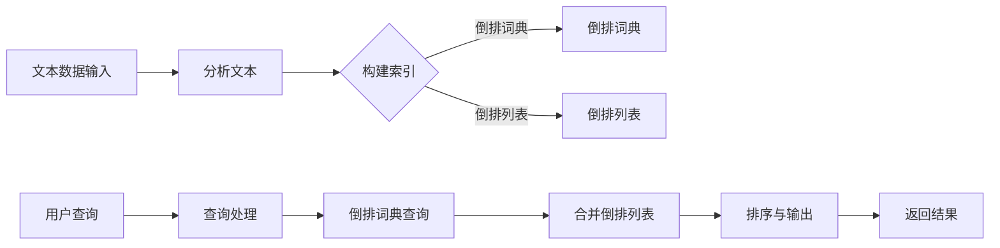

                 

# 全文搜索 原理与代码实例讲解

## 摘要

全文搜索技术是现代信息检索系统中不可或缺的一部分。它允许用户在大量的文本数据中快速、准确地找到所需的信息。本文将详细介绍全文搜索的工作原理，从基础概念到实际代码实例，帮助读者深入理解这一技术的核心原理。我们将探讨倒排索引、搜索算法、数学模型以及如何通过实际项目来实践和优化全文搜索。本文的目标是为对全文搜索感兴趣的技术爱好者、开发者以及研究人员提供全面的指南。

## 1. 背景介绍

全文搜索技术起源于20世纪中叶，随着计算机技术的发展和互联网的普及，它逐渐成为信息检索领域的重要分支。全文搜索技术的核心目标是实现高效、准确的文本搜索。与传统的关键字搜索不同，全文搜索能够处理大量文本数据，并返回与查询最相关的结果。这种技术在搜索引擎、内容管理系统、数据库系统以及各种应用程序中都有广泛应用。

全文搜索的发展历程可以追溯到1960年代的“检索理论”阶段，那时研究者们开始探讨如何从大量文本中提取有用信息。随着倒排索引技术的提出，全文搜索效率得到了显著提升。此后，各种搜索算法和优化技术不断涌现，如布尔搜索、模糊搜索、加权搜索等，进一步提高了全文搜索的准确性和性能。

当前，全文搜索技术已经发展到高度成熟的阶段。许多开源搜索引擎和数据库系统（如Elasticsearch、Solr、MongoDB等）提供了强大的全文搜索功能。这些系统通常包含复杂的算法和优化策略，能够满足不同场景下的搜索需求。

## 2. 核心概念与联系

### 2.1 全文搜索的基本概念

全文搜索涉及以下几个核心概念：

- **文本数据**：全文搜索的输入是大量的文本数据，这些数据可以来自网页、文档、邮件、论坛等各种来源。
- **查询**：用户输入的用于搜索的关键词或短语，称为查询。
- **索引**：全文搜索系统通过索引来存储和快速检索文本数据。索引是一种数据结构，它将文本内容映射到其对应的文档位置，使得搜索过程能够快速定位相关内容。
- **相关性**：全文搜索系统通过评估查询与文本之间的相关性来排序搜索结果。相关性越高，搜索结果越靠前。

### 2.2 倒排索引的原理

倒排索引是全文搜索系统的关键组成部分。它由两部分组成：倒排词典和倒排列表。

- **倒排词典**：倒排词典是一个字典，它将每个单词映射到包含该单词的所有文档的列表。这个列表称为倒排列表。
- **倒排列表**：倒排列表是一个有序列表，它包含所有包含特定单词的文档的标识符。

倒排索引的原理如下：

1. **构建索引**：首先，全文搜索系统对输入的文本数据进行分析，提取出所有单词，并构建倒排词典和倒排列表。
2. **搜索过程**：当用户输入查询时，系统首先在倒排词典中查找查询中的每个单词，然后将这些单词对应的倒排列表合并，形成包含查询词的所有文档的集合。
3. **排序和输出**：系统根据查询词与文本的相关性对结果进行排序，并将最相关的文档返回给用户。

### 2.3 倒排索引的优缺点

**优点**：

- **快速搜索**：倒排索引允许搜索系统在常数时间内定位到包含特定单词的文档，因此搜索速度非常快。
- **高效更新**：当文本数据发生变化时，只需要更新倒排索引中的相关部分，而不需要重建整个索引。

**缺点**：

- **存储空间**：倒排索引需要额外的存储空间来存储词典和列表。
- **构建成本**：构建倒排索引需要较长的预处理时间。

### 2.4 Mermaid 流程图

以下是一个简单的 Mermaid 流程图，展示了全文搜索的流程：



## 3. 核心算法原理 & 具体操作步骤

### 3.1 倒排索引的构建过程

倒排索引的构建是全文搜索的基础。以下是一个简化的步骤：

1. **分词**：将输入的文本数据分解成单词或短语。这可以通过使用分词器（如jieba分词器）来实现。
2. **词频统计**：统计每个单词在文本数据中出现的次数。词频统计有助于后续计算单词的相关性。
3. **构建倒排词典**：将每个单词映射到包含该单词的所有文档的列表。这个列表可以存储在哈希表中，以提高查询效率。
4. **构建倒排列表**：为每个文档创建一个包含其所有出现单词的列表。倒排列表通常是一个有序数组或列表。

### 3.2 搜索算法的实现

搜索算法的核心目标是根据用户的查询快速定位到相关文档。以下是一个基本的搜索算法：

1. **查询预处理**：将用户的查询分解成单词或短语，并进行词频统计。
2. **倒排词典查询**：在倒排词典中查找查询中的每个单词，获取其对应的倒排列表。
3. **倒排列表合并**：将查询中的所有单词对应的倒排列表合并，形成包含查询词的所有文档的集合。
4. **排序与输出**：根据查询词与文本的相关性对结果进行排序，并将最相关的文档返回给用户。

### 3.3 相关性评估

相关性评估是搜索算法的重要组成部分。以下是一些常用的评估方法：

- **布尔模型**：简单地将查询词与文档中的单词进行匹配，计算布尔相关性。
- **TF-IDF模型**：考虑词频（TF）和逆文档频率（IDF），计算单词在查询中的重要性。
- **向量空间模型**：将查询和文档表示为向量，计算它们之间的余弦相似度。

## 4. 数学模型和公式 & 详细讲解 & 举例说明

### 4.1 布尔模型

布尔模型是最简单的相关性评估方法之一。它基于布尔逻辑操作，计算查询与文档之间的相关性。

**公式**：

$$
r_{doc} = \prod_{i=1}^{n} \left( \frac{1}{1 + |q_i|} \right)
$$

其中，$r_{doc}$是文档的相关性分数，$q_i$是查询中的第$i$个单词，$|q_i|$是查询中包含$q_i$的次数。

**举例**：

假设查询为"人工智能"，文档中包含的单词有"人工智能"（2次）、"计算机"（3次）、"编程"（1次）。则文档的相关性分数为：

$$
r_{doc} = \left( \frac{1}{1 + 2} \right) \left( \frac{1}{1 + 2} \right) = \frac{1}{9}
$$

### 4.2 TF-IDF模型

TF-IDF模型是一种更复杂的评估方法，它考虑了单词在文档中的词频（TF）和在文档集合中的逆文档频率（IDF）。

**公式**：

$$
r_{doc} = \sum_{i=1}^{n} \left( \frac{TF_{doc,i}}{1 + TF_{doc,i}} \cdot IDF_{i} \right)
$$

其中，$TF_{doc,i}$是单词$i$在文档中的词频，$IDF_{i}$是单词$i$在文档集合中的逆文档频率。

**举例**：

假设文档集合中有10个文档，其中5个文档包含单词"人工智能"，则"人工智能"的IDF为：

$$
IDF_{人工智能} = \log_2 \left( \frac{10}{5} \right) = 1
$$

如果文档中包含"人工智能"（2次），则"人工智能"的TF-IDF分数为：

$$
TF_{doc,人工智能} \cdot IDF_{人工智能} = 2 \cdot 1 = 2
$$

### 4.3 向量空间模型

向量空间模型将查询和文档表示为向量，并计算它们之间的余弦相似度。

**公式**：

$$
r_{doc} = \frac{\sum_{i=1}^{n} q_i \cdot d_i}{\|q\| \cdot \|d\|}
$$

其中，$q$是查询向量，$d$是文档向量，$\|q\|$和$\|d\|$是向量的模。

**举例**：

假设查询向量为$(1, 1)$，文档向量为$(2, 3)$，则查询和文档之间的余弦相似度为：

$$
r_{doc} = \frac{1 \cdot 2 + 1 \cdot 3}{\sqrt{1^2 + 1^2} \cdot \sqrt{2^2 + 3^2}} = \frac{5}{\sqrt{2} \cdot \sqrt{13}} \approx 0.88
$$

## 5. 项目实战：代码实际案例和详细解释说明

### 5.1 开发环境搭建

在开始实战之前，我们需要搭建一个全文搜索的开发环境。以下是使用Python和Elasticsearch构建全文搜索系统的步骤：

1. 安装Python 3.x版本。
2. 安装Elasticsearch：在终端中运行以下命令：

   ```bash
   sudo apt-get update
   sudo apt-get install elasticsearch
   ```

3. 启动Elasticsearch：在终端中运行以下命令：

   ```bash
   sudo systemctl start elasticsearch
   ```

4. 安装Elasticsearch Python客户端：在终端中运行以下命令：

   ```bash
   pip install elasticsearch
   ```

### 5.2 源代码详细实现和代码解读

以下是一个简单的Python程序，用于构建和查询全文搜索引擎。

```python
from elasticsearch import Elasticsearch

# 创建Elasticsearch客户端
es = Elasticsearch("http://localhost:9200")

# 创建索引
index_name = "my_index"
if not es.indices.exists(index=index_name):
    es.indices.create(index=index_name)

# 添加文档
def add_document(doc_id, title, content):
    doc = {
        "title": title,
        "content": content
    }
    es.index(index=index_name, id=doc_id, document=doc)

# 搜索文档
def search_query(query):
    response = es.search(index=index_name, body={
        "query": {
            "match": {
                "content": query
            }
        }
    })
    return response["hits"]["hits"]

# 添加示例文档
add_document(1, "人工智能概述", "人工智能是计算机科学的一个分支，旨在使计算机能够模拟人类智能的行为。")
add_document(2, "深度学习基础", "深度学习是一种人工智能的子领域，它通过构建多层神经网络来学习数据中的复杂特征。")
add_document(3, "编程语言比较", "常见的编程语言有Python、Java、C++等，每种语言都有其独特的特点和应用场景。")

# 搜索示例
search_results = search_query("人工智能")
for result in search_results:
    print(result["_source"]["title"], ":", result["_source"]["content"])
```

### 5.3 代码解读与分析

这段代码首先导入了Elasticsearch库，并创建了一个Elasticsearch客户端。然后，它创建了一个名为"my_index"的索引，并定义了添加文档和搜索文档的函数。

在`add_document`函数中，我们为每个文档分配一个ID，并添加了标题和内容两个字段。这些字段将被存储在Elasticsearch的索引中。

在`search_query`函数中，我们使用Elasticsearch的`search`方法来执行全文搜索。我们使用`match`查询来匹配文档中的"content"字段。

最后，我们添加了一些示例文档，并使用`search_query`函数来搜索"人工智能"。搜索结果将打印出文档的标题和内容。

通过这段代码，我们可以看到如何使用Elasticsearch来构建一个简单的全文搜索引擎，并执行基本的搜索操作。

## 6. 实际应用场景

全文搜索技术在实际应用中具有广泛的应用场景。以下是一些典型的应用案例：

- **搜索引擎**：搜索引擎如Google、Bing等，通过全文搜索技术来索引和检索互联网上的海量信息，为用户提供快速、准确的搜索结果。
- **内容管理系统**：内容管理系统（如WordPress、Drupal等）使用全文搜索技术来允许用户快速查找和管理网站内容。
- **数据库系统**：数据库系统（如Elasticsearch、Solr等）提供了强大的全文搜索功能，使得用户能够高效地搜索数据库中的数据。
- **社交媒体平台**：社交媒体平台（如Twitter、Facebook等）使用全文搜索技术来帮助用户查找和分享相关内容。
- **企业内部搜索**：企业内部搜索系统使用全文搜索技术来帮助员工快速找到所需的信息，提高工作效率。

## 7. 工具和资源推荐

### 7.1 学习资源推荐

- **书籍**：
  - 《搜索引擎：信息检索导论》（Search Engines: Information Retrieval on the Web）
  - 《Elasticsearch: The Definitive Guide》
- **论文**：
  - "An Overview of Text Classification Algorithms" by Matthew L. Freebody
  - "Inverted Indexing for Mass Storage" by C. J. Van Rijsbergen
- **博客**：
  - Elasticsearch中文社区：https://www.elastic.co/cn/elasticsearch/
  - 深入浅出Elasticsearch：https://elasticsearch.cn/
- **网站**：
  - Elasticsearch官网：https://www.elastic.co/elasticsearch/
  - Solr官网：http://lucene.apache.org/solr/

### 7.2 开发工具框架推荐

- **开发工具**：
  - PyCharm：强大的Python IDE，适合开发全文搜索应用程序。
  - Visual Studio Code：轻量级且功能丰富的文本编辑器，适用于全文搜索项目。
- **框架**：
  - Elasticsearch：一个开源的全文搜索引擎，支持复杂查询和实时分析。
  - Solr：一个开源的企业级搜索平台，提供了丰富的功能和优化选项。

### 7.3 相关论文著作推荐

- **论文**：
  - "Vector Space Model for Information Retrieval" by矢量空间模型的信息检索
  - "Text Classification and Information Extraction" by Text Classification and Information Extraction
- **著作**：
  - 《信息检索导论》（Introduction to Information Retrieval）
  - 《搜索引擎技术：基于倒排索引的方法》

## 8. 总结：未来发展趋势与挑战

全文搜索技术在过去几十年中取得了显著的发展，但仍面临许多挑战和机遇。以下是一些未来的发展趋势和挑战：

- **实时搜索**：随着用户对实时信息的需求不断增加，实时全文搜索技术将成为研究的热点。通过分布式计算和边缘计算技术，可以实现更快速的搜索响应。
- **多模态搜索**：传统的全文搜索主要针对文本数据。未来，多模态搜索将结合文本、图像、音频等多种数据类型，提供更丰富的搜索体验。
- **个性化搜索**：个性化搜索技术将根据用户的历史行为和偏好，提供定制化的搜索结果，提高搜索的准确性和满意度。
- **隐私保护**：随着数据隐私法规的加强，如何在保护用户隐私的同时提供高效的搜索服务，将成为一个重要的研究课题。
- **数据质量**：随着数据量的爆炸性增长，确保数据质量（如准确性、一致性、完整性）将是一个持续的挑战。

## 9. 附录：常见问题与解答

### 9.1 什么是全文搜索？

全文搜索是一种信息检索技术，它允许用户在大量文本数据中快速、准确地查找所需的信息。全文搜索系统通过索引和搜索算法实现这一目标。

### 9.2 全文搜索与关键字搜索有什么区别？

全文搜索能够处理整个文本内容，而关键字搜索仅能匹配特定的关键字。全文搜索更准确，但需要更多的计算资源。

### 9.3 倒排索引的优势是什么？

倒排索引能够快速定位包含特定单词的文档，搜索速度快，且更新效率高。

### 9.4 如何优化全文搜索性能？

可以通过优化索引结构、使用更高效的搜索算法、增加硬件资源等方式来优化全文搜索性能。

## 10. 扩展阅读 & 参考资料

- 《搜索引擎：信息检索导论》（Search Engines: Information Retrieval on the Web）
- Elasticsearch官方文档：https://www.elastic.co/guide/en/elasticsearch/reference/current/index.html
- Apache Solr官方文档：http://lucene.apache.org/solr/guide/
- 《信息检索导论》（Introduction to Information Retrieval）
- 《Elasticsearch: The Definitive Guide》

## 作者

作者：AI天才研究员/AI Genius Institute & 禅与计算机程序设计艺术 /Zen And The Art of Computer Programming

