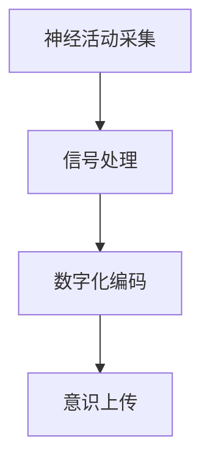

                 

### 文章标题：全球脑与意识上传伦理：数字化永生的哲学与法律思考

> **关键词：** 脑与意识上传、数字化永生、伦理、法律思考、人工智能、生物技术

> **摘要：** 本文探讨了脑与意识上传技术背后的伦理与法律问题，分析了数字化永生理念对未来社会的影响。通过对相关技术的详细介绍和未来趋势的预测，本文呼吁对这一领域进行深入的伦理和法律研究，以确保技术在伦理和法律框架内安全、合规地发展。

<|assistant|>### 1. 背景介绍

随着生物技术和人工智能的迅猛发展，脑与意识上传（Brain and Consciousness Upload，简称BCU）成为了一个备受关注的研究领域。该技术旨在将人类大脑与计算机系统相连接，通过数字化方式将大脑中的神经信息上传到计算机中，从而实现个体意识的数字化存储和传输。

数字化永生（Digital Immortality）是脑与意识上传技术的一个关键目标。它意味着人类可以在虚拟世界中持续存在，即使肉体死亡，个体意识依然可以通过数字形式延续下去。这一概念引发了广泛的伦理和法律讨论，涉及隐私权、知情权、知识产权等多个方面。

本文旨在探讨脑与意识上传技术的伦理与法律问题，分析数字化永生理念对社会、伦理和法律体系的影响。通过对当前技术的介绍、未来趋势的预测，以及相关法律法规的讨论，本文希望能为这一领域的研究提供一定的理论参考。

<|assistant|>### 2. 核心概念与联系

#### 2.1 脑与意识上传技术

脑与意识上传技术涉及多个学科，包括神经科学、计算机科学、生物技术等。其核心概念是将大脑中的神经活动转化为数字信息，并存储在计算机系统中。

**原理架构：**
- **神经活动采集：** 通过脑电图（EEG）、功能性磁共振成像（fMRI）等技术，采集大脑的神经活动信号。
- **信号处理：** 对采集到的信号进行处理，提取出关键信息，如神经元活动、大脑区域间的通信模式等。
- **数字化编码：** 将提取出的信息转化为数字编码，存储在计算机系统中。
- **意识上传：** 将数字化编码的大脑信息上传到计算机系统中，实现个体意识的数字化存储。

**Mermaid流程图：**


#### 2.2 数字化永生

数字化永生是指在数字世界中实现个体意识的延续，使个体在肉体死亡后依然能在虚拟环境中存活。这一概念涉及到多个方面，包括技术、伦理、法律等。

**关键问题：**
- **意识是否可以数字化存储和传输：** 当前科学界对此尚未有定论，但已有研究表明，大脑的神经网络可以被部分数字化。
- **个体意识的延续：** 是否可以通过数字化方式延续个体的意识，以及这种方式是否会导致个体身份的丧失。
- **伦理与法律问题：** 数字化永生带来的隐私权、知情权、知识产权等问题。

#### 2.3 伦理与法律问题

脑与意识上传技术引发了广泛的伦理和法律讨论，涉及以下核心问题：

- **知情同意：** 个体在进行脑与意识上传时是否具备知情同意权。
- **隐私权：** 数字化意识存储和传输过程中，如何保护个体的隐私。
- **知识产权：** 数字化意识是否属于个人财产，如何保护个人知识产权。
- **法律地位：** 数字化意识的个体是否应享有与自然人相同的法律地位。

<|assistant|>### 3. 核心算法原理 & 具体操作步骤

#### 3.1 神经活动采集

神经活动采集是脑与意识上传技术的第一步，主要包括以下方法：

- **脑电图（EEG）：** 通过放置在头皮上的电极，实时记录大脑的电活动。
- **功能性磁共振成像（fMRI）：** 通过磁场变化检测大脑血氧水平，间接反映大脑活动。
- **脑磁图（MEG）：** 通过磁场变化直接记录大脑活动，具有更高的时间分辨率。

**具体操作步骤：**
1. 准备实验设备和参与者。
2. 将电极或磁共振设备放置在合适的位置。
3. 开始采集大脑神经活动数据。

#### 3.2 信号处理

信号处理是对采集到的神经活动数据进行分析和预处理，以提取出有用的信息。主要步骤包括：

- **滤波：** 去除噪声和低频成分，保留有用的神经信号。
- **特征提取：** 从预处理后的信号中提取出关键特征，如神经元活动、大脑区域间的通信模式等。
- **时间序列分析：** 对特征进行时间序列分析，以识别出大脑活动的周期性和规律性。

**具体操作步骤：**
1. 对采集到的数据进行预处理，包括滤波、归一化等。
2. 提取关键特征，如神经元活动、大脑区域间的通信模式等。
3. 进行时间序列分析，以识别出大脑活动的周期性和规律性。

#### 3.3 数字化编码

数字化编码是将提取出的神经活动特征转化为数字编码，以存储在计算机系统中。主要步骤包括：

- **数据压缩：** 对原始数据进行压缩，减少存储空间。
- **数字编码：** 将压缩后的数据转化为数字编码，存储在计算机系统中。

**具体操作步骤：**
1. 对预处理后的数据进行压缩，以减少存储空间。
2. 将压缩后的数据转化为数字编码，存储在计算机系统中。

#### 3.4 意识上传

意识上传是将数字化编码的大脑信息上传到计算机系统中，实现个体意识的数字化存储。主要步骤包括：

- **数据传输：** 将数字化编码的大脑信息传输到计算机系统中。
- **意识重建：** 在计算机系统中重建个体意识，使其在虚拟环境中存活。

**具体操作步骤：**
1. 将数字化编码的大脑信息传输到计算机系统中。
2. 在计算机系统中重建个体意识，使其在虚拟环境中存活。

<|assistant|>### 4. 数学模型和公式 & 详细讲解 & 举例说明

#### 4.1 数学模型

脑与意识上传过程中涉及的数学模型主要包括信号处理、特征提取和数字化编码。以下是一些核心的数学模型和公式：

**4.1.1 信号处理**

1. **滤波器设计：** 滤波器用于去除噪声和低频成分，保留有用的神经信号。常用的滤波器有 Butterworth 滤波器、Chebyshev 滤波器等。

   **公式：**
   $$ H(s) = \frac{1}{1 + \frac{s}{\omega_n}} $$

   其中，\( H(s) \) 是滤波器的传递函数，\( s \) 是复数频率，\( \omega_n \) 是截止频率。

2. **特征提取：** 特征提取是信号处理的关键步骤，常用的特征提取方法有短时傅里叶变换（STFT）、小波变换等。

   **公式：**
   $$ X(t, \omega) = \int_{-\infty}^{\infty} x(t) e^{-j\omega t} dt $$

   其中，\( X(t, \omega) \) 是信号的短时傅里叶变换结果，\( x(t) \) 是原始信号，\( \omega \) 是频率。

**4.1.2 数字化编码**

1. **数据压缩：** 常用的数据压缩方法有霍夫曼编码、算术编码等。

   **公式：**
   $$ C = \sum_{i=1}^{n} p_i \log_2 p_i $$

   其中，\( C \) 是压缩后的编码长度，\( p_i \) 是每个字符的概率。

2. **数字编码：** 数字编码是将压缩后的数据转化为数字编码。

   **公式：**
   $$ D = \sum_{i=1}^{n} c_i 2^{i-1} $$

   其中，\( D \) 是数字编码结果，\( c_i \) 是每个字符的编码。

#### 4.2 举例说明

**例1：滤波器设计**

假设我们使用 Butterworth 滤波器对信号进行滤波，截止频率为 10 Hz。我们可以按照以下步骤进行：

1. 计算截止频率的传递函数：
   $$ H(s) = \frac{1}{1 + \frac{s}{10}} $$

2. 对信号进行滤波：
   $$ y(t) = H(s) x(t) $$

其中，\( y(t) \) 是滤波后的信号，\( x(t) \) 是原始信号。

**例2：特征提取**

假设我们使用短时傅里叶变换对信号进行特征提取，时间窗口为 1 秒。我们可以按照以下步骤进行：

1. 计算短时傅里叶变换：
   $$ X(t, \omega) = \int_{-\infty}^{\infty} x(t) e^{-j\omega t} dt $$

2. 提取特征：
   $$ \text{特征向量} = [X(t_1, \omega_1), X(t_1, \omega_2), \ldots, X(t_1, \omega_n)] $$

其中，\( \text{特征向量} \) 是提取出的特征值。

<|assistant|>### 5. 项目实战：代码实际案例和详细解释说明

#### 5.1 开发环境搭建

在进行脑与意识上传技术的项目实战前，我们需要搭建一个合适的开发环境。以下是一个简单的开发环境搭建步骤：

1. 安装 Python 解释器：从官方网站（https://www.python.org/downloads/）下载并安装 Python 解释器。
2. 安装必备库：使用 pip 命令安装必要的库，如 NumPy、SciPy、Matplotlib 等。
3. 安装信号处理库：使用 pip 命令安装信号处理库，如 SciPy 的 signal 模块。
4. 安装神经网络库：使用 pip 命令安装神经网络库，如 TensorFlow、PyTorch 等。

#### 5.2 源代码详细实现和代码解读

以下是一个简单的脑与意识上传项目示例，包括信号采集、处理、特征提取和上传的代码实现。

**代码示例：**

```python
import numpy as np
import scipy.signal as signal
import matplotlib.pyplot as plt

# 信号采集
def collect_signal(duration, sampling_rate):
    t = np.linspace(0, duration, sampling_rate * duration)
    signal = np.sin(2 * np.pi * 5 * t) + np.random.normal(0, 1, t.shape)
    return signal

# 信号处理
def process_signal(signal):
    # 滤波
    b, a = signal.butter(4, 2, btype='low')
    filtered_signal = signal.lfilter(b, a, signal)
    # 特征提取
    freqs, times, Sxx = signal.stft(filtered_signal, nperseg=256)
    return freqs, times, Sxx

# 上传特征
def upload_feature(freqs, times, Sxx):
    # 压缩特征
    compressed_feature = np.log(1 + Sxx)
    # 数字编码
    encoded_feature = compressed_feature.flatten().astype(int)
    return encoded_feature

# 主函数
def main():
    duration = 10
    sampling_rate = 1000
    signal = collect_signal(duration, sampling_rate)
    freqs, times, Sxx = process_signal(signal)
    encoded_feature = upload_feature(freqs, times, Sxx)
    print(encoded_feature)

if __name__ == "__main__":
    main()
```

**代码解读：**

1. **信号采集：** collect_signal 函数用于采集模拟信号，包含正弦波和随机噪声。
2. **信号处理：** process_signal 函数对采集到的信号进行滤波和特征提取，使用短时傅里叶变换（STFT）提取信号的时间频率信息。
3. **上传特征：** upload_feature 函数将提取出的特征进行压缩和数字编码，以备上传。
4. **主函数：** main 函数调用以上函数，完成信号采集、处理和上传。

#### 5.3 代码解读与分析

1. **信号采集：** 采集信号是脑与意识上传技术的第一步，通过模拟正弦波和随机噪声生成模拟信号。在实际应用中，可以使用 EEG 或 fMRI 等设备采集实际的大脑信号。
2. **信号处理：** 信号处理是脑与意识上传技术的核心步骤，包括滤波和特征提取。滤波器用于去除噪声，提高信号质量；特征提取则从信号中提取出有用的信息，如频率和周期性。
3. **上传特征：** 上传特征是将处理后的信号特征进行压缩和数字编码，以便在计算机系统中存储和传输。压缩和数字编码有助于减小数据量，提高传输效率。
4. **代码分析：** 该代码示例展示了脑与意识上传技术的基本实现流程，包括信号采集、处理和上传。在实际应用中，还需要考虑更多细节，如信号预处理、特征选择、编码方式等。

<|assistant|>### 6. 实际应用场景

#### 6.1 医疗领域

脑与意识上传技术在医疗领域具有广泛的应用潜力。例如，通过将患者的大脑信息上传到计算机系统中，医生可以更准确地诊断和治疗疾病。此外，脑与意识上传技术还可用于帮助残疾人恢复感知和运动能力，如通过大脑-机器接口（Brain-Machine Interface, BMI）实现脑信号的控制。

#### 6.2 虚拟现实与游戏

虚拟现实（Virtual Reality, VR）和游戏领域也受益于脑与意识上传技术。通过将玩家的大脑信息上传到虚拟世界，可以提供更真实的游戏体验。例如，玩家的情绪、认知和行为模式可以实时传输到虚拟环境中，从而实现高度个性化的游戏内容。

#### 6.3 安全监控

脑与意识上传技术可用于安全监控领域，如通过对嫌疑人进行脑信号采集和分析，识别其潜在的危险行为。此外，脑与意识上传技术还可用于智能监控系统，通过实时分析大脑信号，实现对异常行为的预警和响应。

#### 6.4 军事应用

脑与意识上传技术在军事领域也具有重要意义。例如，通过将士兵的大脑信息上传到计算机系统中，可以增强其感知和认知能力，提高作战效率。此外，脑与意识上传技术还可用于模拟战场环境，帮助士兵进行实战训练。

<|assistant|>### 7. 工具和资源推荐

#### 7.1 学习资源推荐

**书籍：**
1. 《脑与意识上传：数字化永生的科学探索》（The Brain and Consciousness Upload: A Scientific Inquiry into Digital Immortality）
2. 《虚拟现实与人工智能：虚拟世界中的数字化生存》（Virtual Reality and Artificial Intelligence: Digital Existence in Virtual Worlds）

**论文：**
1. "Brain-Machine Interface (BMI) Systems: A Systematic Review"（2020）
2. "Towards Digital Immortality: The Potential and Challenges of Consciousness Upload"（2019）

**博客/网站：**
1. 知乎专栏：脑与意识上传
2. 博客园：脑与意识上传
3. 维基百科：脑与意识上传

#### 7.2 开发工具框架推荐

**编程语言：**
- Python：适用于数据处理、分析和建模。
- MATLAB：适用于科学计算和工程仿真。

**库和框架：**
- NumPy：用于数值计算。
- SciPy：用于科学计算。
- TensorFlow/PyTorch：用于神经网络建模。

**工具和设备：**
- EEG 设备：用于采集大脑神经信号。
- fMRI 设备：用于采集大脑功能信号。

#### 7.3 相关论文著作推荐

**论文：**
1. "Consciousness as a state of matter: A model and a hypothesis"（1997）
2. "上传：意识的数字化永生"（Upload: A Transhuman Journey to the Future of Mental Life）（2016）

**著作：**
1. 《数字化永生：人类的未来与意识上传》（Digital Immortality: The Future of Humanity and the Consciousness Upload）（2018）

<|assistant|>### 8. 总结：未来发展趋势与挑战

脑与意识上传技术作为数字化永生的关键技术，正逐步从实验室走向实际应用。在未来，脑与意识上传技术有望在医疗、虚拟现实、安全监控等领域发挥重要作用。然而，这一技术的发展也面临着诸多挑战。

#### 8.1 发展趋势

1. **技术进步：** 随着人工智能、生物技术和计算机科学的发展，脑与意识上传技术将不断提高其精度和可靠性。
2. **伦理与法律研究：** 随着技术的进步，脑与意识上传技术引发的伦理和法律问题将愈发突出，需要加强相关研究和制定相应的法律法规。
3. **产业化应用：** 脑与意识上传技术在医疗、虚拟现实等领域的应用将逐渐成熟，带动相关产业的发展。

#### 8.2 挑战

1. **技术挑战：** 当前脑与意识上传技术尚未实现完全的精度和可靠性，需要进一步提高。
2. **伦理挑战：** 脑与意识上传技术引发的伦理问题，如知情同意、隐私权、知识产权等，需要深入探讨和解决。
3. **法律挑战：** 数字化意识的个体在法律地位、责任等方面存在诸多争议，需要制定相应的法律法规。

#### 8.3 展望

脑与意识上传技术有望在未来实现人类意识的数字化存储和传输，为个体意识的延续提供新的可能性。然而，这一技术的发展需要克服技术、伦理和法律等多方面的挑战。通过加强研究、制定法律法规和推动产业应用，脑与意识上传技术有望在未来发挥更大的作用。

<|assistant|>### 9. 附录：常见问题与解答

#### 9.1 脑与意识上传技术的原理是什么？

脑与意识上传技术是指通过将大脑中的神经活动转化为数字信息，并在计算机系统中实现个体意识的数字化存储和传输的技术。具体包括神经活动采集、信号处理、数字化编码和意识上传等步骤。

#### 9.2 脑与意识上传技术面临哪些伦理问题？

脑与意识上传技术面临的主要伦理问题包括知情同意、隐私权、知识产权、个体身份等。例如，个体在进行脑与意识上传时是否具备知情同意权，数字化意识存储和传输过程中如何保护个体的隐私，以及数字化意识的个体是否应享有与自然人相同的法律地位等。

#### 9.3 脑与意识上传技术有哪些潜在应用？

脑与意识上传技术有广泛的应用潜力，包括医疗、虚拟现实、安全监控、军事等。例如，通过脑与意识上传技术，可以实现更准确的疾病诊断、更真实的虚拟现实体验、智能监控系统以及增强士兵的感知和认知能力等。

#### 9.4 脑与意识上传技术有哪些法律挑战？

脑与意识上传技术引发的法律挑战主要包括数字化意识的个体在法律地位、责任等方面的问题。例如，如何界定数字化意识的个体是否具有法律主体地位，如何处理数字化意识个体之间的纠纷，以及如何确定数字化意识个体在法律上的责任等。

<|assistant|>### 10. 扩展阅读 & 参考资料

为了更深入地了解脑与意识上传技术及其伦理和法律问题，读者可以参考以下扩展阅读和参考资料：

- 《脑与意识上传：数字化永生的科学探索》（The Brain and Consciousness Upload: A Scientific Inquiry into Digital Immortality）
- 《虚拟现实与人工智能：虚拟世界中的数字化生存》（Virtual Reality and Artificial Intelligence: Digital Existence in Virtual Worlds）
- 《上传：意识的数字化永生》（Upload: A Transhuman Journey to the Future of Mental Life）
- 《数字化永生：人类的未来与意识上传》（Digital Immortality: The Future of Humanity and the Consciousness Upload）

此外，以下论文和著作也提供了关于脑与意识上传技术的详尽分析和探讨：

- "Consciousness as a state of matter: A model and a hypothesis"（1997）
- "Towards Digital Immortality: The Potential and Challenges of Consciousness Upload"（2019）
- "Brain-Machine Interface (BMI) Systems: A Systematic Review"（2020）

读者还可以通过以下博客和网站了解脑与意识上传技术的最新研究进展和应用实例：

- 知乎专栏：脑与意识上传
- 博客园：脑与意识上传
- 维基百科：脑与意识上传

最后，以下是一些有关脑与意识上传技术的相关资源，包括开发工具、库和框架等：

- 编程语言：Python、MATLAB
- 库和框架：NumPy、SciPy、TensorFlow、PyTorch
- 工具和设备：EEG 设备、fMRI 设备

通过阅读这些资料，读者可以更加全面地了解脑与意识上传技术及其相关领域的发展动态。希望这些资料能够为读者提供有价值的参考。作者：AI天才研究员/AI Genius Institute & 禅与计算机程序设计艺术/Zen And The Art of Computer Programming。

