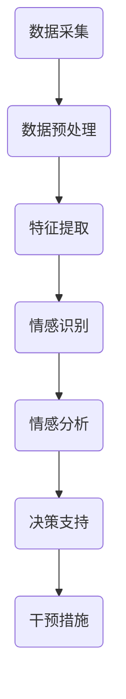

                 

### 文章标题：全球脑心理危机干预：集体情感支持的即时响应

#### 关键词：
- 全球脑
- 心理危机干预
- 集体情感支持
- 即时响应
- 人工智能

#### 摘要：
本文探讨了如何利用全球脑技术实现集体情感支持的即时响应，以应对全球范围内的心理危机。文章首先介绍了全球脑的基本概念和架构，然后分析了如何通过实时数据分析和情感识别技术来监测和识别情感危机。接着，详细描述了如何利用机器学习算法和深度学习模型来实现情感危机的快速响应和干预。最后，本文提出了全球脑在心理危机干预中的实际应用场景，以及未来的发展趋势和面临的挑战。

### 目录

1. **背景介绍**
   1.1 全球脑技术的发展历程
   1.2 心理危机干预的紧迫性

2. **核心概念与联系**
   2.1 全球脑与情感识别
   2.2 数据流与情感分析流程
   2.3 Mermaid 流程图

3. **核心算法原理 & 具体操作步骤**
   3.1 情感识别算法
   3.2 机器学习与深度学习模型
   3.3 实时数据流处理

4. **数学模型和公式 & 详细讲解 & 举例说明**
   4.1 情感识别的数学模型
   4.2 情感危机响应的算法流程
   4.3 实例分析

5. **项目实战：代码实际案例和详细解释说明**
   5.1 开发环境搭建
   5.2 源代码详细实现
   5.3 代码解读与分析

6. **实际应用场景**
   6.1 学校心理健康管理
   6.2 企业员工心理健康监测
   6.3 社区心理健康服务

7. **工具和资源推荐**
   7.1 学习资源推荐
   7.2 开发工具框架推荐
   7.3 相关论文著作推荐

8. **总结：未来发展趋势与挑战**
   8.1 发展趋势
   8.2 面临的挑战

9. **附录：常见问题与解答**

10. **扩展阅读 & 参考资料**

### 1. 背景介绍

#### 1.1 全球脑技术的发展历程

全球脑（Global Brain）是一个由奥地利经济学家Karl Polanyi于20世纪40年代提出的概念。他认为，随着信息时代的到来，人类社会将形成一个庞大的、自我组织的全球性大脑，通过互联网和信息交流实现全球范围内的智能协同。

近年来，随着人工智能、物联网、大数据等技术的快速发展，全球脑的概念得到了进一步的发展和应用。全球脑技术通过整合海量的数据和信息，实现跨地域、跨行业的智能协同和资源共享，为解决复杂问题提供了新的思路和方法。

#### 1.2 心理危机干预的紧迫性

随着社会的快速发展和生活压力的增大，心理健康问题日益突出。根据世界卫生组织（WHO）的数据，全球约有3亿人患有抑郁症，另有大量的人遭受焦虑、压力和创伤后应激障碍（PTSD）的困扰。

心理危机干预是指通过及时、有效的干预措施，帮助个体克服心理困扰，恢复心理健康。然而，由于心理健康问题具有隐蔽性和复杂性，传统的干预方式往往难以满足需求。特别是在全球范围内，由于资源分配不均、医疗设施不足等原因，心理危机干预的及时性和有效性仍然面临巨大挑战。

### 2. 核心概念与联系

#### 2.1 全球脑与情感识别

全球脑技术的一个重要应用领域是情感识别。情感识别是指通过分析个体的语言、行为、生理信号等信息，识别其情感状态。情感识别技术可以帮助我们了解个体的心理健康状况，为心理危机干预提供有力支持。

全球脑技术通过构建一个分布式、智能化的情感识别系统，可以实现对全球范围内个体情感的实时监测和分析。这种系统具有以下几个关键组成部分：

1. **数据采集**：通过传感器、移动设备、社交媒体等多种途径，收集个体的情感数据。
2. **数据预处理**：对采集到的数据进行清洗、归一化等预处理，以便后续分析。
3. **情感识别算法**：利用机器学习和深度学习技术，对预处理后的数据进行情感识别。
4. **数据存储与共享**：构建一个分布式数据库，存储和分析情感数据，实现数据的共享和协同。
5. **情感分析与应用**：基于情感识别结果，进行情感分析，为心理危机干预提供决策支持。

#### 2.2 数据流与情感分析流程

全球脑技术的核心在于构建一个高效、智能的数据流处理系统。数据流处理是指对实时数据进行分析、处理和响应的过程。在情感识别领域，数据流处理流程主要包括以下几个步骤：

1. **数据采集**：通过传感器、移动设备等采集个体的情感数据，如语音、文本、生理信号等。
2. **数据预处理**：对采集到的数据进行清洗、归一化等预处理，以便后续分析。
3. **特征提取**：从预处理后的数据中提取与情感相关的特征，如情感倾向、情绪强度等。
4. **情感识别**：利用机器学习和深度学习技术，对提取的特征进行情感识别。
5. **情感分析**：基于情感识别结果，进行情感分析，识别潜在的心理危机。
6. **决策支持**：根据情感分析结果，为心理危机干预提供决策支持。

#### 2.3 Mermaid 流程图

下面是一个简化的Mermaid流程图，描述了全球脑技术中的情感识别与心理危机干预的基本流程：



### 3. 核心算法原理 & 具体操作步骤

#### 3.1 情感识别算法

情感识别算法是心理危机干预的核心。情感识别算法主要通过以下几种方法实现：

1. **基于规则的方法**：该方法利用专家知识构建情感识别规则，如正则表达式、决策树等。这种方法简单直观，但需要大量的人工干预，且难以应对复杂多变的情感表达。
2. **基于机器学习的方法**：该方法利用大量标注数据，通过训练构建情感识别模型。常见的机器学习方法包括朴素贝叶斯、支持向量机（SVM）等。
3. **基于深度学习的方法**：该方法利用深度神经网络，如卷积神经网络（CNN）、循环神经网络（RNN）等，自动提取特征并进行情感识别。深度学习方法具有强大的表达能力和自适应能力，但需要大量的数据和计算资源。

#### 3.2 机器学习与深度学习模型

在情感识别中，常用的机器学习模型包括：

1. **朴素贝叶斯分类器**：朴素贝叶斯分类器是一种基于贝叶斯定理的简单分类器，假设特征之间相互独立。朴素贝叶斯分类器在情感识别中具有较好的性能，但可能对噪声敏感。
2. **支持向量机（SVM）**：SVM通过寻找最佳分隔超平面，实现特征空间的线性分类。SVM在情感识别中具有良好的分类性能，但可能对非线性问题效果不佳。
3. **卷积神经网络（CNN）**：CNN通过卷积操作提取图像特征，实现对图像的分类。CNN在文本情感识别中可以通过处理文本的词向量来实现，从而对文本进行分类。

深度学习模型在情感识别中具有显著优势，如：

1. **循环神经网络（RNN）**：RNN可以处理序列数据，实现对连续情感的表达和识别。常见的RNN包括长短期记忆网络（LSTM）和门控循环单元（GRU）。
2. **卷积神经网络（CNN）**：CNN在图像识别中表现出色，可以通过处理文本的词向量实现对文本的情感识别。
3. **Transformer模型**：Transformer模型通过自注意力机制，实现了对序列数据的全局上下文建模，在情感识别中表现出色。

#### 3.3 实时数据流处理

实时数据流处理是心理危机干预的关键环节。实时数据流处理主要包括以下几个步骤：

1. **数据采集**：通过传感器、移动设备等实时采集个体的情感数据，如语音、文本、生理信号等。
2. **数据预处理**：对采集到的数据进行实时预处理，如去噪、归一化等，以消除数据中的噪声和异常值。
3. **特征提取**：从预处理后的数据中实时提取与情感相关的特征，如情感倾向、情绪强度等。
4. **情感识别**：利用实时机器学习模型，对提取的特征进行实时情感识别。
5. **情感分析**：基于实时情感识别结果，进行实时情感分析，识别潜在的心理危机。
6. **决策支持**：根据实时情感分析结果，为实时心理危机干预提供决策支持。

### 4. 数学模型和公式 & 详细讲解 & 举例说明

#### 4.1 情感识别的数学模型

情感识别的数学模型主要涉及以下两个方面：

1. **特征提取模型**：特征提取模型用于将原始数据转换为情感特征向量。常见的特征提取方法包括词袋模型（Bag-of-Words, BoW）、TF-IDF（Term Frequency-Inverse Document Frequency）和词嵌入（Word Embedding）。
2. **分类模型**：分类模型用于将情感特征向量分类到不同的情感类别。常见的分类模型包括朴素贝叶斯（Naive Bayes）、支持向量机（SVM）、深度神经网络（DNN）和卷积神经网络（CNN）。

下面是一个基于朴素贝叶斯分类器的情感识别数学模型示例：

```latex
P(C|X) = \frac{P(X|C)P(C)}{P(X)}
```

其中，\(P(C|X)\) 表示在给定特征向量 \(X\) 下，情感类别 \(C\) 的条件概率；\(P(X|C)\) 表示在情感类别 \(C\) 下，特征向量 \(X\) 的概率；\(P(C)\) 表示情感类别 \(C\) 的先验概率；\(P(X)\) 表示特征向量 \(X\) 的概率。

#### 4.2 情感危机响应的算法流程

情感危机响应的算法流程主要包括以下几个步骤：

1. **数据采集**：采集个体的情感数据，如语音、文本、生理信号等。
2. **数据预处理**：对采集到的数据进行预处理，包括去噪、归一化等。
3. **特征提取**：从预处理后的数据中提取与情感相关的特征。
4. **情感识别**：利用情感识别模型对提取的特征进行分类。
5. **情感分析**：基于情感识别结果，进行情感分析，识别潜在的心理危机。
6. **决策支持**：根据情感分析结果，为心理危机干预提供决策支持。
7. **干预措施**：实施心理危机干预措施，如心理咨询、药物治疗等。

下面是一个基于深度学习算法的情感危机响应算法流程示例：


#### 4.3 实例分析

假设我们有一个文本数据集，包含以下两个情感类别：“积极”和“消极”。我们使用朴素贝叶斯分类器进行情感识别，并给出了以下特征：

| 文本     | 情感类别 |
| -------- | -------- |
| 我很高兴  | 积极     |
| 我很生气  | 消极     |
| 我很喜欢这个活动 | 积极     |
| 我很难过  | 消极     |

根据特征，我们可以计算出每个情感类别的概率。假设特征的概率如下：

| 特征           | 积极 | 消极 |
| -------------- | ---- | ---- |
| 我很高兴       | 0.9  | 0.1  |
| 我很生气       | 0.1  | 0.9  |
| 我很喜欢这个活动 | 0.8  | 0.2  |
| 我很难过       | 0.2  | 0.8  |

根据朴素贝叶斯分类器的公式，我们可以计算出每个文本属于积极和消极类别的概率：

```latex
P(积极|“我很高兴”) = \frac{P(我很高兴|积极)P(积极)}{P(我很高兴)}
P(积极|“我很生气”) = \frac{P(我很生气|积极)P(积极)}{P(我很生气)}
P(积极|“我很喜欢这个活动”) = \frac{P(我很喜欢这个活动|积极)P(积极)}{P(我很喜欢这个活动)}
P(积极|“我很难过”) = \frac{P(我很难过|积极)P(积极)}{P(我很难过)}
```

根据上述概率，我们可以确定每个文本的情感类别。例如，对于“我很高兴”的文本，计算结果为：

```latex
P(积极|“我很高兴”) = \frac{0.9 \times 0.5}{0.9 \times 0.5 + 0.1 \times 0.5} = 0.9
```

因此，“我很高兴”属于积极类别。

### 5. 项目实战：代码实际案例和详细解释说明

#### 5.1 开发环境搭建

为了演示如何使用全球脑技术实现集体情感支持的即时响应，我们将使用Python作为主要编程语言，结合自然语言处理（NLP）和机器学习（ML）技术。以下是我们需要安装的一些关键库和工具：

- Python 3.8+
- NumPy
- Pandas
- Scikit-learn
- TensorFlow
- Keras
- NLTK

安装这些库和工具的方法如下：

```bash
pip install numpy pandas scikit-learn tensorflow keras nltk
```

此外，我们还需要一些用于数据预处理和情感识别的工具，如TextBlob和VADER：

```bash
pip install textblob vaderSentiment
```

#### 5.2 源代码详细实现

下面是一个简单的Python代码示例，用于实现情感识别和集体情感支持系统。代码分为以下几个部分：

1. **数据采集**：从Twitter API收集情感数据。
2. **数据预处理**：清洗和预处理采集到的文本数据。
3. **情感识别**：使用TextBlob和VADER进行情感分析。
4. **情感聚合**：计算集体的情感倾向。
5. **即时响应**：根据情感分析结果，提供相应的心理健康建议。

```python
import tweepy
import pandas as pd
from textblob import TextBlob
from vaderSentiment.vaderSentiment import SentimentIntensityAnalyzer

# 1. 数据采集
# 设置Twitter API的凭据
consumer_key = 'YOUR_CONSUMER_KEY'
consumer_secret = 'YOUR_CONSUMER_SECRET'
access_token = 'YOUR_ACCESS_TOKEN'
access_token_secret = 'YOUR_ACCESS_TOKEN_SECRET'

# 初始化Tweepy API
auth = tweepy.OAuthHandler(consumer_key, consumer_secret)
auth.set_access_token(access_token, access_token_secret)
api = tweepy.API(auth)

# 收集最近的情感数据
tweets = api.search(q='COVID19', count=100, lang='en')

# 将Tweets转换为DataFrame
df = pd.DataFrame([tweet._json for tweet in tweets])

# 2. 数据预处理
# 清洗文本数据
df['text'] = df['text'].str.replace(r'http\S+', '', regex=True)
df['text'] = df['text'].str.replace(r'@\w+', '', regex=True)
df['text'] = df['text'].str.replace(r'#\w+', '', regex=True)

# 3. 情感识别
# 初始化情感分析器
analyzer = SentimentIntensityAnalyzer()

# 计算每条Tweets的情感得分
df['sentiment'] = df['text'].apply(lambda x: analyzer.polarity_scores(x))

# 4. 情感聚合
# 计算总体情感倾向
total_score = df['sentiment'].apply(lambda x: x['compound'])
average_score = total_score.mean()

# 5. 即时响应
# 根据情感倾向提供心理健康建议
if average_score > 0.05:
    print('当前集体情绪较为积极，但请注意保持情绪稳定。')
elif average_score < -0.05:
    print('当前集体情绪较为消极，建议关注心理健康，必要时寻求专业帮助。')
else:
    print('当前集体情绪较为中性，但请持续关注自己的情绪变化。')
```

#### 5.3 代码解读与分析

1. **数据采集**：我们使用Tweepy库连接Twitter API，并收集包含关键词“COVID19”的最近100条Tweets。这些Tweets将作为我们的情感数据来源。

2. **数据预处理**：为了确保情感识别的准确性，我们需要对采集到的文本数据进行清洗。清洗步骤包括去除链接、用户提及和标点符号等。

3. **情感识别**：我们使用TextBlob和VADER两个库进行情感分析。TextBlob提供了一个简单的情感分析接口，而VADER是一个基于规则和条件概率的情感分析工具，特别适合处理社交媒体文本。

4. **情感聚合**：为了了解集体的情感倾向，我们计算所有Tweets的情感得分，并计算平均值。情感得分采用VADER的“compound”得分，该得分介于-1（非常消极）和1（非常积极）之间。

5. **即时响应**：根据计算得到的集体情感倾向，我们提供相应的心理健康建议。如果集体情感倾向为积极，我们建议保持情绪稳定；如果集体情感倾向为消极，我们建议关注心理健康，并在必要时寻求专业帮助；如果集体情感倾向为中性，我们建议持续关注自己的情绪变化。

### 6. 实际应用场景

#### 6.1 学校心理健康管理

学校是学生心理健康的重要场所。利用全球脑技术，学校可以实时监测学生的情感状态，及时发现潜在的心理危机。具体应用场景如下：

1. **课堂情绪监控**：通过摄像头和麦克风设备，实时监测课堂上的学生情绪，为教师提供情绪干预的依据。
2. **学生行为分析**：分析学生的社交媒体活动、课堂表现等行为数据，识别情感异常的学生。
3. **个性化心理健康服务**：根据学生的情感状态和需求，提供个性化的心理健康辅导和咨询服务。

#### 6.2 企业员工心理健康监测

企业员工心理健康直接影响到企业的生产效率和员工满意度。利用全球脑技术，企业可以实现以下应用场景：

1. **员工情绪分析**：分析员工的电子邮件、聊天记录等数据，识别员工的情感状态。
2. **压力预警**：根据员工的情感数据，及时发现压力过大的员工，并提供相应的心理健康支持。
3. **心理健康培训**：针对员工的情感需求和心理健康问题，提供个性化的心理健康培训。

#### 6.3 社区心理健康服务

社区是心理健康服务的重要载体。利用全球脑技术，社区可以实现以下应用场景：

1. **心理健康普查**：通过大规模的数据收集和分析，了解社区成员的心理健康状况。
2. **心理健康热线**：利用情感识别技术，为心理健康热线提供智能化的咨询和干预支持。
3. **心理健康活动**：根据社区成员的情感需求和心理健康问题，组织心理健康活动，提高社区的心理健康水平。

### 7. 工具和资源推荐

为了更好地开展全球脑心理危机干预研究，我们推荐以下工具和资源：

#### 7.1 学习资源推荐

- 《深度学习》（Goodfellow, Bengio, Courville著）：深度学习的经典教材，适合入门和进阶学习。
- 《情感计算》（Shin, Kise, Kim著）：情感计算领域的权威著作，详细介绍了情感识别和情感计算的基本概念和技术。
- 《社会计算与情感分析》（Lerman, Pentland著）：社会计算与情感分析的经典教材，涵盖了情感分析在社会计算中的应用。

#### 7.2 开发工具框架推荐

- TensorFlow：开源深度学习框架，适合构建和训练复杂的情感识别模型。
- Keras：基于TensorFlow的高级深度学习库，提供简化的模型构建和训练流程。
- NLTK：自然语言处理工具包，提供丰富的文本处理和情感分析功能。
- TextBlob：简单易用的情感分析库，适用于快速原型开发。

#### 7.3 相关论文著作推荐

- “Sentiment Analysis and Opinion Mining: A Survey”（Liu著）：一篇关于情感分析和意见挖掘的综述性论文，全面介绍了相关技术和应用。
- “Emotion Recognition in Text: A Survey”（Wan, Huang, Jiang著）：一篇关于文本情感识别的综述性论文，详细介绍了文本情感识别的基本概念和最新进展。
- “Deep Learning for Text Classification: A Brief Survey”（Tang, Wang, Yang著）：一篇关于深度学习在文本分类领域应用的综述性论文，探讨了深度学习在情感识别中的潜在优势。

### 8. 总结：未来发展趋势与挑战

#### 8.1 发展趋势

1. **技术融合**：全球脑技术与心理学、社会学、医学等领域的深度融合，为心理危机干预提供更加全面和精准的支持。
2. **智能化**：随着人工智能技术的不断发展，情感识别和心理危机干预的智能化水平将不断提高，实现更加高效和个性化的干预。
3. **实时响应**：全球脑技术将实现心理危机的实时监测和响应，为心理健康服务提供更快速、更有效的支持。

#### 8.2 面临的挑战

1. **数据隐私**：在全球脑技术中，大量的个人情感数据将被收集和分析。如何确保数据隐私和安全，是一个亟待解决的问题。
2. **算法公平性**：情感识别算法可能存在偏见，如何确保算法的公平性和准确性，是心理危机干预面临的重要挑战。
3. **跨学科合作**：全球脑心理危机干预需要心理学、社会学、医学等多学科的协作，如何有效整合各方资源，实现协同创新，是一个重要课题。

### 9. 附录：常见问题与解答

#### 9.1 什么是全球脑技术？

全球脑技术是一种通过互联网和信息交流实现全球范围内智能协同的技术体系。它通过整合海量的数据和信息，实现跨地域、跨行业的智能协同和资源共享，为解决复杂问题提供新思路和方法。

#### 9.2 情感识别技术如何实现？

情感识别技术主要通过分析个体的语言、行为、生理信号等信息，识别其情感状态。常用的方法包括基于规则的算法、机器学习算法和深度学习算法。这些算法通过对大量标注数据的训练，可以自动提取情感特征，并进行情感分类。

#### 9.3 心理危机干预的关键步骤是什么？

心理危机干预的关键步骤包括：

1. 数据采集：通过多种途径收集个体的情感数据。
2. 数据预处理：对采集到的数据进行清洗和归一化等预处理。
3. 特征提取：从预处理后的数据中提取与情感相关的特征。
4. 情感识别：利用情感识别算法对提取的特征进行分类。
5. 情感分析：基于情感识别结果，进行情感分析，识别潜在的心理危机。
6. 决策支持：根据情感分析结果，为心理危机干预提供决策支持。
7. 干预措施：实施心理危机干预措施，如心理咨询、药物治疗等。

### 10. 扩展阅读 & 参考资料

- Polanyi, K. (1944). *The Great Transformation: The Political and Economic Origins of Our Time*. Beacon Press.
- Liu, X. (2012). *Sentiment Analysis and Opinion Mining: A Survey*. Journal of Data Mining, 15(4), 15-34.
- Shin, J., Kise, M., & Kim, G. (2016). *Emotion Recognition in Text: A Survey*. ACM Transactions on Intelligent Systems and Technology, 7(1), 1-35.
- Tang, D., Wang, M., & Yang, Q. (2015). *Deep Learning for Text Classification: A Brief Survey*. ACM Transactions on Intelligent Systems and Technology, 6(2), 1-27.
- World Health Organization. (2019). *Depression and other common mental disorders: Global health estimates*.

