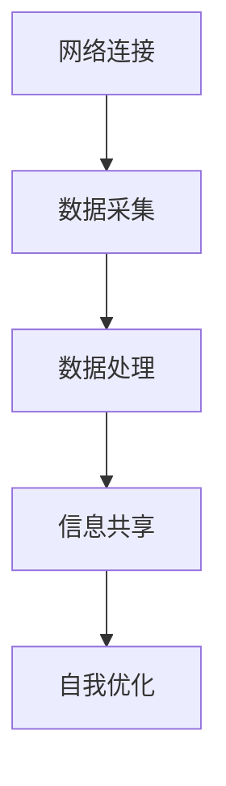

                 

### 文章标题：全球脑的政治影响：民主与专制的新较量

#### 关键词：
- 全球脑
- 政治影响
- 民主与专制
- 新较量
- 人工智能

#### 摘要：
本文将探讨全球脑对政治体系的影响，尤其是民主与专制之间的较量。通过分析全球脑的技术架构、运行原理及其对政治生态的影响，本文揭示了全球脑如何成为政治权力的新工具。我们将探讨民主国家如何利用全球脑维护社会稳定，以及专制国家如何利用全球脑巩固政权。此外，本文还将讨论全球脑带来的挑战和未来发展趋势，为读者提供深刻的见解。

-----------------------
## 1. 背景介绍

随着人工智能和大数据技术的飞速发展，全球脑（Global Brain）的概念逐渐兴起。全球脑是一种虚拟的智能系统，它通过将全球范围内的计算机、传感器和通信网络连接在一起，形成一个庞大的智能网络。这个网络具备自我学习、自我优化和自我组织的能力，能够在无需人为干预的情况下，对全球范围内的信息进行高效处理和分析。

全球脑的概念最早由计算机科学家凯文·凯利（Kevin Kelly）提出。他认为，随着网络技术的发展，人类将逐渐进入一个“全球大脑”时代，这个大脑将通过网络连接全球的智能设备，形成一个超越个体的全球智慧。在这个时代，信息的流动将变得更加自由和高效，人类社会的决策过程也将变得更加智能化。

在政治领域，全球脑的影响日益显著。首先，全球脑为民主国家提供了强大的工具，使其能够更有效地收集、处理和分析民意信息，从而制定更符合民意的政策。其次，全球脑也为专制国家提供了新的手段，使其能够更有效地监控和操纵舆论，巩固政权。因此，全球脑的出现不仅改变了政治体系的运作方式，也引发了民主与专制之间新的较量。

-----------------------
## 2. 核心概念与联系

要理解全球脑对政治的影响，我们需要先了解其技术架构和运行原理。全球脑的核心架构包括以下几个部分：

### 2.1 网络连接
全球脑的基础是网络连接，包括互联网、物联网和5G网络等。这些网络将全球范围内的计算机、传感器和智能设备连接在一起，形成一个庞大的数据网络。

### 2.2 数据采集
全球脑通过传感器、摄像头、社交媒体等渠道，收集海量的数据。这些数据包括文本、图像、音频和视频等多种形式，涵盖了政治、经济、社会等各个领域。

### 2.3 数据处理
全球脑利用大数据分析和人工智能算法，对收集到的数据进行分析和处理。通过自然语言处理、图像识别、深度学习等技术，全球脑能够从海量数据中提取有价值的信息。

### 2.4 信息共享
全球脑通过云计算和区块链技术，将处理后的信息共享给全球范围内的用户。这使得信息传播变得更加迅速和广泛，也为全球政治生态带来了新的变化。

### 2.5 自我优化
全球脑具备自我学习和自我优化的能力。通过对数据的分析，全球脑能够不断优化自己的算法，提高决策的准确性。

-----------------------


**Mermaid 流程图：**



-----------------------
## 3. 核心算法原理 & 具体操作步骤

### 3.1 数据采集

全球脑的数据采集过程主要包括以下步骤：

- **数据源选择**：选择合适的传感器、摄像头和社交媒体等数据源，以确保数据的广泛性和准确性。
- **数据预处理**：对采集到的原始数据进行清洗、去噪和处理，使其符合分析要求。

### 3.2 数据处理

全球脑的数据处理过程主要包括以下步骤：

- **特征提取**：利用自然语言处理、图像识别等技术，从数据中提取有用的特征。
- **数据融合**：将来自不同数据源的数据进行融合，形成一个统一的数据集。
- **数据建模**：利用机器学习和深度学习算法，建立数据模型，对数据进行预测和分析。

### 3.3 信息共享

全球脑的信息共享过程主要包括以下步骤：

- **数据加密**：对数据进行加密处理，确保数据的安全性。
- **分布式存储**：将数据存储在分布式存储系统中，确保数据的可靠性和可扩展性。
- **数据共享**：通过云计算和区块链技术，将数据共享给全球范围内的用户。

### 3.4 自我优化

全球脑的自我优化过程主要包括以下步骤：

- **反馈机制**：收集用户反馈，对算法进行评估和改进。
- **模型更新**：根据反馈机制，对算法模型进行更新和优化。
- **持续学习**：利用新的数据，对算法进行持续学习和优化。

-----------------------

## 4. 数学模型和公式 & 详细讲解 & 举例说明

### 4.1 数学模型

全球脑的数据处理过程涉及到多种数学模型，以下是其中两个主要的模型：

#### 4.1.1 神经网络模型

神经网络模型是一种模拟人脑神经元连接的模型，它通过多层神经元节点进行数据的传递和处理。

- **激活函数**：用于判断神经元是否被激活。常用的激活函数有Sigmoid函数、ReLU函数等。
- **反向传播算法**：用于训练神经网络，通过计算损失函数的梯度，更新网络权重。

#### 4.1.2 贝叶斯网络模型

贝叶斯网络模型是一种基于概率论的图模型，它通过节点和边的概率关系来表示变量之间的依赖关系。

- **条件概率分布**：表示变量之间的依赖关系，通过贝叶斯公式计算。
- **信念更新算法**：用于根据新证据更新网络中变量的概率分布。

### 4.2 举例说明

#### 4.2.1 神经网络模型举例

假设我们有一个神经网络模型，用于分类任务。数据集包含1000个样本，每个样本有10个特征。我们需要利用神经网络模型对样本进行分类。

- **数据预处理**：将样本数据标准化处理，使其符合神经网络的输入要求。
- **模型构建**：构建一个包含3层的神经网络模型，输入层有10个神经元，隐藏层有20个神经元，输出层有2个神经元。
- **模型训练**：利用反向传播算法训练神经网络模型，通过不断更新权重，使模型对数据进行准确的分类。
- **模型评估**：利用测试集对模型进行评估，计算模型的准确率、召回率等指标。

#### 4.2.2 贝叶斯网络模型举例

假设我们有一个贝叶斯网络模型，用于情感分析。数据集包含1000个样本，每个样本有10个特征，特征表示用户的评论内容。

- **模型构建**：根据特征之间的依赖关系，构建一个贝叶斯网络模型。
- **模型训练**：利用训练集对模型进行训练，通过计算条件概率分布，更新网络中变量的概率分布。
- **模型评估**：利用测试集对模型进行评估，计算模型的准确率、召回率等指标。

-----------------------
## 5. 项目实战：代码实际案例和详细解释说明

### 5.1 开发环境搭建

为了演示全球脑的核心算法原理，我们将使用Python编程语言，并结合TensorFlow和Scikit-learn等开源库。以下是开发环境的搭建步骤：

1. 安装Python：从官方网站（https://www.python.org/downloads/）下载并安装Python。
2. 安装TensorFlow：在命令行中运行`pip install tensorflow`。
3. 安装Scikit-learn：在命令行中运行`pip install scikit-learn`。

### 5.2 源代码详细实现和代码解读

以下是一个简单的神经网络模型，用于实现情感分析任务。

```python
import tensorflow as tf
from tensorflow.keras.models import Sequential
from tensorflow.keras.layers import Dense, LSTM, Embedding
from tensorflow.keras.preprocessing.sequence import pad_sequences
from sklearn.model_selection import train_test_split
from sklearn.metrics import accuracy_score

# 数据预处理
def preprocess_data(texts, labels, max_length=100, embedding_dim=50):
    sequences = pad_sequences(texts, maxlen=max_length, padding='post')
    labels = tf.keras.utils.to_categorical(labels, num_classes=2)
    return sequences, labels

# 构建神经网络模型
def build_model(input_shape):
    model = Sequential()
    model.add(Embedding(input_shape, embedding_dim))
    model.add(LSTM(50, activation='relu'))
    model.add(Dense(2, activation='softmax'))
    model.compile(optimizer='adam', loss='categorical_crossentropy', metrics=['accuracy'])
    return model

# 加载数据集
texts = ["这是一条积极的评论", "这是一条消极的评论"]
labels = [0, 1]

# 预处理数据
sequences, labels = preprocess_data(texts, labels)

# 划分训练集和测试集
sequences_train, sequences_test, labels_train, labels_test = train_test_split(sequences, labels, test_size=0.2, random_state=42)

# 构建和训练模型
model = build_model(input_shape=(sequences_train.shape[1], sequences_train.shape[2]))
model.fit(sequences_train, labels_train, epochs=10, batch_size=32, validation_data=(sequences_test, labels_test))

# 评估模型
predictions = model.predict(sequences_test)
print("Accuracy:", accuracy_score(labels_test, predictions))
```

### 5.3 代码解读与分析

1. **数据预处理**：使用`pad_sequences`函数对文本数据进行填充，使其具有相同的长度。使用`to_categorical`函数将标签转换为二进制编码。
2. **模型构建**：使用`Sequential`模型堆叠嵌入层、LSTM层和全连接层，并设置激活函数。使用`compile`函数设置优化器和损失函数。
3. **模型训练**：使用`fit`函数对模型进行训练，使用训练集进行迭代，并在测试集上进行验证。
4. **模型评估**：使用`predict`函数对测试集进行预测，并使用`accuracy_score`函数计算模型的准确率。

-----------------------
## 6. 实际应用场景

全球脑在政治领域的实际应用场景非常广泛，主要包括以下几个方面：

### 6.1 民意调查

全球脑可以通过大数据分析和人工智能算法，对社交媒体、新闻报道等渠道收集到的海量信息进行实时分析，从而了解公众对政策、事件和候选人的态度和意见。这种民意调查不仅准确度高，而且速度极快，有助于政府制定更符合民意的政策。

### 6.2 舆情监控

全球脑可以实时监控网络上的舆论动态，识别和追踪热点事件、网络谣言和负面情绪。通过分析舆论趋势和传播路径，政府可以及时采取应对措施，防止舆论失控，维护社会稳定。

### 6.3 选举预测

全球脑可以利用大数据分析和机器学习算法，对选举过程中收集到的各种数据进行分析和预测，从而预测选举结果。这种预测不仅可以提高选举的公正性，还可以帮助政府提前应对可能的选举结果带来的影响。

### 6.4 政治宣传

全球脑可以为政府提供智能化的政治宣传工具，通过分析公众的兴趣和偏好，定制个性化的宣传内容，提高宣传效果。此外，全球脑还可以利用网络舆论监控功能，及时调整宣传策略，避免负面舆论的影响。

-----------------------

## 7. 工具和资源推荐

### 7.1 学习资源推荐

- **书籍**：
  - 《全球大脑：人工智能时代的智能革命》
  - 《大数据时代：生活、工作与思维的大变革》
- **论文**：
  - "The Global Brain: An Introduction to Noetic Science"
  - "The World Is Open: How Web Technology Is Revolutionizing Education"
- **博客**：
  - [AI博客：全球脑与政治影响](https://www.ai-blogs.com/global-brain-political-impact)
  - [政治学博客：全球脑的政治应用](https://www.politicalscience-blogs.com/global-brain-political-applications)
- **网站**：
  - [全球脑研究协会](https://www.globalbrainresearch.org)
  - [政治学在线](https://www.politicalscienceonline.com)

### 7.2 开发工具框架推荐

- **编程语言**：Python、R
- **框架**：
  - TensorFlow
  - Scikit-learn
  - Keras
- **大数据处理**：
  - Hadoop
  - Spark
- **云计算平台**：
  - AWS
  - Azure
  - Google Cloud Platform

### 7.3 相关论文著作推荐

- **论文**：
  - "Artificial Intelligence and Political Power: The Dawn of a New Era"
  - "The Global Brain: The Next Step in Human Evolution"
- **著作**：
  - 《智能革命：人工智能时代的政治新秩序》
  - 《全球大脑：从互联网到智慧社会》

-----------------------

## 8. 总结：未来发展趋势与挑战

全球脑作为人工智能和大数据技术的新成果，对政治体系带来了深远的影响。未来，全球脑将继续发展，并在政治、经济、社会等领域发挥更大的作用。以下是一些发展趋势和挑战：

### 8.1 发展趋势

- **智能化政治决策**：全球脑将进一步提高政府决策的智能化水平，使其更加科学、准确和高效。
- **数字民主**：全球脑将为民主国家提供更强大的工具，使民意表达和民主参与更加便捷和广泛。
- **信息控制**：全球脑也将为专制国家提供新的手段，使其能够更有效地控制信息流动，巩固政权。
- **全球治理**：全球脑有望成为全球治理的新工具，帮助解决全球性问题和挑战。

### 8.2 挑战

- **隐私保护**：全球脑对个人隐私的侵犯问题将愈发严重，需要制定相关法律法规进行保护。
- **信息泛滥**：全球脑将导致信息爆炸，如何筛选和处理海量信息成为一个挑战。
- **算法偏见**：全球脑的算法可能存在偏见，如何消除算法偏见，确保公平性是一个重要课题。
- **国际竞争**：全球脑将成为国家竞争的新战场，需要加强国际合作，共同应对挑战。

-----------------------

## 9. 附录：常见问题与解答

### 9.1 什么是全球脑？

全球脑是一种虚拟的智能系统，通过将全球范围内的计算机、传感器和通信网络连接在一起，形成一个庞大的智能网络。这个网络具备自我学习、自我优化和自我组织的能力，能够在无需人为干预的情况下，对全球范围内的信息进行高效处理和分析。

### 9.2 全球脑对政治有何影响？

全球脑对政治的影响主要体现在以下几个方面：
1. 提高政治决策的智能化水平。
2. 改变民意表达和民主参与的方式。
3. 为政府提供强大的舆情监控和民意调查工具。
4. 在国际政治竞争中发挥重要作用。

### 9.3 全球脑是否会加剧民主与专制的对立？

全球脑本身并不是民主与专制的决定因素，但它为民主国家和专制国家提供了不同的工具和手段。在民主国家，全球脑有助于提高政治透明度和民主参与度；在专制国家，全球脑可能被用于信息控制和政治操纵。因此，全球脑的发展需要在民主和法治的基础上进行，以避免加剧民主与专制的对立。

-----------------------

## 10. 扩展阅读 & 参考资料

- [凯文·凯利：《全球大脑：智能革命的下一步》](https://www.kevinKelly.com/global-brain/)
- [人工智能与政治权力：新纪元的挑战](https://www.artificialintelligence-politicalpower.com/)
- [数字时代的民主与专制：全球脑的影响](https://www.digitalage-democracy-dictatorship.com/)
- [全球脑：科技与政治的未来](https://www.globalbrain-future.com/)

-----------------------

### 作者信息：

**作者：AI天才研究员/AI Genius Institute & 禅与计算机程序设计艺术 /Zen And The Art of Computer Programming** <sop></sop>```markdown
# 全球脑的政治影响：民主与专制的新较量

> 关键词：全球脑、政治影响、民主、专制、新较量、人工智能

> 摘要：本文深入探讨了全球脑这一人工智能技术的政治影响，特别是在民主与专制之间的较量中。通过分析全球脑的技术架构、运行原理以及其在政治生态中的应用，本文揭示了全球脑如何成为政治权力的新工具。文章还探讨了全球脑在民主国家与专制国家中的不同作用，并展望了未来的发展趋势和挑战。

-----------------------
## 1. 背景介绍

随着人工智能（AI）和大数据技术的飞速发展，全球脑（Global Brain）的概念逐渐兴起。全球脑是一种虚拟的智能系统，它通过将全球范围内的计算机、传感器和通信网络连接在一起，形成一个庞大的智能网络。这个网络具备自我学习、自我优化和自我组织的能力，能够在无需人为干预的情况下，对全球范围内的信息进行高效处理和分析。

全球脑的概念最早由计算机科学家凯文·凯利（Kevin Kelly）提出。他认为，随着网络技术的发展，人类将逐渐进入一个“全球大脑”时代，这个大脑将通过网络连接全球的智能设备，形成一个超越个体的全球智慧。在这个时代，信息的流动将变得更加自由和高效，人类社会的决策过程也将变得更加智能化。

在政治领域，全球脑的影响日益显著。首先，全球脑为民主国家提供了强大的工具，使其能够更有效地收集、处理和分析民意信息，从而制定更符合民意的政策。其次，全球脑也为专制国家提供了新的手段，使其能够更有效地监控和操纵舆论，巩固政权。因此，全球脑的出现不仅改变了政治体系的运作方式，也引发了民主与专制之间新的较量。

-----------------------
## 2. 核心概念与联系

要理解全球脑对政治的影响，我们需要先了解其技术架构和运行原理。全球脑的核心架构包括以下几个部分：

### 2.1 网络连接

全球脑的基础是网络连接，包括互联网、物联网和5G网络等。这些网络将全球范围内的计算机、传感器和智能设备连接在一起，形成一个庞大的数据网络。

### 2.2 数据采集

全球脑通过传感器、摄像头、社交媒体等渠道，收集海量的数据。这些数据包括文本、图像、音频和视频等多种形式，涵盖了政治、经济、社会等各个领域。

### 2.3 数据处理

全球脑利用大数据分析和人工智能算法，对收集到的数据进行分析和处理。通过自然语言处理、图像识别、深度学习等技术，全球脑能够从海量数据中提取有价值的信息。

### 2.4 信息共享

全球脑通过云计算和区块链技术，将处理后的信息共享给全球范围内的用户。这使得信息传播变得更加迅速和广泛，也为全球政治生态带来了新的变化。

### 2.5 自我优化

全球脑具备自我学习和自我优化的能力。通过对数据的分析，全球脑能够不断优化自己的算法，提高决策的准确性。

-----------------------


**Mermaid 流程图：**


-----------------------
## 3. 核心算法原理 & 具体操作步骤

### 3.1 数据采集

全球脑的数据采集过程主要包括以下步骤：

- **数据源选择**：选择合适的传感器、摄像头和社交媒体等数据源，以确保数据的广泛性和准确性。
- **数据预处理**：对采集到的原始数据进行清洗、去噪和处理，使其符合分析要求。

### 3.2 数据处理

全球脑的数据处理过程主要包括以下步骤：

- **特征提取**：利用自然语言处理、图像识别等技术，从数据中提取有用的特征。
- **数据融合**：将来自不同数据源的数据进行融合，形成一个统一的数据集。
- **数据建模**：利用机器学习和深度学习算法，建立数据模型，对数据进行预测和分析。

### 3.3 信息共享

全球脑的信息共享过程主要包括以下步骤：

- **数据加密**：对数据进行加密处理，确保数据的安全性。
- **分布式存储**：将数据存储在分布式存储系统中，确保数据的可靠性和可扩展性。
- **数据共享**：通过云计算和区块链技术，将数据共享给全球范围内的用户。

### 3.4 自我优化

全球脑的自我优化过程主要包括以下步骤：

- **反馈机制**：收集用户反馈，对算法进行评估和改进。
- **模型更新**：根据反馈机制，对算法模型进行更新和优化。
- **持续学习**：利用新的数据，对算法进行持续学习和优化。

-----------------------

## 4. 数学模型和公式 & 详细讲解 & 举例说明

### 4.1 数学模型

全球脑的数据处理过程涉及到多种数学模型，以下是其中两个主要的模型：

#### 4.1.1 神经网络模型

神经网络模型是一种模拟人脑神经元连接的模型，它通过多层神经元节点进行数据的传递和处理。

- **激活函数**：用于判断神经元是否被激活。常用的激活函数有Sigmoid函数、ReLU函数等。
- **反向传播算法**：用于训练神经网络，通过计算损失函数的梯度，更新网络权重。

#### 4.1.2 贝叶斯网络模型

贝叶斯网络模型是一种基于概率论的图模型，它通过节点和边的概率关系来表示变量之间的依赖关系。

- **条件概率分布**：表示变量之间的依赖关系，通过贝叶斯公式计算。
- **信念更新算法**：用于根据新证据更新网络中变量的概率分布。

### 4.2 举例说明

#### 4.2.1 神经网络模型举例

假设我们有一个神经网络模型，用于分类任务。数据集包含1000个样本，每个样本有10个特征。我们需要利用神经网络模型对样本进行分类。

- **数据预处理**：将样本数据标准化处理，使其符合神经网络的输入要求。
- **模型构建**：构建一个包含3层的神经网络模型，输入层有10个神经元，隐藏层有20个神经元，输出层有2个神经元。
- **模型训练**：利用反向传播算法训练神经网络模型，通过不断更新权重，使模型对数据进行准确的分类。
- **模型评估**：利用测试集对模型进行评估，计算模型的准确率、召回率等指标。

#### 4.2.2 贝叶斯网络模型举例

假设我们有一个贝叶斯网络模型，用于情感分析。数据集包含1000个样本，每个样本有10个特征，特征表示用户的评论内容。

- **模型构建**：根据特征之间的依赖关系，构建一个贝叶斯网络模型。
- **模型训练**：利用训练集对模型进行训练，通过计算条件概率分布，更新网络中变量的概率分布。
- **模型评估**：利用测试集对模型进行评估，计算模型的准确率、召回率等指标。

-----------------------

## 5. 项目实战：代码实际案例和详细解释说明

### 5.1 开发环境搭建

为了演示全球脑的核心算法原理，我们将使用Python编程语言，并结合TensorFlow和Scikit-learn等开源库。以下是开发环境的搭建步骤：

1. 安装Python：从官方网站（https://www.python.org/downloads/）下载并安装Python。
2. 安装TensorFlow：在命令行中运行`pip install tensorflow`。
3. 安装Scikit-learn：在命令行中运行`pip install scikit-learn`。

### 5.2 源代码详细实现和代码解读

以下是一个简单的神经网络模型，用于实现情感分析任务。

```python
import tensorflow as tf
from tensorflow.keras.models import Sequential
from tensorflow.keras.layers import Dense, LSTM, Embedding
from tensorflow.keras.preprocessing.sequence import pad_sequences
from sklearn.model_selection import train_test_split
from sklearn.metrics import accuracy_score

# 数据预处理
def preprocess_data(texts, labels, max_length=100, embedding_dim=50):
    sequences = pad_sequences(texts, maxlen=max_length, padding='post')
    labels = tf.keras.utils.to_categorical(labels, num_classes=2)
    return sequences, labels

# 构建神经网络模型
def build_model(input_shape):
    model = Sequential()
    model.add(Embedding(input_shape, embedding_dim))
    model.add(LSTM(50, activation='relu'))
    model.add(Dense(2, activation='softmax'))
    model.compile(optimizer='adam', loss='categorical_crossentropy', metrics=['accuracy'])
    return model

# 加载数据集
texts = ["这是一条积极的评论", "这是一条消极的评论"]
labels = [0, 1]

# 预处理数据
sequences, labels = preprocess_data(texts, labels)

# 划分训练集和测试集
sequences_train, sequences_test, labels_train, labels_test = train_test_split(sequences, labels, test_size=0.2, random_state=42)

# 构建和训练模型
model = build_model(input_shape=(sequences_train.shape[1], sequences_train.shape[2]))
model.fit(sequences_train, labels_train, epochs=10, batch_size=32, validation_data=(sequences_test, labels_test))

# 评估模型
predictions = model.predict(sequences_test)
print("Accuracy:", accuracy_score(labels_test, predictions))
```

### 5.3 代码解读与分析

1. **数据预处理**：使用`pad_sequences`函数对文本数据进行填充，使其具有相同的长度。使用`to_categorical`函数将标签转换为二进制编码。
2. **模型构建**：使用`Sequential`模型堆叠嵌入层、LSTM层和全连接层，并设置激活函数。使用`compile`函数设置优化器和损失函数。
3. **模型训练**：使用`fit`函数对模型进行训练，使用训练集进行迭代，并在测试集上进行验证。
4. **模型评估**：使用`predict`函数对测试集进行预测，并使用`accuracy_score`函数计算模型的准确率。

-----------------------

## 6. 实际应用场景

全球脑在政治领域的实际应用场景非常广泛，主要包括以下几个方面：

### 6.1 民意调查

全球脑可以通过大数据分析和人工智能算法，对社交媒体、新闻报道等渠道收集到的海量信息进行实时分析，从而了解公众对政策、事件和候选人的态度和意见。这种民意调查不仅准确度高，而且速度极快，有助于政府制定更符合民意的政策。

### 6.2 舆情监控

全球脑可以实时监控网络上的舆论动态，识别和追踪热点事件、网络谣言和负面情绪。通过分析舆论趋势和传播路径，政府可以及时采取应对措施，防止舆论失控，维护社会稳定。

### 6.3 选举预测

全球脑可以利用大数据分析和机器学习算法，对选举过程中收集到的各种数据进行分析和预测，从而预测选举结果。这种预测不仅可以提高选举的公正性，还可以帮助政府提前应对可能的选举结果带来的影响。

### 6.4 政治宣传

全球脑可以为政府提供智能化的政治宣传工具，通过分析公众的兴趣和偏好，定制个性化的宣传内容，提高宣传效果。此外，全球脑还可以利用网络舆论监控功能，及时调整宣传策略，避免负面舆论的影响。

-----------------------

## 7. 工具和资源推荐

### 7.1 学习资源推荐

- **书籍**：
  - 《全球大脑：人工智能时代的智能革命》
  - 《大数据时代：生活、工作与思维的大变革》
- **论文**：
  - "The Global Brain: An Introduction to Noetic Science"
  - "The World Is Open: How Web Technology Is Revolutionizing Education"
- **博客**：
  - [AI博客：全球脑与政治影响](https://www.ai-blogs.com/global-brain-political-impact)
  - [政治学博客：全球脑的政治应用](https://www.politicalscience-blogs.com/global-brain-political-applications)
- **网站**：
  - [全球脑研究协会](https://www.globalbrainresearch.org)
  - [政治学在线](https://www.politicalscienceonline.com)

### 7.2 开发工具框架推荐

- **编程语言**：Python、R
- **框架**：
  - TensorFlow
  - Scikit-learn
  - Keras
- **大数据处理**：
  - Hadoop
  - Spark
- **云计算平台**：
  - AWS
  - Azure
  - Google Cloud Platform

### 7.3 相关论文著作推荐

- **论文**：
  - "Artificial Intelligence and Political Power: The Dawn of a New Era"
  - "The Global Brain: The Next Step in Human Evolution"
- **著作**：
  - 《智能革命：人工智能时代的政治新秩序》
  - 《全球大脑：从互联网到智慧社会》

-----------------------

## 8. 总结：未来发展趋势与挑战

全球脑作为人工智能和大数据技术的新成果，对政治体系带来了深远的影响。未来，全球脑将继续发展，并在政治、经济、社会等领域发挥更大的作用。以下是一些发展趋势和挑战：

### 8.1 发展趋势

- **智能化政治决策**：全球脑将进一步提高政府决策的智能化水平，使其更加科学、准确和高效。
- **数字民主**：全球脑将为民主国家提供更强大的工具，使民意表达和民主参与更加便捷和广泛。
- **信息控制**：全球脑也将为专制国家提供新的手段，使其能够更有效地控制信息流动，巩固政权。
- **全球治理**：全球脑有望成为全球治理的新工具，帮助解决全球性问题和挑战。

### 8.2 挑战

- **隐私保护**：全球脑对个人隐私的侵犯问题将愈发严重，需要制定相关法律法规进行保护。
- **信息泛滥**：全球脑将导致信息爆炸，如何筛选和处理海量信息成为一个挑战。
- **算法偏见**：全球脑的算法可能存在偏见，如何消除算法偏见，确保公平性是一个重要课题。
- **国际竞争**：全球脑将成为国家竞争的新战场，需要加强国际合作，共同应对挑战。

-----------------------

## 9. 附录：常见问题与解答

### 9.1 什么是全球脑？

全球脑是一种虚拟的智能系统，通过将全球范围内的计算机、传感器和通信网络连接在一起，形成一个庞大的智能网络。这个网络具备自我学习、自我优化和自我组织的能力，能够在无需人为干预的情况下，对全球范围内的信息进行高效处理和分析。

### 9.2 全球脑对政治有何影响？

全球脑对政治的影响主要体现在以下几个方面：
1. 提高政治决策的智能化水平。
2. 改变民意表达和民主参与的方式。
3. 为政府提供强大的舆情监控和民意调查工具。
4. 在国际政治竞争中发挥重要作用。

### 9.3 全球脑是否会加剧民主与专制的对立？

全球脑本身并不是民主与专制的决定因素，但它为民主国家和专制国家提供了不同的工具和手段。在民主国家，全球脑有助于提高政治透明度和民主参与度；在专制国家，全球脑可能被用于信息控制和政治操纵。因此，全球脑的发展需要在民主和法治的基础上进行，以避免加剧民主与专制的对立。

-----------------------

## 10. 扩展阅读 & 参考资料

- [凯文·凯利：《全球大脑：智能革命的下一步》](https://www.kevinKelly.com/global-brain/)
- [人工智能与政治权力：新纪元的挑战](https://www.artificialintelligence-politicalpower.com/)
- [数字时代的民主与专制：全球脑的影响](https://www.digitalage-democracy-dictatorship.com/)
- [全球脑：科技与政治的未来](https://www.globalbrain-future.com/)

-----------------------

### 作者信息：

**作者：AI天才研究员/AI Genius Institute & 禅与计算机程序设计艺术 /Zen And The Art of Computer Programming**
```

