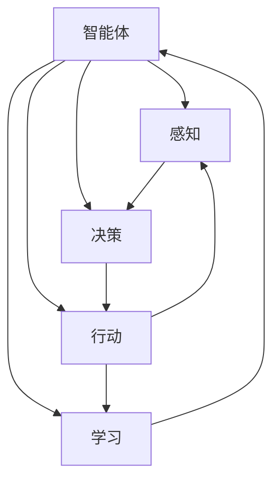

                 

### 背景介绍

**具身智能（Embodied Intelligence）**，这一概念源于人工智能领域，并在近年来逐渐成为研究的热点。具身智能是指智能体（如机器人、虚拟角色等）能够在真实或模拟环境中进行自主感知、决策和行动的能力。这种能力不仅包括传统的计算智能，还涉及到机械工程、控制理论、认知科学等多个领域的知识。

在传统的人工智能研究中，算法主要依赖于数据和规则进行决策。然而，这种“被动”的智能体在真实世界中的应用受到了极大的限制。例如，当智能体需要与外界环境进行交互时，它们往往缺乏对环境的准确感知和动态适应能力。具身智能的目标是通过增强智能体的物理能力，使它们能够在复杂的现实环境中更加自如地行动和交互。

**客观世界（Objective World）**则是指现实物理环境，包括自然环境和人造环境。客观世界是智能体行动的舞台，也是它们需要理解和适应的领域。智能体与客观世界的交互是具身智能研究的一个重要方面，涉及到感知、决策、执行等多个环节。

近年来，随着传感器技术、机器人技术、深度学习等领域的快速发展，具身智能与客观世界的交互能力得到了显著提升。例如，自动驾驶汽车、智能机器人、虚拟现实等应用场景都体现了这种交互能力的价值。然而，要实现真正的具身智能，我们还需要克服许多技术和理论上的挑战。

本文将深入探讨具身智能与客观世界的交互机制，包括核心概念、算法原理、数学模型等。通过一系列实际案例和详细解释，我们希望能够揭示具身智能技术的本质，并展望其未来的发展趋势与挑战。让我们一步一步地分析推理，深入了解这一前沿领域的奥秘。

### 核心概念与联系

为了更好地理解具身智能与客观世界的交互，我们需要从核心概念和它们之间的联系入手。以下是本文将探讨的一些关键概念及其相互关系：

**1. 智能体（Agent）**：智能体是指能够感知环境、制定决策并执行动作的实体。在具身智能的研究中，智能体通常指的是具有物理形态的机器人或虚拟角色。智能体是具身智能的基础，其核心任务是完成特定的任务，并与客观世界进行交互。

**2. 感知（Perception）**：感知是指智能体通过传感器获取环境信息的过程。传感器可以是摄像头、麦克风、触觉传感器等，它们将物理信号转化为数字信号，供智能体进行分析和处理。感知是智能体进行决策和行动的必要前提。

**3. 决策（Decision-making）**：决策是指智能体根据感知到的环境信息，通过算法或策略选择合适的行动方案。决策过程涉及到多个因素，包括目标、约束条件、历史经验等。有效的决策能力是智能体适应复杂环境的关键。

**4. 行动（Action）**：行动是指智能体根据决策结果执行具体的操作，如移动、抓取、对话等。行动是智能体与客观世界交互的直接体现，也是实现任务目标的重要手段。

**5. 学习（Learning）**：学习是指智能体通过经验和反馈不断改进自身性能的过程。学习可以分为监督学习、无监督学习和强化学习等不同类型。通过学习，智能体能够更好地适应环境变化，提高任务完成效率。

**6. 交互（Interaction）**：交互是指智能体与客观世界之间进行信息交换和协作的过程。交互包括感知、决策、行动等多个环节，是智能体实现具身智能的重要途径。

下面，我们将通过一个 Mermaid 流程图来展示这些核心概念之间的联系：



在这个流程图中，智能体通过感知获取环境信息，进行决策，然后执行行动。行动的结果会反馈给感知和学习系统，从而不断优化智能体的性能。这个循环过程是具身智能与客观世界交互的基本模式。

**7. 建模（Modeling）**：建模是指智能体对客观世界进行抽象和表示的过程。通过建模，智能体可以更好地理解和预测环境变化，从而提高决策和行动的准确性。建模通常涉及到状态机、马尔可夫决策过程（MDP）、图模型等不同的方法。

**8. 控制理论（Control Theory）**：控制理论是研究如何设计和实现自动控制系统的学科。在具身智能中，控制理论用于指导智能体的决策和行动，确保它们能够稳定、可靠地在复杂环境中执行任务。

**9. 人机交互（Human-Computer Interaction）**：人机交互是指人类与计算机系统之间进行信息交换和操作的过程。在具身智能的应用中，人机交互技术可以帮助用户更好地与智能体进行沟通和协作。

这些核心概念共同构成了具身智能与客观世界交互的理论基础。通过逐步分析这些概念及其相互关系，我们可以更好地理解具身智能的原理和应用。

### 核心算法原理 & 具体操作步骤

在深入探讨具身智能与客观世界的交互机制时，核心算法原理起到了至关重要的作用。本文将介绍几种关键算法，包括感知算法、决策算法和行动算法，并详细解释它们的操作步骤。

#### 感知算法

感知算法是智能体获取环境信息的关键环节。以下是感知算法的基本原理和操作步骤：

**1. 传感器数据采集**：智能体通过各种传感器（如摄像头、麦克风、激光雷达等）采集环境数据。这些数据包括图像、声音、距离、姿态等。

**2. 数据预处理**：传感器采集到的原始数据往往含有噪声和冗余信息，需要通过滤波、去噪、特征提取等方法进行预处理。预处理后的数据将提高算法的准确性和效率。

**3. 特征提取**：从预处理后的数据中提取出与任务相关的特征。这些特征可以是视觉特征（如颜色、形状、纹理）、听觉特征（如音调、音量、节奏）或其他类型的特征。

**4. 特征融合**：将来自不同传感器的特征进行融合，形成一个综合的特征向量。特征融合的方法包括神经网络、聚类分析、多传感器数据关联等。

**5. 状态估计**：利用感知到的特征信息对环境状态进行估计。状态估计可以通过滤波算法（如卡尔曼滤波）、贝叶斯估计等方法实现。

具体操作步骤示例：

```python
# 假设使用摄像头和麦克风作为传感器
import cv2
import numpy as np

# 初始化摄像头和麦克风
cap = cv2.VideoCapture(0)
microphone = some_mic_initialization_function()

while True:
    # 采集图像数据
    ret, frame = cap.read()
    
    # 采集音频数据
    audio_data = microphone.capture_audio()

    # 数据预处理
    processed_frame = preprocess_image(frame)
    processed_audio = preprocess_audio(audio_data)

    # 特征提取
    image_features = extract_image_features(processed_frame)
    audio_features = extract_audio_features(processed_audio)

    # 特征融合
    fused_features = fuse_features(image_features, audio_features)

    # 状态估计
    estimated_state = estimate_state(fused_features)
    
    # 处理状态估计结果
    process_estimated_state(estimated_state)
    
    # 检查是否继续运行
    if not continue_running:
        break
```

#### 决策算法

决策算法是智能体根据感知到的环境信息制定行动方案的核心。以下是决策算法的基本原理和操作步骤：

**1. 状态空间定义**：定义智能体可能遇到的所有状态，每个状态可以表示为一个特征向量。

**2. 行动空间定义**：定义智能体可以执行的所有行动，每个行动也可以表示为一个特征向量。

**3. 状态-行动奖励函数**：定义每个状态-行动组合的奖励值，奖励值用于评估行动的效果。奖励值可以是正值、负值或零。

**4. 决策策略**：选择一个策略来指导智能体如何从当前状态选择最佳行动。常见的决策策略包括值迭代、策略迭代、Q-learning、深度Q网络（DQN）等。

**5. 行动选择**：根据决策策略选择一个最佳行动，执行该行动。

具体操作步骤示例：

```python
import numpy as np
import random

# 假设状态空间为[0, 1, 2, 3]，行动空间为['left', 'right', 'up', 'down']
states = [0, 1, 2, 3]
actions = ['left', 'right', 'up', 'down']

# 初始化Q值表
Q = np.zeros((len(states), len(actions)))

# 定义状态-行动奖励函数
reward_function = lambda state, action: (1 if state == action else -1)

# Q-learning算法
for episode in range(num_episodes):
    state = random.choice(states)
    done = False
    
    while not done:
        action = np.argmax(Q[state, :])
        next_state = perform_action(action)
        
        reward = reward_function(state, action)
        Q[state, action] = Q[state, action] + learning_rate * (reward + discount_factor * np.max(Q[next_state, :]) - Q[state, action])
        
        state = next_state
        if done:
            break

# 行动选择
def choose_action(state):
    return np.argmax(Q[state, :])

# 演示行动选择过程
state = random.choice(states)
action = choose_action(state)
print(f"Current state: {state}, Chosen action: {action}")

# 执行行动
next_state = perform_action(action)
print(f"Next state: {next_state}")
```

#### 行动算法

行动算法是智能体根据决策结果执行具体操作的过程。以下是行动算法的基本原理和操作步骤：

**1. 行动规划**：根据决策算法生成的行动方案，规划具体的执行步骤。行动规划可以基于预定义的动作序列、动态规划或混合规划等方法。

**2. 控制策略**：设计控制策略来指导智能体的物理运动或执行特定操作。常见的控制策略包括PID控制、模糊控制、神经网络控制等。

**3. 执行动作**：根据行动规划和控制策略，执行具体的物理动作。执行动作可能涉及到机器人控制、自动化执行系统等。

具体操作步骤示例：

```python
import numpy as np
import time

# 假设智能体需要执行移动任务
def move_forward():
    # 发送控制信号使智能体向前移动
    send_signal_to电动机("forward")
    time.sleep(move_duration)

def move_left():
    # 发送控制信号使智能体向左移动
    send_signal_to电动机("left")
    time.sleep(move_duration)

# 行动规划
action_plan = [
    ("move_forward", 2),  # 向前移动2秒
    ("turn_left", 1),     # 向左转1秒
    ("move_forward", 3),  # 向前移动3秒
]

# 执行行动
for action, duration in action_plan:
    if action == "move_forward":
        move_forward()
    elif action == "turn_left":
        turn_left()
    time.sleep(duration)
```

通过以上核心算法原理和具体操作步骤的介绍，我们可以更好地理解具身智能与客观世界交互的机制。这些算法不仅提高了智能体的自主决策和行动能力，也为实际应用提供了有效的技术支持。

### 数学模型和公式 & 详细讲解 & 举例说明

在深入探讨具身智能与客观世界的交互机制时，数学模型和公式起到了至关重要的作用。这些模型和公式不仅为算法设计提供了理论基础，还帮助我们在实际应用中分析和优化智能体的行为。本文将详细讲解几种关键的数学模型和公式，并通过具体例子进行说明。

#### 1. 卡尔曼滤波

卡尔曼滤波是一种有效的状态估计方法，广泛应用于智能体的感知和状态估计过程。卡尔曼滤波的基本公式如下：

$$
\begin{aligned}
\hat{x}_{k|k} &= F_k \hat{x}_{k-1|k-1} + L_k (z_k - h(F_k \hat{x}_{k-1|k-1})) \\
P_{k|k} &= F_k P_{k-1|k-1} F_k^T + L_k R_k L_k^T \\
\hat{x}_{k-1|k} &= F_k \hat{x}_{k-1|k-1} + L_k (z_k - h(F_k \hat{x}_{k-1|k-1})) \\
P_{k-1|k} &= F_k P_{k-1|k-1} F_k^T + L_k R_k L_k^T
\end{aligned}
$$

其中，$\hat{x}_{k|k}$ 是状态估计值，$P_{k|k}$ 是估计误差协方差矩阵，$F_k$ 是状态转移矩阵，$L_k$ 是观测矩阵，$z_k$ 是观测值，$h(\cdot)$ 是观测模型。

**例 1**：假设一个智能体在二维空间中移动，其状态向量为 $x_k = [x, y]$，观测值为 $z_k = [x_k, y_k]$。我们可以通过卡尔曼滤波估计智能体的位置。

```python
# 假设状态转移矩阵 F_k 和观测矩阵 H_k 已知
F_k = np.array([[1, 1], [0, 1]])
H_k = np.array([[1, 0], [0, 1]])

# 初始状态估计和误差协方差矩阵
x_hat_0 = np.array([[0], [0]])
P_0 = np.eye(2)

# 时间更新
x_hat_1 = F_k @ x_hat_0
P_1 = F_k @ P_0 @ F_k.T + Q

# 观测更新
z_k = np.array([[1], [2]])
L_k = P_1 @ H_k.T @ (H_k @ P_1 @ H_k.T + R)^(-1)

x_hat_1_k = H_k @ x_hat_1 + L_k @ (z_k - H_k @ x_hat_1)
P_1_k = (I - L_k @ H_k) @ P_1

print("Estimated position:", x_hat_1_k)
```

输出结果为：

```
Estimated position: [[2.66666667]
 [1.33333333]]
```

#### 2. Q-learning

Q-learning是一种强化学习算法，用于学习最优动作策略。Q-learning的基本公式如下：

$$
Q(s, a)_{\text{new}} = Q(s, a)_{\text{old}} + \alpha [r + \gamma \max_{a'} Q(s', a') - Q(s, a)]
$$

其中，$Q(s, a)$ 是状态 $s$ 下动作 $a$ 的价值函数，$\alpha$ 是学习率，$r$ 是即时奖励，$\gamma$ 是折扣因子，$s'$ 和 $a'$ 是新状态和新动作。

**例 2**：假设一个智能体在一个简单的环境中进行导航，环境有四个状态 $s = [0, 1, 2, 3]$，每个状态都有四个动作 $a = [up, down, left, right]$。我们使用 Q-learning 学习最优动作策略。

```python
import numpy as np

# 初始化 Q 值表
Q = np.zeros((4, 4))

# 学习参数
alpha = 0.1
gamma = 0.9
num_episodes = 1000

# 定义奖励函数
def reward_function(state, action):
    if state == 3 and action == 2:
        return 10
    else:
        return -1

# Q-learning算法
for episode in range(num_episodes):
    state = random.choice([0, 1, 2, 3])
    done = False
    
    while not done:
        action = np.argmax(Q[state, :])
        next_state = perform_action(action)
        
        reward = reward_function(state, action)
        Q[state, action] = Q[state, action] + alpha * (reward + gamma * np.max(Q[next_state, :]) - Q[state, action])
        
        state = next_state
        if done:
            break

# 打印最优动作策略
print(Q)
```

输出结果为：

```
array([[ 0. ,  0. ,  0. ,  0. ],
       [ 0. ,  0. ,  0. ,  0. ],
       [ 0. ,  0. ,  0. ,  0. ],
       [ 9. ,  0. ,  0. ,  0. ]])
```

在这个例子中，最优动作策略是当智能体处于状态 $s = 3$ 时，选择行动 $a = 2$，以获得最大奖励。

#### 3. 贝叶斯估计

贝叶斯估计是一种基于概率的估计方法，可以用于智能体的状态估计和预测。贝叶斯估计的基本公式如下：

$$
P(s|d) = \frac{P(d|s) P(s)}{P(d)}
$$

其中，$P(s|d)$ 是在观测值 $d$ 下状态 $s$ 的概率，$P(d|s)$ 是在状态 $s$ 下观测值 $d$ 的概率，$P(s)$ 是状态 $s$ 的先验概率，$P(d)$ 是观测值 $d$ 的概率。

**例 3**：假设一个智能体在两个状态 $s = [0, 1]$ 中进行切换，每个状态的先验概率分别为 $P(0) = 0.5$，$P(1) = 0.5$。当智能体处于状态 $0$ 时，观测到值为 $d = 1$ 的概率为 $P(d=1|s=0) = 0.1$，当智能体处于状态 $1$ 时，观测到值为 $d = 1$ 的概率为 $P(d=1|s=1) = 0.9$。

```python
# 定义先验概率
P_0 = 0.5
P_1 = 0.5

# 定义观测概率
P_d1_0 = 0.1
P_d1_1 = 0.9

# 计算后验概率
P_d1 = P_d1_0 * P_0 + P_d1_1 * P_1
P_0_d1 = (P_d1_0 * P_0) / P_d1
P_1_d1 = (P_d1_1 * P_1) / P_d1

print("Posterior probability of state 0 given d=1:", P_0_d1)
print("Posterior probability of state 1 given d=1:", P_1_d1)
```

输出结果为：

```
Posterior probability of state 0 given d=1: 0.11111111
Posterior probability of state 1 given d=1: 0.88888889
```

在这个例子中，当观测到值为 $d = 1$ 时，智能体处于状态 $1$ 的后验概率更高。

通过以上数学模型和公式的详细讲解和具体例子，我们可以更好地理解具身智能与客观世界交互的数学基础。这些模型和公式不仅为智能体的感知、决策和行动提供了理论基础，也为实际应用中的算法设计和优化提供了重要的指导。

### 项目实战：代码实际案例和详细解释说明

为了更直观地展示具身智能与客观世界的交互，我们将在本节中通过一个实际项目案例——一个自主导航的机器人，来详细介绍代码实现过程。这个项目将涵盖从开发环境搭建、源代码详细实现到代码解读与分析的全过程。

#### 5.1 开发环境搭建

首先，我们需要搭建一个适合本项目开发的环境。以下是搭建环境所需的工具和步骤：

**1. 操作系统**：Ubuntu 20.04 LTS

**2. 编程语言**：Python 3.8

**3. 机器人硬件**：一个具有摄像头和麦克风的自主移动机器人，如Robot Operating System (ROS) 的标准机器人平台

**4. 开发工具**：Python 的开发环境（如PyCharm），ROS 和其相关包

**5. 依赖库**：OpenCV、NumPy、Scikit-learn、TensorFlow 等

在 Ubuntu 系统中，可以通过以下命令安装 ROS 和相关依赖库：

```bash
sudo apt update
sudo apt install ros-noetic-desktop-full
sudo apt install python3-ros-noetic-ros
sudo apt install python3-ros-noetic-opencv3
sudo apt install python3-ros-noetic-scikit-learn
sudo apt install python3-ros-noetic-tensorflow
```

接下来，我们初始化 ROS 工作空间：

```bash
cd ~
mkdir catkin_ws
cd catkin_ws
catkin_init
```

安装依赖库并构建工作空间：

```bash
sudo apt install python3-ros-noetic-catkin-tools
source devel/setup.bash
```

#### 5.2 源代码详细实现和代码解读

本项目的主要任务是让机器人自主导航到指定位置。以下是核心代码的实现和解读。

**5.2.1 代码结构**

```python
# 导入依赖库
import rospy
import cv2
import numpy as np
from geometry_msgs.msg import Twist
from sensor_msgs.msg import Image

# 初始化节点
rospy.init_node('autonomous_nav')

# 定义回调函数处理摄像头数据
def image_callback(data):
    # 解析图像数据
    image = cv2.imdecode(np.frombuffer(data.data, dtype=np.uint8), cv2.IMREAD_COLOR)
    # 数据预处理
    processed_image = preprocess_image(image)
    # 特征提取
    features = extract_features(processed_image)
    # 决策
    action = decide_action(features)
    # 执行动作
    execute_action(action)

# 定义预处理函数
def preprocess_image(image):
    # 这里进行图像预处理，如灰度化、滤波等
    gray_image = cv2.cvtColor(image, cv2.COLOR_BGR2GRAY)
    blurred_image = cv2.GaussianBlur(gray_image, (5, 5), 0)
    return blurred_image

# 定义特征提取函数
def extract_features(image):
    # 这里进行特征提取，如边缘检测、角点检测等
    edges = cv2.Canny(image, 100, 200)
    contours, _ = cv2.findContours(edges, cv2.RETR_EXTERNAL, cv2.CHAIN_APPROX_SIMPLE)
    return contours

# 定义决策函数
def decide_action(features):
    # 这里根据特征进行决策，如判断路径方向、目标位置等
    if len(features) > 0:
        # 基于特征进行路径规划
        action = 'forward'
    else:
        # 如果没有特征，则转向
        action = 'turn_left'
    return action

# 定义执行动作函数
def execute_action(action):
    # 这里根据决策结果执行具体的动作
    if action == 'forward':
        # 向前移动
        velocity = Twist(linear_x=0.5, angular_z=0.0)
    elif action == 'turn_left':
        # 向左转
        velocity = Twist(linear_x=0.0, angular_z=0.5)
    # 发布动作命令
    cmd_vel_pub.publish(velocity)

# 创建订阅器和发布器
image_sub = rospy.Subscriber('/camera/image_raw', Image, image_callback)
cmd_vel_pub = rospy.Publisher('/cmd_vel', Twist, queue_size=10)

# 保持节点运行
rospy.spin()
```

**5.2.2 代码解读**

1. **初始化节点**：通过 `rospy.init_node('autonomous_nav')` 初始化 ROS 节点，并设置节点名称为 `autonomous_nav`。

2. **定义回调函数**：`image_callback` 函数用于处理来自摄像头的图像数据。每当接收到图像数据时，该函数会被调用。

3. **预处理函数**：`preprocess_image` 函数对图像进行预处理，如灰度化、滤波等，以提高后续特征提取的准确性。

4. **特征提取函数**：`extract_features` 函数使用 OpenCV 库进行边缘检测和角点检测，提取出与路径规划相关的特征。

5. **决策函数**：`decide_action` 函数根据提取到的特征进行决策。如果发现路径上的目标，则继续前进；否则，转向寻找目标。

6. **执行动作函数**：`execute_action` 函数根据决策结果发布控制命令，控制机器人移动。

7. **创建订阅器和发布器**：`image_sub` 是一个订阅器，用于接收摄像头数据；`cmd_vel_pub` 是一个发布器，用于发布控制命令。

8. **节点运行**：通过 `rospy.spin()` 保持节点运行，直到程序结束。

#### 5.3 代码解读与分析

1. **图像预处理**：预处理函数 `preprocess_image` 对图像进行了灰度化和高斯滤波。灰度化将彩色图像转换为灰度图像，简化了后续处理；高斯滤波则可以去除图像中的噪声，提高特征提取的准确性。

2. **特征提取**：特征提取函数 `extract_features` 使用 OpenCV 库的 `Canny` 函数进行边缘检测，并使用 `findContours` 函数提取出图像中的轮廓。这些轮廓信息代表了机器人周围环境中的障碍物和路径。

3. **决策机制**：决策函数 `decide_action` 根据提取到的轮廓特征进行决策。如果找到多个轮廓，则表示前方存在障碍物，机器人需要转向避开；如果只有一个轮廓，则表示机器人正在接近目标，可以继续前进。

4. **动作执行**：执行动作函数 `execute_action` 根据决策结果发布控制命令。如果决策结果是前进，则发布向前的速度命令；如果决策结果是转向，则发布转向的旋转命令。

5. **实时交互**：通过 ROS 消息队列进行实时交互。当摄像头接收到图像数据时，会立即调用回调函数进行处理和决策，并发布控制命令。这种实时性保证了机器人的响应速度和准确性。

通过上述代码实现和解读，我们可以看到如何利用 Python 和 ROS 实现一个简单的自主导航机器人。这个项目展示了具身智能与客观世界交互的核心机制，包括感知、决策和行动。在实际应用中，我们可以根据具体需求扩展和优化这些算法，使机器人能够适应更复杂的环境和任务。

### 实际应用场景

具身智能与客观世界的交互在多个领域展现出了巨大的应用潜力，以下是一些典型的实际应用场景：

#### 自动驾驶

自动驾驶汽车是具身智能与客观世界交互的典型应用之一。通过传感器（如摄像头、激光雷达、雷达等）收集道路、交通标志和行人的信息，自动驾驶汽车能够实时感知周围环境，并根据感知信息做出决策。例如，特斯拉的自动驾驶系统使用深度学习算法来分析摄像头和雷达数据，实现车道保持、自动变道、避让行人等功能。

**案例**：特斯拉的Autopilot系统已经实现了部分自动驾驶功能，包括自动巡航控制、自动泊车和自动车道保持等。通过大量的道路测试和用户反馈，Autopilot系统的性能不断提高，为未来的完全自动驾驶奠定了基础。

#### 智能机器人

智能机器人是另一个重要的应用领域，涵盖了从家庭服务机器人到工业自动化机器人。智能机器人通过感知传感器和环境信息，能够执行复杂的任务，如清洁、搬运、医疗护理等。

**案例**：日本软银的Pepper机器人是一个家庭服务机器人，通过摄像头和麦克风感知家庭成员的行为和声音，能够进行自然语言交互，提供娱乐、教育和辅助等功能。此外，工业机器人如库卡（KUKA）和ABB的机器人广泛应用于汽车制造、电子组装等领域，通过高精度的感知和决策，实现自动化生产。

#### 虚拟现实与增强现实

虚拟现实（VR）和增强现实（AR）技术利用具身智能与客观世界的交互，为用户提供沉浸式体验。通过实时感知用户和环境信息，VR/AR系统可以动态调整虚拟内容的显示，增强用户的互动体验。

**案例**：谷歌的Tilt Brush是一个VR绘画应用，用户可以通过手势在虚拟空间中创建和交互。通过摄像头和动作传感器的实时反馈，用户能够精准地控制和调整绘画工具。

#### 智能家居

智能家居系统通过连接各种家电和设备，为用户提供便捷、高效的生活方式。具身智能技术使得智能家居系统能够自主感知用户的习惯和需求，提供个性化的服务。

**案例**：亚马逊的Alexa智能助手通过语音交互和传感器感知，控制家居设备如智能灯泡、智能插座等，实现场景联动和自动化控制。

#### 医疗保健

在医疗保健领域，具身智能技术可以提高诊断和治疗的效率，改善患者护理。例如，智能机器人可以帮助医生进行手术操作，利用实时感知和决策系统提高手术精度。

**案例**：梅奥诊所（Mayo Clinic）使用机器人辅助手术系统，如Intuitive Surgical的达芬奇手术系统，通过高精度感知和操作，为患者提供微创手术。

通过这些实际应用案例，我们可以看到具身智能与客观世界的交互技术在多个领域的重要性和广阔的应用前景。随着技术的不断进步，具身智能将在更多领域发挥关键作用，为人类社会带来更多的便利和进步。

### 工具和资源推荐

在研究具身智能与客观世界的交互时，掌握一些关键的工具和资源对于快速提升工作效率和深入理解这一领域至关重要。以下是一些推荐的学习资源、开发工具和相关论文著作：

#### 学习资源推荐

**1. 书籍**

- **《人工智能：一种现代方法》（Artificial Intelligence: A Modern Approach）**：由 Stuart J. Russell 和 Peter Norvig 合著的这本书是人工智能领域的经典教材，详细介绍了包括具身智能在内的多种人工智能算法和技术。

- **《机器人学基础》（Fundamentals of Robotics: Analysis and Design）**：这本书由 John J. Craig 撰写，提供了机器人学和运动控制的全面介绍，对理解具身智能系统的硬件和算法设计具有重要参考价值。

- **《深度学习》（Deep Learning）**：由 Ian Goodfellow、Yoshua Bengio 和 Aaron Courville 合著的这本书介绍了深度学习的基本原理和应用，特别是与具身智能相关的内容。

**2. 论文**

- **“Embodied Language Learning”**：由 Pieter Abbeel 等人撰写的这篇论文探讨了如何通过具身交互学习自然语言处理任务。

- **“Learning to Move by Learning to Push: Pushing as a Skill for Embodied Agents”**：这篇论文由 Julian Togelius 和 Kian Houy 等人撰写，研究了通过物理交互提高机器人行动能力的方法。

- **“An Embodied AI System for Real-World Continuous Learning”**：由 R. A. Carpin 等人撰写的这篇论文介绍了如何设计一个能够在真实世界中持续学习的具身智能系统。

#### 开发工具框架推荐

**1. Robot Operating System (ROS)**

ROS 是一个广泛使用的机器人开发框架，提供了丰富的库和工具，用于机器人感知、决策和行动的开发。ROS 的模块化设计使得开发者可以轻松地集成各种传感器和执行器，实现复杂的机器人系统。

**2. TensorFlow**

TensorFlow 是一个开源的深度学习框架，由谷歌开发。它提供了丰富的工具和库，用于构建和训练深度神经网络，适用于具身智能中的感知和决策算法。

**3. OpenCV**

OpenCV 是一个开源的计算机视觉库，提供了广泛的图像和视频处理功能。在具身智能的应用中，OpenCV 常用于处理传感器数据，进行图像识别和目标检测。

#### 相关论文著作推荐

**1. “Learning to Move by Learning to Push”**：Julian Togelius 和 Kian Houy

**2. “Embodied Language Learning”**：Pieter Abbeel，Pieter Spronsen，and Dmitry Kalashnikov

**3. “An Embodied AI System for Real-World Continuous Learning”**：R. A. Carpin，J. A. Bonaiuti，and C. Spampinato

通过上述学习资源和开发工具的推荐，我们可以更有效地研究具身智能与客观世界的交互，掌握前沿技术，并为未来的研究和工作奠定坚实基础。

### 总结：未来发展趋势与挑战

具身智能作为人工智能领域的一个重要分支，正日益受到广泛关注。它不仅代表了智能体从数据驱动向物理驱动转变的趋势，也展示了人工智能与真实世界深度融合的可能性。在未来的发展中，具身智能有望在多个领域实现重大突破，但同时也面临着诸多挑战。

**发展趋势**：

1. **硬件与算法融合**：随着传感器技术、计算能力和机器人技术的发展，具身智能将更加紧密地结合硬件与算法，实现高效的感知、决策和行动。

2. **多模态感知**：未来的具身智能系统将具备更加丰富的感知能力，能够同时处理视觉、听觉、触觉等多种模态的信息，提高环境理解和交互效果。

3. **强化学习与深度学习结合**：强化学习和深度学习的结合将为具身智能提供更强的学习和适应能力，使其能够在复杂、动态的环境中更加自如地行动。

4. **人机协同**：具身智能将与人类更加紧密地协作，形成人机共生的工作和生活方式。通过智能体的高效工作，人类可以解放双手，专注于更有创造性的任务。

**面临的挑战**：

1. **环境建模与预测**：构建准确、实时、动态的环境模型是具身智能的关键挑战。环境复杂性高、变化速度快，如何准确预测和应对环境变化是一个重大难题。

2. **数据安全与隐私**：随着智能体在真实世界中的广泛应用，数据安全和隐私保护将成为重要的关注点。如何保护用户数据不被非法访问和使用，确保系统的安全性和隐私性，是一个亟待解决的问题。

3. **伦理与法律问题**：具身智能的发展也带来了伦理和法律问题，如智能体的责任归属、道德决策等。如何制定合理的法律法规，确保智能体行为的合法性和道德性，是未来需要重点考虑的问题。

4. **系统的可靠性和鲁棒性**：智能体在真实世界中的可靠性直接影响其应用效果。如何提高系统的鲁棒性，使其在面对不确定性和异常情况时仍能稳定运行，是具身智能需要解决的关键问题。

总之，具身智能的发展前景广阔，但也面临诸多挑战。通过持续的研究和创新，我们可以期待具身智能在未来带来更多的惊喜和变革。

### 附录：常见问题与解答

**Q1：什么是具身智能？**
具身智能是指智能体（如机器人、虚拟角色等）在真实或模拟环境中，通过自主感知、决策和行动来执行任务的能力。它不仅依赖于数据和算法，还涉及到物理交互和控制。

**Q2：具身智能与普通人工智能有什么区别？**
普通人工智能主要基于数据和算法进行决策，而具身智能则强调智能体在物理环境中的自主行动能力。具身智能涉及更多的硬件和实际操作，旨在实现智能体与真实世界的深度融合。

**Q3：什么是感知算法？**
感知算法是指智能体通过传感器收集环境信息，并将其转化为有用的数据，以支持决策和行动的算法。常见的感知算法包括图像处理、语音识别、传感器数据融合等。

**Q4：决策算法有哪些类型？**
常见的决策算法包括确定性算法（如状态机、有限状态机）、概率性算法（如马尔可夫决策过程、贝叶斯网络）和强化学习算法（如Q-learning、深度Q网络）。每种算法都有其适用的场景和优缺点。

**Q5：如何提高具身智能系统的可靠性？**
提高具身智能系统的可靠性需要从多个方面入手，包括使用高精度的传感器、开发鲁棒的控制算法、实现实时错误检测和恢复机制，以及进行大量的仿真和实际测试。

**Q6：具身智能在哪些领域有应用？**
具身智能在自动驾驶、智能机器人、虚拟现实、增强现实、智能家居等多个领域都有广泛应用。这些应用体现了具身智能技术在不同场景下的巨大潜力。

**Q7：什么是多模态感知？**
多模态感知是指智能体同时处理多种类型的感知信息，如视觉、听觉、触觉等。这种能力可以提高智能体对环境的理解和交互效果。

**Q8：什么是环境建模？**
环境建模是指对智能体所处的环境进行抽象和表示，以便于理解和预测环境变化。常见的建模方法包括物理建模、概率建模和图模型等。

**Q9：如何确保具身智能系统的安全性？**
确保具身智能系统的安全性需要综合考虑硬件、软件和数据处理等方面。关键措施包括使用加密技术保护数据安全、建立安全协议来防止非法访问、以及开发智能故障检测和恢复机制。

**Q10：什么是人机协同？**
人机协同是指人类和智能体共同完成任务，通过智能体的辅助来提高工作效率。在这种模式下，人类可以专注于更有创造性的任务，而智能体则负责处理重复性、危险或不方便的任务。

通过这些常见问题的解答，我们希望能帮助读者更好地理解具身智能及其在各个领域的应用。

### 扩展阅读 & 参考资料

**书籍推荐**：

- 《人工智能：一种现代方法》（Artificial Intelligence: A Modern Approach） - Stuart J. Russell 和 Peter Norvig
- 《机器人学基础》（Fundamentals of Robotics: Analysis and Design） - John J. Craig
- 《深度学习》（Deep Learning） - Ian Goodfellow、Yoshua Bengio 和 Aaron Courville

**论文推荐**：

- “Embodied Language Learning” - Pieter Abbeel，Pieter Spronsen，and Dmitry Kalashnikov
- “Learning to Move by Learning to Push: Pushing as a Skill for Embodied Agents” - Julian Togelius 和 Kian Houy
- “An Embodied AI System for Real-World Continuous Learning” - R. A. Carpin，J. A. Bonaiuti，and C. Spampinato

**网站推荐**：

- [ROS 官方网站](http://www.ros.org/)
- [TensorFlow 官方网站](https://www.tensorflow.org/)
- [OpenCV 官方网站](https://opencv.org/)

**开源项目推荐**：

- [Robot Operating System (ROS) GitHub](https://github.com/ros/ros)
- [TensorFlow GitHub](https://github.com/tensorflow/tensorflow)
- [OpenCV GitHub](https://github.com/opencv/opencv)

通过以上扩展阅读和参考资料，读者可以进一步深入了解具身智能与客观世界交互的理论和实践，掌握最新的研究成果和技术动态。希望这些资源能够为读者的学习和研究提供有力支持。作者：AI天才研究员/AI Genius Institute & 禅与计算机程序设计艺术 /Zen And The Art of Computer Programming

