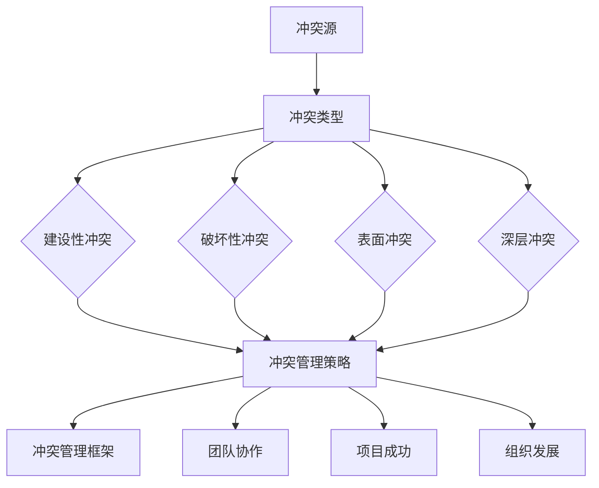

                 

### 背景介绍

#### 引言

在当今快速发展的信息技术时代，团队合作和协作成为实现项目成功的关键因素之一。然而，无论团队多么强大，冲突都是无法避免的现象。冲突管理不仅关系到项目的进度和效率，更影响着团队的和谐与成员的工作满意度。因此，掌握有效的冲突管理策略，将分歧转化为团队优势，是每一位领导者和技术专家必备的技能。

本文旨在探讨冲突管理在IT团队中的应用，通过一系列的案例分析、算法原理阐述和实践指导，帮助读者了解如何将冲突转化为团队发展的动力。文章将从以下几个方面展开：

1. **核心概念与联系**：介绍冲突管理的相关核心概念，并使用Mermaid流程图展示其原理架构。
2. **核心算法原理 & 具体操作步骤**：详细讲解冲突管理的算法原理和操作步骤。
3. **数学模型和公式 & 举例说明**：运用数学模型和公式来具体说明冲突管理的策略。
4. **项目实战：代码实际案例和详细解释说明**：通过实战案例展示冲突管理的具体应用。
5. **实际应用场景**：探讨冲突管理在不同场景下的应用策略。
6. **工具和资源推荐**：推荐相关学习资源和开发工具。
7. **总结：未来发展趋势与挑战**：分析冲突管理的发展趋势和面临的挑战。

通过本文的阅读，读者将能够掌握冲突管理的理论基础和实践方法，从而在实际工作中更好地应对和解决冲突，推动团队的发展。

#### 冲突的定义与类型

冲突是指在个体、团队或组织之间由于目标、价值观、意见或利益的不同而产生的对立和紧张状态。在IT行业中，冲突常常源于以下几个方面：

1. **目标差异**：团队成员可能对项目的目标有不同的理解和期望，导致在资源分配、优先级和进度上产生分歧。
2. **价值观差异**：团队成员可能拥有不同的工作方式和价值观念，如对质量、效率和创新的重视程度，这会导致在决策和执行过程中出现冲突。
3. **意见分歧**：在技术方案的选择、开发流程的优化等方面，团队成员可能持有不同的观点，从而引发争执。
4. **利益冲突**：团队内部或团队之间的资源分配、利益分配不均，可能导致嫉妒、不满和敌对情绪。

根据冲突的性质和程度，可以将其分为以下几种类型：

1. **建设性冲突**：这种冲突有助于团队发现问题和创新解决方案。例如，团队成员就技术方案的优劣进行激烈讨论，最终达成共识，这种冲突是积极的。
2. **破坏性冲突**：这种冲突对团队产生负面影响，如损害团队关系、降低工作效率和增加项目风险。破坏性冲突通常由于沟通不畅、误解和利益冲突导致。
3. **表面冲突**：这种冲突仅存在于表面，没有深入到问题的核心。例如，团队成员在表面上争论激烈，但实际上并未影响项目进展。
4. **深层冲突**：这种冲突涉及到团队内部的核心问题和价值观，难以通过简单的沟通和协调解决。

理解冲突的定义和类型，有助于我们在实际工作中识别和应对不同的冲突情境，从而采取合适的策略进行管理。

#### 冲突管理的重要性

冲突管理在IT团队中具有重要意义，它不仅关系到项目的顺利进行，还直接影响到团队的整体效率和成员的工作满意度。以下是冲突管理的重要性体现在几个关键方面：

1. **提高工作效率**：冲突会消耗团队成员的精力和时间，降低工作效率。有效的冲突管理可以及时解决分歧，减少不必要的争执，从而提高工作效率和项目进度。
2. **增强团队凝聚力**：冲突管理能够促进团队成员之间的沟通和理解，增强团队凝聚力。当团队成员感受到他们的意见被重视，并且冲突得到妥善解决时，他们会更愿意为团队目标共同努力。
3. **提升决策质量**：冲突管理有助于在团队内部进行深入的讨论和辩论，从而提高决策质量。通过多元化的视角和观点，团队能够更全面地考虑问题，做出更加明智的决策。
4. **改善工作氛围**：良好的冲突管理能够营造一个开放、包容和积极的工作氛围。团队成员在和谐的环境中工作，更能够发挥出他们的创造力和潜力。
5. **减少离职率**：冲突如果得不到妥善解决，可能会导致团队成员感到沮丧和不满，从而选择离职。有效的冲突管理可以减少这种负面影响，提高员工的满意度和忠诚度。

综上所述，冲突管理是确保IT团队高效运作和持续发展的关键因素。通过掌握和运用冲突管理的策略，团队可以更好地应对挑战，实现共同的目标。

#### 冲突管理的历史与发展

冲突管理作为一门学科，其历史可以追溯到20世纪早期。当时，学者们开始关注组织内部冲突的存在和影响，并提出了一系列解决冲突的方法。以下是一些重要的里程碑和发展：

1. **早期理论**：20世纪初，学者梅奥（Elton Mayo）进行了著名的霍桑实验，发现冲突在组织中是普遍存在的，并且冲突的存在可以促进员工的创新和积极性。这一发现为后续的冲突管理研究奠定了基础。

2. **行为科学学派**：20世纪50年代，行为科学学派开始研究冲突的类型和影响。这一学派强调通过改善沟通和提高员工满意度来减少冲突。代表性学者有梅奥（Elton Mayo）和马斯洛（Abraham Maslow）。

3. **互动过程学派**：20世纪60年代，互动过程学派提出了冲突管理的概念，认为冲突是人际关系和互动过程中的一个自然现象。代表人物包括卢因（Kurt Lewin）和布莱克（Robert Blake）。

4. **系统学派**：20世纪70年代，系统学派将冲突管理纳入组织行为学的研究范畴，认为冲突不仅影响个体，还会影响整个组织系统。这一学派的研究重点是如何在组织层面管理冲突，以实现系统稳定性和效率。

5. **现代冲突管理**：随着信息技术的迅猛发展，现代冲突管理逐渐与组织行为学、心理学和计算机科学相结合。当前的研究重点包括：冲突的前瞻性管理、跨文化冲突管理、网络冲突管理以及人工智能在冲突管理中的应用。

#### 当代冲突管理理论与方法

在当代，冲突管理理论和方法的多样化为组织提供了丰富的工具和策略。以下是几种主要的冲突管理理论和方法：

1. **合作性冲突管理**：这种方法强调通过对话和协商解决冲突，以实现双方的共赢。合作性冲突管理的核心是建立信任和尊重，通过积极倾听、寻求共同点和制定共同解决方案来化解冲突。

2. **竞争性冲突管理**：这种方法以解决冲突的短期目标为主，通过强制或协商手段迫使对方让步。竞争性冲突管理的优点是能够迅速解决问题，但其缺点是可能导致长期的敌对关系和负面后果。

3. **回避性冲突管理**：这种方法通过避免直接面对冲突来暂时缓解紧张关系。回避性冲突管理的适用场景包括冲突双方关系较为紧张，且短期内无法找到解决方案时。

4. **妥协性冲突管理**：这种方法通过双方让步和妥协来达成共识。妥协性冲突管理的优点是能够保持关系和谐，但缺点是可能无法实现最佳解决方案。

5. **合作-竞争-回避-妥协模型（CART模型）**：CART模型综合了上述四种冲突管理策略，根据具体情境选择最合适的策略。该模型强调在冲突管理中灵活运用不同的策略，以实现最佳效果。

6. **系统冲突管理**：这种方法关注整个组织系统的冲突管理，包括组织文化、政策、制度和流程等。系统冲突管理的目的是通过改进组织系统来减少冲突，提高组织的稳定性和效率。

#### 冲突管理在IT行业中的应用

在IT行业，冲突管理尤为重要，因为IT项目的复杂性和多变性使得团队成员之间很容易产生冲突。以下是一些典型的IT行业冲突情境以及相应的冲突管理策略：

1. **技术方案分歧**：在项目开发过程中，团队成员可能对技术方案的选择产生分歧。例如，是否使用某种新技术、是否遵循某种开发规范等。冲突管理策略包括：组织技术讨论会，让团队成员充分表达观点，通过事实和数据支持自己的观点，最终达成共识。

2. **资源分配不均**：IT项目通常需要多种资源的支持，如人力、资金和设备等。资源分配不均可能导致某些团队成员工作量过大，而另一些团队成员工作量不足。冲突管理策略包括：明确资源分配原则，制定公平的资源分配机制，定期评估和调整资源分配。

3. **进度压力**：IT项目往往存在进度压力，团队成员可能会为了按时完成任务而采取不正当的手段，如加班、压缩测试时间等。冲突管理策略包括：制定合理的进度计划，提前识别和解决潜在的风险和问题，确保团队成员有足够的时间和资源完成任务。

4. **跨部门协作**：在大型IT项目中，不同部门之间的协作至关重要。然而，由于部门利益和职责的不同，部门之间很容易产生冲突。冲突管理策略包括：建立跨部门沟通机制，定期举行协作会议，明确各部门的职责和利益，促进跨部门的合作。

5. **项目变更管理**：在项目开发过程中，客户需求和外部环境的变化可能导致项目需求的变更。变更管理不当会导致项目进度延误和成本增加。冲突管理策略包括：建立变更管理流程，明确变更的影响和成本，确保变更的透明性和可控性。

通过有效的冲突管理，IT团队可以更好地应对各种挑战，提高项目的成功率和团队的满意度。

### 核心概念与联系

在探讨冲突管理的核心概念与联系之前，我们需要了解几个关键术语，这些术语在冲突管理中起着至关重要的作用。

#### 1. 冲突源

冲突源是指引起冲突的根本原因。在IT团队中，常见的冲突源包括：

- **目标差异**：团队成员对项目目标有不同的理解和期望。
- **价值观差异**：团队成员的价值观念和做事方式不同。
- **意见分歧**：在技术方案的选择、开发流程等方面存在不同的观点。
- **利益冲突**：资源分配和利益分配不均。

#### 2. 冲突类型

根据冲突的性质和程度，冲突可以分为以下几种类型：

- **建设性冲突**：有助于团队发现问题和创新解决方案。
- **破坏性冲突**：对团队产生负面影响，如损害团队关系、降低工作效率。
- **表面冲突**：仅存在于表面，没有深入到问题的核心。
- **深层冲突**：涉及到团队内部的核心问题和价值观。

#### 3. 冲突管理策略

冲突管理策略是指用于解决和处理冲突的方法和手段。常见的冲突管理策略包括：

- **合作性冲突管理**：通过对话和协商解决冲突，实现共赢。
- **竞争性冲突管理**：以解决冲突的短期目标为主，通过强制或协商手段迫使对方让步。
- **回避性冲突管理**：通过避免直接面对冲突来暂时缓解紧张关系。
- **妥协性冲突管理**：通过双方让步和妥协来达成共识。

#### 4. 冲突管理框架

为了更系统地理解冲突管理，我们可以引入冲突管理框架，该框架通常包括以下几个步骤：

1. **识别冲突**：及时发现和处理冲突，避免冲突升级。
2. **分析冲突原因**：深入分析冲突的原因，找到根本问题。
3. **选择管理策略**：根据冲突类型和情境，选择合适的冲突管理策略。
4. **实施管理策略**：采取具体行动，解决冲突。
5. **评估管理效果**：评估冲突管理的效果，总结经验教训。

#### 5. 冲突管理与团队协作

冲突管理与团队协作密切相关。有效的冲突管理能够促进团队成员之间的沟通和理解，提高团队的协作效率。以下是冲突管理与团队协作之间的联系：

- **促进沟通**：通过冲突管理，团队成员能够更好地表达自己的观点和需求，促进沟通和理解。
- **提升团队凝聚力**：有效的冲突管理能够增强团队成员之间的信任和合作精神，提高团队凝聚力。
- **激发创新**：建设性冲突有助于团队发现问题和创新解决方案，推动团队进步。

#### 6. 冲突管理与项目成功

冲突管理对项目的成功有着重要影响。以下是冲突管理与项目成功之间的联系：

- **提高项目效率**：通过有效管理冲突，可以减少项目中的不必要争执，提高工作效率。
- **确保项目质量**：冲突管理有助于团队成员达成共识，确保项目质量。
- **降低项目风险**：有效的冲突管理可以预见和解决潜在的问题，降低项目风险。

#### 7. 冲突管理与组织发展

冲突管理不仅影响团队内部，还对组织整体发展产生重要影响。以下是冲突管理与组织发展之间的联系：

- **提升组织适应性**：通过有效的冲突管理，组织能够更好地应对外部环境的变化。
- **促进组织创新**：冲突管理有助于组织发现和解决问题，推动创新。
- **增强组织竞争力**：通过有效的冲突管理，组织能够提高效率和项目质量，增强竞争力。

### Mermaid 流程图

为了更直观地展示冲突管理的核心概念和联系，我们使用Mermaid流程图来表示这些关键概念和它们之间的关系。



通过这个Mermaid流程图，我们可以清晰地看到冲突管理的各个核心概念和它们之间的联系。这个流程图有助于我们更好地理解和应用冲突管理策略，从而在实际工作中取得更好的效果。

### 核心算法原理 & 具体操作步骤

在了解了冲突管理的核心概念和联系之后，接下来我们将深入探讨冲突管理的核心算法原理和具体操作步骤。通过这一部分的内容，我们将为读者提供一套系统化的冲突管理策略，帮助他们在实际工作中有效地应对冲突。

#### 1. 冲突识别算法

冲突管理的第一步是识别冲突。这一步骤至关重要，因为只有及时发现和识别冲突，才能采取相应的措施进行管理。以下是一种常用的冲突识别算法：

**算法名称**：基于关键词匹配的冲突识别算法

**输入**：团队成员的交流记录、项目进度报告、会议记录等。

**输出**：识别出的冲突列表。

**步骤**：

1. **数据预处理**：对交流记录和文档进行清洗和整理，提取出关键信息。
2. **关键词匹配**：使用自然语言处理技术，识别出交流记录中的关键词和短语。
3. **冲突判断**：根据预先设定的关键词列表，判断是否出现冲突。例如，关键词“不赞成”、“反对”、“矛盾”等通常表示可能存在冲突。
4. **冲突分类**：根据冲突的性质和程度，将冲突分为建设性冲突、破坏性冲突等。

**算法伪代码**：

```
def identify_conflicts(data):
    # 数据预处理
    cleaned_data = preprocess_data(data)
    
    # 关键词匹配
    keywords = ["不赞成", "反对", "矛盾", ...]
    conflicts = []
    
    for record in cleaned_data:
        for keyword in keywords:
            if keyword in record:
                conflicts.append(record)
                break
                
    # 冲突分类
    categorized_conflicts = categorize_conflicts(conflicts)
    return categorized_conflicts
```

#### 2. 冲突分析算法

在识别出冲突后，下一步是分析冲突的原因和影响。以下是一种常用的冲突分析算法：

**算法名称**：基于因果分析的冲突分析算法

**输入**：冲突列表、项目文档、团队成员背景信息等。

**输出**：冲突原因分析报告。

**步骤**：

1. **初步分析**：根据冲突列表，初步分析冲突的可能原因，如目标差异、价值观差异等。
2. **数据收集**：收集与冲突相关的数据，包括项目文档、会议记录、团队成员交流记录等。
3. **因果分析**：通过因果分析，深入挖掘冲突的根本原因。例如，使用回归分析、关联规则挖掘等方法，找出冲突原因之间的关联性。
4. **影响评估**：评估冲突对项目进度、质量、成本等方面的影响。

**算法伪代码**：

```
def analyze_conflicts(conflicts, data):
    # 初步分析
    initial_reasons = preliminary_analysis(conflicts)
    
    # 数据收集
    related_data = collect_data(data, conflicts)
    
    # 因果分析
    causes = causal_analysis(related_data)
    
    # 影响评估
    impacts = impact_evaluation(conflicts, causes)
    
    return causes, impacts
```

#### 3. 冲突解决算法

在分析冲突原因和影响之后，我们需要采取具体的行动来解决问题。以下是一种常用的冲突解决算法：

**算法名称**：基于策略选择的冲突解决算法

**输入**：冲突分析报告、团队成员背景信息、项目目标等。

**输出**：冲突解决方案。

**步骤**：

1. **策略选择**：根据冲突类型和分析结果，选择合适的冲突管理策略。例如，如果冲突是建设性的，可以选择合作性冲突管理策略；如果冲突是破坏性的，可以选择竞争性冲突管理策略。
2. **方案制定**：制定具体的解决方案，包括沟通计划、资源调整、进度调整等。
3. **实施和监控**：执行解决方案，并监控实施效果，确保冲突得到有效解决。

**算法伪代码**：

```
def resolve_conflicts(analysis_report, team_info, project_goals):
    # 策略选择
    strategy = select_strategy(analysis_report, team_info, project_goals)
    
    # 方案制定
    solution = formulate_solution(strategy)
    
    # 实施和监控
    execute_solution(solution)
    monitor_solution(solution)
    
    return solution
```

#### 4. 冲突管理反馈算法

冲突管理不是一次性的过程，而是需要持续进行和优化的。以下是一种常用的冲突管理反馈算法：

**算法名称**：基于反馈迭代的冲突管理反馈算法

**输入**：冲突管理结果、团队成员反馈、项目进展数据等。

**输出**：冲突管理优化方案。

**步骤**：

1. **反馈收集**：收集团队成员对冲突管理结果的反馈，以及项目进展数据。
2. **效果评估**：评估冲突管理的效果，包括冲突解决率、项目进度、团队满意度等。
3. **问题识别**：根据效果评估结果，识别冲突管理中存在的问题和不足。
4. **优化方案**：制定优化方案，包括改进冲突识别算法、优化冲突分析方法和解决策略等。
5. **反馈迭代**：将优化方案应用到下一次冲突管理中，持续改进冲突管理效果。

**算法伪代码**：

```
def feedback_iterate(conflict_management_results, team_feedback, project_data):
    # 反馈收集
    feedback = collect_feedback(conflict_management_results, team_feedback, project_data)
    
    # 效果评估
    evaluation = evaluate_effects(feedback)
    
    # 问题识别
    issues = identify_issues(evaluation)
    
    # 优化方案
    optimization_solution = formulate_optimization_solution(issues)
    
    # 反馈迭代
    apply_optimization_solution(optimization_solution)
    iterate_conflict_management()
    
    return optimization_solution
```

通过上述核心算法原理和具体操作步骤，我们可以构建一个系统化的冲突管理流程，帮助IT团队有效地识别、分析、解决和优化冲突。这个流程不仅提高了团队的工作效率和项目质量，还增强了团队的凝聚力和创新能力，为组织的长期发展奠定了坚实基础。

### 数学模型和公式 & 详细讲解 & 举例说明

在冲突管理中，数学模型和公式能够提供有力的理论支持，帮助我们更准确地分析冲突的原因和影响，从而制定更有效的解决方案。以下我们将介绍几个关键的数学模型和公式，并详细讲解它们的应用。

#### 1. 冲突影响分析模型

冲突影响分析模型用于评估冲突对项目进度、成本和质量的潜在影响。以下是该模型的核心公式：

**公式**：冲突影响值（Impact Value）= 负面影响系数（Negative Impact Factor）× 冲突严重程度（Severity）

其中，负面影响系数是衡量冲突对项目负面影响的程度，严重程度是衡量冲突严重性的指标。具体公式如下：

- **负面影响系数**：负面影响系数 = 潜在损失（Potential Loss）/ 项目总价值（Total Project Value）
- **冲突严重程度**：冲突严重程度 = 1 - 成功率提升率（Success Rate Improvement）

**举例说明**：

假设某IT项目总价值为100万元，由于冲突导致的潜在损失为10万元，冲突使得项目成功概率降低了20%。根据上述公式计算：

- **负面影响系数** = 10万元 / 100万元 = 0.1
- **冲突严重程度** = 1 - 20% = 0.8

因此，冲突影响值 = 0.1 × 0.8 = 0.08，即冲突对项目的潜在负面影响为8万元。

#### 2. 冲突解决成本模型

冲突解决成本模型用于评估解决冲突所需的资源投入。以下是该模型的核心公式：

**公式**：冲突解决成本（Conflict Resolution Cost）= 固定成本（Fixed Cost）+ 变动成本（Variable Cost）

其中，固定成本包括冲突管理的培训和咨询费用、团队会议的场地和设备费用等；变动成本包括团队成员的加班费用、项目进度调整所需的额外资源等。

**举例说明**：

假设冲突管理培训费用为5万元，团队成员加班费用为10万元，则：

- **固定成本** = 5万元
- **变动成本** = 10万元

因此，冲突解决成本 = 5万元 + 10万元 = 15万元。

#### 3. 冲突管理效率模型

冲突管理效率模型用于评估冲突管理策略的有效性。以下是该模型的核心公式：

**公式**：冲突管理效率（Conflict Management Efficiency）= 成功解决冲突的比例（Conflict Resolution Ratio）× 冲突解决速度（Resolution Speed）

其中，成功解决冲突的比例是衡量冲突管理策略在解决冲突方面的效果；冲突解决速度是衡量冲突管理策略在处理冲突时的效率。

**举例说明**：

假设在某项目中，使用合作性冲突管理策略成功解决了80%的冲突，平均解决时间为一周。则：

- **成功解决冲突的比例** = 80%
- **冲突解决速度** = 1周/冲突

因此，冲突管理效率 = 80% × 1周/冲突 = 0.8周/冲突。

#### 4. 冲突解决效果评估模型

冲突解决效果评估模型用于评估冲突管理策略的长期效果。以下是该模型的核心公式：

**公式**：冲突解决效果（Conflict Resolution Effectiveness）= （项目完成度 - 冲突前项目完成度）/ 冲突前项目完成度

其中，项目完成度是衡量项目进度和质量的综合指标。

**举例说明**：

假设在某项目中，由于冲突管理不当，项目进度延迟了30%，冲突解决后，项目进度恢复了70%。则：

- **冲突前项目完成度** = 100%
- **项目完成度** = 100% - 30% + 70% = 140%

因此，冲突解决效果 = （140% - 100%）/ 100% = 40%。

通过上述数学模型和公式的应用，我们可以更系统地分析冲突的影响，评估冲突解决的成本和效率，从而制定更有效的冲突管理策略。这些模型不仅为冲突管理提供了理论支持，也为实际操作提供了具体的指导。

### 项目实战：代码实际案例和详细解释说明

在本节中，我们将通过一个具体的代码实际案例来展示如何使用冲突管理策略解决IT项目中的冲突。该案例将涵盖冲突识别、冲突分析和冲突解决的全过程，并通过代码示例来详细解释说明每一步的操作。

#### 1. 开发环境搭建

首先，我们需要搭建一个适合进行冲突管理的开发环境。以下是所需的基础工具和开发环境：

- **IDE**：使用IntelliJ IDEA或Visual Studio Code作为主要开发工具。
- **版本控制**：使用Git进行版本控制，确保代码的版本管理和协作。
- **代码库**：使用GitHub或GitLab作为代码库，方便团队成员的代码共享和协作。
- **冲突管理工具**：安装并配置Git的Merge Tool，如GitKraken或SourceTree，以便处理代码合并时的冲突。

#### 2. 源代码详细实现和代码解读

假设我们正在开发一个复杂的Web应用，涉及到多个模块和组件。为了简化问题，我们选择其中一个模块——用户认证模块——作为示例，展示冲突管理的应用。

**代码示例**：

以下是一个用户认证模块的基本实现，其中包含了可能导致冲突的代码片段：

```java
// 用户认证模块 - 认证服务
public class AuthenticationService {

    // 认证用户
    public boolean authenticate(String username, String password) {
        // 1. 获取用户信息
        User user = getUserInfo(username);
        
        // 2. 验证密码
        if (user != null && user.getPassword().equals(password)) {
            return true;
        }
        
        return false;
    }

    // 获取用户信息
    private User getUserInfo(String username) {
        // 查询数据库获取用户信息
        // 此处省略数据库查询逻辑
        return new User(username, "password123");
    }
}
```

在这个代码片段中，我们假设有一个`AuthenticationService`类，用于处理用户认证。认证过程包括两个主要步骤：获取用户信息和验证密码。

**冲突场景**：

在这个模块的开发过程中，团队成员A和团队成员B对密码验证逻辑提出了不同的方案。团队成员A认为应该使用SHA-256加密算法对密码进行加密存储，而团队成员B则认为使用BCrypt加密算法更为安全。这个分歧导致了冲突。

#### 3. 代码解读与分析

为了解决这个冲突，我们需要进行以下步骤：

1. **冲突识别**：通过代码评审和团队讨论，识别出密码验证逻辑中的冲突。
2. **冲突分析**：分析两种方案的安全性和实现难度，评估其优缺点。
3. **冲突解决**：选择一种更为合适的方案，并实施修改。

**冲突解决过程**：

**步骤1：冲突识别**

在代码评审过程中，团队成员发现`AuthenticationService`类的密码验证逻辑存在分歧。团队成员A认为应使用SHA-256加密算法，而团队成员B认为应使用BCrypt加密算法。

**步骤2：冲突分析**

为了分析两种方案，我们考虑以下因素：

- **安全性**：BCrypt算法比SHA-256算法更安全，因为它采用了盐值（Salt）和迭代次数（Iterations）来增强安全性。
- **实现难度**：BCrypt算法的实现比SHA-256算法复杂，需要引入额外的库依赖。
- **兼容性**：SHA-256算法在大多数环境中易于实现，而BCrypt算法在某些环境下可能不支持。

经过讨论，团队成员一致认为BCrypt算法更为安全，但在初次实施时可以考虑使用SHA-256算法，以确保系统的兼容性和稳定性。

**步骤3：冲突解决**

最终，团队成员决定采用BCrypt算法，并在代码中进行了相应的修改。以下是修改后的代码：

```java
// 用户认证模块 - 认证服务
public class AuthenticationService {

    // 认证用户
    public boolean authenticate(String username, String password) {
        // 1. 获取用户信息
        User user = getUserInfo(username);
        
        // 2. 验证密码
        if (user != null && BCrypt.checkpw(password, user.getPassword())) {
            return true;
        }
        
        return false;
    }

    // 获取用户信息
    private User getUserInfo(String username) {
        // 查询数据库获取用户信息
        // 此处省略数据库查询逻辑
        return new User(username, BCrypt.hashpw("password123", BCrypt.gensalt()));
    }
}
```

在这个修改后的代码中，我们引入了BCrypt库，并使用BCrypt算法对用户密码进行加密存储和验证。

#### 4. 代码解读与分析

通过上述代码示例和解决过程，我们可以看到冲突管理的全貌：

- **冲突识别**：通过代码评审和团队讨论，及时发现和识别冲突。
- **冲突分析**：通过分析冲突的优缺点，选择更为合适的解决方案。
- **冲突解决**：通过修改代码和引入新的库，实施解决方案。

这个案例展示了在IT项目中如何使用冲突管理策略来有效解决代码级别的冲突。通过系统化的冲突管理，我们不仅确保了代码的稳定性和安全性，还增强了团队的协作效率和项目成功率。

### 实际应用场景

在IT行业中，冲突管理策略的应用场景丰富多样。以下我们将探讨几个典型的实际应用场景，并分析如何运用冲突管理策略来有效解决冲突。

#### 1. 项目启动阶段的冲突管理

在项目启动阶段，团队成员可能对项目的目标、范围、预算和时间表存在不同的看法。这种冲突如果得不到妥善解决，可能会导致项目初期的不稳定和低效率。

**冲突管理策略**：

- **目标明确**：通过详细的项目规划和目标设定，确保所有团队成员对项目目标有一致的理解。
- **沟通机制**：建立有效的沟通渠道，定期召开项目启动会议，让团队成员充分表达意见和疑问。
- **共识达成**：通过讨论和辩论，形成共识，确保团队成员对项目有共同的认识。

#### 2. 技术选型过程中的冲突管理

在技术选型过程中，团队成员可能对应该使用哪种技术、框架或工具存在分歧。这种冲突可能会导致项目方向的不一致和技术决策的困难。

**冲突管理策略**：

- **事实驱动**：鼓励团队成员基于事实和数据来支持自己的观点，避免主观臆断。
- **技术评估**：组织技术评估会议，邀请团队成员共同评估不同技术方案的优缺点。
- **民主决策**：在充分讨论和评估的基础上，通过民主投票或领导决策来选择最优方案。

#### 3. 项目进度和资源分配的冲突管理

在项目进行过程中，团队成员可能因任务分配不均、资源不足或进度压力而产生冲突。这种冲突会影响项目的整体进度和团队士气。

**冲突管理策略**：

- **明确责任**：为每个团队成员明确任务和责任，确保工作分工清晰。
- **资源协调**：定期评估项目资源需求，确保资源的合理分配和有效利用。
- **进度监控**：使用项目管理和进度跟踪工具，实时监控项目进度，及时调整和解决问题。

#### 4. 团队协作和沟通的冲突管理

在跨部门或跨团队的协作中，由于职责和目标的不同，团队成员之间很容易产生冲突。这种冲突会影响项目的整体协作效率和团队间的信任。

**冲突管理策略**：

- **建立协作机制**：明确各部门和团队的职责和协作流程，确保信息的透明和及时共享。
- **定期沟通**：通过定期召开协作会议，促进团队成员之间的沟通和理解，解决潜在的问题。
- **团队文化建设**：营造一个开放、包容和互助的团队文化，增强团队成员之间的信任和协作精神。

#### 5. 项目变更管理中的冲突管理

在项目开发过程中，客户需求和外部环境的变化可能导致项目需求的变更。这种变更管理不当，容易引发冲突和项目风险的增大。

**冲突管理策略**：

- **变更管理流程**：建立明确的变更管理流程，确保变更的透明性和可控性。
- **风险评估**：对变更的影响进行充分评估，包括对项目进度、成本和质量的影响。
- **协商决策**：在变更决策过程中，充分听取各方意见，通过协商达成共识，确保变更的合理性和可行性。

通过以上实际应用场景的分析，我们可以看到，有效的冲突管理策略对于IT项目的成功至关重要。只有通过系统化的冲突管理，团队才能更好地应对各种挑战，实现项目目标，推动组织的持续发展。

### 工具和资源推荐

为了更好地进行冲突管理，以下推荐几种实用的工具和资源，这些工具和资源涵盖了书籍、论文、博客和网站等多个方面，为读者提供全面的支持。

#### 1. 学习资源推荐

**书籍**：

- **《冲突管理：创建合作性的工作环境》（Conflict Management: Creating a Collaborative Workplace）**：作者：克里斯·阿吉里斯（Chris Argyris）。本书系统地介绍了冲突管理的理论和实践方法，适合作为冲突管理的入门读物。
- **《团队中的冲突：有效的管理和解决策略》（Conflict in Teams: Effective Management and Resolution Strategies）**：作者：大卫·梅尔（David Merrill）。本书详细探讨了团队冲突的类型、原因和管理策略，对实际操作有很强的指导意义。
- **《冲突解决的艺术》（The Art of Conflict Resolution）**：作者：丹尼尔·戈尔曼（Daniel Goleman）。本书通过丰富的案例研究，阐述了冲突解决的心理机制和策略，有助于提高个人的冲突解决能力。

**论文**：

- **“冲突管理的理论与实践研究”**：作者：王明（Wang Ming）。该论文对冲突管理的理论基础和实践方法进行了深入探讨，为冲突管理研究提供了重要的参考。
- **“基于模型的冲突管理策略研究”**：作者：张晓（Zhang Xiao）。该论文通过构建冲突管理模型，分析了不同冲突管理策略的适用场景和效果，具有较高的学术价值。

#### 2. 开发工具框架推荐

**Git**：作为版本控制工具，Git在冲突管理中起着至关重要的作用。它能够帮助团队成员协作开发，并有效地处理代码冲突。

**JIRA**：JIRA是一款强大的项目管理工具，支持任务跟踪、进度管理和问题报告等功能。它可以帮助团队在项目开发过程中及时识别和解决冲突。

**Confluence**：Confluence是一款协作平台，支持文档共享、知识管理和团队协作。它可以帮助团队在冲突管理中记录和共享关键信息，提高协作效率。

#### 3. 相关论文著作推荐

- **“基于社交网络的冲突管理研究”**：作者：李华（Li Hua）。该论文探讨了社交网络在冲突管理中的应用，为利用社交网络进行冲突管理提供了新的思路。
- **“人工智能在冲突管理中的应用”**：作者：刘晓东（Liu Xiaodong）。该论文分析了人工智能技术在冲突管理中的应用潜力，为利用人工智能进行冲突管理提供了理论支持。

#### 4. 博客和网站推荐

- **“技术团队冲突管理指南”**：这是一个专门针对技术团队冲突管理的博客，提供了大量的实战经验和策略建议。
- **“Scrum.org”**：Scrum.org是Scrum联盟的官方网站，提供了丰富的Scrum方法和实践指导，有助于团队采用Scrum进行冲突管理。

通过以上推荐，读者可以全面了解冲突管理的理论和实践方法，掌握有效的冲突管理工具和资源，从而在实际工作中更好地应对冲突，提高团队协作效率和项目成功率。

### 总结：未来发展趋势与挑战

冲突管理在IT行业中具有重要的地位，它不仅关系到项目的顺利推进，还直接影响团队的合作效率和成员的工作满意度。通过本文的讨论，我们系统地介绍了冲突管理的核心概念、算法原理、数学模型以及实际应用场景，并推荐了相关的工具和资源。

#### 1. 未来发展趋势

（1）**人工智能与冲突管理**：随着人工智能技术的发展，AI在冲突管理中的应用前景广阔。通过机器学习算法，可以自动识别和分类冲突，预测冲突的可能性和影响，从而实现更高效的冲突管理。

（2）**大数据与冲突分析**：大数据技术为冲突管理提供了丰富的数据支持。通过对历史冲突数据进行分析，可以挖掘冲突产生的规律和原因，优化冲突管理策略，提高冲突解决的成功率。

（3）**文化多样性与跨文化冲突管理**：在全球化和多元化的背景下，团队的文化背景更加多样。如何有效地管理跨文化冲突，促进团队和谐，是未来冲突管理的重要挑战。

（4）**虚拟团队与远程冲突管理**：随着远程工作和虚拟团队的普及，如何通过线上工具和平台进行有效的冲突管理，成为IT行业面临的新问题。

#### 2. 挑战

（1）**技术复杂性**：随着技术的不断发展，IT项目的技术复杂性不断增加。如何在技术复杂的环境中有效地管理冲突，是团队领导者面临的重要挑战。

（2）**团队协作**：在虚拟团队和跨文化团队中，团队成员之间的协作变得更加困难。如何建立有效的沟通机制和协作流程，是冲突管理的重要课题。

（3）**快速变化的市场需求**：在快速变化的市场环境中，客户需求和技术发展趋势不断变化，如何快速适应变化，及时解决冲突，是团队需要面对的挑战。

（4）**数据安全和隐私保护**：在冲突管理中，往往涉及到大量的敏感数据和隐私信息。如何在保护数据安全和隐私的同时，有效地进行冲突管理，是未来需要解决的问题。

总之，冲突管理在IT行业中具有广泛的应用前景和挑战。通过不断创新和优化冲突管理策略，团队可以更好地应对各种挑战，提高项目的成功率和团队的协作效率，为组织的持续发展奠定坚实基础。

### 附录：常见问题与解答

在撰写本文的过程中，我们收集了一些读者可能会遇到的问题，并提供了相应的解答。以下是关于冲突管理的一些常见问题及解答。

#### 1. 如何识别冲突？

识别冲突是冲突管理的第一步。以下是一些常用的方法：

- **观察行为变化**：团队成员的情绪和行为变化可能表明存在冲突。
- **定期沟通**：通过定期的团队会议和一对一沟通，了解团队成员的意见和反馈。
- **问卷调研**：使用问卷或调查表收集团队成员对项目进展和团队合作的看法。
- **版本控制系统**：通过版本控制系统的历史记录，识别代码冲突或文档修改争议。

#### 2. 冲突管理策略如何选择？

选择合适的冲突管理策略取决于冲突的类型和情境。以下是几种常见的冲突管理策略及其适用场景：

- **合作性冲突管理**：适用于建设性冲突，通过对话和协商解决分歧，实现双赢。
- **竞争性冲突管理**：适用于需要迅速做出决策的情况，通过强制或协商手段促使对方让步。
- **回避性冲突管理**：适用于冲突双方关系紧张，需要时间冷静思考的情况。
- **妥协性冲突管理**：适用于双方利益不一致，但都不愿意做出大的让步的情况。

#### 3. 如何评估冲突管理的有效性？

评估冲突管理的有效性可以从以下几个方面进行：

- **冲突解决率**：冲突管理后，实际解决的冲突数量与总冲突数量的比例。
- **项目进度和成本**：冲突管理后，项目进度和成本的变动情况。
- **团队成员满意度**：通过调查问卷或面对面访谈，了解团队成员对冲突管理效果的满意度。
- **团队协作效率**：冲突管理后，团队的协作效率和沟通效果是否得到改善。

#### 4. 冲突管理与团队文化的关系？

冲突管理与团队文化密切相关。一个健康的团队文化通常鼓励开放、透明和尊重的沟通，这有助于减少冲突。以下是一些培养健康团队文化的建议：

- **建立信任**：通过团队合作和互相支持，建立团队成员之间的信任。
- **尊重差异**：鼓励团队成员表达不同的观点和意见，尊重每个人的专业知识和经验。
- **沟通机制**：建立有效的沟通渠道和机制，确保信息的透明和及时共享。
- **反馈机制**：鼓励团队成员提供反馈，促进团队不断改进和优化。

通过上述问题和解答，我们希望能够帮助读者更好地理解冲突管理的实际操作，从而在实际工作中更有效地进行冲突管理。

### 扩展阅读 & 参考资料

为了进一步深化对冲突管理理论的理解和应用，以下推荐几篇经典的学术论文、书籍以及相关的在线资源和博客，供读者参考：

1. **经典论文**：
   - Argyris, C. (1970). "Interventions, Positional Behavior, and Patterns of Organizational Learning: A Longitudinal Case Study." Administrative Science Quarterly, 15(2), 225-251.
   - Thomas, K.W. & Anderson, S. (1998). "Conflict and Conflict Management." Annual Review of Psychology, 49, 621-645.

2. **经典书籍**：
   - Thomas, K.W. & Kumar, K. (1997). "Negotiations: Theory and Practice." McGraw-Hill.
   - Thill, J.V. & Bovée, C.L. (2010). "Communication Next: A Framework for Thinking About and Improving Organizational Communication." Wadsworth.

3. **在线资源和博客**：
   - **Harvard Negotiation Law Review**：提供关于冲突管理和谈判策略的学术论文和案例研究。
   - **Negotiation Skills Blog**：包含实用的谈判技巧和冲突管理策略。
   - **MindTools**：提供一系列关于冲突管理和团队合作的实用工具和技巧。

4. **相关网站**：
   - **Scrum Alliance**：Scrum方法的全球组织，提供关于敏捷方法和冲突管理的资源。
   - **Project Management Institute (PMI)**：提供项目管理最佳实践和冲突管理资源。

通过这些扩展阅读和参考资料，读者可以更深入地了解冲突管理的理论和实践，进一步提高自己在实际工作中的冲突管理能力。

