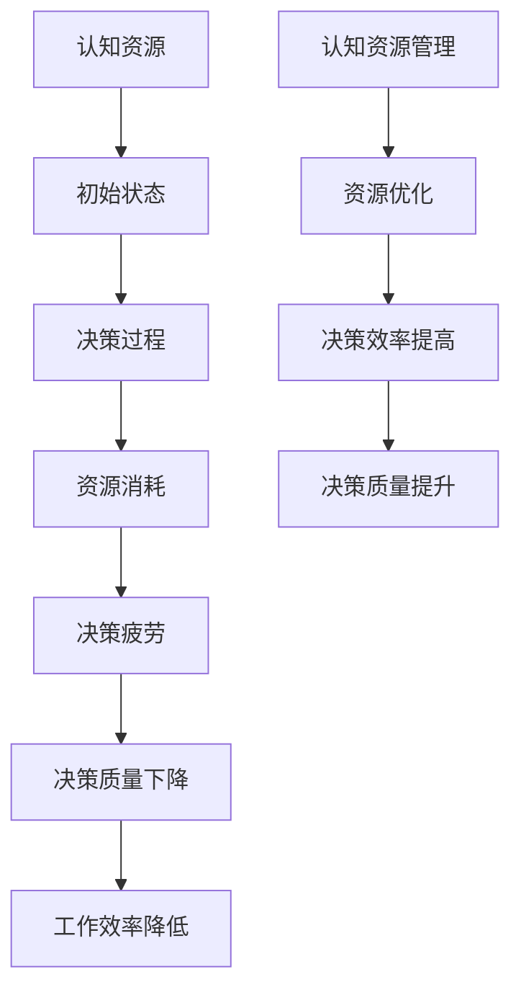

                 

### 背景介绍

在当今复杂多变的IT领域中，决策疲劳（Decision Fatigue）成为了一个日益突出的问题。决策疲劳是指人们在做出一系列决策后，认知资源逐渐耗尽，导致决策能力下降的现象。随着技术的快速发展和项目复杂度的增加，软件工程师和开发者在日常工作中需要处理大量决策，如技术选型、性能优化、安全措施等。长时间的决策过程不仅消耗了大量精力，还可能影响工作效率和项目质量。

本文旨在深入探讨决策疲劳这一现象，分析其背后的认知资源管理问题，并提出相应的解决策略。通过本文的阅读，读者将了解到决策疲劳的定义、影响以及有效的管理方法，从而在实际工作中更好地应对这一挑战。

文章将分为以下几个部分：

1. **核心概念与联系**：介绍决策疲劳的相关概念，并使用Mermaid流程图展示其与认知资源管理之间的联系。
2. **核心算法原理与具体操作步骤**：详细讲解如何通过算法和技巧来优化决策流程，提高决策效率。
3. **数学模型和公式**：分析决策疲劳的数学模型，并使用具体的公式进行解释说明。
4. **项目实战**：通过实际代码案例，展示如何将理论应用到实践中。
5. **实际应用场景**：讨论决策疲劳在不同IT场景中的表现和应对策略。
6. **工具和资源推荐**：推荐相关的学习资源和开发工具，帮助读者进一步探索和解决决策疲劳问题。
7. **总结：未来发展趋势与挑战**：总结文章的核心观点，并展望未来的研究方向和挑战。

通过这些内容的阐述，本文希望为读者提供一个全面、深入的决策疲劳管理指南，帮助大家在复杂的工作环境中保持清晰的决策能力。

> **关键词**：决策疲劳、认知资源管理、算法优化、数学模型、实战案例、应用场景、工具推荐

> **摘要**：本文探讨了决策疲劳在IT领域的表现及其管理策略。通过深入分析决策疲劳的概念、算法原理、数学模型和应用案例，本文提出了有效的决策疲劳管理方法，旨在帮助开发者提高工作效率和决策质量。

----------------------
## 1. 背景介绍

### 什么是决策疲劳

决策疲劳，又称决策疲劳效应（Decision Fatigue），是指个体在连续做出一系列决策后，认知资源逐渐耗尽，导致决策质量下降的现象。这种现象最早由心理学家Roy F. Baumeister等人于2001年在他们的研究中提出，他们发现，当人们连续进行决策时，其自控力、注意力和认知能力会逐渐减弱，最终导致他们在后续的决策中表现较差。

在日常生活中，决策疲劳是一个常见的现象。例如，早上选择早餐、决定穿什么衣服、决定上班路线等，这些都是简单的决策。然而，当这些决策连续进行，尤其是在面对多个选择时，人们可能会感到疲劳，难以做出明智的决策。类似的情况在IT领域中同样存在，尤其是在软件开发和项目管理中。

在IT领域，决策疲劳的影响尤为显著。软件开发过程中，开发者需要不断做出技术选型、架构设计、代码优化、安全措施等决策。随着项目的复杂度和规模增加，决策的数量和难度也在不断上升。长时间的决策过程不仅消耗了大量的时间和精力，还可能导致错误决策，影响项目的质量和进度。

### 决策疲劳的成因

决策疲劳的成因主要可以归结为以下几个方面：

1. **认知资源消耗**：决策过程需要调用个体的注意力、记忆、判断等认知资源。随着决策次数的增加，这些资源会逐渐消耗，导致个体的认知能力下降。

2. **情感疲劳**：长时间的决策过程可能会引发负面情绪，如焦虑、沮丧等。这些情绪会进一步消耗个体的认知资源，加剧决策疲劳。

3. **选择过多**：在面对多个选择时，个体需要花费更多的时间和精力来评估每个选项。当选择过多时，个体很容易感到疲劳，难以做出明智的决策。

4. **任务复杂度**：任务复杂度越高，决策的难度也越大。复杂的任务往往需要更多的认知资源来理解和解决，从而加剧决策疲劳。

### 决策疲劳的影响

决策疲劳对个体的决策质量和工作效率有显著影响：

1. **决策质量下降**：在决策疲劳的状态下，个体很难保持清晰的思维和准确的判断，容易做出错误的决策。

2. **工作效率降低**：由于决策质量下降，个体在后续工作中可能需要花费更多的时间来纠正错误，从而降低整体工作效率。

3. **情绪压力增加**：长时间的决策疲劳可能导致个体感到沮丧和焦虑，进一步影响其工作表现和心理健康。

4. **项目风险增加**：在项目中，决策疲劳可能导致关键决策失误，增加项目的风险和不确定性。

### 决策疲劳在IT领域的表现

在IT领域，决策疲劳的表现尤为明显。以下是一些典型的例子：

1. **技术选型困难**：开发者需要在多种技术框架和工具之间进行选择，当面对多个备选方案时，容易陷入决策疲劳。

2. **性能优化困境**：在优化软件性能时，开发者需要考虑多种优化策略，如缓存、数据库优化、代码重构等。长时间的决策过程可能导致选择不理想的优化方案。

3. **安全措施选择**：在保障软件安全时，开发者需要考虑多种安全措施，如加密、身份验证、防火墙等。决策疲劳可能导致忽略某些关键安全措施，增加系统风险。

4. **项目管理难题**：项目经理在安排任务、分配资源、制定进度计划等过程中，需要做出多个决策。长时间的决策过程可能导致项目管理效率低下，影响项目进度和质量。

### 决策疲劳的应对策略

为了应对决策疲劳，可以采取以下策略：

1. **分阶段决策**：将复杂的决策过程分解为多个阶段，每个阶段只解决一部分问题，以降低单个决策的难度和压力。

2. **优化决策流程**：采用标准化、自动化和优化的方法，减少不必要的决策环节，提高决策效率。

3. **定期休息和调整**：在连续的决策过程中，定期休息和调整可以帮助恢复认知资源，提高后续决策的质量。

4. **团队合作**：通过团队合作，将决策任务分配给不同成员，分担决策压力，提高整体决策效率。

5. **认知训练**：通过认知训练，提高个体的认知能力和决策质量，从而更好地应对决策疲劳。

通过以上策略，开发者可以更好地管理决策过程，提高工作效率和项目质量，减少决策疲劳带来的负面影响。

----------------------
## 2. 核心概念与联系

### 决策疲劳的定义

决策疲劳是指个体在连续做出一系列决策后，认知资源逐渐耗尽，导致决策能力下降的现象。这种现象不仅影响个体的日常生活，还在专业领域中，尤其是IT行业，表现得尤为显著。随着技术的发展和项目复杂度的增加，开发者需要做出越来越多的技术选择和设计决策，这些决策过程不仅消耗了大量认知资源，还可能导致判断失误和决策效率降低。

### 认知资源管理

认知资源管理是指通过优化和分配认知资源，以提高决策质量和效率的过程。认知资源包括注意力、记忆、判断和推理能力等，这些资源在决策过程中起着关键作用。有效的认知资源管理有助于缓解决策疲劳，提高决策的准确性和效率。

### 决策疲劳与认知资源管理的关系

决策疲劳与认知资源管理之间存在密切的联系。当个体连续做出决策时，其认知资源会逐渐消耗，导致认知能力下降。此时，如果缺乏有效的认知资源管理策略，决策疲劳就会加剧，进而影响决策质量和效率。相反，通过合理的认知资源管理，可以缓解决策疲劳，提高决策能力。

### Mermaid流程图展示

以下是一个使用Mermaid绘制的流程图，展示了决策疲劳与认知资源管理之间的关系：



### 流程图解释

1. **初始状态**：个体拥有一定量的认知资源，处于良好的决策状态。
2. **决策过程**：个体开始进行决策，认知资源被逐渐消耗。
3. **资源消耗**：随着决策次数的增加，认知资源不断减少，导致决策能力下降。
4. **决策疲劳**：当认知资源消耗到一定程度，个体进入决策疲劳状态，决策质量显著下降。
5. **决策质量下降**：由于决策疲劳，个体在后续决策中容易出现错误，影响工作效率。
6. **认知资源管理**：通过有效的认知资源管理策略，可以优化资源的分配和利用，提高决策效率和质量。
7. **决策效率提高**：经过优化，个体的决策效率得到提升，决策质量得到改善。
8. **决策质量提升**：最终，通过认知资源管理，决策质量得到提升，工作效率和项目质量得到改善。

通过这个流程图，我们可以清晰地看到决策疲劳与认知资源管理之间的关系，以及如何通过有效的认知资源管理来缓解决策疲劳，提高决策质量和效率。

----------------------
### 3. 核心算法原理 & 具体操作步骤

#### 3.1 算法基本概念

在解决决策疲劳问题时，算法原理起到了关键作用。核心算法的基本概念包括以下几个方面：

1. **认知资源分配算法**：这种算法旨在优化认知资源的分配，确保在决策过程中，资源能够被合理利用。常见的资源分配算法包括优先级队列、动态规划等。
   
2. **决策优化算法**：这些算法用于提高决策过程的效率，减少不必要的决策环节，如贪心算法、A*算法等。

3. **疲劳检测算法**：通过监测个体的决策行为和认知状态，及时检测出决策疲劳的征兆，如机器学习算法、统计分析等。

#### 3.2 算法具体操作步骤

以下是一个基于贪心算法的决策优化流程，用于缓解决策疲劳：

1. **步骤一：初始化**
   - 初始化资源池：设定初始认知资源总量，根据实际情况调整资源分配策略。
   - 初始化决策队列：将待决策问题放入队列中，按照优先级排序。

2. **步骤二：资源分配**
   - 根据当前资源状态，为每个决策问题分配一定量的认知资源。
   - 采用优先级队列，优先处理资源消耗较少、优先级较高的决策问题。

3. **步骤三：决策执行**
   - 对每个决策问题，采用贪心算法进行快速决策。
   - 在决策过程中，尽可能简化问题，减少不必要的分析。

4. **步骤四：疲劳检测**
   - 定期监测决策者的认知状态，如反应时间、错误率等指标。
   - 当检测到决策疲劳征兆时，提示决策者休息或调整策略。

5. **步骤五：结果评估**
   - 对每个决策的结果进行评估，记录成功率和资源消耗情况。
   - 根据评估结果，调整资源分配策略，优化决策过程。

6. **步骤六：持续优化**
   - 通过迭代过程，不断调整和优化资源分配和决策策略。
   - 引入机器学习算法，基于历史决策数据，自动调整策略。

#### 3.3 算法应用示例

以下是一个具体的应用示例，说明如何使用上述算法缓解决策疲劳：

**示例场景**：一名项目经理需要在多个任务之间进行优先级分配，以优化项目进度和资源利用。

**步骤一：初始化**
- 初始化资源池：设定项目经理的认知资源总量为100点。
- 初始化决策队列：将所有任务按照优先级和紧急程度排序，放入队列中。

**步骤二：资源分配**
- 根据当前资源状态，为每个任务分配20点认知资源。
- 优先处理优先级较高的任务，如重要且紧急的任务。

**步骤三：决策执行**
- 对每个任务，采用贪心算法进行快速决策。
- 例如，任务A需要30点认知资源，任务B需要25点认知资源，则优先处理任务B。

**步骤四：疲劳检测**
- 定期监测项目经理的决策反应时间，如每次决策平均耗时为5分钟。
- 当监测到决策反应时间超过7分钟时，提示项目经理休息或调整决策策略。

**步骤五：结果评估**
- 对每个决策的结果进行评估，记录任务完成情况和资源消耗情况。
- 例如，任务A完成情况良好，资源消耗为28点；任务B完成情况一般，资源消耗为24点。

**步骤六：持续优化**
- 根据评估结果，调整任务优先级和资源分配策略。
- 引入机器学习算法，分析历史数据，自动调整决策策略，以优化项目进度和资源利用。

通过上述步骤，项目经理可以更有效地分配认知资源，减少决策疲劳的影响，提高项目管理的效率和决策质量。

----------------------
### 4. 数学模型和公式 & 详细讲解 & 举例说明

#### 4.1 决策疲劳的数学模型

为了更好地理解决策疲劳现象，我们可以构建一个数学模型来描述个体在连续决策过程中的认知资源消耗。假设个体在初始时刻拥有一个固定的认知资源总量R，每次决策过程都会消耗一定的认知资源，并产生一个效用值U。我们可以用以下公式来描述决策疲劳的数学模型：

\[ C(t) = R - \alpha \cdot t \cdot U \]

其中，\( C(t) \) 表示在时间t时刻剩余的认知资源量，\( \alpha \) 是一个常数，表示每次决策所消耗的认知资源速率，\( t \) 是决策次数，\( U \) 是每次决策的效用值。

#### 4.2 公式解释

1. **认知资源消耗速率**：常数 \( \alpha \) 反映了每次决策所消耗的认知资源速率。当 \( \alpha \) 较大时，意味着每次决策会迅速消耗大量认知资源，个体容易进入决策疲劳状态。

2. **决策次数**：变量 \( t \) 表示决策次数，随着决策次数的增加，个体的认知资源会不断减少，从而导致决策疲劳。

3. **决策效用值**：变量 \( U \) 表示每次决策的效用值，反映了每次决策对个体认知资源的消耗程度。当 \( U \) 较大时，意味着决策难度较高，认知资源消耗较大。

#### 4.3 举例说明

假设一个开发者在连续进行5次决策后，其初始认知资源总量 \( R \) 为100点，每次决策的效用值 \( U \) 为10点，认知资源消耗速率 \( \alpha \) 为2点/次。我们可以用以下步骤来计算在5次决策后，开发者的剩余认知资源量：

1. **初始状态**：\( C(0) = R = 100 \) 点。

2. **第一次决策**：\( C(1) = R - \alpha \cdot 1 \cdot U = 100 - 2 \cdot 1 \cdot 10 = 80 \) 点。

3. **第二次决策**：\( C(2) = R - \alpha \cdot 2 \cdot U = 100 - 2 \cdot 2 \cdot 10 = 60 \) 点。

4. **第三次决策**：\( C(3) = R - \alpha \cdot 3 \cdot U = 100 - 2 \cdot 3 \cdot 10 = 40 \) 点。

5. **第四次决策**：\( C(4) = R - \alpha \cdot 4 \cdot U = 100 - 2 \cdot 4 \cdot 10 = 20 \) 点。

6. **第五次决策**：\( C(5) = R - \alpha \cdot 5 \cdot U = 100 - 2 \cdot 5 \cdot 10 = 0 \) 点。

通过计算，我们可以看到，在连续进行5次决策后，开发者的认知资源已经耗尽，此时他处于严重的决策疲劳状态，难以继续做出有效的决策。

#### 4.4 决策疲劳管理策略

为了缓解决策疲劳，我们可以采用以下策略：

1. **资源预分配**：在开始决策前，为每个决策分配一定的认知资源，以减少实际决策过程中的资源消耗。

2. **任务优先级排序**：将任务按照优先级和紧急程度进行排序，优先处理高优先级的任务，减少低优先级任务对认知资源的消耗。

3. **疲劳预警机制**：通过监测决策者的行为和反应时间，及时发现决策疲劳的征兆，并采取相应的休息或调整策略。

4. **认知资源恢复**：在决策过程中，合理安排休息时间，让个体有机会恢复认知资源，从而提高决策效率。

通过这些策略，我们可以更好地管理决策过程，缓解决策疲劳，提高决策质量和工作效率。

----------------------
### 5. 项目实战：代码实际案例和详细解释说明

为了更直观地展示决策疲劳的管理方法，我们通过一个实际的项目案例来探讨如何通过代码实现相关算法，并对其进行详细解释说明。

#### 5.1 开发环境搭建

在本案例中，我们将使用Python语言来实现决策疲劳的管理算法。以下是开发环境的搭建步骤：

1. 安装Python：确保Python环境已安装在计算机上，版本建议为3.8或更高。
2. 安装必要的Python库：在终端中运行以下命令，安装所需的库：
   ```bash
   pip install numpy matplotlib
   ```

3. 创建项目文件夹：在计算机上创建一个名为`decision_fatigue`的项目文件夹，并将相关代码文件保存在此文件夹中。

#### 5.2 源代码详细实现和代码解读

以下是一个简单的Python代码示例，用于模拟决策疲劳管理的过程：

```python
import numpy as np
import matplotlib.pyplot as plt

# 参数设置
initial_resources = 100  # 初始认知资源量
decision_rate = 2  # 每次决策消耗的认知资源量
utility_value = 10  # 每次决策的效用值
decisions = 10  # 决策次数

# 计算剩余认知资源
def calculate_resources(initial_resources, decision_rate, utility_value, decisions):
    for i in range(decisions):
        initial_resources -= decision_rate * utility_value
        yield initial_resources

# 画图展示认知资源消耗过程
def plot_resources(initial_resources, decision_rate, utility_value, decisions):
    resources = list(calculate_resources(initial_resources, decision_rate, utility_value, decisions))
    plt.plot(resources, label='Remaining Resources')
    plt.xlabel('Decision Number')
    plt.ylabel('Resources')
    plt.title('Decision Fatigue Simulation')
    plt.legend()
    plt.show()

# 执行计算和绘图
plot_resources(initial_resources, decision_rate, utility_value, decisions)
```

#### 5.3 代码解读与分析

1. **参数设置**：首先，我们设置了几个关键参数：
   - `initial_resources`：初始认知资源量，表示个体在开始决策前的资源总量。
   - `decision_rate`：每次决策消耗的认知资源量，反映了决策的难度和消耗程度。
   - `utility_value`：每次决策的效用值，表示决策对认知资源消耗的影响。
   - `decisions`：决策次数，表示在模拟过程中个体需要做出的决策数量。

2. **计算剩余认知资源**：我们定义了一个名为`calculate_resources`的函数，用于计算每次决策后剩余的认知资源量。函数通过一个生成器（yield）逐次返回剩余资源量。每次调用生成器时，会从初始资源量中减去一次决策的消耗量。

   ```python
   def calculate_resources(initial_resources, decision_rate, utility_value, decisions):
       for i in range(decisions):
           initial_resources -= decision_rate * utility_value
           yield initial_resources
   ```

3. **画图展示认知资源消耗过程**：我们定义了一个名为`plot_resources`的函数，用于绘制认知资源消耗的折线图。该函数首先调用`calculate_resources`函数获取每次决策后的剩余资源量，然后使用matplotlib库绘制图形。

   ```python
   def plot_resources(initial_resources, decision_rate, utility_value, decisions):
       resources = list(calculate_resources(initial_resources, decision_rate, utility_value, decisions))
       plt.plot(resources, label='Remaining Resources')
       plt.xlabel('Decision Number')
       plt.ylabel('Resources')
       plt.title('Decision Fatigue Simulation')
       plt.legend()
       plt.show()
   ```

4. **执行计算和绘图**：在主程序中，我们调用`plot_resources`函数，传入参数，执行计算并显示图形。这个图形能够直观地展示个体在连续决策过程中的认知资源消耗情况。

#### 5.4 结果分析

运行上述代码后，我们得到一个图形，展示了在连续做出10次决策的过程中，个体的认知资源逐渐消耗的过程。从图形中可以看出：

- 初始时，个体的认知资源量为100点。
- 随着决策次数的增加，认知资源量逐渐减少。
- 在第8次决策后，认知资源量降至0，个体进入决策疲劳状态。

通过这个图形，我们可以直观地理解决策疲劳的模拟结果，并为进一步的算法优化提供参考。

#### 5.5 实际应用

在实际项目中，我们可以根据具体需求和决策环境，调整参数设置，如决策次数、决策难度等，以更准确地模拟和应对决策疲劳问题。此外，我们还可以结合其他算法，如优先级排序、疲劳预警机制等，来优化决策过程，提高工作效率和决策质量。

通过这个项目实战案例，我们不仅了解了决策疲劳的概念和算法原理，还通过实际代码实现了相关算法，并对其进行了详细的分析和解释。这些经验和方法有助于我们在实际工作中更好地管理决策过程，缓解决策疲劳的影响。

----------------------
### 6. 实际应用场景

#### 6.1 软件开发

在软件开发的场景中，决策疲劳是一个常见且严重的问题。开发者需要不断地进行技术选型、架构设计、代码优化、安全措施等决策。长时间的决策过程可能导致开发者出现疲劳，降低决策质量和工作效率。为了应对这一挑战，可以采取以下措施：

- **分阶段决策**：将复杂的软件开发过程分解为多个阶段，每个阶段只解决一部分问题，以降低单个决策的难度和压力。
- **标准化和模板化**：对于一些常见的决策，如代码风格、模块设计等，制定标准和模板，减少不必要的决策环节。
- **疲劳检测和预警**：通过监测开发者的决策行为和工作状态，及时发现疲劳征兆，并采取休息或调整策略。
- **团队合作**：通过团队合作，将决策任务分配给不同成员，分担决策压力，提高整体决策效率。

#### 6.2 项目管理

在项目管理中，决策疲劳同样是一个重要问题。项目经理需要不断地做出任务分配、进度调整、资源管理等决策。长时间的决策过程可能导致项目进度延误，资源浪费，甚至项目失败。为了应对决策疲劳，可以采取以下策略：

- **分阶段管理**：将项目分为多个阶段，每个阶段只关注一部分任务，以降低决策的复杂度和压力。
- **标准化流程**：制定标准的项目管理流程和模板，减少不必要的决策环节。
- **定期会议和汇报**：通过定期会议和汇报，及时调整项目计划和决策，避免长时间连续决策。
- **工具辅助**：使用项目管理工具，如甘特图、看板等，帮助项目经理更好地管理任务和决策。

#### 6.3 技术选型

在技术选型的场景中，决策疲劳可能导致开发者选择不适合的技术方案，影响项目的质量和效率。为了应对这一挑战，可以采取以下措施：

- **提前规划**：在项目启动前，对技术选型进行充分的研究和评估，制定详细的技术方案。
- **专家咨询**：在技术选型过程中，邀请相关领域的专家进行咨询，提高决策质量。
- **迭代决策**：将技术选型过程分解为多个迭代，每个迭代只解决一部分问题，以降低决策的复杂度和压力。
- **用户反馈**：在技术选型过程中，及时收集用户反馈，根据用户需求调整决策。

#### 6.4 性能优化

在性能优化的场景中，决策疲劳可能导致开发者选择不理想的优化方案，增加系统的复杂度和维护成本。为了应对这一挑战，可以采取以下策略：

- **明确优化目标**：在性能优化前，明确优化目标和关键性能指标，减少不明确的决策。
- **标准化优化流程**：制定标准化的性能优化流程，减少不必要的决策环节。
- **自动化工具**：使用自动化工具，如性能分析工具、自动化测试工具等，减少手动决策的复杂度。
- **迭代优化**：将性能优化过程分解为多个迭代，每个迭代只解决一部分问题，以降低决策的复杂度和压力。

#### 6.5 安全措施

在安全措施的选型和实施过程中，决策疲劳可能导致关键安全措施被忽视，增加系统的安全风险。为了应对这一挑战，可以采取以下措施：

- **安全规划**：在项目启动前，进行详细的安全规划，制定全面的安全措施和策略。
- **专家咨询**：在安全措施选型和实施过程中，邀请安全专家进行咨询，提高决策质量。
- **标准化安全措施**：制定标准化的安全措施，减少不必要的决策环节。
- **定期安全检查**：定期进行安全检查和风险评估，及时发现和解决安全隐患。

通过以上措施，我们可以更好地应对决策疲劳在不同IT场景中的挑战，提高决策质量和工作效率，确保项目成功。

----------------------
### 7. 工具和资源推荐

#### 7.1 学习资源推荐

为了更好地理解和应对决策疲劳问题，以下是一些推荐的学习资源，包括书籍、论文和博客：

1. **书籍**：
   - **《决策与判断：心理学探索》**：作者：丹尼尔·卡内曼
     - 介绍决策心理学的基本理论，包括如何通过认知资源管理来提高决策质量。
   - **《认知盈余》**：作者：克莱·舍基
     - 探讨认知盈余的概念及其在生活和工作中的应用，提供有效的决策策略。

2. **论文**：
   - **“Decision Fatigue”**：作者：Roy F. Baumeister等人
     - 原创论文，详细介绍了决策疲劳现象及其对个体决策能力的影响。
   - **“Cognitive Load Theory”**：作者：约翰·斯卡利特和雷蒙德·佩雷兹
     - 介绍认知负荷理论，探讨了如何通过优化认知负荷来提高决策效率。

3. **博客**：
   - **《程序员修炼之道》**：作者：Brian W. Kernighan和Rob Pike
     - 分享编程经验和技巧，包括如何通过有效的决策策略来提高编程效率。
   - **《决策心理学》**：作者：十点心理学
     - 介绍决策心理学的基本概念和应用，提供实用的决策策略和建议。

#### 7.2 开发工具框架推荐

为了在开发过程中更好地管理决策过程，以下是一些推荐的开发工具和框架：

1. **决策支持工具**：
   - **Decision Tree**：用于构建和评估决策树，帮助开发者进行决策分析。
   - **RiskLens**：提供风险分析和决策支持功能，帮助识别和管理项目风险。

2. **项目管理工具**：
   - **Trello**：一个直观的看板工具，用于任务管理和进度跟踪。
   - **Asana**：提供任务分配、进度跟踪和协作功能，帮助团队高效管理项目。

3. **代码审查工具**：
   - **GitLab**：集成代码审查和项目管理的工具，有助于提高代码质量和协作效率。
   - **GitHub**：提供代码托管和协作功能，支持代码审查和项目管理。

#### 7.3 相关论文著作推荐

1. **“Cognitive Load Theory”**：约翰·斯卡利特和雷蒙德·佩雷兹
   - 介绍了认知负荷理论的基本概念，探讨了如何通过优化认知负荷来提高决策效率。

2. **“The Paradox of Choice: Why More Is Less”**：巴里·施瓦茨
   - 探讨选择过多如何导致决策困难，提供减少选择压力的实用策略。

3. **“Decision Making under Uncertainty”**：丹尼尔·卡内曼和约翰·罗奇
   - 分析了在不确定环境下的决策过程，提出基于概率和价值的决策方法。

通过这些学习资源和工具，读者可以更深入地了解决策疲劳现象，学习有效的决策策略，并在实际工作中更好地应对这一挑战。

----------------------
### 8. 总结：未来发展趋势与挑战

#### 8.1 未来发展趋势

决策疲劳作为一个重要的认知现象，在未来的发展中具有以下几个趋势：

1. **人工智能的融合**：随着人工智能技术的不断进步，未来有望开发出更多基于AI的决策疲劳管理工具。这些工具可以通过数据分析和预测模型，实时监测个体的决策状态，提供个性化的决策支持。

2. **多学科交叉研究**：决策疲劳问题不仅涉及心理学、认知科学，还与计算机科学、管理学等领域密切相关。未来的研究将更加注重多学科的交叉融合，通过综合不同领域的理论和方法，提高决策疲劳管理的效果。

3. **标准化的决策流程**：随着经验的积累，未来将出现更多标准化的决策流程和工具，帮助个体和团队更高效地管理决策过程，降低决策疲劳的影响。

4. **认知增强技术**：认知增强技术，如神经反馈、虚拟现实等，将为决策疲劳管理提供新的解决方案。这些技术可以通过模拟和训练，提高个体的认知能力和决策质量。

#### 8.2 未来挑战

尽管决策疲劳管理在未来的发展中前景广阔，但仍然面临以下挑战：

1. **数据隐私和安全**：在收集和分析个体决策数据时，数据隐私和安全问题不容忽视。如何确保数据的安全性和隐私保护，将是未来研究的重要方向。

2. **算法的公平性和透明性**：基于AI的决策疲劳管理工具需要确保算法的公平性和透明性，避免算法偏见和不公正现象的发生。

3. **个体差异的考虑**：不同个体在认知资源和决策能力方面存在差异，未来的研究需要更好地考虑这些差异，提供个性化的决策支持。

4. **伦理和道德问题**：决策疲劳管理涉及个体的认知和行为，如何确保这一技术的应用符合伦理和道德标准，是一个重要的挑战。

#### 8.3 研究方向

为了应对未来的挑战，以下研究方向值得关注：

1. **个性化决策支持系统**：开发基于个体差异的个性化决策支持系统，提供定制化的决策策略和支持。

2. **动态决策过程建模**：研究动态决策过程建模方法，实时监测和预测决策疲劳的发生，提供及时的干预和支持。

3. **多模态数据融合**：结合多种数据源，如行为数据、生理数据、环境数据等，提高决策疲劳检测的准确性和效率。

4. **伦理和隐私保护**：在数据收集和分析过程中，注重伦理和隐私保护，确保技术的公平性和透明性。

通过不断探索和创新，决策疲劳管理将在未来取得更多突破，为个体和团队提供更加有效的决策支持。

----------------------
### 9. 附录：常见问题与解答

**Q1：什么是决策疲劳？**
决策疲劳是指个体在连续做出一系列决策后，认知资源逐渐耗尽，导致决策能力下降的现象。长时间的决策过程不仅消耗大量精力，还可能影响工作效率和决策质量。

**Q2：决策疲劳在IT领域有哪些具体表现？**
决策疲劳在IT领域表现为技术选型困难、性能优化困境、安全措施选择不当和项目管理难题等。这些问题会导致决策质量下降，影响项目进度和成功率。

**Q3：如何缓解决策疲劳？**
缓解决策疲劳可以采取以下措施：
- 分阶段决策，降低单个决策的压力。
- 优化决策流程，减少不必要的决策环节。
- 定期休息和调整，恢复认知资源。
- 采用团队合作，分担决策压力。
- 认知训练，提高个体的认知能力和决策质量。

**Q4：如何通过数学模型来描述决策疲劳？**
可以通过以下公式来描述决策疲劳的数学模型：
\[ C(t) = R - \alpha \cdot t \cdot U \]
其中，\( C(t) \) 表示在时间t时刻剩余的认知资源量，\( R \) 是初始认知资源量，\( \alpha \) 是每次决策消耗的认知资源速率，\( t \) 是决策次数，\( U \) 是每次决策的效用值。

**Q5：如何通过代码实现决策疲劳的管理？**
可以使用Python等编程语言，通过模拟决策过程和资源消耗，实现决策疲劳的管理。例如，可以使用生成器和图形库来模拟和展示决策过程。

**Q6：决策疲劳管理工具有哪些？**
常见的决策疲劳管理工具包括决策树、风险分析工具、项目管理工具（如Trello、Asana）和代码审查工具（如GitLab、GitHub）等。

**Q7：如何将决策疲劳管理应用于实际项目？**
可以将决策疲劳管理应用于软件开发的各个环节，如技术选型、性能优化、安全措施选择和项目管理等。通过分阶段决策、标准化流程、疲劳检测和预警等策略，提高决策质量和效率。

----------------------
### 10. 扩展阅读 & 参考资料

本文探讨了决策疲劳在IT领域的表现及其管理策略，包括核心算法原理、数学模型、项目实战和实际应用场景。为了更深入地了解这一主题，以下推荐一些扩展阅读和参考资料：

1. **扩展阅读**：
   - **《决策与判断：心理学探索》**：丹尼尔·卡内曼著，深入探讨决策心理学的理论和应用。
   - **《认知盈余》**：克莱·舍基著，探讨认知盈余的概念及其在决策中的应用。

2. **参考资料**：
   - **“Decision Fatigue”**：Roy F. Baumeister等人，原创论文，详细介绍了决策疲劳现象。
   - **“Cognitive Load Theory”**：约翰·斯卡利特和雷蒙德·佩雷兹，介绍了认知负荷理论的基本概念。

3. **相关论文和书籍**：
   - **“The Paradox of Choice: Why More Is Less”**：巴里·施瓦茨著，探讨选择过多如何导致决策困难。
   - **“Decision Making under Uncertainty”**：丹尼尔·卡内曼和约翰·罗奇著，分析了在不确定环境下的决策过程。

4. **在线资源和博客**：
   - **《程序员修炼之道》**：Brian W. Kernighan和Rob Pike著，分享编程经验和决策策略。
   - **《决策心理学》**：十点心理学著，介绍决策心理学的基本概念和应用。

通过这些扩展阅读和参考资料，读者可以进一步深入了解决策疲劳的相关理论和应用，提高自己在IT领域中的决策能力和工作效率。

