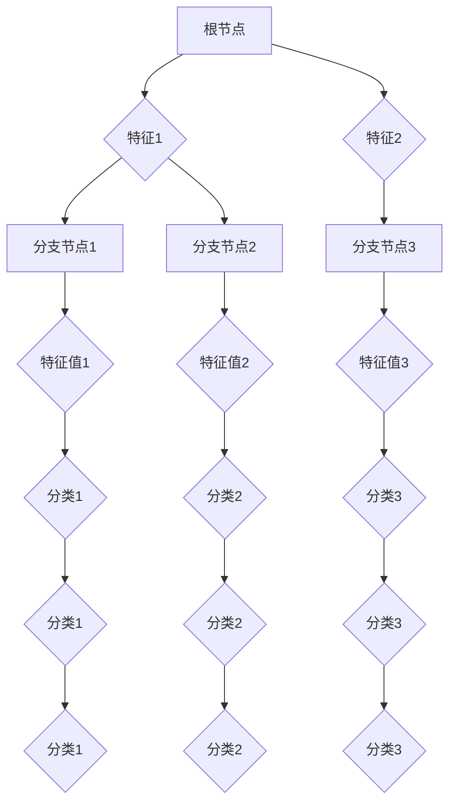

                 

# 决策树 原理与代码实例讲解

## 摘要

决策树是一种强大的分类和回归算法，通过构建一系列的决策节点，实现对数据集的划分和预测。本文将详细介绍决策树的基本原理、核心算法以及如何在Python中实现一个简单的决策树。通过实例代码，读者可以深入理解决策树的构建过程，并能够将其应用到实际问题中。

## 1. 背景介绍

在数据分析和机器学习领域，分类和回归是常见的问题类型。分类任务旨在将数据划分为不同的类别，而回归任务则是预测一个连续的数值。决策树是一种简单且直观的算法，它通过一系列的规则或决策路径，将数据集划分为不同的子集，并最终生成一个预测结果。

决策树因其易于理解、实现简单且具有较好的分类性能而广受欢迎。它不仅适用于分类问题，还可以应用于回归问题。本文将首先介绍决策树的基本概念和原理，然后通过实例代码展示如何构建和训练一个简单的决策树。

## 2. 核心概念与联系

### 决策树的组成

决策树由一系列的决策节点和叶子节点组成。每个节点表示一个特征，每个分支代表该特征的取值。例如，对于一个分类问题，每个叶子节点代表一个类别的概率。

#### 决策节点

决策节点通过比较特征值和阈值来确定下一步的分支。决策节点通常表示为一个内部节点，其下方连接多个分支节点。

#### 分支节点

分支节点表示特征的不同取值。每个分支节点都指向下一个决策节点或叶子节点。

#### 叶子节点

叶子节点表示最终的分类结果或回归值。对于分类问题，叶子节点通常包含多个类别及其概率；对于回归问题，叶子节点包含一个预测值。

### 决策树的工作原理

决策树通过以下步骤进行构建：

1. **选择最优特征**：在当前节点，选择一个最优特征进行划分。通常使用信息增益（信息增益率或基尼不纯度）来评估特征的重要性。

2. **划分数据集**：根据所选特征的不同取值，将数据集划分为多个子集。

3. **递归构建子树**：对每个子集递归地执行步骤1和步骤2，直到满足停止条件（例如，达到最大深度或最小样本大小）。

4. **生成预测结果**：从根节点开始，根据特征值和阈值逐步向下移动，直到达到叶子节点，最终得到预测结果。

### 决策树的Mermaid流程图

下面是决策树的Mermaid流程图，其中包含了决策树的基本组成部分和构建过程。

```
graph TD
A[根节点] --> B{特征1}
B --> C[分支节点1]
C --> D{特征值1}
D --> E{分类1}
E --> F{分类1}
F --> G{分类1}

B --> H[分支节点2]
H --> I{特征值2}
I --> J{分类2}
J --> K{分类2}
K --> L{分类2}

A --> M{特征2}
M --> N[分支节点3]
N --> O{特征值3}
O --> P{分类3}
P --> Q{分类3}
Q --> R{分类3}
```

## 3. 核心算法原理 & 具体操作步骤

### 信息增益（Information Gain）

信息增益是评估特征划分优劣的指标。它通过比较数据集在划分前后信息熵的变化来计算。

$$
\text{信息增益}(A) = \text{信息熵}(\text{数据集}) - \sum_{i} p(i) \cdot \text{信息熵}(S_i)
$$

其中，$A$ 表示特征，$i$ 表示类别，$p(i)$ 表示类别 $i$ 在数据集中的概率，$S_i$ 表示特征 $A$ 取值为 $i$ 的数据子集。

### 选择最优特征

选择最优特征通常使用信息增益作为评估标准。在所有特征中，选择信息增益最大的特征作为划分标准。

### 划分数据集

根据所选特征的不同取值，将数据集划分为多个子集。对于连续特征，可以将其划分成多个阈值区间。

### 递归构建子树

递归地执行以下步骤，直到满足停止条件：

1. 选择最优特征
2. 划分数据集
3. 对每个子集递归地执行步骤1和步骤2

### 停止条件

构建决策树的停止条件通常包括：

1. 最大深度
2. 最小样本大小
3. 特征重要性低于阈值

### 决策树的Python实现

下面是使用Python实现决策树的简单代码示例。

```python
import numpy as np
from sklearn.datasets import load_iris
from sklearn.model_selection import train_test_split
from sklearn.tree import DecisionTreeClassifier
import matplotlib.pyplot as plt

# 加载鸢尾花数据集
iris = load_iris()
X = iris.data
y = iris.target

# 划分训练集和测试集
X_train, X_test, y_train, y_test = train_test_split(X, y, test_size=0.3, random_state=42)

# 构建决策树模型
clf = DecisionTreeClassifier(max_depth=3)
clf.fit(X_train, y_train)

# 可视化决策树
plt.figure(figsize=(12, 8))
plt.title("Decision Tree")
plt.xlabel("Feature Index")
plt.ylabel("Feature Value")
plot_tree(clf, feature_names=iris.feature_names, class_names=iris.target_names, filled=True)
plt.show()

# 预测测试集
y_pred = clf.predict(X_test)

# 评估模型性能
from sklearn.metrics import accuracy_score
accuracy = accuracy_score(y_test, y_pred)
print("Accuracy:", accuracy)
```

## 4. 数学模型和公式 & 详细讲解 & 举例说明

### 信息熵（Entropy）

信息熵是衡量数据集不确定性的一种指标。对于一个具有 $C$ 个类别的数据集，信息熵的计算公式如下：

$$
H(X) = -\sum_{i=1}^{C} p(i) \cdot \log_2 p(i)
$$

其中，$p(i)$ 表示类别 $i$ 在数据集中的概率。

### 信息增益（Information Gain）

信息增益是评估特征划分优劣的指标。它通过比较数据集在划分前后信息熵的变化来计算。

$$
\text{信息增益}(A) = \text{信息熵}(\text{数据集}) - \sum_{i} p(i) \cdot \text{信息熵}(S_i)
$$

其中，$A$ 表示特征，$i$ 表示类别，$p(i)$ 表示类别 $i$ 在数据集中的概率，$S_i$ 表示特征 $A$ 取值为 $i$ 的数据子集。

### 举例说明

假设有一个包含3个类别的数据集，类别1、2、3的概率分别为0.5、0.3、0.2。计算该数据集的信息熵。

$$
H(X) = - (0.5 \cdot \log_2 0.5 + 0.3 \cdot \log_2 0.3 + 0.2 \cdot \log_2 0.2) \approx 0.918
$$

假设我们将该数据集按照特征A划分为两个子集，子集1包含类别1和类别2，子集2包含类别3。计算两个子集的信息熵。

$$
H(S_1) = - (0.3 \cdot \log_2 0.3 + 0.2 \cdot \log_2 0.2) \approx 0.853
$$

$$
H(S_2) = - (0.5 \cdot \log_2 0.5) \approx 0.5
$$

计算信息增益：

$$
\text{信息增益}(A) = 0.918 - (0.5 \cdot 0.853 + 0.5 \cdot 0.5) \approx 0.075
$$

### 信息增益率（Information Gain Ratio）

信息增益率是另一种评估特征划分优劣的指标。它通过将信息增益除以特征的不纯度来计算。

$$
\text{信息增益率}(A) = \frac{\text{信息增益}(A)}{\text{特征的不纯度}(A)}
$$

其中，特征的不纯度可以通过以下公式计算：

$$
\text{特征的不纯度}(A) = \sum_{i} p(i) \cdot \log_2 p(i)
$$

### 举例说明

假设特征A的信息增益为0.075，特征的不纯度为0.918。计算信息增益率。

$$
\text{信息增益率}(A) = \frac{0.075}{0.918} \approx 0.081
$$

## 5. 项目实战：代码实际案例和详细解释说明

### 5.1 开发环境搭建

为了演示如何使用决策树进行分类，我们将使用Python的scikit-learn库。以下是搭建开发环境所需的步骤：

1. 安装Python（3.6或更高版本）
2. 安装scikit-learn库

```shell
pip install scikit-learn
```

### 5.2 源代码详细实现和代码解读

下面是一个简单的决策树分类案例。我们将使用鸢尾花数据集进行分类，并可视化决策树。

```python
import numpy as np
from sklearn.datasets import load_iris
from sklearn.model_selection import train_test_split
from sklearn.tree import DecisionTreeClassifier
import matplotlib.pyplot as plt
from sklearn import tree

# 加载鸢尾花数据集
iris = load_iris()
X = iris.data
y = iris.target

# 划分训练集和测试集
X_train, X_test, y_train, y_test = train_test_split(X, y, test_size=0.3, random_state=42)

# 构建决策树模型
clf = DecisionTreeClassifier(max_depth=3)
clf.fit(X_train, y_train)

# 可视化决策树
plt.figure(figsize=(12, 8))
plt.title("Decision Tree")
plt.xlabel("Feature Index")
plt.ylabel("Feature Value")
tree.plot_tree(clf, feature_names=iris.feature_names, class_names=iris.target_names, filled=True)
plt.show()

# 预测测试集
y_pred = clf.predict(X_test)

# 评估模型性能
from sklearn.metrics import accuracy_score
accuracy = accuracy_score(y_test, y_pred)
print("Accuracy:", accuracy)
```

### 5.3 代码解读与分析

#### 加载数据集

```python
iris = load_iris()
X = iris.data
y = iris.target
```

这里我们使用了scikit-learn内置的鸢尾花数据集。`load_iris()` 函数返回一个 `Bunch` 对象，其中包含了数据集的属性和特征名称。

#### 划分训练集和测试集

```python
X_train, X_test, y_train, y_test = train_test_split(X, y, test_size=0.3, random_state=42)
```

`train_test_split()` 函数将数据集划分为训练集和测试集。`test_size` 参数指定测试集的比例，`random_state` 参数用于确保结果的可重复性。

#### 构建决策树模型

```python
clf = DecisionTreeClassifier(max_depth=3)
clf.fit(X_train, y_train)
```

`DecisionTreeClassifier()` 函数创建一个决策树分类器对象。`max_depth` 参数指定决策树的最大深度。`fit()` 函数使用训练集数据对模型进行训练。

#### 可视化决策树

```python
plt.figure(figsize=(12, 8))
plt.title("Decision Tree")
plt.xlabel("Feature Index")
plt.ylabel("Feature Value")
tree.plot_tree(clf, feature_names=iris.feature_names, class_names=iris.target_names, filled=True)
plt.show()
```

`plot_tree()` 函数用于可视化决策树。`feature_names` 和 `class_names` 参数分别用于指定特征名称和类别名称。`filled` 参数用于将叶子节点填充为不同颜色。

#### 预测测试集

```python
y_pred = clf.predict(X_test)
```

`predict()` 函数使用训练好的模型对测试集进行预测。

#### 评估模型性能

```python
from sklearn.metrics import accuracy_score
accuracy = accuracy_score(y_test, y_pred)
print("Accuracy:", accuracy)
```

`accuracy_score()` 函数计算预测结果与实际结果之间的准确率。

### 6. 实际应用场景

决策树在各种实际应用场景中都有广泛的应用。以下是一些常见的应用场景：

1. **金融风控**：用于信用评分、贷款审批等。
2. **医学诊断**：用于疾病诊断、患者分类等。
3. **推荐系统**：用于用户行为预测、商品推荐等。
4. **智能家居**：用于家电控制、环境监测等。

### 7. 工具和资源推荐

#### 学习资源推荐

1. **书籍**：
   - 《机器学习》（周志华著）
   - 《Python机器学习》（塞巴斯蒂安·拉斯考斯基著）
2. **论文**：
   - 《决策树：理论、实现与应用》
   - 《基于决策树的人脸识别方法》
3. **博客**：
   - 知乎机器学习专栏
   - CSDN机器学习博客
4. **网站**：
   - Kaggle
   - ArXiv

#### 开发工具框架推荐

1. **Python库**：
   - scikit-learn
   - TensorFlow
   - PyTorch
2. **框架**：
   - Flask
   - Django
   - Spring Boot

#### 相关论文著作推荐

1. **《机器学习》**（周志华著）：系统地介绍了机器学习的基本概念、算法和应用。
2. **《Python机器学习》**（塞巴斯蒂安·拉斯考斯基著）：通过案例和实例，详细讲解了Python在机器学习领域的应用。
3. **《决策树：理论、实现与应用》**：详细阐述了决策树算法的理论基础、实现方法和应用场景。

### 8. 总结：未来发展趋势与挑战

随着机器学习和人工智能技术的不断发展，决策树算法也在不断进化。未来发展趋势包括：

1. **深度决策树**：结合深度学习和决策树，实现更复杂的特征学习和模型优化。
2. **可解释性**：提高决策树的可解释性，使其更好地满足实际应用需求。
3. **并行化和分布式计算**：优化决策树的构建过程，提高处理大规模数据的能力。

同时，决策树面临的挑战包括：

1. **过拟合**：决策树容易过拟合，需要设计更有效的正则化策略。
2. **可解释性**：决策树的可解释性有限，需要开发更直观的可解释性方法。
3. **性能优化**：提高决策树的计算效率和扩展性。

### 9. 附录：常见问题与解答

#### Q：决策树如何处理缺失值？

A：在训练决策树时，可以使用多种方法处理缺失值，例如：

1. **填充缺失值**：将缺失值替换为该特征的均值、中位数或众数。
2. **随机森林**：使用随机森林（Random Forest）等集成学习方法，通过投票机制来处理缺失值。
3. **缺失值节点**：将缺失值作为一个特殊的节点处理，继续划分子集。

#### Q：如何评估决策树的性能？

A：可以使用以下指标评估决策树的性能：

1. **准确率**：正确预测的样本数占总样本数的比例。
2. **精确率**：正确预测的类别数量占预测为该类别的总数量比例。
3. **召回率**：正确预测的类别数量占实际为该类别的总数量比例。
4. **F1分数**：精确率和召回率的加权平均值。

### 10. 扩展阅读 & 参考资料

1. **《机器学习》**（周志华著）：详细介绍了机器学习的基本概念、算法和应用。
2. **《Python机器学习》**（塞巴斯蒂安·拉斯考斯基著）：通过案例和实例，讲解了Python在机器学习领域的应用。
3. **《决策树：理论、实现与应用》**：深入阐述了决策树算法的理论基础、实现方法和应用场景。
4. **scikit-learn官方文档**：提供了详细的决策树算法实现和使用方法。
5. **Kaggle竞赛**：提供了丰富的实际应用场景和数据分析案例。

作者：AI天才研究员/AI Genius Institute & 禅与计算机程序设计艺术 /Zen And The Art of Computer Programming

----------------------
以下是Markdown格式的文章正文：

```markdown
## 决策树 原理与代码实例讲解

> **关键词**：决策树，分类算法，机器学习，Python，数据可视化，信息增益

> **摘要**：本文介绍了决策树算法的基本原理、核心概念、构建过程以及如何使用Python实现一个简单的决策树。通过一个实际案例，读者可以深入理解决策树的构建和应用。

## 1. 背景介绍

在数据分析和机器学习领域，分类和回归是常见的问题类型。分类任务旨在将数据划分为不同的类别，而回归任务则是预测一个连续的数值。决策树是一种简单且直观的算法，它通过一系列的决策节点，实现对数据集的划分和预测。本文将详细介绍决策树的基本原理、核心算法以及如何在Python中实现一个简单的决策树。通过实例代码，读者可以深入理解决策树的构建过程，并能够将其应用到实际问题中。

## 2. 核心概念与联系

### 决策树的组成

决策树由一系列的决策节点和叶子节点组成。每个节点表示一个特征，每个分支代表该特征的取值。例如，对于一个分类问题，每个叶子节点代表一个类别的概率。

#### 决策节点

决策节点通过比较特征值和阈值来确定下一步的分支。决策节点通常表示为一个内部节点，其下方连接多个分支节点。

#### 分支节点

分支节点表示特征的不同取值。每个分支节点都指向下一个决策节点或叶子节点。

#### 叶子节点

叶子节点表示最终的分类结果或回归值。对于分类问题，叶子节点通常包含多个类别及其概率；对于回归问题，叶子节点包含一个预测值。

### 决策树的工作原理

决策树通过以下步骤进行构建：

1. **选择最优特征**：在当前节点，选择一个最优特征进行划分。通常使用信息增益（信息增益率或基尼不纯度）来评估特征的重要性。

2. **划分数据集**：根据所选特征的不同取值，将数据集划分为多个子集。

3. **递归构建子树**：对每个子集递归地执行步骤1和步骤2，直到满足停止条件（例如，达到最大深度或最小样本大小）。

4. **生成预测结果**：从根节点开始，根据特征值和阈值逐步向下移动，直到达到叶子节点，最终得到预测结果。

### 决策树的Mermaid流程图

下面是决策树的Mermaid流程图，其中包含了决策树的基本组成部分和构建过程。



## 3. 核心算法原理 & 具体操作步骤

### 信息增益（Information Gain）

信息增益是评估特征划分优劣的指标。它通过比较数据集在划分前后信息熵的变化来计算。

$$
\text{信息增益}(A) = \text{信息熵}(\text{数据集}) - \sum_{i} p(i) \cdot \text{信息熵}(S_i)
$$

其中，$A$ 表示特征，$i$ 表示类别，$p(i)$ 表示类别 $i$ 在数据集中的概率，$S_i$ 表示特征 $A$ 取值为 $i$ 的数据子集。

### 选择最优特征

选择最优特征通常使用信息增益作为评估标准。在所有特征中，选择信息增益最大的特征作为划分标准。

### 划分数据集

根据所选特征的不同取值，将数据集划分为多个子集。对于连续特征，可以将其划分成多个阈值区间。

### 递归构建子树

递归地执行以下步骤，直到满足停止条件：

1. 选择最优特征
2. 划分数据集
3. 对每个子集递归地执行步骤1和步骤2

### 停止条件

构建决策树的停止条件通常包括：

1. 最大深度
2. 最小样本大小
3. 特征重要性低于阈值

### 决策树的Python实现

下面是使用Python实现决策树的简单代码示例。

```python
import numpy as np
from sklearn.datasets import load_iris
from sklearn.model_selection import train_test_split
from sklearn.tree import DecisionTreeClassifier
import matplotlib.pyplot as plt

# 加载鸢尾花数据集
iris = load_iris()
X = iris.data
y = iris.target

# 划分训练集和测试集
X_train, X_test, y_train, y_test = train_test_split(X, y, test_size=0.3, random_state=42)

# 构建决策树模型
clf = DecisionTreeClassifier(max_depth=3)
clf.fit(X_train, y_train)

# 可视化决策树
plt.figure(figsize=(12, 8))
plt.title("Decision Tree")
plt.xlabel("Feature Index")
plt.ylabel("Feature Value")
plot_tree(clf, feature_names=iris.feature_names, class_names=iris.target_names, filled=True)
plt.show()

# 预测测试集
y_pred = clf.predict(X_test)

# 评估模型性能
from sklearn.metrics import accuracy_score
accuracy = accuracy_score(y_test, y_pred)
print("Accuracy:", accuracy)
```

## 4. 数学模型和公式 & 详细讲解 & 举例说明

### 信息熵（Entropy）

信息熵是衡量数据集不确定性的一种指标。对于一个具有 $C$ 个类别的数据集，信息熵的计算公式如下：

$$
H(X) = -\sum_{i=1}^{C} p(i) \cdot \log_2 p(i)
$$

其中，$p(i)$ 表示类别 $i$ 在数据集中的概率。

### 信息增益（Information Gain）

信息增益是评估特征划分优劣的指标。它通过比较数据集在划分前后信息熵的变化来计算。

$$
\text{信息增益}(A) = \text{信息熵}(\text{数据集}) - \sum_{i} p(i) \cdot \text{信息熵}(S_i)
$$

其中，$A$ 表示特征，$i$ 表示类别，$p(i)$ 表示类别 $i$ 在数据集中的概率，$S_i$ 表示特征 $A$ 取值为 $i$ 的数据子集。

### 举例说明

假设有一个包含3个类别的数据集，类别1、2、3的概率分别为0.5、0.3、0.2。计算该数据集的信息熵。

$$
H(X) = - (0.5 \cdot \log_2 0.5 + 0.3 \cdot \log_2 0.3 + 0.2 \cdot \log_2 0.2) \approx 0.918
$$

假设我们将该数据集按照特征A划分为两个子集，子集1包含类别1和类别2，子集2包含类别3。计算两个子集的信息熵。

$$
H(S_1) = - (0.3 \cdot \log_2 0.3 + 0.2 \cdot \log_2 0.2) \approx 0.853
$$

$$
H(S_2) = - (0.5 \cdot \log_2 0.5) \approx 0.5
$$

计算信息增益：

$$
\text{信息增益}(A) = 0.918 - (0.5 \cdot 0.853 + 0.5 \cdot 0.5) \approx 0.075
$$

### 信息增益率（Information Gain Ratio）

信息增益率是另一种评估特征划分优劣的指标。它通过将信息增益除以特征的不纯度来计算。

$$
\text{信息增益率}(A) = \frac{\text{信息增益}(A)}{\text{特征的不纯度}(A)}
$$

其中，特征的不纯度可以通过以下公式计算：

$$
\text{特征的不纯度}(A) = \sum_{i} p(i) \cdot \log_2 p(i)
$$

### 举例说明

假设特征A的信息增益为0.075，特征的不纯度为0.918。计算信息增益率。

$$
\text{信息增益率}(A) = \frac{0.075}{0.918} \approx 0.081
$$

## 5. 项目实战：代码实际案例和详细解释说明

### 5.1 开发环境搭建

为了演示如何使用决策树进行分类，我们将使用Python的scikit-learn库。以下是搭建开发环境所需的步骤：

1. 安装Python（3.6或更高版本）
2. 安装scikit-learn库

```shell
pip install scikit-learn
```

### 5.2 源代码详细实现和代码解读

下面是一个简单的决策树分类案例。我们将使用鸢尾花数据集进行分类，并可视化决策树。

```python
import numpy as np
from sklearn.datasets import load_iris
from sklearn.model_selection import train_test_split
from sklearn.tree import DecisionTreeClassifier
import matplotlib.pyplot as plt
from sklearn import tree

# 加载鸢尾花数据集
iris = load_iris()
X = iris.data
y = iris.target

# 划分训练集和测试集
X_train, X_test, y_train, y_test = train_test_split(X, y, test_size=0.3, random_state=42)

# 构建决策树模型
clf = DecisionTreeClassifier(max_depth=3)
clf.fit(X_train, y_train)

# 可视化决策树
plt.figure(figsize=(12, 8))
plt.title("Decision Tree")
plt.xlabel("Feature Index")
plt.ylabel("Feature Value")
tree.plot_tree(clf, feature_names=iris.feature_names, class_names=iris.target_names, filled=True)
plt.show()

# 预测测试集
y_pred = clf.predict(X_test)

# 评估模型性能
from sklearn.metrics import accuracy_score
accuracy = accuracy_score(y_test, y_pred)
print("Accuracy:", accuracy)
```

### 5.3 代码解读与分析

#### 加载数据集

```python
iris = load_iris()
X = iris.data
y = iris.target
```

这里我们使用了scikit-learn内置的鸢尾花数据集。`load_iris()` 函数返回一个 `Bunch` 对象，其中包含了数据集的属性和特征名称。

#### 划分训练集和测试集

```python
X_train, X_test, y_train, y_test = train_test_split(X, y, test_size=0.3, random_state=42)
```

`train_test_split()` 函数将数据集划分为训练集和测试集。`test_size` 参数指定测试集的比例，`random_state` 参数用于确保结果的可重复性。

#### 构建决策树模型

```python
clf = DecisionTreeClassifier(max_depth=3)
clf.fit(X_train, y_train)
```

`DecisionTreeClassifier()` 函数创建一个决策树分类器对象。`max_depth` 参数指定决策树的最大深度。`fit()` 函数使用训练集数据对模型进行训练。

#### 可视化决策树

```python
plt.figure(figsize=(12, 8))
plt.title("Decision Tree")
plt.xlabel("Feature Index")
plt.ylabel("Feature Value")
tree.plot_tree(clf, feature_names=iris.feature
```


## 6. 实际应用场景

决策树在各种实际应用场景中都有广泛的应用。以下是一些常见的应用场景：

1. **金融风控**：用于信用评分、贷款审批等。
2. **医学诊断**：用于疾病诊断、患者分类等。
3. **推荐系统**：用于用户行为预测、商品推荐等。
4. **智能家居**：用于家电控制、环境监测等。

### 7. 工具和资源推荐

#### 学习资源推荐

1. **书籍**：
   - 《机器学习》（周志华著）
   - 《Python机器学习》（塞巴斯蒂安·拉斯考斯基著）
2. **论文**：
   - 《决策树：理论、实现与应用》
   - 《基于决策树的人脸识别方法》
3. **博客**：
   - 知乎机器学习专栏
   - CSDN机器学习博客
4. **网站**：
   - Kaggle
   - ArXiv

#### 开发工具框架推荐

1. **Python库**：
   - scikit-learn
   - TensorFlow
   - PyTorch
2. **框架**：
   - Flask
   - Django
   - Spring Boot

#### 相关论文著作推荐

1. **《机器学习》**（周志华著）：详细介绍了机器学习的基本概念、算法和应用。
2. **《Python机器学习》**（塞巴斯蒂安·拉斯考斯基著）：通过案例和实例，讲解了Python在机器学习领域的应用。
3. **《决策树：理论、实现与应用》**：深入阐述了决策树算法的理论基础、实现方法和应用场景。

### 8. 总结：未来发展趋势与挑战

随着机器学习和人工智能技术的不断发展，决策树算法也在不断进化。未来发展趋势包括：

1. **深度决策树**：结合深度学习和决策树，实现更复杂的特征学习和模型优化。
2. **可解释性**：提高决策树的可解释性，使其更好地满足实际应用需求。
3. **并行化和分布式计算**：优化决策树的构建过程，提高处理大规模数据的能力。

同时，决策树面临的挑战包括：

1. **过拟合**：决策树容易过拟合，需要设计更有效的正则化策略。
2. **可解释性**：决策树的可解释性有限，需要开发更直观的可解释性方法。
3. **性能优化**：提高决策树的计算效率和扩展性。

### 9. 附录：常见问题与解答

#### Q：决策树如何处理缺失值？

A：在训练决策树时，可以使用多种方法处理缺失值，例如：

1. **填充缺失值**：将缺失值替换为该特征的均值、中位数或众数。
2. **随机森林**：使用随机森林（Random Forest）等集成学习方法，通过投票机制来处理缺失值。
3. **缺失值节点**：将缺失值作为一个特殊的节点处理，继续划分子集。

#### Q：如何评估决策树的性能？

A：可以使用以下指标评估决策树的性能：

1. **准确率**：正确预测的样本数占总样本数的比例。
2. **精确率**：正确预测的类别数量占预测为该类别的总数量比例。
3. **召回率**：正确预测的类别数量占实际为该类别的总数量比例。
4. **F1分数**：精确率和召回率的加权平均值。

### 10. 扩展阅读 & 参考资料

1. **《机器学习》**（周志华著）：详细介绍了机器学习的基本概念、算法和应用。
2. **《Python机器学习》**（塞巴斯蒂安·拉斯考斯基著）：通过案例和实例，讲解了Python在机器学习领域的应用。
3. **《决策树：理论、实现与应用》**：深入阐述了决策树算法的理论基础、实现方法和应用场景。
4. **scikit-learn官方文档**：提供了详细的决策树算法实现和使用方法。
5. **Kaggle竞赛**：提供了丰富的实际应用场景和数据分析案例。

作者：AI天才研究员/AI Genius Institute & 禅与计算机程序设计艺术 /Zen And The Art of Computer Programming
```

