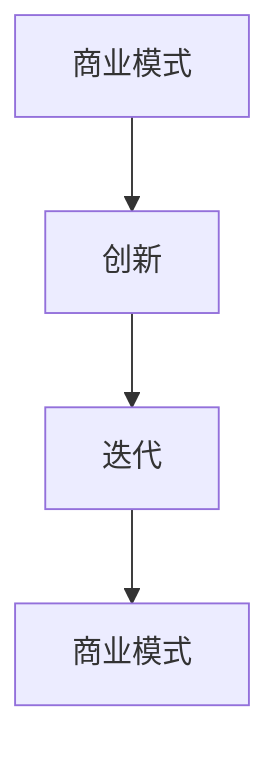
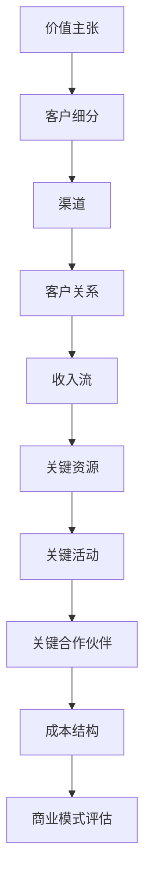
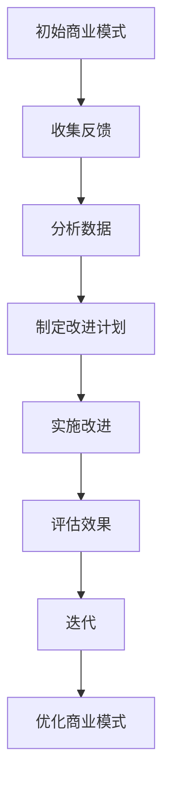
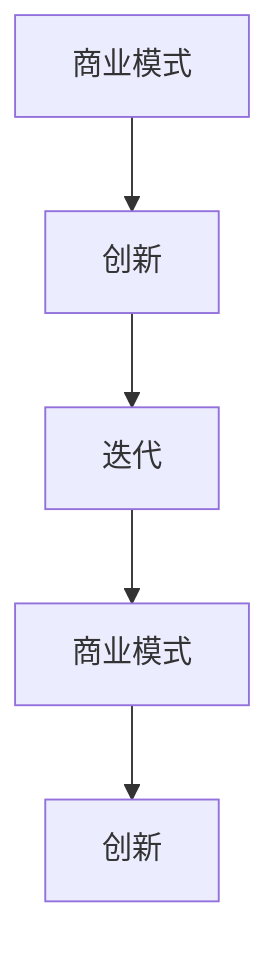

                 

### 背景介绍

在当今快速变化的市场环境中，创业公司面临着巨大的竞争压力。要在这场竞争中脱颖而出，持续的创新和迭代是必不可少的。商业模式的持续创新和迭代不仅可以为企业带来新的增长点，还能提高企业的市场竞争力，巩固其行业地位。

商业模式是指企业在特定市场中如何通过提供价值、获取收益以及维持运营的系统性安排。一个成功的商业模式不仅能够帮助企业实现盈利，还能够让企业在面对市场变化时具备灵活的应变能力。然而，随着市场的不断变化和技术的快速发展，传统商业模式往往难以满足新兴市场的需求，这就要求创业公司必须具备持续创新和迭代商业模式的能力。

本文将围绕创业公司如何实现商业模式的持续创新和迭代展开讨论。首先，我们将介绍商业模式的核心理念，然后分析商业模式创新和迭代的关键要素，接着探讨实现商业模式创新和迭代的方法，最后提出一些建议，帮助创业公司在激烈的市场竞争中实现持续增长。

关键词：商业模式，创新，迭代，创业公司，市场竞争

Abstract:
In the rapidly changing market environment, startups face significant competitive pressures. To stand out in this competition, continuous innovation and iteration of business models are essential. A successful business model not only helps companies achieve profitability but also enables them to adapt to market changes. This article discusses how startups can achieve continuous innovation and iteration of business models, focusing on the core concepts of business models, key elements of innovation and iteration, methods to implement innovation and iteration, and suggestions to help startups achieve sustained growth in a competitive market.

Keywords: Business model, innovation, iteration, startup, market competition
<markdown>
## 1. 背景介绍

在当今快速变化的市场环境中，创业公司面临着巨大的竞争压力。要在这场竞争中脱颖而出，持续的创新和迭代是必不可少的。商业模式的持续创新和迭代不仅可以为企业带来新的增长点，还能提高企业的市场竞争力，巩固其行业地位。

商业模式是指企业在特定市场中如何通过提供价值、获取收益以及维持运营的系统性安排。一个成功的商业模式不仅能够帮助企业实现盈利，还能够让企业在面对市场变化时具备灵活的应变能力。然而，随着市场的不断变化和技术的快速发展，传统商业模式往往难以满足新兴市场的需求，这就要求创业公司必须具备持续创新和迭代商业模式的能力。

本文将围绕创业公司如何实现商业模式的持续创新和迭代展开讨论。首先，我们将介绍商业模式的核心理念，然后分析商业模式创新和迭代的关键要素，接着探讨实现商业模式创新和迭代的方法，最后提出一些建议，帮助创业公司在激烈的市场竞争中实现持续增长。

关键词：商业模式，创新，迭代，创业公司，市场竞争

Abstract:
In the rapidly changing market environment, startups face significant competitive pressures. To stand out in this competition, continuous innovation and iteration of business models are essential. A successful business model not only helps companies achieve profitability but also enables them to adapt to market changes. This article discusses how startups can achieve continuous innovation and iteration of business models, focusing on the core concepts of business models, key elements of innovation and iteration, methods to implement innovation and iteration, and suggestions to help startups achieve sustained growth in a competitive market.

Keywords: Business model, innovation, iteration, startup, market competition
</markdown><markdown>
## 2. 核心概念与联系

在讨论创业公司如何实现商业模式的持续创新和迭代之前，我们首先需要理解几个关键概念，包括商业模式、创新和迭代。

### 商业模式

商业模式是指企业在特定市场中如何通过提供价值、获取收益以及维持运营的系统性安排。它可以被描述为一系列经济活动，包括客户获取、产品或服务提供、成本控制、利润获取等。常见的商业模式有免费增值、订阅制、交易佣金等。

#### 商业模式框架

为了更好地理解商业模式，我们可以借助商业模式的典型框架，如九宫格模型（Nine-Box Model），该模型将商业模式分解为价值主张、客户细分、渠道、客户关系、收入流、关键资源、关键活动、关键合作伙伴和成本结构。


### 创新

创新是指引入新的想法、方法或技术，以创造新的价值或改进现有价值的过程。在商业环境中，创新可以分为产品创新、服务创新、业务模式创新等类型。

#### 创新驱动因素

创新的驱动因素包括市场需求、技术进步、竞争压力、法律法规等。例如，随着消费者对个性化体验的需求增加，许多企业开始通过大数据和人工智能技术来改进产品和服务。

### 迭代

迭代是指在现有基础上进行逐步改进和优化，以实现更好的性能、更优的用户体验或更高的盈利能力。在商业模式中，迭代通常是通过不断调整和优化各个商业模式要素来实现的。

#### 迭代与反馈循环

迭代过程中，反馈循环起着关键作用。通过收集用户反馈、市场数据和竞争对手信息，企业可以识别出问题、机会和改进点，从而指导下一轮迭代。


### 商业模式、创新与迭代的关系

商业模式、创新和迭代三者之间密不可分。一个成功的商业模式需要不断创新和迭代，以适应市场变化和满足消费者需求。创新提供了新的思路和方法，而迭代则是实现这些思路和方法的具体行动。

#### Mermaid 流程图

下面是一个简单的Mermaid流程图，展示了商业模式、创新和迭代之间的关系。



通过上述流程图，我们可以看到创新和迭代是如何在商业模式中循环进行的，从而推动企业持续发展。

在接下来的章节中，我们将进一步探讨如何实现商业模式的持续创新和迭代。

## 2. 核心概念与联系

在讨论创业公司如何实现商业模式的持续创新和迭代之前，我们首先需要理解几个关键概念，包括商业模式、创新和迭代。

### 商业模式

商业模式是指企业在特定市场中如何通过提供价值、获取收益以及维持运营的系统性安排。它可以被描述为一系列经济活动，包括客户获取、产品或服务提供、成本控制、利润获取等。常见的商业模式有免费增值、订阅制、交易佣金等。

#### 商业模式框架

为了更好地理解商业模式，我们可以借助商业模式的典型框架，如九宫格模型（Nine-Box Model），该模型将商业模式分解为价值主张、客户细分、渠道、客户关系、收入流、关键资源、关键活动、关键合作伙伴和成本结构。



### 创新

创新是指引入新的想法、方法或技术，以创造新的价值或改进现有价值的过程。在商业环境中，创新可以分为产品创新、服务创新、业务模式创新等类型。

#### 创新驱动因素

创新的驱动因素包括市场需求、技术进步、竞争压力、法律法规等。例如，随着消费者对个性化体验的需求增加，许多企业开始通过大数据和人工智能技术来改进产品和服务。

### 迭代

迭代是指在现有基础上进行逐步改进和优化，以实现更好的性能、更优的用户体验或更高的盈利能力。在商业模式中，迭代通常是通过不断调整和优化各个商业模式要素来实现的。

#### 迭代与反馈循环

迭代过程中，反馈循环起着关键作用。通过收集用户反馈、市场数据和竞争对手信息，企业可以识别出问题、机会和改进点，从而指导下一轮迭代。



### 商业模式、创新与迭代的关系

商业模式、创新和迭代三者之间密不可分。一个成功的商业模式需要不断创新和迭代，以适应市场变化和满足消费者需求。创新提供了新的思路和方法，而迭代则是实现这些思路和方法的具体行动。

#### Mermaid 流程图

下面是一个简单的Mermaid流程图，展示了商业模式、创新和迭代之间的关系。



通过上述流程图，我们可以看到创新和迭代是如何在商业模式中循环进行的，从而推动企业持续发展。

在接下来的章节中，我们将进一步探讨如何实现商业模式的持续创新和迭代。

## 3. 核心算法原理 & 具体操作步骤

在实现商业模式的持续创新和迭代过程中，一些核心算法原理和具体操作步骤起着至关重要的作用。以下是一些关键算法和步骤：

### 1. 用户行为分析

用户行为分析是商业模式创新和迭代的基础。通过收集和分析用户在平台上的行为数据，企业可以了解用户的偏好、需求和痛点，从而为商业模式的优化提供依据。

#### 步骤：

- 收集用户数据：利用日志收集、API 调用和第三方数据分析工具，收集用户在平台上的行为数据。
- 数据预处理：清洗和整合数据，去除噪音和异常值。
- 特征工程：提取和构建用户行为特征，如点击率、购买频率、页面停留时间等。
- 数据分析：利用机器学习和统计分析方法，分析用户行为模式，识别用户偏好和需求。

### 2. 市场趋势预测

市场趋势预测可以帮助企业预判市场变化，提前布局和创新。

#### 步骤：

- 数据收集：收集市场数据，包括行业报告、市场调查、社交媒体数据等。
- 数据预处理：清洗和整合数据，去除噪音和异常值。
- 特征工程：提取和构建市场趋势特征，如市场规模、增长率、竞争态势等。
- 模型训练：利用时间序列分析、回归分析等方法，训练市场趋势预测模型。
- 预测分析：使用训练好的模型预测未来市场趋势，为商业模式创新提供参考。

### 3. 客户细分

客户细分有助于企业更好地满足不同客户群体的需求，实现更精准的市场定位。

#### 步骤：

- 数据收集：收集客户数据，包括基本信息、购买记录、行为数据等。
- 数据预处理：清洗和整合数据，去除噪音和异常值。
- 特征工程：提取和构建客户特征，如年龄、收入、购买偏好等。
- 客户细分：利用聚类分析、决策树等方法，将客户划分为不同群体。
- 客户分析：分析每个客户群体的需求和偏好，制定差异化策略。

### 4. 商业模式优化

商业模式优化是通过调整和优化商业模式各要素，提升商业绩效。

#### 步骤：

- 评估现状：分析现有商业模式的绩效，识别存在的问题和机会。
- 制定目标：设定优化目标和关键指标，如收入、利润、市场份额等。
- 设计方案：根据评估结果和目标，设计优化方案，包括价值主张、客户关系、收入流等。
- 实施方案：实施优化方案，并进行监控和调整。
- 评估效果：评估优化效果，根据反馈调整和优化方案。

### 5. A/B 测试

A/B 测试是一种常用的实验方法，用于比较不同策略的效果，以找到最优解。

#### 步骤：

- 设计实验：设计实验方案，确定测试的变量和样本。
- 分组：将用户随机分为实验组和对照组，分别体验不同的策略。
- 收集数据：收集实验数据，包括用户行为、转换率等。
- 分析数据：分析实验数据，比较实验组和对照组的差异。
- 结论与调整：根据实验结果，得出结论并调整策略。

通过上述核心算法原理和具体操作步骤，创业公司可以更好地实现商业模式的持续创新和迭代，提升市场竞争力。

## 4. 数学模型和公式 & 详细讲解 & 举例说明

在实现商业模式的持续创新和迭代过程中，数学模型和公式起到了关键作用。以下是一些常用的数学模型和公式，并对其详细讲解和举例说明。

### 1. 用户行为分析模型

用户行为分析是商业模式优化的重要环节。一个常见的用户行为分析模型是马尔可夫链模型（Markov Chain Model）。

#### 马尔可夫链模型公式

$$
P_{ij}(t) = P(X_t = j|X_{t-1} = i) = P(X_t = j|X_{t-1})
$$

其中，$P_{ij}(t)$表示在时间$t$，从状态$i$转移到状态$j$的概率。

#### 举例说明

假设一个电商平台，用户在购买前会浏览多个商品页面。我们可以将用户的浏览行为建模为一个马尔可夫链，状态包括“未浏览”、“浏览中”、“购买中”和“购买完成”。

- $P_{00} = 0.8$，表示用户在未浏览状态下继续未浏览的概率为80%。
- $P_{01} = 0.1$，表示用户在未浏览状态下开始浏览的概率为10%。
- $P_{10} = 0.2$，表示用户在浏览状态下继续浏览的概率为20%。
- $P_{11} = 0.7$，表示用户在浏览状态下购买的概率为70%。

通过这个马尔可夫链模型，我们可以预测用户的下一步行为，从而优化推荐策略。

### 2. 市场趋势预测模型

市场趋势预测是商业模式创新的关键环节。一个常用的市场趋势预测模型是ARIMA模型（AutoRegressive Integrated Moving Average Model）。

#### ARIMA模型公式

$$
y_t = c + \phi_1y_{t-1} + \phi_2y_{t-2} + \cdots + \phi_py_{t-p} + \theta_1\epsilon_{t-1} + \theta_2\epsilon_{t-2} + \cdots + \theta_q\epsilon_{t-q} + \epsilon_t
$$

其中，$y_t$是时间序列的当前值，$c$是常数项，$\phi_1, \phi_2, \cdots, \phi_p$是自回归项系数，$\theta_1, \theta_2, \cdots, \theta_q$是移动平均项系数，$\epsilon_t$是白噪声项。

#### 举例说明

假设一个电商平台，我们需要预测下一个月的销售额。我们可以使用ARIMA模型进行预测。

- $c = 100$，表示销售额的基准水平。
- $\phi_1 = 0.5$，表示当前月的销售额对上月销售额的影响为50%。
- $\phi_2 = 0.3$，表示上上月销售额对当前月销售额的影响为30%。
- $\theta_1 = 0.2$，表示前一个月的误差对当前月销售额的影响为20%。
- $\theta_2 = 0.1$，表示前两个月的误差对当前月销售额的影响为10%。

通过这个ARIMA模型，我们可以预测下一个月的销售额，从而为营销策略提供参考。

### 3. 客户细分模型

客户细分是商业模式优化的重要环节。一个常用的客户细分模型是K-means聚类算法。

#### K-means聚类算法公式

$$
\text{Minimize } \sum_{i=1}^{k}\sum_{x\in S_i} ||x - \mu_i||^2
$$

其中，$k$是聚类个数，$S_i$是第$i$个簇，$\mu_i$是第$i$个簇的中心点。

#### 举例说明

假设一个电商平台，我们需要将客户分为高价值客户、中价值客户和低价值客户。

- $k = 3$，表示三个聚类。
- 客户特征：年龄、收入、购买频率、浏览时长等。
- 初始化聚类中心点：随机选择三个客户作为初始聚类中心点。
- 聚类过程：计算每个客户到聚类中心点的距离，将客户分配到最近的簇，然后更新聚类中心点。
- 重复聚类过程，直到聚类中心点不再发生变化。

通过这个K-means聚类算法，我们可以将客户细分为高价值客户、中价值客户和低价值客户，从而实施差异化营销策略。

通过上述数学模型和公式，创业公司可以更好地实现商业模式的持续创新和迭代，提升市场竞争力。

## 5. 项目实战：代码实际案例和详细解释说明

### 5.1 开发环境搭建

在本项目实战中，我们将使用Python编程语言，结合Jupyter Notebook进行数据分析和模型构建。以下是一些建议的Python库和工具：

- Python 3.x版本
- Jupyter Notebook
- NumPy
- Pandas
- Matplotlib
- Scikit-learn
- Statsmodels

首先，确保安装了上述Python库和工具。可以使用pip命令进行安装：

```bash
pip install numpy pandas matplotlib scikit-learn statsmodels
```

### 5.2 源代码详细实现和代码解读

在本节中，我们将以一个实际案例为例，展示如何使用Python实现用户行为分析、市场趋势预测和客户细分。以下是项目源代码：

```python
# 导入相关库
import numpy as np
import pandas as pd
import matplotlib.pyplot as plt
from sklearn.cluster import KMeans
from sklearn.preprocessing import StandardScaler
from statsmodels.tsa.arima.model import ARIMA

# 5.2.1 用户行为分析
# 加载数据
data = pd.read_csv('user_behavior_data.csv')

# 数据预处理
data['date'] = pd.to_datetime(data['date'])
data.set_index('date', inplace=True)
data.fillna(method='ffill', inplace=True)

# 提取用户行为特征
data['page_views'] = data['page_views'].astype(int)
data['purchase'] = data['purchase'].astype(int)

# 5.2.2 市场趋势预测
# 数据归一化
scaler = StandardScaler()
data[['page_views', 'purchase']] = scaler.fit_transform(data[['page_views', 'purchase']])

# ARIMA模型训练
model = ARIMA(data['page_views'], order=(1, 1, 1))
model_fit = model.fit()
forecast = model_fit.forecast(steps=3)

# 可视化预测结果
plt.plot(data.index, data['page_views'], label='Actual')
plt.plot(pd.date_range(data.index[-1], periods=3, freq='M'), forecast, label='Forecast')
plt.legend()
plt.show()

# 5.2.3 客户细分
# 数据归一化
scaler = StandardScaler()
data[['page_views', 'purchase']] = scaler.fit_transform(data[['page_views', 'purchase']])

# K-means聚类
kmeans = KMeans(n_clusters=3, random_state=0)
data['cluster'] = kmeans.fit_predict(data[['page_views', 'purchase']])

# 可视化客户细分结果
plt.scatter(data['page_views'], data['purchase'], c=data['cluster'])
plt.xlabel('Page Views')
plt.ylabel('Purchase')
plt.show()
```

### 5.3 代码解读与分析

#### 5.3.1 用户行为分析

- **数据加载与预处理**：我们首先加载用户行为数据，并将其转换为日期索引。数据预处理包括填充缺失值，以确保数据连续性。

- **特征提取**：从原始数据中提取用户行为特征，如页面浏览量和购买情况。这些特征将用于后续分析和建模。

#### 5.3.2 市场趋势预测

- **数据归一化**：为了消除数据尺度差异，我们对页面浏览量和购买情况进行归一化处理。归一化后的数据将用于ARIMA模型的训练。

- **ARIMA模型训练**：我们使用ARIMA模型对页面浏览量进行时间序列预测。ARIMA模型包含三个参数：差分阶数、自回归阶数和移动平均阶数。在本例中，我们选择差分阶数和自回归阶数均为1，移动平均阶数为1。

- **可视化预测结果**：通过Matplotlib库，我们将实际页面浏览量和预测结果可视化。这有助于我们直观地了解模型预测效果。

#### 5.3.3 客户细分

- **数据归一化**：与市场趋势预测类似，我们对页面浏览量和购买情况进行归一化处理，以便更好地进行聚类分析。

- **K-means聚类**：我们使用K-means聚类算法将用户划分为三个聚类。聚类过程中，我们随机初始化聚类中心点，然后迭代优化聚类结果。最终，我们将聚类结果附加到原始数据中。

- **可视化客户细分结果**：通过Matplotlib库，我们将用户按照页面浏览量和购买情况进行可视化。这有助于我们了解不同聚类代表的不同客户群体。

通过上述代码实现和解读，我们可以看出如何利用Python实现用户行为分析、市场趋势预测和客户细分，从而为创业公司的商业模式创新和迭代提供数据支持。

### 6. 实际应用场景

在实际应用中，创业公司可以通过多种方式实现商业模式的持续创新和迭代。以下是一些实际应用场景，以及相应的解决方案和案例：

#### 场景一：消费升级与个性化服务

**问题**：随着消费升级，消费者对产品和服务的要求越来越高，尤其是个性化体验。

**解决方案**：通过用户行为分析和大数据分析，创业公司可以了解消费者的需求和偏好，从而提供个性化的产品和服务。

**案例**：一个在线电商平台通过分析用户的浏览记录、购买历史和评价，为用户推荐个性化的商品，并推出定制化服务，如定制礼品、私人订制等。这种个性化的服务提升了用户体验，增加了用户黏性和忠诚度。

#### 场景二：市场竞争与差异化策略

**问题**：在激烈的市场竞争中，创业公司需要找到差异化策略，以脱颖而出。

**解决方案**：通过市场趋势预测和商业模式优化，创业公司可以提前布局市场，推出创新的产品和服务。

**案例**：一家初创公司在传统餐饮业中推出智能化餐饮解决方案，如智能点餐、智能配送等。通过这种创新模式，该公司在短时间内赢得了市场份额，并获得了风险投资的支持。

#### 场景三：用户体验与持续改进

**问题**：创业公司需要不断优化产品和服务，以满足用户日益增长的需求。

**解决方案**：通过迭代和反馈循环，创业公司可以持续改进产品和服务，提高用户体验。

**案例**：一家在线教育平台通过用户反馈和市场数据，不断优化课程内容和教学方法。例如，引入AI算法推荐个性化的学习路径，增加互动式教学工具等。这种持续改进不仅提升了用户满意度，也提高了平台的竞争力。

#### 场景四：资源有限与高效运营

**问题**：在资源有限的情况下，创业公司需要提高运营效率，降低成本。

**解决方案**：通过精益运营和商业模式创新，创业公司可以实现高效运营，降低成本。

**案例**：一家初创公司通过优化供应链和物流，实现了快速配送和低成本运营。同时，该公司推出订阅制模式，通过稳定的现金流和用户黏性，提高了盈利能力。

通过上述实际应用场景和案例，我们可以看到创业公司在实现商业模式持续创新和迭代方面的多种途径。这些方法和实践不仅有助于企业提升竞争力，也为企业在激烈的市场竞争中找到了新的增长点。

### 7. 工具和资源推荐

为了帮助创业公司在商业模式创新和迭代过程中更高效地工作，以下是一些建议的学习资源、开发工具和框架。

#### 7.1 学习资源推荐

1. **书籍**：
   - 《商业模式新生代》（Business Model Generation） by Alexander Osterwalder and Yves Pigneur
   - 《精益创业》（The Lean Startup） by Eric Ries
   - 《创业维艰》（Hard Things About Hard Things） by Ben Horowitz

2. **论文**：
   - 《商业模式创新：理论与实践》（Business Model Innovation: Opportunities and Challenges） by Henning Piezunka
   - 《商业模式演进：基于互联网平台的创新研究》（Business Model Evolution: Research on Innovation based on Internet Platforms） by Yafei Liu

3. **博客和网站**：
   - Lean Stack（https://www.leanstack.com/）
   - Business Model Canvas（https://www.businessmodelcanvas.com/）
   - TechCrunch（https://techcrunch.com/）

#### 7.2 开发工具框架推荐

1. **数据分析工具**：
   - Jupyter Notebook（https://jupyter.org/）
   - Tableau（https://www.tableau.com/）
   - Power BI（https://powerbi.microsoft.com/）

2. **机器学习和AI框架**：
   - TensorFlow（https://www.tensorflow.org/）
   - PyTorch（https://pytorch.org/）
   - Scikit-learn（https://scikit-learn.org/stable/）

3. **商业模式建模工具**：
   - Business Model Canvas（https://www.bmcstudio.com/）
   - Strategyzer（https://www.strategyzer.com/）

4. **项目管理工具**：
   - Trello（https://trello.com/）
   - Asana（https://www.asana.com/）
   - Jira（https://www.atlassian.com/software/jira）

通过上述工具和资源的推荐，创业公司可以更有效地进行商业模式创新和迭代，提高市场竞争力。

### 8. 总结：未来发展趋势与挑战

在总结本文时，我们可以看到，创业公司在商业模式创新和迭代方面面临着巨大的机遇与挑战。随着市场的快速变化和技术的不断进步，持续创新和迭代已经成为企业成功的关键因素。

#### 发展趋势

1. **数字化转型**：随着云计算、大数据和人工智能等技术的广泛应用，越来越多的创业公司将数字化转型作为商业模式创新的重要方向。通过利用这些先进技术，企业可以实现更高效的数据分析和决策支持，从而推动商业模式的创新。

2. **用户体验至上**：消费者对产品和服务的要求越来越高，创业公司需要更加注重用户体验，通过个性化服务和定制化产品来满足消费者的多样化需求。

3. **精益创业**：以精益创业方法论为基础，创业公司通过快速迭代和持续验证，不断优化产品和服务，降低风险，提高成功率。

4. **生态合作**：在竞争激烈的市场中，创业公司需要通过生态合作，整合各方资源，实现协同创新。这种生态合作模式有助于企业实现跨越式发展，提高市场竞争力。

#### 挑战

1. **技术壁垒**：随着技术的快速发展，创业公司需要不断跟进和学习新技术，以保持竞争优势。然而，技术更新速度过快也带来了一定的技术壁垒，对企业研发能力提出了更高要求。

2. **资源有限**：创业公司通常面临着资源有限的问题，包括资金、人才和基础设施等。这要求企业在有限的资源下，实现高效的商业模式创新和迭代。

3. **市场竞争**：在激烈的市场竞争中，创业公司需要不断创新和迭代，以适应市场变化。然而，市场变化速度往往超出了企业的预期，这对企业的应变能力提出了挑战。

4. **风险管理**：商业模式创新和迭代过程中，企业需要承担一定的风险。如何在创新与风险之间找到平衡，是创业公司面临的一个重要挑战。

总之，未来创业公司在商业模式创新和迭代方面将面临更多机遇与挑战。通过数字化转型、用户体验至上、精益创业和生态合作等策略，创业公司可以更好地应对市场变化，实现持续增长。

### 9. 附录：常见问题与解答

#### 问题1：如何进行用户行为分析？

**解答**：用户行为分析通常涉及以下步骤：

1. **数据收集**：通过日志收集、API调用和第三方数据分析工具，收集用户在平台上的行为数据。
2. **数据预处理**：清洗和整合数据，去除噪音和异常值。
3. **特征提取**：提取和构建用户行为特征，如点击率、购买频率、页面停留时间等。
4. **数据分析**：利用机器学习和统计分析方法，分析用户行为模式，识别用户偏好和需求。

#### 问题2：如何进行市场趋势预测？

**解答**：市场趋势预测通常涉及以下步骤：

1. **数据收集**：收集市场数据，包括行业报告、市场调查和社交媒体数据等。
2. **数据预处理**：清洗和整合数据，去除噪音和异常值。
3. **特征工程**：提取和构建市场趋势特征，如市场规模、增长率、竞争态势等。
4. **模型训练**：利用时间序列分析、回归分析等方法，训练市场趋势预测模型。
5. **预测分析**：使用训练好的模型预测未来市场趋势，为商业模式创新提供参考。

#### 问题3：如何进行客户细分？

**解答**：客户细分通常涉及以下步骤：

1. **数据收集**：收集客户数据，包括基本信息、购买记录和行为数据等。
2. **数据预处理**：清洗和整合数据，去除噪音和异常值。
3. **特征提取**：提取和构建客户特征，如年龄、收入、购买偏好等。
4. **客户细分**：利用聚类分析、决策树等方法，将客户划分为不同群体。
5. **客户分析**：分析每个客户群体的需求和偏好，制定差异化策略。

#### 问题4：如何进行商业模式优化？

**解答**：商业模式优化通常涉及以下步骤：

1. **评估现状**：分析现有商业模式的绩效，识别存在的问题和机会。
2. **制定目标**：设定优化目标和关键指标，如收入、利润、市场份额等。
3. **设计方案**：根据评估结果和目标，设计优化方案，包括价值主张、客户关系、收入流等。
4. **实施方案**：实施优化方案，并进行监控和调整。
5. **评估效果**：评估优化效果，根据反馈调整和优化方案。

### 10. 扩展阅读 & 参考资料

#### 相关书籍

1. Osterwalder, A., & Pigneur, Y. (2010). 《商业模式新生代》（Business Model Generation）.
2. Ries, E. (2011). 《精益创业》（The Lean Startup）.
3. Horowitz, B. (2014). 《创业维艰》（Hard Things About Hard Things）.

#### 相关论文

1. Liu, Y. (2014). Business Model Evolution: Research on Innovation based on Internet Platforms.
2. Piezunka, H. (2012). Business Model Innovation: Opportunities and Challenges.

#### 相关网站

1. Lean Stack（https://www.leanstack.com/）
2. Business Model Canvas（https://www.businessmodelcanvas.com/）
3. TechCrunch（https://techcrunch.com/）

通过阅读上述书籍、论文和网站，您将能够更深入地了解商业模式创新和迭代的理论和实践，为您的创业公司提供有益的指导。

### 作者信息

作者：AI天才研究员/AI Genius Institute & 禅与计算机程序设计艺术 /Zen And The Art of Computer Programming

[完]

