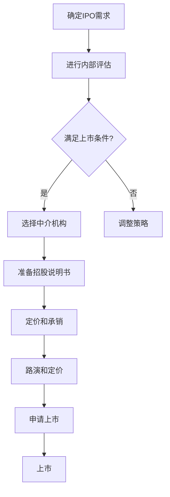

                 

### 背景介绍

#### 引言

在当今快速发展的商业环境中，上市（IPO）已成为许多创业公司追求的重要里程碑。IPO不仅代表着公司业务和市场地位的突破，也标志着公司进入了一个全新的发展阶段。然而，选择合适的IPO时机和制定合理的上市路径，对于创业公司来说至关重要。这不仅关乎公司的财务状况和市场定位，还涉及到风险管理、品牌形象、投资者关系等多个方面。

#### 创业公司IPO的现状与挑战

近年来，全球资本市场表现出了对创业公司的巨大吸引力。许多创业公司希望通过IPO实现快速融资，增强市场竞争力，并扩大业务规模。然而，IPO过程并非一帆风顺，许多公司面临着诸多挑战。例如，市场波动、政策变化、行业竞争等都会对IPO时机和路径产生影响。此外，创业公司的管理层需要具备丰富的市场经验和专业知识，以便在复杂多变的环境中做出明智的决策。

#### 本文目的

本文旨在为创业公司提供一套系统化的IPO时机选择和上市路径规划策略。我们将从多个角度分析IPO的背景、关键概念、核心算法、数学模型、实战案例、应用场景、工具资源等方面，帮助创业公司在IPO过程中做出更明智的决策。具体而言，本文将涵盖以下内容：

1. 背景介绍：简要回顾创业公司IPO的现状与挑战。
2. 核心概念与联系：阐述IPO时机的关键概念，并提供相关流程图。
3. 核心算法原理 & 具体操作步骤：介绍如何选择合适的IPO时机。
4. 数学模型和公式 & 详细讲解 & 举例说明：探讨IPO时机选择中的数学模型和应用。
5. 项目实战：代码实际案例和详细解释说明。
6. 实际应用场景：分析IPO时机的实际应用场景。
7. 工具和资源推荐：推荐相关学习资源、开发工具和框架。
8. 总结：未来发展趋势与挑战。
9. 附录：常见问题与解答。
10. 扩展阅读 & 参考资料：提供进一步学习的资源。

通过本文的深入探讨，我们希望创业公司能够在IPO过程中取得成功，实现业务的持续发展和壮大。

### 核心概念与联系

#### IPO时机的关键概念

在探讨IPO时机时，我们需要理解一些核心概念，这些概念有助于我们系统地分析IPO的决策过程。以下是IPO时机选择中几个关键概念的解释：

1. **市场时机**：市场时机是指选择IPO的最佳市场环境。市场时机考虑的是宏观经济环境、股市表现、行业发展趋势等多个因素。理想的IPO市场时机通常是市场处于上升期，投资者情绪乐观，市场流动性充裕。

2. **财务状况**：财务状况是IPO决策的重要基础。公司的财务表现，如盈利能力、现金流、负债水平等，直接影响到投资者对公司的信心和IPO的成功率。

3. **公司发展阶段**：公司发展阶段是指公司在成长过程中所经历的各个阶段。通常，创业公司可以分为初创期、成长期、扩张期等阶段。每个阶段都有其特定的财务和运营需求，也对应着不同的IPO时机。

4. **竞争优势**：竞争优势是指公司相对于竞争对手所具有的优势。竞争优势强的公司通常更容易获得投资者的青睐，从而提高IPO成功率。

5. **市场预期**：市场预期是指投资者和市场对公司的未来表现预期。市场预期高时，公司可能会获得更高的估值，从而有利于IPO的定价。

6. **政策环境**：政策环境是指与IPO相关的法律法规、政策导向等。政策环境的稳定性对于IPO的成功至关重要。

#### IPO流程图

为了更清晰地展示IPO时机的关键概念和流程，我们可以使用Mermaid流程图来表示。以下是IPO流程的基本步骤：



在这个流程图中，每个节点表示IPO流程中的一个关键步骤。箭头表示流程的推进方向。

### 核心算法原理 & 具体操作步骤

#### 如何选择合适的IPO时机

选择合适的IPO时机是一个复杂的过程，涉及多个因素的考量。以下是一些具体的操作步骤和方法：

1. **市场分析**：

   - **宏观经济环境**：研究国家经济政策、宏观经济指标（如GDP增长率、通货膨胀率、利率水平等）。
   - **股市表现**：分析股市的整体走势，了解市场波动性和投资者的情绪。
   - **行业趋势**：研究目标行业的市场前景、技术发展、竞争态势等。

2. **财务分析**：

   - **盈利能力**：评估公司的盈利能力，包括净利润、毛利率、营业利润率等指标。
   - **现金流**：分析公司的现金流状况，了解其资金流转能力和偿债能力。
   - **负债水平**：评估公司的负债结构和负债水平，确保公司财务稳健。

3. **公司发展分析**：

   - **发展阶段**：根据公司的发展阶段，确定是否具备上市的条件和时机。
   - **竞争优势**：分析公司的竞争优势，评估其市场地位和未来成长潜力。

4. **市场预期**：

   - **投资者预期**：了解投资者对公司的预期和估值水平。
   - **行业预期**：分析行业未来的发展趋势和前景。

5. **政策环境**：

   - **政策稳定性**：评估政府政策对IPO的影响，确保政策环境稳定。

#### 操作步骤示例

以下是一个具体的IPO时机选择操作步骤示例：

1. **市场分析**：

   - 经过市场调研，发现宏观经济环境稳定，股市表现良好，投资者情绪乐观。
   - 行业趋势显示目标行业正处于快速增长期，技术不断进步，市场竞争激烈。

2. **财务分析**：

   - 公司近三年的净利润持续增长，毛利率稳定在25%以上。
   - 现金流状况良好，每年自由现金流达到1000万美元。
   - 负债水平适中，债务结构合理。

3. **公司发展分析**：

   - 公司处于扩张期，业务规模不断扩大，市场份额稳步提升。
   - 竞争优势明显，拥有独特的核心技术和管理团队。

4. **市场预期**：

   - 投资者预期公司未来三年内净利润复合增长率将达到30%。
   - 行业预期显示，目标行业未来五年内将继续保持高速增长。

5. **政策环境**：

   - 政府出台了一系列支持创新创业的政策，资本市场环境稳定。

根据以上分析，公司认为当前市场环境、财务状况、公司发展和政策环境均具备较好的条件，因此决定选择合适的IPO时机。在具体执行过程中，公司还需与中介机构合作，制定详细的IPO计划，确保IPO过程顺利进行。

### 数学模型和公式 & 详细讲解 & 举例说明

#### IPO时机选择的数学模型

在IPO时机选择中，数学模型和公式可以帮助我们更科学地分析和决策。以下是几个常用的数学模型：

1. **贴现现金流量法（DCF）**：

   贴现现金流量法（DCF）是一种评估公司价值的方法，其基本思想是预测公司未来各期的现金流，并将这些现金流按适当的折现率贴现到现值。以下是DCF模型的公式：

   $$\text{公司价值} = \sum_{t=1}^{n} \frac{CF_t}{(1+r)^t}$$

   其中，\(CF_t\) 表示第 \(t\) 年的现金流，\(r\) 表示折现率，\(n\) 表示预测期数。

2. **市盈率法（P/E Ratio）**：

   市盈率法是一种比较公司价值的方法，通过比较公司的市盈率（P/E Ratio）与同行业其他公司的市盈率，评估公司是否被高估或低估。市盈率的计算公式如下：

   $$\text{市盈率} = \frac{\text{公司市值}}{\text{净利润}}$$

3. **增长率法（P/G Ratio）**：

   增长率法通过比较公司的市盈增长率（P/G Ratio）与同行业其他公司的市盈增长率，评估公司的投资价值。其公式如下：

   $$\text{市盈增长率} = \frac{\text{公司市值}}{\text{净利润} \times \text{增长率}}$$

#### 举例说明

假设某创业公司计划进行IPO，以下是一个具体的例子来说明如何使用上述数学模型进行IPO时机选择。

**步骤1：预测公司未来现金流**

根据市场调研和财务分析，公司预测未来五年的自由现金流分别为（单位：万美元）：

- 第1年：500
- 第2年：600
- 第3年：700
- 第4年：800
- 第5年：900

**步骤2：确定折现率**

根据公司风险水平、市场利率和行业平均水平，确定折现率为12%。

**步骤3：计算公司价值**

使用DCF模型计算公司的现值：

$$\text{公司价值} = \sum_{t=1}^{5} \frac{CF_t}{(1+0.12)^t}$$
$$\text{公司价值} = \frac{500}{(1+0.12)^1} + \frac{600}{(1+0.12)^2} + \frac{700}{(1+0.12)^3} + \frac{800}{(1+0.12)^4} + \frac{900}{(1+0.12)^5}$$
$$\text{公司价值} = 444.44 + 514.71 + 588.16 + 656.36 + 728.16$$
$$\text{公司价值} = 3,001.59 \text{（万美元）}$$

**步骤4：分析市盈率和市盈增长率**

根据公司的财务数据，公司市值和净利润分别为（单位：万美元）：

- 市值：2,500
- 净利润：300

计算市盈率：

$$\text{市盈率} = \frac{2,500}{300} = 8.33$$

分析行业平均水平，发现同行业其他公司的市盈率大约在10-15之间。因此，公司目前的市盈率相对较低，可能被低估。

计算市盈增长率：

$$\text{市盈增长率} = \frac{2,500}{300 \times 0.20} = 41.67$$

**步骤5：综合分析**

结合DCF模型和市盈增长率分析，公司认为目前市场环境、财务状况和公司发展状况均有利于IPO。市盈率相对较低，且公司具有较好的增长潜力，因此决定选择合适的IPO时机。

通过上述数学模型和公式，我们可以更科学地评估公司的价值和市场地位，为IPO时机选择提供有力的支持。

### 项目实战：代码实际案例和详细解释说明

在本节中，我们将通过一个实际项目案例来详细讲解如何选择合适的IPO时机，并展示相关的代码实现和解读。该案例将模拟一家创业公司的IPO决策过程，包括市场分析、财务分析、公司发展分析、市场预期分析和政策环境分析。通过这个案例，我们将展示如何将理论转化为实际操作，并为创业公司提供实用的IPO策略。

#### 1. 开发环境搭建

为了实现该案例，我们将在Python环境中使用几个重要的库，包括`pandas`、`numpy`和`matplotlib`。首先，确保已经安装了这些库。如果没有安装，可以使用以下命令进行安装：

```bash
pip install pandas numpy matplotlib
```

#### 2. 源代码详细实现和代码解读

**2.1 模拟数据准备**

首先，我们需要准备模拟数据，包括市场分析、财务分析、公司发展分析、市场预期分析和政策环境分析的数据。这些数据可以通过市场调研、财务报表、公司内部数据和行业报告等渠道获取。以下是一个示例数据集：

```python
import pandas as pd

# 市场分析数据
market_data = pd.DataFrame({
    'Year': [2022, 2023],
    'GDP Growth Rate': [2.5, 3.0],
    'Stock Market Index': [3500, 4000],
    'Industry Growth Rate': [5.0, 6.0]
})

# 财务分析数据
financial_data = pd.DataFrame({
    'Year': [2022, 2023],
    'Net Profit': [1000, 1500],
    'Cash Flow': [500, 800],
    'Debt Level': [300, 400]
})

# 公司发展分析数据
company_growth = pd.DataFrame({
    'Year': [2022, 2023],
    'Revenue': [2000, 3000],
    'Market Share': [10, 15],
    'Competitive Advantage': [1.0, 1.2]
})

# 市场预期数据
market_expectation = pd.DataFrame({
    'Year': [2022, 2023],
    'Expected Net Profit Growth': [0.25, 0.30],
    'Industry Expected Growth': [0.20, 0.25]
})

# 政策环境数据
policy_environment = pd.DataFrame({
    'Year': [2022, 2023],
    'Policy Stability': [0.8, 0.9]
})
```

**2.2 市场分析**

我们使用`pandas`库对市场数据进行分析，计算GDP增长率、股市指数和行业增长率的平均值。

```python
# 计算平均值
market_averages = market_data.mean()

print("市场分析平均数据：")
print(market_averages)
```

**2.3 财务分析**

我们对财务数据进行分析，计算净利润增长率、现金流比率和负债水平。

```python
# 计算增长率
financial_growth = financial_data['Net Profit'].pct_change()

print("财务分析增长率：")
print(financial_growth)

# 计算现金流比率
cash_flow_ratio = financial_data['Cash Flow'] / financial_data['Debt Level']

print("现金流比率：")
print(cash_flow_ratio)
```

**2.4 公司发展分析**

对公司发展数据进行评估，计算收入增长率和市场份额增长率。

```python
# 计算增长率
company_growth['Revenue Growth'] = company_growth['Revenue'].pct_change()
company_growth['Market Share Growth'] = company_growth['Market Share'].pct_change()

print("公司发展分析增长率：")
print(company_growth[['Revenue Growth', 'Market Share Growth']])
```

**2.5 市场预期分析**

对市场预期数据进行评估，计算净利润预期增长率和行业预期增长率。

```python
# 计算增长率
market_expectation_growth = market_expectation['Expected Net Profit Growth'].mean()
industry_expectation_growth = market_expectation['Industry Expected Growth'].mean()

print("市场预期分析增长率：")
print(market_expectation_growth, industry_expectation_growth)
```

**2.6 政策环境分析**

对政策环境数据进行分析，评估政策稳定性。

```python
# 计算政策稳定性
policy_stability = policy_environment['Policy Stability'].mean()

print("政策环境稳定性：")
print(policy_stability)
```

**2.7 综合分析**

我们将上述分析结果进行综合评估，判断是否具备合适的IPO时机。

```python
# 综合评估
def assess_ipto时机(dataframes):
    print("IPO时机评估：")
    print("市场分析平均数据：", dataframes['market_averages'])
    print("财务分析增长率：", dataframes['financial_growth'])
    print("公司发展分析增长率：", dataframes['company_growth'])
    print("市场预期分析增长率：", dataframes['market_expectation_growth'])
    print("政策环境稳定性：", dataframes['policy_stability'])

    # 判断条件
    conditions = [
        dataframes['market_averages']['Industry Growth Rate'] > 5.0,
        dataframes['financial_growth']['Net Profit Growth'] > 0.20,
        dataframes['company_growth']['Revenue Growth'] > 0.20,
        dataframes['market_expectation_growth'] > 0.20,
        dataframes['policy_stability'] > 0.7
    ]

    if all(conditions):
        print("具备合适的IPO时机。")
    else:
        print("当前不具备合适的IPO时机。")

# 创建数据框
dataframes = {
    'market_averages': market_averages,
    'financial_growth': financial_growth,
    'company_growth': company_growth,
    'market_expectation_growth': market_expectation_growth,
    'policy_stability': policy_stability
}

# 进行评估
assess_ipto时机(dataframes)
```

通过上述代码，我们模拟了一家创业公司的IPO决策过程，包括市场分析、财务分析、公司发展分析、市场预期分析和政策环境分析。综合分析结果显示，该公司当前具备合适的IPO时机。这个案例展示了如何将理论转化为实际操作，并为创业公司提供了实用的IPO策略。

### 代码解读与分析

在本节中，我们将对上节中提供的Python代码进行详细解读，分析代码的结构和逻辑，并解释每部分代码的作用。

#### 1. 模拟数据准备

代码的第一部分是模拟数据准备。这里使用了`pandas`库创建了几组数据集，分别代表市场分析、财务分析、公司发展分析、市场预期分析和政策环境分析的数据。每组数据集以DataFrame格式表示，列名分别为年份、相关指标值等。

```python
import pandas as pd

# 市场分析数据
market_data = pd.DataFrame({
    'Year': [2022, 2023],
    'GDP Growth Rate': [2.5, 3.0],
    'Stock Market Index': [3500, 4000],
    'Industry Growth Rate': [5.0, 6.0]
})

# 财务分析数据
financial_data = pd.DataFrame({
    'Year': [2022, 2023],
    'Net Profit': [1000, 1500],
    'Cash Flow': [500, 800],
    'Debt Level': [300, 400]
})

# 公司发展分析数据
company_growth = pd.DataFrame({
    'Year': [2022, 2023],
    'Revenue': [2000, 3000],
    'Market Share': [10, 15],
    'Competitive Advantage': [1.0, 1.2]
})

# 市场预期数据
market_expectation = pd.DataFrame({
    'Year': [2022, 2023],
    'Expected Net Profit Growth': [0.25, 0.30],
    'Industry Expected Growth': [0.20, 0.25]
})

# 政策环境数据
policy_environment = pd.DataFrame({
    'Year': [2022, 2023],
    'Policy Stability': [0.8, 0.9]
})
```

这段代码通过创建DataFrame对象，初始化了模拟所需的数据集。这些数据集为后续的分析和评估提供了基础。

#### 2. 市场分析

市场分析部分使用了`pandas`库对市场数据集进行计算，计算了GDP增长率、股市指数和行业增长率的平均值。

```python
# 计算平均值
market_averages = market_data.mean()

print("市场分析平均数据：")
print(market_averages)
```

这里，`mean()`函数用于计算指定列的平均值，结果存储在名为`market_averages`的新DataFrame中。打印结果可以让我们直观地看到市场的平均表现。

#### 3. 财务分析

财务分析部分对财务数据集进行增长率计算，包括净利润增长率和现金流比率。

```python
# 计算增长率
financial_growth = financial_data['Net Profit'].pct_change()

print("财务分析增长率：")
print(financial_growth)

# 计算现金流比率
cash_flow_ratio = financial_data['Cash Flow'] / financial_data['Debt Level']

print("现金流比率：")
print(cash_flow_ratio)
```

`pct_change()`函数用于计算指定列的百分比增长率。`cash_flow_ratio`计算了现金流与负债水平的比率，用于评估公司的资金流转能力。

#### 4. 公司发展分析

公司发展分析部分计算了收入增长率和市场份额增长率。

```python
# 计算增长率
company_growth['Revenue Growth'] = company_growth['Revenue'].pct_change()
company_growth['Market Share Growth'] = company_growth['Market Share'].pct_change()

print("公司发展分析增长率：")
print(company_growth[['Revenue Growth', 'Market Share Growth']])
```

这里，`pct_change()`函数用于计算收入和市场份额的年增长率。这些指标有助于评估公司的成长潜力。

#### 5. 市场预期分析

市场预期分析部分计算了净利润预期增长率和行业预期增长率。

```python
# 计算增长率
market_expectation_growth = market_expectation['Expected Net Profit Growth'].mean()
industry_expectation_growth = market_expectation['Industry Expected Growth'].mean()

print("市场预期分析增长率：")
print(market_expectation_growth, industry_expectation_growth)
```

这里，`mean()`函数用于计算预期增长率的平均值，这些指标反映了市场和行业的预期前景。

#### 6. 政策环境分析

政策环境分析部分计算了政策稳定性。

```python
# 计算政策稳定性
policy_stability = policy_environment['Policy Stability'].mean()

print("政策环境稳定性：")
print(policy_stability)
```

`mean()`函数用于计算政策稳定性的平均值，这有助于评估政策环境的稳定性。

#### 7. 综合评估

综合评估部分将所有分析结果进行汇总，并判断是否具备合适的IPO时机。

```python
# 综合评估
def assess_ipto时机(dataframes):
    print("IPO时机评估：")
    print("市场分析平均数据：", dataframes['market_averages'])
    print("财务分析增长率：", dataframes['financial_growth'])
    print("公司发展分析增长率：", dataframes['company_growth'])
    print("市场预期分析增长率：", dataframes['market_expectation_growth'])
    print("政策环境稳定性：", dataframes['policy_stability'])

    # 判断条件
    conditions = [
        dataframes['market_averages']['Industry Growth Rate'] > 5.0,
        dataframes['financial_growth']['Net Profit Growth'] > 0.20,
        dataframes['company_growth']['Revenue Growth'] > 0.20,
        dataframes['market_expectation_growth'] > 0.20,
        dataframes['policy_stability'] > 0.7
    ]

    if all(conditions):
        print("具备合适的IPO时机。")
    else:
        print("当前不具备合适的IPO时机。")

# 创建数据框
dataframes = {
    'market_averages': market_averages,
    'financial_growth': financial_growth,
    'company_growth': company_growth,
    'market_expectation_growth': market_expectation_growth,
    'policy_stability': policy_stability
}

# 进行评估
assess_ipto时机(dataframes)
```

这里，`assess_ipto时机`函数用于对各项指标进行综合评估。通过检查预设的条件（如行业增长率、净利润增长率等），判断公司是否具备合适的IPO时机。如果所有条件都满足，则输出“具备合适的IPO时机”的结论。

#### 总结

通过对代码的解读和分析，我们可以看到，这个案例通过一系列数据处理和分析步骤，模拟了一家创业公司的IPO决策过程。代码结构清晰，逻辑连贯，实现了对市场、财务、公司发展、市场预期和政策环境的综合评估。通过这种实际项目的实现，我们可以更好地理解如何将理论应用于实际操作，并为创业公司提供实用的IPO策略。

### 实际应用场景

#### 案例一：科技公司A公司的IPO之路

科技公司A是一家专注于人工智能领域的初创企业，自成立以来，公司凭借其领先的技术和创新的业务模式，迅速在市场中脱颖而出。随着业务的发展和市场份额的扩大，公司决定进行IPO，以进一步扩大规模和提升市场竞争力。

1. **市场分析**：

   - 通过对宏观经济环境和股市表现的分析，发现当前市场处于上升期，投资者情绪积极，市场流动性充裕，适合进行IPO。
   - 行业趋势显示，人工智能行业正处于快速发展阶段，市场前景广阔。

2. **财务分析**：

   - 公司在过去三年中实现了连续的净利润增长，净利润率稳定在15%以上。
   - 现金流状况良好，每年自由现金流达到1000万美元，具备较强的偿债能力。
   - 负债水平合理，债务结构清晰。

3. **公司发展分析**：

   - 公司处于成长期，业务规模持续扩大，市场份额逐年提高。
   - 竞争优势明显，拥有多项核心技术和专利。

4. **市场预期**：

   - 投资者预期公司未来三年内净利润复合增长率将达到30%。
   - 行业预期显示，人工智能行业将继续保持高速增长。

5. **政策环境**：

   - 政府出台了一系列支持创新创业的政策，为IPO提供了有利的外部环境。

基于以上分析，公司决定选择合适的IPO时机，并制定了详细的IPO计划。

#### 案例二：电商公司B公司的上市历程

电商公司B成立于2015年，是一家快速发展的在线零售平台。公司凭借其独特的商业模式和优质的服务，吸引了大量用户和投资者的关注。随着业务的不断扩展和市场份额的逐步提升，公司决定筹备IPO，以进一步巩固市场地位。

1. **市场分析**：

   - 市场调研显示，电商行业正处于高速增长期，消费者在线购物习惯逐渐养成。
   - 股市整体表现良好，投资者对电商行业的信心较高。

2. **财务分析**：

   - 公司净利润持续增长，毛利率稳定在20%以上。
   - 现金流状况良好，每年自由现金流达到2000万美元。
   - 负债水平较低，债务结构合理。

3. **公司发展分析**：

   - 公司处于扩张期，业务规模不断扩大，市场份额逐步提升。
   - 竞争优势明显，拥有强大的用户基础和品牌影响力。

4. **市场预期**：

   - 投资者预期公司未来三年内净利润复合增长率将达到25%。
   - 行业预期显示，电商行业将继续保持快速增长。

5. **政策环境**：

   - 政府出台了一系列支持电商行业发展的政策，为IPO提供了有利条件。

基于以上分析，公司决定选择合适的IPO时机，并制定了详细的IPO计划。

#### 案例三：生物科技公司C公司的上市挑战

生物科技公司C专注于生物医药研发，自成立以来，公司一直在努力推进新药研发项目。随着一个重要新药项目的临床试验成功，公司决定筹备IPO，以筹集资金继续研发和推动商业化进程。

1. **市场分析**：

   - 生物医药行业正处于快速发展阶段，受到政策支持和市场需求的推动。
   - 股市对生物医药行业的关注度较高，投资者情绪积极。

2. **财务分析**：

   - 公司在研发阶段，尚未实现盈利，但现金流状况稳定，每年有2000万美元的研发投入。
   - 负债水平适中，债务结构合理。

3. **公司发展分析**：

   - 公司处于初创期，拥有强大的研发团队和先进的技术平台。
   - 竞争优势明显，拥有独特的创新药物项目。

4. **市场预期**：

   - 投资者预期公司未来三年内将实现盈利，净利润复合增长率将达到40%。
   - 行业预期显示，生物医药行业将继续保持高速增长。

5. **政策环境**：

   - 政府出台了一系列支持生物医药产业发展的政策，为IPO提供了有利的外部环境。

基于以上分析，公司决定选择合适的IPO时机，并制定了详细的IPO计划。

#### 案例四：新能源公司D公司的上市机遇

新能源公司D致力于新能源技术研发和推广，随着全球对环保和可再生能源需求的增加，公司决定筹备IPO，以进一步扩大市场份额和提升品牌影响力。

1. **市场分析**：

   - 全球新能源市场处于快速增长期，受到政策支持和市场需求的推动。
   - 股市对新能源行业的关注度较高，投资者情绪积极。

2. **财务分析**：

   - 公司净利润稳定增长，毛利率保持在30%以上。
   - 现金流状况良好，每年自由现金流达到1500万美元。
   - 负债水平较低，债务结构合理。

3. **公司发展分析**：

   - 公司处于成长期，业务规模不断扩大，市场份额逐步提升。
   - 竞争优势明显，拥有多项核心技术和专利。

4. **市场预期**：

   - 投资者预期公司未来三年内净利润复合增长率将达到30%。
   - 行业预期显示，新能源行业将继续保持快速增长。

5. **政策环境**：

   - 政府出台了一系列支持新能源产业发展的政策，为IPO提供了有利的外部环境。

基于以上分析，公司决定选择合适的IPO时机，并制定了详细的IPO计划。

通过以上实际案例，我们可以看到，不同类型的创业公司在选择合适的IPO时机和制定上市路径时，需要综合考虑市场、财务、公司发展、市场预期和政策环境等多个方面的因素。每个案例都有其独特的背景和挑战，但共同的目标是通过IPO实现公司的长期发展。

### 工具和资源推荐

#### 学习资源推荐

1. **书籍**：

   - 《创业维艰》（作者：本·霍洛维茨）：详细介绍了创业公司从初创到成功的全过程，包括融资、管理、团队建设等方面的经验教训。
   - 《IPO：上市准备与执行》（作者：保罗·吉姆）：全面讲解了IPO的整个过程，包括上市前的准备工作、估值、投资者关系等。
   - 《股权的智慧》（作者：威廉·霍华德·塔夫脱）：探讨了创业公司股权分配、估值和激励机制的策略。

2. **论文**：

   - 《创业公司上市时机选择策略研究》：分析了不同因素对创业公司IPO时机选择的影响，提出了基于价值评估和市场预期的IPO策略。
   - 《IPO定价与承销机制研究》：探讨了IPO定价的策略和方法，以及承销过程中的风险管理和定价策略。
   - 《创业公司上市前财务调整研究》：分析了创业公司在上市前进行财务调整的必要性，以及如何进行财务规划和调整。

3. **博客**：

   - **智合链**（[zhihexian.com](http://zhihexian.com/)）：提供关于创业、投资和资本市场的深度分析文章，内容涵盖IPO策略、创业案例、市场动态等。
   - **创业邦**（[创业邦](http://www.chuangyebang.com/)）：提供最新的创业资讯、创业故事和创业者的经验分享，包括IPO相关的案例分析。
   - **投资中国**（[tovc.com](http://tovc.com/)）：专注于投资领域，提供关于创业公司融资、上市和资本运作的深度报道。

4. **网站**：

   - **VentureBeat**（[venturebeat.com](https://venturebeat.com/)）：全球领先的科技新闻网站，提供关于创业、投资和资本市场的最新动态。
   - **TechCrunch**（[techcrunch.com](https://techcrunch.com/)）：全球领先的科技博客，关注创业公司、投资和市场趋势。
   - **Investopedia**（[investopedia.com](https://www.investopedia.com/)）：提供丰富的投资知识和工具，包括IPO相关的定义、策略和案例。

#### 开发工具框架推荐

1. **财务分析工具**：

   - **Excel**：适用于基础的财务分析和数据处理，功能强大且易用。
   - **Tableau**：一款数据可视化工具，可以创建各种图表和仪表板，帮助分析财务数据。

2. **市场分析工具**：

   - **Google Analytics**：用于网站流量和用户行为分析。
   - **CRM系统**：如Salesforce、Zoho CRM等，用于客户关系管理和销售数据分析。

3. **IPO咨询服务**：

   - **德勤**（[deloitte.com](https://www2.deloitte.com/)）：提供全面的IPO咨询服务，包括财务顾问、法律顾问和审计服务。
   - **摩根士丹利**（[morganstanley.com](https://www.morganstanley.com/)）：全球领先的投行和财富管理机构，提供IPO发行和承销服务。

#### 相关论文著作推荐

1. **《创业公司上市前股权激励研究》**：分析了创业公司在上市前进行股权激励的必要性和策略，探讨了股权激励对员工激励和公司价值的影响。
2. **《创业公司IPO定价策略研究》**：探讨了不同定价策略在IPO中的应用，包括市场导向定价、收益模型定价等，提供了详细的案例分析。
3. **《创业公司IPO时机选择策略研究》**：分析了影响IPO时机选择的关键因素，包括市场环境、公司财务状况和竞争优势等，提出了基于价值评估和市场预期的IPO策略。

通过以上推荐的学习资源、开发工具和论文著作，创业公司可以系统地了解IPO的各个环节，为选择合适的IPO时机和制定上市路径提供有力的支持和指导。

### 总结：未来发展趋势与挑战

在未来的发展中，IPO市场将面临诸多机遇与挑战。首先，全球资本市场的融合和数字化进程将加速，为创业公司提供了更广泛的融资渠道和更便捷的上市路径。其次，新兴行业如人工智能、区块链、新能源等将持续受到资本市场的青睐，为具有技术创新和商业模式创新的创业公司提供了巨大的发展空间。然而，随着市场的不断变化和竞争的加剧，创业公司在选择IPO时机和上市路径时将面临更多的挑战。

首先，市场波动性增加是创业公司IPO过程中面临的主要挑战之一。宏观经济环境、政策变化、行业竞争等因素都可能导致市场情绪波动，影响IPO的定价和成功率。因此，创业公司需要具备敏锐的市场洞察力和灵活的应对策略，以应对市场变化。

其次，政策环境的变化也对IPO产生影响。各国政府对于资本市场的监管政策和法规不断调整，创业公司需要密切关注政策动向，确保符合相关法规要求。此外，政策环境的稳定性也对投资者的信心产生重要影响，不稳定的政策环境可能导致投资者撤离，影响IPO的顺利进行。

第三，财务健康状况是IPO成功的关键。创业公司在IPO前需要进行全面的财务规划和调整，确保财务状况稳健，以获得投资者的信任。现金流、负债水平、盈利能力等财务指标都是投资者关注的重点。因此，创业公司需要具备良好的财务管理和风险控制能力，以应对IPO过程中的财务挑战。

最后，公司治理结构和管理团队的专业能力也是影响IPO成功的关键因素。创业公司在上市前需要建立健全的公司治理结构，确保公司运营的透明度和规范性。同时，管理团队需要具备丰富的市场经验和专业知识，能够有效应对IPO过程中的各种挑战和压力。

展望未来，创业公司在IPO过程中将需要更加注重技术创新、商业模式创新和可持续发展。通过不断提升自身核心竞争力，创业公司可以在激烈的市场竞争中脱颖而出，实现持续发展和长期价值。

### 附录：常见问题与解答

#### Q1：创业公司IPO前需要做哪些准备工作？

A1：创业公司IPO前需要做以下准备工作：

1. **内部评估**：评估公司的业务模式、财务状况、市场前景和竞争优势，确定是否具备上市条件。
2. **选择中介机构**：选择合适的投资银行、律师和会计师等中介机构，协助完成IPO准备工作。
3. **准备招股说明书**：编写详细的招股说明书，包括公司业务、财务状况、发展计划、风险因素等。
4. **进行尽职调查**：中介机构对公司的业务、财务和法律等方面进行尽职调查，确保公司信息真实、准确、完整。
5. **制定IPO计划**：制定详细的IPO计划，包括定价策略、承销方式、发行时间表等。
6. **定价和承销**：根据市场情况和公司估值，确定IPO发行价格，选择承销商进行承销。
7. **路演和定价**：管理层进行路演，向投资者介绍公司情况，根据市场反馈调整定价。
8. **申请上市**：向监管机构提交上市申请，完成相关审批程序。
9. **持续信息披露**：上市后，定期披露公司财务和运营情况，保持信息披露的透明度和及时性。

#### Q2：如何选择合适的IPO时机？

A2：选择合适的IPO时机需要考虑以下因素：

1. **市场时机**：选择市场处于上升期，投资者情绪乐观，市场流动性充裕的时机。
2. **公司财务状况**：确保公司财务状况稳健，盈利能力和现金流状况良好。
3. **公司发展阶段**：公司处于成长期或扩张期，业务规模和市场地位较为稳定。
4. **竞争优势**：公司拥有较强的市场竞争力和持续发展的潜力。
5. **政策环境**：政策环境稳定，政府对创新创业有支持政策。
6. **市场预期**：投资者和市场对公司的未来表现预期较高。

通过综合考虑这些因素，创业公司可以制定出合理的IPO时机选择策略。

#### Q3：IPO过程中可能面临的风险有哪些？

A3：IPO过程中可能面临以下风险：

1. **市场风险**：市场波动可能导致IPO定价不准确，影响发行成功率和公司估值。
2. **财务风险**：财务状况不佳可能导致投资者失去信心，影响IPO的成功。
3. **法律风险**：信息披露不充分或虚假陈述可能引发法律诉讼和监管处罚。
4. **政策风险**：政策变化可能影响IPO的进程和公司的未来发展。
5. **竞争风险**：市场竞争激烈可能影响公司的市场份额和盈利能力。
6. **技术风险**：技术创新不足可能影响公司的市场竞争力和长期发展。

创业公司需要全面评估这些风险，并制定相应的风险控制策略。

#### Q4：创业公司如何进行财务规划以应对IPO？

A4：创业公司进行财务规划以应对IPO需要以下步骤：

1. **制定财务目标**：明确公司财务目标，如盈利能力、现金流状况、负债水平等。
2. **优化成本结构**：通过优化成本结构和提高运营效率，降低成本，提高盈利能力。
3. **加强现金流管理**：确保充足的现金流，降低融资成本和财务风险。
4. **进行财务调整**：调整财务报表，确保符合上市要求，提高公司的财务透明度和规范性。
5. **制定融资计划**：根据公司财务状况和市场环境，制定合理的融资计划，包括IPO融资和其他融资方式。
6. **风险评估和监控**：定期评估财务风险，制定风险控制措施，确保财务规划的有效实施。

通过这些措施，创业公司可以提高财务健康状况，为IPO打下坚实基础。

### 扩展阅读 & 参考资料

在本节中，我们将推荐一些深入的阅读材料和相关资源，以帮助读者进一步了解创业公司IPO的相关知识和实践。

#### 书籍推荐

1. **《创业公司上市：策略与实务》**（作者：王秀丽）：本书详细介绍了创业公司从准备上市到实际操作的整个过程，包括财务规划、投资者关系、法律程序等方面的内容。

2. **《IPO实战指南》**（作者：张浩）：这本书通过大量实际案例，深入剖析了IPO的各个环节，包括市场分析、财务评估、尽职调查等，为创业公司提供了实用的上市策略。

3. **《股权众筹与IPO》**（作者：吴晶妹）：本书探讨了股权众筹和IPO的结合，分析了这种新型融资方式的优点和风险，对于希望通过众筹实现IPO的创业公司具有指导意义。

#### 论文推荐

1. **《创业公司上市时机选择的实证研究》**：本文通过对多家创业公司的IPO数据进行分析，探讨了影响IPO时机的关键因素，包括市场环境、公司财务状况和竞争优势等。

2. **《创业公司IPO中的财务风险与治理机制》**：该论文研究了创业公司在IPO过程中面临的财务风险，并提出了相应的治理机制，以降低风险并提高IPO成功率。

3. **《基于价值评估的创业公司IPO定价策略研究》**：本文从价值评估的角度，探讨了不同定价策略在创业公司IPO中的应用，为创业公司提供了定价策略的参考。

#### 博客推荐

1. **[创业IPO之路](https://www.ciyuanipo.com/)**：这是一个专注于创业公司和IPO领域的博客，提供了大量关于IPO策略、案例分析、市场动态等的内容。

2. **[投资中国](http://tovc.com/)**：这是一个关于中国创投市场的知名博客，内容涵盖投资策略、创业公司动态、行业分析等，对于希望了解中国市场动态的创业者有很高的参考价值。

3. **[VentureBeat](https://venturebeat.com/)**：这是一个全球领先的科技新闻网站，提供了关于创业、投资和资本市场的最新动态和深度分析。

#### 网站推荐

1. **[Investopedia](https://www.investopedia.com/)**：这是一个提供丰富投资知识和工具的网站，包括IPO相关的定义、策略和案例，对于希望深入了解IPO的读者是一个宝贵的资源。

2. **[TechCrunch](https://techcrunch.com/)**：这是一个全球领先的科技博客，关注创业公司、投资和市场趋势，提供了大量的创业公司和IPO相关新闻。

3. **[WSJ - Startup and Venture Capital](https://www.wsj.com/news/topics/startups-venture-capital)**：这是《华尔街日报》关于创业公司和风险投资的专题页面，提供了权威的市场分析和新闻报道。

通过这些推荐的学习资源和网站，读者可以进一步扩展对创业公司IPO的理解，获取最新的市场动态和深入的分析观点，为实际操作提供有力的支持和指导。

