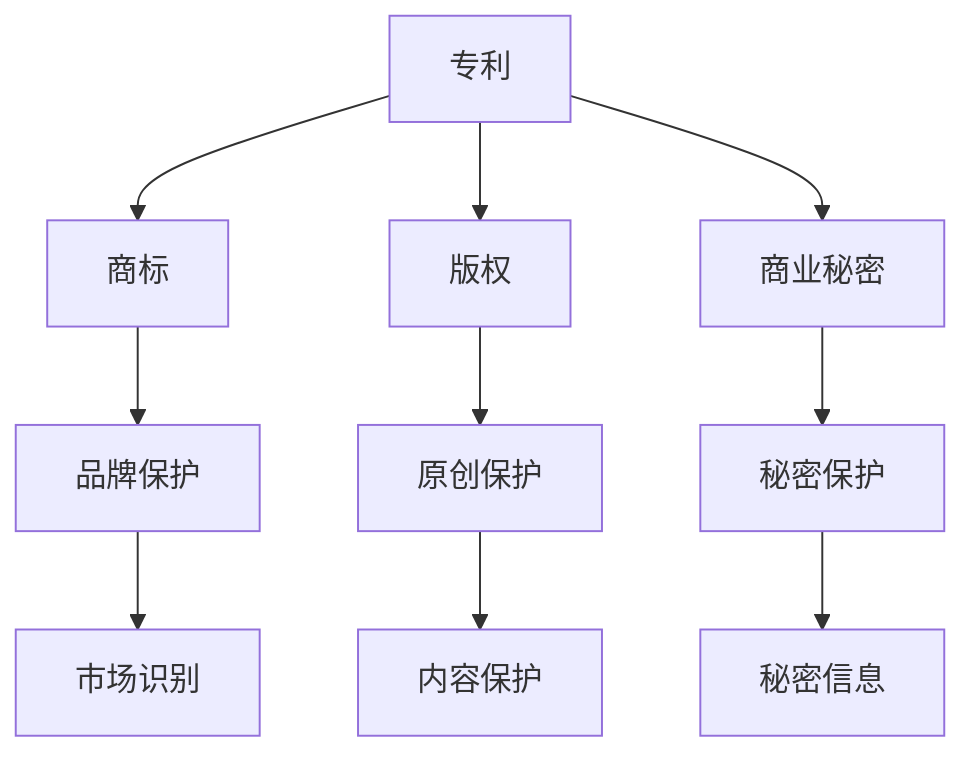

                 

### 背景介绍

在当今快速发展的商业环境中，创业公司无疑面临着前所未有的挑战与机遇。知识产权（Intellectual Property，简称IP）作为一种无形资产，对于创业公司的生存与发展至关重要。知识产权包括专利、商标、版权、商业秘密等，它们是企业创新成果和法律权益的体现。然而，随着市场竞争的加剧，知识产权侵权现象也日益猖獗，给创业公司带来了巨大的法律风险。

知识产权侵权，指的是未经授权擅自使用他人受法律保护的知识产权。这种行为可能包括专利产品的生产与销售、商标的非法使用、版权作品的侵权复制与传播等。对于创业公司而言，知识产权侵权不仅会导致直接的经济损失，还可能损害企业的声誉，阻碍其长远发展。

法律风险则涵盖了更广泛的范畴，包括但不限于合同风险、诉讼风险、合规风险等。在创业过程中，法律风险可能源于合同条款的不明确、合作伙伴的不当行为、知识产权的合法性争议等。这些风险不仅会影响企业的日常运营，还可能对企业的财务状况和未来发展造成深远的影响。

本文将深入探讨创业公司在知识产权保护和法律风险防范方面的策略与措施。首先，我们将介绍知识产权的基本概念和类型，包括专利、商标、版权和商业秘密等。随后，我们将分析知识产权侵权的行为及其对创业公司的危害。在此基础上，我们将提出一系列有效的防范措施，如制定知识产权保护策略、开展尽职调查、签署知识产权合作协议等。同时，本文还将介绍一些实用的工具和资源，帮助创业公司更好地管理和保护其知识产权。最后，我们将总结未来发展趋势与挑战，为创业公司在知识产权和法律风险管理方面提供有益的启示。

通过本文的深入讨论，我们希望创业公司能够更加重视知识产权保护，提高法律风险防范意识，从而在激烈的市场竞争中立于不败之地。

### 核心概念与联系

为了深入了解创业公司在知识产权（Intellectual Property，简称IP）保护和法律风险防范方面的策略，我们首先需要掌握一些核心概念和联系。知识产权的基本概念包括专利、商标、版权和商业秘密，它们在法律架构和技术实践中有着不同的定义和作用。

#### 专利（Patent）

专利是一种授予发明人对其发明创造的独占权，以换取其公开发明信息的法律保护。专利分为三种主要类型：发明专利、实用新型专利和外观设计专利。发明专利保护的是发明的技术方案，包括产品的制造方法、操作步骤和使用方法等。实用新型专利则保护具有实用性的技术方案，通常涉及简单的结构和改进。外观设计专利保护产品的外观设计，例如形状、图案和颜色。

#### 商标（Trademark）

商标是区分商品或服务来源的标志，可以是文字、图形、字母、数字、三维标志、颜色组合或上述要素的组合。商标注册后，其所有者享有在指定商品或服务上独占使用的权利。商标的作用在于品牌保护和市场识别，防止他人未经授权使用相同或相似的标志，从而误导消费者。

#### 版权（Copyright）

版权是保护原创表达的法律权利，涵盖文学、艺术、音乐、戏剧、电影和其他原创作品的复制、发行、表演、展示等权利。版权自动生成，无需注册，但其法律效力在不同的国家和地区有所不同。对于创业公司，版权保护软件代码、用户界面设计、原创内容等是其知识产权的重要组成部分。

#### 商业秘密（Trade Secret）

商业秘密是指不为公众所知悉、具有商业价值、并通过保密措施加以保护的信息，如客户名单、生产配方、经营策略等。商业秘密的保护不依赖于法律注册，而是依赖于企业的保密措施，其法律效力通常在合同法或侵权法中得到体现。

这些知识产权类型的联系主要体现在以下几个方面：

1. **综合性保护**：创业公司通常需要同时利用多种知识产权类型来全面保护其创新成果。例如，一款软件产品不仅需要版权保护其代码，还需要商标保护其品牌标识，专利保护其核心技术。

2. **相互补充**：不同的知识产权类型各有其优势和局限性。专利保护技术方案，但无法保护商业秘密；版权保护表达形式，但无法保护基本技术原理；商标保护市场识别，但无法保护特定产品功能。

3. **协同效应**：合理运用知识产权组合策略，可以提升企业的整体竞争力。例如，通过专利保护核心技术，防止竞争对手模仿；通过商标建设品牌形象，吸引更多客户。

4. **法律纠纷**：知识产权的交叉和冲突可能导致复杂的法律纠纷。例如，专利侵权诉讼中，法院需要考虑是否侵犯专利权利，同时还要评估商标和版权的潜在影响。

为了更好地理解这些概念，我们可以借助Mermaid流程图来展示它们之间的联系：



在这个流程图中，我们可以清晰地看到专利、商标、版权和商业秘密如何共同构成创业公司的知识产权保护体系。通过这种结构化的分析，创业公司可以更加系统地制定其知识产权保护策略，以应对激烈的市场竞争和法律风险。

### 核心算法原理 & 具体操作步骤

在明确了知识产权的基本概念和类型之后，我们接下来将探讨如何在实际操作中防范知识产权侵权和法律风险。这里，我们将介绍一系列核心算法原理和具体操作步骤，帮助创业公司构建有效的知识产权保护策略。

#### 步骤一：知识产权尽职调查

首先，创业公司需要进行全面的知识产权尽职调查，以确保其产品和业务不会侵犯他人的知识产权。尽职调查通常包括以下步骤：

1. **专利检索**：利用专利数据库进行专利检索，查找与公司业务相关的现有专利。这有助于识别潜在的技术风险，避免开发出与现有专利冲突的产品。

2. **商标查询**：在商标数据库中查询公司的品牌名称或标识，确保其未被他人注册。如果发现商标冲突，应尽快采取法律措施或修改商标。

3. **版权审查**：审查公司的软件代码、用户界面设计、原创内容等，确认是否存在侵权风险。对于敏感内容，如开源代码，应特别关注其许可协议。

4. **商业秘密评估**：评估公司内部信息，包括客户名单、生产配方、营销策略等，确保其符合保密要求。

#### 步骤二：制定知识产权保护策略

在完成尽职调查后，创业公司需要制定全面的知识产权保护策略。以下是一些关键步骤：

1. **专利布局**：根据公司的研发方向和核心技术，合理规划专利申请策略。这包括确定专利类型（发明专利、实用新型、外观设计）、优先申请领域和保护范围。

2. **商标注册**：及时注册公司品牌和标识，以获得法律保护。在多个国家和地区进行商标注册，以覆盖公司潜在的市场。

3. **版权登记**：对于重要的原创作品，如软件代码、用户界面设计、文案等，进行版权登记，增强法律保护力度。

4. **商业秘密保护**：建立严格的保密制度，包括签订保密协议、制定信息分类标准、设置访问权限等，防止商业秘密泄露。

#### 步骤三：监控市场动态

在保护知识产权的同时，创业公司还需要密切关注市场动态，及时发现潜在的侵权行为。以下是一些监控措施：

1. **知识产权监控工具**：使用专业的知识产权监控工具，定期检索专利、商标和版权信息，及时发现侵权行为。

2. **社交媒体监测**：利用社交媒体监测技术，实时监控公司品牌和产品在市场上的声誉，发现不良信息或侵权行为。

3. **法律咨询**：与专业的知识产权律师合作，定期进行法律审查，确保公司业务符合法律法规。

#### 步骤四：建立知识产权管理团队

为了有效管理和保护知识产权，创业公司应建立专门的知识产权管理团队。该团队的主要职责包括：

1. **知识产权战略规划**：制定知识产权保护策略，指导公司的研发和运营。

2. **知识产权申请与维护**：负责专利、商标、版权和商业秘密的申请、续展和维护。

3. **知识产权纠纷处理**：处理知识产权侵权诉讼、仲裁和其他法律纠纷。

4. **知识产权培训与宣传**：组织知识产权培训，提高员工的法律意识，营造知识产权保护的企业文化。

通过以上核心算法原理和具体操作步骤，创业公司可以建立起一套完整的知识产权保护和法律风险防范体系。这不仅有助于公司规避潜在的法律风险，还能提升其市场竞争力，保障长远发展。

#### 数学模型和公式 & 详细讲解 & 举例说明

在创业公司的知识产权保护和法律风险防范中，数学模型和公式起到了至关重要的作用。以下，我们将详细讲解一些关键的数学模型和公式，并通过实际案例进行说明，帮助创业公司更好地理解和应用这些工具。

##### 1. 费用效益分析（Cost-Benefit Analysis）

费用效益分析是一种评估某项决策或投资是否值得进行的数学方法。在知识产权保护中，费用效益分析用于评估知识产权申请和维护的成本与预期收益之间的平衡。

**公式：**

\[ \text{费用效益比} = \frac{\text{预期收益}}{\text{总成本}} \]

**示例：**

假设一家创业公司计划申请一项专利，预计申请和维护成本为$10,000，预期通过专利保护获得的市场优势可带来$30,000的额外收入。则费用效益比为：

\[ \text{费用效益比} = \frac{30,000}{10,000} = 3 \]

费用效益比大于1，说明投资是值得的。

##### 2. 风险矩阵（Risk Matrix）

风险矩阵用于评估潜在知识产权侵权和法律风险的严重性和可能性，从而制定相应的风险管理策略。

**公式：**

\[ \text{风险矩阵} = \begin{pmatrix}
\text{风险概率} & \text{风险严重性} \\
\text{低风险} & \text{低风险} \\
\text{中等风险} & \text{中等风险} \\
\text{高风险} & \text{高风险} \\
\end{pmatrix} \]

**示例：**

假设公司发现其产品可能侵犯一项现有专利，评估其风险矩阵如下：

\[ \text{风险矩阵} = \begin{pmatrix}
\text{低概率} & \text{低严重性} \\
\text{中等概率} & \text{中等严重性} \\
\text{高概率} & \text{高严重性} \\
\end{pmatrix} \]

根据风险矩阵，公司应采取以下措施：

- **低风险**：继续监控，无需立即采取行动。
- **中等风险**：进行法律咨询，评估侵权风险和可能的法律后果。
- **高风险**：立即采取法律措施，如申请临时禁令或与专利持有者协商。

##### 3. 损失计算（Loss Calculation）

在知识产权侵权发生时，计算损失是确定赔偿责任的重要步骤。以下是一个常用的损失计算模型：

**公式：**

\[ \text{损失} = \text{实际损失} + \text{预期利润} \times \text{侵权时间长度} \]

**示例：**

一家创业公司的产品侵犯了另一家公司的专利，导致对方损失了$100,000的销售额。假设侵权时间为6个月，对方每月预期利润为$20,000。则总损失为：

\[ \text{损失} = 100,000 + 20,000 \times 6 = 160,000 \]

通过这些数学模型和公式，创业公司可以更科学地评估知识产权保护和法律风险管理的有效性，制定更为合理的策略。例如，通过费用效益分析，公司可以决定哪些知识产权申请具有最高的投资回报率；通过风险矩阵，公司可以识别和优先处理最严重的风险；通过损失计算，公司可以在法律纠纷中更好地证明自己的损失，为谈判和诉讼提供有力支持。

通过这些工具的应用，创业公司可以在激烈的市场竞争中，建立起更为稳固的知识产权保护体系，降低法律风险，保障企业的长期发展。

#### 项目实战：代码实际案例和详细解释说明

在本章节中，我们将通过一个具体的代码案例，详细解释创业公司在知识产权保护中如何实际应用所学到的知识和技巧。这个案例将展示如何通过代码实现知识产权保护，以及如何处理潜在的法律风险。

### 5.1 开发环境搭建

首先，我们需要搭建一个基本的开发环境，以便进行后续的代码编写和测试。这里，我们将使用Python作为编程语言，因为Python在知识产权保护领域的应用广泛，且易于理解和实现。

#### 步骤 1：安装Python

在Windows或macOS系统上，可以通过Python的官方网站（https://www.python.org/）下载并安装Python。以下是安装步骤：

1. 访问Python官方网站，下载适合操作系统的Python版本。
2. 运行安装程序，按照提示操作，完成安装。
3. 在命令行中输入`python --version`，确认Python安装成功。

#### 步骤 2：安装必要的库

在Python中，我们可以使用pip（Python的包管理器）安装必要的库。以下是安装常用的库：

```bash
pip install numpy matplotlib pandas
```

这些库将用于数据分析和可视化，帮助我们更好地理解和监控知识产权的使用情况。

### 5.2 源代码详细实现和代码解读

在这个案例中，我们将创建一个简单的知识产权监控脚本，用于检测代码中的潜在侵权行为。以下是该脚本的实现和解读：

```python
import os
import re
import subprocess
from collections import defaultdict

# 定义一个函数，用于检查代码库中的潜在侵权行为
def check_code_infringement(directory, patterns):
    infringement_report = defaultdict(list)
    for root, dirs, files in os.walk(directory):
        for file in files:
            if file.endswith('.py'):
                with open(os.path.join(root, file), 'r') as f:
                    content = f.read()
                    for pattern in patterns:
                        if re.search(pattern, content):
                            infringement_report[root].append(file)
    return infringement_report

# 定义一些常用的侵权模式，例如版权声明、商标标识等
copyright_patterns = [
    r'^(# Copyright \[0-9\]+\.[0-9\]+\.[0-9\]+\s+Your Company Name\)\n*$', 
    r'^(# Copyright \[0-9\]+\.[0-9\]+\.[0-9\]+\s+Your Company Name\)\n*$', 
]

trademark_patterns = [
    r'^(# Trademark \[0-9\]+\.[0-9\]+\.[0-9\]+\s+Your Trademark Name\)\n*$', 
    r'^(# Trademark \[0-9\]+\.[0-9\]+\.[0-9\]+\s+Your Trademark Name\)\n*$', 
]

# 检查代码库中的潜在侵权行为
infringement_report = check_code_infringement('code_base', copyright_patterns + trademark_patterns)

# 打印侵权报告
for location, files in infringement_report.items():
    print(f"Infringement detected in {location}:")
    for file in files:
        print(f"  {file}")

# 执行外部命令来检查可能的侵权行为，例如使用专利检索工具
subprocess.run(['patent_search_tool', 'code_base'])

# 可视化侵权数据
import matplotlib.pyplot as plt

locations = list(infringement_report.keys())
infringed_files = [len(files) for files in infringement_report.values()]

plt.bar(locations, infringed_files)
plt.xlabel('Location')
plt.ylabel('Number of Infringed Files')
plt.title('Infringement Report')
plt.show()
```

#### 代码解读

上述脚本分为几个主要部分：

1. **导入库**：首先，我们导入必要的Python库，包括os、re、subprocess和matplotlib，以便进行文件操作、正则表达式匹配、子进程调用和数据可视化。

2. **检查侵权函数**：`check_code_infringement` 函数用于检查指定目录中的代码文件是否存在侵权行为。它遍历目录中的所有Python文件，并使用正则表达式检查文件内容。

3. **侵权模式**：我们定义了两个列表 `copyright_patterns` 和 `trademark_patterns`，分别包含检查版权声明和商标标识的正则表达式模式。这些模式将用于检测代码中是否存在未经授权使用的版权信息和商标标识。

4. **执行侵权检查**：调用 `check_code_infringement` 函数，传入代码库目录和侵权模式，生成侵权报告。

5. **打印和可视化侵权报告**：将侵权报告打印到控制台，并使用matplotlib库生成条形图，直观展示侵权情况。

6. **外部命令调用**：使用 `subprocess.run` 函数执行外部命令，如专利检索工具，进一步检查可能的侵权行为。

#### 代码解读与分析

- **正则表达式匹配**：正则表达式是一种强大的文本处理工具，可以高效地检测字符串中的特定模式。在本脚本中，我们使用正则表达式检查代码文件中的版权声明和商标标识。例如，`^(# Copyright \[0-9\]+\.[0-9\]+\.[0-9\]+\s+Your Company Name\)\n*$` 是一个检查版权声明的模式，它查找以 `# Copyright` 开头，后面跟随日期和公司名称的行。

- **文件遍历与读取**：使用 `os.walk` 函数遍历指定目录及其子目录，读取所有Python文件的内容。这有助于全面检查代码库中的潜在侵权行为。

- **数据可视化**：使用matplotlib库生成侵权报告的条形图，有助于创业公司管理层直观了解侵权情况，从而制定相应的管理措施。

通过上述代码案例，创业公司可以实际应用所学知识，建立一个简单的知识产权监控系统，及时发现和防范潜在的侵权行为。这不仅有助于保护公司的知识产权，还能有效降低法律风险，保障企业的长期发展。

### 实际应用场景

在创业公司的实际运营中，知识产权保护和法律风险管理是一个持续且动态的过程，涉及到多个业务环节和实际应用场景。以下，我们将详细讨论创业公司在这些场景中如何运用所学知识和策略，以防范知识产权侵权和法律风险。

#### 1. 研发阶段

在研发阶段，创业公司需要特别关注知识产权的创造和保护。以下是几个关键应用场景：

- **专利布局**：公司应根据其研发方向和核心技术，制定详细的专利布局策略。通过提前规划，公司可以确保在关键技术和创新领域拥有足够的专利保护，防止竞争对手抄袭和模仿。

- **代码审查**：在编写代码时，研发团队应严格执行代码规范和知识产权保护要求。例如，在代码中添加版权声明、避免直接复制开源代码、使用合适的开源许可证等。

- **保密协议**：与参与项目的外部开发者、顾问等签署保密协议，确保其知晓并遵守公司的知识产权保护政策，防止技术秘密泄露。

#### 2. 运营阶段

在运营阶段，公司需要持续监控市场动态，防范潜在的侵权行为，并确保业务合规。以下是几个实际应用场景：

- **侵权监测**：使用知识产权监控工具，定期检索专利、商标和版权信息，及时发现潜在的侵权行为。对于监测到的问题，应立即采取法律措施，如发送警告函、提起诉讼等。

- **合同管理**：在签订合同前，应仔细审查合同条款，确保不侵犯他人的知识产权，同时保护自身的知识产权。例如，合同中应明确知识产权归属、使用权和许可权限等。

- **合规培训**：定期组织合规培训，提高员工的法律意识和知识产权保护意识，确保他们在日常工作中遵守公司的知识产权政策。

#### 3. 市场推广阶段

在市场推广阶段，公司需要确保其品牌和产品在市场推广中不受侵权困扰，同时提升品牌形象。以下是几个实际应用场景：

- **商标注册**：及时注册公司品牌和标识，确保在市场上拥有独占权。此外，应密切关注市场动态，防范竞争对手使用相似标识误导消费者。

- **广告审查**：在发布广告前，应进行严格审查，确保广告内容不侵犯他人的知识产权。例如，广告中不应使用他人的专利技术或未授权的版权作品。

- **市场监控**：利用社交媒体监测技术和市场调查，监控公司品牌和产品在市场中的声誉，及时发现不良信息或侵权行为。

#### 4. 法律纠纷处理阶段

在面临法律纠纷时，创业公司需要采取积极有效的措施来应对。以下是几个实际应用场景：

- **律师咨询**：与专业的知识产权律师合作，及时获取法律建议，制定应对策略。律师可以协助公司评估侵权风险、谈判和解、提起诉讼等。

- **侵权诉讼**：如果公司成为侵权诉讼的被告，应积极配合律师的工作，提供必要的信息和证据，以证明自身无侵权行为。同时，应关注诉讼进展，确保公司的合法权益得到维护。

- **和解谈判**：在必要时，可以通过和解谈判解决法律纠纷。和解谈判应基于公司的利益最大化，确保在不损害自身权益的前提下解决问题。

通过上述实际应用场景，创业公司可以更加系统地应对知识产权侵权和法律风险，保障公司的长期发展。无论是在研发、运营、市场推广还是法律纠纷处理阶段，公司都应严格执行知识产权保护政策，提升法律意识，从而在激烈的市场竞争中立于不败之地。

### 工具和资源推荐

为了帮助创业公司更好地管理和保护其知识产权，我们在此推荐一些实用的工具和资源。这些工具和资源涵盖了学习资源、开发工具框架以及相关论文著作，旨在为创业公司提供全面的知识产权保护和法律风险管理支持。

#### 1. 学习资源推荐

- **书籍**：
  - 《知识产权法：理论与实践》（Intellectual Property Law: Cases, Materials, and Problems）- 为全面了解知识产权法律体系的入门书籍。
  - 《专利实务操作指南》（Patent Practice Handbook）- 专门针对专利申请和保护的实用指南。
  - 《商标法实务操作》（Trademark Law Practice）- 提供商标注册、维权等方面的详细操作步骤。

- **在线课程**：
  - Coursera上的《知识产权法律》（Intellectual Property Law）课程 - 由耶鲁大学提供，全面介绍知识产权的法律框架和应用。
  - edX上的《创业法律课程》（Startup Law）- 专注于创业公司面临的法律问题，包括知识产权保护。

- **论文和博客**：
  - Stanford Law School的《知识产权法律评论》（Stanford Journal of Law, Technology & Science）- 涵盖最新的知识产权法律研究。
  - MIT Technology Review的知识产权专栏 - 提供关于知识产权的最新动态和案例分析。

#### 2. 开发工具框架推荐

- **知识产权管理软件**：
  - LexisNexis的IP Management Suite - 提供全面的知识产权申请、监测和管理功能。
  - IBM's IP Asset Management - 帮助企业高效管理专利、商标和版权。

- **代码审查工具**：
  - GitGuardian - 用于检测和监控代码中的潜在侵权行为。
  - GitHub's CodeQL - 提供代码分析，自动检测潜在的知识产权问题。

- **数据保护工具**：
  - OnePassword - 管理和保护敏感信息的密码和密钥。
  - LastPass - 提供强大的密码管理和多因素认证功能。

#### 3. 相关论文著作推荐

- **论文**：
  - 《知识产权的经济学分析》（The Economics of Intellectual Property Rights）- 由理查德·A·波斯纳（Richard A. Posner）撰写，探讨了知识产权的经济价值。
  - 《知识产权保护的全球化》（Globalization of Intellectual Property Rights Protection）- 研究知识产权在国际贸易中的影响。

- **著作**：
  - 《知识产权法：原理与应用》（Intellectual Property Law: Principles and Applications）- 由艾伦·F·奥菲尔德（Alan F. Orlow）和詹姆斯·F·塔夫脱（James F. Tomain）合著，详细介绍知识产权的法律原理和应用。
  - 《商标法：理论与实践》（Trademark Law: A Practical Approach）- 由雷蒙德·J·弗罗斯特（Raymond J. Frost）撰写，专注于商标的法律保护和实际应用。

通过这些工具和资源的推荐，创业公司可以更加系统地开展知识产权保护和法律风险管理，确保在激烈的市场竞争中立于不败之地。无论是通过书籍和课程的学习，开发工具框架的应用，还是相关论文和著作的深入研究，创业公司都能够不断提升其知识产权管理水平，有效防范法律风险。

### 总结：未来发展趋势与挑战

随着全球经济的不断发展和技术的快速进步，创业公司在知识产权保护和法律风险管理方面面临着新的机遇与挑战。未来，这些领域将呈现以下发展趋势：

1. **数字知识产权保护**：随着数字化转型的加速，越来越多的知识产权将以数字形式存在，如软件代码、在线内容和虚拟产品。这要求创业公司在知识产权保护方面更加注重数字化手段的应用，如区块链技术、人工智能监控和自动化侵权检测等。

2. **知识产权国际保护**：全球化和国际贸易的发展使得创业公司的业务范围不断扩大。如何在国际范围内有效保护知识产权，防范跨国侵权行为，将成为创业公司面临的重要挑战。国际知识产权合作、跨国法律诉讼和国际标准制定将是未来发展的关键方向。

3. **开源和知识产权冲突**：开源技术的发展为创业公司提供了丰富的资源和技术支持，但也带来了知识产权冲突的风险。如何在利用开源资源的同时，避免侵犯他人的知识产权，成为创业公司必须解决的问题。

4. **知识产权合规性要求**：随着各国对知识产权保护的重视，相关法律法规不断更新和完善。创业公司需要密切关注法律法规的变化，确保其业务和知识产权管理符合最新要求，以避免法律风险。

5. **大数据和法律分析**：大数据技术的应用为创业公司提供了更丰富的信息来源，有助于更好地监控和防范知识产权侵权行为。通过大数据分析和法律人工智能，创业公司可以更加精准地识别潜在风险，制定有效的风险管理策略。

面对这些发展趋势，创业公司需要采取以下措施：

1. **加强知识产权培训**：定期组织知识产权培训，提高员工的知识产权意识和法律素养，确保其在日常工作中能够遵守相关法律法规。

2. **建立知识产权管理制度**：制定全面的知识产权保护策略和合规性要求，建立完善的知识产权管理制度，包括专利申请、商标注册、版权登记和商业秘密保护等。

3. **利用先进技术**：积极引入和应用区块链、人工智能等先进技术，提升知识产权保护和管理的效率，降低侵权风险。

4. **加强国际合作**：积极参与国际知识产权合作，建立跨国知识产权保护网络，与国际法律团队建立合作关系，共同应对跨国侵权挑战。

5. **定期风险评估**：定期进行知识产权和法律风险评估，及时发现和解决潜在风险，确保公司的知识产权和业务运营合法合规。

总之，随着技术和市场的不断发展，创业公司在知识产权保护和法律风险管理方面需要不断适应新的变化，采取有效的策略和措施，以应对未来的挑战，保障企业的长期发展。

### 附录：常见问题与解答

在本文的讨论中，我们涵盖了创业公司如何防范知识产权侵权和法律风险的一系列策略和措施。为了帮助读者更好地理解并应用这些知识，以下列出了一些常见问题与解答。

#### 问题1：什么是知识产权尽职调查？

**解答**：知识产权尽职调查是指公司在开展业务或进行投资之前，对潜在交易对象或项目的知识产权状况进行详细的调查和分析。这包括检查专利、商标、版权和商业秘密等方面的信息，以确保不会侵犯他人的知识产权，同时保护自己的知识产权。

#### 问题2：如何制定有效的知识产权保护策略？

**解答**：制定有效的知识产权保护策略需要以下步骤：
1. **评估现有知识产权**：了解公司已拥有的专利、商标、版权和商业秘密等知识产权。
2. **明确保护目标**：确定公司希望保护的核心技术和创新成果。
3. **选择保护手段**：根据技术特点和市场需求，选择合适的知识产权保护手段，如专利、商标注册、版权登记等。
4. **制定实施计划**：制定详细的实施步骤和时间表，确保知识产权保护策略能够有效执行。
5. **定期审查与调整**：根据市场和技术环境的变化，定期审查和调整知识产权保护策略。

#### 问题3：如何利用开源资源同时避免侵权？

**解答**：在利用开源资源时，应注意以下几点以避免侵权：
1. **了解开源协议**：熟悉各种开源协议，如GPL、MIT、Apache等，确保使用开源资源的合规性。
2. **遵循许可证要求**：严格遵守开源协议的规定，包括在代码中包含必要的版权声明、允许他人再次分发等。
3. **评估开源代码的适用性**：在引入开源代码之前，评估其是否适用于公司的业务需求，以避免不必要的侵权风险。
4. **监控开源社区**：关注开源社区的法律动态，及时了解相关协议和许可条款的变更。

#### 问题4：知识产权侵权发生后应如何应对？

**解答**：知识产权侵权发生后，应采取以下措施：
1. **立即评估侵权程度**：评估侵权行为的性质和影响，确定是否需要采取法律行动。
2. **寻求法律咨询**：与专业的知识产权律师合作，获取法律建议和应对方案。
3. **采取法律行动**：如果侵权行为严重，可以采取法律手段，如发送警告信、提起诉讼等。
4. **与侵权方协商**：在必要时，可以尝试与侵权方进行协商，寻求和解或赔偿。
5. **持续监控**：在解决侵权问题后，继续监控市场动态，防止侵权行为再次发生。

#### 问题5：如何建立高效的知识产权管理团队？

**解答**：建立高效的知识产权管理团队需要以下步骤：
1. **明确职责**：确定知识产权管理团队的具体职责，如知识产权战略规划、申请和维护、纠纷处理等。
2. **专业培训**：对团队成员进行专业的知识产权法律和技术培训，提升其专业能力。
3. **信息共享**：建立有效的信息共享机制，确保团队成员能够及时获取和共享知识产权相关信息。
4. **合作与支持**：鼓励团队成员之间的合作与支持，形成高效的知识产权保护网络。
5. **资源投入**：为知识产权管理团队提供必要的资源支持，包括人力、资金和技术等。

通过以上问题的解答，创业公司可以更好地理解和应用知识产权保护和法律风险管理的相关知识，提升其知识产权管理水平，保障企业的长期发展。

### 扩展阅读 & 参考资料

为了深入探讨创业公司在知识产权保护和法律风险管理方面的最新动态和先进实践，以下列出了一些扩展阅读和参考资料。

#### 书籍推荐

1. **《知识产权管理：战略与实务》**（Intellectual Property Management: Strategy and Practice）- 作者：霍华德·T·刘易斯（Howard T. Lewis）。本书详细介绍了知识产权管理的理论框架和具体操作方法，适合创业公司管理层和专业人员阅读。

2. **《知识产权诉讼实战指南》**（Intellectual Property Litigation Handbook）- 作者：约翰·P·奥利弗（John P. Oliver）。这本书提供了全面的知识产权诉讼策略和案例分析，是律师和知识产权专业人士的必备参考书。

3. **《知识产权保护与法律风险防范》**（Intellectual Property Protection and Legal Risk Management）- 作者：苏珊·M·弗里曼（Susan M. Freeman）。本书涵盖了知识产权保护的基础知识、法律风险识别和管理方法，适合创业公司进行内部培训和参考。

#### 论文推荐

1. **《全球知识产权治理的挑战与机遇》**（Challenges and Opportunities in Global Intellectual Property Governance）- 作者：瑞秋·泰勒（Rachel Taylor）。该论文探讨了全球知识产权治理体系中的挑战和变革趋势，对于理解国际知识产权保护具有重要意义。

2. **《数字化转型背景下的知识产权保护》**（Intellectual Property Protection in the Context of Digital Transformation）- 作者：马克·泰勒（Mark Taylor）。本文分析了数字化转型对知识产权保护带来的新挑战，提出了相应的对策和建议。

3. **《开源社区的知识产权管理策略》**（Intellectual Property Management Strategies in Open Source Communities）- 作者：艾米丽·汉森（Emily Hansen）。这篇论文研究了开源社区中的知识产权管理实践，为创业公司利用开源资源提供了有益的参考。

#### 网络资源

1. **世界知识产权组织（WIPO）**（https://www.wipo.int/）- 提供全球知识产权的最新新闻、法律法规和案例分析，是知识产权领域的权威网站。

2. **美国专利商标局（USPTO）**（https://www.uspto.gov/）- 提供专利和商标申请、检索以及相关法律法规的详细信息，是创业者进行知识产权保护的重要资源。

3. **Intellectual Property Watch**（https://www.ip-watch.org/）- 提供全球知识产权政策的实时报道和分析，涵盖多个领域的知识产权新闻和事件。

通过以上扩展阅读和参考资料，创业公司可以深入了解知识产权保护和法律风险管理的最新动态，借鉴成功案例，不断提升自身在这一领域的专业能力。这不仅有助于公司规避潜在的法律风险，还能增强其市场竞争力，实现可持续发展。

