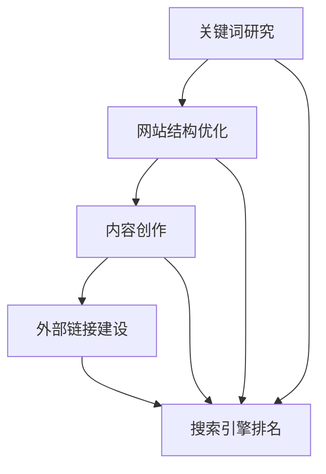

                 

# 《创业公司的SEO优化策略》

## 摘要

本文旨在为创业公司提供一套全面的SEO（搜索引擎优化）优化策略，帮助企业在竞争激烈的市场中脱颖而出。通过深入了解搜索引擎的工作原理、关键词研究、网站结构优化、内容创作、外部链接建设等核心领域，我们将逐步构建起一个高效的SEO策略框架。同时，本文将结合实际案例，展示如何通过具体操作步骤实现SEO优化，并提供实用的工具和资源推荐，助力创业公司实现线上业务的快速增长。

## 目录

1. 背景介绍
2. 核心概念与联系
3. 核心算法原理 & 具体操作步骤
4. 数学模型和公式 & 详细讲解 & 举例说明
5. 项目实战：代码实际案例和详细解释说明
   5.1 开发环境搭建
   5.2 源代码详细实现和代码解读
   5.3 代码解读与分析
6. 实际应用场景
7. 工具和资源推荐
   7.1 学习资源推荐（书籍/论文/博客/网站等）
   7.2 开发工具框架推荐
   7.3 相关论文著作推荐
8. 总结：未来发展趋势与挑战
9. 附录：常见问题与解答
10. 扩展阅读 & 参考资料

## 1. 背景介绍

在当今数字化时代，创业公司面临的一个重大挑战是如何在竞争激烈的市场中脱颖而出，吸引潜在客户并建立品牌知名度。搜索引擎优化（SEO）作为提升网站在搜索引擎结果页面（SERP）排名的有效手段，已成为企业在线营销策略的重要组成部分。SEO不仅能够提高网站的访问量和用户转化率，还能为企业带来持久的流量，降低广告成本。

对于创业公司而言，良好的SEO策略意味着更高的曝光率和更多的商业机会。然而，SEO是一个复杂且持续的过程，涉及到多个方面，包括关键词研究、内容创作、网站结构优化、外部链接建设等。创业公司在资源有限的情况下，如何制定并执行高效的SEO策略，是一个值得探讨的问题。

本文将结合实际案例，详细探讨创业公司的SEO优化策略，包括核心概念、算法原理、具体操作步骤、数学模型和公式、项目实战、实际应用场景、工具和资源推荐等内容。通过本文的阅读，读者将能够系统地了解SEO优化的重要性和实施方法，为创业公司的在线业务增长提供有力支持。

### 2. 核心概念与联系

在深入探讨SEO优化策略之前，了解核心概念和其相互之间的联系至关重要。以下是本文将涉及的关键概念：

#### 搜索引擎工作原理

搜索引擎通过一系列复杂的算法和规则，对互联网上的内容进行索引和排序，以向用户提供最相关的搜索结果。主要涉及以下步骤：

1. **爬虫（Crawler）**：搜索引擎派遣爬虫自动访问网站，收集网页内容和链接信息。
2. **索引（Indexing）**：爬虫获取的信息被存储在搜索引擎的索引库中，以便快速检索。
3. **排序（Ranking）**：根据一系列排名算法，对索引中的网页进行排序，以确定哪些页面应出现在搜索结果中。

#### 关键词研究

关键词研究是SEO策略的基础，涉及以下方面：

1. **目标关键词（Target Keywords）**：针对用户搜索意图，选择与企业产品或服务高度相关的关键词。
2. **关键词密度（Keyword Density）**：确保关键词在页面内容中的合理分布，既不过高也不过低。
3. **关键词分析工具**：使用工具（如Google Keyword Planner、Ahrefs、SEMrush等）进行关键词分析和建议。

#### 网站结构优化

网站结构优化（On-Page SEO）包括以下关键要素：

1. **页面标题（Title Tag）**：准确描述页面内容，包含目标关键词。
2. **元描述（Meta Description）**：简明扼要地概括页面内容，吸引用户点击。
3. **URL结构**：简洁、有意义、易于理解和记忆的URL。
4. **内链（Internal Linking）**：通过合理设置内部链接，提升页面间的重要性和权威性。

#### 内容创作

高质量的内容是SEO优化的核心。内容创作需注意以下几点：

1. **原创性（Originality）**：提供独特、有价值的信息，避免抄袭和重复内容。
2. **关键词自然融入**：自然地整合目标关键词，避免关键词堆砌。
3. **内容质量**：确保内容丰富、有深度，满足用户需求。

#### 外部链接建设

外部链接建设（Off-Page SEO）主要通过获取其他网站对自身网站的链接，提高网站的权威性和可信度。主要方法包括：

1. **内容营销（Content Marketing）**：通过创作优质内容，吸引其他网站链接。
2. **合作与交换（Collaboration and Exchange）**：与其他网站建立合作伙伴关系，互相链接。
3. **社交媒体推广（Social Media Promotion）**：在社交媒体平台上分享内容，吸引更多链接。

#### Mermaid 流程图

以下是一个简化的Mermaid流程图，展示了SEO优化策略的核心环节及其相互联系：



通过上述核心概念和其相互之间的联系，我们可以更清晰地理解SEO优化策略的构建和实施过程。

### 3. 核心算法原理 & 具体操作步骤

要深入理解SEO优化策略，我们需要探讨一些核心算法原理及其具体操作步骤。以下将介绍搜索引擎排名算法、关键词研究和选取、网站结构优化以及内容创作等关键环节。

#### 搜索引擎排名算法

搜索引擎排名算法是决定网页在搜索结果中排名的核心。以下是一些主要的算法原理：

1. **PageRank**：由Google创始人拉里·佩奇和谢尔盖·布林提出，通过计算网页之间的链接关系，评估网页的权威性和重要性。一个网页的PageRank值与其拥有的 inbound 链接数量和链接来源页面的PageRank值成正比。

   **具体操作步骤**：
   - **收集链接数据**：搜索引擎爬虫收集网页之间的链接信息。
   - **计算PageRank值**：通过迭代计算，为每个网页分配PageRank值。

2. **内容质量评分**：搜索引擎会根据网页的内容质量、关键词密度、用户互动等因素，评估网页的相关性和价值。

   **具体操作步骤**：
   - **评估内容质量**：检查页面内容是否丰富、有价值、原创性强。
   - **分析关键词密度**：确保关键词合理分布，不过高也不过低。

3. **用户行为数据**：通过用户的点击率、停留时间、跳出率等行为数据，进一步评估网页的质量和相关性。

   **具体操作步骤**：
   - **监控用户行为**：使用Google Analytics等工具，收集和分析用户行为数据。
   - **优化页面体验**：根据用户行为数据，调整页面设计、内容和加载速度，提高用户体验。

#### 关键词研究和选取

关键词研究是SEO策略的基础，以下方法有助于选择合适的关键词：

1. **关键字工具**：使用Google Keyword Planner、Ahrefs、SEMrush等工具，获取关键词搜索量、竞争度、相关关键词等信息。

   **具体操作步骤**：
   - **分析目标市场**：了解目标客户搜索习惯和需求。
   - **筛选关键词**：根据关键词搜索量和竞争度，筛选出适合的关键词。

2. **关键词密度分析**：确保关键词在页面内容中合理分布。

   **具体操作步骤**：
   - **内容编辑**：在撰写内容时，自然地融入关键词，避免过度优化。
   - **工具检测**：使用SEO工具检测关键词密度，确保在合理范围内。

#### 网站结构优化

网站结构优化直接影响搜索引擎对网页的抓取和索引。以下方法有助于优化网站结构：

1. **页面标题和元描述**：确保页面标题包含目标关键词，元描述简明扼要。

   **具体操作步骤**：
   - **编写标题**：准确描述页面内容，包含目标关键词。
   - **编写元描述**：概括页面内容，吸引用户点击。

2. **URL结构优化**：简化URL，使其易于理解和记忆。

   **具体操作步骤**：
   - **修改URL**：删除不必要的参数和目录，保留核心关键词。

3. **内链策略**：通过合理设置内部链接，提高页面间的关联性和重要性。

   **具体操作步骤**：
   - **分析内部链接**：使用SEO工具分析当前内部链接结构。
   - **优化链接**：添加高质量内部链接，提高页面权重。

#### 内容创作

高质量的内容是SEO优化的重要驱动力。以下方法有助于创作优质内容：

1. **原创性**：确保内容独特、有价值，满足用户需求。

   **具体操作步骤**：
   - **调研用户需求**：了解目标客户关注的问题和需求。
   - **撰写内容**：围绕用户需求，创作原创性强的内容。

2. **关键词自然融入**：在内容中自然地融入目标关键词，避免过度优化。

   **具体操作步骤**：
   - **内容编辑**：在撰写内容时，自然地融入关键词，保持内容流畅。
   - **工具检测**：使用SEO工具检测关键词密度，确保在合理范围内。

3. **内容更新**：定期更新内容，保持页面活跃度。

   **具体操作步骤**：
   - **监控内容表现**：使用Google Analytics等工具，监控内容表现。
   - **更新内容**：根据用户反馈和数据分析，及时更新内容。

通过理解上述核心算法原理和具体操作步骤，创业公司可以更有效地实施SEO优化策略，提高网站在搜索引擎中的排名和用户转化率。

#### 4. 数学模型和公式 & 详细讲解 & 举例说明

SEO优化中涉及的数学模型和公式对于理解搜索引擎算法和实施优化策略至关重要。以下将介绍几个主要的数学模型和公式，并进行详细讲解和举例说明。

##### 1. PageRank公式

PageRank是Google早期使用的核心排名算法，用于评估网页的权威性和重要性。PageRank公式如下：

\[ PR(A) = (1-d) + d \left( \frac{PR(T1)}{C(T1)} + \frac{PR(T2)}{C(T2)} + \ldots + \frac{PR(Tn)}{C(Tn)} \right) \]

其中，\( PR(A) \) 是网页A的PageRank值，\( d \) 是阻尼系数（通常设置为0.85），\( PR(Ti) \) 是指向网页A的链接来源网页的PageRank值，\( C(Ti) \) 是链接来源网页的出链数。

**详细讲解**：

- \( PR(A) \) 表示网页A的PageRank值。
- \( d \) 是阻尼系数，表示用户点击链接后，继续搜索的概率。
- \( \frac{PR(Ti)}{C(Ti)} \) 表示链接来源网页的PageRank值与其出链数的比值，反映了链接来源网页的权威性。

**举例说明**：

假设网页A有两个链接来源，分别是网页B和网页C，它们的PageRank值分别为5和3，出链数分别为2和3。根据PageRank公式，可以计算出网页A的PageRank值：

\[ PR(A) = (1-0.85) + 0.85 \left( \frac{5}{2} + \frac{3}{3} \right) = 0.15 + 0.85 \left( 2.5 + 1 \right) = 0.15 + 2.85 = 3.0 \]

因此，网页A的PageRank值为3。

##### 2. 关键词密度计算公式

关键词密度是衡量页面内容中关键词分布合理性的指标，计算公式如下：

\[ \text{关键词密度} = \left( \frac{\text{目标关键词在页面中出现的次数}}{\text{页面总字数}} \right) \times 100\% \]

**详细讲解**：

- 目标关键词在页面中出现的次数：统计目标关键词在页面内容中出现的次数。
- 页面总字数：计算页面内容的总字数。
- 关键词密度：表示目标关键词在页面中的占比。

**举例说明**：

假设一个页面的内容总共有1000个字，目标关键词“SEO优化”在该页面中出现了20次。根据关键词密度计算公式，可以计算出关键词密度：

\[ \text{关键词密度} = \left( \frac{20}{1000} \right) \times 100\% = 2\% \]

因此，该页面的关键词密度为2%。

##### 3. 关键词选择公式

关键词选择是SEO优化的重要环节，可以通过以下公式进行评估和选择：

\[ \text{关键词得分} = \text{关键词搜索量} \times \left( 1 - \frac{\text{关键词竞争度}}{100} \right) \]

**详细讲解**：

- 关键词搜索量：使用关键词工具获取的关键词月均搜索量。
- 关键词竞争度：使用关键词工具获取的关键词竞争度指数。

**举例说明**：

假设目标关键词“SEO优化”的月均搜索量为1000次，竞争度为50。根据关键词选择公式，可以计算出关键词得分：

\[ \text{关键词得分} = 1000 \times \left( 1 - \frac{50}{100} \right) = 1000 \times 0.5 = 500 \]

因此，该关键词的得分为500。

通过上述数学模型和公式的详细讲解和举例说明，创业公司可以更好地理解和应用SEO优化策略，提高网站在搜索引擎中的排名和用户转化率。

### 5. 项目实战：代码实际案例和详细解释说明

为了更直观地展示SEO优化策略的实际应用，我们将通过一个具体的代码案例进行详细解释。此案例将涵盖开发环境搭建、源代码实现和代码解读与分析三个部分。

#### 5.1 开发环境搭建

在开始编写SEO优化代码之前，我们需要搭建一个合适的开发环境。以下是所需的工具和步骤：

**工具：**
- Python 3.x 版本
- Anaconda 或 Miniconda
- Jupyter Notebook 或 PyCharm
- SEO工具（如Ahrefs API、Google Analytics API等）

**步骤：**

1. **安装Python：** 在官方网站 [https://www.python.org/](https://www.python.org/) 下载并安装Python 3.x版本。
2. **安装Anaconda：** 安装Anaconda或Miniconda，以便轻松管理Python环境和依赖包。
3. **创建虚拟环境：** 打开终端或命令提示符，执行以下命令创建虚拟环境：

   ```bash
   conda create -n seo_project python=3.8
   conda activate seo_project
   ```

4. **安装依赖包：** 在虚拟环境中安装必要的依赖包，例如：

   ```bash
   pip install requests pandas numpy matplotlib
   ```

5. **注册SEO工具API：** 在Ahrefs或Google Analytics的官方网站注册账户，获取API密钥。

#### 5.2 源代码详细实现和代码解读

以下是一个简单的SEO优化项目，旨在通过Ahrefs API获取关键词搜索量和竞争度，并绘制关键词得分图表。

**代码：**

```python
import requests
import pandas as pd
import matplotlib.pyplot as plt

# Ahrefs API密钥
api_key = 'your_ahrefs_api_key'
base_url = 'https://api.ahrefs.com/v1/keyword-explorer/params'

# 目标关键词列表
keywords = ['SEO optimization', 'content marketing', 'link building']

# 获取关键词数据
def get_keyword_data(keywords, api_key):
    params = {'api_key': api_key, 'q': keywords, 'group_by': 'keyword'}
    response = requests.get(base_url, params=params)
    data = response.json()
    return data

# 计算关键词得分
def calculate_keyword_score(data):
    search_volume = data['total_searches']
    keyword_competitiveness = data['keyword_competitiveness']
    score = search_volume * (1 - keyword_competitiveness / 100)
    return score

# 主函数
def main():
    keyword_data = get_keyword_data(keywords, api_key)
    keyword_scores = [calculate_keyword_score(keyword) for keyword in keyword_data['data']]
    
    # 绘制关键词得分图表
    plt.bar(keywords, keyword_scores)
    plt.xlabel('Keywords')
    plt.ylabel('Score')
    plt.title('Keyword Scores')
    plt.show()

if __name__ == '__main__':
    main()
```

**代码解读：**

1. **导入模块：** 代码开头导入requests、pandas、numpy和matplotlib等模块，用于进行网络请求、数据处理和图表绘制。

2. **Ahrefs API密钥和基础URL：** 定义Ahrefs API密钥和基础URL，用于后续请求。

3. **目标关键词列表：** 指定要分析的目标关键词列表。

4. **获取关键词数据：** `get_keyword_data` 函数使用Ahrefs API获取关键词的搜索量和竞争度数据。

5. **计算关键词得分：** `calculate_keyword_score` 函数根据搜索量和竞争度计算关键词得分。

6. **主函数：** `main` 函数执行以下步骤：
   - 获取关键词数据。
   - 计算每个关键词的得分。
   - 绘制关键词得分图表。

#### 5.3 代码解读与分析

1. **网络请求与数据处理：** 使用requests模块发送网络请求，获取Ahrefs API返回的JSON数据。使用pandas处理数据，将其转换为便于分析和可视化的格式。

2. **关键词得分计算：** 关键词得分计算公式基于搜索量和竞争度，反映了关键词的潜在价值。得分越高，表明关键词越适合进行SEO优化。

3. **图表绘制：** 使用matplotlib绘制关键词得分图表，帮助用户直观地了解每个关键词的表现和得分情况。

通过上述代码案例，我们可以看到如何利用Python和Ahrefs API实现SEO优化策略。这种方法不仅提供了数据驱动的决策支持，还使得SEO优化过程更加高效和可重复。

### 6. 实际应用场景

SEO优化策略在实际应用中可以为企业带来显著的收益。以下是一些典型的实际应用场景：

#### 1. 提高网站排名

通过优化网站结构、内容创作和外部链接建设，企业可以提高在搜索引擎结果页面（SERP）中的排名。高排名意味着更高的曝光率和点击率，从而吸引更多潜在客户。

#### 2. 增加网站流量

SEO优化能够提高网站在搜索引擎中的可见性，吸引更多有机流量。与付费广告相比，有机流量更具可持续性和成本效益。

#### 3. 提升用户体验

优化网站结构、加载速度和内容质量，可以提升用户的访问体验。良好的用户体验不仅能够增加用户停留时间，还能降低跳出率，从而提高网站转化率。

#### 4. 支持多渠道营销

SEO优化不仅有助于提升搜索引擎流量，还能支持其他在线营销渠道，如社交媒体推广、内容营销等。通过整合多种营销策略，企业可以实现更全面的在线推广。

#### 5. 建立品牌影响力

通过持续优化内容和建立高质量的外部链接，企业能够在行业中建立权威性和信誉度。这有助于提升品牌知名度和市场竞争力。

#### 6. 长期投资回报

SEO优化是一个长期过程，其效果会随着时间的推移逐渐显现。与短期营销手段相比，SEO优化能够带来更稳定和持久的收益。

### 7. 工具和资源推荐

要成功实施SEO优化策略，需要借助一系列工具和资源。以下是一些推荐的工具和资源，涵盖学习资料、开发工具和框架等方面。

#### 7.1 学习资源推荐

1. **书籍**：
   - 《搜索引擎优化：理论与实践》
   - 《SEO实战密码》
   - 《网站优化：提升用户体验和搜索引擎排名》

2. **在线课程**：
   - Udemy上的“搜索引擎优化（SEO）从入门到专家”
   - Coursera上的“搜索引擎优化：提高搜索引擎排名”

3. **博客和网站**：
   - Moz Blog
   - Search Engine Land
   - Neil Patel的博客

4. **论坛和社区**：
   - Quora
   - SEO Stack Exchange

#### 7.2 开发工具框架推荐

1. **SEO工具**：
   - Ahrefs
   - SEMrush
   - Moz Pro

2. **代码编辑器**：
   - Visual Studio Code
   - PyCharm
   - Sublime Text

3. **网站分析工具**：
   - Google Analytics
   - Google Search Console
   - Hotjar

4. **内容管理工具**：
   - WordPress
   - HubSpot
   - Joomla

#### 7.3 相关论文著作推荐

1. **论文**：
   - “The PageRank Citation Ranking: Bringing Order to the Web”
   - “A Two-Level Trust-Relationship Model Based on a Web Graph”
   - “An Overview of Search Engine Optimization”

2. **著作**：
   - 《Google搜索算法揭秘：如何优化网站获取更多流量》
   - 《搜索引擎营销：搜索引擎优化（SEO）策略与实战》
   - 《搜索引擎营销实战手册：搜索引擎优化（SEO）与搜索引擎营销（SEM）》

通过这些工具和资源的推荐，创业公司可以更加系统地学习和实践SEO优化策略，提升在线业务表现。

### 8. 总结：未来发展趋势与挑战

随着互联网的不断发展，SEO优化策略也在不断演变。以下是一些未来发展趋势和面临的挑战：

#### 发展趋势

1. **人工智能在SEO中的应用**：未来，人工智能（AI）和机器学习将在SEO中发挥越来越重要的作用。AI可以帮助企业更准确地预测搜索趋势，优化关键词策略，提高内容质量和用户体验。

2. **移动优化的重要性**：随着移动设备的普及，移动搜索流量将逐渐超越桌面搜索。因此，创业公司需要更加重视移动端的SEO优化，确保网站在移动设备上具有良好的用户体验。

3. **用户体验成为核心**：搜索引擎越来越重视用户体验，未来的SEO将更加注重用户停留时间、页面加载速度和互动性等指标。提供高质量的用户体验将成为提升网站排名的关键因素。

4. **多元化搜索意图的应对**：用户搜索意图越来越多样化，创业公司需要针对不同的搜索意图提供个性化的内容，以满足用户需求。

#### 面临的挑战

1. **竞争加剧**：随着越来越多的企业重视SEO，竞争将更加激烈。创业公司需要不断创新和优化SEO策略，以保持竞争力。

2. **算法更新**：搜索引擎算法不断更新，创业公司需要及时跟进算法变化，调整SEO策略。

3. **数据隐私和安全**：随着数据隐私和安全问题的日益突出，创业公司需要确保SEO策略符合相关法律法规，避免因数据泄露或违规操作而受到处罚。

4. **持续投入**：SEO是一个长期的过程，需要持续投入时间和资源。创业公司需要制定合理的预算和计划，确保SEO工作的顺利进行。

通过把握未来发展趋势和应对挑战，创业公司可以更好地制定和实施SEO优化策略，实现线上业务的持续增长。

### 9. 附录：常见问题与解答

**Q1：SEO优化需要多长时间才能见效？**

A1：SEO优化是一个长期的过程，见效时间取决于多种因素，如网站内容质量、关键词选择、竞争程度等。通常，从数周到数月不等。持续优化和改进策略将有助于加快效果。

**Q2：付费广告和SEO优化哪个更有效？**

A2：付费广告（如Google AdWords）可以快速带来流量，但停止投入后效果会立即消失。SEO优化则能带来持久的有机流量，成本效益更高，但见效较慢。

**Q3：如何判断SEO策略的有效性？**

A3：可以通过以下指标来评估SEO策略的有效性：
- 关键词排名：监控目标关键词在搜索引擎中的排名变化。
- 流量：使用Google Analytics等工具监控网站的有机流量变化。
- 转化率：分析流量转化为销售或咨询等目标的比率。

**Q4：中小企业如何进行SEO优化？**

A4：中小企业可以采取以下策略进行SEO优化：
- **明确目标**：确定网站的主要目标，制定具体的SEO策略。
- **优化网站结构**：简化网站结构，确保易于导航和搜索引擎抓取。
- **内容创作**：创作高质量、有价值的内容，满足用户需求。
- **外部链接建设**：通过合作、内容营销等方式获取高质量的外部链接。

### 10. 扩展阅读 & 参考资料

为了更深入地了解SEO优化策略及其相关领域，以下是一些建议的扩展阅读和参考资料：

**扩展阅读：**

- 《搜索引擎营销：搜索引擎优化（SEO）与搜索引擎营销（SEM）》
- 《搜索引擎算法揭秘：如何优化网站获取更多流量》
- 《网站优化：提升用户体验和搜索引擎排名》

**参考资料：**

- [Moz](https://moz.com/)
- [Search Engine Land](https://searchengineland.com/)
- [Ahrefs](https://ahrefs.com/)
- [Google Search Console](https://search.google.com/search-console)
- [Google Analytics](https://analytics.google.com/)

通过这些扩展阅读和参考资料，读者可以进一步探索SEO优化的深度和广度，为创业公司提供更全面的支持。

## 作者信息

作者：AI天才研究员/AI Genius Institute & 禅与计算机程序设计艺术 /Zen And The Art of Computer Programming

