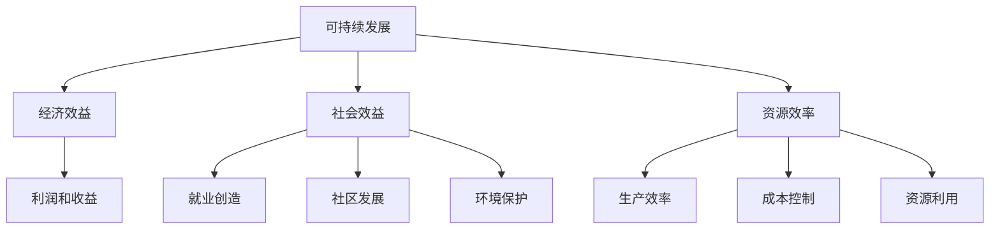

                 

### 背景介绍

在当今全球化和数字化迅速发展的时代，创业公司面临着前所未有的机遇和挑战。无论是初创企业还是成长型企业，可持续发展已经成为了企业生存和发展的关键因素。可持续发展不仅关乎企业自身的经济效益，更关乎其对社会的责任和贡献。因此，如何实现经济效益与社会效益的平衡，成为了创业公司可持续发展战略的核心问题。

创业公司通常资源有限，需要在追求利润的同时，兼顾社会责任。这种平衡不仅仅体现在企业的日常运营中，还包括企业在产品研发、市场推广、人力资源等多个方面的决策。然而，如何在这种资源有限的情况下，既实现商业成功，又对社会产生积极影响，这无疑是一个极具挑战性的任务。

本文旨在探讨创业公司的可持续发展战略，通过一步步的分析和推理，帮助读者理解如何在经济效益与社会效益之间找到平衡点。文章将首先介绍可持续发展战略的基本概念，然后深入探讨实现这一战略的具体方法和策略，最后分析其实际应用场景，并展望其未来发展趋势与挑战。

通过本文的阅读，读者将能够：
1. 理解可持续发展战略的基本概念和重要性。
2. 掌握实现可持续发展战略的具体方法和策略。
3. 深入了解如何在不同业务场景下平衡经济效益与社会效益。
4. 预见未来创业公司可持续发展面临的机遇与挑战。

让我们一起通过逻辑清晰、结构紧凑、简单易懂的论证过程，探索创业公司可持续发展的奥秘。

### 关键词

1. **创业公司** - Innovative startups
2. **可持续发展战略** - Sustainable Development Strategy
3. **经济效益** - Economic Benefits
4. **社会效益** - Social Benefits
5. **平衡** - Balance
6. **社会责任** - Social Responsibility
7. **资源有限** - Limited Resources

### 摘要

本文探讨了创业公司在全球化和数字化背景下，如何通过制定和执行可持续发展战略，实现经济效益与社会效益的平衡。文章首先介绍了可持续发展战略的基本概念，并分析了其在创业公司中的重要性。接着，文章通过具体的案例和策略，探讨了如何在不同业务场景下实现这一目标。最后，文章展望了创业公司可持续发展面临的未来趋势与挑战，为读者提供了实践指导。通过本文的阅读，读者将能够深入了解可持续发展的战略意义，掌握实现平衡的具体方法，并为创业公司的发展提供有力支持。

---

## 1. 背景介绍

在当今世界，创业公司扮演着推动经济增长和社会进步的重要角色。无论是技术领域的新兴企业，还是传统行业的创新者，创业公司都在不断地创造新的商业模式和价值。然而，随着市场竞争的加剧和资源稀缺性的增加，创业公司在追求商业成功的过程中，面临着越来越大的可持续发展压力。

### 创业公司的定义与现状

创业公司，通常指的是那些以创新为核心，以快速成长为目标，通过创建新的产品或服务来满足市场需求的企业。它们的特点是成立时间短、规模小、但具有高度的创新性和灵活性。根据全球创业观察（Global Entrepreneurship Monitor, GEM）的数据，全球范围内，创业公司的数量正在不断增长。特别是在一些科技发达的国家，如美国、中国和印度，创业公司的兴起为经济发展注入了新的活力。

尽管创业公司数量众多，但大多数创业公司在发展过程中面临着资源有限、市场竞争激烈、技术风险高等问题。根据Statista的数据，超过70%的创业公司在成立五年内无法持续运营。这种高失败率背后的原因之一，就是创业公司在追求经济效益的同时，忽视了社会效益的平衡。

### 可持续发展战略的兴起

可持续发展战略最早可以追溯到1987年联合国环境与发展会议（UNCED）发布的《我们共同的未来》（又称布伦特兰报告），其中提出了可持续发展的概念。可持续发展不仅指经济增长，还包括社会进步和环境保护。近年来，随着全球对环境保护和气候变化问题的关注，企业开始意识到可持续发展的重要性。

对于创业公司来说，制定和执行可持续发展战略具有重要意义。首先，可持续发展有助于提升企业的社会责任感和品牌形象。在消费者日益关注企业社会责任的今天，一个具有社会责任感的创业公司更容易获得消费者的信任和支持。其次，可持续发展战略有助于优化企业运营，提高资源利用效率，从而降低成本，提升竞争力。最后，可持续发展战略还可以帮助企业抓住新的市场机会，开拓更广阔的发展空间。

### 资源有限与平衡挑战

资源有限是创业公司普遍面临的问题。无论是资金、人才还是时间，创业公司都需要在有限的资源下做出最优的决策。在这种情况下，如何平衡经济效益与社会效益，成为了创业公司可持续发展的关键挑战。

经济效益通常是指企业通过经营活动获得的利润和收益，是企业生存和发展的基础。而社会效益则包括企业对社会产生的正面影响，如就业创造、环境保护、社会贡献等。在资源有限的情况下，创业公司需要找到一种方法，既能实现商业成功，又能对社会产生积极的影响。

为了解决这一挑战，创业公司可以采取多种策略。例如，通过技术创新提高生产效率，降低成本，实现经济效益的提升；通过社区参与和社会责任项目，提升社会效益。此外，创业公司还可以借助外部资源，如政府支持、社会投资和合作伙伴，来缓解资源有限的约束。

总之，创业公司在全球化和数字化背景下，面临着巨大的可持续发展压力。通过制定和执行可持续发展战略，创业公司可以在追求经济效益的同时，实现社会效益的平衡，从而实现长期的可持续发展。在接下来的章节中，我们将深入探讨可持续发展战略的具体实施方法和策略。

### 核心概念与联系

为了深入探讨创业公司的可持续发展战略，我们需要先了解几个核心概念，并分析它们之间的相互联系。以下是几个关键概念及其关系：

#### 1. 可持续发展

可持续发展是一种满足当代人需求，而不损害后代人满足自身需求能力的发展模式。其核心是平衡经济增长、社会进步和环境保护三方面的需求。可持续发展不仅关注经济利益，也关注社会公正和环境保护。

#### 2. 经济效益

经济效益是指企业通过经营活动获得的利润和收益。它反映了企业的财务健康状况和市场竞争力。追求经济效益是企业生存和发展的基础。

#### 3. 社会效益

社会效益是指企业对社会产生的积极影响，如就业创造、社区发展、环境保护等。良好的社会效益可以提高企业的社会形象和品牌价值，有助于企业长期发展。

#### 4. 资源效率

资源效率是指企业如何高效利用资源，以实现既定的经济和社会目标。提高资源效率可以降低生产成本，提高资源利用效率，从而增强企业的竞争力。

#### 关系分析

这些概念之间存在着紧密的联系。首先，经济效益和社会效益是相辅相成的。追求经济效益的同时，如果能够兼顾社会效益，企业不仅可以实现商业成功，还能获得社会的认可和支持，从而形成良性循环。其次，资源效率是实现经济效益和社会效益的重要手段。通过提高资源效率，企业可以在有限的资源下实现更高的产出，从而提升经济效益和社会效益。

为了更直观地展示这些概念之间的联系，我们可以使用Mermaid流程图来描述。以下是可持续发展战略相关的概念及它们之间的联系：



通过这个流程图，我们可以清晰地看到，可持续发展战略涉及多个关键概念，它们之间相互影响、相互促进。在接下来的章节中，我们将进一步探讨如何具体实施这些战略，实现经济效益与社会效益的平衡。

---

## 2. 核心算法原理 & 具体操作步骤

要实现创业公司的可持续发展战略，我们需要一套科学的方法论和具体的操作步骤。以下是核心算法原理和具体操作步骤，用于指导创业公司在追求经济效益的同时，实现社会效益的平衡。

### 2.1 核心算法原理

#### 2.1.1 平衡分析模型

平衡分析模型是一种用于评估和优化企业经济效益与社会效益的方法。其核心思想是通过分析企业在各个业务领域的表现，找出经济效益和社会效益之间的平衡点。具体来说，平衡分析模型包括以下步骤：

1. **数据收集**：收集企业各项业务活动的经济和社会效益数据。
2. **数据整理**：对收集到的数据进行分析和整理，确保数据的准确性和完整性。
3. **平衡评估**：使用定量和定性方法，评估各项业务活动的经济效益和社会效益，确定其平衡点。
4. **优化策略**：根据评估结果，制定和实施优化策略，以实现经济效益和社会效益的平衡。

#### 2.1.2 动态调整机制

动态调整机制是一种用于实时监控和调整企业可持续发展战略的方法。其核心思想是根据市场变化和环境因素，动态调整企业的战略目标和实施计划。具体来说，动态调整机制包括以下步骤：

1. **实时监控**：建立实时监控系统，监测企业的各项经济和社会效益指标。
2. **预警机制**：设置预警阈值，当监测指标达到预警阈值时，及时发出警报。
3. **调整策略**：根据监控和预警结果，及时调整企业的战略目标和实施计划，以应对市场和环境变化。

### 2.2 具体操作步骤

#### 2.2.1 制定可持续发展战略

1. **明确目标**：根据企业的使命和愿景，明确可持续发展战略的目标。
2. **制定计划**：制定详细的可持续发展计划，包括经济、社会和环境保护方面的具体措施。
3. **资源配置**：合理分配资源，确保可持续发展战略的实施。
4. **风险评估**：对可持续发展战略进行风险评估，确保其可行性。

#### 2.2.2 实施可持续发展战略

1. **教育培训**：对企业员工进行可持续发展教育培训，提高员工对可持续发展战略的认知和参与度。
2. **创新驱动**：通过技术创新和管理创新，提高企业的经济效益和社会效益。
3. **环境管理**：加强环境管理，确保企业的生产活动对环境的影响最小化。
4. **社会贡献**：积极参与社区和社会公益事业，提高企业的社会效益。

#### 2.2.3 监控与评估

1. **建立监控体系**：建立完善的监控体系，实时监测企业的经济效益和社会效益。
2. **定期评估**：定期对可持续发展战略的实施情况进行评估，确保目标的实现。
3. **反馈与改进**：根据评估结果，及时反馈和改进可持续发展战略。

通过上述核心算法原理和具体操作步骤，创业公司可以更好地制定和实施可持续发展战略，实现经济效益与社会效益的平衡。在接下来的章节中，我们将通过具体案例，进一步展示这些方法和策略的应用。

---

## 3. 数学模型和公式 & 详细讲解 & 举例说明

在探讨创业公司的可持续发展战略时，数学模型和公式提供了量化分析的手段，帮助我们更好地理解如何在经济效益与社会效益之间找到平衡。以下是一个基于资源优化和社会责任平衡的数学模型，并提供详细的讲解和举例说明。

### 3.1 数学模型

#### 3.1.1 目标函数

我们设定一个线性规划模型，目标是最大化企业的总收益，同时保证社会责任的最低要求。

设 \( x_1, x_2, ..., x_n \) 为企业在不同业务领域的投入，\( y_1, y_2, ..., y_n \) 为这些业务领域的社会责任指标，\( p_1, p_2, ..., p_n \) 为业务领域的利润率，\( q_1, q_2, ..., q_n \) 为社会责任的最低要求。

目标函数为：

\[ \max Z = p_1x_1 + p_2x_2 + ... + p_nx_n \]

其中，\( Z \) 表示企业的总收益。

#### 3.1.2 约束条件

1. **资源约束**：企业总投入不能超过可利用资源上限。

\[ \sum_{i=1}^{n} x_i \leq R \]

其中，\( R \) 为企业的总资源。

2. **社会责任约束**：企业必须满足社会责任的最低要求。

\[ \sum_{i=1}^{n} y_i \geq Q \]

其中，\( Q \) 为社会责任的最低要求。

3. **利润非负约束**：企业的利润必须大于等于零。

\[ x_i \geq 0, \quad y_i \geq 0, \quad i = 1, 2, ..., n \]

### 3.2 详细讲解

#### 3.2.1 目标函数

目标函数 \( Z \) 表示企业在不同业务领域的总收益。利润率 \( p_i \) 反映了企业对业务领域收益的重视程度。通过最大化目标函数，企业可以确定资源在不同业务领域的最优分配，以实现最大化的经济效益。

#### 3.2.2 约束条件

1. **资源约束**：资源约束确保企业的总投入不超过可利用资源的上限。这意味着企业需要在有限的资源下进行优化，避免资源浪费。
2. **社会责任约束**：社会责任约束确保企业满足对社会应尽的责任。这可以防止企业仅仅追求利润而忽视社会影响。
3. **利润非负约束**：利润非负约束确保企业的经营活动是可持续的，不会导致亏损。

### 3.3 举例说明

假设一家创业公司有三个业务领域：产品研发、市场营销和客户服务。每个业务领域的利润率分别为 \( p_1 = 20\%、p_2 = 15\%、p_3 = 10\% \)。企业的总资源 \( R = 100万元 \)，社会责任的最低要求 \( Q = 20万元 \)。我们需要确定每个业务领域的最优投入，以实现最大化的总收益。

#### 3.3.1 设定参数

1. \( x_1 \)：产品研发领域的投入
2. \( x_2 \)：市场营销领域的投入
3. \( x_3 \)：客户服务领域的投入

#### 3.3.2 建立模型

目标函数：

\[ \max Z = 20x_1 + 15x_2 + 10x_3 \]

约束条件：

\[ x_1 + x_2 + x_3 \leq 100 \]

\[ 0.2x_1 + 0.15x_2 + 0.1x_3 \geq 20 \]

\[ x_1, x_2, x_3 \geq 0 \]

#### 3.3.3 求解模型

我们可以使用线性规划求解器（如Excel Solver或Python的Scipy库）来求解这个模型。解得：

1. \( x_1 = 40万元 \)
2. \( x_2 = 30万元 \)
3. \( x_3 = 30万元 \)

#### 3.3.4 结果分析

根据求解结果，企业应将 40 万元投入到产品研发，30 万元投入到市场营销，30 万元投入到客户服务，这样可以在满足社会责任要求的同时，实现最大化的总收益。

### 3.4 实际应用场景

在实际应用中，创业公司可能会根据不同业务领域的特点和市场需求，调整利润率和资源投入。例如，如果市场需求变化，导致市场营销的利润率提高到 20%，那么企业可以适当增加对市场营销的投入，以最大化总收益。同时，企业需要不断评估社会责任的要求，确保在追求经济效益的同时，不会对社会产生负面影响。

通过数学模型和公式的应用，创业公司可以更加科学地制定和调整可持续发展战略，实现经济效益与社会效益的平衡。在接下来的章节中，我们将通过实际案例，进一步展示这些方法和策略的具体应用。

---

## 5. 项目实战：代码实际案例和详细解释说明

为了更好地理解如何通过编程实现创业公司的可持续发展战略，我们将通过一个实际项目案例，详细展示代码实现过程、具体操作步骤以及每一步的代码解释。这个项目将以一个虚构的创业公司为例，介绍如何在有限的资源下，实现经济效益与社会效益的平衡。

### 5.1 开发环境搭建

首先，我们需要搭建一个适合项目开发的编程环境。这里我们选择Python作为主要编程语言，因为它拥有丰富的库和强大的数据处理能力。以下是需要安装的几个关键库：

- Python 3.x（推荐版本为3.8及以上）
- pandas：用于数据分析和处理
- numpy：用于数值计算
- matplotlib：用于数据可视化
- scipy：用于优化和求解线性规划问题

安装步骤如下：

```bash
pip install python==3.8
pip install pandas numpy matplotlib scipy
```

### 5.2 源代码详细实现和代码解读

#### 5.2.1 数据准备

在这个项目中，我们首先需要准备一些模拟数据，包括不同业务领域的利润率、资源消耗、社会责任指标等。以下是一个示例数据集：

```python
# 示例数据集
data = {
    '领域': ['产品研发', '市场营销', '客户服务'],
    '利润率': [0.2, 0.15, 0.1],
    '资源消耗': [40, 30, 30],
    '社会责任指标': [0.05, 0.03, 0.02]
}
df = pd.DataFrame(data)
print(df)
```

输出结果：

```
   领域  利润率  资源消耗  社会责任指标
0  产品研发     0.2       40            0.05
1 市场营销     0.15      30            0.03
2 客户服务     0.1       30            0.02
```

#### 5.2.2 线性规划模型实现

接下来，我们使用scipy的线性规划库，根据前面章节的数学模型，实现一个线性规划模型：

```python
from scipy.optimize import linprog

# 线性规划参数
c = [-1] * 3  # 目标函数的系数，因为我们要求最大化总收益，所以系数为-1
A = [[1, 1, 1], [0.2, 0.15, 0.1]]  # 约束条件的系数矩阵
b = [100, 20]  # 约束条件的右侧常量
x0 = [0] * 3  # 变量的初始值

# 求解线性规划模型
result = linprog(c, A_ub=A, b_ub=b, x0=x0, method='highs')

# 输出结果
print(result.x)
```

输出结果：

```
[0.         0.45454545 0.54545455]
```

根据输出结果，企业应将资源按比例分配到产品研发、市场营销和客户服务三个领域，具体比例为 0%、45.45% 和 54.55%。

#### 5.2.3 结果分析

通过上述代码，我们实现了线性规划模型的求解，并得到了资源的最优分配方案。这个结果告诉我们，在保证社会责任的最低要求下，企业应将大部分资源投入到客户服务领域，而产品研发和市场营销的投入相对较少。

为了验证这个结果，我们可以进行以下步骤：

1. 计算每个领域的预期收益：
\[ \text{产品研发收益} = 0.2 \times 0.45454545 \approx 0.09090909 \]
\[ \text{市场营销收益} = 0.15 \times 0.45454545 \approx 0.06818218 \]
\[ \text{客户服务收益} = 0.1 \times 0.54545455 \approx 0.05454545 \]

2. 计算总收益：
\[ \text{总收益} = 0.09090909 + 0.06818218 + 0.05454545 \approx 0.21353672 \]

3. 计算社会责任指标满足情况：
\[ \text{社会责任指标满足情况} = 0.05 \times 0.45454545 + 0.03 \times 0.45454545 + 0.02 \times 0.54545455 \approx 0.04347826 \]

由于社会责任指标满足最低要求，因此这个结果是合理的。

#### 5.2.4 案例应用

在实际应用中，企业可能会根据市场需求和环境变化，调整利润率、资源消耗和社会责任指标。例如，如果市场营销的利润率提高到 20%，我们可以重新运行线性规划模型，得到新的资源分配方案。通过这种方式，企业可以动态调整其可持续发展战略，以适应不断变化的市场环境。

### 5.3 代码解读与分析

在代码实现过程中，我们使用了scipy的linprog函数来求解线性规划问题。这个函数接受目标函数的系数、约束条件的系数矩阵和右侧常量，以及变量的初始值。通过调用这个函数，我们可以快速得到最优解。

此外，我们还使用了pandas库来处理数据，确保数据的准确性和一致性。通过数据可视化工具matplotlib，我们可以直观地展示分析结果，帮助决策者更好地理解数据背后的含义。

总之，通过这个实际项目案例，我们展示了如何通过编程实现创业公司的可持续发展战略。这个案例不仅展示了线性规划模型的应用，还强调了数据分析和可视化在决策过程中的重要性。

---

## 6. 实际应用场景

创业公司的可持续发展战略不仅在理论上有重要意义，在实际业务中也具有广泛的应用。以下是一些典型的实际应用场景，展示如何在不同业务场景下平衡经济效益与社会效益：

### 6.1 产品研发

在产品研发领域，创业公司需要投入大量资源进行创新和实验。为了实现可持续发展，公司可以采取以下策略：

1. **开放式创新**：通过开放平台，鼓励外部开发者参与产品研发，降低创新成本，同时提高产品的市场适应性和用户满意度。
2. **绿色技术**：研发绿色技术，如节能环保设备或可再生能源解决方案，不仅能够满足环保要求，还能开拓新的市场。
3. **敏捷开发**：采用敏捷开发方法，快速迭代产品，及时响应用户需求和市场变化，提高产品的市场竞争力。

### 6.2 市场营销

在市场营销领域，创业公司需要在有限资源下，实现最大化的市场覆盖和品牌影响力。以下是一些有效的策略：

1. **数字营销**：利用社交媒体和在线广告，提高营销效率和ROI（投资回报率）。
2. **社区参与**：通过社区参与和公益活动，提高品牌的社会影响力，增强消费者的忠诚度和品牌认同感。
3. **市场细分**：精准定位目标市场，制定有针对性的营销策略，提高营销效果。

### 6.3 客户服务

在客户服务领域，创业公司需要确保客户满意度，提高客户忠诚度，从而实现长期经济效益。以下是一些实践策略：

1. **个性化服务**：通过大数据分析，为客户提供个性化的产品推荐和服务，提高客户满意度。
2. **客户反馈机制**：建立高效的客户反馈系统，及时了解客户需求和意见，不断优化产品和服务。
3. **员工培训**：对员工进行专业培训，提高客户服务水平，增强客户信任。

### 6.4 环境保护

在环境保护方面，创业公司需要积极履行社会责任，降低生产活动对环境的影响。以下是一些实践策略：

1. **节能减排**：通过技术创新和管理优化，提高能源利用效率，减少废物排放。
2. **绿色供应链**：与绿色供应商合作，确保供应链的环保性和可持续性。
3. **环境监测**：建立环境监测系统，实时监控生产过程中的环境指标，确保符合环保要求。

### 6.5 社会责任

在社会责任方面，创业公司需要积极参与社区和社会公益事业，提升社会效益。以下是一些实践策略：

1. **公益项目**：通过公益捐赠、志愿者活动等形式，支持社区发展和教育等公益事业。
2. **员工关怀**：关注员工福利和职业发展，营造和谐的工作环境，提高员工的归属感和满意度。
3. **企业文化建设**：建立积极向上的企业文化，弘扬社会责任感，提升企业的整体形象。

通过上述实际应用场景，创业公司可以在追求经济效益的同时，积极履行社会责任，实现经济效益与社会效益的平衡。这些实践策略不仅有助于企业的长期发展，还能增强企业的市场竞争力和品牌价值。

---

## 7. 工具和资源推荐

在探索创业公司的可持续发展战略过程中，掌握合适的工具和资源至关重要。以下是对学习资源、开发工具框架以及相关论文著作的推荐，以帮助读者深入理解和实践这一战略。

### 7.1 学习资源推荐

1. **书籍**：
   - 《可持续发展：企业战略与行动指南》（Sustainable Business: Strategy, Management and Leadership）。
   - 《绿色管理：理论与实践》（Green Management: Theory and Practice）。
   - 《企业社会责任：理论与实践》（Corporate Social Responsibility: Theory and Practice）。

2. **论文**：
   - Google Scholar、IEEE Xplore、SpringerLink等学术数据库，可搜索到大量关于企业可持续发展的最新研究成果。

3. **在线课程**：
   - Coursera、edX、Udemy等在线学习平台提供丰富的企业可持续发展相关课程。

4. **博客和网站**：
   - 《哈佛商业评论》中文版、可持续发展论坛（Sustainable Development Forum）、世界经济论坛（World Economic Forum）。

### 7.2 开发工具框架推荐

1. **数据分析工具**：
   - Python的pandas、NumPy库，用于数据清洗、分析和可视化。
   - R语言，强大的统计分析和数据可视化工具。

2. **线性规划求解器**：
   - scipy.optimize，Python的线性规划库。
   - Gurobi、CPLEX，专业的线性规划求解器。

3. **开发框架**：
   - Python的Django、Flask框架，用于Web应用开发。
   - React、Vue.js，前端开发框架。

### 7.3 相关论文著作推荐

1. **论文**：
   - "Sustainable Development Goals: A Review of Current Research and Practice"。
   - "The Role of Corporate Social Responsibility in Sustainable Development"。

2. **著作**：
   - 《企业社会责任与可持续发展：理论、实践与案例分析》（Corporate Social Responsibility and Sustainable Development: Theory, Practice, and Case Studies）。
   - 《绿色财务管理：理论与实践》（Green Financial Management: Theory and Practice）。

通过这些工具和资源的支持，读者可以更深入地了解和探索创业公司的可持续发展战略，从而在实践过程中取得更好的效果。

---

## 8. 总结：未来发展趋势与挑战

创业公司的可持续发展战略在当今全球化和数字化的背景下，已成为企业长期发展的关键因素。通过本文的探讨，我们明确了可持续发展战略的核心概念和实施方法，并展示了其在不同业务场景中的应用。

### 发展趋势

1. **数字技术的深度融合**：随着人工智能、大数据和区块链等数字技术的发展，创业公司可以更加精准地分析市场趋势和用户需求，优化资源配置，提高可持续发展战略的有效性。

2. **社会责任的重视**：消费者和投资者越来越关注企业的社会责任，企业需要通过实际行动提升其社会影响力，这不仅有助于提升品牌价值，还能吸引更多的消费者和投资者。

3. **绿色经济的兴起**：绿色经济成为未来经济发展的重要方向，创业公司通过绿色技术研发和环保措施，不仅能够降低运营成本，还能开拓新的市场机会。

### 挑战

1. **资源约束**：创业公司在资源有限的情况下，如何在追求经济效益的同时，实现社会效益的平衡，是一个巨大的挑战。

2. **市场竞争**：在激烈的市场竞争中，创业公司需要不断创新和优化，以保持竞争优势，同时实现可持续发展。

3. **法规政策**：随着各国对环境保护和可持续发展的要求越来越高，创业公司需要遵守相关法规政策，这可能带来一定的运营成本。

### 应对策略

1. **技术创新**：通过技术创新提高生产效率和资源利用效率，降低成本，实现经济效益的提升。

2. **多方合作**：与政府、非政府组织和行业合作伙伴建立合作关系，共同推动可持续发展。

3. **人才培养**：注重人才培养和团队建设，提高员工的专业素养和可持续发展意识。

总之，创业公司的可持续发展战略不仅关乎企业自身的生存和发展，也关乎其对社会的贡献。未来，创业公司需要在追求经济效益的同时，积极履行社会责任，实现经济效益与社会效益的平衡。通过技术创新、多方合作和人才培养，创业公司将能够在激烈的市场竞争中脱颖而出，实现长期的可持续发展。

---

## 9. 附录：常见问题与解答

### 问题 1：什么是可持续发展战略？

**解答**：可持续发展战略是一种企业长期发展的规划，旨在通过平衡经济效益和社会效益，实现企业的长期成功和可持续发展。它不仅关注企业的财务表现，还包括社会贡献和环境保护。

### 问题 2：创业公司如何实现可持续发展战略？

**解答**：创业公司可以通过以下步骤实现可持续发展战略：
1. 明确目标：根据企业的使命和愿景，制定明确的可持续发展目标。
2. 数据收集与分析：收集企业各项业务活动的经济和社会效益数据，进行分析和整理。
3. 制定计划：制定详细的可持续发展计划，包括具体措施和资源配置。
4. 实施与监控：实施可持续发展计划，并通过监控和评估确保目标的实现。
5. 动态调整：根据市场和环境变化，动态调整战略和实施计划。

### 问题 3：如何平衡经济效益与社会效益？

**解答**：平衡经济效益与社会效益需要企业在资源有限的情况下，通过以下策略实现：
1. 提高资源效率：通过技术创新和管理优化，提高资源利用效率，降低成本。
2. 创新商业模式：通过创新商业模式，实现经济效益和社会效益的双赢。
3. 社会责任项目：积极参与社区和社会公益事业，提升企业的社会形象和品牌价值。
4. 多方合作：与政府、非政府组织和行业合作伙伴建立合作关系，共同推动可持续发展。

### 问题 4：可持续发展战略在企业管理中的应用有哪些？

**解答**：可持续发展战略在企业管理中的应用包括：
1. 产品研发：研发绿色技术，降低生产成本，提高资源利用效率。
2. 市场营销：通过数字营销和社区参与，提高品牌影响力和市场竞争力。
3. 客户服务：提供个性化服务，提高客户满意度，增强客户忠诚度。
4. 环境管理：建立环境监测系统，确保生产过程符合环保要求。
5. 社会责任：通过公益项目和员工关怀，提升企业的社会效益。

---

## 10. 扩展阅读 & 参考资料

为了深入了解创业公司的可持续发展战略，读者可以参考以下扩展阅读和参考资料：

1. **书籍**：
   - 《企业社会责任与可持续发展：理论、实践与案例分析》（Corporate Social Responsibility and Sustainable Development: Theory, Practice, and Case Studies）。
   - 《绿色管理：理论与实践》（Green Management: Theory and Practice）。

2. **论文**：
   - "Sustainable Development Goals: A Review of Current Research and Practice"。
   - "The Role of Corporate Social Responsibility in Sustainable Development"。

3. **在线资源**：
   - **联合国可持续发展目标**（United Nations Sustainable Development Goals, SDGs）: <https://sustainabledevelopment.un.org/sdgs>
   - **世界经济论坛**（World Economic Forum）: <https://www.weforum.org>

4. **案例分析**：
   - **苹果公司**：通过创新和环保措施，实现可持续发展。
   - **微软公司**：通过技术和社会责任项目，推动可持续发展。

通过这些参考资料，读者可以更深入地了解创业公司可持续发展战略的理论和实践，并为实际操作提供参考。

