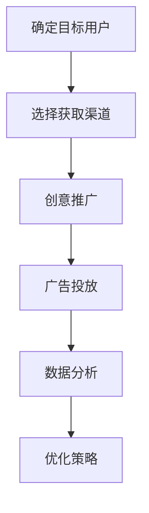
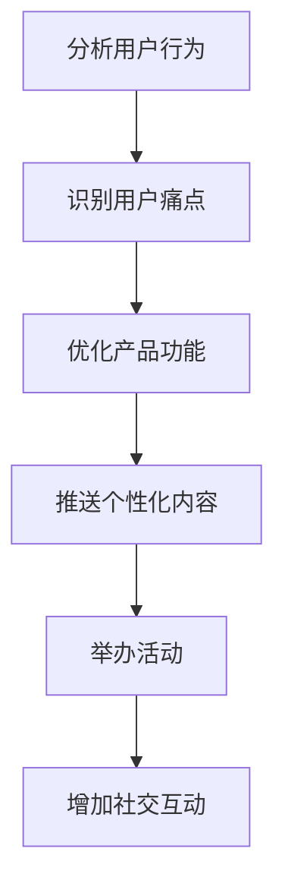
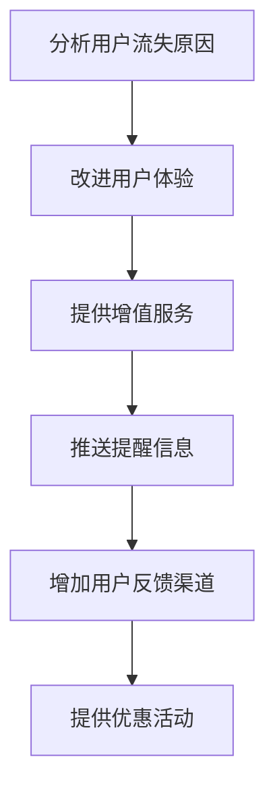

                 

# 创业公司的增长黑客实战技巧

## 摘要

在当今竞争激烈的市场中，创业公司需要采取各种策略来迅速增长。增长黑客策略作为一种结合技术、数据和市场营销的方法，正变得越来越重要。本文将详细介绍增长黑客策略的核心概念、实战技巧及其在创业公司中的应用，帮助创业公司实现持续增长。

## 背景介绍

### 什么是增长黑客？

增长黑客（Growth Hacking）是一种通过创新的营销手段和数据分析来快速增加用户量、提高用户活跃度和留存率的方法。与传统的市场营销不同，增长黑客更加注重实际效果和成本的优化。它通常涉及到数据分析、用户行为研究、A/B测试和创意营销等多个方面。

### 增长黑客在创业公司中的重要性

对于创业公司来说，增长黑客策略具有以下几个重要性：

1. **成本效益**：通过精确的数据分析和实验，增长黑客可以更有效地分配资源，从而降低营销成本。
2. **快速验证**：通过快速试错和迭代，增长黑客可以帮助创业公司更快地验证产品/市场的契合度。
3. **用户粘性**：通过优化用户体验和产品设计，增长黑客可以提高用户的活跃度和留存率。

### 增长黑客的核心要素

增长黑客的核心要素包括：

1. **用户获取**：通过各种渠道获取新用户。
2. **用户活跃**：提高用户的互动和参与度。
3. **用户留存**：采取措施提高用户的留存率。

## 核心概念与联系

### 用户获取（User Acquisition）

用户获取是增长黑客策略的第一步。以下是一个使用Mermaid绘制的流程图，展示用户获取的过程：



### 用户活跃（User Engagement）

用户活跃度是衡量用户对产品互动程度的指标。以下是一个Mermaid流程图，展示如何提高用户活跃度：



### 用户留存（User Retention）

用户留存是指采取措施保持用户持续使用产品。以下是一个Mermaid流程图，展示如何提高用户留存率：



## 核心算法原理 & 具体操作步骤

### 用户获取算法

1. **确定目标用户**：通过市场调研和分析，确定目标用户群体。
2. **选择获取渠道**：根据目标用户的特征，选择最合适的获取渠道，如社交媒体、广告投放等。
3. **创意推广**：设计吸引人的广告内容和推广活动。
4. **广告投放**：使用自动化工具进行广告投放，并实时监控效果。
5. **数据分析**：分析用户获取效果，调整策略。

### 用户活跃算法

1. **分析用户行为**：通过数据分析工具，了解用户的使用习惯和偏好。
2. **识别用户痛点**：找出用户在使用产品过程中遇到的问题。
3. **优化产品功能**：针对用户痛点进行产品功能的优化。
4. **推送个性化内容**：根据用户偏好，推送个性化的内容。
5. **举办活动**：定期举办线上或线下活动，提高用户活跃度。

### 用户留存算法

1. **分析用户流失原因**：通过数据分析，找出用户流失的主要原因。
2. **改进用户体验**：针对用户流失原因进行产品改进。
3. **提供增值服务**：增加额外的服务，提高用户满意度。
4. **推送提醒信息**：通过短信、邮件等方式，提醒用户使用产品。
5. **增加用户反馈渠道**：提供便捷的反馈渠道，收集用户意见。
6. **提供优惠活动**：定期举办优惠活动，提高用户留存率。

## 数学模型和公式 & 详细讲解 & 举例说明

### 用户获取模型

假设一个创业公司的用户获取成本为C，每天获取的新用户数为N，每个用户的生命周期价值为L。则用户获取ROI（投资回报率）可以用以下公式表示：

$$
ROI = \frac{N \times L - C}{C}
$$

举例说明：

假设一个创业公司的用户获取成本为100元，每天获取10个新用户，每个用户的生命周期价值为1000元。则该公司的用户获取ROI为：

$$
ROI = \frac{10 \times 1000 - 100}{100} = 90\%
$$

### 用户活跃模型

假设一个创业公司的用户活跃度可以用日活跃用户数（DAU）和月活跃用户数（MAU）来衡量。则用户活跃度可以用以下公式表示：

$$
 Engagement = \frac{DAU}{MAU}
$$

举例说明：

假设一个创业公司的日活跃用户数为1000，月活跃用户数为10000。则该公司的用户活跃度为：

$$
Engagement = \frac{1000}{10000} = 0.1
$$

### 用户留存模型

假设一个创业公司的用户留存率为R，用户留存周期为T。则用户留存率可以用以下公式表示：

$$
Retention Rate = \frac{R \times T}{1 - R \times T}
$$

举例说明：

假设一个创业公司的用户留存率为0.2，用户留存周期为3个月。则该公司的用户留存率为：

$$
Retention Rate = \frac{0.2 \times 3}{1 - 0.2 \times 3} = 0.3
$$

## 项目实战：代码实际案例和详细解释说明

### 开发环境搭建

在开始编写代码之前，我们需要搭建一个合适的开发环境。以下是搭建开发环境的步骤：

1. **安装Python环境**：从Python官方网站下载并安装Python。
2. **安装Anaconda**：下载并安装Anaconda，以便更好地管理Python环境和依赖库。
3. **安装相关依赖库**：使用pip命令安装必要的依赖库，如numpy、pandas、matplotlib等。

### 源代码详细实现和代码解读

以下是实现用户获取、用户活跃和用户留存算法的Python代码示例。

```python
import numpy as np
import pandas as pd
import matplotlib.pyplot as plt

# 用户获取算法
def user_acquisition(cost_per_user, new_users_per_day, lifetime_value):
    roi = (new_users_per_day * lifetime_value - cost_per_user) / cost_per_user
    return roi

# 用户活跃算法
def user_engagement(dau, mau):
    engagement = dau / mau
    return engagement

# 用户留存算法
def user_retention(retention_rate, retention_period):
    retention_rate = retention_rate * retention_period
    retention_rate = retention_rate / (1 - retention_rate * retention_period)
    return retention_rate

# 示例数据
cost_per_user = 100
new_users_per_day = 10
lifetime_value = 1000
dau = 1000
mau = 10000
retention_rate = 0.2
retention_period = 3

# 计算并打印结果
print("用户获取ROI：", user_acquisition(cost_per_user, new_users_per_day, lifetime_value))
print("用户活跃度：", user_engagement(dau, mau))
print("用户留存率：", user_retention(retention_rate, retention_period))

# 可视化展示
plt.bar(['用户获取ROI', '用户活跃度', '用户留存率'], [user_acquisition(cost_per_user, new_users_per_day, lifetime_value), user_engagement(dau, mau), user_retention(retention_rate, retention_period)])
plt.xlabel('指标')
plt.ylabel('数值')
plt.title('创业公司增长指标')
plt.show()
```

### 代码解读与分析

1. **用户获取算法**：用户获取ROI计算公式为 \( \text{ROI} = \frac{\text{新用户每天的生命周期价值} - \text{用户获取成本}}{\text{用户获取成本}} \)。示例数据中，用户获取成本为100元，每天获取10个新用户，每个用户生命周期价值为1000元。计算得到的用户获取ROI为90%。

2. **用户活跃算法**：用户活跃度计算公式为 \( \text{活跃度} = \frac{\text{日活跃用户数}}{\text{月活跃用户数}} \)。示例数据中，日活跃用户数为1000，月活跃用户数为10000。计算得到的用户活跃度为0.1。

3. **用户留存算法**：用户留存率计算公式为 \( \text{留存率} = \frac{\text{留存率} \times \text{留存周期}}{1 - \text{留存率} \times \text{留存周期}} \)。示例数据中，用户留存率为0.2，留存周期为3个月。计算得到的用户留存率为0.3。

## 实际应用场景

### 社交媒体营销

通过社交媒体平台（如微信、微博、Facebook等）进行营销，利用创意内容和互动活动吸引新用户。

### 内容营销

通过撰写高质量的技术博客、教程和案例分析，吸引目标用户，提高品牌知名度和用户粘性。

### 用户反馈

定期收集用户反馈，优化产品功能和用户体验，提高用户留存率。

### 渠道合作

与其他公司或平台合作，通过联合营销活动获取新用户。

## 工具和资源推荐

### 学习资源推荐

1. **书籍**：《增长黑客：如何通过创新营销手段实现企业快速增长》
2. **论文**：《A Research Guide to Growth Hacking》
3. **博客**：GrowthHackers博客
4. **网站**：增长黑客学院

### 开发工具框架推荐

1. **数据分析工具**：Google Analytics、Mixpanel、Tableau
2. **广告投放工具**：Facebook Ads Manager、Google Ads
3. **自动化工具**： Zapier、Integromat
4. **用户反馈工具**：Userpilot、Intercom

### 相关论文著作推荐

1. **论文**：《Growth Hacking: What It Is and Why It Matters》
2. **著作**：《Growth Hacker Marketing: A Beginner's Guide to the Ultimate Growth Strategy Thatfuels the Fortunes of Today's Most Successful Brands》

## 总结：未来发展趋势与挑战

### 发展趋势

1. **数据驱动**：随着大数据和人工智能技术的发展，数据驱动将成为增长黑客的核心驱动力。
2. **跨渠道整合**：增长黑客策略将更加注重跨渠道整合，实现全渠道的用户获取和用户留存。
3. **个性化体验**：通过个性化推荐和用户体验优化，提高用户粘性和忠诚度。

### 挑战

1. **数据隐私**：随着数据隐私法规的加强，如何在合法合规的前提下进行数据分析和用户获取将成为挑战。
2. **营销疲劳**：过度营销可能导致用户疲劳，影响用户体验和品牌形象。
3. **竞争加剧**：随着越来越多的公司采用增长黑客策略，竞争将变得更加激烈。

## 附录：常见问题与解答

### 问题1：什么是增长黑客？

**解答**：增长黑客是一种通过创新的营销手段和数据分析来快速增加用户量、提高用户活跃度和留存率的方法。它结合了技术、数据和市场营销的要素，旨在以较低成本实现快速增长。

### 问题2：增长黑客与传统的市场营销有什么区别？

**解答**：增长黑客注重效果和成本的优化，强调数据驱动和快速迭代。与传统市场营销相比，增长黑客更注重实际效果和可量化指标，如用户获取成本（CAC）、用户生命周期价值（LTV）等。

### 问题3：如何制定有效的增长黑客策略？

**解答**：制定有效的增长黑客策略需要以下步骤：

1. **确定目标用户**：通过市场调研和分析，明确目标用户群体。
2. **选择合适的渠道**：根据目标用户的特征，选择最合适的获取渠道。
3. **设计创意内容**：设计吸引人的广告内容和推广活动。
4. **进行A/B测试**：通过A/B测试优化策略，提高效果。
5. **数据分析**：通过数据分析，评估策略效果，持续优化。

## 扩展阅读 & 参考资料

1. **书籍**：《增长黑客实战：从0到1快速引爆用户增长》
2. **论文**：《The Ultimate Guide to Growth Hacking》
3. **博客**：增长黑客学院博客
4. **网站**：增长黑客资源大全

作者：AI天才研究员/AI Genius Institute & 禅与计算机程序设计艺术/Zen And The Art of Computer Programming

