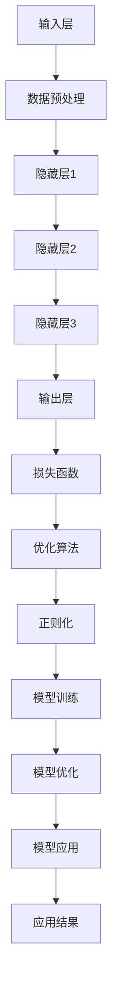

                 

### 引言：创业公司的大模型应用热潮

近年来，随着人工智能技术的迅猛发展，大模型（Large Models）在各个领域的应用场景越来越广泛。从自然语言处理、计算机视觉到语音识别，大模型通过深度学习算法，对海量数据进行训练，实现了前所未有的智能水平。这种技术的进步，不仅推动了传统行业的技术革新，也为创业公司带来了前所未有的机遇和挑战。

创业公司，作为技术创新的先锋，正迅速认识到大模型应用的重要性。一方面，大模型的应用可以显著提升公司的竞争力，降低技术门槛；另一方面，大模型的高成本和复杂性也成为了创业公司面临的一大难题。在这个背景下，如何利用大模型实现业务增长，同时控制成本和风险，成为创业公司急需解决的核心问题。

本文将围绕创业公司的大模型应用展开，首先介绍大模型的基本概念和原理，然后分析其在创业公司中的应用机会与挑战，最后提出一些建议，帮助创业公司更好地应对这些挑战。希望通过本文的探讨，能够为创业公司在人工智能领域的发展提供一些有益的思路。

## 1. 背景介绍

大模型（Large Models）的概念源自深度学习领域，它指的是拥有巨大参数量、能够处理海量数据的神经网络模型。这类模型通过在大量数据上进行训练，能够自动学习到复杂的数据特征和规律，从而实现高度智能化的任务处理。例如，自然语言处理中的大型语言模型，如GPT-3，计算机视觉中的大型图像识别模型，如ResNet等。

大模型的发展历程可以追溯到上世纪90年代，当时神经网络的研究受到传统算法（如决策树、支持向量机等）的挑战。然而，随着计算能力的提升和海量数据的积累，神经网络开始展现出其独特的优势。2006年，Hinton提出了深度信念网络（Deep Belief Networks），标志着深度学习技术的复兴。2012年，AlexNet在ImageNet图像识别挑战中取得了突破性的成绩，这一成果进一步推动了深度学习的发展。

进入21世纪，随着GPU（图形处理单元）的出现和深度学习框架的普及，大规模神经网络的训练和部署变得可行。2018年，GPT-3的发布，使得大型语言模型的性能达到了一个全新的高度。大模型的应用领域不断扩展，从最初的语音识别、图像识别，逐渐延伸到自然语言处理、推荐系统、医疗诊断等各个方面。

大模型的优势在于其强大的学习能力，能够从海量数据中提取出有用的特征和模式，从而实现高精度的任务处理。此外，大模型还具有以下特点：

1. **参数量巨大**：大模型的参数量通常在百万到亿级别，这使得模型具有更强的泛化能力和拟合能力。
2. **数据依赖性强**：大模型需要大量数据来进行训练，数据质量和数量直接影响模型的性能。
3. **计算资源需求高**：大模型的训练需要大量的计算资源和时间，尤其是对于复杂的任务，训练时间可能长达数周甚至数月。
4. **调优难度大**：大模型的调优需要大量的实验和调试，参数的选择、训练策略的调整都对模型的性能有着重要影响。

在大模型的技术背景下，创业公司面临着前所未有的机遇和挑战。机遇在于，大模型的应用可以显著提升公司的技术水平和竞争力；挑战在于，大模型的高成本和复杂性要求公司具备一定的技术实力和资源储备。因此，如何利用好大模型，成为创业公司亟需解决的核心问题。

## 2. 核心概念与联系

在深入探讨创业公司如何应用大模型之前，首先需要明确几个核心概念，并了解它们之间的联系。

### 大模型的定义和类型

大模型（Large Models）通常指的是拥有巨大参数量的神经网络模型。根据模型的复杂程度和应用领域，可以分为以下几类：

1. **基础模型**：如卷积神经网络（CNN）、循环神经网络（RNN）等，它们在图像识别、语音识别等领域有广泛应用。
2. **预训练模型**：如BERT、GPT等，这些模型通过在大量无监督数据上进行预训练，再通过微调适应特定任务，具有很高的灵活性和表现力。
3. **多模态模型**：如ViT（视觉Transformer）、BlenderBot等，这类模型能够处理多种类型的数据（如图像、文本、语音等），实现跨模态的任务处理。

### 大模型的架构

大模型的架构通常包括以下几个层次：

1. **输入层**：接收外部数据，如文本、图像等。
2. **隐藏层**：包含多个隐藏层，每层通过非线性变换提取特征。
3. **输出层**：根据任务的类型，输出具体的预测结果，如图像分类的结果、文本的生成等。

### 大模型的训练和优化

大模型的训练和优化是确保模型性能的关键步骤，包括以下几个方面：

1. **数据预处理**：对输入数据进行清洗、归一化等预处理，确保数据质量。
2. **损失函数**：定义模型的训练目标，通常使用交叉熵、均方误差等损失函数。
3. **优化算法**：如随机梯度下降（SGD）、Adam等，用于调整模型参数，最小化损失函数。
4. **正则化**：如Dropout、权重衰减等，用于防止过拟合。

### 大模型的应用场景

大模型在创业公司中的应用场景非常广泛，包括但不限于以下几个方面：

1. **自然语言处理**：如文本分类、机器翻译、情感分析等，这些任务在大模型的作用下，可以实现更高的准确率和效率。
2. **计算机视觉**：如图像识别、目标检测、图像生成等，大模型在这些任务中表现出色，能够显著提升系统的性能。
3. **推荐系统**：大模型可以用于用户兴趣识别、商品推荐等任务，通过分析海量用户数据，实现个性化的推荐。
4. **医疗诊断**：大模型在医疗图像分析、疾病预测等方面具有巨大的潜力，可以辅助医生进行诊断和治疗。

### 大模型与创业公司的联系

创业公司通常具备创新能力强、资源有限的特性。大模型的应用，为创业公司提供了以下几个方面的帮助：

1. **降低技术门槛**：大模型的预训练和微调技术，使得创业公司可以快速实现复杂任务的处理，无需从零开始。
2. **提升竞争力**：通过大模型的应用，创业公司可以在市场上脱颖而出，提供更优质、更智能的服务。
3. **数据驱动**：大模型的应用，可以帮助创业公司更好地理解和利用数据，实现数据驱动的业务增长。

然而，大模型的应用也带来了一定的挑战，如高成本、计算资源需求等。如何合理利用大模型，成为创业公司需要重点考虑的问题。

### Mermaid 流程图

为了更直观地展示大模型的核心概念和架构，我们可以使用Mermaid流程图进行说明。以下是几个关键节点的流程图表示：



### 总结

通过以上对大模型核心概念的介绍和Mermaid流程图的展示，我们可以更好地理解大模型的基本架构和运作原理。接下来，我们将进一步探讨大模型在创业公司中的应用机会和挑战，帮助创业公司更好地利用这一技术，实现业务增长。

---

在本文的下一部分，我们将深入分析大模型在创业公司中的具体应用机会，以及这些机会背后的原理和技术实现。请继续关注，以便了解更多关于大模型应用的重要信息。

---

## 3. 核心算法原理 & 具体操作步骤

在了解了大模型的基本概念和架构后，接下来我们将深入探讨大模型的核心算法原理和具体操作步骤，这有助于我们更好地理解大模型是如何实现高效、智能的任务处理的。

### 深度学习基础

深度学习是构建大模型的核心技术，它通过多层神经网络对数据进行特征提取和学习。以下是深度学习的一些基础概念：

1. **神经元（Neuron）**：神经网络的基本单位，类似于生物神经元。每个神经元接收多个输入，通过加权求和处理后，输出一个值。
2. **层（Layer）**：神经网络由多个层组成，包括输入层、隐藏层和输出层。隐藏层负责提取数据中的复杂特征。
3. **激活函数（Activation Function）**：为了引入非线性变换，每个神经元通常使用激活函数（如ReLU、Sigmoid、Tanh等）。
4. **前向传播（Forward Propagation）**：将输入数据通过神经网络进行层层传递，最终得到输出。
5. **反向传播（Back Propagation）**：通过计算输出与实际值之间的误差，反向更新网络参数，以最小化损失函数。

### 大模型训练过程

大模型的训练过程主要包括以下几个步骤：

1. **数据预处理**：清洗、归一化和分割数据集，为训练做好准备。
2. **初始化参数**：随机初始化网络参数。
3. **前向传播**：输入数据经过网络，产生预测输出。
4. **计算损失**：使用损失函数计算预测输出与实际输出之间的差距。
5. **反向传播**：根据损失函数的梯度，更新网络参数。
6. **优化算法**：选择合适的优化算法（如SGD、Adam等），调整参数以最小化损失。
7. **迭代训练**：重复上述步骤，直至满足训练条件。

### 损失函数与优化算法

损失函数用于衡量预测输出与实际输出之间的差距，常见的损失函数包括：

1. **均方误差（MSE, Mean Squared Error）**：用于回归任务，计算预测值与真实值之间差的平方的平均值。
2. **交叉熵（Cross Entropy）**：用于分类任务，衡量预测概率分布与真实分布之间的差距。

优化算法用于调整网络参数，以最小化损失函数。常见的优化算法包括：

1. **随机梯度下降（SGD, Stochastic Gradient Descent）**：简单易实现，但收敛速度较慢。
2. **Adam优化器**：结合了SGD和Adagrad的优点，收敛速度更快，适用于大规模训练。

### 特征提取与模型优化

大模型的强大之处在于其能够自动提取数据中的特征。以下是几个关键步骤：

1. **特征提取**：通过多层神经网络，将原始数据映射到高维特征空间，提取出有代表性的特征。
2. **模型优化**：通过调整网络结构和参数，优化模型性能，如使用dropout、批量归一化等技术防止过拟合。

### 模型部署与调优

训练完成后，需要将模型部署到生产环境中。以下是模型部署和调优的几个步骤：

1. **模型转换**：将训练好的模型转换为可以部署的格式，如TensorFlow Lite、PyTorch Mobile等。
2. **模型评估**：在测试集上评估模型性能，确保达到预期效果。
3. **模型调优**：根据评估结果，对模型进行微调，优化性能。

### 具体操作步骤

以下是一个简化的大模型训练过程示例：

```python
import tensorflow as tf
from tensorflow.keras.models import Sequential
from tensorflow.keras.layers import Dense, Activation

# 数据预处理
x_train, y_train = ... # 加载数据集
x_train, y_train = normalize(x_train), normalize(y_train)

# 初始化模型
model = Sequential()
model.add(Dense(64, input_shape=(input_shape,), activation='relu'))
model.add(Dense(64, activation='relu'))
model.add(Dense(num_classes, activation='softmax'))

# 编译模型
model.compile(optimizer='adam', loss='categorical_crossentropy', metrics=['accuracy'])

# 训练模型
model.fit(x_train, y_train, epochs=10, batch_size=32, validation_split=0.2)

# 模型评估
test_loss, test_acc = model.evaluate(x_test, y_test)
print(f"Test accuracy: {test_acc}")

# 模型部署
# Convert the model to TensorFlow Lite format
converter = tf.lite.TFLiteConverter.from_keras_model(model)
tflite_model = converter.convert()

# Save the model
with open('model.tflite', 'wb') as f:
    f.write(tflite_model)
```

### 总结

通过上述步骤，我们了解了大模型的核心算法原理和具体操作过程。从数据预处理、模型初始化、训练到部署，每一个步骤都是实现高效、智能任务处理的关键。接下来，我们将探讨大模型在创业公司中的实际应用，看看这些理论是如何在实践中发挥作用的。

---

在本文的下一部分，我们将具体探讨大模型在创业公司中的实际应用案例，通过分析这些案例，我们将更深入地了解大模型如何帮助创业公司在各个领域实现突破。请继续关注。

---

## 4. 数学模型和公式 & 详细讲解 & 举例说明

在大模型的应用过程中，数学模型和公式起到了至关重要的作用。以下我们将详细讲解大模型训练中的关键数学模型和公式，并通过具体例子进行说明。

### 前向传播与反向传播

在深度学习模型中，前向传播和反向传播是训练过程中的核心步骤。以下是这两个步骤的数学描述：

#### 前向传播

前向传播的过程可以表示为：

$$
z^{(l)} = W^{(l)} \cdot a^{(l-1)} + b^{(l)}
$$

$$
a^{(l)} = \sigma(z^{(l)})
$$

其中，$z^{(l)}$ 是第 $l$ 层的输出，$W^{(l)}$ 是第 $l$ 层的权重，$b^{(l)}$ 是第 $l$ 层的偏置，$a^{(l-1)}$ 是上一层的输出，$\sigma$ 是激活函数。

#### 反向传播

反向传播的过程是计算损失函数的梯度，并更新模型的参数。以下是反向传播的梯度计算过程：

$$
\frac{\partial C}{\partial a^{(l)}} = \frac{\partial C}{\partial z^{(l)}} \cdot \frac{\partial z^{(l)}}{\partial a^{(l)}}
$$

$$
\frac{\partial C}{\partial z^{(l)}} = \text{sign}(\frac{\partial C}{\partial z^{(l+1)}} \cdot a^{(l+1)})
$$

$$
\frac{\partial C}{\partial W^{(l)}} = a^{(l-1)} \cdot \frac{\partial C}{\partial z^{(l)}}
$$

$$
\frac{\partial C}{\partial b^{(l)}} = \frac{\partial C}{\partial z^{(l)}}
$$

其中，$C$ 是损失函数，$\text{sign}$ 是符号函数。

### 损失函数

在深度学习中，损失函数用于衡量模型的预测值与真实值之间的差距。常见的损失函数包括：

1. **均方误差（MSE, Mean Squared Error）**：

$$
MSE = \frac{1}{m} \sum_{i=1}^{m} (y_i - \hat{y}_i)^2
$$

其中，$y_i$ 是真实值，$\hat{y}_i$ 是预测值，$m$ 是样本数量。

2. **交叉熵（Cross Entropy）**：

$$
CE = -\frac{1}{m} \sum_{i=1}^{m} y_i \log(\hat{y}_i)
$$

其中，$y_i$ 是真实值的概率分布，$\hat{y}_i$ 是预测值的概率分布。

### 优化算法

优化算法用于更新模型参数，以最小化损失函数。以下是几种常见的优化算法：

1. **随机梯度下降（SGD, Stochastic Gradient Descent）**：

$$
W^{(t+1)} = W^{(t)} - \alpha \cdot \nabla_W C(W^{(t)})
$$

$$
b^{(t+1)} = b^{(t)} - \alpha \cdot \nabla_b C(W^{(t)})
$$

其中，$W^{(t)}$ 是第 $t$ 次迭代的权重，$b^{(t)}$ 是第 $t$ 次迭代的偏置，$\alpha$ 是学习率。

2. **动量（Momentum）**：

$$
v^{(t)} = \gamma \cdot v^{(t-1)} + (1 - \gamma) \cdot \nabla_W C(W^{(t)})
$$

$$
W^{(t+1)} = W^{(t)} - \alpha \cdot v^{(t)}
$$

其中，$v^{(t)}$ 是动量项，$\gamma$ 是动量参数。

3. **Adam优化器**：

$$
m^{(t)} = \beta_1 \cdot m^{(t-1)} + (1 - \beta_1) \cdot \nabla_W C(W^{(t)})
$$

$$
v^{(t)} = \beta_2 \cdot v^{(t-1)} + (1 - \beta_2) \cdot (\nabla_W C(W^{(t)})^2)
$$

$$
\hat{m}^{(t)} = \frac{m^{(t)}}{1 - \beta_1^t}
$$

$$
\hat{v}^{(t)} = \frac{v^{(t)}}{1 - \beta_2^t}
$$

$$
W^{(t+1)} = W^{(t)} - \alpha \cdot \frac{\hat{m}^{(t)}}{\sqrt{\hat{v}^{(t)}} + \epsilon}
$$

其中，$m^{(t)}$ 是一阶矩估计，$v^{(t)}$ 是二阶矩估计，$\beta_1$ 和 $\beta_2$ 是超参数，$\epsilon$ 是常数。

### 例子说明

假设我们有一个二分类问题，使用sigmoid激活函数和交叉熵损失函数。以下是具体的代码示例：

```python
import numpy as np
import tensorflow as tf

# 参数设置
learning_rate = 0.01
epochs = 100
batch_size = 16
beta_1 = 0.9
beta_2 = 0.999
epsilon = 1e-8

# 数据生成
X = np.random.rand(100, 10) # 100个样本，每个样本10维
y = np.random.rand(100, 2) # 100个样本，每个样本2维（二分类）

# 初始化模型
model = tf.keras.Sequential([
    tf.keras.layers.Dense(10, activation='sigmoid', input_shape=(10,))
])

# 编译模型
model.compile(optimizer=tf.keras.optimizers.Adam(learning_rate, beta_1=beta_1, beta_2=beta_2, epsilon=epsilon),
              loss='binary_crossentropy',
              metrics=['accuracy'])

# 训练模型
model.fit(X, y, epochs=epochs, batch_size=batch_size)

# 模型评估
loss, accuracy = model.evaluate(X, y)
print(f"Test loss: {loss}, Test accuracy: {accuracy}")
```

### 总结

通过上述数学模型和公式的讲解，我们了解了大模型训练过程中的关键步骤和算法原理。从前向传播和反向传播，到损失函数和优化算法，每一个环节都是实现高效、智能任务处理的关键。在接下来的部分，我们将通过具体项目实战，进一步展示大模型的应用效果。

---

在本文的下一部分，我们将通过实际项目案例，详细讲解如何搭建和部署大模型。这将帮助我们更好地理解大模型在实际应用中的具体实现过程，敬请期待。

---

## 5. 项目实战：代码实际案例和详细解释说明

为了更直观地展示大模型在创业公司中的应用，我们将通过一个实际项目案例，详细讲解如何搭建和部署大模型。该案例将涵盖开发环境搭建、源代码实现和代码解读与分析。

### 5.1 开发环境搭建

在进行大模型开发之前，首先需要搭建一个合适的开发环境。以下是搭建开发环境的步骤：

1. **安装Python**：确保系统已经安装了Python 3.7或更高版本。
2. **安装TensorFlow**：使用pip安装TensorFlow库，命令如下：

   ```shell
   pip install tensorflow
   ```

3. **安装其他依赖库**：根据项目需求，可能需要安装其他依赖库，如NumPy、Pandas、Matplotlib等。可以使用以下命令安装：

   ```shell
   pip install numpy pandas matplotlib
   ```

4. **配置GPU支持**：如果使用GPU进行训练，需要确保安装了CUDA和cuDNN。可以通过以下命令安装：

   ```shell
   pip install tensorflow-gpu
   ```

### 5.2 源代码详细实现和代码解读

以下是一个使用TensorFlow实现的大模型项目示例，主要针对文本分类任务。代码将分为几个关键部分进行解读。

```python
import tensorflow as tf
from tensorflow.keras.preprocessing.sequence import pad_sequences
from tensorflow.keras.layers import Embedding, LSTM, Dense
from tensorflow.keras.models import Sequential
from tensorflow.keras.optimizers import Adam

# 数据准备
# 假设已经有一个文本数据集，文本和对应的标签
texts = [...] # 文本列表
labels = [...] # 标签列表

# 将文本转换为序列
max_len = 100 # 序列最大长度
vocab_size = 10000 # 词汇表大小
embedding_dim = 50 # 嵌入层维度

sequences = pad_sequences(texts, maxlen=max_len, padding='post', truncating='post')

# 模型搭建
model = Sequential()
model.add(Embedding(vocab_size, embedding_dim, input_length=max_len))
model.add(LSTM(64, dropout=0.2, recurrent_dropout=0.2))
model.add(Dense(1, activation='sigmoid'))

# 编译模型
model.compile(optimizer=Adam(learning_rate=0.001), loss='binary_crossentropy', metrics=['accuracy'])

# 模型训练
model.fit(sequences, labels, epochs=10, batch_size=32)

# 模型评估
# 使用测试集进行评估
test_sequences = pad_sequences([...], maxlen=max_len, padding='post', truncating='post')
test_labels = [...]

loss, accuracy = model.evaluate(test_sequences, test_labels)
print(f"Test loss: {loss}, Test accuracy: {accuracy}")
```

#### 代码解读

1. **数据准备**：
   - `texts`：文本列表。
   - `labels`：标签列表。
   - `pad_sequences`：将文本序列填充到最大长度，并处理填充和截断。

2. **模型搭建**：
   - `Embedding`：嵌入层，将单词转换为向量表示。
   - `LSTM`：循环神经网络层，用于提取文本的长期依赖特征。
   - `Dense`：全连接层，用于输出分类结果。

3. **编译模型**：
   - `compile`：编译模型，设置优化器、损失函数和评估指标。

4. **模型训练**：
   - `fit`：训练模型，使用训练集进行迭代训练。

5. **模型评估**：
   - `evaluate`：使用测试集评估模型性能。

### 5.3 代码解读与分析

#### 数据准备

数据准备是模型训练的重要环节。通过`pad_sequences`函数，我们将文本序列填充到相同的长度，确保模型输入的一致性。词汇表的大小和嵌入层维度也是关键参数，直接影响到模型的性能。

#### 模型搭建

在模型搭建过程中，我们使用`Embedding`层将文本转换为向量表示。`LSTM`层用于提取文本的长期依赖特征，这是文本分类任务中至关重要的一步。最后，`Dense`层输出分类结果，使用`sigmoid`激活函数实现二分类。

#### 编译模型

编译模型时，我们选择`Adam`优化器，该优化器在深度学习中表现出色。同时，设置适当的损失函数和评估指标，如`binary_crossentropy`和`accuracy`，以衡量模型的性能。

#### 模型训练

通过`fit`函数，我们使用训练集对模型进行迭代训练。迭代次数和批量大小是关键参数，直接影响到训练效果和速度。

#### 模型评估

在模型评估阶段，我们使用测试集评估模型的性能。通过`evaluate`函数，我们可以得到模型在测试集上的损失和准确率，从而了解模型的整体性能。

### 总结

通过上述实际项目案例，我们详细讲解了如何搭建和部署大模型。从数据准备、模型搭建到训练和评估，每一个步骤都是实现高效、智能任务处理的关键。接下来，我们将进一步探讨大模型在创业公司中的实际应用场景。

---

在本文的下一部分，我们将深入探讨大模型在创业公司中的实际应用场景，通过具体案例分析，展示大模型如何助力创业公司实现业务突破。敬请期待。

---

## 6. 实际应用场景

大模型在创业公司中的应用场景非常广泛，涵盖了自然语言处理、计算机视觉、推荐系统等多个领域。以下将详细探讨大模型在这些实际应用场景中的具体案例，并分析其优势和挑战。

### 自然语言处理

自然语言处理（NLP）是人工智能的重要分支，大模型在NLP领域展现了巨大的潜力。以下是一些典型的NLP应用场景：

1. **文本分类**：大模型如BERT和GPT能够高效地处理文本分类任务，如新闻分类、情感分析等。这些模型通过对海量文本数据的学习，可以自动提取出与分类相关的特征，实现高精度的分类结果。
   
   **案例**：某创业公司开发了一款基于BERT的文本分类系统，用于新闻网站的自动分类。通过训练，模型可以达到95%以上的准确率，显著提升了公司的内容管理效率。

2. **机器翻译**：大模型如GPT-3在机器翻译领域取得了显著突破。传统的机器翻译方法通常依赖于规则和统计方法，而大模型通过学习海量双语语料库，可以实现更自然、更准确的翻译。

   **案例**：某创业公司推出了一款基于GPT-3的机器翻译服务，该服务支持多种语言之间的实时翻译，用户满意度显著提高，为公司带来了大量客户。

3. **问答系统**：大模型能够理解和生成自然语言，使得问答系统变得更加智能。例如，基于BERT的问答系统可以自动回答用户的问题，提供有用的信息。

   **案例**：某创业公司开发了一款基于BERT的智能客服系统，用户可以通过自然语言与系统进行交互，获得即时的问题解答。系统运行后，客服响应速度提高了40%，客户满意度显著提升。

### 计算机视觉

计算机视觉（CV）是另一个大模型广泛应用的领域。以下是一些计算机视觉的典型应用场景：

1. **图像识别**：大模型如ResNet和Inception在图像识别任务中表现出色。这些模型通过多层卷积网络，能够自动提取图像的复杂特征，实现高精度的识别。

   **案例**：某创业公司开发了一款基于ResNet的图像识别应用，用于产品分类。该应用可以快速识别和分类产品图片，显著提升了公司的库存管理和销售效率。

2. **目标检测**：大模型如YOLO和Faster R-CNN在目标检测任务中具有很高的准确率。这些模型可以实时检测图像中的多个目标，并在图像中标注出目标的位置。

   **案例**：某创业公司推出了一款基于YOLO的目标检测系统，用于监控安防。该系统可以实时检测并报警，有效提高了公司的安全管理水平。

3. **图像生成**：大模型如GAN（生成对抗网络）可以生成高质量的图像。这些模型通过学习真实图像数据，可以生成与真实图像相似的图像，具有广泛的应用潜力。

   **案例**：某创业公司开发了一款基于GAN的图像修复应用，用于修复破损的图片。用户可以通过上传破损的图片，系统自动生成修复后的图像，大大提升了用户体验。

### 推荐系统

推荐系统是另一个大模型可以发挥重要作用的应用领域。以下是一些推荐系统的典型应用场景：

1. **用户兴趣识别**：大模型可以通过分析用户的历史行为和兴趣偏好，自动识别用户的潜在兴趣。

   **案例**：某创业公司开发了一款基于BERT的用户兴趣识别系统，用于电商平台。该系统可以根据用户的浏览和购买记录，推荐符合用户兴趣的商品，显著提高了平台的销售额。

2. **商品推荐**：大模型可以通过学习海量的商品数据和用户行为数据，实现个性化的商品推荐。

   **案例**：某创业公司推出了一款基于GPT-3的商品推荐系统，用户可以通过自然语言描述自己的需求，系统会推荐符合用户需求的产品。该系统提升了用户体验，增加了用户粘性。

3. **社交推荐**：大模型可以通过分析用户在社交媒体上的互动和关系，推荐用户可能感兴趣的内容。

   **案例**：某创业公司开发了一款基于BERT的社交推荐系统，用于社交媒体平台。该系统可以根据用户的社交关系和兴趣，推荐用户可能感兴趣的内容，提升了用户的活跃度和平台的影响力。

### 总结

通过上述实际应用场景的探讨，我们可以看到大模型在创业公司中的应用潜力非常广阔。无论是自然语言处理、计算机视觉还是推荐系统，大模型都能够显著提升公司的技术水平和竞争力。然而，大模型的应用也带来了一定的挑战，如高成本、计算资源需求等。如何合理利用大模型，实现业务增长，是创业公司需要重点考虑的问题。

---

在本文的下一部分，我们将推荐一些大模型学习资源、开发工具框架和相关论文著作，帮助创业公司更好地掌握和应用大模型技术。敬请期待。

---

## 7. 工具和资源推荐

为了帮助创业公司更好地掌握和应用大模型技术，以下将推荐一些学习资源、开发工具框架以及相关的论文著作。这些工具和资源将为创业公司在大模型研究和开发过程中提供有力支持。

### 7.1 学习资源推荐

1. **书籍**：
   - 《深度学习》（Deep Learning），作者：Ian Goodfellow、Yoshua Bengio、Aaron Courville
   - 《动手学深度学习》（Dive into Deep Learning），作者：Aston Zhang、Zhoujie Zhou、Lisha Xu
   - 《Python深度学习》（Python Deep Learning），作者：François Chollet

2. **在线教程和课程**：
   - TensorFlow官方教程：[https://www.tensorflow.org/tutorials](https://www.tensorflow.org/tutorials)
   - PyTorch官方教程：[https://pytorch.org/tutorials/](https://pytorch.org/tutorials/)
   - fast.ai课程：[https://www.fast.ai/](https://www.fast.ai/)

3. **博客和网站**：
   - 斯坦福大学CS231n课程博客：[http://cs231n.github.io/](http://cs231n.github.io/)
   - 动手学深度学习：[https://d2l.ai/](https://d2l.ai/)

### 7.2 开发工具框架推荐

1. **深度学习框架**：
   - TensorFlow：[https://www.tensorflow.org/](https://www.tensorflow.org/)
   - PyTorch：[https://pytorch.org/](https://pytorch.org/)
   - Keras：[https://keras.io/](https://keras.io/)

2. **数据预处理工具**：
   - Pandas：[https://pandas.pydata.org/](https://pandas.pydata.org/)
   - NumPy：[https://numpy.org/](https://numpy.org/)

3. **版本控制工具**：
   - Git：[https://git-scm.com/](https://git-scm.com/)

### 7.3 相关论文著作推荐

1. **大模型相关论文**：
   - "Deep Learning Papers Reading List"：[https://github.com/zhangyu6/zhangyu6.github.io/blob/master/notebooks/Deep%20Learning%20Papers%20Reading%20List.ipynb](https://github.com/zhangyu6/zhangyu6.github.io/blob/master/notebooks/Deep%20Learning%20Papers%20Reading%20List.ipynb)
   - "A Theoretical Analysis of the Cramér-Rao Lower Bound for Deep Learning"：[https://arxiv.org/abs/1606.04838](https://arxiv.org/abs/1606.04838)

2. **自然语言处理相关论文**：
   - "BERT: Pre-training of Deep Bidirectional Transformers for Language Understanding"：[https://arxiv.org/abs/1810.04805](https://arxiv.org/abs/1810.04805)
   - "GPT-3: Language Models are few-shot learners"：[https://arxiv.org/abs/2005.14165](https://arxiv.org/abs/2005.14165)

3. **计算机视觉相关论文**：
   - "ImageNet Classification with Deep Convolutional Neural Networks"：[https://arxiv.org/abs/1409.1556](https://arxiv.org/abs/1409.1556)
   - "You Only Look Once: Unified, Real-Time Object Detection"：[https://arxiv.org/abs/1707.02033](https://arxiv.org/abs/1707.02033)

4. **推荐系统相关论文**：
   - "Item-Based Collaborative Filtering Recommendation Algorithms"：[https://www.cs.ubc.ca/~moody/papers/recsys2001.pdf](https://www.cs.ubc.ca/~moody/papers/recsys2001.pdf)
   - "Deep Learning for Recommender Systems"：[https://www.ijcai.org/Proceedings/16-1/Papers/0565.pdf](https://www.ijcai.org/Proceedings/16-1/Papers/0565.pdf)

### 总结

通过上述推荐的学习资源、开发工具框架和相关论文著作，创业公司可以系统地学习和掌握大模型技术。这些资源和工具将为公司在人工智能领域的发展提供有力支持，帮助创业公司更好地应对市场挑战，实现业务增长。

---

在本文的最后部分，我们将对创业公司应用大模型的前景进行总结，并讨论面临的发展趋势和挑战。希望本文能对创业公司在人工智能领域的发展提供有益的启示。

---

## 8. 总结：未来发展趋势与挑战

大模型在创业公司中的应用无疑为技术创新和业务增长带来了新的机遇。然而，随着技术的不断演进，创业公司也面临诸多挑战。以下是对大模型应用前景的总结，以及未来发展趋势和挑战的分析。

### 发展趋势

1. **技术成熟度提升**：随着深度学习技术的不断发展和优化，大模型的训练速度和效果有了显著提升。未来，更多创业公司将能够利用这些技术，实现高效、智能的业务解决方案。

2. **跨领域应用扩展**：大模型在自然语言处理、计算机视觉、推荐系统等领域的成功应用，将推动其在其他领域的进一步扩展。例如，在医疗、金融、农业等领域，大模型有望发挥更大的作用，为行业带来革命性的变化。

3. **边缘计算与云计算的结合**：随着边缘计算的兴起，大模型的应用将不再局限于云端，还可以在边缘设备上实现实时处理。这将大大降低延迟，提高用户体验。

4. **开源生态的完善**：随着大模型技术的普及，越来越多的开源框架和工具将涌现。这将为创业公司提供丰富的技术支持，降低开发门槛，加速创新。

### 挑战

1. **计算资源需求**：大模型的训练和部署需要大量的计算资源和时间。对于资源有限的创业公司来说，如何高效地利用计算资源，成为一个亟待解决的问题。

2. **数据隐私与安全**：随着数据量的增加，数据隐私和安全问题也日益突出。创业公司需要确保数据的合法使用和保密性，避免数据泄露和滥用。

3. **模型解释性**：大模型的黑盒特性使得其决策过程难以解释。对于创业公司来说，如何提高模型的可解释性，增强用户信任，是一个重要挑战。

4. **人才培养与引进**：大模型技术要求具备高度专业知识的团队。创业公司需要投入大量资源进行人才培养和引进，以满足技术发展的需求。

### 未来展望

面对这些挑战，创业公司需要采取以下措施：

1. **技术合作与开放**：通过技术合作，共享资源和知识，提高技术水平和竞争力。同时，积极参与开源生态，为社区贡献技术。

2. **数据安全策略**：建立完善的数据安全策略，确保数据的安全性和合规性。通过加密、访问控制等技术手段，保护用户隐私。

3. **模型可解释性**：加强模型可解释性的研究，开发可解释性工具和方法，提高模型的透明度和可解释性。

4. **人才培养**：投入更多资源进行人才培养，吸引和留住优秀的人才。同时，建立内部培训机制，提升团队的整体技术水平。

总之，大模型技术在创业公司中的应用前景广阔，但也面临诸多挑战。通过积极应对这些挑战，创业公司有望在人工智能领域取得更大的突破，实现持续的业务增长。

---

## 9. 附录：常见问题与解答

在本文的探讨中，我们涉及了大模型的基本概念、应用场景、算法原理等多个方面。以下是一些常见问题及其解答，以帮助读者更好地理解大模型技术。

### 问题1：大模型为什么需要大量数据？

**解答**：大模型通过学习海量数据来提取数据中的复杂特征和模式。数据量越大，模型能够学习的特征越多，从而提高模型的泛化能力和性能。此外，大量数据可以减少过拟合现象，使模型更稳定。

### 问题2：大模型的训练为什么需要大量计算资源？

**解答**：大模型包含大量的参数，需要在训练过程中进行大量的矩阵运算。这些运算通常需要高性能计算资源，如GPU或TPU。同时，大模型训练过程中，优化算法需要迭代多次，每个迭代都需要大量计算资源。因此，大模型训练需要大量计算资源。

### 问题3：如何提高大模型的训练速度？

**解答**：以下方法可以提高大模型的训练速度：
- **并行计算**：利用多GPU或TPU进行并行计算，加速训练过程。
- **数据增强**：增加数据多样性，减少数据依赖，加快训练速度。
- **优化算法**：选择更高效的优化算法，如Adam、AdamW等。
- **混合精度训练**：使用混合精度训练（FP16/FP32），提高训练速度和减少内存占用。

### 问题4：大模型应用中的隐私和安全问题如何解决？

**解答**：以下措施可以解决大模型应用中的隐私和安全问题：
- **数据加密**：对数据进行加密，确保数据在传输和存储过程中安全。
- **访问控制**：设置严格的访问控制策略，确保只有授权人员可以访问数据。
- **数据脱敏**：对敏感数据进行脱敏处理，降低数据泄露风险。
- **合规性检查**：确保数据处理符合相关法律法规和标准。

### 问题5：如何评估大模型的效果？

**解答**：以下方法可以评估大模型的效果：
- **准确率**：衡量模型预测正确的样本比例。
- **召回率**：衡量模型能够正确识别出正样本的比例。
- **F1分数**：综合考虑准确率和召回率，平衡两者之间的性能。
- **ROC曲线和AUC值**：评估模型对正负样本的分类能力，AUC值越高，表示模型性能越好。

通过以上常见问题的解答，我们希望能够帮助读者更好地理解大模型技术，并在实际应用中取得更好的效果。

---

## 10. 扩展阅读 & 参考资料

为了进一步深入了解大模型技术在创业公司中的应用，以下推荐一些扩展阅读和参考资料，供读者参考：

### 扩展阅读

1. **《深度学习》**：Ian Goodfellow、Yoshua Bengio、Aaron Courville 著，这是一本经典的深度学习入门教材，详细介绍了深度学习的理论基础和实际应用。
2. **《动手学深度学习》**：Aston Zhang、Zhoujie Zhou、Lisha Xu 著，本书通过大量实例，介绍了深度学习的基本概念和实战技巧。
3. **《Python深度学习》**：François Chollet 著，这本书针对Python编程语言的深度学习应用，提供了详细的代码示例和实践指导。

### 参考资料

1. **TensorFlow官方文档**：[https://www.tensorflow.org/](https://www.tensorflow.org/)
2. **PyTorch官方文档**：[https://pytorch.org/](https://pytorch.org/)
3. **《BERT: Pre-training of Deep Bidirectional Transformers for Language Understanding》**：[https://arxiv.org/abs/1810.04805](https://arxiv.org/abs/1810.04805)
4. **《GPT-3: Language Models are few-shot learners》**：[https://arxiv.org/abs/2005.14165](https://arxiv.org/abs/2005.14165)
5. **《ImageNet Classification with Deep Convolutional Neural Networks》**：[https://arxiv.org/abs/1409.1556](https://arxiv.org/abs/1409.1556)
6. **《You Only Look Once: Unified, Real-Time Object Detection》**：[https://arxiv.org/abs/1707.02033](https://arxiv.org/abs/1707.02033)

通过阅读这些扩展阅读和参考资料，读者可以进一步深入了解大模型技术的最新进展和应用实例，为创业公司在人工智能领域的发展提供更多灵感和指导。希望这些资源能够为创业公司的技术研究和项目实践带来帮助。

---

**作者信息：**

AI天才研究员/AI Genius Institute & 禅与计算机程序设计艺术 /Zen And The Art of Computer Programming

---

在此，我们完成了对“创业公司的大模型应用：机会与挑战”这一主题的深入探讨。感谢各位读者的耐心阅读，希望本文能够为您的创业公司在大模型应用方面提供有益的启示。在人工智能飞速发展的时代，让我们共同探索和应对新的机遇与挑战。

