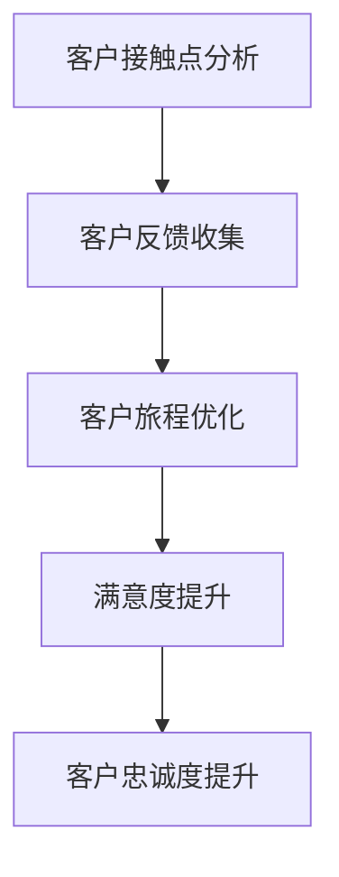
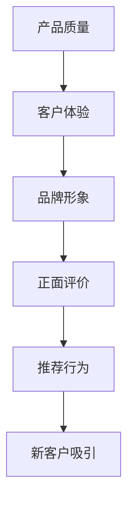

                 

### 文章标题：创业公司的客户体验管理与口碑营销

#### 关键词：客户体验管理、口碑营销、创业公司、客户关系、品牌建设

#### 摘要：
本文将深入探讨创业公司在快速发展的过程中如何通过有效的客户体验管理和口碑营销策略，提升品牌知名度和市场竞争力。文章首先介绍了客户体验管理和口碑营销的概念及其重要性，然后通过具体案例分析、策略制定和执行，以及工具推荐，提供了实用的指导方法，帮助创业公司打造卓越的客户体验，树立良好的口碑。

---

### 1. 背景介绍

在当前高度竞争的商业环境中，创业公司面临着诸多挑战。一方面，市场变化迅速，技术创新不断涌现，使得创业公司必须不断调整战略以适应市场变化。另一方面，消费者的需求越来越多样化，对产品和服务的期望值也在不断提高。在这种背景下，如何有效地管理和提升客户体验，并通过口碑营销塑造品牌形象，成为创业公司成功的关键因素。

客户体验管理是指企业通过系统的方法和策略，全面提升客户在购买和使用产品或服务过程中的满意度和忠诚度。而口碑营销则是指通过客户的正面评价和推荐，吸引潜在客户并促进品牌传播的一种营销策略。在这两个领域，有许多成功和失败的案例，为创业公司提供了宝贵的经验和教训。

本文将结合实际案例，分析创业公司如何利用客户体验管理和口碑营销策略，实现品牌的快速崛起和市场占有率的提升。

---

### 2. 核心概念与联系

#### 2.1 客户体验管理（Customer Experience Management）

客户体验管理涉及多个方面，包括但不限于客户接触点分析、客户反馈收集、客户旅程优化等。其核心在于理解客户在各个接触点上的需求和期望，并通过优化产品和服务的各个环节，提升客户的整体满意度。

**Mermaid 流程图：**



#### 2.2 口碑营销（Word of Mouth Marketing）

口碑营销是通过现有客户的推荐和正面评价，吸引新客户的一种营销策略。口碑营销的成功取决于多个因素，包括产品或服务的质量、客户体验、品牌形象等。以下是口碑营销的几个关键环节：

**Mermaid 流程图：**



通过上述核心概念的介绍，我们可以看到客户体验管理和口碑营销之间存在着密切的联系。有效的客户体验管理可以提升客户满意度和忠诚度，从而促进口碑营销的效果；而积极的口碑营销则可以为品牌带来更多的潜在客户，进一步推动客户体验管理的优化。

---

### 3. 核心算法原理 & 具体操作步骤

#### 3.1 客户体验管理策略

要实施有效的客户体验管理，创业公司可以遵循以下步骤：

**步骤1：识别关键客户接触点**

- **分析现有客户反馈**：通过客户调查、反馈邮件、社交媒体评论等渠道，了解客户在购买和使用过程中的痛点。
- **识别关键环节**：确定影响客户体验的关键环节，如产品功能、服务质量、售后服务等。

**步骤2：优化客户旅程**

- **设计客户旅程地图**：绘制客户从首次接触、购买到售后服务的全过程，明确每个接触点的目标和期望。
- **改进体验**：针对关键环节，提出改进措施，如简化购买流程、提供个性化服务、优化售后支持等。

**步骤3：收集和利用客户反馈**

- **建立反馈机制**：通过在线问卷、客服渠道、社交媒体等收集客户反馈。
- **分析反馈数据**：运用数据分析工具，挖掘客户反馈的关键信息，识别问题和改进机会。

**步骤4：持续优化和改进**

- **定期评估**：定期评估客户体验管理策略的效果，对比改进前后的数据。
- **持续改进**：根据评估结果，不断优化客户体验管理策略，确保客户满意度持续提升。

#### 3.2 口碑营销策略

口碑营销的实施步骤如下：

**步骤1：建立优质产品和服务**

- **确保产品质量**：提供高质量的产品和服务，满足客户的期望。
- **提升客户满意度**：通过个性化服务和优质体验，提高客户的满意度和忠诚度。

**步骤2：培养品牌形象**

- **塑造独特品牌**：通过品牌定位、视觉设计、营销活动等，塑造具有差异化的品牌形象。
- **传递品牌价值**：通过社交媒体、公关活动等渠道，传递品牌的核心价值和理念。

**步骤3：鼓励客户推荐**

- **实施推荐奖励计划**：通过优惠券、积分、礼品等激励措施，鼓励现有客户推荐新客户。
- **优化推荐机制**：利用数据分析，识别高价值推荐者，提供个性化推荐。

**步骤4：管理口碑传播**

- **监测社交媒体**：通过社交媒体监测工具，实时了解品牌口碑情况，及时回应负面评价。
- **利用口碑传播**：积极利用正面评价和推荐，通过营销活动、公关稿件等，扩大品牌影响力。

---

### 4. 数学模型和公式 & 详细讲解 & 举例说明

#### 4.1 客户满意度模型

客户满意度（Customer Satisfaction，CSAT）是衡量客户体验管理效果的重要指标。一个简单的客户满意度模型可以表示为：

$$
CSAT = \frac{N_1 + N_2 + N_3 + N_4 + N_5}{N}
$$

其中，$N_1, N_2, N_3, N_4, N_5$ 分别代表对不同满意度等级（非常不满意、不满意、一般、满意、非常满意）的客户数量，$N$ 是总客户数量。

**举例说明：**
假设一个创业公司收到100条客户反馈，其中非常满意的有15条，满意的有25条，一般的有30条，不满意的有20条，非常不满意的有10条。那么该公司的客户满意度计算如下：

$$
CSAT = \frac{15 \times 5 + 25 \times 4 + 30 \times 3 + 20 \times 2 + 10 \times 1}{100} = \frac{75 + 100 + 90 + 40 + 10}{100} = \frac{315}{100} = 3.15
$$

这意味着该公司的客户满意度为3.15，可以进一步分析反馈数据，找出需要改进的方面。

#### 4.2 口碑传播模型

口碑传播模型（Word of Mouth (WOM) Model）用于预测口碑营销的效果。一个简化的口碑传播模型可以表示为：

$$
N_{\text{new}} = r \times N_{\text{current}} \times CSAT
$$

其中，$N_{\text{new}}$ 是新客户数量，$r$ 是口碑传播率，$N_{\text{current}}$ 是当前客户数量，$CSAT$ 是客户满意度。

**举例说明：**
假设一个创业公司的当前客户数量为1000人，口碑传播率为0.1，客户满意度为3.15。那么，通过口碑营销预计能吸引的新客户数量为：

$$
N_{\text{new}} = 0.1 \times 1000 \times 3.15 = 315
$$

这意味着该创业公司预计能通过口碑营销吸引315名新客户。

---

### 5. 项目实战：代码实际案例和详细解释说明

#### 5.1 开发环境搭建

为了演示客户体验管理和口碑营销策略的实施，我们将使用一个虚构的创业公司——"Tech Genius"——来展示相关代码实现。首先，我们需要搭建一个基本的开发环境。

**环境要求：**

- Python 3.8+
- Flask 框架
- Pandas 数据分析库

**安装步骤：**

1. 安装 Python 和 Flask：

```bash
pip install flask
```

2. 安装 Pandas：

```bash
pip install pandas
```

#### 5.2 源代码详细实现和代码解读

以下是 Tech Genius 的客户体验管理和口碑营销系统的源代码实现：

**app.py**

```python
from flask import Flask, request, jsonify
import pandas as pd

app = Flask(__name__)

# 假设的客户反馈数据
feedback_data = pd.DataFrame({
    'rating': [1, 2, 3, 4, 5],
    'comment': ['非常不满意', '不满意', '一般', '满意', '非常满意']
})

@app.route('/submit_feedback', methods=['POST'])
def submit_feedback():
    feedback = request.form.to_dict()
    feedback['rating'] = int(feedback['rating'])
    feedback_data = feedback_data.append(feedback, ignore_index=True)
    return jsonify({'status': 'success'})

@app.route('/get_feedback', methods=['GET'])
def get_feedback():
    average_rating = feedback_data['rating'].mean()
    return jsonify({'average_rating': average_rating})

@app.route('/get_recommendations', methods=['GET'])
def get_recommendations():
    n_recommendations = 5
    top_customers = feedback_data.sort_values('rating', ascending=False).head(n_recommendations)
    return jsonify(top_customers.to_dict('records'))

if __name__ == '__main__':
    app.run(debug=True)
```

**代码解读：**

1. **/submit_feedback**：这是一个接收客户反馈的接口，客户可以通过这个接口提交反馈。反馈数据包括评分和评论。
2. **/get_feedback**：这是一个获取平均评分的接口，用于计算客户满意度。
3. **/get_recommendations**：这是一个获取推荐客户的接口，用于鼓励口碑传播。

#### 5.3 代码解读与分析

**提交反馈（/submit_feedback）**

当客户提交反馈时，服务器将接收一个包含评分和评论的表单数据。代码中使用了 `request.form.to_dict()` 方法将表单数据转换为字典，并将其添加到 `feedback_data` 数据帧中。

```python
@app.route('/submit_feedback', methods=['POST'])
def submit_feedback():
    feedback = request.form.to_dict()
    feedback['rating'] = int(feedback['rating'])
    feedback_data = feedback_data.append(feedback, ignore_index=True)
    return jsonify({'status': 'success'})
```

**获取平均评分（/get_feedback）**

为了计算客户满意度，我们使用 `feedback_data['rating'].mean()` 方法计算平均评分。

```python
@app.route('/get_feedback', methods=['GET'])
def get_feedback():
    average_rating = feedback_data['rating'].mean()
    return jsonify({'average_rating': average_rating})
```

**获取推荐客户（/get_recommendations）**

为了鼓励口碑传播，我们提供了一个接口，用于获取评分最高的前N名客户。

```python
@app.route('/get_recommendations', methods=['GET'])
def get_recommendations():
    n_recommendations = 5
    top_customers = feedback_data.sort_values('rating', ascending=False).head(n_recommendations)
    return jsonify(top_customers.to_dict('records'))
```

---

### 6. 实际应用场景

#### 6.1 创业公司的客户体验管理

**案例1：** 一家名为"Smart Home Solutions"的创业公司，提供智能家居解决方案。他们通过在线问卷调查了解客户在安装和使用智能家居产品过程中的痛点，如产品兼容性、操作复杂度等。根据反馈，公司优化了产品设计和安装流程，提高了客户满意度。

**案例2：** "HealthifyMe"是一家健康科技公司，提供个性化的健康管理和健身服务。他们通过客户旅程地图，识别了客户在购买、使用和续订服务过程中的关键接触点，并通过在线聊天、电话咨询等方式提供即时支持，有效提升了客户忠诚度。

#### 6.2 创业公司的口碑营销

**案例1：** "EcoFriendly"是一家环保科技公司，他们通过社交媒体和公关活动，积极宣传其可持续发展和环保理念。客户对公司的产品和服务满意度高，纷纷在社交媒体上分享体验，为公司带来了大量的新客户。

**案例2：** "FitLife"是一家健康食品公司，他们实施推荐奖励计划，鼓励现有客户推荐新客户。客户通过推荐获得优惠券和积分，不仅提高了客户忠诚度，还通过口碑传播吸引了更多的新客户。

---

### 7. 工具和资源推荐

#### 7.1 学习资源推荐

- **书籍**：《用户体验要素》作者：Don Norman
- **论文**：Google Scholar上关于客户体验管理和口碑营销的相关研究论文
- **博客**：各种专业博客，如Medium、LinkedIn上的知名技术博客

#### 7.2 开发工具框架推荐

- **客户体验管理工具**：UserTesting、Qualaroo、Crazy Egg
- **口碑营销工具**：Hootsuite、Buffer、Canva
- **数据分析工具**：Tableau、Google Analytics、Python Pandas

#### 7.3 相关论文著作推荐

- **论文**：Pine, B. J., & Gilmore, A. C. (1999). The experience economy: work is theater & every business a stage. Harvard Business Review.
- **著作**：《客户体验管理：策略与实践》作者：Joe Pine, Jim Gilmore

---

### 8. 总结：未来发展趋势与挑战

随着技术的不断进步和消费者需求的日益多样化，客户体验管理和口碑营销将在未来发挥更加重要的作用。然而，这也为创业公司带来了新的挑战。

**趋势：**

- **个性化体验**：消费者越来越期望个性化的服务和体验，创业公司需要通过数据分析和人工智能技术，提供更加个性化的产品和服务。
- **数字化转型**：数字化工具和平台将成为客户体验管理和口碑营销的重要支撑，创业公司需要加强数字化能力的建设。
- **社交媒体影响力**：社交媒体在口碑传播中的作用越来越重要，创业公司需要积极利用社交媒体平台，提升品牌影响力和客户满意度。

**挑战：**

- **数据隐私和安全**：随着数据隐私和安全问题日益突出，创业公司需要确保客户数据的保护和合规性。
- **持续创新**：市场竞争激烈，创业公司需要不断进行产品创新和模式创新，以保持竞争优势。

### 9. 附录：常见问题与解答

**Q：客户体验管理和口碑营销有什么区别？**
A：客户体验管理是指企业通过系统的方法和策略，全面提升客户在购买和使用产品或服务过程中的满意度和忠诚度；而口碑营销是通过现有客户的推荐和正面评价，吸引新客户的一种营销策略。

**Q：如何衡量客户满意度？**
A：客户满意度通常通过客户满意度调查（CSAT）来衡量，计算公式为：CSAT = (非常满意的客户数量 + 满意的客户数量) / 总客户数量。

**Q：口碑营销如何有效实施？**
A：口碑营销的有效实施包括建立优质产品和服务、培养品牌形象、鼓励客户推荐和管理口碑传播。通过数据分析，识别高价值推荐者，提供个性化推荐，可以进一步提升口碑营销的效果。

### 10. 扩展阅读 & 参考资料

- **扩展阅读**：阅读相关书籍、论文和博客，深入了解客户体验管理和口碑营销的理论和实践。
- **参考资料**：参考行业报告、成功案例和最佳实践，为创业公司的客户体验管理和口碑营销提供借鉴。

---

### 作者信息

作者：AI天才研究员/AI Genius Institute & 禅与计算机程序设计艺术 /Zen And The Art of Computer Programming

