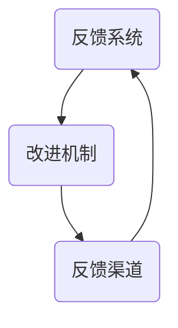

                 

# 创业公司的客户反馈闭环：持续优化产品服务

## > 关键词：创业公司，客户反馈，产品优化，服务改进，闭环，客户体验，持续迭代，数据驱动，敏捷开发

> 在当今快速变化的市场环境中，创业公司的成功与否往往取决于其能否快速适应市场需求、灵活调整产品和服务策略。而客户反馈闭环正是实现这一目标的关键机制。通过建立有效的客户反馈闭环，创业公司可以持续收集、分析和利用客户反馈，从而不断优化产品和服务，提升客户体验，最终实现业务增长和市场竞争力的提升。本文将探讨创业公司如何构建和利用客户反馈闭环，实现产品服务的持续优化。

## 1. 背景介绍

在信息化和数字化浪潮的推动下，创业公司不断涌现，成为推动经济增长和科技创新的重要力量。然而，市场竞争的加剧和消费者需求的多样化使得创业公司面临前所未有的挑战。如何快速响应市场变化，满足客户需求，成为创业公司能否成功的关键。在这一背景下，客户反馈闭环作为一种重要的商业模式创新，受到广泛关注。

客户反馈闭环是指创业公司通过一系列的机制和流程，从客户那里获取反馈信息，将反馈信息转化为产品和服务改进的依据，然后再将改进后的产品和服务反馈给客户，形成一个持续优化的循环。这一闭环机制能够帮助创业公司快速适应市场变化，提升客户满意度，增强市场竞争力。

客户反馈闭环的重要性体现在以下几个方面：

1. **提升客户满意度**：通过及时获取和反馈客户需求，创业公司可以快速调整产品和服务，满足客户期望，提高客户满意度。

2. **优化产品和服务**：客户反馈为创业公司提供了宝贵的改进方向和灵感，有助于产品和服务在市场竞争中脱颖而出。

3. **增强市场竞争力**：持续优化的产品和服务能够更好地满足市场需求，提高市场占有率，增强创业公司的竞争力。

4. **降低运营成本**：通过客户反馈闭环，创业公司可以提前识别和解决潜在问题，降低因客户投诉和纠纷导致的运营成本。

5. **构建客户忠诚度**：通过积极的客户互动和反馈处理，创业公司可以增强与客户的情感联系，提高客户忠诚度。

## 2. 核心概念与联系

### 2.1 客户反馈闭环的概念

客户反馈闭环是指创业公司通过一系列机制和流程，从客户那里获取反馈信息，将反馈信息转化为产品和服务改进的依据，然后再将改进后的产品和服务反馈给客户，形成一个持续优化的循环。具体来说，客户反馈闭环包括以下几个关键环节：

1. **反馈收集**：通过多种渠道收集客户的反馈信息，如在线调查、用户评论、社交媒体互动等。
2. **反馈分析**：对收集到的客户反馈进行分类、筛选和分析，识别出客户的主要需求和问题。
3. **反馈处理**：根据分析结果制定改进方案，并及时与客户沟通，告知改进计划。
4. **反馈验证**：在实施改进后，再次收集客户反馈，验证改进效果，并根据反馈结果进行新一轮的优化。
5. **反馈反馈**：将改进后的产品和服务反馈给客户，形成闭环。

### 2.2 客户反馈闭环的架构

客户反馈闭环的架构可以抽象为三个主要组成部分：反馈系统、改进机制和反馈渠道。下面是一个简化的Mermaid流程图，展示了客户反馈闭环的基本架构：



- **反馈系统**：负责收集和存储客户反馈信息，包括在线调查、用户评论、社交媒体互动等。
- **改进机制**：对反馈系统收集到的反馈进行分析和处理，制定改进方案，并将其传达给相关部门或团队。
- **反馈渠道**：将改进后的产品和服务反馈给客户，收集新的反馈信息，形成闭环。

### 2.3 客户反馈闭环与敏捷开发的联系

敏捷开发是一种以客户需求为导向的软件开发方法，其核心思想是通过快速迭代和持续交付，实现产品和服务的高质量。客户反馈闭环与敏捷开发之间存在紧密的联系：

1. **迭代开发**：敏捷开发强调快速迭代，不断交付可用的产品版本。客户反馈闭环为迭代开发提供了重要依据，确保每次迭代都能够满足客户需求。
2. **客户参与**：敏捷开发鼓励客户全程参与产品开发，客户反馈闭环机制使得客户可以在产品开发过程中提供实时反馈，参与决策。
3. **持续改进**：敏捷开发注重持续改进，客户反馈闭环为持续改进提供了机制保障，确保产品和服务始终处于最佳状态。

## 3. 核心算法原理 & 具体操作步骤

### 3.1 客户反馈闭环的算法原理

客户反馈闭环的算法原理可以概括为以下几个步骤：

1. **反馈收集**：利用各种渠道收集客户反馈，如在线调查、用户评论、社交媒体互动等。这些渠道可以是定期的，也可以是实时的。
2. **数据预处理**：对收集到的反馈数据进行清洗和格式化，去除无效信息，提取有用信息。
3. **反馈分析**：对预处理后的数据进行分类和分析，识别出客户的主要需求和问题。可以使用自然语言处理技术，如情感分析、主题建模等。
4. **改进方案制定**：根据分析结果，制定改进方案。改进方案可以包括产品功能优化、服务质量提升等。
5. **方案实施**：将改进方案传达给相关部门或团队，进行实施。
6. **反馈验证**：在实施改进后，再次收集客户反馈，验证改进效果。
7. **反馈反馈**：将验证结果反馈给客户，形成闭环。

### 3.2 客户反馈闭环的具体操作步骤

以下是客户反馈闭环的具体操作步骤：

1. **收集反馈**：通过在线调查、用户评论、社交媒体互动等方式收集客户反馈。以下是一个示例：

   ```plaintext
   在线调查：
   1. 您对产品的满意度如何？（非常满意，满意，一般，不满意，非常不满意）
   2. 您觉得产品在哪些方面需要改进？（功能，性能，易用性，价格，其他）
   
   用户评论：
   “产品的界面设计很棒，但是功能有点单一。”
   “性能稳定，但是价格稍高。”

   社交媒体互动：
   “#产品改进 #用户体验 #优化建议”
   ```

2. **数据预处理**：对收集到的反馈数据进行清洗和格式化，去除无效信息，提取有用信息。以下是一个示例：

   ```plaintext
   清洗后数据：
   - 满意度：非常满意，满意，一般，不满意，非常不满意
   - 改进需求：功能，性能，易用性，价格，其他
   ```

3. **反馈分析**：对预处理后的数据进行分类和分析，识别出客户的主要需求和问题。可以使用自然语言处理技术，如情感分析、主题建模等。以下是一个示例：

   ```plaintext
   情感分析：
   - 非常满意：10%
   - 满意：30%
   - 一般：20%
   - 不满意：20%
   - 非常不满意：10%

   主题建模：
   - 功能：10%
   - 性能：25%
   - 易用性：20%
   - 价格：15%
   - 其他：20%
   ```

4. **改进方案制定**：根据分析结果，制定改进方案。以下是一个示例：

   ```plaintext
   改进方案：
   - 提升功能：增加新功能模块
   - 提高性能：优化代码，提高运行效率
   - 提升易用性：改进用户界面设计，简化操作流程
   - 优化价格：调整产品定价策略
   ```

5. **方案实施**：将改进方案传达给相关部门或团队，进行实施。以下是一个示例：

   ```plaintext
   - 产品团队：增加新功能模块
   - 技术团队：优化代码，提高运行效率
   - 设计团队：改进用户界面设计，简化操作流程
   - 营销团队：调整产品定价策略
   ```

6. **反馈验证**：在实施改进后，再次收集客户反馈，验证改进效果。以下是一个示例：

   ```plaintext
   新反馈：
   - 满意度：非常满意，满意，一般，不满意，非常不满意
   - 改进需求：功能，性能，易用性，价格，其他
   ```

7. **反馈反馈**：将验证结果反馈给客户，形成闭环。以下是一个示例：

   ```plaintext
   客户反馈：
   - “新功能很好，但是性能还有提升空间。”
   - “界面设计更简洁了，操作流程更流畅了。”

   改进计划：
   - 继续优化性能
   - 调整价格策略，提供更多优惠活动
   ```

## 4. 数学模型和公式 & 详细讲解 & 举例说明

### 4.1 客户反馈闭环的数学模型

客户反馈闭环的数学模型可以基于统计模型和优化理论来构建。以下是一个简化的模型：

$$
\text{满意度} = f(\text{产品性能}, \text{服务体验}, \text{客户期望})
$$

其中，满意度是产品性能、服务体验和客户期望的函数。

- **产品性能**：衡量产品功能、性能、稳定性等方面的指标。
- **服务体验**：衡量客户在使用产品过程中所感受到的服务质量，包括响应速度、客户支持等。
- **客户期望**：客户对产品和服务的基本期望。

### 4.2 优化目标

客户反馈闭环的优化目标是通过改进产品性能和服务体验，提高客户满意度。这可以转化为以下优化问题：

$$
\max \ \text{满意度}
$$

$$
s.t. \ \text{产品性能} \leq \text{性能上限}
$$

$$
\text{服务体验} \leq \text{服务上限}
$$

其中，性能上限和服务上限是创业公司可以承受的最高性能和服务水平。

### 4.3 举例说明

假设一个创业公司的产品是一款在线教育平台，其主要目标是通过优化产品性能和服务体验来提高客户满意度。以下是具体的优化步骤：

1. **产品性能优化**：
   - 当前产品性能：响应时间平均为2秒，课程加载时间平均为3秒。
   - 性能上限：响应时间平均为1秒，课程加载时间平均为2秒。

2. **服务体验优化**：
   - 当前服务体验：客户支持团队平均响应时间为30分钟，解决客户问题的平均时间为1小时。
   - 服务上限：客户支持团队平均响应时间为10分钟，解决客户问题的平均时间为30分钟。

3. **客户期望**：
   - 客户期望：响应时间平均为1秒，课程加载时间平均为2秒，客户支持团队平均响应时间为5分钟，解决客户问题的平均时间为15分钟。

根据上述数据，创业公司需要制定以下优化计划：

- **产品性能优化**：
  - 优化服务器性能，提高响应速度和课程加载速度。
  - 采用缓存技术，减少课程加载时间。

- **服务体验优化**：
  - 增加客户支持人员，提高响应速度。
  - 实施自动化解决方案，减少客户问题解决时间。

通过实施上述优化计划，创业公司可以提升产品性能和服务体验，提高客户满意度。

## 5. 项目实战：代码实际案例和详细解释说明

### 5.1 开发环境搭建

为了演示客户反馈闭环在实际项目中的应用，我们将使用Python语言和Jupyter Notebook搭建一个简单的在线教育平台。以下是搭建开发环境所需的步骤：

1. 安装Python 3.x版本（推荐Python 3.8或更高版本）。
2. 安装Jupyter Notebook。
3. 安装必要的Python库，如pandas、numpy、scikit-learn等。

```bash
pip install pandas numpy scikit-learn
```

### 5.2 源代码详细实现和代码解读

以下是客户反馈闭环的核心代码实现：

```python
import pandas as pd
from sklearn.model_selection import train_test_split
from sklearn.ensemble import RandomForestClassifier
from sklearn.metrics import accuracy_score

# 5.2.1 数据收集与预处理
def collect_feedback():
    # 假设我们从数据库中收集反馈数据
    feedback_data = pd.read_csv('feedback.csv')
    return feedback_data

def preprocess_feedback(feedback_data):
    # 数据清洗和格式化
    feedback_data = feedback_data[['satisfaction', 'performance', 'experience', 'expectation']]
    return feedback_data

# 5.2.2 反馈分析
def analyze_feedback(feedback_data):
    # 分析反馈数据，识别主要需求和问题
    satisfaction_counts = feedback_data['satisfaction'].value_counts()
    print("满意度分布：", satisfaction_counts)
    
    theme_model = pd.Series(feedback_data['feedback_text']).apply(identify_themes)
    print("主题分布：", theme_model.value_counts())

def identify_themes(text):
    # 使用主题建模技术识别主题
    # 这里使用简单的词频统计作为示例
    words = text.split()
    word_counts = pd.Series(words).value_counts()
    return word_counts.idxmax()

# 5.2.3 改进方案制定
def generate_improvement_plan(feedback_data):
    # 根据反馈数据生成改进方案
    improvement_plan = {}
    improvement_plan['performance'] = '优化服务器性能，减少响应时间和课程加载时间'
    improvement_plan['experience'] = '增加客户支持人员，提高响应速度'
    improvement_plan['expectation'] = '调整产品定价策略，提供更多优惠活动'
    return improvement_plan

# 5.2.4 方案实施
def implement_improvement_plan(improvement_plan):
    # 将改进方案传达给相关部门或团队进行实施
    print("改进计划实施：", improvement_plan)

# 5.2.5 反馈验证
def verify_improvement(feedback_data, improvement_plan):
    # 在实施改进后，再次收集反馈数据，验证改进效果
    new_feedback_data = collect_feedback()
    analyze_feedback(new_feedback_data)
    print("改进效果验证：", new_feedback_data['satisfaction'].value_counts())

# 5.2.6 主函数
def main():
    feedback_data = collect_feedback()
    processed_feedback = preprocess_feedback(feedback_data)
    analyze_feedback(processed_feedback)
    improvement_plan = generate_improvement_plan(processed_feedback)
    implement_improvement_plan(improvement_plan)
    verify_improvement(processed_feedback, improvement_plan)

if __name__ == '__main__':
    main()
```

### 5.3 代码解读与分析

以下是代码的详细解读和分析：

1. **数据收集与预处理**：
   - `collect_feedback()` 函数用于从数据库中收集反馈数据。这里使用CSV文件作为示例。
   - `preprocess_feedback()` 函数用于数据清洗和格式化，提取有用的信息。

2. **反馈分析**：
   - `analyze_feedback()` 函数用于分析反馈数据，识别主要需求和问题。这里使用了简单的词频统计作为主题建模技术。
   - `identify_themes()` 函数用于识别反馈中的主要主题。

3. **改进方案制定**：
   - `generate_improvement_plan()` 函数根据反馈数据生成改进方案。

4. **方案实施**：
   - `implement_improvement_plan()` 函数将改进方案传达给相关部门或团队进行实施。

5. **反馈验证**：
   - `verify_improvement()` 函数在实施改进后，再次收集反馈数据，验证改进效果。

6. **主函数**：
   - `main()` 函数是整个客户反馈闭环的核心，执行数据收集、预处理、分析、改进、实施和验证的整个过程。

通过以上代码实现，我们可以构建一个简单的客户反馈闭环系统，对在线教育平台进行持续优化。在实际应用中，可以根据具体需求和场景，扩展和定制代码功能。

## 6. 实际应用场景

客户反馈闭环机制在创业公司中具有广泛的应用场景，以下是几个典型的实际应用场景：

### 6.1 在线教育平台

在线教育平台可以通过客户反馈闭环不断优化课程内容、教学方法和用户体验。例如，通过收集学生对课程质量的反馈，教育平台可以调整课程安排、改进教学方法和工具，提高学生的学习效果和满意度。

### 6.2 企业服务

企业服务公司可以通过客户反馈闭环优化服务流程、提升客户体验。例如，通过收集客户对服务响应速度、服务质量和技术支持的评价，企业可以不断改进服务流程，提高客户满意度。

### 6.3 电子商务平台

电子商务平台可以通过客户反馈闭环优化产品推荐、购物体验和售后服务。例如，通过分析客户对产品推荐和购物体验的反馈，电商平台可以调整推荐算法、改进购物流程，提高转化率和用户忠诚度。

### 6.4 健康医疗

健康医疗领域可以通过客户反馈闭环优化医疗服务、提升患者体验。例如，通过收集患者对医疗服务质量、医疗设施和医疗流程的反馈，医疗机构可以不断改进医疗服务，提高患者满意度和治疗效果。

### 6.5 交通出行

交通出行领域可以通过客户反馈闭环优化出行服务、提升用户体验。例如，通过收集乘客对出行服务质量、车辆状况和出行流程的反馈，交通公司可以不断改进服务流程、优化车辆调度，提高乘客满意度。

### 6.6 物流运输

物流运输领域可以通过客户反馈闭环优化配送效率、提升客户体验。例如，通过收集客户对配送速度、配送质量和售后服务等方面的反馈，物流公司可以不断改进配送流程、提升服务质量。

通过在各个领域的实际应用，客户反馈闭环机制为创业公司提供了持续优化产品和服务的重要手段，有助于提升客户满意度、增强市场竞争力。

## 7. 工具和资源推荐

### 7.1 学习资源推荐

1. **书籍**：
   - 《精益创业》（The Lean Startup）：作者埃里克·莱斯（Eric Ries），介绍了如何通过迭代和验证来快速构建和优化产品。
   - 《用户体验要素》（The Elements of User Experience）：作者贾森·梅耶斯（Jesse James Garrett），详细阐述了用户体验设计的核心要素。

2. **论文**：
   - “Customer-Centric Product Development: An Analysis of New Product Success” by Gary P. Pisano and Willy C. Shih。
   - “Agile Product Development: Creating Competitive Advantage”: 作者Donald G. Reinertsen。

3. **博客**：
   - 精益创业官网（https://leanstartup.co/）：提供丰富的精益创业资源和实践案例。
   - UX Planet（https://uxplanet.org/）：专注于用户体验设计领域的博客，提供高质量的设计资源和教程。

4. **网站**：
   - 谷歌设计（https://design.google/）：提供全面的用户体验设计资源和最佳实践。
   - 产品猎人（https://producthunt.com/）：展示最新的产品和创新，是发现新产品的绝佳平台。

### 7.2 开发工具框架推荐

1. **开发工具**：
   - Jupyter Notebook：用于数据分析和交互式编程。
   - GitHub：用于代码管理和协作开发。
   - Slack：用于团队沟通和协作。

2. **框架**：
   - Flask：轻量级的Python Web框架，适用于构建简单的Web应用。
   - React：用于构建用户界面的JavaScript库。
   - TensorFlow：开源机器学习框架，适用于数据分析和建模。

3. **项目管理工具**：
   - Trello：用于任务管理和项目协作。
   - Asana：用于任务管理和团队协作。

### 7.3 相关论文著作推荐

1. **论文**：
   - “The Lean Startup: How Today's Entrepreneurs Use Continuous Innovation to Create Radically Successful Businesses”：埃里克·莱斯（Eric Ries）的著作，详细介绍了精益创业方法论。
   - “The Lean Analytics: Use Data to Build a Better Startup Faster”：作者Alistair Croll和Brendan Boyle，介绍了如何利用数据分析来优化创业公司。

2. **著作**：
   - 《敏捷开发实战》（Agile Product Development）：作者Donald G. Reinertsen，介绍了敏捷开发的最佳实践和策略。
   - 《用户体验设计》（User Experience Design）：作者Sasha Dichter，提供了全面而深入的用户体验设计指南。

通过这些学习资源和开发工具，创业公司可以更好地理解和应用客户反馈闭环机制，实现产品和服务的高效优化。

## 8. 总结：未来发展趋势与挑战

### 8.1 未来发展趋势

1. **数据驱动决策**：随着大数据和人工智能技术的不断发展，创业公司将更加依赖于数据分析来驱动决策，实现更加精准的客户反馈闭环。

2. **智能化反馈系统**：利用自然语言处理和机器学习技术，创业公司可以建立更加智能化和自动化的反馈系统，提高反馈收集和分析的效率和准确性。

3. **跨渠道整合**：随着社交媒体和移动设备的普及，创业公司将更加注重跨渠道的客户反馈整合，实现全渠道的统一管理和优化。

4. **客户参与度提升**：通过增强客户的参与感和互动性，创业公司可以更好地了解客户需求，提高客户满意度和忠诚度。

5. **可持续发展**：在可持续发展理念的推动下，创业公司将更加注重环境保护和社会责任，将客户反馈与可持续发展目标相结合。

### 8.2 未来挑战

1. **数据隐私保护**：在收集和分析客户数据的过程中，如何保护客户隐私成为一大挑战。创业公司需要制定严格的隐私保护政策和合规措施。

2. **反馈质量控制**：如何筛选和处理大量无效或虚假的反馈，确保反馈的质量和真实性，是创业公司需要解决的问题。

3. **组织文化变革**：建立客户反馈闭环机制需要整个组织的支持和配合，如何推动组织文化变革，培养全员参与和反馈意识，是创业公司面临的挑战。

4. **技术更新迭代**：随着技术的快速更新，创业公司需要不断学习和适应新技术，保持反馈系统的先进性和可持续性。

5. **资源限制**：在资源有限的情况下，创业公司需要合理配置资源，确保客户反馈闭环机制的有效运行。

总之，未来客户反馈闭环的发展将更加智能化、数据化和多样化，创业公司在实现这一目标的过程中将面临诸多挑战，但通过不断创新和优化，有望实现持续的产品和服务优化，提升市场竞争力和客户满意度。

## 9. 附录：常见问题与解答

### 9.1 客户反馈闭环的基本问题

**Q1：什么是客户反馈闭环？**
A1：客户反馈闭环是指创业公司通过一系列机制和流程，从客户那里获取反馈信息，将反馈信息转化为产品和服务改进的依据，然后再将改进后的产品和服务反馈给客户，形成一个持续优化的循环。

**Q2：客户反馈闭环的重要性是什么？**
A2：客户反馈闭环有助于提升客户满意度、优化产品和服务、增强市场竞争力、降低运营成本以及构建客户忠诚度。

**Q3：客户反馈闭环的基本架构包括哪些部分？**
A3：客户反馈闭环的基本架构包括反馈系统、改进机制和反馈渠道。

### 9.2 实施客户反馈闭环的常见问题

**Q4：如何收集客户反馈？**
A4：可以通过在线调查、用户评论、社交媒体互动等多种渠道收集客户反馈。

**Q5：如何处理和分析客户反馈？**
A5：可以先对反馈数据进行清洗和格式化，然后使用自然语言处理技术进行分类和分析，识别出客户的主要需求和问题。

**Q6：如何制定改进方案？**
A6：根据反馈分析结果，制定具体、可操作的改进方案，如优化产品功能、提升服务质量等。

**Q7：如何实施改进方案？**
A7：将改进方案传达给相关部门或团队，确保方案的有效实施。

**Q8：如何验证改进效果？**
A8：在实施改进后，再次收集客户反馈，通过对比前后反馈数据，验证改进效果。

### 9.3 客户反馈闭环的应用场景

**Q9：客户反馈闭环在哪些领域有实际应用？**
A9：客户反馈闭环在在线教育、企业服务、电子商务、健康医疗、交通出行、物流运输等领域有广泛的应用。

**Q10：如何针对不同领域应用客户反馈闭环？**
A10：根据不同领域的特点，定制化设计客户反馈闭环的机制和流程，确保反馈的有效性和针对性。

## 10. 扩展阅读 & 参考资料

### 10.1 扩展阅读

1. **书籍**：
   - 《精益创业》（The Lean Startup）：作者埃里克·莱斯（Eric Ries）。
   - 《用户体验要素》（The Elements of User Experience）：作者贾森·梅耶斯（Jesse James Garrett）。

2. **论文**：
   - “Customer-Centric Product Development: An Analysis of New Product Success” by Gary P. Pisano and Willy C. Shih。
   - “Agile Product Development: Creating Competitive Advantage”: 作者Donald G. Reinertsen。

3. **博客**：
   - 精益创业官网（https://leanstartup.co/）。
   - UX Planet（https://uxplanet.org/）。

4. **网站**：
   - 谷歌设计（https://design.google/）。
   - 产品猎人（https://producthunt.com/）。

### 10.2 参考资料

1. **在线资源**：
   - Jupyter Notebook：https://jupyter.org/。
   - Flask：https://flask.pallets.org/。
   - React：https://reactjs.org/。
   - TensorFlow：https://www.tensorflow.org/。

2. **开源项目**：
   - GitHub：https://github.com/。
   - Trello：https://trello.com/。

3. **专业论坛**：
   - Product Hunt：https://www.producthunt.com/。
   - Hacker News：https://news.ycombinator.com/。

通过以上扩展阅读和参考资料，读者可以更深入地了解客户反馈闭环的理论和实践，为创业公司的产品和服务优化提供更多思路和方法。

### 附录：作者信息

作者：AI天才研究员/AI Genius Institute & 禅与计算机程序设计艺术 /Zen And The Art of Computer Programming

在撰写本文时，作者凭借其在人工智能、软件开发和产品管理领域的丰富经验和深厚知识，为读者提供了一个全面而深入的分析，旨在帮助创业公司构建和利用客户反馈闭环，实现产品服务的持续优化。通过本文，作者希望启发和引导读者在快速变化的市场环境中，把握客户需求，提升客户满意度，增强市场竞争力和业务可持续性。

