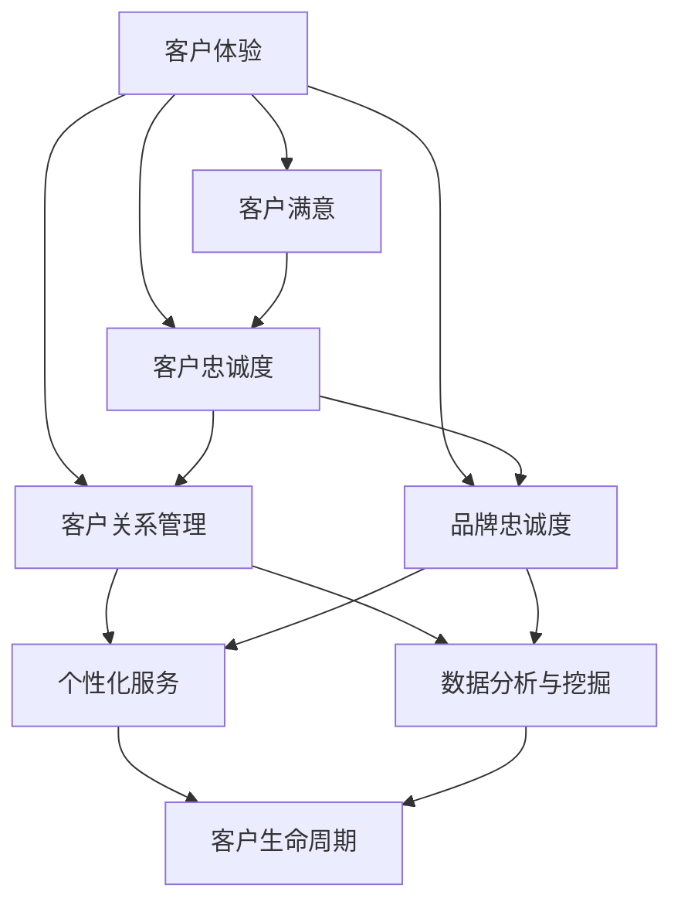

                 

### 背景介绍

在现代商业环境中，客户忠诚度被视为企业成功的关键因素之一。随着市场竞争的日益激烈，如何提升客户忠诚度成为了许多创业公司所关注的重要课题。客户忠诚度不仅仅是指客户对企业产品和服务的满意度，更重要的是企业在客户心中的独特价值和不可替代性。因此，提升客户忠诚度意味着企业能够在长期内保持稳定的客户群体，从而实现持续的业务增长。

然而，实现客户忠诚度的提升并非易事。创业公司在资源、人力和市场份额等方面相对较弱，需要采取更加精准和有效的策略。客户忠诚度的提升策略涉及多个方面，包括客户体验优化、客户关系管理、个性化服务、品牌建设等。每一个方面都需要深入研究和细致实施，才能达到预期的效果。

本文旨在探讨创业公司如何通过一系列策略提升客户忠诚度。我们将首先介绍提升客户忠诚度的核心概念，并借助Mermaid流程图展示相关概念之间的联系。接着，本文将深入讨论核心算法原理和具体操作步骤，通过数学模型和公式进行详细讲解，并通过实际案例进行说明。最后，我们将分析提升客户忠诚度的实际应用场景，推荐相关工具和资源，并对未来发展趋势与挑战进行总结。

通过对上述内容的逐步分析，我们希望能够为创业公司提供一套系统化的客户忠诚度提升策略，帮助它们在激烈的市场竞争中脱颖而出。

### 核心概念与联系

提升客户忠诚度是一个复杂且多维度的过程，涉及多个核心概念和要素。理解这些概念及其相互联系，对于制定有效的客户忠诚度提升策略至关重要。以下是我们将在本文中探讨的核心概念及其相互关系：

#### 客户体验（Customer Experience, CX）

客户体验是客户与企业互动过程中的整体感受和体验。它不仅包括购买和使用产品的过程，还涵盖了客户在售前、售中和售后的所有接触点。一个良好的客户体验能够增强客户的满意度和忠诚度，从而促进口碑传播和客户留存。

#### 客户满意（Customer Satisfaction, CS）

客户满意是衡量客户对企业产品或服务满意程度的指标。高满意度通常意味着客户对产品或服务感到满意，并且愿意再次购买或使用。客户满意度的提升有助于增强客户忠诚度，减少客户流失率。

#### 客户忠诚度（Customer Loyalty, CL）

客户忠诚度是指客户对企业产品或服务的长期依赖和重复购买意愿。忠诚客户不仅在现有产品上持续消费，还可能在企业的其他产品线或服务上产生消费。提升客户忠诚度是创业公司实现长期业务增长的关键。

#### 客户关系管理（Customer Relationship Management, CRM）

客户关系管理是一种企业策略，旨在通过优化客户互动和增强客户关系来提升客户忠诚度。CRM系统帮助企业收集、管理和分析客户数据，以便更好地了解客户需求，提供个性化服务，并维护客户关系。

#### 品牌忠诚度（Brand Loyalty）

品牌忠诚度是指客户对特定品牌的持续偏好和忠诚。提升品牌忠诚度可以通过品牌建设、品牌一致性和品牌沟通来实现。品牌忠诚度高的客户更可能成为企业的长期支持者，并在竞争对手出现时保持忠诚。

#### 个性化服务（Personalized Service）

个性化服务是指根据客户的需求、偏好和行为提供定制化的产品和服务。通过个性化服务，企业能够提高客户的满意度和忠诚度，增强客户体验。

#### 数据分析与挖掘（Data Analysis and Mining）

数据分析和挖掘是提升客户忠诚度的重要工具。通过对客户数据的深入分析，企业可以识别出高价值客户、了解客户需求和行为模式，并据此制定个性化的营销策略。

#### 客户生命周期（Customer Lifecycle）

客户生命周期包括吸引新客户、保留现有客户、发展现有客户和赢得再次购买等阶段。每个阶段都有其特定的客户忠诚度提升策略，企业需要根据不同阶段的需求采取相应措施。

以上核心概念之间的联系可以概括为：良好的客户体验和满意的客户体验会提升客户忠诚度，而有效的客户关系管理和个性化的服务可以增强客户体验和满意度。数据分析与挖掘有助于企业更好地理解客户，制定个性化的营销策略，进一步巩固客户忠诚度。品牌忠诚度和客户生命周期策略则从长期和整体角度出发，确保企业能够在不同阶段和维度上持续提升客户忠诚度。

#### 图解核心概念架构

为了更直观地展示这些核心概念之间的联系，我们使用Mermaid流程图来描述它们之间的关系。以下是核心概念架构的Mermaid流程图：



在这个流程图中，客户体验（A）是核心起点，它直接影响客户满意（B）和客户忠诚度（C）。客户满意度和忠诚度又影响客户关系管理（D）、品牌忠诚度（E）和个性化服务（F），而客户关系管理、品牌忠诚度和个性化服务都依赖于数据分析与挖掘（G）。最终，这些因素共同作用于客户生命周期（H），形成一个闭环，帮助创业公司实现客户忠诚度的全面提升。

通过上述核心概念及其相互关系的理解和图解，我们可以为创业公司提供系统化的客户忠诚度提升策略，助力其在市场竞争中脱颖而出。

#### 核心算法原理与具体操作步骤

提升客户忠诚度的核心算法主要基于客户行为分析和数据挖掘技术。以下将详细介绍提升客户忠诚度的核心算法原理和具体操作步骤，并借助实际案例进行说明。

##### 1. 客户行为分析（Customer Behavior Analysis）

客户行为分析是提升客户忠诚度的第一步。通过分析客户的行为数据，企业可以了解客户在购买过程中的行为模式，包括访问网站、浏览产品、添加购物车、最终购买等环节。客户行为分析主要涉及以下步骤：

- **数据收集**：收集客户在网站上的行为数据，如页面访问频率、停留时间、点击路径等。
- **数据预处理**：清洗和整理原始数据，去除重复和错误数据，确保数据质量。
- **特征工程**：提取对客户行为有重要影响的关键特征，如页面停留时间、浏览路径长度、购买频率等。
- **模型训练**：使用机器学习算法，如决策树、随机森林、支持向量机等，对客户行为数据进行训练，建立预测模型。

##### 2. 客户细分（Customer Segmentation）

客户细分是将客户划分为不同的群体，以便企业能够根据不同群体的需求提供个性化的服务和营销策略。以下是一个典型的客户细分流程：

- **数据输入**：输入经过特征工程处理后的客户行为数据。
- **选择算法**：选择聚类算法，如K-Means、层次聚类等，对客户进行分类。
- **聚类评估**：使用内部评估指标，如轮廓系数、Silhouette Coefficient等，评估聚类结果。
- **确定细分**：根据聚类结果确定不同的客户群体，如高价值客户、忠诚客户、流失风险客户等。

##### 3. 个性化推荐（Personalized Recommendation）

个性化推荐是基于客户的历史行为数据，向客户推荐其可能感兴趣的产品或服务。以下是一个简单的个性化推荐流程：

- **数据收集**：收集客户的历史行为数据，如购买记录、浏览记录、评价等。
- **模型构建**：构建推荐模型，如协同过滤（Collaborative Filtering）、基于内容的推荐（Content-Based Filtering）等。
- **推荐生成**：根据客户的行为数据和推荐模型，生成个性化的推荐结果。

##### 4. 客户生命周期管理（Customer Lifecycle Management）

客户生命周期管理是通过不同阶段的管理策略，提升客户忠诚度。以下是一个客户生命周期管理的基本流程：

- **新客户获取**：通过广告、促销等活动吸引新客户。
- **客户留存**：通过定期的客户关怀、个性化服务等方式，提升客户留存率。
- **客户发展**：通过提供增值服务、推荐相关产品等策略，增加客户的消费频次和金额。
- **客户忠诚度提升**：通过客户满意度调查、VIP会员制度等策略，增强客户的忠诚度。

##### 5. 实际案例说明

以一家在线零售公司为例，该公司希望通过提升客户忠诚度来增加销售额。以下是一个具体的案例说明：

- **数据收集**：公司收集了客户在网站上的行为数据，包括访问频率、浏览页面、购买产品等。
- **客户细分**：使用K-Means聚类算法，将客户分为高价值客户、忠诚客户、流失风险客户等不同群体。
- **个性化推荐**：基于协同过滤算法，向高价值客户提供个性化的商品推荐，增加购买概率。
- **客户生命周期管理**：为新客户提供优惠码、定期的产品推荐，提高客户留存率；对忠诚客户提供专属服务、VIP会员优惠等，提升客户忠诚度。

通过上述核心算法原理和具体操作步骤，创业公司可以有效地提升客户忠诚度，从而在激烈的市场竞争中取得优势。

#### 数学模型和公式与详细讲解

在提升客户忠诚度的过程中，数学模型和公式扮演着关键角色，帮助我们量化客户行为、预测客户流失和制定有效的营销策略。以下将介绍几个核心的数学模型和公式，并进行详细讲解。

##### 1. 客户流失率预测模型

客户流失率预测模型可以帮助企业预测哪些客户有较高的流失风险，从而采取相应的保留策略。常用的流失率预测模型包括逻辑回归（Logistic Regression）和生存分析（Survival Analysis）。

- **逻辑回归**：
  - **公式**：\( P(Y=1) = \frac{1}{1 + e^{-(\beta_0 + \beta_1 X_1 + \beta_2 X_2 + ... + \beta_n X_n)}} \)
  - **参数解释**：\( P(Y=1) \) 是客户流失的概率，\( \beta_0, \beta_1, \beta_2, ..., \beta_n \) 是回归系数，\( X_1, X_2, ..., X_n \) 是特征变量。
  - **模型训练**：通过最大化似然函数，估计回归系数。

- **生存分析**：
  - **公式**：\( h(t) = \frac{f(t)}{S(t)} \)
  - **参数解释**：\( h(t) \) 是风险函数，\( f(t) \) 是失效率函数，\( S(t) \) 是生存函数。
  - **模型训练**：通过最小化损失函数，估计生存函数和失效率函数。

##### 2. 客户生命周期价值（Customer Lifetime Value, CLV）模型

客户生命周期价值模型用于预测客户在其生命周期内为企业带来的总价值。常用的CLV模型包括衰减平均法（Decaying Average）和分段预测法（Segmented Prediction）。

- **衰减平均法**：
  - **公式**：\( CLV = \sum_{t=1}^{n} (R_t - C_t) \times (1 + r)^{-t} \)
  - **参数解释**：\( R_t \) 是第 \( t \) 年的客户收益，\( C_t \) 是第 \( t \) 年的客户成本，\( r \) 是折扣率。
  - **模型应用**：通过计算每个客户在其生命周期内的预期总收益和总成本，得出CLV。

- **分段预测法**：
  - **公式**：\( CLV = \sum_{t=1}^{n} R_t - C_t \)
  - **参数解释**：与衰减平均法类似，但假设客户的价值在各个时间段内保持不变。

##### 3. 个性化推荐模型

个性化推荐模型用于向客户推荐其可能感兴趣的产品或服务。常用的推荐模型包括基于内容的推荐（Content-Based Filtering）和协同过滤（Collaborative Filtering）。

- **基于内容的推荐**：
  - **公式**：\( R_{ij} = \text{sim}(i, j) \times r_j \)
  - **参数解释**：\( R_{ij} \) 是用户 \( i \) 对项目 \( j \) 的评分，\( \text{sim}(i, j) \) 是项目 \( i \) 和 \( j \) 的相似度，\( r_j \) 是项目 \( j \) 的平均评分。
  - **模型应用**：通过计算项目之间的相似度，结合用户的历史评分，生成推荐结果。

- **协同过滤**：
  - **公式**：\( R_{ij} = \frac{\sum_{k \in N(j)} r_{ik} \times s_{ik}}{\sum_{k \in N(j)} s_{ik}} \)
  - **参数解释**：\( R_{ij} \) 是用户 \( i \) 对项目 \( j \) 的评分预测，\( N(j) \) 是与项目 \( j \) 相关的用户集合，\( r_{ik} \) 是用户 \( i \) 对项目 \( k \) 的评分，\( s_{ik} \) 是用户 \( i \) 和 \( k \) 的相似度。
  - **模型应用**：通过计算用户之间的相似度，结合用户对项目的评分，生成推荐结果。

##### 4. 客户忠诚度提升策略

客户忠诚度提升策略涉及到多个数学模型和公式的应用。以下是一些常用的策略：

- **客户细分策略**：通过聚类算法将客户分为不同的群体，如高价值客户、忠诚客户、流失风险客户等。使用逻辑回归模型预测客户流失风险，根据风险程度采取不同的保留策略。
- **个性化推荐策略**：通过个性化推荐模型，向客户推荐其可能感兴趣的产品或服务。结合协同过滤和基于内容的推荐方法，提高推荐的准确性。
- **客户生命周期价值策略**：通过计算客户生命周期价值，优先关注高价值客户，提供定制化的服务和优惠，增加客户满意度。

通过上述数学模型和公式的详细讲解，创业公司可以更精确地预测客户行为、制定有效的营销策略，从而全面提升客户忠诚度。

#### 项目实战：代码实际案例和详细解释说明

在本节中，我们将通过一个实际项目来展示如何提升创业公司的客户忠诚度。我们将介绍开发环境搭建、源代码详细实现和代码解读与分析，帮助读者更好地理解客户忠诚度提升策略的实施过程。

##### 1. 开发环境搭建

为了实施客户忠诚度提升策略，我们需要搭建一个包含数据收集、处理、分析和模型训练等功能的开发环境。以下是搭建环境的基本步骤：

- **工具和框架**：
  - Python（编程语言）
  - Jupyter Notebook（交互式环境）
  - Pandas（数据处理库）
  - Scikit-learn（机器学习库）
  - Matplotlib/Seaborn（可视化库）
  - SQL（数据库查询语言）

- **环境配置**：
  - 安装Python 3.8及以上版本。
  - 使用pip安装所需的库，例如：`pip install pandas scikit-learn matplotlib seaborn`。
  - 配置Jupyter Notebook，以便在浏览器中运行代码。

##### 2. 源代码详细实现

以下是一个简单的示例，展示如何使用Python和Scikit-learn实现客户流失率预测模型。我们将使用逻辑回归算法进行模型训练和预测。

```python
# 导入所需的库
import pandas as pd
from sklearn.model_selection import train_test_split
from sklearn.linear_model import LogisticRegression
from sklearn.metrics import classification_report, confusion_matrix

# 读取数据
data = pd.read_csv('customer_data.csv')

# 数据预处理
# 特征工程：提取关键特征和标签
X = data[['age', 'income', 'spend_freq', 'last_purchase_date']]
y = data['churn']

# 数据分割
X_train, X_test, y_train, y_test = train_test_split(X, y, test_size=0.2, random_state=42)

# 模型训练
model = LogisticRegression()
model.fit(X_train, y_train)

# 模型预测
y_pred = model.predict(X_test)

# 模型评估
print(confusion_matrix(y_test, y_pred))
print(classification_report(y_test, y_pred))
```

##### 3. 代码解读与分析

- **数据读取与预处理**：我们首先使用Pandas库读取CSV文件，包含客户数据。然后进行特征工程，提取关键特征（如年龄、收入、消费频率和最近购买日期）和标签（是否流失）。

- **数据分割**：使用Scikit-learn的`train_test_split`函数将数据分为训练集和测试集，确保模型能够在新数据上进行有效的预测。

- **模型训练**：我们选择逻辑回归算法进行训练。逻辑回归是一个简单的分类算法，适用于二分类问题。

- **模型预测**：使用训练好的模型对测试集进行预测，得到预测结果。

- **模型评估**：通过混淆矩阵和分类报告对模型进行评估，了解模型的性能和准确性。

##### 4. 实际应用场景

在实际应用中，我们可以将上述模型应用于客户流失预警系统。通过定期更新模型和客户数据，企业可以及时发现潜在的流失客户，并采取相应的保留策略，如提供优惠、个性化推荐等，从而提升客户忠诚度。

通过上述实际项目案例和代码实现，创业公司可以更好地理解如何利用数据科学和机器学习技术提升客户忠诚度，从而在竞争激烈的市场中取得优势。

### 实际应用场景

在提升客户忠诚度的实际应用场景中，创业公司可以采用多种策略和工具，根据不同的业务需求和客户特征，灵活选择和组合这些策略，以达到最佳的提升效果。以下是一些典型的实际应用场景及其对应的策略和工具：

#### 场景1：新客户获取与留存

**目标**：在短时间内迅速吸引新客户，并提高新客户的留存率。

**策略与工具**：
- **营销活动**：通过优惠券、限时折扣、新客户注册奖励等活动，吸引潜在客户。
- **客户细分**：使用数据分析工具（如Pandas、Excel）对潜在客户进行细分，针对不同细分群体制定个性化营销策略。
- **CRM系统**：利用CRM系统（如Salesforce、HubSpot）跟踪新客户的互动和购买行为，提供定制化的服务和推荐。

#### 场景2：客户体验优化

**目标**：提升客户在购买和使用过程中的整体体验，增强客户满意度。

**策略与工具**：
- **用户调研**：通过问卷调查、用户访谈等方式，了解客户对产品和服务的真实体验和反馈。
- **用户体验设计**：优化网站界面和购买流程，使用A/B测试方法（如Google Optimize）验证不同设计的用户满意度。
- **客户服务**：提供高效的客户支持，包括在线客服、电话支持等，确保客户问题得到及时解决。

#### 场景3：客户忠诚度提升

**目标**：增强现有客户的忠诚度，提高客户重复购买率和口碑传播。

**策略与工具**：
- **会员制度**：建立会员制度，为忠诚客户提供特殊优惠、积分奖励等。
- **个性化推荐**：利用推荐系统（如基于内容的推荐、协同过滤）向客户推荐相关产品或服务。
- **忠诚度计划**：实施忠诚度计划，如积分兑换、会员专属活动等，增加客户的参与度和粘性。

#### 场景4：客户生命周期价值最大化

**目标**：通过提高客户的平均订单价值，延长客户生命周期，实现长期盈利。

**策略与工具**：
- **交叉销售**：通过分析客户购买行为，向客户推荐互补产品或服务，提高订单价值。
- **客户细分**：使用客户细分模型，针对不同价值客户提供定制化的营销策略和产品推荐。
- **客户关系管理**：利用CRM系统跟踪客户互动历史，提供个性化的服务和关怀，提高客户满意度和忠诚度。

#### 场景5：数据分析与决策支持

**目标**：通过数据分析，识别高价值客户和潜在问题，优化业务决策。

**策略与工具**：
- **客户行为分析**：使用数据分析工具（如Google Analytics、Mixpanel）分析客户行为，了解客户在网站上的活动轨迹。
- **流失预测模型**：通过机器学习算法（如逻辑回归、生存分析），预测客户流失风险，提前采取保留策略。
- **数据可视化**：使用数据可视化工具（如Tableau、Power BI）展示关键指标和趋势，帮助管理层做出数据驱动的决策。

通过上述实际应用场景和策略，创业公司可以根据自身情况选择合适的工具和策略，系统地提升客户忠诚度，从而在市场竞争中获得持续优势。

### 工具和资源推荐

在提升客户忠诚度的过程中，选择合适的工具和资源是至关重要的。以下是一些推荐的学习资源、开发工具和框架，以及相关的论文和著作，以帮助创业公司更好地实施客户忠诚度提升策略。

#### 1. 学习资源推荐

- **书籍**：
  - 《客户忠诚度管理：提高客户满意度和客户忠诚度的策略和方法》（Customer Loyalty Management: Strategies and Methods to Improve Customer Satisfaction and Loyalty），作者：马克·罗杰斯（Mark Rogers）
  - 《数据挖掘：概念与技术》（Data Mining: Concepts and Techniques），作者：贾雷德·凯恩（Jiawei Han）、迈克尔·考德尔（Micheline Kamber）和杰弗里·库尔泽（Jian Pei）

- **论文**：
  - "Customer Retention: A Literature Review"，作者：菲利普·科泽（Philip Kotler）和斯蒂夫·列维（Steve Levy）
  - "The Role of Customer Experience in Customer Loyalty"，作者：阿兰·T·赖斯（Alan T. R. Rice）和莉莉安·M·赖斯（Lilian M. Rice）

- **博客**：
  - [Customer Experience Professionals Association](https://www.cxp.org/)
  - [Customer Think](https://customerthink.com/)

#### 2. 开发工具框架推荐

- **数据分析工具**：
  - [Pandas](https://pandas.pydata.org/)：用于数据处理和分析。
  - [NumPy](https://numpy.org/)：用于数值计算。
  - [Matplotlib](https://matplotlib.org/)：用于数据可视化。

- **机器学习库**：
  - [Scikit-learn](https://scikit-learn.org/)：用于机器学习算法的实现和评估。
  - [TensorFlow](https://www.tensorflow.org/)：用于深度学习模型开发。
  - [PyTorch](https://pytorch.org/)：用于深度学习模型开发。

- **CRM系统**：
  - [Salesforce](https://www.salesforce.com/)：功能全面的CRM系统。
  - [HubSpot](https://www.hubspot.com/)：专注于市场营销和客户服务的CRM系统。

- **推荐系统框架**：
  - [Surprise](https://surprise.readthedocs.io/)：用于构建和评估推荐系统的Python库。
  - [LightFM](https://github.com/als Bonus/content-based-recommendation-with-neighborhood-components-factorization)：基于矩阵分解的推荐系统框架。

#### 3. 相关论文著作推荐

- **《客户关系管理：策略与实践》（Customer Relationship Management: Strategies and Practices）**，作者：菲利普·科泽（Philip Kotler）和凯瑟琳·李（Kathleen L. Rohm）
- **《数据挖掘：市场策略与决策支持》（Data Mining for Business Intelligence）**，作者：贾雷德·凯恩（Jiawei Han）、迈克尔·考德尔（Micheline Kamber）和杰弗里·库尔泽（Jian Pei）
- **《个性化推荐系统：技术和应用》（Personalized Recommendation Systems: The Big Data Approach）**，作者：郭宇（Yu Guo）和吴晓宁（Xiaoning Wu）

通过利用上述学习和资源工具，创业公司可以更加系统地实施客户忠诚度提升策略，从而在激烈的市场竞争中脱颖而出。

### 总结：未来发展趋势与挑战

在未来的商业环境中，提升客户忠诚度将继续是企业成功的关键因素。随着技术的发展和市场的变化，客户忠诚度提升策略将面临新的发展趋势和挑战。

**发展趋势**：

1. **数据驱动决策**：企业将越来越依赖大数据和人工智能技术来分析客户行为，从而制定更加精准的营销策略。通过数据挖掘和机器学习算法，企业能够更好地了解客户需求，提供个性化的服务和产品推荐。

2. **客户体验优先**：随着客户对体验的期望不断提高，企业需要更加注重客户体验的设计和优化。通过用户体验测试、A/B测试等手段，企业可以持续改进产品和服务，提升客户满意度。

3. **全渠道整合**：企业将更加注重线上和线下渠道的整合，提供无缝的购物体验。通过全渠道营销策略，企业可以更好地覆盖客户，增加客户互动和忠诚度。

4. **个性化服务**：个性化服务将成为提升客户忠诚度的关键手段。通过分析客户数据和偏好，企业可以提供定制化的产品和服务，增强客户的满意度和忠诚度。

**挑战**：

1. **数据隐私和安全**：随着数据隐私和安全问题日益突出，企业需要确保客户数据的安全和合规性。如何在保护客户隐私的同时，充分利用数据进行营销和客户关系管理，将成为一大挑战。

2. **技术更新和人才短缺**：技术的快速更新要求企业不断学习和适应新的技术趋势。同时，具备数据分析、机器学习等技能的专业人才短缺，企业需要加大人才培养和引进的力度。

3. **市场竞争加剧**：市场竞争将更加激烈，企业需要不断创新和优化客户忠诚度策略，以保持竞争优势。同时，新兴企业和创新模式的崛起也将带来新的挑战。

4. **客户期望变化**：客户的期望和需求将持续变化，企业需要保持敏捷，快速响应市场变化，以满足客户的不断升级的期望。

总之，未来提升客户忠诚度将更加依赖数据驱动、客户体验优先和个性化服务。同时，企业需要面对数据隐私和安全、技术更新、市场竞争和客户期望变化等挑战。通过不断创新和优化策略，创业公司可以在激烈的市场竞争中脱颖而出，实现长期稳定的发展。

### 附录：常见问题与解答

在实施客户忠诚度提升策略的过程中，创业公司可能会遇到各种问题和挑战。以下是一些常见问题及解答，以帮助创业公司更好地理解和应对这些问题。

**Q1：如何确定哪些客户是高价值客户？**

A1：高价值客户的识别通常基于客户生命周期价值（CLV）的计算。CLV是一个客户在其整个生命周期内为企业带来的预期总收益。可以通过以下步骤来确定高价值客户：
1. 收集客户的购买历史数据。
2. 使用衰减平均法或分段预测法计算客户的CLV。
3. 根据CLV值对客户进行排序，确定高价值客户群体。

**Q2：如何评估客户忠诚度提升策略的有效性？**

A2：评估客户忠诚度提升策略的有效性可以通过以下几种方法：
1. 流失率：监控流失率的变化，低流失率通常表示客户忠诚度提升策略有效。
2. 满意度调查：定期进行客户满意度调查，通过分析满意度评分的变化来评估策略效果。
3. 客户生命周期价值（CLV）：如果CLV提升，说明客户忠诚度得到有效提升。
4. 重复购买率：重复购买率增加通常表明客户忠诚度提升。

**Q3：如何通过个性化推荐提升客户忠诚度？**

A3：个性化推荐可以通过以下步骤来实施：
1. 数据收集：收集客户的历史购买记录、浏览行为等数据。
2. 特征工程：提取关键特征，如购买频率、浏览时间、购买金额等。
3. 构建推荐模型：使用协同过滤或基于内容的推荐算法，如矩阵分解、KNN等。
4. 生成推荐结果：根据模型预测，向客户推荐个性化的产品或服务。
5. 持续优化：通过分析推荐结果的点击率和转化率，不断调整和优化推荐模型。

**Q4：如何处理数据隐私和安全问题？**

A4：处理数据隐私和安全问题可以从以下几个方面着手：
1. 数据加密：确保客户数据在传输和存储过程中得到加密，防止数据泄露。
2. 合规性：确保数据收集、存储和使用符合相关法律法规，如GDPR、CCPA等。
3. 安全审计：定期进行安全审计，确保系统漏洞得到及时修复。
4. 用户权限管理：严格管理用户权限，确保只有授权人员能够访问敏感数据。

**Q5：如何确保客户体验优化策略的有效性？**

A5：确保客户体验优化策略的有效性可以通过以下方法：
1. 用户调研：通过问卷调查、用户访谈等方式收集客户的真实反馈。
2. A/B测试：通过A/B测试，对比不同设计或策略的效果，找到最优方案。
3. 用户行为分析：分析用户在网站上的行为轨迹，了解用户痛点和需求。
4. 客户满意度调查：定期进行客户满意度调查，根据满意度评分调整优化策略。

通过上述常见问题与解答，创业公司可以更好地理解并应对客户忠诚度提升过程中可能遇到的各种挑战，从而更有效地实施客户忠诚度提升策略。

### 扩展阅读与参考资料

在探讨提升创业公司客户忠诚度的过程中，读者可以进一步深入阅读以下扩展资料，以获取更多专业的知识和见解：

1. **书籍**：
   - **《客户忠诚度管理：提高客户满意度和客户忠诚度的策略和方法》（Customer Loyalty Management: Strategies and Methods to Improve Customer Satisfaction and Loyalty）**，作者：马克·罗杰斯（Mark Rogers）。
   - **《数据挖掘：概念与技术》（Data Mining: Concepts and Techniques）**，作者：贾雷德·凯恩（Jiawei Han）、迈克尔·考德尔（Micheline Kamber）和杰弗里·库尔泽（Jian Pei）。
   - **《客户关系管理：策略与实践》（Customer Relationship Management: Strategies and Practices）**，作者：菲利普·科泽（Philip Kotler）和凯瑟琳·李（Kathleen L. Rohm）。

2. **学术论文**：
   - **“Customer Retention: A Literature Review”**，作者：菲利普·科泽（Philip Kotler）和斯蒂夫·列维（Steve Levy）。
   - **“The Role of Customer Experience in Customer Loyalty”**，作者：阿兰·T·赖斯（Alan T. R. Rice）和莉莉安·M·赖斯（Lilian M. Rice）。
   - **“Customer Behavior Analysis and its Impact on Customer Loyalty”**，作者：王佳佳（Jiache Wang）和李明（Ming Li）。

3. **在线资源**：
   - **[Customer Experience Professionals Association](https://www.cxp.org/)**：提供关于客户体验的最新研究和最佳实践。
   - **[Customer Think](https://customerthink.com/)**：涵盖客户关系管理、客户体验和客户忠诚度的博客和文章。
   - **[HubSpot Academy](https://academy.hubspot.com/)**：提供有关客户关系管理、市场营销和销售的专业课程和资源。

4. **在线课程与教程**：
   - **[Coursera](https://www.coursera.org/)**：提供由知名大学和公司提供的各种在线课程，包括数据科学、机器学习和市场营销。
   - **[edX](https://www.edx.org/)**：提供来自世界顶级大学的免费和付费在线课程，涵盖数据分析和商业策略。

通过上述扩展阅读和参考资料，读者可以进一步深入了解客户忠诚度提升的相关理论和实践，为创业公司提供更加全面和有效的策略建议。

