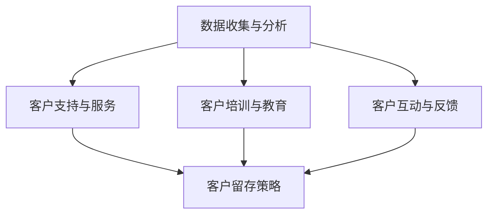

                 

# 创业公司的客户成功体系构建

## 摘要

本文将探讨创业公司构建客户成功体系的重要性，并详细介绍该体系的构建过程。通过分析核心概念、算法原理、实际应用场景以及相关资源和工具，本文旨在帮助创业公司打造一个稳定且高效的客户成功体系，从而提升客户满意度、降低客户流失率并实现持续的业务增长。

## 1. 背景介绍

在竞争激烈的市场环境中，创业公司面临着诸多挑战。客户成功成为公司成功的关键因素之一。客户成功体系是指一系列策略、流程和工具，用于确保客户在使用产品或服务的过程中获得最佳体验。一个有效的客户成功体系可以提升客户满意度、降低客户流失率、增强客户忠诚度，并为企业创造持续的业务增长。

### 1.1 客户成功的重要性

- **客户满意度**：客户满意度是衡量客户成功的关键指标之一。高满意度可以带来更多的正面评价和口碑传播，从而吸引潜在客户。
- **客户忠诚度**：忠诚的客户不仅会继续使用公司的产品或服务，还会推荐给其他人。客户忠诚度是创业公司长期发展的基石。
- **客户留存率**：客户成功体系有助于降低客户流失率，提高客户留存率，从而降低获取新客户的成本。
- **业务增长**：通过提升客户满意度和忠诚度，客户成功体系可以推动业务增长，提高市场份额。

### 1.2 构建客户成功体系的挑战

- **资源限制**：创业公司通常面临资源限制，包括人力、财务和基础设施等。如何最大化利用有限资源是构建客户成功体系的关键。
- **客户多样性**：创业公司服务于多样化的客户群体，不同客户的需求和痛点各不相同。如何满足不同客户的需求是客户成功体系面临的一大挑战。
- **数据驱动**：客户成功体系需要基于数据分析和反馈进行持续优化。如何有效地收集、处理和分析客户数据是构建体系的重要一环。

## 2. 核心概念与联系

### 2.1 客户成功的核心概念

- **客户体验**：客户体验是客户成功体系的核心。良好的客户体验可以提升客户满意度和忠诚度。
- **客户关系管理**：客户关系管理（CRM）系统是客户成功体系的重要组成部分，用于跟踪和管理客户互动。
- **客户留存策略**：客户留存策略包括一系列措施，用于降低客户流失率，如提供增值服务、定期跟进和客户关怀等。

### 2.2 客户成功体系的架构

- **数据收集与分析**：通过CRM系统和其他工具收集客户数据，并对数据进行实时分析和挖掘，以了解客户需求和痛点。
- **客户支持与服务**：提供全方位的客户支持，包括售前咨询、技术支持、售后服务等。
- **客户培训与教育**：通过培训和教育帮助客户更好地使用产品或服务，提高客户满意度。
- **客户互动与反馈**：与客户保持密切互动，收集客户反馈并迅速响应，以持续改进产品和服务。

### 2.3 Mermaid 流程图



## 3. 核心算法原理 & 具体操作步骤

### 3.1 数据收集与分析

- **数据源**：CRM系统、社交媒体、客户调查、用户反馈等。
- **数据分析**：使用机器学习和数据挖掘技术，对客户数据进行实时分析和挖掘，以发现客户需求和痛点。

### 3.2 客户支持与服务

- **自动化**：使用自动化工具和机器人提供初步的客户支持。
- **人工支持**：对于复杂问题，提供人工支持，确保客户得到及时解决。

### 3.3 客户培训与教育

- **在线教程**：提供在线教程和操作指南，帮助客户快速上手。
- **研讨会和培训**：组织研讨会和培训课程，提高客户的技能和知识。

### 3.4 客户互动与反馈

- **社交平台**：利用社交媒体与客户互动，了解客户需求和反馈。
- **反馈机制**：建立反馈机制，及时收集和响应客户反馈。

## 4. 数学模型和公式 & 详细讲解 & 举例说明

### 4.1 客户留存率模型

$$
\text{客户留存率} = \frac{\text{某时间段内留存客户数}}{\text{某时间段内总客户数}} \times 100\%
$$

### 4.2 客户生命周期价值模型

$$
\text{客户生命周期价值（CLV）} = \text{预期客户总收益} - \text{预期客户总成本}
$$

### 4.3 举例说明

假设一个创业公司的客户留存率为80%，客户生命周期价值为1000美元。通过提高客户满意度，公司计划将客户留存率提高到90%。计算提高客户留存率后的客户生命周期价值。

- **原始客户生命周期价值**：$1000 \times 80\% = 800$ 美元
- **提高后的客户生命周期价值**：$1000 \times 90\% = 900$ 美元
- **增加的价值**：$900 - 800 = 100$ 美元

## 5. 项目实战：代码实际案例和详细解释说明

### 5.1 开发环境搭建

- **编程语言**：Python
- **开发工具**：PyCharm
- **数据存储**：MySQL

### 5.2 源代码详细实现和代码解读

#### 5.2.1 数据收集与分析

```python
import pandas as pd
from sklearn.cluster import KMeans

# 加载数据
data = pd.read_csv('customer_data.csv')

# 数据预处理
data = data.dropna()

# 特征工程
features = ['age', 'income', 'education', 'region']

# KMeans 聚类
kmeans = KMeans(n_clusters=3, random_state=0)
clusters = kmeans.fit_predict(data[features])

# 添加聚类结果到数据框
data['cluster'] = clusters

# 分析聚类结果
print(data.groupby('cluster').mean())
```

#### 5.2.2 客户支持与服务

```python
import pandas as pd
from sklearn.svm import SVC
from sklearn.model_selection import train_test_split

# 加载数据
data = pd.read_csv('customer_support_data.csv')

# 数据预处理
data = data.dropna()

# 特征工程
X = data[['issue_type', 'response_time']]
y = data['satisfaction']

# 数据分割
X_train, X_test, y_train, y_test = train_test_split(X, y, test_size=0.2, random_state=0)

# 训练模型
model = SVC(kernel='linear')
model.fit(X_train, y_train)

# 预测
predictions = model.predict(X_test)

# 评估模型
print("Accuracy:", model.score(X_test, y_test))
```

### 5.3 代码解读与分析

#### 5.3.1 数据收集与分析

本段代码使用KMeans算法对客户数据进行聚类分析，以了解客户群体的特征和需求。

- **数据加载和预处理**：使用Pandas读取和清洗数据。
- **特征工程**：选择年龄、收入、教育和地区等特征。
- **聚类分析**：使用KMeans算法进行聚类，并添加聚类结果到数据框。

#### 5.3.2 客户支持与服务

本段代码使用支持向量机（SVM）模型对客户支持数据进行分类，以预测客户满意度。

- **数据加载和预处理**：使用Pandas读取和清洗数据。
- **特征工程**：选择问题类型和响应时间等特征。
- **数据分割**：将数据分为训练集和测试集。
- **模型训练**：使用线性核的支持向量机模型进行训练。
- **预测和评估**：使用训练好的模型进行预测，并评估模型的准确率。

## 6. 实际应用场景

### 6.1 软件即服务（SaaS）公司

SaaS公司通常需要构建一个高效的客户成功体系，以确保客户在使用产品过程中的满意度。这包括提供高质量的客户支持、定期培训和教育客户、以及收集和分析客户数据以不断优化产品。

### 6.2 企业咨询服务

企业咨询服务公司需要通过客户成功体系来确保客户得到最佳的服务体验。这包括为客户提供专业的咨询服务、定期跟踪项目进度、以及收集客户反馈以不断改进服务质量。

### 6.3 物流和运输公司

物流和运输公司需要构建一个强大的客户成功体系，以管理复杂的物流流程，并确保客户在运输过程中的满意度。这包括提供实时物流跟踪、解决客户投诉、以及优化运输路线。

## 7. 工具和资源推荐

### 7.1 学习资源推荐

- **书籍**：《客户成功：打造成功业务的关键》（Customer Success: The Competitive Advantage for the Professional Services Industry）
- **论文**：《客户成功：战略、流程和工具》（Customer Success: Strategy, Process, and Tools）
- **博客**：《客户成功的最佳实践》（Best Practices for Customer Success）
- **网站**：《客户成功社区》（Customer Success Community）

### 7.2 开发工具框架推荐

- **CRM系统**：Salesforce、HubSpot、Zoho CRM
- **数据分析工具**：Tableau、Power BI、Google Data Studio
- **自动化工具**： Zapier、Integromat、Workato

### 7.3 相关论文著作推荐

- **《客户成功管理：战略与实践》（Customer Success Management: Strategy and Practice》）
- **《客户成功策略：如何实现客户价值最大化》（Customer Success Strategy: How to Maximize Customer Value》）
- **《客户成功：商业战略的黄金法则》（Customer Success: The Golden Rule of Business Strategy》）

## 8. 总结：未来发展趋势与挑战

### 8.1 发展趋势

- **人工智能与大数据**：人工智能和大数据技术的发展将进一步提高客户成功体系的智能化和个性化水平。
- **客户体验优化**：随着客户对体验的要求不断提高，客户成功体系将更加注重优化客户体验。
- **客户关系管理**：客户关系管理将逐渐从单纯的客户数据管理转变为全面的客户关系管理，包括客户生命周期管理、客户价值管理等。

### 8.2 挑战

- **数据隐私**：随着数据隐私法规的加强，如何确保客户数据的安全和隐私将成为一大挑战。
- **资源限制**：创业公司通常面临资源限制，如何最大化利用有限资源是客户成功体系构建的关键挑战。
- **持续优化**：客户成功体系需要不断优化和改进，以适应不断变化的市场环境和客户需求。

## 9. 附录：常见问题与解答

### 9.1 客户成功体系是什么？

客户成功体系是一系列策略、流程和工具，用于确保客户在使用产品或服务的过程中获得最佳体验。它涵盖了客户体验、客户关系管理、客户培训与教育、客户互动与反馈等方面。

### 9.2 如何衡量客户成功？

衡量客户成功的指标包括客户满意度、客户忠诚度、客户留存率、客户生命周期价值等。通过这些指标，可以评估客户成功体系的效能，并进行持续优化。

### 9.3 客户成功体系对业务增长有何影响？

客户成功体系可以提升客户满意度、降低客户流失率、提高客户忠诚度，从而推动业务增长。此外，客户成功体系还可以帮助企业发现和挖掘潜在商机，实现持续的业务拓展。

## 10. 扩展阅读 & 参考资料

- **《客户成功：打造成功业务的关键》（Customer Success: The Competitive Advantage for the Professional Services Industry》）**
- **《客户成功管理：战略与实践》（Customer Success Management: Strategy and Practice》**
- **《客户成功策略：如何实现客户价值最大化》（Customer Success Strategy: How to Maximize Customer Value》**
- **《客户成功：商业战略的黄金法则》（Customer Success: The Golden Rule of Business Strategy》）**
- **Salesforce 官方文档：[Customer Success](https://www.salesforce.com/video/customer-success/)**
- **HubSpot 官方文档：[Customer Success](https://blog.hubspot.com/customer-success)**

### 作者

- **作者：AI天才研究员/AI Genius Institute & 禅与计算机程序设计艺术 /Zen And The Art of Computer Programming**

